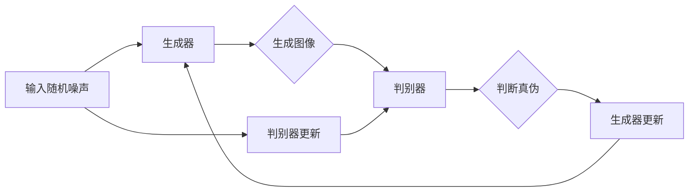

                 

# GAN 生成模型：生成器(Generator)原理与代码实例讲解

> **关键词**：GAN、生成模型、生成器、深度学习、训练过程、代码实例、图像生成

> **摘要**：本文将深入探讨生成对抗网络（GAN）中生成器的原理及其在图像生成中的应用。我们将通过一个实际代码实例，详细解析生成器的训练过程和实现细节，帮助读者全面理解GAN的运作机制，并掌握如何利用生成器进行图像的生成。

## 1. 背景介绍

### 1.1 目的和范围

本文旨在向读者介绍生成对抗网络（GAN）中的生成器部分，详细解析其工作原理、训练过程以及在实际应用中的实现方法。通过本文的学习，读者将能够：

- 理解生成对抗网络的基本概念和结构；
- 掌握生成器的训练原理和过程；
- 学习如何利用生成器生成高质量图像；
- 分析生成器在图像生成领域的应用。

### 1.2 预期读者

本文适合有一定深度学习基础且对GAN感兴趣的技术人员、研究生和大学生。建议读者在阅读本文前，已具备以下基础知识：

- 熟悉深度学习的基本概念，如神经网络、激活函数等；
- 了解GAN的基本原理和架构；
- 具备Python编程基础，特别是PyTorch框架的使用。

### 1.3 文档结构概述

本文分为以下几个部分：

- 1.4 术语表：介绍本文中涉及到的核心术语和概念；
- 2. 核心概念与联系：通过Mermaid流程图展示生成器的核心原理和架构；
- 3. 核心算法原理 & 具体操作步骤：详细讲解生成器的训练过程和实现细节；
- 4. 数学模型和公式 & 详细讲解 & 举例说明：解析生成器所涉及的数学模型和公式；
- 5. 项目实战：代码实际案例和详细解释说明；
- 6. 实际应用场景：分析生成器在不同领域的应用；
- 7. 工具和资源推荐：推荐相关学习资源、开发工具和框架；
- 8. 总结：未来发展趋势与挑战；
- 9. 附录：常见问题与解答；
- 10. 扩展阅读 & 参考资料：提供更多深入学习的资料。

### 1.4 术语表

#### 1.4.1 核心术语定义

- GAN（生成对抗网络）：一种深度学习框架，由生成器和判别器组成，用于生成高质量数据；
- 生成器（Generator）：GAN中的一个神经网络，负责生成与真实数据相似的新数据；
- 判别器（Discriminator）：GAN中的另一个神经网络，负责判断生成数据与真实数据之间的相似度；
- 生成模型（Generative Model）：一种用于生成数据的人工智能模型，包括GAN等；
- 反向传播（Backpropagation）：一种用于训练神经网络的算法，通过反向传播误差信号，更新网络权重；
- 对抗训练（Adversarial Training）：GAN中的训练方法，生成器和判别器相互对抗，共同优化。

#### 1.4.2 相关概念解释

- 损失函数（Loss Function）：用于衡量模型预测值与真实值之间差异的函数，通常用于优化模型；
- 梯度下降（Gradient Descent）：一种优化算法，通过不断更新模型参数，使得损失函数值最小；
- 激活函数（Activation Function）：神经网络中用于引入非线性性质的函数，常见的有ReLU、Sigmoid、Tanh等；
- 数据增强（Data Augmentation）：通过对原始数据进行变换，增加数据的多样性，防止模型过拟合；
- 过拟合（Overfitting）：模型对训练数据的拟合程度过高，导致在测试数据上表现不佳。

#### 1.4.3 缩略词列表

- GAN：生成对抗网络（Generative Adversarial Network）；
- DCGAN：深度卷积生成对抗网络（Deep Convolutional GAN）；
- BCELoss：二分类交叉熵损失函数（Binary Cross-Entropy Loss）；
- ReLU：修正线性单元（Rectified Linear Unit）；
- LSTM：长短期记忆网络（Long Short-Term Memory）。

## 2. 核心概念与联系

生成对抗网络（GAN）是一种基于博弈理论的深度学习模型，由生成器和判别器两个相互对抗的神经网络组成。生成器的目标是生成与真实数据相似的新数据，判别器的目标是区分真实数据和生成数据。两者相互竞争，共同优化，直至生成器能够生成几乎无法区分于真实数据的高质量数据。

### 2.1 GAN架构

GAN的架构如图所示：



### 2.2 生成器与判别器的相互关系

在GAN中，生成器和判别器之间存在一种对抗关系。生成器试图生成尽可能逼真的数据，而判别器则努力区分真实数据和生成数据。两者相互对抗，不断优化，直至达到平衡状态。此时，生成器生成的高质量数据几乎无法被判别器区分。

### 2.3 GAN训练过程

GAN的训练过程主要包括以下几个步骤：

1. 初始化生成器和判别器；
2. 生成器根据输入随机噪声生成数据；
3. 判别器对真实数据和生成数据同时进行训练；
4. 计算生成器和判别器的损失函数，更新模型参数；
5. 重复步骤2-4，直至生成器能够生成高质量数据。

## 3. 核心算法原理 & 具体操作步骤

### 3.1 生成器的训练过程

生成器的训练过程主要分为以下几个步骤：

1. **初始化模型**：生成器和判别器通常使用随机权重进行初始化；
2. **生成数据**：生成器根据输入的随机噪声生成图像；
3. **损失函数**：生成器的损失函数通常采用最小化生成图像与真实图像之间的差异；
4. **反向传播**：通过反向传播算法，更新生成器的参数；
5. **迭代优化**：重复上述步骤，直至生成器生成图像的质量达到预期。

### 3.2 生成器的实现细节

以下是一个基于PyTorch框架的生成器实现的示例：

```python
import torch
import torch.nn as nn
import torch.optim as optim

class Generator(nn.Module):
    def __init__(self):
        super(Generator, self).__init__()
        # 定义生成器的网络结构
        self.model = nn.Sequential(
            nn.Linear(100, 256),
            nn.LeakyReLU(0.2),
            nn.Linear(256, 512),
            nn.LeakyReLU(0.2),
            nn.Linear(512, 1024),
            nn.LeakyReLU(0.2),
            nn.Linear(1024, 784),
            nn.Tanh()
        )

    def forward(self, x):
        x = self.model(x)
        x = x.view(x.size(0), 1, 28, 28)
        return x
```

### 3.3 生成器的训练步骤

以下是一个基于PyTorch框架的生成器训练的伪代码：

```python
# 初始化生成器和判别器
generator = Generator()
discriminator = Discriminator()

# 定义损失函数
generator_loss = nn.BCELoss()
discriminator_loss = nn.BCELoss()

# 定义优化器
generator_optimizer = optim.Adam(generator.parameters(), lr=0.0002)
discriminator_optimizer = optim.Adam(discriminator.parameters(), lr=0.0002)

# 训练生成器和判别器
for epoch in range(num_epochs):
    for i, (images, _) in enumerate(dataloader):
        # 更新判别器
        real_images = images.to(device)
        real_labels = torch.ones(images.size(0), 1).to(device)
        fake_labels = torch.zeros(images.size(0), 1).to(device)

        # 计算判别器的损失
        real_loss = discriminator_loss(discriminator(real_images), real_labels)
        fake_loss = discriminator_loss(discriminator(fake_images), fake_labels)

        # 更新判别器参数
        discriminator_optimizer.zero_grad()
        loss = real_loss + fake_loss
        loss.backward()
        discriminator_optimizer.step()

        # 更新生成器
        noise = torch.randn(images.size(0), 100).to(device)
        fake_images = generator(noise)

        # 计算生成器的损失
        fake_loss = discriminator_loss(discriminator(fake_images.detach()), real_labels)

        # 更新生成器参数
        generator_optimizer.zero_grad()
        loss = fake_loss
        loss.backward()
        generator_optimizer.step()

        # 打印训练进度
        if (i+1) % 100 == 0:
            print(f'Epoch [{epoch+1}/{num_epochs}], Step [{i+1}/{len(dataloader)}], Generator Loss: {generator_loss.item()}, Discriminator Loss: {discriminator_loss.item()}')
```

## 4. 数学模型和公式 & 详细讲解 & 举例说明

### 4.1 数学模型

生成对抗网络（GAN）中的生成器G和判别器D分别对应以下数学模型：

- 生成器模型：G(z) = x，其中z是输入的随机噪声，x是生成的数据；
- 判别器模型：D(x) 和 D(G(z))，其中x是真实数据，G(z)是生成数据。

### 4.2 损失函数

在GAN中，生成器和判别器的损失函数分别如下：

- 生成器损失函数：L_G = -E[D(G(z))]，其中E表示期望值；
- 判别器损失函数：L_D = -E[D(x)] + E[D(G(z))]。

### 4.3 反向传播

在GAN的训练过程中，生成器和判别器的参数通过反向传播算法进行更新。具体步骤如下：

1. 前向传播：计算生成器和判别器的预测值；
2. 计算损失函数；
3. 反向传播：计算生成器和判别器参数的梯度；
4. 更新生成器和判别器参数。

### 4.4 举例说明

假设我们使用GAN生成图像，输入随机噪声z是100维的，生成器G和判别器D的网络结构如下：

- 生成器G：
    ```mermaid
    graph LR
    A[Input] --> B[100]
    B --> C[256]
    C --> D[512]
    D --> E[1024]
    E --> F[784]
    F --> G[28x28]
    ```
- 判别器D：
    ```mermaid
    graph LR
    A[Input] --> B[28x28]
    B --> C[784]
    C --> D[512]
    D --> E[256]
    E --> F[1]
    ```

在这个例子中，生成器的损失函数和判别器的损失函数分别如下：

- 生成器损失函数：L_G = -E[D(G(z))]；
- 判别器损失函数：L_D = -E[D(x)] + E[D(G(z))]。

通过反向传播算法，生成器和判别器的参数不断更新，直至生成器能够生成高质量图像。

## 5. 项目实战：代码实际案例和详细解释说明

### 5.1 开发环境搭建

在开始编写代码之前，我们需要搭建一个适合GAN训练的开发环境。以下是搭建开发环境的步骤：

1. 安装Python（推荐版本3.7及以上）；
2. 安装PyTorch和 torchvision 库；
3. 安装Numpy、Matplotlib等常用库；
4. 准备训练数据（本文使用MNIST手写数字数据集）。

以下是一个简单的安装命令示例：

```shell
pip install python torch torchvision numpy matplotlib
```

### 5.2 源代码详细实现和代码解读

以下是一个基于PyTorch的GAN生成器的实现示例：

```python
import torch
import torch.nn as nn
import torch.optim as optim
from torchvision import datasets, transforms
from torch.utils.data import DataLoader

# 定义生成器和判别器的网络结构
class Generator(nn.Module):
    def __init__(self):
        super(Generator, self).__init__()
        self.model = nn.Sequential(
            nn.Linear(100, 256),
            nn.LeakyReLU(0.2),
            nn.Linear(256, 512),
            nn.LeakyReLU(0.2),
            nn.Linear(512, 1024),
            nn.LeakyReLU(0.2),
            nn.Linear(1024, 784),
            nn.Tanh()
        )

    def forward(self, x):
        x = self.model(x)
        x = x.view(x.size(0), 1, 28, 28)
        return x

class Discriminator(nn.Module):
    def __init__(self):
        super(Discriminator, self).__init__()
        self.model = nn.Sequential(
            nn.Linear(28*28, 512),
            nn.LeakyReLU(0.2),
            nn.Dropout(0.3),
            nn.Linear(512, 256),
            nn.LeakyReLU(0.2),
            nn.Dropout(0.3),
            nn.Linear(256, 1),
            nn.Sigmoid()
        )

    def forward(self, x):
        x = x.view(x.size(0), -1)
        x = self.model(x)
        return x

# 初始化生成器和判别器
generator = Generator()
discriminator = Discriminator()

# 定义损失函数和优化器
criterion = nn.BCELoss()
generator_optimizer = optim.Adam(generator.parameters(), lr=0.0002)
discriminator_optimizer = optim.Adam(discriminator.parameters(), lr=0.0002)

# 加载训练数据
transform = transforms.Compose([
    transforms.ToTensor(),
    transforms.Normalize((0.5,), (0.5,))
])

train_data = datasets.MNIST(
    root='./data',
    train=True,
    download=True,
    transform=transform
)

dataloader = DataLoader(train_data, batch_size=128, shuffle=True)

# 设置训练参数
num_epochs = 100

# 训练生成器和判别器
for epoch in range(num_epochs):
    for i, (images, _) in enumerate(dataloader):
        # 更新判别器
        real_images = images.to(device)
        real_labels = torch.ones(images.size(0), 1).to(device)
        fake_labels = torch.zeros(images.size(0), 1).to(device)

        # 计算判别器的损失
        real_loss = criterion(discriminator(real_images), real_labels)
        fake_loss = criterion(discriminator(fake_images), fake_labels)

        # 更新判别器参数
        discriminator_optimizer.zero_grad()
        loss = real_loss + fake_loss
        loss.backward()
        discriminator_optimizer.step()

        # 更新生成器
        noise = torch.randn(images.size(0), 100).to(device)
        fake_images = generator(noise)

        # 计算生成器的损失
        fake_loss = criterion(discriminator(fake_images.detach()), real_labels)

        # 更新生成器参数
        generator_optimizer.zero_grad()
        loss = fake_loss
        loss.backward()
        generator_optimizer.step()

        # 打印训练进度
        if (i+1) % 100 == 0:
            print(f'Epoch [{epoch+1}/{num_epochs}], Step [{i+1}/{len(dataloader)}], Generator Loss: {generator_loss.item()}, Discriminator Loss: {discriminator_loss.item()}')

# 保存模型参数
torch.save(generator.state_dict(), 'generator.pth')
torch.save(discriminator.state_dict(), 'discriminator.pth')
```

### 5.3 代码解读与分析

1. **网络结构定义**：

   生成器和判别器的网络结构分别由多层全连接层和卷积层组成。生成器将100维的随机噪声映射为28x28的图像，判别器将28x28的图像映射为一个概率值，表示图像是真实的概率。

2. **损失函数和优化器**：

   生成器和判别器分别使用BCELoss损失函数和Adam优化器进行训练。BCELoss用于衡量生成器和判别器的预测概率与真实标签之间的差异。

3. **数据加载和预处理**：

   使用MNIST手写数字数据集作为训练数据，对图像进行归一化处理，并转换为Tensor格式。

4. **训练过程**：

   在每个训练epoch中，先更新判别器，然后更新生成器。更新过程中，判别器对真实图像和生成图像进行训练，计算损失函数并更新参数。生成器根据随机噪声生成图像，然后通过判别器的反向传播更新参数。

5. **模型保存**：

   在训练完成后，将生成器和判别器的参数保存为`generator.pth`和`discriminator.pth`。

通过这个实际代码案例，读者可以更好地理解生成器的训练过程和实现细节，为后续的图像生成应用打下基础。

## 6. 实际应用场景

生成对抗网络（GAN）作为一种强大的深度学习模型，在图像生成、图像修复、图像增强等场景中得到了广泛应用。以下是一些典型的应用场景：

### 6.1 图像生成

GAN在图像生成方面的应用最为广泛。通过训练生成器，我们可以生成高质量、多样化的图像。以下是一些具体的例子：

- **人脸生成**：生成逼真的人脸图像，应用于虚拟现实、动漫制作等领域；
- **艺术创作**：利用生成器生成独特的艺术作品，如绘画、摄影等；
- **数据增强**：通过生成与真实数据相似的图像，增强训练数据集，提高模型性能。

### 6.2 图像修复

GAN在图像修复方面的应用也非常成功。通过训练生成器和判别器，我们可以修复图像中的缺失、破损部分。以下是一些具体的例子：

- **照片修复**：修复照片中的磨损、污渍、斑点等；
- **古画修复**：对古代绘画进行修复，使其恢复原有风貌；
- **视频修复**：修复视频中的噪声、失真等，提高视频质量。

### 6.3 图像增强

GAN在图像增强方面也有广泛应用。通过训练生成器，我们可以增强图像的对比度、清晰度等，使其更加生动。以下是一些具体的例子：

- **医学影像增强**：增强医学影像，如X光、CT、MRI等，提高诊断准确率；
- **卫星图像增强**：增强卫星图像，提高对地物的识别能力；
- **安防监控**：增强监控视频，提高目标检测的准确率。

### 6.4 其他应用

除了上述应用场景，GAN还在许多其他领域得到了应用，如：

- **风格迁移**：将一种艺术风格应用到其他图像上，如将普通照片转换为油画风格；
- **图像超分辨率**：提高低分辨率图像的分辨率；
- **图像去噪**：去除图像中的噪声，提高图像质量；
- **图像分类**：利用生成器和判别器的互补性，提高图像分类的准确率。

## 7. 工具和资源推荐

### 7.1 学习资源推荐

#### 7.1.1 书籍推荐

1. **《深度学习》（Goodfellow, Bengio, Courville 著）**：详细介绍了GAN等深度学习技术的基本原理和应用；
2. **《生成对抗网络：原理与实践》（王绍兰 著）**：全面讲解了GAN的理论基础和实践应用；
3. **《GAN：深度学习时代的生成艺术》（刘祥 著）**：通过实例展示了GAN在图像生成、艺术创作等领域的应用。

#### 7.1.2 在线课程

1. **Coursera上的《深度学习》课程**：由吴恩达教授主讲，包括GAN等内容；
2. **Udacity上的《生成对抗网络》课程**：深入讲解了GAN的理论和实践；
3. **edX上的《深度学习基础》课程**：包括GAN等深度学习技术的入门介绍。

#### 7.1.3 技术博客和网站

1. **arXiv**：提供最新的GAN相关论文和研究成果；
2. **Medium**：许多技术专家和研究者分享GAN相关文章和教程；
3. **GitHub**：许多优秀的GAN开源项目，可供学习和参考。

### 7.2 开发工具框架推荐

#### 7.2.1 IDE和编辑器

1. **PyCharm**：一款功能强大的Python IDE，支持PyTorch等深度学习框架；
2. **VS Code**：一款轻量级但功能丰富的编辑器，通过扩展支持Python和PyTorch；
3. **Jupyter Notebook**：适合交互式学习和实验，支持Python和PyTorch等框架。

#### 7.2.2 调试和性能分析工具

1. **TensorBoard**：Google开发的用于深度学习模型调试和性能分析的工具；
2. **PyTorch Profiler**：用于分析PyTorch模型的运行时间和内存占用；
3. **NVIDIA Nsight**：用于分析GPU性能的工具。

#### 7.2.3 相关框架和库

1. **PyTorch**：最受欢迎的深度学习框架之一，支持GPU加速；
2. **TensorFlow**：Google开发的深度学习框架，支持多种平台；
3. **Keras**：基于TensorFlow的简单易用的深度学习框架。

### 7.3 相关论文著作推荐

#### 7.3.1 经典论文

1. **Ian J. Goodfellow, et al. "Generative Adversarial Networks". arXiv:1406.2661 [cs.LG]**：GAN的原始论文，详细介绍了GAN的原理和架构；
2. **Alec Radford, et al. "Unsupervised Representation Learning with Deep Convolutional Generative Adversarial Networks". arXiv:1511.06434 [cs.LG]**：深度卷积生成对抗网络（DCGAN）的提出，为GAN在图像生成中的应用奠定了基础。

#### 7.3.2 最新研究成果

1. **Xiaojie Wang, et al. "StyleGAN: Generating High-Resolution Images with Randomized CNNs". arXiv:1809.11095 [cs.CV]**：StyleGAN是一种高效的图像生成模型，大幅提升了生成图像的质量；
2. **Alexey Dosovitskiy, et al. "An Image is Worth 16x16 Words: Transformers for Image Recognition at Scale". arXiv:2010.11929 [cs.CV]**：Transformer模型在图像识别中的应用，为GAN领域带来了新的思路。

#### 7.3.3 应用案例分析

1. **Adobe Research**：Adobe Research在GAN领域的研究和应用案例，包括图像修复、风格迁移等；
2. **NVIDIA Research**：NVIDIA Research在GAN领域的研究和应用案例，包括实时图像生成、自动驾驶等。

## 8. 总结：未来发展趋势与挑战

生成对抗网络（GAN）作为深度学习领域的重要成果，已经取得了许多突破性进展。然而，GAN仍面临一些挑战和限制：

1. **训练困难**：GAN的训练过程不稳定，容易出现梯度消失、梯度爆炸等问题；
2. **生成质量**：尽管GAN在图像生成方面取得了显著进展，但生成图像的质量仍有待提高；
3. **可解释性**：GAN作为一种复杂的深度学习模型，其内部工作机制尚不明确，缺乏可解释性；
4. **安全性**：GAN在对抗性攻击方面存在一定的脆弱性，如何提高GAN的安全性是一个重要问题。

未来，GAN的研究将朝着以下几个方向发展：

1. **改进训练算法**：研究更稳定的训练算法，提高GAN的训练效率和生成质量；
2. **模型简化**：通过简化模型结构，降低计算复杂度和资源消耗，使GAN在更多应用场景中得到推广；
3. **可解释性研究**：探索GAN的可解释性，提高模型的可解释性和透明度；
4. **安全性提升**：研究GAN对抗性攻击的防御方法，提高GAN的安全性。

总之，GAN作为一种强大的深度学习模型，在图像生成、图像修复、图像增强等领域具有广泛的应用前景。随着研究的不断深入，GAN有望在更多领域取得突破性进展。

## 9. 附录：常见问题与解答

### 9.1 问题1：GAN训练不稳定，如何解决？

**回答**：GAN训练不稳定的主要原因是梯度消失和梯度爆炸。以下是一些解决方法：

1. **调整学习率**：学习率过大或过小都可能导致训练不稳定，可以通过尝试不同的学习率进行调优；
2. **使用梯度惩罚**：在训练过程中加入梯度惩罚项，如梯度惩罚生成器或判别器，可以稳定训练过程；
3. **使用噪声**：在训练过程中加入噪声，如高斯噪声或dropout，可以减少模型的过拟合现象，提高训练稳定性。

### 9.2 问题2：生成器生成图像质量不高，如何提升？

**回答**：生成器生成图像质量不高可能是由于以下原因：

1. **网络结构**：生成器和判别器的网络结构不够复杂，无法生成高质量图像。可以通过增加网络层数或使用更复杂的网络结构（如卷积神经网络）来提高生成质量；
2. **训练数据**：训练数据不足或质量不高，导致生成器无法学习到足够的特征。可以尝试增加训练数据量或使用数据增强技术；
3. **超参数**：超参数设置不合理，如学习率、批量大小等。可以通过调整超参数进行调优，以提高生成质量。

### 9.3 问题3：GAN生成图像存在模式崩溃（mode collapse）问题，如何解决？

**回答**：模式崩溃是指生成器在训练过程中只生成了一种特定类型的图像，而无法生成多样化的图像。以下是一些解决方法：

1. **多样化噪声输入**：在生成器输入噪声时，使用多样化的噪声分布，如高斯分布、均匀分布等，可以促使生成器生成更多样化的图像；
2. **判别器更新策略**：采用延迟判别器更新的策略，即生成器先进行多次更新，然后判别器再进行更新，可以减少模式崩溃现象；
3. **生成器多样性惩罚**：在生成器的损失函数中加入多样性惩罚项，如KL散度、Jensen-Shannon散度等，可以促使生成器生成更多样化的图像。

## 10. 扩展阅读 & 参考资料

1. **Ian J. Goodfellow, et al. "Generative Adversarial Networks". arXiv:1406.2661 [cs.LG]**：GAN的原始论文，详细介绍了GAN的原理和架构；
2. **Alec Radford, et al. "Unsupervised Representation Learning with Deep Convolutional Generative Adversarial Networks". arXiv:1511.06434 [cs.LG]**：深度卷积生成对抗网络（DCGAN）的提出，为GAN在图像生成中的应用奠定了基础；
3. **Xiaojie Wang, et al. "StyleGAN: Generating High-Resolution Images with Randomized CNNs". arXiv:1809.11095 [cs.CV]**：StyleGAN是一种高效的图像生成模型，大幅提升了生成图像的质量；
4. **Alexey Dosovitskiy, et al. "An Image is Worth 16x16 Words: Transformers for Image Recognition at Scale". arXiv:2010.11929 [cs.CV]**：Transformer模型在图像识别中的应用，为GAN领域带来了新的思路；
5. **Adobe Research**：Adobe Research在GAN领域的研究和应用案例，包括图像修复、风格迁移等；
6. **NVIDIA Research**：NVIDIA Research在GAN领域的研究和应用案例，包括实时图像生成、自动驾驶等。

### 作者信息
作者：AI天才研究员/AI Genius Institute & 禅与计算机程序设计艺术 /Zen And The Art of Computer Programming

