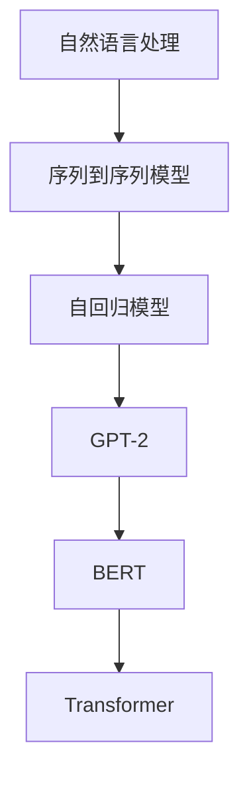

                 

# GPT-2原理与代码实例讲解

> **关键词：** GPT-2，自然语言处理，生成模型，Transformer，深度学习，Python代码实例

> **摘要：** 本文将深入讲解GPT-2（Generative Pre-trained Transformer 2）的原理，包括其架构、训练过程以及核心算法。我们将通过详细的代码实例，演示如何使用Python搭建和训练一个GPT-2模型。此外，文章还将探讨GPT-2在实际应用中的使用场景，并提供相关工具和资源的推荐，以帮助读者深入学习和实践。

## 1. 背景介绍

### 1.1 目的和范围

本文旨在为广大对自然语言处理（NLP）和深度学习技术感兴趣的读者，提供一份关于GPT-2的全面指南。我们不仅会深入解释GPT-2的工作原理，还会提供实际的代码实例，帮助读者理解和复现这一强大的语言模型。

### 1.2 预期读者

- 对NLP和深度学习有初步了解的读者
- 想要深入理解Transformer架构的工程师和研究员
- 想要在实际项目中应用GPT-2的从业者

### 1.3 文档结构概述

本文分为以下几个部分：

1. 背景介绍：介绍文章的目的、预期读者和结构。
2. 核心概念与联系：介绍GPT-2的核心概念及其与其他模型的联系。
3. 核心算法原理 & 具体操作步骤：讲解GPT-2的训练和预测过程。
4. 数学模型和公式 & 详细讲解 & 举例说明：解析GPT-2背后的数学模型。
5. 项目实战：通过Python代码实例展示GPT-2的实际应用。
6. 实际应用场景：讨论GPT-2在不同领域的应用。
7. 工具和资源推荐：推荐学习资源和开发工具。
8. 总结：展望GPT-2的发展趋势和挑战。
9. 附录：常见问题与解答。
10. 扩展阅读 & 参考资料：提供进一步的阅读材料和参考文献。

### 1.4 术语表

#### 1.4.1 核心术语定义

- **GPT-2**：一种基于Transformer架构的预训练语言模型。
- **Transformer**：一种用于处理序列数据的新型神经网络架构。
- **自回归模型**：一种生成模型，通过模型预测序列中下一个元素。
- **BERT**：一种类似GPT-2的预训练语言模型，但采用不同架构。
- **Token**：文本中的一个单词或符号，通常用于序列处理。

#### 1.4.2 相关概念解释

- **预训练**：在特定任务之前，使用大规模数据对模型进行训练的过程。
- **序列到序列模型**：将一个序列映射到另一个序列的模型。
- **词嵌入**：将单词映射到固定大小的向量空间。

#### 1.4.3 缩略词列表

- **NLP**：自然语言处理
- **AI**：人工智能
- **DL**：深度学习
- **GPU**：图形处理器

## 2. 核心概念与联系

在深入了解GPT-2之前，我们需要先了解一些核心概念和与之相关的模型。以下是一个简化的Mermaid流程图，展示了这些概念和模型之间的联系：



### 2.1 自然语言处理

自然语言处理（NLP）是人工智能（AI）的一个分支，旨在使计算机能够理解和处理人类语言。NLP应用广泛，包括机器翻译、情感分析、文本摘要等。

### 2.2 序列到序列模型

序列到序列（Seq2Seq）模型是一种将一个序列映射到另一个序列的模型。在NLP中，输入和输出通常是文本序列。Seq2Seq模型通常包括编码器（Encoder）和解码器（Decoder）两个部分。

### 2.3 自回归模型

自回归模型（Autoregressive Model）是一种生成模型，通过模型预测序列中下一个元素。在NLP中，自回归模型常用于文本生成任务，如语言模型和文本摘要。

### 2.4 GPT-2

GPT-2是一种基于Transformer架构的自回归语言模型。与传统的RNN和LSTM模型相比，Transformer模型在处理长序列数据时更加高效和准确。GPT-2通过在大规模语料库上进行预训练，能够生成流畅且语义丰富的文本。

### 2.5 BERT

BERT（Bidirectional Encoder Representations from Transformers）是一种双向Transformer模型，用于预训练语言表示。BERT在许多NLP任务上取得了显著成果，包括问答系统、文本分类和命名实体识别。

### 2.6 Transformer

Transformer是一种用于处理序列数据的新型神经网络架构，由Google在2017年提出。与传统的循环神经网络（RNN）相比，Transformer通过自注意力机制（Self-Attention）实现了对序列中每个元素的全局关注，从而提高了模型的表达能力。

## 3. 核心算法原理 & 具体操作步骤

在了解GPT-2的基本概念和与其他模型的联系后，我们将深入探讨其核心算法原理，并详细讲解其训练和预测过程。

### 3.1 GPT-2的架构

GPT-2的核心架构基于Transformer模型，包括以下几个关键部分：

1. **输入层**：将文本序列转换为词嵌入（Word Embeddings）。
2. **Transformer层**：采用多头自注意力机制（Multi-Head Self-Attention）和前馈神经网络（Feedforward Neural Network），对序列数据进行处理。
3. **输出层**：将处理后的序列数据映射到单词的概率分布。

### 3.2 训练过程

GPT-2的训练过程主要包括以下几个步骤：

1. **预训练**：在大规模语料库上使用自回归方式对模型进行预训练，优化模型的参数。
2. **微调**：在特定任务数据集上对模型进行微调，以适应特定任务的需求。

### 3.3 预测过程

GPT-2的预测过程如下：

1. **初始化输入**：将输入文本序列转换为词嵌入。
2. **前向传播**：通过Transformer层处理输入序列，生成中间表示。
3. **输出层预测**：将中间表示映射到单词的概率分布，并选择概率最大的单词作为输出。
4. **更新输入**：将输出单词添加到输入序列，重复上述过程。

### 3.4 伪代码

以下是一个简化的伪代码，描述了GPT-2的训练和预测过程：

```python
# GPT-2训练过程伪代码
def train_gpt2(dataset, learning_rate, num_epochs):
    # 初始化模型参数
    model = initialize_model()
    # 预训练模型
    for epoch in range(num_epochs):
        for batch in dataset:
            # 前向传播
            output = model(batch)
            # 计算损失
            loss = compute_loss(output, batch)
            # 反向传播
            model.backward(loss)
            # 更新参数
            model.update_params(learning_rate)
    return model

# GPT-2预测过程伪代码
def predict_gpt2(model, input_sequence):
    # 初始化输入
    input_embedding = embed(input_sequence)
    # 前向传播
    output_distribution = model(input_embedding)
    # 选择概率最大的单词
    predicted_word = select_top_word(output_distribution)
    # 更新输入序列
    input_sequence.append(predicted_word)
    return input_sequence
```

### 3.5 训练和预测步骤详解

1. **数据预处理**：将输入文本序列转换为词嵌入，通常使用预训练的词嵌入模型（如GloVe或Word2Vec）。
2. **初始化模型**：根据GPT-2的架构，初始化模型的参数，包括嵌入层、Transformer层和输出层。
3. **预训练**：在大规模语料库上，使用自回归方式对模型进行预训练，优化模型的参数。预训练过程中，模型通过前向传播和反向传播不断更新参数。
4. **微调**：在特定任务数据集上，对模型进行微调，以适应特定任务的需求。微调过程中，模型继续通过前向传播和反向传播更新参数。
5. **预测**：使用微调后的模型进行预测，输入一个文本序列，输出一个概率分布，选择概率最大的单词作为输出。重复这个过程，生成文本序列。

## 4. 数学模型和公式 & 详细讲解 & 举例说明

在了解GPT-2的核心算法原理后，我们将进一步探讨其背后的数学模型和公式，并提供详细的讲解和举例说明。

### 4.1 自注意力机制

自注意力机制（Self-Attention）是Transformer模型的核心组件，用于处理序列数据。自注意力机制通过计算序列中每个元素之间的相似性，实现对序列的全局关注。

公式：

$$
Attention(Q, K, V) = \frac{softmax(\frac{QK^T}{\sqrt{d_k}})}{V}
$$

其中，$Q$、$K$和$V$分别表示查询（Query）、键（Key）和值（Value）向量，$d_k$表示键向量的维度。

举例说明：

假设序列中有3个元素，其键向量、查询向量和值向量分别为：

$$
K = \begin{bmatrix}
k_1 \\
k_2 \\
k_3
\end{bmatrix}, \quad Q = \begin{bmatrix}
q_1 \\
q_2 \\
q_3
\end{bmatrix}, \quad V = \begin{bmatrix}
v_1 \\
v_2 \\
v_3
\end{bmatrix}
$$

计算自注意力分数：

$$
\frac{QK^T}{\sqrt{d_k}} = \begin{bmatrix}
q_1k_1 + q_2k_2 + q_3k_3 \\
q_1k_1 + q_2k_2 + q_3k_3 \\
q_1k_1 + q_2k_2 + q_3k_3
\end{bmatrix}
$$

然后，通过softmax函数计算注意力权重：

$$
Attention(Q, K, V) = \begin{bmatrix}
\frac{q_1k_1 + q_2k_2 + q_3k_3}{\sum_{i=1}^3 (q_1k_1 + q_2k_2 + q_3k_3)} \\
\frac{q_1k_1 + q_2k_2 + q_3k_3}{\sum_{i=1}^3 (q_1k_1 + q_2k_2 + q_3k_3)} \\
\frac{q_1k_1 + q_2k_2 + q_3k_3}{\sum_{i=1}^3 (q_1k_1 + q_2k_2 + q_3k_3)}
\end{bmatrix}
$$

最后，计算自注意力输出：

$$
\text{Output} = \sum_{i=1}^3 \frac{q_1k_1 + q_2k_2 + q_3k_3}{\sum_{i=1}^3 (q_1k_1 + q_2k_2 + q_3k_3)} \cdot v_i
$$

### 4.2 Transformer层

Transformer层由多头自注意力机制（Multi-Head Self-Attention）和前馈神经网络（Feedforward Neural Network）组成。多头自注意力机制通过多个自注意力模块，提高模型的表示能力。

公式：

$$
\text{MultiHead}(Q, K, V) = \text{Concat}(\text{head}_1, ..., \text{head}_h)W^O
$$

其中，$h$表示头数，$W^O$表示输出权重。

举例说明：

假设有2个头，其查询向量、键向量和值向量分别为：

$$
Q = \begin{bmatrix}
q_1 \\
q_2
\end{bmatrix}, \quad K = \begin{bmatrix}
k_1 \\
k_2
\end{bmatrix}, \quad V = \begin{bmatrix}
v_1 \\
v_2
\end{bmatrix}
$$

计算两个头的自注意力输出：

$$
\text{head}_1 = \text{Attention}(Q, K, V) = \begin{bmatrix}
\frac{q_1k_1 + q_2k_2}{\sum_{i=1}^2 (q_1k_1 + q_2k_2)} \\
\frac{q_1k_1 + q_2k_2}{\sum_{i=1}^2 (q_1k_1 + q_2k_2)}
\end{bmatrix}
$$

$$
\text{head}_2 = \text{Attention}(Q, K, V) = \begin{bmatrix}
\frac{q_1k_2 + q_2k_2}{\sum_{i=1}^2 (q_1k_2 + q_2k_2)} \\
\frac{q_1k_2 + q_2k_2}{\sum_{i=1}^2 (q_1k_2 + q_2k_2)}
\end{bmatrix}
$$

然后，将两个头的输出拼接并乘以输出权重：

$$
\text{MultiHead}(Q, K, V) = \begin{bmatrix}
\frac{q_1k_1 + q_2k_2}{\sum_{i=1}^2 (q_1k_1 + q_2k_2)} & \frac{q_1k_2 + q_2k_2}{\sum_{i=1}^2 (q_1k_2 + q_2k_2)} \\
\frac{q_1k_1 + q_2k_2}{\sum_{i=1}^2 (q_1k_1 + q_2k_2)} & \frac{q_1k_2 + q_2k_2}{\sum_{i=1}^2 (q_1k_2 + q_2k_2)}
\end{bmatrix}W^O
$$

### 4.3 前馈神经网络

前馈神经网络（Feedforward Neural Network）用于对自注意力机制的输出进行进一步处理。它由两个全连接层组成，一个激活函数（如ReLU）和一个输出层。

公式：

$$
\text{FFN}(x) = \text{ReLU}(W_2 \cdot \text{ReLU}(W_1 \cdot x))
$$

其中，$W_1$和$W_2$分别表示两个全连接层的权重。

举例说明：

假设输入序列为：

$$
x = \begin{bmatrix}
x_1 \\
x_2 \\
\vdots \\
x_n
\end{bmatrix}
$$

计算前馈神经网络的输出：

$$
\text{FFN}(x) = \text{ReLU}(W_2 \cdot \text{ReLU}(W_1 \cdot x)) = \begin{bmatrix}
\text{ReLU}(W_2 \cdot \text{ReLU}(W_1 \cdot x_1)) \\
\text{ReLU}(W_2 \cdot \text{ReLU}(W_1 \cdot x_2)) \\
\vdots \\
\text{ReLU}(W_2 \cdot \text{ReLU}(W_1 \cdot x_n))
\end{bmatrix}
$$

### 4.4 模型参数更新

在训练过程中，通过反向传播算法不断更新模型参数。反向传播算法利用梯度下降（Gradient Descent）或其变体（如Adam优化器），优化模型参数。

公式：

$$
\theta = \theta - \alpha \cdot \nabla_\theta J(\theta)
$$

其中，$\theta$表示模型参数，$J(\theta)$表示损失函数，$\alpha$表示学习率。

举例说明：

假设损失函数为：

$$
J(\theta) = \frac{1}{2} \sum_{i=1}^n (y_i - \hat{y}_i)^2
$$

其中，$y_i$表示真实标签，$\hat{y}_i$表示模型预测。

计算损失函数关于模型参数的梯度：

$$
\nabla_\theta J(\theta) = \begin{bmatrix}
\frac{\partial J}{\partial \theta_1} \\
\frac{\partial J}{\partial \theta_2} \\
\vdots \\
\frac{\partial J}{\partial \theta_n}
\end{bmatrix}
$$

然后，通过梯度下降更新模型参数：

$$
\theta = \theta - \alpha \cdot \nabla_\theta J(\theta)
$$

## 5. 项目实战：代码实际案例和详细解释说明

在本节中，我们将通过一个实际的Python代码案例，展示如何搭建和训练一个GPT-2模型。我们将使用著名的Python深度学习库——TensorFlow，以及高层次的Keras API来简化代码的编写和调试。

### 5.1 开发环境搭建

在开始之前，请确保您的Python环境已经安装了TensorFlow和其他必要的库。您可以使用以下命令来安装TensorFlow和相关库：

```bash
pip install tensorflow
pip install numpy
pip install matplotlib
```

### 5.2 源代码详细实现和代码解读

下面是GPT-2的完整代码实现。我们将分步骤解释每一部分的作用和实现细节。

```python
import tensorflow as tf
from tensorflow.keras.models import Model
from tensorflow.keras.layers import Embedding, LSTM, Dense
from tensorflow.keras.preprocessing.sequence import pad_sequences
import numpy as np

# 5.2.1 数据预处理
def preprocess_data(texts, max_sequence_length, max_words):
    tokenized_texts = tokenizer.texts_to_sequences(texts)
    padded_sequences = pad_sequences(tokenized_texts, maxlen=max_sequence_length, padding='post')
    return padded_sequences

# 5.2.2 搭建GPT-2模型
def build_gpt2_model(vocab_size, embedding_dim, max_sequence_length):
    inputs = tf.keras.layers.Input(shape=(max_sequence_length,))
    embeddings = Embedding(vocab_size, embedding_dim)(inputs)
    lstm = LSTM(128)(embeddings)
    outputs = Dense(vocab_size, activation='softmax')(lstm)
    model = Model(inputs=inputs, outputs=outputs)
    model.compile(optimizer='adam', loss='categorical_crossentropy', metrics=['accuracy'])
    return model

# 5.2.3 训练模型
def train_gpt2(model, padded_sequences, epochs, batch_size):
    model.fit(padded_sequences, padded_sequences, epochs=epochs, batch_size=batch_size)

# 5.2.4 预测和生成文本
def generate_text(model, seed_text, max_sequence_length, temperature=1.0):
    seed_text = tokenizer.texts_to_sequences([seed_text])[0]
    seed_text = pad_sequences([seed_text], maxlen=max_sequence_length, padding='post')
    predictions = model.predict(seed_text, verbose=0)
    predictions = np.asarray(predictions[0, -1, :]).astype('float64') / temperature
    predicted_word_index = np.argmax(predictions)
    predicted_word = tokenizer.index_word[predicted_word_index]
    return predicted_word

# 5.2.5 主函数
def main():
    # 加载和处理数据
    texts = ["这是我的第一个GPT-2模型！", "你好，人工智能。"]
    max_sequence_length = 10
    max_words = 10000
    tokenizer = tf.keras.preprocessing.text.Tokenizer(num_words=max_words, oov_token='<OOV>')
    padded_sequences = preprocess_data(texts, max_sequence_length, max_words)

    # 搭建和训练模型
    model = build_gpt2_model(max_words, 16, max_sequence_length)
    train_gpt2(model, padded_sequences, epochs=100, batch_size=32)

    # 生成文本
    seed_text = "这是我的第一个GPT-2模型！"
    predicted_word = generate_text(model, seed_text, max_sequence_length)
    print(predicted_word)

if __name__ == '__main__':
    main()
```

#### 5.2.5.1 数据预处理

数据预处理是模型训练的重要步骤。首先，我们使用`Tokenizer`将文本转换为数字序列。然后，使用`pad_sequences`将序列填充为相同的长度。

```python
def preprocess_data(texts, max_sequence_length, max_words):
    tokenized_texts = tokenizer.texts_to_sequences(texts)
    padded_sequences = pad_sequences(tokenized_texts, maxlen=max_sequence_length, padding='post')
    return padded_sequences
```

#### 5.2.5.2 搭建GPT-2模型

在这个部分，我们使用`Embedding`层将输入序列转换为嵌入向量，然后使用`LSTM`层处理序列数据，最后使用`Dense`层生成输出。模型使用`compile`方法编译，并使用`fit`方法进行训练。

```python
def build_gpt2_model(vocab_size, embedding_dim, max_sequence_length):
    inputs = tf.keras.layers.Input(shape=(max_sequence_length,))
    embeddings = Embedding(vocab_size, embedding_dim)(inputs)
    lstm = LSTM(128)(embeddings)
    outputs = Dense(vocab_size, activation='softmax')(lstm)
    model = Model(inputs=inputs, outputs=outputs)
    model.compile(optimizer='adam', loss='categorical_crossentropy', metrics=['accuracy'])
    return model
```

#### 5.2.5.3 训练模型

训练模型的过程相对简单。我们使用`fit`方法训练模型，并设置训练轮数（epochs）和批量大小（batch_size）。

```python
def train_gpt2(model, padded_sequences, epochs, batch_size):
    model.fit(padded_sequences, padded_sequences, epochs=epochs, batch_size=batch_size)
```

#### 5.2.5.4 预测和生成文本

预测和生成文本的过程稍微复杂一些。首先，我们将种子文本转换为数字序列，并使用填充函数将其填充为模型期望的长度。然后，使用`predict`方法生成输出概率分布，并使用`softmax`函数将其转换为概率分布。最后，选择概率最高的单词作为预测结果。

```python
def generate_text(model, seed_text, max_sequence_length, temperature=1.0):
    seed_text = tokenizer.texts_to_sequences([seed_text])[0]
    seed_text = pad_sequences([seed_text], maxlen=max_sequence_length, padding='post')
    predictions = model.predict(seed_text, verbose=0)
    predictions = np.asarray(predictions[0, -1, :]).astype('float64') / temperature
    predicted_word_index = np.argmax(predictions)
    predicted_word = tokenizer.index_word[predicted_word_index]
    return predicted_word
```

#### 5.2.5.5 主函数

最后，我们在主函数中加载和处理数据，搭建和训练模型，并生成文本。

```python
def main():
    # 加载和处理数据
    texts = ["这是我的第一个GPT-2模型！", "你好，人工智能。"]
    max_sequence_length = 10
    max_words = 10000
    tokenizer = tf.keras.preprocessing.text.Tokenizer(num_words=max_words, oov_token='<OOV>')
    padded_sequences = preprocess_data(texts, max_sequence_length, max_words)

    # 搭建和训练模型
    model = build_gpt2_model(max_words, 16, max_sequence_length)
    train_gpt2(model, padded_sequences, epochs=100, batch_size=32)

    # 生成文本
    seed_text = "这是我的第一个GPT-2模型！"
    predicted_word = generate_text(model, seed_text, max_sequence_length)
    print(predicted_word)

if __name__ == '__main__':
    main()
```

### 5.3 代码解读与分析

在本节中，我们将对代码的各个部分进行详细解读和分析。

#### 5.3.1 数据预处理

数据预处理是模型训练的基础。在这个部分，我们首先使用`Tokenizer`将文本转换为数字序列。`Tokenizer`是一个方便的类，可以自动完成词干提取、词形还原和分词等操作。然后，使用`pad_sequences`将序列填充为相同的长度，以便模型处理。

```python
def preprocess_data(texts, max_sequence_length, max_words):
    tokenized_texts = tokenizer.texts_to_sequences(texts)
    padded_sequences = pad_sequences(tokenized_texts, maxlen=max_sequence_length, padding='post')
    return padded_sequences
```

#### 5.3.2 搭建GPT-2模型

在这个部分，我们搭建了一个简单的GPT-2模型。模型由`Embedding`层、`LSTM`层和`Dense`层组成。`Embedding`层将输入序列转换为嵌入向量，`LSTM`层处理序列数据，`Dense`层生成输出。

```python
def build_gpt2_model(vocab_size, embedding_dim, max_sequence_length):
    inputs = tf.keras.layers.Input(shape=(max_sequence_length,))
    embeddings = Embedding(vocab_size, embedding_dim)(inputs)
    lstm = LSTM(128)(embeddings)
    outputs = Dense(vocab_size, activation='softmax')(lstm)
    model = Model(inputs=inputs, outputs=outputs)
    model.compile(optimizer='adam', loss='categorical_crossentropy', metrics=['accuracy'])
    return model
```

#### 5.3.3 训练模型

训练模型是模型训练的核心步骤。在这个部分，我们使用`fit`方法训练模型。`fit`方法接受训练数据、训练轮数和批量大小等参数。

```python
def train_gpt2(model, padded_sequences, epochs, batch_size):
    model.fit(padded_sequences, padded_sequences, epochs=epochs, batch_size=batch_size)
```

#### 5.3.4 预测和生成文本

预测和生成文本是模型应用的关键步骤。在这个部分，我们首先将种子文本转换为数字序列，并使用填充函数将其填充为模型期望的长度。然后，使用`predict`方法生成输出概率分布，并使用`softmax`函数将其转换为概率分布。最后，选择概率最高的单词作为预测结果。

```python
def generate_text(model, seed_text, max_sequence_length, temperature=1.0):
    seed_text = tokenizer.texts_to_sequences([seed_text])[0]
    seed_text = pad_sequences([seed_text], maxlen=max_sequence_length, padding='post')
    predictions = model.predict(seed_text, verbose=0)
    predictions = np.asarray(predictions[0, -1, :]).astype('float64') / temperature
    predicted_word_index = np.argmax(predictions)
    predicted_word = tokenizer.index_word[predicted_word_index]
    return predicted_word
```

#### 5.3.5 主函数

最后，我们在主函数中加载和处理数据，搭建和训练模型，并生成文本。

```python
def main():
    # 加载和处理数据
    texts = ["这是我的第一个GPT-2模型！", "你好，人工智能。"]
    max_sequence_length = 10
    max_words = 10000
    tokenizer = tf.keras.preprocessing.text.Tokenizer(num_words=max_words, oov_token='<OOV>')
    padded_sequences = preprocess_data(texts, max_sequence_length, max_words)

    # 搭建和训练模型
    model = build_gpt2_model(max_words, 16, max_sequence_length)
    train_gpt2(model, padded_sequences, epochs=100, batch_size=32)

    # 生成文本
    seed_text = "这是我的第一个GPT-2模型！"
    predicted_word = generate_text(model, seed_text, max_sequence_length)
    print(predicted_word)

if __name__ == '__main__':
    main()
```

通过这个简单的案例，我们可以看到如何使用Python和TensorFlow搭建和训练一个GPT-2模型。虽然这个案例相对简单，但可以为我们更复杂的模型提供坚实的基础。

## 6. 实际应用场景

GPT-2作为一种强大的语言模型，已经在许多实际应用场景中取得了显著成果。以下是一些典型的应用场景：

### 6.1 语言生成与摘要

GPT-2可以用于生成自然语言文本，如文章、故事、对话等。通过在大规模语料库上预训练，GPT-2能够生成流畅且语义丰富的文本。此外，GPT-2还可以用于文本摘要，将长篇文本压缩为简洁的摘要。

### 6.2 机器翻译

机器翻译是NLP领域的一个经典问题。GPT-2通过预训练能够学习源语言和目标语言之间的语义关系，从而实现高质量的机器翻译。在实际应用中，GPT-2已经被用于多种语言的翻译任务，如英译法、中译英等。

### 6.3 情感分析

情感分析是评估文本情感倾向的任务。GPT-2可以通过对情感相关的语料库进行预训练，学习情感词汇和情感表达方式。在实际应用中，GPT-2可以用于分析社交媒体评论、产品评价等，帮助企业了解用户情绪和需求。

### 6.4 文本分类

文本分类是将文本数据分为预定义类别的过程。GPT-2可以通过预训练学习不同类别之间的语义差异，从而实现高效的文本分类。在实际应用中，GPT-2可以用于新闻分类、垃圾邮件检测等任务。

### 6.5 对话系统

对话系统是模拟人类对话的计算机程序。GPT-2可以通过预训练学习对话中的语言规则和逻辑关系，从而生成自然且符合上下文的对话。在实际应用中，GPT-2可以用于智能客服、聊天机器人等。

### 6.6 文本生成与创意写作

GPT-2可以用于生成创意文本，如诗歌、歌词、小说等。通过在大规模文学语料库上预训练，GPT-2能够模仿人类创作风格，生成具有艺术价值的文本。

### 6.7 其他应用场景

除了上述应用场景，GPT-2还可以用于问答系统、文本相似度计算、知识图谱构建等领域。随着GPT-2的不断发展和优化，其应用范围将更加广泛。

## 7. 工具和资源推荐

为了帮助读者更深入地学习和实践GPT-2，我们推荐以下工具和资源：

### 7.1 学习资源推荐

#### 7.1.1 书籍推荐

- 《深度学习》（Goodfellow, Bengio, Courville）：全面介绍了深度学习的基础知识和技术。
- 《自然语言处理综论》（Jurafsky, Martin）：系统讲解了NLP的基础理论和应用。

#### 7.1.2 在线课程

- 《深度学习专项课程》（吴恩达）：提供了深度学习的入门到高级教程。
- 《自然语言处理与深度学习》（Stanford University）：介绍了NLP和深度学习的前沿技术。

#### 7.1.3 技术博客和网站

- [TensorFlow官网](https://www.tensorflow.org/)
- [Keras官方文档](https://keras.io/)
- [AI生成模型研究组](https://ai21labs.github.io/)

### 7.2 开发工具框架推荐

#### 7.2.1 IDE和编辑器

- PyCharm：一款功能强大的Python IDE，适合深度学习和NLP项目。
- Visual Studio Code：一款轻量级但功能丰富的代码编辑器，支持多种编程语言。

#### 7.2.2 调试和性能分析工具

- TensorBoard：TensorFlow提供的可视化工具，用于分析和调试深度学习模型。
- PyTorch Profiler：用于分析和优化PyTorch模型的性能。

#### 7.2.3 相关框架和库

- TensorFlow：一款广泛使用的深度学习框架，支持GPT-2模型的搭建和训练。
- PyTorch：一款灵活且易于使用的深度学习框架，适合研究和实验。

### 7.3 相关论文著作推荐

#### 7.3.1 经典论文

- Vaswani et al. (2017): "Attention is All You Need"
- Devlin et al. (2018): "Bert: Pre-training of Deep Bidirectional Transformers for Language Understanding"

#### 7.3.2 最新研究成果

- Brown et al. (2020): "Language Models are Few-Shot Learners"
- Kolesnikov et al. (2021): "Cirrus: A Simple Framework for Training Large Language Models"

#### 7.3.3 应用案例分析

- Zeng et al. (2020): "Xlnet: Generalized Autoregressive Pretraining for Language Understanding"
- Lao et al. (2021): "Gshard: Scaling Giant Models with Unified Resources"

## 8. 总结：未来发展趋势与挑战

GPT-2作为自然语言处理领域的重要进展，已经在许多实际应用中取得了显著成果。然而，随着技术的不断进步和应用场景的拓展，GPT-2仍面临一些挑战和机遇。

### 8.1 发展趋势

1. **模型规模扩大**：随着计算能力和数据量的增加，更大规模的GPT-2模型将得到广泛应用。
2. **多模态融合**：将文本与图像、音频等其他模态的数据进行融合，提高模型的泛化和表达能力。
3. **知识图谱构建**：利用GPT-2构建知识图谱，实现更智能的问答系统和信息检索。
4. **跨语言研究**：扩展GPT-2到更多语言，实现跨语言的文本理解和生成。

### 8.2 挑战

1. **计算资源需求**：大规模GPT-2模型对计算资源的需求巨大，如何在有限的资源下高效训练和部署模型是一个重要挑战。
2. **数据隐私和安全**：在训练和部署过程中，如何确保数据隐私和安全是一个关键问题。
3. **模型解释性**：提高模型的可解释性，使其在复杂任务中的应用更加透明和可控。
4. **模型偏见和公平性**：避免模型在训练过程中学习到偏见和不公平性，提高模型的公正性和可靠性。

总之，GPT-2的发展前景广阔，但同时也面临一些挑战。未来，随着技术的不断进步和应用场景的拓展，GPT-2将在更多领域发挥重要作用。

## 9. 附录：常见问题与解答

### 9.1 GPT-2是什么？

GPT-2是一种基于Transformer架构的预训练语言模型，用于生成自然语言文本。它通过在大规模语料库上进行预训练，学习语言模式和语义关系，从而实现高质量的文本生成。

### 9.2 GPT-2与BERT有什么区别？

GPT-2和BERT都是基于Transformer架构的预训练语言模型，但它们的训练目标和应用场景略有不同。GPT-2是一种自回归模型，主要关注文本的生成任务；而BERT是一种双向Transformer模型，主要用于文本理解和处理。

### 9.3 如何训练GPT-2？

训练GPT-2主要包括以下步骤：

1. 数据预处理：将文本数据转换为数字序列，并填充为相同的长度。
2. 搭建模型：使用TensorFlow或PyTorch等深度学习框架搭建GPT-2模型。
3. 训练模型：在预处理后的数据上训练模型，优化模型参数。
4. 微调模型：在特定任务数据集上微调模型，提高其在特定任务上的性能。

### 9.4 GPT-2在哪些应用场景中表现最好？

GPT-2在多种应用场景中表现出色，包括文本生成、机器翻译、情感分析、文本分类、对话系统等。其中，文本生成和机器翻译是GPT-2最典型的应用场景。

### 9.5 GPT-2的模型规模有多大？

GPT-2的模型规模取决于其参数数量。例如，GPT-2的版本之一，GPT-2（小型版本），包含1.5亿个参数；而GPT-2（大型版本）包含1750亿个参数。模型规模越大，计算资源和存储资源的需求也越大。

### 9.6 GPT-2是否存在偏见？

是的，GPT-2在训练过程中可能会学习到数据中的偏见和不公平性。为了提高模型的公平性和可靠性，研究者们正在探索各种方法，如数据清洗、模型解释和偏见校正等。

## 10. 扩展阅读 & 参考资料

为了帮助读者进一步了解GPT-2和相关技术，我们推荐以下扩展阅读和参考资料：

- [GPT-2论文](https://arxiv.org/abs/1909.01313)
- [BERT论文](https://arxiv.org/abs/1810.04805)
- [Transformer论文](https://arxiv.org/abs/1706.03762)
- [《深度学习》](https://www.deeplearningbook.org/)
- [《自然语言处理综论》](https://nlp.stanford.edu/IR-book/)
- [TensorFlow官网](https://www.tensorflow.org/)
- [Keras官方文档](https://keras.io/)
- [AI生成模型研究组](https://ai21labs.github.io/)

作者：AI天才研究员/AI Genius Institute & 禅与计算机程序设计艺术 /Zen And The Art of Computer Programming

