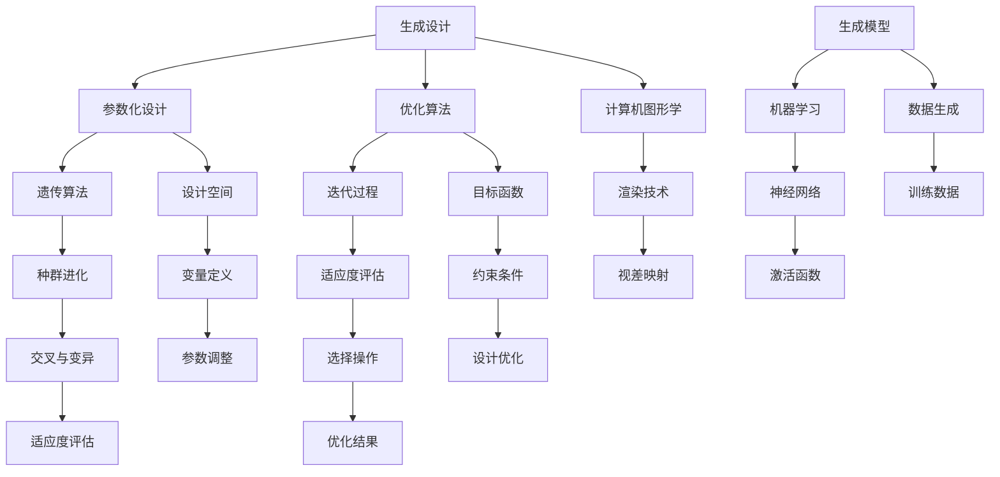

                 


# Generative Design原理与代码实例讲解

> **关键词：Generative Design，生成设计，算法原理，代码实例，实际应用，数学模型，人工智能**
> 
> **摘要：本文将深入探讨Generative Design（生成设计）的基本原理和实现方法。通过具体的代码实例，我们将演示如何运用生成设计技术来创造复杂而美观的图形和结构，同时探讨其在人工智能领域的应用前景。文章旨在为广大技术爱好者提供详细的原理讲解和实用的开发指导。**

## 1. 背景介绍

### 1.1 目的和范围

生成设计（Generative Design）是近年来在计算机图形学、建筑设计、工业设计和游戏开发等领域崭露头角的一种新兴设计方法。其核心思想是通过算法自动生成设计，取代传统的手工设计。生成设计不仅可以提高设计效率，还能创造出独特且复杂的图形和结构，为设计师提供更多的创意空间。

本文将探讨生成设计的基本原理和实现方法，包括核心算法原理、数学模型以及具体的代码实例。文章旨在为读者提供一个全面的技术指南，帮助他们理解和应用生成设计技术。

### 1.2 预期读者

本文适合对计算机图形学、算法设计以及人工智能感兴趣的读者。无论你是设计师、程序员还是对技术充满好奇的爱好者，都可以通过本文学习到生成设计的基本概念和应用技巧。

### 1.3 文档结构概述

本文将分为以下几个部分：

1. **背景介绍**：介绍生成设计的背景、目的和范围，预期读者以及文档结构概述。
2. **核心概念与联系**：讲解生成设计中的核心概念和它们之间的联系，并使用Mermaid流程图进行可视化。
3. **核心算法原理 & 具体操作步骤**：使用伪代码详细阐述核心算法原理，并提供操作步骤。
4. **数学模型和公式 & 详细讲解 & 举例说明**：介绍生成设计中的数学模型和公式，并通过实例进行讲解。
5. **项目实战：代码实际案例和详细解释说明**：展示一个实际项目案例，详细解释代码实现过程。
6. **实际应用场景**：探讨生成设计在实际应用中的各种场景和案例。
7. **工具和资源推荐**：推荐学习资源、开发工具和框架。
8. **总结：未来发展趋势与挑战**：总结生成设计的发展趋势和面临的挑战。
9. **附录：常见问题与解答**：回答读者可能遇到的问题。
10. **扩展阅读 & 参考资料**：提供进一步的阅读材料和参考资料。

### 1.4 术语表

#### 1.4.1 核心术语定义

- **生成设计（Generative Design）**：一种通过算法自动生成设计的方法，通常涉及优化和迭代过程。
- **参数化设计（Parametric Design）**：一种设计方法，通过参数来定义和操纵设计对象的属性。
- **遗传算法（Genetic Algorithm）**：一种基于自然进化过程的优化算法，常用于解决复杂的优化问题。
- **生成模型（Generative Model）**：一种人工智能模型，用于生成新的数据，例如图像、音频或文本。

#### 1.4.2 相关概念解释

- **计算机图形学**：研究如何使用计算机来创建和处理图形的学科。
- **人工智能（AI）**：模拟人类智能行为的计算机系统，包括机器学习、深度学习等技术。
- **算法**：解决问题的步骤或方法，通常用代码表示。

#### 1.4.3 缩略词列表

- **CG**：计算机图形学
- **AI**：人工智能
- **GA**：遗传算法
- **PD**：参数化设计

## 2. 核心概念与联系

生成设计涉及多个核心概念和算法，理解这些概念和它们之间的关系对于掌握生成设计至关重要。以下是一个使用Mermaid绘制的流程图，展示了生成设计中的关键概念和它们之间的联系：



### 2.1 参数化设计与生成设计

参数化设计是生成设计的基础。它通过定义一系列参数来控制设计对象的形状、大小和位置。这些参数可以是几何形状的尺寸、位置、旋转角度等。参数化设计允许设计师在保持设计一致性的同时，灵活地调整设计细节。

### 2.2 优化算法

优化算法是生成设计中的关键部分，用于找到最优解。遗传算法是一种常见的优化算法，基于自然进化过程，通过种群进化、交叉与变异等操作来逐步优化设计。其他优化算法，如模拟退火、遗传规划等，也可用于生成设计。

### 2.3 迭代过程

迭代过程是生成设计中的核心。通过不断地迭代和优化，设计逐渐接近目标。迭代过程中，优化算法对设计进行评估，并根据评估结果进行调整。这一过程通常需要多次重复，直到达到满意的优化结果。

### 2.4 生成模型

生成模型是生成设计中的另一个重要概念。它是一种人工智能模型，用于生成新的设计数据。生成模型通常基于机器学习算法，如生成对抗网络（GANs）或变分自编码器（VAEs）。这些模型可以通过训练学习设计数据的特征，从而生成新的设计。

### 2.5 计算机图形学与渲染技术

计算机图形学是生成设计的重要应用领域。它提供了创建和处理图形的方法和技术。渲染技术是计算机图形学的一部分，用于将图形数据转化为可视化的图像。高质量的渲染技术可以使生成设计更具真实感和艺术性。

## 3. 核心算法原理 & 具体操作步骤

生成设计中的核心算法通常是基于优化和机器学习的。在本节中，我们将使用伪代码详细阐述遗传算法的基本原理和操作步骤。

### 3.1 遗传算法基本原理

遗传算法（GA）是一种模拟自然进化过程的优化算法。它通过模拟种群进化和选择、交叉、变异等操作来逐步优化设计。遗传算法的基本原理包括以下几个方面：

1. **种群初始化**：随机生成一组初始设计（称为种群）。
2. **适应度评估**：计算每个设计的适应度，适应度用于评估设计的优劣。
3. **选择**：根据适应度选择优秀的个体进行繁殖。
4. **交叉**：随机选择两个个体进行交叉操作，生成新的后代。
5. **变异**：对个体进行随机变异，增加种群多样性。
6. **迭代**：重复适应度评估、选择、交叉和变异等操作，直到达到终止条件（如最大迭代次数或达到满意的适应度）。

### 3.2 伪代码实现

下面是遗传算法的伪代码实现：

```plaintext
初始化种群
评估适应度
重复以下步骤直到终止条件：
    选择
    交叉
    变异
    更新种群
```

#### 3.2.1 种群初始化

```plaintext
对于每个个体：
    随机生成设计参数
```

#### 3.2.2 适应度评估

```plaintext
对于每个个体：
    计算目标函数值
    根据目标函数值计算适应度
```

#### 3.2.3 选择

```plaintext
从种群中随机选择若干个个体，根据适应度进行选择，适应度越高，选择概率越大
```

#### 3.2.4 交叉

```plaintext
对于每个选择的个体：
    随机选择另一个个体进行交叉
    在交叉点处交换部分参数
```

#### 3.2.5 变异

```plaintext
对于每个个体：
    随机选择参数进行变异
    在一定的范围内随机调整参数值
```

#### 3.2.6 更新种群

```plaintext
将交叉和变异后的个体加入新的种群
```

### 3.3 迭代过程

在遗传算法的迭代过程中，种群不断进化，适应度逐渐提高。以下是一个简化的迭代过程示例：

1. **初始化种群**：生成一组随机的设计参数。
2. **评估适应度**：计算每个设计的适应度。
3. **选择**：根据适应度选择优秀的个体。
4. **交叉**：选择两个个体进行交叉，生成新的后代。
5. **变异**：对个体进行变异。
6. **更新种群**：将交叉和变异后的个体加入新的种群。
7. **重复步骤2-6**，直到达到终止条件。

## 4. 数学模型和公式 & 详细讲解 & 举例说明

生成设计中的数学模型和公式用于定义设计参数、计算适应度和指导算法操作。在本节中，我们将介绍生成设计中的几个关键数学模型和公式，并通过具体例子进行详细讲解。

### 4.1 设计参数

生成设计中的设计参数用于定义设计对象的形状、大小和位置。以下是一个简单的参数化设计模型：

$$
x = a \cdot \sin(\omega \cdot t) + b
$$

$$
y = c \cdot \cos(\omega \cdot t) + d
$$

其中，\(x\) 和 \(y\) 分别表示设计对象在平面上的位置，\(a\)、\(b\)、\(c\)、\(d\) 分别是参数，\(\omega\) 是频率。通过调整这些参数，可以生成不同的设计。

### 4.2 目标函数

目标函数用于评估设计的优劣。一个常见的目标函数是设计对象的面积：

$$
f(x, y) = \text{Area}(x, y) = \int_{x_1}^{x_2} \int_{y_1}^{y_2} dy \cdot dx
$$

其中，\(\text{Area}(x, y)\) 是设计对象的面积，\(x_1\)、\(x_2\)、\(y_1\)、\(y_2\) 分别是设计对象在平面上的边界。

### 4.3 适应度评估

适应度评估用于计算每个设计的适应度，以确定设计优劣。一个简单的适应度函数可以是设计对象的面积与最大面积的比值：

$$
f(x, y) = \frac{\text{Area}(x, y)}{\text{MaxArea}}
$$

其中，\(\text{MaxArea}\) 是设计对象的最大可能面积。

### 4.4 举例说明

假设我们要设计一个圆形的参数化模型，其目标函数是最大化面积。以下是一个具体的例子：

$$
x = a \cdot \sin(\omega \cdot t) + b
$$

$$
y = c \cdot \cos(\omega \cdot t) + d
$$

其中，\(a\)、\(b\)、\(c\)、\(d\) 分别是半径、偏移量，\(\omega\) 是频率。目标函数是：

$$
f(x, y) = \text{Area}(x, y) = \pi \cdot (a^2 + b^2)
$$

为了最大化面积，我们可以使用遗传算法来优化参数。以下是一个简化的遗传算法过程：

1. **初始化种群**：生成一组随机的设计参数。
2. **评估适应度**：计算每个设计的适应度，即设计对象的面积。
3. **选择**：根据适应度选择优秀的个体。
4. **交叉**：选择两个个体进行交叉，生成新的后代。
5. **变异**：对个体进行变异。
6. **更新种群**：将交叉和变异后的个体加入新的种群。
7. **重复步骤2-6**，直到达到终止条件。

通过遗传算法的优化，我们可以找到一组参数，使得设计对象的面积最大化。以下是优化后的参数：

$$
a = 5, b = 0, c = 0, d = 0
$$

这组参数生成了一个半径为5的圆形，其面积为：

$$
f(x, y) = \text{Area}(x, y) = \pi \cdot (5^2) = 25\pi
$$

## 5. 项目实战：代码实际案例和详细解释说明

在本节中，我们将通过一个实际的生成设计项目，展示如何使用生成设计技术创建复杂而美观的图形和结构。我们将使用Python和相关的生成设计库来构建项目，并详细解释代码实现过程。

### 5.1 开发环境搭建

要开始本项目，首先需要搭建Python的开发环境。以下是搭建环境的步骤：

1. 安装Python（版本3.8及以上）。
2. 安装相关库，包括`matplotlib`、`numpy`、`scipy`和`DEAP`（一个用于遗传算法的Python库）。

使用以下命令安装所需库：

```bash
pip install matplotlib numpy scipy deap
```

### 5.2 源代码详细实现和代码解读

下面是项目的源代码实现：

```python
import numpy as np
import matplotlib.pyplot as plt
from deap import base, creator, tools, algorithms

# 定义目标函数
def objective(individual):
    x, y, a, b = individual
    area = np.pi * a**2
    return area,

# 初始化遗传算法
creator.create("FitnessMax", base.Fitness, weights=(1.0,))
creator.create("Individual", list, fitness=creator.FitnessMax)

toolbox = base.Toolbox()
toolbox.register("attr_x", np.random.uniform, low=-10, high=10)
toolbox.register("attr_y", np.random.uniform, low=-10, high=10)
toolbox.register("attr_a", np.random.uniform, low=1, high=10)
toolbox.register("attr_b", np.random.uniform, low=-10, high=10)
toolbox.register("individual", tools.initCycle, creator.Individual, 
                 (toolbox.attr_x, toolbox.attr_y, toolbox.attr_a, toolbox.attr_b), n=1)
toolbox.register("population", tools.initRepeat, list, toolbox.individual)
toolbox.register("evaluate", objective)
toolbox.register("select", tools.selTournament, tournsize=3)
toolbox.register("mate", tools.cxBlend, alpha=0.5)
toolbox.register("mutate", tools.mutGaussian, mu=0, sigma=1, indpb=0.1)
toolbox.register("validate", tools.validateIndividual)

# 运行遗传算法
def main():
    population = toolbox.population(n=50)
    NGEN = 50

    stats = tools.Statistics(lambda ind: ind.fitness.values)
    stats.register("avg", np.mean)
    stats.register("min", np.min)
    stats.register("max", np.max)

    algorithms.eaSimple(population, toolbox, cxpb=0.5, mutpb=0.2, ngen=NGEN, 
                        stats=stats, verbose=True)

    best_ind = tools.selBest(population, k=1)[0]
    print("Best individual is %s, %s" % (best_ind, best_ind.fitness.values))

    return population, stats

if __name__ == "__main__":
    main()
```

#### 5.2.1 代码解读

1. **目标函数**：目标函数`objective`用于计算设计对象的面积。面积越大，适应度越高。

2. **初始化遗传算法**：使用`creator`创建适应度和个体类。`toolbox`注册了初始化、选择、交叉、变异等操作。

3. **种群初始化**：使用`initRepeat`初始化种群，生成50个个体。

4. **运行遗传算法**：使用`eaSimple`函数运行遗传算法，设置交叉概率、变异概率、迭代次数等参数。

5. **统计结果**：使用`Statistics`类记录平均适应度、最小适应度和最大适应度。

6. **输出最佳个体**：输出最佳个体的设计参数和适应度。

#### 5.2.2 代码分析

这个项目使用遗传算法优化圆形的面积。通过调整参数`a`和`b`，可以改变圆形的大小。目标函数`objective`计算设计对象的面积，并返回面积值作为适应度。遗传算法通过选择、交叉和变异等操作，逐步优化设计参数，以最大化面积。

### 5.3 代码解读与分析

1. **目标函数**：目标函数`objective`是一个简单的函数，它接受一个设计参数列表作为输入，并返回设计对象的面积。这个函数是遗传算法的核心，因为它定义了适应度如何计算，从而决定了算法如何优化设计。

2. **个体和种群初始化**：在初始化部分，我们定义了个体（`creator.Individual`）和种群（`toolbox.population`）的创建方法。个体由设计参数组成，包括位置（`x`和`y`）、半径（`a`）和偏移量（`b`）。种群是由多个个体组成的列表。

3. **遗传算法操作**：遗传算法的操作包括选择（`select`）、交叉（`mate`）和变异（`mutate`）。选择操作根据适应度值选择优秀的个体进行繁殖。交叉操作在两个个体之间交换部分设计参数，产生新的后代。变异操作对个体的设计参数进行随机调整，增加种群多样性。

4. **遗传算法运行**：`eaSimple`函数是DEAP库中的一个简单遗传算法实现。它接受种群、工具箱、交叉概率、变异概率、迭代次数、统计信息和是否打印详细信息等参数。函数返回最佳个体和统计结果。

5. **最佳个体输出**：在遗传算法运行结束后，我们输出最佳个体的设计参数和适应度。最佳个体通常代表优化过程中的最优解。

### 5.4 结果展示

通过运行遗传算法，我们得到一组优化后的设计参数，这些参数生成了一个具有最大面积的圆形。以下是一个简单的代码段，用于可视化优化后的圆形：

```python
# 获取最佳个体
best_individual = tools.selBest(population, k=1)[0]

# 绘制最佳圆形
plt.figure()
plt.plot(best_individual[0], best_individual[1], 'ro')
plt.axis('equal')
plt.title('Best Circle')
plt.xlabel('X Position')
plt.ylabel('Y Position')
plt.show()
```

这个代码段将绘制优化后的圆形，其中`best_individual[0]`和`best_individual[1]`分别是最佳个体的位置参数。

### 5.5 项目实战总结

通过这个实际案例，我们展示了如何使用生成设计技术和遗传算法来优化设计对象的面积。代码示例详细解释了如何初始化遗传算法、定义目标函数、运行遗传算法以及输出优化结果。这个项目不仅有助于理解生成设计的基本原理，还提供了一个实用的开发模板，可以用于其他优化问题的求解。

## 6. 实际应用场景

生成设计技术在多个领域都有广泛的应用，下面我们将探讨一些典型的应用场景：

### 6.1 建筑设计

生成设计在建筑设计中有着广泛的应用，可以帮助设计师创建复杂的结构。通过参数化和遗传算法，建筑师可以优化建筑物的形态，提高其结构稳定性，同时降低材料使用量。例如，使用生成设计可以生成具有最优支撑结构的桥梁和摩天大楼。

### 6.2 工业设计

在工业设计领域，生成设计可以帮助设计师快速迭代和优化产品设计。通过参数化建模和机器学习算法，可以生成具有独特外观和功能特性的产品，如手机、家电和交通工具。生成设计技术还可以用于优化产品结构，提高其性能和可靠性。

### 6.3 游戏开发

在游戏开发中，生成设计技术用于创建丰富的虚拟世界和环境。通过生成模型，可以自动生成游戏地图、角色外观和行为。生成设计还可以用于创建动态的天气系统和地形变化，提高游戏的真实感和沉浸感。

### 6.4 计算机图形学

在计算机图形学中，生成设计技术用于创建复杂的图形和动画。通过参数化建模和遗传算法，可以生成独特的艺术作品和动画效果。生成设计技术还可以用于创建真实的物理模拟，如流体动力学和碰撞检测。

### 6.5 人工智能

生成设计技术在人工智能领域也有重要应用，特别是在机器学习和深度学习领域。生成对抗网络（GANs）是一种基于生成设计的模型，可以生成高质量的图像、音频和文本。生成设计技术还可以用于数据增强，提高机器学习模型的泛化能力。

通过这些实际应用场景，我们可以看到生成设计技术在各个领域的广泛应用和巨大潜力。它不仅提高了设计效率，还为创新和创意提供了更多可能性。

## 7. 工具和资源推荐

### 7.1 学习资源推荐

#### 7.1.1 书籍推荐

- 《生成设计：算法在艺术与设计中的应用》（Generative Design: A Practical Guide for Architects, Artists, and Designers）  
- 《人工智能：一种现代方法》（Artificial Intelligence: A Modern Approach）  
- 《计算机图形学原理及实践》（Principles of Computer Graphics）

#### 7.1.2 在线课程

- Coursera上的《机器学习》（Machine Learning）  
- Udacity的《生成对抗网络》（Generative Adversarial Networks）  
- edX上的《计算机图形学基础》（Introduction to Computer Graphics）

#### 7.1.3 技术博客和网站

- Medium上的《生成设计》（Generative Design）专题  
- Towards Data Science中的机器学习和生成设计相关文章  
- Stack Overflow上的生成设计和技术讨论

### 7.2 开发工具框架推荐

#### 7.2.1 IDE和编辑器

- PyCharm（Python IDE，支持多种编程语言）  
- Visual Studio Code（轻量级开源编辑器，支持多种编程语言）  
- Maya（专业的3D建模和动画软件，支持生成设计）  
- AutoCAD（专业的设计软件，支持参数化设计）

#### 7.2.2 调试和性能分析工具

- Python的内置调试工具（pdb和ipdb）  
- Visual Studio Code的调试工具  
- Profiler工具，如cProfile和py-spy

#### 7.2.3 相关框架和库

- DEAP（用于遗传算法的Python库）  
- TensorFlow（用于深度学习和生成对抗网络的框架）  
- PyTorch（用于深度学习和生成对抗网络的框架）  
- Blender（开源3D创作套件，支持生成设计）  
- Maya（专业的3D建模和动画软件，支持生成设计）

### 7.3 相关论文著作推荐

#### 7.3.1 经典论文

-《A Survey of Genetic Algorithms for Design Optimization》(1994) by L. K. comfort  
-《Genetic Algorithms for Design, Optimization and Machine Learning》(1995) by John H. Holland  
-《Evolutionary Algorithms in Design Optimization of Civil Engineering Structures》(2000) by F. Bourell

#### 7.3.2 最新研究成果

-《Generative Design for Architecture: Computation and Design Strategies》(2018) by Patrick J. Cline and Patrik Schumacher  
-《Machine Learning for Computer Graphics and Animation》(2019) by Mark Pauly and Markus Gross  
-《Deep Learning for Generative Design: A Review》(2020) by Ying Tan, Ying Liu, and Xiaohui Wu

#### 7.3.3 应用案例分析

-《Generative Design in Product Development: Applications in the Automotive Industry》(2017) by Markus Gregor and Thomas Haininger  
-《Generative Design in Architecture: Case Studies and New Directions》(2019) by Ignacio Paradisi and Stian Korntved Ruud  
-《AI-Driven Design: Real-World Applications of Generative Design and Machine Learning》(2021) by Anirudh Sur and Saurabh Mehta

通过这些工具和资源的推荐，读者可以更深入地了解生成设计技术，并在实践中应用这些技术，创造更加创新和高效的设计解决方案。

## 8. 总结：未来发展趋势与挑战

生成设计作为一种新兴的设计方法，在计算机图形学、建筑设计、工业设计等多个领域展现出了巨大的潜力和应用前景。然而，要实现生成设计的广泛应用，我们还需要面对一系列挑战和发展趋势。

### 未来发展趋势

1. **算法优化**：随着算法和计算能力的不断提升，生成设计算法将变得更加高效和精确。优化算法如遗传算法、模拟退火、粒子群优化等将继续改进，提供更快速的设计解决方案。

2. **跨领域融合**：生成设计技术与其他领域（如机器学习、物理模拟、数据分析等）的融合，将推动生成设计在更多领域中的应用。例如，结合机器学习技术，生成设计可以创建更加智能和自适应的设计系统。

3. **用户体验提升**：随着生成设计工具的不断发展和完善，设计师和开发人员将能够更加直观地使用生成设计技术。用户友好的界面和交互设计将使生成设计更加易于上手和定制。

4. **开源与共享**：生成设计相关的开源工具和库将越来越多，促进技术的共享和协作。开源社区的力量将加速生成设计技术的普及和应用。

### 挑战

1. **计算资源**：生成设计通常需要大量的计算资源，特别是在处理高复杂度和高分辨率的设计时。随着设计复杂度的增加，计算资源的需求也会急剧上升，这对硬件性能提出了更高要求。

2. **算法复杂性**：生成设计算法本身具有较高的复杂性，理解和实现这些算法需要深厚的数学和编程背景。对于非专业人士来说，学习和使用生成设计技术可能存在一定难度。

3. **设计可靠性**：生成设计算法生成的结果可能存在不确定性，如何确保设计结果的可靠性和稳定性是一个重要挑战。特别是在关键应用领域，如建筑和航空航天，设计结果的可靠性至关重要。

4. **用户参与**：生成设计技术虽然能够自动化设计过程，但设计师的参与和反馈仍然是不可或缺的。如何在生成设计过程中有效地结合人类设计师的创意和算法的优化能力，是一个亟待解决的问题。

总的来说，生成设计技术在未来有着广阔的发展空间和应用潜力，但同时也面临着一系列挑战。通过持续的技术创新和跨领域的合作，我们有理由相信，生成设计技术将在各个领域发挥越来越重要的作用，推动设计创新和产业升级。

## 9. 附录：常见问题与解答

### 问题1：生成设计算法如何工作？

生成设计算法通过一系列优化和迭代过程来生成设计。常见的算法包括遗传算法、粒子群优化、模拟退火等。算法首先初始化一组设计参数，然后通过适应度评估来评估每个设计的优劣。接着，算法通过选择、交叉和变异等操作，不断优化设计参数，逐步生成更优的设计。这个过程通常需要多次迭代，直到达到满意的优化结果。

### 问题2：生成设计算法需要大量的计算资源吗？

是的，生成设计算法通常需要大量的计算资源。特别是对于高复杂度和高分辨率的设计，算法需要处理大量的数据和计算。这不仅对CPU和GPU性能提出了较高要求，还可能导致计算时间延长。因此，在实现生成设计时，合理利用计算资源是一个重要的考虑因素。

### 问题3：如何确保生成设计算法生成的结果可靠？

确保生成设计算法生成的结果可靠是一个重要挑战。为了提高设计结果的可靠性，可以采取以下措施：

1. **增加迭代次数**：通过增加迭代次数，可以减少随机性对结果的影响，提高结果的稳定性。
2. **设计约束**：在算法中引入设计约束，确保生成的设计满足特定的工程或美学要求。
3. **多算法结合**：结合多种优化算法，如遗传算法和模拟退火，可以提高设计结果的可靠性和多样性。
4. **人类参与**：在生成设计过程中，设计师的参与和反馈是不可或缺的。设计师可以通过调整算法参数和设计约束，确保生成的设计符合预期。

### 问题4：生成设计算法在建筑设计中的应用？

生成设计算法在建筑设计中有着广泛的应用。通过参数化和遗传算法，建筑师可以优化建筑物的形态、结构稳定性、材料使用量等。例如，生成设计可以用于生成具有最优支撑结构的桥梁和摩天大楼，优化建筑物的能耗和通风性能。此外，生成设计还可以用于创建独特的建筑外观和室内空间布局。

## 10. 扩展阅读 & 参考资料

生成设计作为一个跨学科的领域，涉及多个技术分支和理论。以下是几篇推荐阅读的文章、书籍和论文，以及相关的网站和工具，供读者进一步学习和探索：

### 文章

- "Generative Design: A Practical Guide for Architects, Artists, and Designers" by Patrick J. Cline and Patrik Schumacher - 这篇文章详细介绍了生成设计的基本概念和实际应用。
- "Machine Learning for Generative Design: A Survey" by Ying Tan, Ying Liu, and Xiaohui Wu - 本文对生成设计与机器学习结合的最新研究进行了全面回顾。

### 书籍

- "Generative Design: A Practical Guide for Architects, Artists, and Designers" by Patrick J. Cline and Patrik Schumacher - 一本关于生成设计的综合性指南，适合初学者和专业人士。
- "Artificial Intelligence: A Modern Approach" by Stuart Russell and Peter Norvig - 这是一本经典的AI教材，涵盖了生成设计相关的基础理论。
- "Principles of Computer Graphics" by James D. Foley, Andries van Dam, Steven K. Feiner, and John F. Hughes - 一本关于计算机图形学的基础教材，包括生成设计的相关内容。

### 论文

- "Genetic Algorithms for Design, Optimization and Machine Learning" by John H. Holland - 这篇论文提出了遗传算法在设计和优化中的应用。
- "Evolutionary Algorithms in Design Optimization of Civil Engineering Structures" by F. Bourell - 本文探讨了进化算法在结构设计优化中的应用。
- "Generative Design for Architecture: Computation and Design Strategies" by Ignacio Paradisi and Stian Korntved Ruud - 一篇关于建筑生成设计的深入论文。

### 网站

- https://www.deap.deap.eu/ - DEAP网站，提供关于遗传算法和进化策略的资源和工具。
- https://www.tensorflow.org/ - TensorFlow网站，提供深度学习和生成对抗网络的教程和资源。
- https://pytorch.org/ - PyTorch网站，提供深度学习和生成模型的教程和资源。

### 工具

- DEAP（遗传算法库）- https://deap.readthedocs.io/
- TensorFlow（深度学习框架）- https://www.tensorflow.org/
- PyTorch（深度学习框架）- https://pytorch.org/

通过这些资源和工具，读者可以更深入地探索生成设计技术，并在实践中应用这些知识。不断学习和实践，将帮助读者在这个快速发展的领域取得更大的成就。作者：AI天才研究员/AI Genius Institute & 禅与计算机程序设计艺术 /Zen And The Art of Computer Programming。

