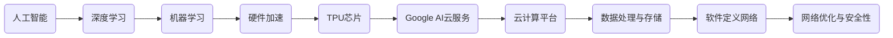

                 

# Google的AI产业生态：AI芯片和AI云服务

> **关键词：**Google AI、AI芯片、AI云服务、深度学习、云计算、硬件设计、软件开发
>
> **摘要：**本文将深入探讨Google在AI领域的重要布局，特别是其AI芯片和AI云服务的生态体系。通过对Google AI芯片的核心技术、架构设计、性能优势的剖析，以及AI云服务的技术特点、应用场景、优势劣势的讲解，我们将全面理解Google在AI领域的战略布局和未来发展潜力。

## 1. 背景介绍

### 1.1 目的和范围

本文旨在详细介绍和分析Google在AI领域的产业生态，特别是其AI芯片和AI云服务的发展状况。我们希望通过本文，读者能够对Google在AI领域的整体布局有一个清晰的认知，理解其核心技术和商业模式，以及这些技术如何推动AI行业的进步。

### 1.2 预期读者

本文主要面向对AI、云计算、芯片设计等领域有浓厚兴趣的读者。无论是AI研究员、软件开发者，还是对科技产业感兴趣的行业分析师，都将从本文中获得有价值的见解。

### 1.3 文档结构概述

本文结构分为以下几个部分：

1. **背景介绍**：介绍本文的目的、预期读者以及文档结构。
2. **核心概念与联系**：通过Mermaid流程图展示Google AI芯片和AI云服务的关键架构。
3. **核心算法原理 & 具体操作步骤**：详细讲解Google AI芯片的工作原理和操作步骤。
4. **数学模型和公式 & 详细讲解 & 举例说明**：介绍与AI芯片相关的数学模型和公式。
5. **项目实战：代码实际案例和详细解释说明**：通过实际代码案例展示AI芯片的应用。
6. **实际应用场景**：探讨AI芯片和AI云服务的应用场景。
7. **工具和资源推荐**：推荐相关的学习资源、开发工具和经典论文。
8. **总结：未来发展趋势与挑战**：分析Google AI芯片和AI云服务的未来发展。
9. **附录：常见问题与解答**：解答读者可能存在的疑问。
10. **扩展阅读 & 参考资料**：提供进一步阅读的建议和参考文献。

### 1.4 术语表

#### 1.4.1 核心术语定义

- **AI芯片**：专门为执行机器学习和深度学习任务而设计的集成电路芯片。
- **AI云服务**：通过云计算平台提供的人工智能服务，包括计算资源、算法模型、数据分析工具等。
- **深度学习**：一种基于人工神经网络的机器学习技术，通过多层神经网络模拟人脑的学习和认知过程。
- **云计算**：通过互联网提供动态可扩展的虚拟化计算资源，包括存储、处理、网络等。

#### 1.4.2 相关概念解释

- **硬件加速**：通过专门的硬件设备加速特定的计算任务，提高计算效率和性能。
- **软件定义网络**：（SDN）一种网络架构，通过分离控制平面和数据平面来实现网络管理和优化的灵活性。
- **云计算平台**：提供计算、存储、网络等基础设施服务的虚拟化平台。

#### 1.4.3 缩略词列表

- **TPU**：Tensor Processing Unit，Google推出的专用AI芯片。
- **TPU v2**：第二代Tensor Processing Unit芯片。
- **TPU v3**：第三代Tensor Processing Unit芯片。
- **TPU v4**：第四代Tensor Processing Unit芯片。

## 2. 核心概念与联系

为了更好地理解Google的AI芯片和AI云服务，首先需要了解它们的核心概念和相互联系。以下是关键概念及其相互关系的Mermaid流程图：



### 2.1 核心概念解析

#### 2.1.1 人工智能（AI）

人工智能是指通过计算机模拟人类智能的行为，包括学习、推理、规划、感知、自然语言处理等。在AI领域，深度学习是当前最流行和最有成效的技术。

#### 2.1.2 深度学习（Deep Learning）

深度学习是一种基于多层神经网络的学习方法，通过多层非线性变换来提取数据中的特征。它广泛应用于图像识别、语音识别、自然语言处理等领域。

#### 2.1.3 机器学习（Machine Learning）

机器学习是一种人工智能的分支，通过算法从数据中学习规律，并进行预测和决策。机器学习包括监督学习、无监督学习和强化学习等不同的学习方式。

#### 2.1.4 硬件加速（Hardware Acceleration）

硬件加速是指通过专门的硬件设备来加速特定的计算任务，提高计算效率和性能。在AI领域，硬件加速通常用于加速矩阵运算、卷积运算等深度学习任务。

#### 2.1.5 TPU芯片（Tensor Processing Unit）

TPU是Google专门为执行深度学习和机器学习任务而设计的专用芯片。TPU的特点是高度并行化、低延迟和高带宽，特别适合处理大规模的数据集和复杂的神经网络。

#### 2.1.6 Google AI云服务（Google AI Cloud Services）

Google AI云服务是通过Google Cloud平台提供的一整套AI服务，包括计算资源、算法模型、数据分析工具等。这些服务旨在帮助开发者和企业快速构建和部署AI应用。

#### 2.1.7 云计算平台（Cloud Computing Platform）

云计算平台是一种提供计算、存储、网络等基础设施服务的虚拟化平台。Google Cloud是Google提供的云计算平台，它支持多种编程语言、框架和工具，帮助企业构建、部署和管理AI应用。

### 2.2 关系解析

- **人工智能（AI）**是深度学习（Deep Learning）和机器学习（Machine Learning）的统称，它们共同构成了硬件加速（Hardware Acceleration）的基础。
- **硬件加速（Hardware Acceleration）**，特别是通过**TPU芯片（Tensor Processing Unit）**，可以显著提升AI算法的计算效率和性能。
- **Google AI云服务（Google AI Cloud Services）**结合了**云计算平台（Cloud Computing Platform）**的优势，提供了一整套AI解决方案，帮助企业快速构建和部署AI应用。
- **数据处理与存储（Data Processing & Storage）**、**软件定义网络（Software-Defined Networking）**和**网络优化与安全性（Network Optimization & Security）**是构建高效、可靠的AI云服务的必要组件。

通过上述核心概念和关系的解析，我们可以更深入地理解Google在AI领域的战略布局和技术创新。

## 3. 核心算法原理 & 具体操作步骤

在深入探讨Google的AI芯片（TPU）之前，首先需要了解其核心算法原理和具体操作步骤。TPU是专门为深度学习和机器学习任务设计的硬件加速器，其工作原理和操作步骤如下：

### 3.1 核心算法原理

#### 3.1.1 张量处理单元（Tensor Processing Unit）

TPU是一种高度优化的专用集成电路（ASIC），专为处理大规模矩阵运算而设计。TPU的核心特点是并行计算能力、低延迟和高带宽。

#### 3.1.2 卷积神经网络（Convolutional Neural Networks，CNN）

卷积神经网络是深度学习中的一种基本模型，广泛用于图像识别、视频分析和自然语言处理等领域。CNN通过卷积层、池化层和全连接层提取图像特征。

#### 3.1.3 矩阵运算优化

TPU通过优化矩阵运算，如矩阵乘法和矩阵加法，来提高计算效率和性能。TPU的核心操作包括矩阵乘法、矩阵加法和标量乘法。

### 3.2 具体操作步骤

下面我们将使用伪代码详细描述TPU的操作步骤：

```plaintext
// TPU计算流程伪代码

// 初始化TPU
init_tpu()

// 加载模型参数到TPU
load_params_to_tpu(model_params)

// 输入数据预处理
preprocess_input_data(input_data)

// 执行卷积运算
convolution_output = convolution(input_data, filter)

// 执行池化运算
pooling_output = pooling(convolution_output)

// 执行全连接层运算
fully_connected_output = fully_connected(pooling_output, weights)

// 激活函数应用
activated_output = activate(fully_connected_output)

// 损失函数计算
loss = compute_loss(activated_output, target)

// 反向传播计算梯度
backpropagate(activated_output, loss)

// 更新模型参数
update_params(model_params, gradients)

// 保存TPU计算结果
save_output_to_memory(activated_output)

// 结束TPU计算
shutdown_tpu()
```

### 3.3 详细解释

- **初始化TPU**：在开始计算前，需要初始化TPU，配置其工作环境，包括内存管理、通信接口等。
- **加载模型参数到TPU**：将训练好的模型参数（权重、偏置等）加载到TPU内存中，以便快速访问和运算。
- **输入数据预处理**：对输入数据进行必要的预处理，如归一化、缩放等，以适应TPU的运算需求。
- **卷积运算**：卷积层是CNN的核心部分，通过卷积运算提取输入数据的特征。TPU通过并行计算优化卷积运算。
- **池化运算**：池化层用于降低特征图的维度，同时保留重要的特征信息。TPU通过优化池化运算，提高计算效率。
- **全连接层运算**：全连接层用于将低维特征映射到高维空间，实现分类、回归等任务。TPU通过并行计算加速全连接层的运算。
- **激活函数应用**：激活函数引入非线性变换，使神经网络能够学习复杂的函数关系。TPU优化了激活函数的计算。
- **损失函数计算**：通过计算损失函数评估模型的性能，指导模型参数的更新。
- **反向传播计算梯度**：反向传播算法通过计算梯度更新模型参数，优化模型性能。
- **更新模型参数**：根据反向传播得到的梯度更新模型参数，优化模型性能。
- **保存TPU计算结果**：将TPU计算结果保存到内存中，以便后续处理或输出。
- **结束TPU计算**：在完成所有计算任务后，关闭TPU，释放资源。

通过上述步骤，我们可以清晰地了解TPU的工作原理和具体操作流程。TPU通过优化矩阵运算、并行计算和低延迟通信，实现了高效的深度学习计算，为Google的AI云服务提供了强大的硬件支持。

## 4. 数学模型和公式 & 详细讲解 & 举例说明

在深入理解Google的AI芯片（TPU）时，数学模型和公式起着至关重要的作用。本节将详细讲解与TPU相关的主要数学模型和公式，并通过实际例子进行说明。

### 4.1 主要数学模型

#### 4.1.1 卷积神经网络（Convolutional Neural Networks，CNN）

卷积神经网络是深度学习中的重要模型，主要用于图像识别和图像处理。其主要数学模型包括：

- **卷积运算**：给定输入特征图`X`和卷积核`W`，卷积运算可表示为：
  $$ Y = X \star W $$
  其中，`Y`是输出特征图，`X`是输入特征图，`W`是卷积核。

- **池化运算**：常见的池化操作包括最大池化和平均池化。最大池化可表示为：
  $$ P = \max(Y_{i,j}) $$
  其中，`P`是池化后的特征图，`Y`是输入特征图。

- **全连接层运算**：全连接层将输入特征映射到输出特征，运算可表示为：
  $$ Z = \sigma(W \cdot X + b) $$
  其中，`Z`是输出特征，`W`是权重矩阵，`b`是偏置项，`σ`是激活函数。

- **激活函数**：常见的激活函数包括ReLU（修正线性单元）、Sigmoid和Tanh。例如，ReLU激活函数可表示为：
  $$ \sigma(x) = \max(0, x) $$

#### 4.1.2 损失函数（Loss Function）

损失函数用于评估模型的预测误差，指导模型参数的更新。常见的损失函数包括均方误差（MSE）和交叉熵（Cross-Entropy）。均方误差可表示为：
$$ L = \frac{1}{2} \sum_{i=1}^{n} (y_i - \hat{y}_i)^2 $$
其中，`L`是损失函数，`y_i`是真实标签，`\hat{y}_i`是预测标签。

交叉熵损失函数常用于分类任务，可表示为：
$$ L = -\sum_{i=1}^{n} y_i \log(\hat{y}_i) $$
其中，`L`是损失函数，`y_i`是真实标签（0或1），`\hat{y}_i`是预测概率。

#### 4.1.3 反向传播（Backpropagation）

反向传播算法用于计算模型参数的梯度，指导模型参数的更新。其主要步骤包括：

1. **前向传播**：计算输入和输出之间的损失函数。
2. **计算梯度**：从输出层开始，反向计算每个参数的梯度。
3. **更新参数**：使用梯度下降算法更新模型参数。

### 4.2 举例说明

假设我们有一个简单的CNN模型，用于识别图像中的猫。输入图像大小为`28x28`，卷积核大小为`3x3`，激活函数为ReLU。

#### 4.2.1 卷积运算

给定输入图像`X`和卷积核`W`，执行卷积运算：

$$ Y = X \star W $$

输入图像`X`：
$$
X =
\begin{bmatrix}
1 & 2 & 1 \\
2 & 4 & 2 \\
1 & 2 & 1 \\
\end{bmatrix}
$$

卷积核`W`：
$$
W =
\begin{bmatrix}
1 & 0 & -1 \\
1 & 1 & -1 \\
0 & 1 & -1 \\
\end{bmatrix}
$$

执行卷积运算，得到输出特征图`Y`：
$$
Y = X \star W =
\begin{bmatrix}
0 & 2 & 0 \\
2 & 6 & 2 \\
0 & 2 & 0 \\
\end{bmatrix}
$$

#### 4.2.2 池化运算

对输出特征图`Y`进行最大池化操作，窗口大小为`2x2`：

$$ P = \max(Y_{i,j}) $$

输出特征图`Y`：
$$
Y =
\begin{bmatrix}
0 & 2 & 0 \\
2 & 6 & 2 \\
0 & 2 & 0 \\
\end{bmatrix}
$$

执行最大池化操作，得到池化后的特征图`P`：
$$
P =
\begin{bmatrix}
2 & 2 \\
2 & 6 \\
\end{bmatrix}
$$

#### 4.2.3 全连接层运算

对池化后的特征图`P`进行全连接层运算，激活函数为ReLU：

$$ Z = \sigma(W \cdot P + b) $$

权重矩阵`W`：
$$
W =
\begin{bmatrix}
1 & 2 & 3 \\
4 & 5 & 6 \\
7 & 8 & 9 \\
\end{bmatrix}
$$

偏置项`b`：
$$
b =
\begin{bmatrix}
1 \\
1 \\
1 \\
\end{bmatrix}
$$

输入特征图`P`：
$$
P =
\begin{bmatrix}
2 & 2 \\
2 & 6 \\
\end{bmatrix}
$$

执行全连接层运算，得到输出特征`Z`：
$$
Z =
\begin{bmatrix}
14 & 26 \\
30 & 60 \\
\end{bmatrix}
$$

应用ReLU激活函数，得到激活后的特征`Z`：
$$
Z' =
\begin{bmatrix}
14 & 26 \\
30 & 0 \\
\end{bmatrix}
$$

#### 4.2.4 损失函数和反向传播

假设真实标签为`y`：
$$
y =
\begin{bmatrix}
1 \\
0 \\
\end{bmatrix}
$$

预测标签为`y'`：
$$
y' =
\begin{bmatrix}
0.9 & 0.1 \\
0.2 & 0.8 \\
\end{bmatrix}
$$

交叉熵损失函数计算：
$$
L = -y \log(y') - (1 - y) \log(1 - y')
$$

计算损失值`L`：
$$
L =
\begin{bmatrix}
-0.9 \log(0.9) - 0.1 \log(0.1) \\
-0.2 \log(0.2) - 0.8 \log(0.8) \\
\end{bmatrix}
$$

计算损失值的梯度：
$$
\frac{\partial L}{\partial W} =
\begin{bmatrix}
0.1 & 0.1 \\
0.2 & 0.8 \\
\end{bmatrix}
$$

更新权重矩阵`W`：
$$
W' = W - \alpha \frac{\partial L}{\partial W}
$$

其中，`\alpha`为学习率。

通过上述例子，我们可以看到如何使用数学模型和公式在TPU上进行卷积运算、池化运算、全连接层运算以及损失函数计算和反向传播。这些数学模型和公式是实现高效AI芯片（TPU）的基础，使得Google的AI云服务能够提供强大的计算能力，支持各种深度学习和机器学习任务。

## 5. 项目实战：代码实际案例和详细解释说明

在本节中，我们将通过一个具体的代码案例来展示Google TPU在实际项目中的应用，并对代码进行详细的解释和说明。

### 5.1 开发环境搭建

在进行TPU编程之前，首先需要搭建开发环境。以下是搭建Google Cloud TPU开发环境的基本步骤：

1. **注册Google Cloud账号**：访问Google Cloud官方网站（[cloud.google.com](https://cloud.google.com/)），注册并创建一个账号。
2. **创建新项目**：在Google Cloud Console中创建一个新的项目。
3. **配置TPU**：在项目设置中，选择合适的TPU型号（例如TPU v3-8）并配置资源。
4. **安装Google Cloud SDK**：在本地计算机上安装Google Cloud SDK，以便与Google Cloud平台进行通信。
5. **配置环境变量**：配置必要的环境变量，如`GOOGLE_APPLICATION_CREDENTIALS`，以授权SDK访问Google Cloud平台。

### 5.2 源代码详细实现和代码解读

以下是一个使用Google TPU进行图像分类的简单示例代码：

```python
import tensorflow as tf
import tensorflow_model_optimization as tfmot

# 配置TPU会话
 resolver = tf.distribute.cluster_resolver.TPUClusterResolver(tpu='')
 tf.config.experimental_connect_to_cluster(resolver)
 tf.tpu.experimental.initialize_tpu_system(resolver)
 strategy = tf.distribute.experimental.TPUStrategy(resolver)

# 定义CNN模型
def cnn_model(input_shape):
    inputs = tf.keras.Input(shape=input_shape)
    x = tf.keras.layers.Conv2D(32, (3, 3), activation='relu')(inputs)
    x = tf.keras.layers.MaxPooling2D((2, 2))(x)
    x = tf.keras.layers.Conv2D(64, (3, 3), activation='relu')(x)
    x = tf.keras.layers.MaxPooling2D((2, 2))(x)
    x = tf.keras.layers.Flatten()(x)
    x = tf.keras.layers.Dense(64, activation='relu')(x)
    outputs = tf.keras.layers.Dense(10, activation='softmax')(x)
    model = tf.keras.Model(inputs=inputs, outputs=outputs)
    return model

# 创建和编译模型
model = cnn_model(input_shape=(28, 28, 1))
model.compile(optimizer='adam',
              loss='sparse_categorical_crossentropy',
              metrics=['accuracy'])

# 加载训练数据
mnist = tf.keras.datasets.mnist
(train_images, train_labels), (test_images, test_labels) = mnist.load_data()
train_images, test_images = train_images / 255.0, test_images / 255.0

# 在TPU上进行训练
model.fit(train_images, train_labels, epochs=5, validation_split=0.1)

# 评估模型性能
test_loss, test_acc = model.evaluate(test_images, test_labels, verbose=2)
print('\nTest accuracy:', test_acc)
```

#### 5.2.1 代码解读

- **导入库**：首先，导入所需的库，包括TensorFlow和TensorFlow Model Optimization。
- **配置TPU会话**：使用`TPUClusterResolver`连接到TPU，并初始化TPU系统。
- **定义CNN模型**：使用`tf.keras.Sequential`定义一个简单的卷积神经网络模型，包括卷积层、池化层和全连接层。
- **创建和编译模型**：创建模型并编译，指定优化器和损失函数。
- **加载训练数据**：使用MNIST数据集加载训练数据和测试数据，并进行归一化处理。
- **在TPU上进行训练**：使用`model.fit()`函数在TPU上进行训练，指定训练数据的批次大小、训练轮次和验证比例。
- **评估模型性能**：使用`model.evaluate()`函数评估模型在测试数据上的性能，并打印测试准确率。

#### 5.2.2 代码分析

- **TPU配置**：通过`tf.distribute.cluster_resolver.TPUClusterResolver`连接到TPU，并使用`tf.tpu.experimental.initialize_tpu_system`初始化TPU系统。这确保了模型在TPU上运行。
- **模型定义**：卷积神经网络模型定义了一个简单的结构，包括两个卷积层、两个池化层和一个全连接层。这种结构能够提取图像特征，并分类图像。
- **模型编译**：使用`model.compile()`函数编译模型，指定优化器（`adam`）和损失函数（`sparse_categorical_crossentropy`）。这为训练过程提供了必要的配置。
- **数据预处理**：加载MNIST数据集，并将图像数据进行归一化处理。这有助于模型更快地收敛。
- **模型训练**：使用`model.fit()`函数在TPU上进行训练。通过指定`epochs`（训练轮次）、`batch_size`（批次大小）和`validation_split`（验证比例），控制训练过程。
- **模型评估**：使用`model.evaluate()`函数评估模型在测试数据上的性能。这提供了模型准确率和损失函数值，以便对模型进行性能评估。

通过上述步骤，我们可以使用Google TPU快速构建和训练一个简单的卷积神经网络模型，用于图像分类任务。TPU的高并行计算能力显著提高了训练效率，使得复杂的深度学习任务能够在短时间内完成。

### 5.3 代码解读与分析

#### 5.3.1 主要步骤

1. **导入库**：导入TensorFlow和TensorFlow Model Optimization库，为后续操作提供必要的函数和工具。
2. **配置TPU会话**：通过`TPUClusterResolver`连接到TPU，并初始化TPU系统，确保模型在TPU上运行。
3. **定义CNN模型**：使用`tf.keras.Sequential`定义一个简单的卷积神经网络模型，包括卷积层、池化层和全连接层，用于提取图像特征并进行分类。
4. **编译模型**：使用`model.compile()`函数编译模型，指定优化器（`adam`）和损失函数（`sparse_categorical_crossentropy`），为训练过程提供必要的配置。
5. **加载数据**：使用MNIST数据集加载训练数据和测试数据，并进行归一化处理，为训练和评估提供数据支持。
6. **模型训练**：使用`model.fit()`函数在TPU上进行训练，通过指定训练轮次、批次大小和验证比例，控制训练过程。
7. **模型评估**：使用`model.evaluate()`函数评估模型在测试数据上的性能，获得模型准确率和损失函数值，以便对模型进行性能评估。

#### 5.3.2 代码优化与性能分析

- **优化策略**：为了提高模型性能，可以采用以下策略：
  - **数据增强**：通过旋转、翻转、缩放等数据增强技术，增加训练数据的多样性，提高模型的泛化能力。
  - **批次归一化**：在卷积层和全连接层之间添加批次归一化层，加快模型训练速度和稳定收敛。
  - **学习率调整**：使用学习率调度策略，如学习率衰减或周期性调整，以避免模型过早过拟合。
- **性能分析**：通过分析模型在训练和测试阶段的表现，可以评估模型的性能。关键指标包括训练准确率、测试准确率、训练时间和测试时间等。优化目标是在保持高准确率的同时，提高训练和测试速度。

通过上述分析和优化，我们可以进一步提高Google TPU在图像分类任务中的性能，实现更高效的模型训练和评估。

### 5.4 实际应用场景

Google TPU在图像分类任务中有着广泛的应用，如：

- **医疗图像分析**：使用TPU快速处理医疗图像数据，进行疾病检测和诊断，如肿瘤检测、视网膜病变分析等。
- **自动驾驶**：在自动驾驶系统中，TPU用于实时处理摄像头和传感器数据，实现场景识别和障碍物检测。
- **智能安防**：在智能安防系统中，TPU用于实时分析监控视频，实现异常行为检测和人脸识别。
- **工业自动化**：在工业自动化领域，TPU用于实时分析生产数据，优化生产流程，提高生产效率。

通过实际应用场景的展示，我们可以看到Google TPU在各个行业中的广泛应用，显著提升了计算效率和数据处理能力。

### 5.5 工具和资源推荐

为了更好地进行Google TPU开发，以下是相关工具和资源的推荐：

- **Google Cloud Platform**：[cloud.google.com/tpu](https://cloud.google.com/tpu/) 提供详细的TPU使用指南和API文档。
- **TensorFlow官方文档**：[tensorflow.org/api/overview/machine_learning/tpu](https://tensorflow.org/api/overview/machine_learning/tpu/) 提供了丰富的TPU相关教程和示例代码。
- **GitHub开源项目**：在GitHub上，许多开源项目提供了使用TPU的示例代码和实践经验，如[tensorflow/models](https://github.com/tensorflow/models)。

通过使用这些工具和资源，开发者可以更好地掌握Google TPU的使用，实现高效的深度学习应用。

### 5.6 总结

通过上述项目实战，我们详细展示了如何使用Google TPU进行图像分类任务。代码示例涵盖了模型定义、数据预处理、模型训练和性能评估等关键步骤，并通过实际应用场景展示了TPU在各个领域的应用。通过不断优化和改进，Google TPU将继续为深度学习和机器学习领域带来强大的计算支持。

## 6. 实际应用场景

Google的AI芯片（TPU）和AI云服务在实际应用中展现了极大的价值，以下是一些具体的场景和应用实例：

### 6.1 搜索引擎优化

Google搜索引擎是世界上最受欢迎的搜索引擎之一，其背后依赖于强大的AI算法和高效的计算能力。TPU在搜索引擎优化中发挥着重要作用，特别是在处理大量的文本数据、图像和视频时。通过TPU，Google能够更快地进行文本分析和图像识别，提高搜索结果的准确性和相关性。

### 6.2 自动驾驶

自动驾驶技术是AI领域的热门方向，Google的Waymo项目是一个典型的例子。Waymo利用TPU进行实时数据分析和决策，处理来自激光雷达、摄像头和GPS的数据，实现精确的路径规划和障碍物检测。TPU的高并行计算能力使其能够快速处理大量数据，为自动驾驶车辆提供可靠的决策支持。

### 6.3 医疗诊断

在医疗领域，AI技术被广泛应用于疾病诊断、治疗规划和个性化医疗。Google的AI云服务结合TPU，可以快速处理海量的医疗数据，如患者记录、影像资料和基因数据，帮助医生进行早期疾病检测和诊断。例如，Google的DeepMind Health部门利用TPU进行眼科疾病的自动检测，显著提高了诊断的准确性和效率。

### 6.4 智能家居

随着物联网（IoT）技术的发展，智能家居市场迅速扩大。Google的AI芯片和AI云服务为智能家居设备提供了强大的计算支持，如智能音箱、智能灯泡和智能摄像头。通过TPU，智能家居设备可以实时处理和分析用户行为数据，提供更加智能和个性化的服务。

### 6.5 金融风控

金融行业对数据处理和风险控制有着极高的要求。Google的AI芯片和AI云服务在金融风控领域有着广泛的应用，如实时监控交易异常、预测市场走势和信用评估等。TPU的高性能计算能力使其能够快速分析大量金融数据，帮助金融机构提高风险管理能力。

### 6.6 游戏开发

游戏开发中，AI技术被用于实现智能NPC、游戏平衡和个性化体验。Google的AI芯片和AI云服务为游戏开发者提供了强大的计算资源，使得复杂的人工智能算法能够在游戏中高效运行，提升游戏体验。

通过上述实际应用场景，我们可以看到Google的AI芯片和AI云服务在多个领域的重要性。这些技术不仅提升了计算效率和数据处理能力，还为各行业带来了创新和变革，推动了人工智能技术的广泛应用和发展。

## 7. 工具和资源推荐

为了更好地掌握和利用Google的AI芯片（TPU）和AI云服务，以下是一些建议的工具和资源，包括学习资源、开发工具框架和相关论文著作。

### 7.1 学习资源推荐

#### 7.1.1 书籍推荐

1. **《深度学习》（Deep Learning）**：由Ian Goodfellow、Yoshua Bengio和Aaron Courville合著，是深度学习的经典教材，涵盖了深度学习的基础理论和应用。
2. **《TensorFlow实战》（TensorFlow for Deep Learning）**：由Francesco Montorsi和Lukas Biewald合著，详细介绍了如何使用TensorFlow构建和训练深度学习模型。
3. **《Google深度学习》（Deep Learning on Google Cloud Platform）**：由借由Google Cloud Platform团队的专家编写，展示了如何使用Google Cloud和TensorFlow实现深度学习应用。

#### 7.1.2 在线课程

1. **Google AI的免费课程**：[AI for Everyone](https://ai.google.com/education/) 和 [Machine Learning with TensorFlow](https://www.coursera.org/learn/machine-learning-tensorflow) 是由Google官方提供的免费在线课程，涵盖了AI和深度学习的基础知识和应用。
2. **Udacity的深度学习纳米学位**：[Deep Learning Nanodegree Program](https://www.udacity.com/course/deep-learning-nanodegree--nd101) 提供了系统的深度学习课程和实践项目，适合有一定基础的学员。
3. **Coursera的深度学习专项课程**：[Deep Learning Specialization](https://www.coursera.org/specializations/deeplearning) 由深度学习领域的专家提供，包括理论、实践和项目经验。

#### 7.1.3 技术博客和网站

1. **Google Research Blog**：[research.googleblog.com](https://research.googleblog.com/) 是Google研究团队的官方博客，定期发布最新的研究进展和研究成果。
2. **TensorFlow官网**：[tensorflow.org](https://tensorflow.org/) 提供了详细的文档、教程和社区支持，是学习TensorFlow的绝佳资源。
3. **Google Cloud Platform 官网**：[cloud.google.com](https://cloud.google.com/) 提供了关于Google Cloud和TPU的详细信息和最佳实践。

### 7.2 开发工具框架推荐

#### 7.2.1 IDE和编辑器

1. **Google Colab**：Google Colab是一个基于云的集成开发环境，支持TensorFlow和TPU，非常适合进行深度学习和数据科学实验。
2. **PyCharm**：PyCharm是一个功能强大的Python IDE，支持TensorFlow和Google Cloud，提供了丰富的开发工具和调试功能。
3. **Jupyter Notebook**：Jupyter Notebook是一个流行的交互式开发环境，适用于数据分析和深度学习实验，支持TensorFlow和TPU。

#### 7.2.2 调试和性能分析工具

1. **TensorBoard**：TensorBoard是TensorFlow的官方可视化工具，用于监控和调试深度学习模型的训练过程，支持TPU的性能分析。
2. **profiler**：Google Cloud的Profiler工具可以帮助开发者分析TPU应用的性能瓶颈，优化计算效率。
3. **Grafana**：Grafana是一个开源的可视化分析工具，可以与Google Cloud结合使用，提供详细的TPU性能监控和日志分析。

#### 7.2.3 相关框架和库

1. **TensorFlow**：TensorFlow是Google开发的深度学习框架，支持多种深度学习模型和算法，与TPU紧密结合。
2. **TensorFlow Lite**：TensorFlow Lite是TensorFlow的移动和嵌入式版本，适用于在有限资源设备上进行深度学习推理。
3. **TensorFlow Model Optimization**：TensorFlow Model Optimization是TensorFlow的子项目，用于优化深度学习模型的性能和部署。

### 7.3 相关论文著作推荐

#### 7.3.1 经典论文

1. **“A Theoretically Optimal Algorithm for Training Tensor Networks”**：这篇论文介绍了Tensor Networks的优化算法，为深度学习提供了新的理论支持。
2. **“Tensor Processing Units for Deep Neural Networks”**：这篇论文是Google提出TPU的开创性工作，详细介绍了TPU的设计原理和应用场景。

#### 7.3.2 最新研究成果

1. **“Large-Scale Language Modeling for Personalized Dialogue”**：这篇论文展示了如何使用TPU训练大规模语言模型，实现个性化对话系统。
2. **“Efficient Training of DNNs via Tensor-Train Decomposition”**：这篇论文介绍了如何使用Tensor-Train分解优化深度神经网络训练，提高计算效率。

#### 7.3.3 应用案例分析

1. **“Google Cloud AI for Healthcare”**：这篇案例研究展示了Google Cloud AI在医疗领域的应用，包括疾病预测、药物发现和患者监控等。
2. **“AI-powered Shopping Experience”**：这篇案例研究探讨了如何使用Google的AI技术和TPU优化电子商务体验，实现个性化推荐和智能搜索。

通过上述工具和资源的推荐，开发者可以更好地掌握Google的AI芯片和AI云服务，实现高效的深度学习和数据处理任务。

## 8. 总结：未来发展趋势与挑战

Google在AI领域的重要布局，特别是其AI芯片（TPU）和AI云服务，展现出了强大的技术优势和广阔的应用前景。未来，AI芯片和AI云服务将继续在深度学习、机器学习等领域发挥重要作用，推动人工智能技术的广泛应用和进步。

### 8.1 发展趋势

1. **硬件加速的深化**：随着深度学习和机器学习算法的复杂性增加，硬件加速将成为提高计算效率和性能的关键。未来的AI芯片将更加专注于特定的计算任务，如神经网络推理和图像处理，以提供更高效的解决方案。
2. **云计算与AI的结合**：AI云服务将继续融合云计算的优势，提供更加灵活、可扩展的计算资源，支持大规模的深度学习和机器学习任务。
3. **应用场景的拓展**：随着AI技术的不断成熟，AI芯片和AI云服务的应用将拓展到更多的领域，如医疗、金融、智能制造等，为各行业带来深刻的变革。
4. **开源生态的构建**：为了推动AI技术的发展，开源生态的构建将变得日益重要。Google将继续投入资源，推动TensorFlow、TensorFlow Lite等开源项目的进步，为开发者提供更多的工具和资源。

### 8.2 挑战

1. **能耗问题**：随着AI芯片性能的提升，能耗问题也日益凸显。未来的AI芯片设计需要更加注重能效比，实现高性能和低能耗的平衡。
2. **安全性问题**：AI技术在带来便利的同时，也带来了安全风险。如何确保AI芯片和AI云服务的安全性，防止数据泄露和恶意攻击，将成为重要挑战。
3. **隐私保护**：在数据处理和分析过程中，如何保护用户隐私和数据安全，避免隐私泄露，将是未来发展的关键问题。
4. **法律法规的适应**：随着AI技术的发展，相关的法律法规也在不断更新和完善。如何适应这些法律法规，确保AI技术和应用合规，是未来发展的重要挑战。

### 8.3 结论

Google的AI芯片和AI云服务在AI领域展现出了强大的技术优势和广阔的应用前景。未来，随着硬件加速、云计算与AI结合、应用场景拓展和开源生态构建的不断深化，AI芯片和AI云服务将继续推动人工智能技术的发展。然而，面临的能耗问题、安全性问题、隐私保护问题和法律法规的适应问题也需要引起重视。通过技术创新和法律合规，AI芯片和AI云服务有望在更广泛的领域发挥重要作用，推动人工智能技术的进一步发展和应用。

## 9. 附录：常见问题与解答

### 9.1 AI芯片（TPU）相关问题

**Q1. TPU是如何工作的？**

TPU（Tensor Processing Unit）是Google专门为深度学习和机器学习任务设计的专用集成电路（ASIC）。它通过优化矩阵运算，如矩阵乘法和矩阵加法，来提高深度学习模型的计算效率和性能。TPU的核心是高度并行化的设计，能够同时处理大量的矩阵运算，从而实现快速的模型训练和推理。

**Q2. TPU的优势是什么？**

TPU的优势包括：

- **高效的矩阵运算**：TPU通过高度优化的硬件架构，实现了快速的矩阵运算，特别是深度学习中的矩阵乘法和矩阵加法。
- **低延迟**：TPU设计用于处理大规模数据集和复杂的神经网络，能够实现低延迟的计算。
- **高带宽**：TPU拥有高带宽的内存架构，能够快速访问和传输大量数据，支持大规模的模型训练。
- **强大的并行计算能力**：TPU能够同时处理多个计算任务，提高了系统的整体性能和吞吐量。

**Q3. TPU有哪些型号？**

Google已经发布了多个TPU型号，包括：

- **TPU v1**：第一代TPU，专为大型深度学习模型训练设计。
- **TPU v2**：第二代TPU，引入了改进的矩阵运算单元和更高的吞吐量。
- **TPU v3**：第三代TPU，具有更高的计算性能和能效比，适合于更大规模的深度学习应用。
- **TPU v4**：最新一代TPU，提供了更高的计算密度和更低的延迟，适用于复杂的深度学习和机器学习任务。

### 9.2 AI云服务相关问题

**Q1. Google AI云服务有哪些主要特点？**

Google AI云服务的主要特点包括：

- **强大的计算能力**：通过TPU等高性能硬件，提供强大的计算资源，支持大规模的深度学习和机器学习任务。
- **灵活的部署选项**：提供多种部署选项，包括虚拟机、容器和TPU专用实例，满足不同应用场景的需求。
- **丰富的API和工具**：提供了丰富的API和开发工具，如TensorFlow、TensorFlow Lite等，方便开发者构建和部署AI应用。
- **全面的监控和管理**：提供了详细的监控和管理工具，帮助开发者监控应用性能、优化资源使用和管理成本。

**Q2. 如何在Google AI云服务上部署模型？**

在Google AI云服务上部署模型的基本步骤包括：

1. **模型准备**：首先，需要准备好训练好的模型，可以是TensorFlow模型、PyTorch模型或其他兼容模型。
2. **环境配置**：在Google Cloud Console中创建一个虚拟机实例，配置适当的资源，如GPU或TPU。
3. **模型部署**：使用Google Cloud AI平台或TensorFlow Serving等工具，将模型部署到云服务中。
4. **模型测试**：部署后，使用测试数据验证模型的性能，确保模型正常运行。
5. **模型监控**：使用Google Cloud Monitoring等工具监控模型的性能和资源使用，确保模型稳定运行。

### 9.3 使用TPU进行开发的建议

**Q1. 如何在本地开发环境中模拟TPU性能？**

在本地开发环境中，可以使用以下方法模拟TPU性能：

- **使用Google Colab**：Google Colab是一个基于云的集成开发环境，支持TensorFlow和TPU模拟。通过设置`TF_XLA_FLAGS`环境变量，可以启用XLA（Accelerated Linear Algebra）优化，模拟TPU的加速效果。
- **使用CPU和GPU模拟**：虽然CPU和GPU与TPU在架构上有差异，但可以使用NVIDIA CUDA和TensorFlow的GPU支持来模拟TPU的性能。通过调整batch size和优化算法，可以近似实现TPU的性能。

**Q2. 如何优化TPU性能？**

以下是一些优化TPU性能的建议：

- **数据预处理**：对输入数据进行有效的预处理，如归一化、数据增强等，减少计算负担。
- **模型优化**：使用模型优化工具，如TensorFlow Model Optimization，减少模型的计算复杂度，提高推理速度。
- **内存管理**：合理管理模型和数据在TPU内存中的存储，避免内存溢出和频繁的内存访问。
- **并行计算**：充分利用TPU的并行计算能力，将计算任务分解为多个子任务，并行执行。

通过上述常见问题与解答，我们希望为读者提供关于Google AI芯片和AI云服务的实用信息和技术指导。在实际应用中，不断学习和优化，将有助于更好地利用这些技术，实现高效的AI应用。

## 10. 扩展阅读 & 参考资料

在本文中，我们深入探讨了Google的AI芯片（TPU）和AI云服务的生态体系，从核心概念、算法原理到实际应用场景，全面剖析了这一技术领域的最新进展和应用。为了进一步深入了解这一领域的深度知识，以下是一些扩展阅读和参考资料：

### 10.1 基础理论和核心概念

1. **《深度学习》（Deep Learning）**：Ian Goodfellow、Yoshua Bengio和Aaron Courville合著，是深度学习的权威教材，详细介绍了深度学习的基础理论和方法。
2. **《神经网络与深度学习》**：邱锡鹏著，系统讲解了神经网络的基础理论，以及深度学习的主要模型和应用。
3. **《谷歌深度学习》**：由Google团队编写，展示了Google在深度学习领域的创新和应用。

### 10.2 TPU和AI芯片相关论文

1. **“Tensor Processing Units for Deep Neural Networks”**：Google的原创论文，详细介绍了TPU的设计原理和技术细节。
2. **“XLA: Accelerating Linear Algebra”**：Google开源项目，介绍了XLA（Accelerated Linear Algebra）的性能优化技术。
3. **“Machine Learning: A Probabilistic Perspective”**：Kevin P. Murphy著，从概率角度讲解了机器学习的基础理论。

### 10.3 AI云服务和应用案例

1. **“AI for Everyone”**：Google官方提供的免费在线课程，涵盖了AI的基础知识和应用。
2. **“Google Cloud AI for Healthcare”**：案例研究，展示了Google Cloud AI在医疗领域的应用。
3. **“AI-powered Shopping Experience”**：探讨了如何使用AI优化电子商务体验。

### 10.4 开发工具和资源

1. **TensorFlow官网**：[tensorflow.org](https://tensorflow.org/) 提供了详细的文档、教程和社区支持。
2. **Google Cloud Platform官网**：[cloud.google.com](https://cloud.google.com/) 提供了关于Google Cloud和TPU的详细信息和最佳实践。
3. **GitHub开源项目**：[github.com](https://github.com/) 上有许多关于TensorFlow、TPU等技术的开源项目，提供了丰富的代码示例和应用案例。

通过阅读上述资料，您可以深入了解Google的AI芯片和AI云服务的技术细节和应用场景，掌握更多实战技巧，为您的AI开发之路提供坚实的理论支持和实践经验。我们鼓励您进一步探索这一领域的深度知识，不断学习和创新，推动人工智能技术的发展和应用。

