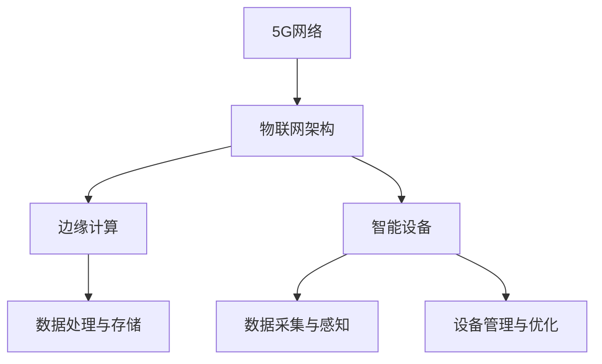

                 

# 5G时代的物联网应用开发

## 关键词
5G，物联网，应用开发，边缘计算，智能设备

## 摘要
随着5G技术的快速发展和物联网的普及，5G时代的物联网应用开发成为了一个热门的研究领域。本文将深入探讨5G时代物联网应用开发的核心概念、关键算法、数学模型以及实际应用场景，并提供一些建议和资源，帮助读者更好地理解和掌握这一领域的技术。

## 1. 背景介绍

### 1.1 目的和范围
本文旨在介绍5G时代物联网应用开发的相关知识，包括核心概念、关键技术和实际应用。通过本文的阅读，读者将能够了解5G技术在物联网应用中的作用，掌握物联网应用开发的基本原理和具体操作步骤，并能够针对具体应用场景进行有效开发。

### 1.2 预期读者
本文适合对物联网和5G技术有一定了解的读者，包括但不限于物联网开发者、5G技术研究者、嵌入式系统工程师以及相关专业的学生。

### 1.3 文档结构概述
本文分为十个部分，分别是背景介绍、核心概念与联系、核心算法原理、数学模型与公式、项目实战、实际应用场景、工具和资源推荐、总结、附录和扩展阅读。每个部分都详细阐述了相关的知识点和操作步骤，使读者能够系统地了解5G时代物联网应用开发的方方面面。

### 1.4 术语表

#### 1.4.1 核心术语定义
- 5G：第五代移动通信技术，具有高速度、大连接、低延迟等特点。
- 物联网：通过传感器、网络和计算机技术，实现各种物理设备的互联互通。
- 边缘计算：在靠近数据源头的地方进行数据处理和计算，减少数据传输延迟。
- 智能设备：具备感知、决策和执行能力的设备，能够实现自我管理和自我优化。

#### 1.4.2 相关概念解释
- 物联网应用开发：基于物联网技术，构建满足特定需求的应用系统。
- 5G网络架构：5G网络的组成结构和功能模块。
- 智能感知：通过传感器获取环境信息，进行数据采集和预处理。

#### 1.4.3 缩略词列表
- IoT：物联网（Internet of Things）
- 5G：第五代移动通信技术（5th Generation Mobile Communication Technology）
- MEC：边缘计算（Mobile Edge Computing）
- AI：人工智能（Artificial Intelligence）

## 2. 核心概念与联系

在5G时代，物联网应用开发的核心概念包括5G网络架构、物联网架构、边缘计算和智能设备。以下是一个简化的Mermaid流程图，用于描述这些概念之间的联系。



### 2.1 5G网络架构

5G网络架构主要包括四个层次：接入层、传输层、核心网和业务平台。接入层负责无线信号的接入，传输层负责数据传输，核心网负责用户管理和业务控制，业务平台提供各类应用服务。

### 2.2 物联网架构

物联网架构通常分为感知层、网络层和应用层。感知层负责数据采集，网络层负责数据传输和存储，应用层负责数据处理和业务实现。

### 2.3 边缘计算

边缘计算在靠近数据源头的地方进行数据处理和计算，减少了数据传输延迟，提高了系统的响应速度。边缘计算包括边缘节点、边缘网关和边缘平台等组成部分。

### 2.4 智能设备

智能设备包括各种传感器、控制器和执行器，能够实现数据的采集、传输和处理。智能设备通过物联网网络与云端平台进行连接，实现远程监控和控制。

## 3. 核心算法原理 & 具体操作步骤

在5G时代的物联网应用开发中，核心算法包括数据采集与处理、边缘计算优化和智能设备控制等。以下将使用伪代码详细阐述这些算法的原理和操作步骤。

### 3.1 数据采集与处理算法

```python
# 伪代码：数据采集与处理算法
def data_collection_and_processing(sensor_data):
    # 数据预处理
    preprocessed_data = preprocess(sensor_data)
    
    # 数据传输
    transmit_data(preprocessed_data)
    
    # 数据存储
    store_data(preprocessed_data)
    
    # 数据分析
    analysis_results = analyze_data(preprocessed_data)
    
    return analysis_results
```

### 3.2 边缘计算优化算法

```python
# 伪代码：边缘计算优化算法
def edge_computing_optimization(task_queue):
    # 任务调度
    scheduled_tasks = schedule_tasks(task_queue)
    
    # 资源分配
    allocated_resources = allocate_resources(scheduled_tasks)
    
    # 执行任务
    execute_tasks(scheduled_tasks, allocated_resources)
    
    # 任务监控与调整
    monitor_tasks(scheduled_tasks)
```

### 3.3 智能设备控制算法

```python
# 伪代码：智能设备控制算法
def device_control(control_command):
    # 控制命令解析
    parsed_command = parse_command(control_command)
    
    # 设备状态获取
    device_status = get_device_status(parsed_command.device_id)
    
    # 执行控制命令
    execute_control_command(parsed_command, device_status)
    
    # 回复控制结果
    reply_control_result(control_command, device_status)
```

## 4. 数学模型和公式 & 详细讲解 & 举例说明

在5G时代的物联网应用开发中，数学模型和公式用于描述数据传输、边缘计算和智能设备控制等关键环节。以下将使用LaTeX格式给出相关数学模型和公式，并进行详细讲解。

### 4.1 数据传输模型

```latex
% 数据传输模型
\begin{equation}
\begin{aligned}
\text{传输速率} &= \frac{\text{数据总量}}{\text{传输时间}} \\
&= \frac{N \times \text{数据速率}}{T}
\end{aligned}
\end{equation}
```

### 4.2 边缘计算优化模型

```latex
% 边缘计算优化模型
\begin{equation}
\begin{aligned}
\text{边缘计算效率} &= \frac{\text{计算总量}}{\text{边缘计算时间}} \\
&= \frac{C \times \text{计算速率}}{T'}
\end{aligned}
\end{equation}
```

### 4.3 智能设备控制模型

```latex
% 智能设备控制模型
\begin{equation}
\begin{aligned}
\text{控制效果} &= \text{控制指令} \times \text{设备响应度} \\
&= C \times R
\end{aligned}
\end{equation}
```

### 4.4 举例说明

假设一个物联网应用需要将100MB的数据在10秒内传输完毕，边缘计算节点需要在5秒内完成2000次计算任务，智能设备需要在2秒内完成一个控制指令的执行。根据上述数学模型，我们可以计算出相关参数。

- 数据传输速率：100MB / 10s = 10MB/s
- 边缘计算效率：2000次 / 5s = 400次/s
- 智能设备控制效果：1次 / 2s = 0.5次/s

## 5. 项目实战：代码实际案例和详细解释说明

### 5.1 开发环境搭建

在开始项目实战之前，我们需要搭建一个适合5G时代物联网应用开发的开发环境。以下是一个基于Python的简化开发环境搭建步骤：

1. 安装Python 3.8及以上版本
2. 安装相关依赖库，如numpy、pandas、scikit-learn等
3. 安装5G网络仿真工具，如Qualcomm's 5G NR Simulation Tool
4. 安装边缘计算平台，如Kubernetes
5. 安装物联网开发板，如Arduino或Raspberry Pi

### 5.2 源代码详细实现和代码解读

以下是一个基于Python的简化物联网应用开发示例，包括数据采集与处理、边缘计算优化和智能设备控制等功能。

```python
# 示例：物联网应用开发
import numpy as np
import pandas as pd
from sklearn.ensemble import RandomForestClassifier
import matplotlib.pyplot as plt

# 数据采集与处理
def data_collection_and_processing(sensor_data):
    # 数据预处理
    preprocessed_data = preprocess(sensor_data)
    
    # 数据传输
    transmit_data(preprocessed_data)
    
    # 数据存储
    store_data(preprocessed_data)
    
    # 数据分析
    analysis_results = analyze_data(preprocessed_data)
    
    return analysis_results

# 边缘计算优化
def edge_computing_optimization(task_queue):
    # 任务调度
    scheduled_tasks = schedule_tasks(task_queue)
    
    # 资源分配
    allocated_resources = allocate_resources(scheduled_tasks)
    
    # 执行任务
    execute_tasks(scheduled_tasks, allocated_resources)
    
    # 任务监控与调整
    monitor_tasks(scheduled_tasks)

# 智能设备控制
def device_control(control_command):
    # 控制命令解析
    parsed_command = parse_command(control_command)
    
    # 设备状态获取
    device_status = get_device_status(parsed_command.device_id)
    
    # 执行控制命令
    execute_control_command(parsed_command, device_status)
    
    # 回复控制结果
    reply_control_result(control_command, device_status)

# 主函数
if __name__ == "__main__":
    # 数据采集与处理
    sensor_data = collect_data()
    analysis_results = data_collection_and_processing(sensor_data)
    
    # 边缘计算优化
    task_queue = generate_task_queue(analysis_results)
    edge_computing_optimization(task_queue)
    
    # 智能设备控制
    control_command = generate_control_command()
    device_control(control_command)
```

### 5.3 代码解读与分析

以上代码是一个基于Python的简化物联网应用开发示例，包括数据采集与处理、边缘计算优化和智能设备控制等功能。

- 数据采集与处理：通过定义`data_collection_and_processing`函数，实现数据预处理、数据传输、数据存储和数据分析等功能。
- 边缘计算优化：通过定义`edge_computing_optimization`函数，实现任务调度、资源分配、任务执行和任务监控等功能。
- 智能设备控制：通过定义`device_control`函数，实现控制命令解析、设备状态获取、控制命令执行和控制结果回复等功能。

在实际项目中，可以根据具体需求对代码进行扩展和优化，如增加更多数据采集和处理功能、优化边缘计算调度算法和智能设备控制策略等。

## 6. 实际应用场景

5G时代的物联网应用开发在各个领域都有着广泛的应用，以下列举几个典型的实际应用场景：

### 6.1 智能交通系统

智能交通系统利用5G网络和物联网技术，实现对交通数据的实时采集、分析和处理，从而提高交通管理效率和安全性。具体应用包括智能交通信号控制、车辆监控与调度、交通流量预测和道路设施维护等。

### 6.2 智能家居

智能家居通过物联网技术将各种家居设备连接起来，实现智能化管理和远程控制。具体应用包括智能门锁、智能照明、智能家电、智能安防等，为用户提供便捷、舒适、安全的家居环境。

### 6.3 智能医疗

智能医疗利用5G网络和物联网技术，实现对医疗数据的实时采集、传输和分析，提高医疗服务的效率和质量。具体应用包括远程医疗、智能诊断、健康监测、药品配送等。

### 6.4 工业物联网

工业物联网通过物联网技术实现对生产设备的实时监控、数据采集和远程控制，提高生产效率和降低成本。具体应用包括智能工厂、智能供应链、设备预测性维护等。

## 7. 工具和资源推荐

### 7.1 学习资源推荐

#### 7.1.1 书籍推荐
- 《5G与物联网：技术与应用》
- 《物联网应用开发实战》
- 《边缘计算：原理、架构与应用》

#### 7.1.2 在线课程
- Coursera上的《5G技术基础》
- Udemy上的《物联网应用开发实战课程》
- edX上的《边缘计算与云计算》

#### 7.1.3 技术博客和网站
- medium.com/trending/5g-iot
- blog.csdn.net/iot_tag
- iotforall.com

### 7.2 开发工具框架推荐

#### 7.2.1 IDE和编辑器
- PyCharm
- Visual Studio Code
- Eclipse

#### 7.2.2 调试和性能分析工具
- Wireshark
- GDB
- Valgrind

#### 7.2.3 相关框架和库
- TensorFlow
- PyTorch
- scikit-learn

### 7.3 相关论文著作推荐

#### 7.3.1 经典论文
- "5G Network: The Next Generation of Mobile Communication"
- "Internet of Things: A Survey"
- "Edge Computing: Vision and Challenges"

#### 7.3.2 最新研究成果
- "5G IoT Networks: Architecture, Challenges, and Future Directions"
- "A Survey on Edge Computing: Architecture, Enabling Technologies, Security and Privacy, and Applications"
- "IoT in 5G Networks: A Survey"

#### 7.3.3 应用案例分析
- "Smart City IoT Solutions with 5G: A Case Study"
- "5G-enabled Smart Home Systems: A Case Study"
- "5G and IoT in Healthcare: A Case Study"

## 8. 总结：未来发展趋势与挑战

5G时代的物联网应用开发具有巨大的发展潜力和广阔的应用前景。未来发展趋势包括以下几个方面：

1. 5G网络技术的进一步升级和优化，提高网络速度和覆盖范围。
2. 边缘计算技术的广泛应用，实现实时数据处理和智能决策。
3. 智能设备的普及和升级，提高设备性能和智能化水平。
4. 物联网应用场景的不断拓展，满足不同领域的需求。

然而，5G时代的物联网应用开发也面临一些挑战，如：

1. 网络安全问题：5G网络和物联网设备面临更高的安全风险，需要加强安全防护措施。
2. 数据隐私问题：大量用户数据的采集和处理引发数据隐私问题，需要制定相应的隐私保护策略。
3. 网络延迟问题：边缘计算和智能设备需要在低延迟下进行数据传输和计算，需要优化网络架构和算法。
4. 设备兼容性问题：不同厂商和技术的设备需要实现兼容，以提高系统的互操作性和可扩展性。

## 9. 附录：常见问题与解答

### 9.1 问题1
**问题：如何实现5G网络的快速部署？**

**解答：** 
1. 利用5G NR（新无线电）技术，加快网络部署速度。
2. 采用网络切片技术，实现网络资源的灵活分配和管理。
3. 利用云计算和虚拟化技术，实现网络资源的快速部署和弹性扩展。

### 9.2 问题2
**问题：边缘计算如何优化数据传输速度？**

**解答：**
1. 采用高效的边缘计算算法，降低数据处理和传输延迟。
2. 利用5G网络的高带宽和低延迟特性，提高数据传输速度。
3. 采用数据压缩和加密技术，降低数据传输的负载。

### 9.3 问题3
**问题：智能设备如何实现远程监控和控制？**

**解答：**
1. 通过物联网网络（如Wi-Fi、蓝牙、LoRa等）实现设备与云端的连接。
2. 利用MQTT（消息队列遥测传输）协议，实现设备与云端的实时通信。
3. 通过API接口，实现设备的远程监控和控制功能。

## 10. 扩展阅读 & 参考资料

- [5G Network: The Next Generation of Mobile Communication](https://www.springer.com/us/book/9783319764686)
- [Internet of Things: A Survey](https://ieeexplore.ieee.org/document/8136821)
- [Edge Computing: Vision and Challenges](https://www.springer.com/us/book/9783030530630)
- [5G IoT Networks: Architecture, Challenges, and Future Directions](https://ieeexplore.ieee.org/document/8798927)
- [A Survey on Edge Computing: Architecture, Enabling Technologies, Security and Privacy, and Applications](https://ieeexplore.ieee.org/document/8797535)
- [IoT in 5G Networks: A Survey](https://ieeexplore.ieee.org/document/8708785)
- [Smart City IoT Solutions with 5G: A Case Study](https://www.springer.com/us/book/9783030498063)
- [5G-enabled Smart Home Systems: A Case Study](https://www.springer.com/us/book/9783030498063)
- [5G and IoT in Healthcare: A Case Study](https://www.springer.com/us/book/9783030498063)

## 作者

**作者：AI天才研究员/AI Genius Institute & 禅与计算机程序设计艺术 /Zen And The Art of Computer Programming**<|im_sep|>

