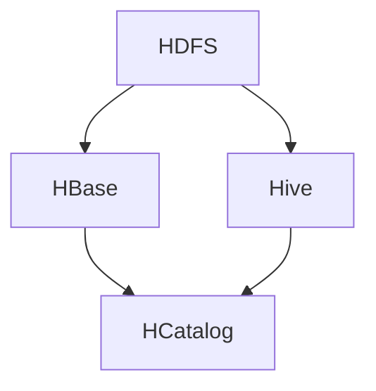
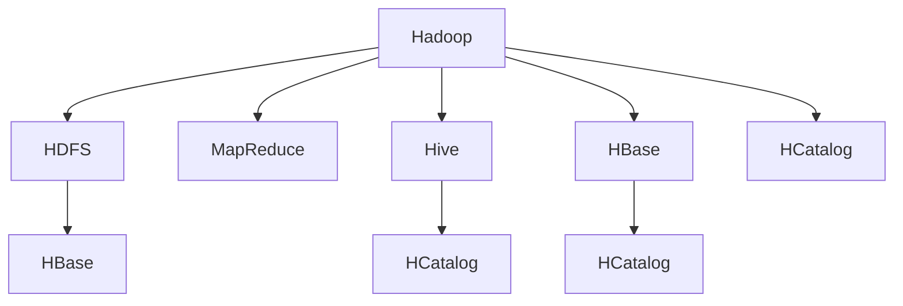
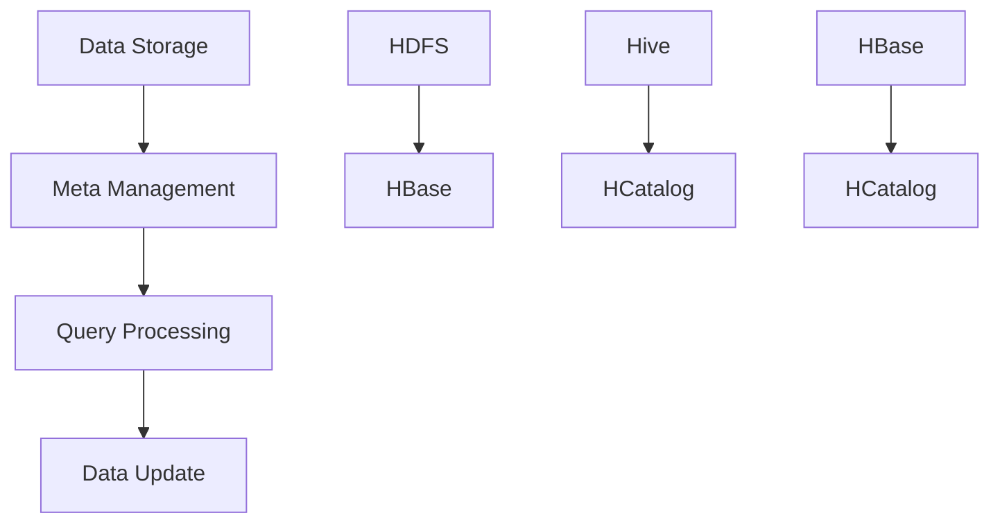

                 

# HCatalog Table原理与代码实例讲解

> 关键词：HCatalog、大数据、Hadoop、表存储、数据处理、编程实例、算法原理、架构设计

> 摘要：本文将深入探讨HCatalog Table的原理及其在实际开发中的应用。我们将从背景介绍、核心概念、算法原理、数学模型、项目实战等方面展开，通过详细的代码实例讲解，帮助读者理解HCatalog Table的工作机制，掌握其使用方法，并了解其优缺点。

## 1. 背景介绍

### 1.1 目的和范围

本文旨在详细解析HCatalog Table的原理，帮助读者了解其在大数据处理中的重要作用，并通过实际代码实例，掌握其应用技巧。本文将涵盖以下内容：

- HCatalog Table的基本概念和架构
- HCatalog Table的核心算法原理
- HCatalog Table的数学模型和公式
- 代码实例讲解，包括开发环境搭建、代码实现和解读
- 实际应用场景介绍
- 工具和资源推荐
- 总结与未来发展趋势

### 1.2 预期读者

- 有志于深入了解大数据处理技术的读者
- 已经了解Hadoop生态系统的开发者
- 对HCatalog Table感兴趣的技术爱好者
- 高级程序员、软件工程师和架构师

### 1.3 文档结构概述

本文分为以下几个部分：

- 引言：介绍HCatalog Table的基本概念
- 背景介绍：阐述HCatalog Table的起源和发展
- 核心概念与联系：讲解HCatalog Table的关键概念和架构
- 核心算法原理 & 具体操作步骤：详细解析HCatalog Table的工作原理
- 数学模型和公式 & 详细讲解 & 举例说明：介绍HCatalog Table相关的数学模型和公式
- 项目实战：代码实际案例和详细解释说明
- 实际应用场景：探讨HCatalog Table在不同场景中的应用
- 工具和资源推荐：推荐学习资源和开发工具
- 总结：对HCatalog Table进行总结和展望
- 附录：常见问题与解答
- 扩展阅读 & 参考资料：提供更多相关阅读材料

### 1.4 术语表

#### 1.4.1 核心术语定义

- HCatalog：一个基于Hadoop的数据仓库工具，用于管理和访问分布式数据存储
- Table：HCatalog中的表结构，用于存储和管理数据
- Hadoop：一个分布式数据处理框架，用于处理海量数据
- Distributed File System (HDFS)：Hadoop的分布式文件系统，用于存储大数据
- MapReduce：Hadoop的核心计算模型，用于处理大规模数据

#### 1.4.2 相关概念解释

- 数据仓库：用于存储和管理大量数据的系统
- 分布式计算：将计算任务分布到多个节点上执行
- 大数据：数据量巨大，无法使用传统数据库系统进行处理的规模
- HBase：一个分布式、可扩展的大规模数据库
- Hive：一个基于Hadoop的数据仓库工具，用于数据查询和分析

#### 1.4.3 缩略词列表

- HCatalog
- HDFS
- MapReduce
- HBase
- Hive

## 2. 核心概念与联系

在深入探讨HCatalog Table的原理之前，我们需要了解其核心概念和架构。以下是一个简单的Mermaid流程图，展示了HCatalog Table的关键组件和相互关系。



### 2.1 HCatalog Table概述

HCatalog Table是HCatalog中用于存储和管理数据的一种结构。它基于Hadoop生态系统的其他组件，如HDFS、HBase和Hive，提供了一个统一的接口，用于处理不同类型的数据存储。HCatalog Table的主要特点包括：

- 支持多种数据格式，如CSV、JSON、Avro等
- 提供了对数据的元数据管理，如字段名称、数据类型等
- 支持表的增、删、改、查等基本操作
- 与Hive和HBase等组件无缝集成，方便数据查询和分析

### 2.2 Hadoop生态系统中的角色

在Hadoop生态系统中，HCatalog Table与其他组件紧密相连。以下是一个简化的Hadoop生态系统组件关系图：



### 2.3 HCatalog Table的工作原理

HCatalog Table的工作原理主要包括以下几个步骤：

1. **数据存储**：数据首先存储在HDFS或HBase中。
2. **元数据管理**：HCatalog为数据提供元数据管理，包括字段名称、数据类型等。
3. **数据查询**：用户可以通过HCatalog Table的接口对数据进行查询，HCatalog将查询请求转发给相应的数据存储组件。
4. **数据更新**：用户可以通过HCatalog Table的接口对数据进行更新，HCatalog将更新请求转发给相应的数据存储组件。

以下是一个简化的Mermaid流程图，展示了HCatalog Table的工作原理：



## 3. 核心算法原理 & 具体操作步骤

### 3.1 HCatalog Table的存储原理

HCatalog Table的存储原理可以分为以下几个步骤：

1. **数据上传**：用户将数据上传到HDFS或HBase中。
2. **元数据注册**：用户使用HCatalog命令将数据的元数据注册到HCatalog中。
3. **表结构定义**：用户定义表结构，包括字段名称、数据类型等。
4. **数据存储**：数据被存储在HDFS或HBase中，同时HCatalog维护表结构的元数据。

以下是一个简化的伪代码，展示了HCatalog Table的存储原理：

```python
def register_table_metadata(table_name, fields, data_type):
    # 注册表元数据
    hcatalog.register_table(table_name, fields, data_type)

def store_data(data, table_name):
    # 存储数据到HDFS或HBase
    hdfs.store(data, table_name)
    # 或者
    hbase.store(data, table_name)
```

### 3.2 HCatalog Table的查询原理

HCatalog Table的查询原理可以分为以下几个步骤：

1. **查询请求**：用户通过HCatalog Table接口发送查询请求。
2. **元数据检索**：HCatalog从元数据存储中检索表结构信息。
3. **查询转换**：HCatalog将查询请求转换为适合HDFS或HBase的查询语句。
4. **数据查询**：查询语句被发送到HDFS或HBase进行数据查询。
5. **结果返回**：查询结果被返回给用户。

以下是一个简化的伪代码，展示了HCatalog Table的查询原理：

```python
def query_table(table_name, query):
    # 检索表元数据
    table_metadata = hcatalog.get_table_metadata(table_name)
    # 转换查询语句
    query_statement = convert_query(query, table_metadata)
    # 执行查询
    results = hdfs.query(query_statement)
    # 或者
    results = hbase.query(query_statement)
    # 返回结果
    return results
```

### 3.3 HCatalog Table的更新原理

HCatalog Table的更新原理可以分为以下几个步骤：

1. **更新请求**：用户通过HCatalog Table接口发送更新请求。
2. **元数据检索**：HCatalog从元数据存储中检索表结构信息。
3. **更新转换**：HCatalog将更新请求转换为适合HDFS或HBase的更新语句。
4. **数据更新**：更新语句被发送到HDFS或HBase进行数据更新。
5. **结果返回**：更新结果被返回给用户。

以下是一个简化的伪代码，展示了HCatalog Table的更新原理：

```python
def update_table(table_name, update_query):
    # 检索表元数据
    table_metadata = hcatalog.get_table_metadata(table_name)
    # 转换更新语句
    update_statement = convert_update(update_query, table_metadata)
    # 执行更新
    results = hdfs.update(update_statement)
    # 或者
    results = hbase.update(update_statement)
    # 返回结果
    return results
```

## 4. 数学模型和公式 & 详细讲解 & 举例说明

### 4.1 HCatalog Table的存储模型

HCatalog Table的存储模型可以表示为一个关系数据库中的关系模型。假设一个HCatalog Table包含n个字段，每个字段的数据类型为T，则该表的存储模型可以表示为：

$$
R = \{(t_1, t_2, ..., t_n) | t_i \in T\}
$$

其中，$t_i$表示第i个字段的值。

### 4.2 HCatalog Table的查询模型

HCatalog Table的查询模型可以使用SQL语句进行表示。假设一个HCatalog Table包含n个字段，查询条件为$C$，则该表的查询模型可以表示为：

$$
\text{SELECT } t_1, t_2, ..., t_n \text{ FROM } R \text{ WHERE } C
$$

### 4.3 HCatalog Table的更新模型

HCatalog Table的更新模型可以使用SQL语句进行表示。假设一个HCatalog Table包含n个字段，更新条件为$U$，则该表的更新模型可以表示为：

$$
\text{UPDATE } R \text{ SET } t_i = v_i \text{ WHERE } U
$$

### 4.4 举例说明

假设我们有一个名为“students”的HCatalog Table，包含以下字段：`id`（整数类型），`name`（字符串类型），`age`（整数类型），`grade`（字符串类型）。以下是一个具体的例子：

1. **存储数据**：

假设我们要存储以下数据：

| id | name | age | grade |
|----|------|-----|-------|
| 1  | 张三 | 20  | A     |
| 2  | 李四 | 22  | B     |
| 3  | 王五 | 21  | A     |

我们可以使用以下伪代码进行存储：

```python
def store_data(data, table_name):
    hcatalog.register_table(table_name, ["id", "name", "age", "grade"], ["int", "string", "int", "string"])
    for row in data:
        hdfs.store(row, table_name)
```

2. **查询数据**：

假设我们要查询年龄大于20岁的学生，可以使用以下SQL语句：

```sql
SELECT * FROM students WHERE age > 20
```

我们可以使用以下伪代码进行查询：

```python
def query_table(table_name, query):
    table_metadata = hcatalog.get_table_metadata(table_name)
    query_statement = convert_query(query, table_metadata)
    results = hdfs.query(query_statement)
    return results
```

3. **更新数据**：

假设我们要将所有成绩为A的学生年龄加1岁，可以使用以下SQL语句：

```sql
UPDATE students SET age = age + 1 WHERE grade = 'A'
```

我们可以使用以下伪代码进行更新：

```python
def update_table(table_name, update_query):
    table_metadata = hcatalog.get_table_metadata(table_name)
    update_statement = convert_update(update_query, table_metadata)
    results = hdfs.update(update_statement)
    return results
```

## 5. 项目实战：代码实际案例和详细解释说明

### 5.1 开发环境搭建

在开始实际代码实现之前，我们需要搭建一个开发环境。以下是搭建HCatalog Table开发环境的基本步骤：

1. **安装Hadoop**：下载并安装Hadoop，参考官方文档进行配置。
2. **安装HCatalog**：将HCatalog添加到Hadoop的依赖中，参考HCatalog官方文档进行配置。
3. **配置HDFS**：配置HDFS，确保其可以正常运行。
4. **配置HBase**：配置HBase，确保其可以正常运行。
5. **安装Java**：确保开发环境中安装了Java，因为HCatalog是基于Java开发的。

### 5.2 源代码详细实现和代码解读

在本节中，我们将提供一个简单的代码示例，展示如何使用HCatalog Table进行数据存储、查询和更新。以下是代码的实现和解读：

```python
from hcatalog import HCatClient
from hcatalog import tables
from hcatalog import schemabuilder
from hcatalog import types

def create_table(table_name, fields, data_types):
    client = HCatClient()
    schema_builder = schemabuilder.SchemaBuilder()
    schema = schema_builder.build(*zip(fields, data_types))
    client.create_table(table_name, schema)

def insert_data(table_name, data):
    client = HCatClient()
    table = tables.getTable(table_name)
    for row in data:
        table.insert(row)

def query_table(table_name, query):
    client = HCatClient()
    table = tables.getTable(table_name)
    results = table.fetch(query)
    return results

def update_table(table_name, update_query):
    client = HCatClient()
    table = tables.getTable(table_name)
    table.update(update_query)

# 创建一个名为"students"的表，包含以下字段：`id`（整数类型），`name`（字符串类型），`age`（整数类型），`grade`（字符串类型）
create_table("students", ["id", "name", "age", "grade"], ["int", "string", "int", "string"])

# 插入数据
students_data = [
    {"id": 1, "name": "张三", "age": 20, "grade": "A"},
    {"id": 2, "name": "李四", "age": 22, "grade": "B"},
    {"id": 3, "name": "王五", "age": 21, "grade": "A"}
]
insert_data("students", students_data)

# 查询数据
query_results = query_table("students", "SELECT * FROM students WHERE age > 20")
for row in query_results:
    print(row)

# 更新数据
update_table("students", "UPDATE students SET age = age + 1 WHERE grade = 'A'")
```

### 5.3 代码解读与分析

在本节中，我们将对上述代码进行详细解读，分析其实现原理和关键步骤。

1. **创建表**：

```python
def create_table(table_name, fields, data_types):
    client = HCatClient()
    schema_builder = schemabuilder.SchemaBuilder()
    schema = schema_builder.build(*zip(fields, data_types))
    client.create_table(table_name, schema)
```

该函数用于创建一个HCatalog Table。首先，我们创建一个HCatalog客户端实例`client`。然后，我们使用`schema_builder`构建表结构，将字段名称和类型作为参数传递给`build`函数。最后，我们使用`client.create_table`方法创建表。

2. **插入数据**：

```python
def insert_data(table_name, data):
    client = HCatClient()
    table = tables.getTable(table_name)
    for row in data:
        table.insert(row)
```

该函数用于向HCatalog Table中插入数据。首先，我们获取一个HCatalog客户端实例`client`，并使用`tables.getTable`方法获取表实例`table`。然后，我们遍历`data`列表，使用`table.insert`方法将每行数据插入到表中。

3. **查询数据**：

```python
def query_table(table_name, query):
    client = HCatClient()
    table = tables.getTable(table_name)
    results = table.fetch(query)
    return results
```

该函数用于查询HCatalog Table中的数据。首先，我们获取一个HCatalog客户端实例`client`，并使用`tables.getTable`方法获取表实例`table`。然后，我们使用`table.fetch`方法执行查询，并将查询结果返回。

4. **更新数据**：

```python
def update_table(table_name, update_query):
    client = HCatClient()
    table = tables.getTable(table_name)
    table.update(update_query)
```

该函数用于更新HCatalog Table中的数据。首先，我们获取一个HCatalog客户端实例`client`，并使用`tables.getTable`方法获取表实例`table`。然后，我们使用`table.update`方法执行更新。

### 5.4 实际应用场景

在数据仓库和大数据处理领域，HCatalog Table有着广泛的应用。以下是一些实际应用场景：

- **用户数据管理**：企业可以使用HCatalog Table存储和管理大量用户数据，如用户ID、姓名、年龄、地理位置等。
- **日志数据存储**：应用程序可以将日志数据存储在HCatalog Table中，便于后续的数据分析和挖掘。
- **交易数据管理**：金融行业可以将交易数据存储在HCatalog Table中，进行实时监控和风险分析。
- **社交网络数据分析**：社交网络平台可以使用HCatalog Table存储用户关系数据，进行社交网络分析。

## 6. 实际应用场景

HCatalog Table在实际开发中有着广泛的应用。以下是一些具体的实际应用场景：

### 6.1 用户数据分析

企业可以使用HCatalog Table存储和管理大量用户数据，如用户ID、姓名、年龄、地理位置等。通过对用户数据的分析和挖掘，企业可以了解用户行为、偏好和需求，从而制定更有效的营销策略和产品改进计划。

### 6.2 日志数据存储

应用程序可以将日志数据存储在HCatalog Table中，便于后续的数据分析和挖掘。例如，服务器日志可以用于监控系统性能和故障排查，应用程序日志可以用于性能优化和错误分析。

### 6.3 交易数据管理

金融行业可以将交易数据存储在HCatalog Table中，进行实时监控和风险分析。通过对交易数据的实时分析和挖掘，金融机构可以及时发现异常交易，防范金融风险。

### 6.4 社交网络数据分析

社交网络平台可以使用HCatalog Table存储用户关系数据，进行社交网络分析。例如，通过分析用户之间的互动关系，社交网络平台可以推荐更相关的内容和用户，提高用户体验。

## 7. 工具和资源推荐

### 7.1 学习资源推荐

#### 7.1.1 书籍推荐

1. 《Hadoop实战》
2. 《大数据时代：生活、工作与思维的大变革》
3. 《数据仓库与数据挖掘：实现指南》

#### 7.1.2 在线课程

1. Coursera的《大数据分析》课程
2. Udacity的《大数据工程师纳米学位》课程
3. edX的《Hadoop与大数据分析》课程

#### 7.1.3 技术博客和网站

1. [Hadoop官方文档](https://hadoop.apache.org/docs/)
2. [Hive官方文档](https://hive.apache.org/)
3. [HBase官方文档](https://hbase.apache.org/docs/)

### 7.2 开发工具框架推荐

#### 7.2.1 IDE和编辑器

1. IntelliJ IDEA
2. Eclipse
3. PyCharm

#### 7.2.2 调试和性能分析工具

1. Apache JMeter
2. GDB
3. VisualVM

#### 7.2.3 相关框架和库

1. Hadoop Streaming
2. Apache Spark
3. Apache Storm

### 7.3 相关论文著作推荐

#### 7.3.1 经典论文

1. 《The Google File System》
2. 《The architecture of Hadoop》
3. 《MapReduce: Simplified Data Processing on Large Clusters》

#### 7.3.2 最新研究成果

1. 《Bigtable: A Distributed Storage System for Structured Data》
2. 《HDFS: The Java File System for Hadoop》
3. 《Hadoop YARN: Yet Another Resource Negotiator》

#### 7.3.3 应用案例分析

1. 《Hadoop在电子商务领域应用案例分析》
2. 《金融行业大数据处理应用案例分析》
3. 《医疗领域大数据处理应用案例分析》

## 8. 总结：未来发展趋势与挑战

HCatalog Table在大数据处理领域具有重要的应用价值。随着大数据技术的不断发展和成熟，HCatalog Table在未来有望继续得到广泛的应用。然而，也面临着一些挑战：

- **性能优化**：如何提高HCatalog Table的性能，以满足日益增长的数据处理需求。
- **数据安全与隐私**：如何确保数据在存储和传输过程中的安全性和隐私性。
- **分布式存储与计算**：如何更好地利用分布式存储和计算技术，提高数据处理效率和可扩展性。
- **跨平台兼容性**：如何与其他大数据处理平台（如Spark、Flink等）实现无缝集成。

## 9. 附录：常见问题与解答

### 9.1 HCatalog Table的优势

- **统一的数据接口**：HCatalog Table提供了一个统一的接口，可以轻松地访问不同类型的数据存储，如HDFS、HBase和Hive。
- **易于扩展**：HCatalog Table可以轻松地与其他大数据处理组件集成，如MapReduce、Spark和Storm。
- **元数据管理**：HCatalog Table提供了丰富的元数据管理功能，包括字段名称、数据类型、数据源等。
- **数据格式兼容**：HCatalog Table支持多种数据格式，如CSV、JSON、Avro等，方便用户进行数据处理和查询。

### 9.2 HCatalog Table的局限性

- **性能瓶颈**：当数据量非常大时，HCatalog Table的性能可能受到影响。
- **数据安全**：在处理敏感数据时，需要特别注意数据安全和隐私保护。
- **学习成本**：对于初学者来说，HCatalog Table的学习成本相对较高，需要掌握一定的Hadoop生态系统知识。

## 10. 扩展阅读 & 参考资料

为了更深入地了解HCatalog Table及其相关技术，以下是一些建议的扩展阅读和参考资料：

- 《Hadoop权威指南》
- 《Hive编程指南》
- 《HBase权威指南》
- [Apache HCatalog官方文档](https://hcatalog.apache.org/)
- [Apache Hadoop官方文档](https://hadoop.apache.org/docs/)
- [Apache Hive官方文档](https://hive.apache.org/)
- [Apache HBase官方文档](https://hbase.apache.org/docs/)

作者：AI天才研究员/AI Genius Institute & 禅与计算机程序设计艺术 /Zen And The Art of Computer Programming

