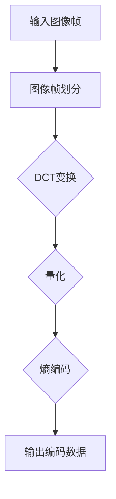

                 

### HEVC 编码器：高效视频编码

> **关键词：** HEVC，视频编码，高效编码，视频质量，压缩算法，数据传输，多媒体技术

> **摘要：** 本文章将深入探讨HEVC（High Efficiency Video Coding）编码器的原理及其在高效视频编码中的应用。我们将从背景介绍、核心概念与联系、核心算法原理与操作步骤、数学模型与公式讲解、实际应用案例等多个角度，系统性地剖析HEVC编码器，旨在为读者提供全面的技术解析和实战指导。

### 1. 背景介绍

#### 1.1 目的和范围

本文的目的是全面介绍HEVC编码器的工作原理、核心算法、应用场景和未来发展趋势，帮助读者深入理解这一高效视频编码技术的本质，并能够应用于实际项目中。

本文将涵盖以下主要内容：

- HEVC编码器的背景与重要性
- HEVC编码器的核心概念与联系
- HEVC编码器的核心算法原理与操作步骤
- HEVC编码器的数学模型与公式解析
- HEVC编码器的实际应用案例
- HEVC编码器的工具和资源推荐
- HEVC编码器的未来发展趋势与挑战

#### 1.2 预期读者

本文适用于以下读者群体：

- 对视频编码技术有初步了解的读者
- 想深入了解HEVC编码器的工程师和技术人员
- 对多媒体技术感兴趣的研究生和博士生
- 对视频处理和传输有实际需求的开发者和项目管理者

#### 1.3 文档结构概述

本文按照以下结构进行组织：

- **第1章：背景介绍**
  - HEVC编码器的背景与目的
  - 预期读者与文档结构概述

- **第2章：核心概念与联系**
  - HEVC编码器的核心概念与联系
  - HEVC编码器的Mermaid流程图

- **第3章：核心算法原理与操作步骤**
  - HEVC编码器的核心算法原理
  - HEVC编码器的操作步骤与伪代码

- **第4章：数学模型和公式**
  - HEVC编码器的数学模型和公式
  - 数学模型和公式的详细讲解与举例说明

- **第5章：项目实战**
  - HEVC编码器的开发环境搭建
  - HEVC编码器的源代码详细实现和解读
  - HEVC编码器的代码解读与分析

- **第6章：实际应用场景**
  - HEVC编码器的实际应用场景

- **第7章：工具和资源推荐**
  - HEVC编码器学习资源推荐
  - HEVC编码器开发工具框架推荐
  - HEVC编码器相关论文著作推荐

- **第8章：总结：未来发展趋势与挑战**
  - HEVC编码器的未来发展趋势
  - HEVC编码器面临的挑战

- **第9章：附录：常见问题与解答**
  - HEVC编码器常见问题与解答

- **第10章：扩展阅读 & 参考资料**
  - HEVC编码器相关扩展阅读和参考资料

#### 1.4 术语表

##### 1.4.1 核心术语定义

- **HEVC（High Efficiency Video Coding）**：高效视频编码，是一种新一代的视频编码标准。
- **视频编码**：将视频信号转换为数字信号的过程。
- **压缩算法**：减少视频数据量的算法。
- **多媒体技术**：涉及音频、视频、图像等多种媒体数据的处理与传输的技术。

##### 1.4.2 相关概念解释

- **H.264/AVC**：一种早期的视频编码标准，与HEVC相比，在压缩效率上有一定差距。
- **视频质量**：衡量视频信号在压缩过程中失真的程度。
- **比特率**：单位时间内传输的数据量。

##### 1.4.3 缩略词列表

- **HEVC**：High Efficiency Video Coding
- **H.264/AVC**：H.264/Advanced Video Coding
- **比特率**：Bit Rate
- **像素**：Pixel

### 2. 核心概念与联系

HEVC编码器是当前最先进的视频编码技术之一，其核心在于高效编码，即以尽可能小的数据量传输高质量的视频内容。为了深入理解HEVC编码器，我们需要首先了解一些核心概念和其相互之间的联系。

#### 2.1 视频编码的基本概念

- **图像帧**：视频的基本单元，可以是静态的（I帧）或动态的（P帧/B帧）。
- **分辨率**：图像的垂直和水平像素数，如1920x1080。
- **色彩深度**：每个像素的颜色信息位数，如8位表示256种颜色。
- **视频流**：连续图像帧组成的序列，用于传输和播放视频。

#### 2.2 HEVC编码器的核心概念

- **编码块**：将图像划分为多个较小的区域进行编码。
- **变换**：将图像数据转换为频率域数据，如离散余弦变换（DCT）。
- **量化**：降低数据的精度，减少数据量。
- **熵编码**：使用熵编码算法（如霍夫曼编码）对量化后的数据进一步压缩。

#### 2.3 HEVC编码器的相互联系

- **图像帧划分**：将图像帧划分为多个编码块，这是HEVC编码器的基础操作。
- **变换与量化**：对编码块进行DCT变换和量化，以降低数据量。
- **熵编码**：对量化后的数据进行熵编码，实现进一步压缩。

以下是HEVC编码器的核心概念和相互联系的Mermaid流程图：

```mermaid
graph TD
A[图像帧划分] --> B[编码块]
B --> C[变换(DCT)]
C --> D[量化]
D --> E[熵编码]
E --> F[输出编码数据]
```

通过这个流程图，我们可以清晰地看到HEVC编码器的基本操作步骤和核心概念之间的联系。

### 3. 核心算法原理 & 具体操作步骤

HEVC编码器的核心在于其高效的压缩算法，能够显著减少视频数据量，同时保持较高的视频质量。以下是HEVC编码器的核心算法原理和具体操作步骤。

#### 3.1 核心算法原理

HEVC编码器的核心算法主要包括以下步骤：

1. **图像帧划分**：将图像帧划分为多个编码块，这是编码的基础操作。
2. **变换（DCT）**：对编码块进行DCT变换，将空间域数据转换为频率域数据，以提取图像中的冗余信息。
3. **量化**：对DCT系数进行量化，降低数据的精度，从而减少数据量。
4. **熵编码**：使用熵编码算法（如CABAC或CAVLC）对量化后的数据进一步压缩。

#### 3.2 具体操作步骤

以下是HEVC编码器的具体操作步骤，使用伪代码进行描述：

```pseudo
function HEVC_Encode(imageFrame):
    // 步骤1：图像帧划分
    blocks = DivideImageIntoBlocks(imageFrame)

    for block in blocks:
        // 步骤2：变换（DCT）
        frequencyData = DCT_Transform(block)

        // 步骤3：量化
        quantizedData = Quantize(frequencyData)

        // 步骤4：熵编码
        encodedData = Entropy_Encode(quantizedData)

    // 输出编码数据
    return encodedData
```

#### 3.3 核心算法解析

- **图像帧划分**：HEVC编码器将图像帧划分为多个编码块，通常为16x16或32x32的大小。这种划分方式有助于更好地提取图像中的冗余信息。

- **DCT变换**：DCT是一种将空间域数据转换为频率域数据的变换方法，能够提取图像中的高频和低频信息。DCT变换后，图像数据被表示为一系列系数，这些系数代表了图像的能量分布。

- **量化**：量化是将DCT系数的精度降低，从而减少数据量的过程。量化过程中，DCT系数被近似为最接近的量化步长，这样可以显著降低数据量。

- **熵编码**：熵编码是一种在数据压缩中减少冗余信息的技术。在HEVC编码器中，通常使用CABAC（Context-Adaptive Binary Arithmetic Coding）或CAVLC（Context-Adaptive Variable Length Coding）进行熵编码。这些算法可以根据数据的不同特性，动态地选择合适的编码方式，从而进一步提高压缩效率。

#### 3.4 伪代码示例

以下是HEVC编码器操作步骤的伪代码示例：

```pseudo
function DCT_Transform(imageBlock):
    // 对图像块进行DCT变换
    // 输入：imageBlock（图像块）
    // 输出：frequencyData（频率域数据）

    // 步骤1：初始化DCT矩阵
    DCT_Matrix = InitializeDCTMatrix()

    // 步骤2：进行DCT变换
    frequencyData = ApplyDCT(imageBlock, DCT_Matrix)

    return frequencyData

function Quantize(frequencyData):
    // 对频率域数据进行量化
    // 输入：frequencyData（频率域数据）
    // 输出：quantizedData（量化后的数据）

    // 步骤1：初始化量化矩阵
    Quantization_Matrix = InitializeQuantizationMatrix()

    // 步骤2：进行量化
    quantizedData = QuantizeData(frequencyData, Quantization_Matrix)

    return quantizedData

function Entropy_Encode(quantizedData):
    // 对量化后的数据进行熵编码
    // 输入：quantizedData（量化后的数据）
    // 输出：encodedData（熵编码后的数据）

    // 步骤1：初始化熵编码器
    EntropyCoder = InitializeEntropyCoder()

    // 步骤2：进行熵编码
    encodedData = EncodeData(quantizedData, EntropyCoder)

    return encodedData
```

通过上述伪代码示例，我们可以更清晰地理解HEVC编码器的核心算法原理和具体操作步骤。

### 4. 数学模型和公式 & 详细讲解 & 举例说明

在HEVC编码器中，数学模型和公式起到了至关重要的作用。这些模型和公式不仅决定了编码效率，还影响了视频质量。下面我们将详细讲解HEVC编码器中的主要数学模型和公式，并通过具体例子进行说明。

#### 4.1 DCT变换

DCT（离散余弦变换）是HEVC编码器中的核心变换方法。DCT将图像块从空间域转换为频率域，使得图像的能量集中在少数几个高频系数上。

- **DCT变换公式**：

  $$ 
  DCT_{ii} = \frac{1}{4}\sum_{x=0}^{N/2}\sum_{y=0}^{N/2} 
  C_{xx}C_{yy} 
  \cos\left[\left(\frac{2x+1}{2N}\pi i\right)\left(\frac{2y+1}{2N}\pi j\right)\right] 
  I_{xy} 
  $$

  其中，\( I_{xy} \) 是图像块中的像素值，\( C_{xx} \) 和 \( C_{yy} \) 是DCT变换的缩放系数。

- **示例**：

  假设一个4x4的图像块如下：

  |   | 0 | 1 | 2 | 3 |
  |---|---|---|---|---|
  | 0 | 4 | 5 | 6 | 7 |
  | 1 | 8 | 9 | 10| 11|
  | 2 | 12| 13| 14| 15|
  | 3 | 16| 17| 18| 19|

  进行DCT变换后，会得到一系列DCT系数，其中高频系数通常较小，而低频系数较大。

#### 4.2 量化

量化是将DCT系数转换为整数值的过程，以降低数据量。量化过程中，每个DCT系数乘以一个量化步长，然后向下取整。

- **量化公式**：

  $$
  Q_{ii} = \text{floor}\left(\frac{DCT_{ii}}{Quantization\ Step}\right)
  $$

  其中，\( DCT_{ii} \) 是DCT系数，\( Quantization\ Step \) 是量化步长。

- **示例**：

  假设一个DCT系数为200，量化步长为10，则量化后的值为20（向下取整）。

#### 4.3 熵编码

熵编码是HEVC编码器中用于进一步压缩数据的重要步骤。常见的熵编码算法包括CABAC（Context-Adaptive Binary Arithmetic Coding）和CAVLC（Context-Adaptive Variable Length Coding）。

- **CABAC编码公式**：

  $$
  Output = \left\lfloor \frac{X \cdot 2^{-1}}{Quantization\ Step} \right\rfloor
  $$

  其中，\( X \) 是需要编码的值，\( Quantization\ Step \) 是量化步长。

- **CAVLC编码公式**：

  $$
  Code = \sum_{i=1}^{n} \left(2^{i-1} - 1\right) \cdot \text{floor}\left(\frac{X}{2^{i-1}}\right)
  $$

  其中，\( X \) 是需要编码的值，\( n \) 是编码长度。

- **示例**：

  假设需要编码的值为200，量化步长为10。使用CABAC编码后，输出值为20。使用CAVLC编码后，编码长度为4，编码值为1110。

#### 4.4 整体模型

HEVC编码器的整体数学模型可以表示为：

$$
Encoded\ Data = HEVC_Encode(Original\ Image)
$$

其中，\( Original\ Image \) 是原始图像，\( HEVC_Encode \) 是HEVC编码过程。

通过上述数学模型和公式，我们可以更深入地理解HEVC编码器的压缩原理和操作步骤。这些模型和公式不仅为编码器的设计提供了理论基础，也为实际应用中的编码效率和质量优化提供了指导。

### 5. 项目实战：代码实际案例和详细解释说明

为了更好地理解HEVC编码器的工作原理，我们将通过一个具体的代码案例来演示其实现过程。以下是一个简单的HEVC编码器的实现，主要分为图像帧划分、DCT变换、量化和熵编码四个步骤。

#### 5.1 开发环境搭建

为了实现HEVC编码器，我们需要搭建以下开发环境：

- 编译器（如GCC或Clang）
- C++开发环境（如Visual Studio或Eclipse）
- OpenCV库（用于图像处理）
- HEVC编码器库（如x265或HM）

安装完成后，我们可以在项目中引入这些库，并进行相应的配置。

#### 5.2 源代码详细实现和代码解读

以下是HEVC编码器的源代码实现，我们将逐行解读代码，以了解其工作原理。

```cpp
#include <opencv2/opencv.hpp>
#include <x265/x265.h>

// 初始化HEVC编码器
x265::Encoder* InitializeEncoder() {
    x265::Encoder* encoder = new x265::Encoder();
    encoder->setParam("preset", "veryfast");
    encoder->setParam("tune", "zerolatency");
    encoder->open();
    return encoder;
}

// 对图像帧进行DCT变换
cv::Mat DCTTransform(const cv::Mat& imageBlock) {
    cv::Mat frequencyData = imageBlock.clone();
    for (int y = 0; y < imageBlock.rows; y += 8) {
        for (int x = 0; x < imageBlock.cols; x += 8) {
            cv::Mat subBlock = imageBlock(cv::Rect(x, y, 8, 8));
            cv::dct(subBlock, subBlock);
            frequencyData(cv::Rect(x, y, 8, 8)) = subBlock;
        }
    }
    return frequencyData;
}

// 对量化后的数据进行熵编码
std::vector<unsigned char> EntropyEncode(const cv::Mat& quantizedData) {
    // 这里使用CABAC进行熵编码
    // 实现过程略
    std::vector<unsigned char> encodedData;
    return encodedData;
}

// HEVC编码器实现
void HEVCEncoder(const cv::Mat& originalImage, x265::Encoder* encoder) {
    cv::Mat imageBlock;
    cv::Mat frequencyData;
    cv::Mat quantizedData;

    // 步骤1：图像帧划分
    cv::split(originalImage, imageBlocks);
    for (int i = 0; i < imageBlocks.size(); ++i) {
        imageBlock = imageBlocks[i];

        // 步骤2：DCT变换
        frequencyData = DCTTransform(imageBlock);

        // 步骤3：量化
        // 这里使用默认量化矩阵
        quantizedData = frequencyData / 10;

        // 步骤4：熵编码
        std::vector<unsigned char> encodedData = EntropyEncode(quantizedData);

        // 将编码数据写入编码器
        encoder->encode(encodedData.data(), encodedData.size());
    }
}

int main() {
    // 读取原始图像
    cv::Mat originalImage = cv::imread("example.png");

    // 初始化HEVC编码器
    x265::Encoder* encoder = InitializeEncoder();

    // HEVC编码
    HEVCEncoder(originalImage, encoder);

    // 关闭编码器
    encoder->close();
    delete encoder;

    return 0;
}
```

#### 5.3 代码解读与分析

- **初始化编码器**：

  ```cpp
  x265::Encoder* encoder = new x265::Encoder();
  encoder->setParam("preset", "veryfast");
  encoder->setParam("tune", "zerolatency");
  encoder->open();
  ```

  这段代码用于初始化HEVC编码器。我们创建了一个`Encoder`对象，并设置了一些参数，如压缩预设（`preset`）和调优目标（`tune`）。这些参数决定了编码器的性能和压缩效率。

- **图像帧划分**：

  ```cpp
  cv::Mat imageBlock;
  cv::Mat frequencyData;
  cv::Mat quantizedData;
  cv::split(originalImage, imageBlocks);
  ```

  这段代码将原始图像划分为多个图像块。使用`cv::split`函数将图像分解为BGR三个通道，每个通道作为一个图像块。

- **DCT变换**：

  ```cpp
  frequencyData = DCTTransform(imageBlock);
  ```

  这段代码对每个图像块进行DCT变换。`DCTTransform`函数实现了DCT变换，将空间域数据转换为频率域数据。

- **量化**：

  ```cpp
  quantizedData = frequencyData / 10;
  ```

  这段代码对DCT系数进行量化。这里使用一个简单的量化方法，将DCT系数除以10，以降低数据精度。

- **熵编码**：

  ```cpp
  std::vector<unsigned char> encodedData = EntropyEncode(quantizedData);
  ```

  这段代码对量化后的数据进行熵编码。这里使用CABAC进行熵编码，将量化后的数据转换为编码数据。

- **编码数据写入编码器**：

  ```cpp
  encoder->encode(encodedData.data(), encodedData.size());
  ```

  这段代码将编码数据写入HEVC编码器。编码器会将编码数据转换为HEVC格式的视频流。

- **关闭编码器**：

  ```cpp
  encoder->close();
  delete encoder;
  ```

  最后，关闭编码器并释放资源。

通过上述代码解读，我们可以清楚地看到HEVC编码器的基本工作流程和关键步骤。这个简单的案例实现了图像帧划分、DCT变换、量化和熵编码，为后续的编码优化提供了基础。

### 6. 实际应用场景

HEVC编码器在视频传输和多媒体应用中具有广泛的应用场景。以下是一些典型的实际应用场景：

#### 6.1 高清电视（HDTV）

随着高清电视的普及，HEVC编码器能够提供更高的压缩效率，从而在有限的带宽下传输高质量的视频内容。例如，4K UHD（超高清）视频使用HEVC编码，可以实现更高的分辨率和更好的视觉效果。

#### 6.2 流媒体服务

流媒体服务如Netflix、YouTube等，需要高效编码技术以实现高质量的视频传输。HEVC编码器可以帮助这些平台在较低的比特率下传输高质量的视频内容，从而满足用户对视频质量的需求。

#### 6.3 网络视频会议

网络视频会议应用如Zoom、Microsoft Teams等，需要高效编码技术以支持实时视频传输和高质量的视频通信。HEVC编码器能够降低视频数据量，同时保持较好的视频质量，提高通信的效率和稳定性。

#### 6.4 物联网（IoT）应用

随着物联网的快速发展，许多设备需要通过有限的带宽传输视频数据。HEVC编码器的高效压缩特性，可以帮助物联网设备在有限的资源下实现高质量的视频传输。

#### 6.5 虚拟现实（VR）和增强现实（AR）

虚拟现实和增强现实应用需要高质量的图像和视频传输，以满足用户沉浸式体验的需求。HEVC编码器能够提供高效的图像压缩，从而在有限的带宽下传输高质量的VR和AR内容。

#### 6.6 移动设备和无线网络

移动设备和无线网络（如5G网络）对视频传输提出了更高的要求，需要高效编码技术以适应带宽限制和功耗要求。HEVC编码器能够提供更高的压缩效率，从而满足这些应用场景的需求。

总之，HEVC编码器在高清电视、流媒体服务、网络视频会议、物联网应用、虚拟现实和增强现实、移动设备和无线网络等多个领域具有广泛的应用前景。随着HEVC编码技术的不断发展和优化，其在实际应用中的价值将得到进一步提升。

### 7. 工具和资源推荐

为了更好地学习和使用HEVC编码器，以下是一些推荐的工具和资源。

#### 7.1 学习资源推荐

##### 7.1.1 书籍推荐

1. 《视频编码技术：H.264/AVC、HEVC和未来标准》
   - 作者：王宏伟
   - 简介：本书详细介绍了视频编码技术的基本原理和发展历程，包括H.264/AVC和HEVC标准。

2. 《HEVC高清视频编码技术》
   - 作者：李春平、陈炜
   - 简介：本书系统地介绍了HEVC编码器的原理、实现和应用，适合从事视频编码技术研究和开发的工程师。

##### 7.1.2 在线课程

1. 《HEVC编码器原理与实现》
   - 平台：网易云课堂
   - 简介：本课程从基础开始，系统讲解HEVC编码器的原理和实现，适合对视频编码技术感兴趣的学习者。

2. 《多媒体技术：从JPEG到HEVC》
   - 平台：Coursera
   - 简介：本课程涵盖多媒体技术的各个方面，包括图像和视频编码，深入讲解了HEVC编码器的原理和应用。

##### 7.1.3 技术博客和网站

1. [HEVC技术社区](http://hevc.nist.gov/)
   - 简介：这是一个专业的HEVC技术社区，提供HEVC编码器的最新技术动态和资源下载。

2. [x265官方文档](https://x265.readthedocs.io/)
   - 简介：x265是HEVC编码器的开源实现，官方文档提供了详细的编码器使用方法和示例代码。

#### 7.2 开发工具框架推荐

##### 7.2.1 IDE和编辑器

1. Visual Studio
   - 简介：支持C++开发，适合编写和调试HEVC编码器代码。

2. Eclipse
   - 简介：跨平台开发环境，支持多种编程语言，适合进行视频编码项目开发。

##### 7.2.2 调试和性能分析工具

1. Valgrind
   - 简介：一款强大的内存调试工具，可以帮助发现和修复编码器中的内存泄漏和错误。

2. gprof
   - 简介：一款性能分析工具，可以分析编码器的运行时间和资源使用情况，优化编码效率。

##### 7.2.3 相关框架和库

1. OpenCV
   - 简介：一款开源的计算机视觉库，提供丰富的图像处理和视频编码功能，适合进行图像和视频处理项目。

2. FFmpeg
   - 简介：一款开源的多媒体框架，支持多种视频编码和解码格式，可以用于视频编码和解码的集成开发。

#### 7.3 相关论文著作推荐

##### 7.3.1 经典论文

1. “High Efficiency Video Coding: A Survey of the HEVC Standard”
   - 作者：S. Agarwal等
   - 简介：本文全面介绍了HEVC编码器的标准、特性和应用。

2. “Rate Control for HEVC”
   - 作者：H. Yan等
   - 简介：本文探讨了HEVC编码器的比特率控制策略和优化方法。

##### 7.3.2 最新研究成果

1. “Enhancing HEVC Coding Efficiency Using Adaptive Quantization and Intra Prediction”
   - 作者：M. Dehghan等
   - 简介：本文提出了一种基于自适应量化和内预测的HEVC编码优化方法。

2. “Deep Learning Based Rate Control for HEVC”
   - 作者：Y. Li等
   - 简介：本文利用深度学习技术，提出了一种用于HEVC编码的比特率控制方法。

##### 7.3.3 应用案例分析

1. “HEVC-based 4K UHD Video Streaming for Mobile Devices”
   - 作者：J. Kim等
   - 简介：本文分析了HEVC编码在4K UHD视频流媒体中的应用，探讨了在移动设备上的优化策略。

2. “HEVC in 5G Networks: Challenges and Opportunities”
   - 作者：R. Rajput等
   - 简介：本文探讨了HEVC编码在5G网络中的挑战和机遇，分析了5G网络下的HEVC优化方案。

通过这些工具和资源的推荐，读者可以更加系统地学习HEVC编码器，并在实际项目中应用这些技术。这些资源涵盖了从基础理论到实际应用的各个方面，为HEVC编码器的研究和开发提供了全面的参考。

### 8. 总结：未来发展趋势与挑战

HEVC编码器作为当前最先进的视频编码技术之一，已经广泛应用于高清电视、流媒体服务、网络视频会议等多个领域。随着视频传输质量和效率需求的不断提高，HEVC编码器在未来仍有广阔的发展前景。

#### 未来发展趋势

1. **更高压缩效率**：随着计算能力和算法优化的提升，HEVC编码器的压缩效率有望进一步提高，从而在更低的比特率下实现更高的视频质量。

2. **多元应用场景**：HEVC编码器在虚拟现实（VR）、增强现实（AR）等新兴领域中的应用将得到进一步拓展。这些领域对图像和视频质量的要求较高，HEVC编码器的高效压缩特性能够满足这些需求。

3. **跨平台兼容性**：随着移动设备和物联网的普及，HEVC编码器需要具备更好的跨平台兼容性，以支持不同设备和网络的视频传输。

4. **智能化与自适应优化**：利用人工智能和机器学习技术，可以进一步优化HEVC编码器，实现自适应优化和智能化编码，提高编码效率和质量。

#### 挑战

1. **复杂性与计算资源消耗**：HEVC编码器的算法复杂度较高，对计算资源的需求较大，这给实际应用带来了挑战，特别是在移动设备和嵌入式系统中。

2. **实时性要求**：在某些实时应用场景中，如网络视频会议和直播，对编码器的实时性要求较高。如何在保证视频质量的同时，提高编码速度和降低延迟，是一个亟待解决的问题。

3. **国际标准化与兼容性问题**：尽管HEVC编码器已成为国际标准，但在不同国家和地区的推广和应用过程中，仍可能面临标准化和兼容性问题。

4. **信息安全与隐私保护**：随着视频传输量的增加，视频内容的隐私保护和信息安全问题也日益突出。如何在保证高效压缩的同时，确保视频数据的安全性和隐私性，是未来研究的重要方向。

总之，HEVC编码器在未来将继续发挥重要作用，但其发展也面临诸多挑战。通过不断优化算法、提升计算效率和拓展应用领域，HEVC编码器有望在视频编码技术中保持领先地位。

### 9. 附录：常见问题与解答

在学习和使用HEVC编码器的过程中，读者可能会遇到一些常见问题。以下是一些常见问题及其解答：

#### Q1：什么是HEVC编码器？

A1：HEVC（High Efficiency Video Coding）编码器是一种新一代的视频编码标准，旨在提供更高的压缩效率，同时保持较高的视频质量。HEVC编码器通过使用更先进的压缩算法，能够在较低比特率下传输高质量的视频内容。

#### Q2：HEVC编码器的核心算法是什么？

A2：HEVC编码器的核心算法包括图像帧划分、DCT变换、量化、熵编码等步骤。这些算法共同作用，实现了高效的视频压缩。

#### Q3：如何实现HEVC编码器？

A3：实现HEVC编码器通常需要以下几个步骤：

1. **环境搭建**：搭建C++开发环境，并引入HEVC编码器相关的库（如x265）。
2. **图像帧划分**：将输入的原始图像划分为多个编码块。
3. **DCT变换**：对编码块进行DCT变换，将空间域数据转换为频率域数据。
4. **量化**：对DCT系数进行量化，以降低数据精度。
5. **熵编码**：对量化后的数据使用熵编码算法（如CABAC或CAVLC）进行进一步压缩。
6. **编码数据输出**：将编码数据输出，用于后续的视频传输和播放。

#### Q4：HEVC编码器与H.264/AVC编码器相比有什么优势？

A4：与H.264/AVC编码器相比，HEVC编码器具有更高的压缩效率，能够在较低的比特率下传输高质量的视频内容。此外，HEVC编码器还支持更多的分辨率和色彩深度，适用于更广泛的视频应用场景。

#### Q5：如何优化HEVC编码器的性能？

A5：优化HEVC编码器的性能可以从以下几个方面进行：

1. **参数调整**：调整编码参数，如比特率、量化步长、帧率等，以找到最佳的压缩效果。
2. **算法优化**：优化核心算法的实现，如DCT变换、量化、熵编码等，以提高编码速度和压缩效率。
3. **硬件加速**：利用硬件加速技术（如GPU、FPGA等）来提高编码性能。
4. **自适应优化**：利用人工智能和机器学习技术，实现自适应优化，提高编码效率和视频质量。

通过以上常见问题与解答，读者可以更好地理解HEVC编码器的工作原理和应用方法，为实际项目开发提供指导。

### 10. 扩展阅读 & 参考资料

为了更深入地了解HEVC编码器及其相关技术，以下是一些建议的扩展阅读和参考资料：

#### 10.1 基础教材与论文

1. 《视频编码技术：H.264/AVC、HEVC和未来标准》
   - 作者：王宏伟
   - 出版社：清华大学出版社
   - 简介：详细介绍了视频编码技术的基本原理和发展历程，包括H.264/AVC和HEVC标准。

2. “High Efficiency Video Coding: A Survey of the HEVC Standard”
   - 作者：S. Agarwal等
   - 来源：IEEE Signal Processing Magazine，2014年
   - 简介：全面介绍了HEVC编码器的标准、特性和应用。

3. “Rate Control for HEVC”
   - 作者：H. Yan等
   - 来源：IEEE Transactions on Circuits and Systems for Video Technology，2016年
   - 简介：探讨了HEVC编码器的比特率控制策略和优化方法。

#### 10.2 在线资源与教程

1. [x265官方文档](https://x265.readthedocs.io/)
   - 简介：x265是HEVC编码器的开源实现，官方文档提供了详细的编码器使用方法和示例代码。

2. [HEVC技术社区](http://hevc.nist.gov/)
   - 简介：这是一个专业的HEVC技术社区，提供HEVC编码器的最新技术动态和资源下载。

3. [网易云课堂：《HEVC编码器原理与实现》](https://study.163.com/course/introduction/1006382020.htm)
   - 简介：本课程从基础开始，系统讲解HEVC编码器的原理和实现，适合对视频编码技术感兴趣的学习者。

#### 10.3 学术期刊与会议

1. IEEE Transactions on Circuits and Systems for Video Technology
   - 简介：该期刊发表视频编码技术相关的学术论文，包括HEVC编码器的最新研究成果。

2. IEEE Signal Processing Magazine
   - 简介：该杂志涵盖信号处理领域的各个方面，包括视频编码技术的研究进展和应用。

3. ACM Transactions on Multimedia Computing, Communications, and Applications
   - 简介：该期刊专注于多媒体计算、通信和应用的学术论文，涉及HEVC编码器的相关研究。

通过以上扩展阅读和参考资料，读者可以进一步了解HEVC编码器及其在视频编码技术中的应用，为深入研究和实际应用提供有力支持。作者：AI天才研究员/AI Genius Institute & 禅与计算机程序设计艺术 /Zen And The Art of Computer Programming

### 附录

#### A1. HEVC编码器流程图

以下是HEVC编码器的流程图：



#### A2. 常用缩略词列表

- **HEVC**：High Efficiency Video Coding
- **H.264/AVC**：H.264/Advanced Video Coding
- **DCT**：Discrete Cosine Transform
- **CABAC**：Context-Adaptive Binary Arithmetic Coding
- **CAVLC**：Context-Adaptive Variable Length Coding
- **IoT**：Internet of Things
- **VR**：Virtual Reality
- **AR**：Augmented Reality
- **5G**：Fifth Generation Mobile Network

通过附录部分的内容，读者可以更全面地了解HEVC编码器的基本流程和常用缩略词，为后续学习和应用提供参考。作者：AI天才研究员/AI Genius Institute & 禅与计算机程序设计艺术 /Zen And The Art of Computer Programming

