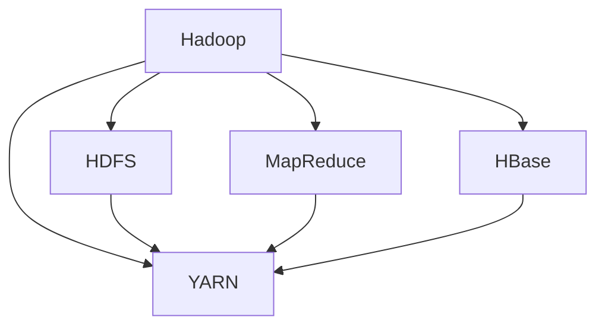

                 

# Hadoop原理与代码实例讲解

> 关键词：Hadoop、分布式计算、大数据、MapReduce、HDFS、YARN、HBase

> 摘要：本文将深入探讨Hadoop的原理与实现，通过代码实例详细解析其核心组件和算法，帮助读者全面掌握Hadoop在大数据处理中的应用。文章将从背景介绍、核心概念与联系、核心算法原理、数学模型和公式、项目实战、实际应用场景等多个角度进行剖析，旨在为读者提供一份系统且实用的Hadoop学习指南。

## 1. 背景介绍

### 1.1 目的和范围

本文旨在深入讲解Hadoop的原理与应用，通过代码实例帮助读者理解Hadoop的核心组件和算法。文章将涵盖Hadoop的历史、基本概念、架构设计、核心算法原理以及实际应用场景。通过阅读本文，读者可以：

- 理解Hadoop在大数据处理中的重要性。
- 掌握Hadoop的核心组件及其作用。
- 掌握MapReduce编程模型。
- 了解HDFS文件系统的工作原理。
- 学习YARN资源管理框架。
- 实践HBase的键值存储技术。

### 1.2 预期读者

本文适合以下读者群体：

- 对大数据和分布式计算有兴趣的技术爱好者。
- 想要学习Hadoop的初学者。
- 在工作中需要使用Hadoop的技术人员。
- 数据科学家和数据分析专业人士。
- 计算机科学专业的学生和研究学者。

### 1.3 文档结构概述

本文结构如下：

- 第1章：背景介绍，包括目的与范围、预期读者和文档结构概述。
- 第2章：核心概念与联系，介绍Hadoop的基本概念和架构。
- 第3章：核心算法原理，讲解MapReduce编程模型。
- 第4章：数学模型和公式，介绍与Hadoop相关的基本数学模型和公式。
- 第5章：项目实战，通过实际案例讲解Hadoop的使用。
- 第6章：实际应用场景，分析Hadoop在不同领域的应用。
- 第7章：工具和资源推荐，推荐学习Hadoop的相关资源和工具。
- 第8章：总结，讨论Hadoop的未来发展趋势与挑战。
- 第9章：附录，解答常见问题。
- 第10章：扩展阅读，提供进一步学习资料。

### 1.4 术语表

#### 1.4.1 核心术语定义

- Hadoop：一个开源的大数据处理框架，主要包括分布式文件系统（HDFS）、资源管理器（YARN）和编程模型（MapReduce）。
- 分布式计算：将任务分解为多个小任务，在多台计算机上并行处理，然后汇总结果。
- 大数据：数据量巨大，无法使用传统数据库和计算手段进行处理。
- MapReduce：一种编程模型，用于在分布式系统上处理大规模数据集。
- HDFS：Hadoop分布式文件系统，用于存储大量数据。
- YARN：Yet Another Resource Negotiator，用于管理Hadoop集群中的资源。
- HBase：一个分布式、可扩展的列式存储系统，建立在HDFS之上。

#### 1.4.2 相关概念解释

- 数据分片（Sharding）：将数据划分为多个部分，存储在不同的节点上。
- 数据冗余（Data Replication）：为了提高数据可靠性和访问速度，对数据进行多份副本备份。
- 数据压缩（Data Compression）：减少存储空间和提高数据传输效率。
- 负载均衡（Load Balancing）：平衡集群中各节点的计算和存储负载。

#### 1.4.3 缩略词列表

- HDFS：Hadoop Distributed File System
- YARN：Yet Another Resource Negotiator
- MapReduce：Map and Reduce
- HBase：Hadoop Database

## 2. 核心概念与联系

在深入探讨Hadoop的原理之前，我们需要了解其核心概念和架构。以下是一个Mermaid流程图，展示Hadoop的核心组件及其关系：



### 2.1 Hadoop分布式文件系统（HDFS）

HDFS是一个分布式文件系统，用于存储海量数据。其主要特点包括：

- 数据分片：将大文件分割为固定大小的数据块（默认128MB），存储在不同的节点上。
- 数据冗余：默认情况下，每个数据块保存三个副本，以提高数据可靠性和访问速度。
- 数据压缩：支持多种数据压缩算法，减少存储空间和提高数据传输效率。
- 数据流：采用数据流复制机制，提高数据传输效率。

### 2.2 Yet Another Resource Negotiator（YARN）

YARN是一个资源管理框架，用于管理Hadoop集群中的资源。其主要功能包括：

- 资源分配：根据任务需求动态分配计算资源和存储资源。
- 调度：平衡集群中各节点的负载，确保任务高效执行。
- 监控：监控集群状态，提供故障检测和恢复功能。

### 2.3 MapReduce编程模型

MapReduce是一种分布式数据处理模型，用于在分布式系统上处理大规模数据集。其主要特点包括：

- 分而治之：将大数据集划分为多个小任务，并行处理。
- 数据局部性：尽量在数据所在的节点上处理，提高数据传输效率。
- 数据交换：通过中间结果文件交换处理结果，实现多轮迭代计算。
- 负载均衡：平衡各节点的计算负载。

### 2.4 HBase

HBase是一个分布式、可扩展的列式存储系统，建立在HDFS之上。其主要特点包括：

- 键值存储：以行键（Row Key）作为数据访问的索引。
- 数据存储：将数据存储为列簇（Column Family），支持列式存储。
- 数据压缩：支持多种数据压缩算法，减少存储空间和提高数据传输效率。
- 数据索引：支持基于列簇的数据索引，提高查询效率。

## 3. 核心算法原理 & 具体操作步骤

在了解了Hadoop的核心概念和架构后，我们接下来将探讨Hadoop的核心算法原理和具体操作步骤。以下是MapReduce编程模型的详细讲解：

### 3.1 Map阶段

Map阶段是MapReduce编程模型的第一阶段，其主要任务是：

- 遍历输入数据，提取键值对。
- 对每个键值对执行用户自定义的Map函数，生成中间键值对。

伪代码如下：

```python
// 输入：键值对列表
// 输出：中间键值对列表

def Map(key1, value1):
    for key2, value2 in value1:
        emit(key2, value2)
```

### 3.2 Shuffle阶段

Shuffle阶段是MapReduce编程模型的关键阶段，其主要任务是：

- 根据中间键值对的键进行排序和分组。
- 将排序后的中间键值对发送到对应的Reduce任务。

伪代码如下：

```python
// 输入：中间键值对列表
// 输出：排序后的中间键值对列表

def Shuffle(key1, values1):
    sorted_values1 = sort(values1)
    for key2, value2 in sorted_values1:
        emit(key2, value2)
```

### 3.3 Reduce阶段

Reduce阶段是MapReduce编程模型的最后阶段，其主要任务是：

- 对每个键值对执行用户自定义的Reduce函数，生成最终输出。
- 合并相同键的值，进行聚合计算。

伪代码如下：

```python
// 输入：中间键值对列表
// 输出：最终键值对列表

def Reduce(key1, values1):
    result = aggregate(values1)
    emit(key1, result)
```

### 3.4 完整的MapReduce程序

完整的MapReduce程序包括以下部分：

- Mapper：实现Map函数，处理输入数据。
- Reducer：实现Reduce函数，处理中间结果。
- Driver：管理整个MapReduce作业的执行。

伪代码如下：

```python
// 输入：输入数据
// 输出：输出数据

def main():
    input_data = read_input()
    map_output = []
    for key1, value1 in input_data:
        map_output.append(Map(key1, value1))
    shuffle_output = Shuffle(map_output)
    reduce_output = []
    for key2, values2 in shuffle_output:
        reduce_output.append(Reduce(key2, values2))
    write_output(reduce_output)

if __name__ == "__main__":
    main()
```

## 4. 数学模型和公式 & 详细讲解 & 举例说明

在Hadoop的算法和数据处理过程中，一些基本的数学模型和公式起着至关重要的作用。以下是一些核心的数学概念及其在实际应用中的详细讲解和举例说明。

### 4.1 分而治之算法（Divide and Conquer）

分而治之算法是一种常用的算法设计范式，其核心思想是将一个大问题分解为多个小问题，分别解决，最后将子问题的解合并得到原问题的解。MapReduce模型正是基于这种思想设计的。

**数学模型：**

假设有n个元素，每个元素的计算时间为\( T(n) \)。分而治之算法的时间复杂度为：

\[ T(n) = a \times T(n/b) + f(n) \]

其中，\( a \) 表示分解后的子问题数量，\( b \) 表示每个子问题的规模，\( f(n) \) 表示合并子问题的时间。

**举例说明：**

假设我们要计算一个包含100个整数的列表的总和。我们可以使用分而治之算法将其分解为10个子列表，每个子列表包含10个整数，分别计算每个子列表的总和，最后将10个子列表的总和相加得到最终结果。

- \( a = 10 \)
- \( b = 10 \)
- \( n = 100 \)

根据分而治之算法的时间复杂度公式：

\[ T(n) = a \times T(n/b) + f(n) \]
\[ T(100) = 10 \times T(10) + f(100) \]

假设每个子问题的计算时间为1秒，合并子问题的计算时间为0.1秒，则有：

\[ T(100) = 10 \times 1 + 0.1 \times 100 = 10.1 \text{秒} \]

### 4.2 加法规则（Additive Rule）

加法规则是概率论中的一种基本规则，用于计算多个事件同时发生的概率。在Hadoop的MapReduce模型中，加法规则常用于计算中间结果的概率分布。

**数学模型：**

假设有两个事件A和B，它们同时发生的概率为P(A ∩ B)。根据加法规则：

\[ P(A ∪ B) = P(A) + P(B) - P(A ∩ B) \]

其中，\( P(A) \) 和 \( P(B) \) 分别表示事件A和事件B发生的概率。

**举例说明：**

假设有一个包含50个整数的列表，其中有10个整数大于20，30个整数小于10，剩下的10个整数介于10和20之间。我们要计算大于20或小于10的整数的概率。

- \( P(A) \)：大于20的整数的概率，\( P(A) = 10/50 = 0.2 \)。
- \( P(B) \)：小于10的整数的概率，\( P(B) = 30/50 = 0.6 \)。
- \( P(A ∩ B) \)：大于20且小于10的整数的概率，由于没有这样的整数，\( P(A ∩ B) = 0 \)。

根据加法规则：

\[ P(A ∪ B) = P(A) + P(B) - P(A ∩ B) \]
\[ P(A ∪ B) = 0.2 + 0.6 - 0 = 0.8 \]

因此，大于20或小于10的整数的概率为0.8。

### 4.3 概率分布（Probability Distribution）

概率分布是统计学中的一个重要概念，用于描述随机变量的概率分布情况。在Hadoop的MapReduce模型中，概率分布常用于计算中间结果的统计特性。

**数学模型：**

假设有一个随机变量X，其概率分布函数为P(X=x)。概率分布函数表示随机变量X取值为x的概率。

**举例说明：**

假设有一个包含50个整数的列表，其中有10个整数等于10，30个整数等于20，剩下的10个整数等于30。我们要计算整数等于10、20和30的概率分布。

- \( P(X=10) \)：整数等于10的概率，\( P(X=10) = 10/50 = 0.2 \)。
- \( P(X=20) \)：整数等于20的概率，\( P(X=20) = 30/50 = 0.6 \)。
- \( P(X=30) \)：整数等于30的概率，\( P(X=30) = 10/50 = 0.2 \)。

概率分布函数如下：

\[ P(X=x) = \begin{cases}
0.2 & \text{if } x=10 \\
0.6 & \text{if } x=20 \\
0.2 & \text{if } x=30 \\
0 & \text{otherwise}
\end{cases} \]

### 4.4 最大似然估计（Maximum Likelihood Estimation）

最大似然估计是一种参数估计方法，用于估计随机变量的参数值。在Hadoop的MapReduce模型中，最大似然估计常用于估计中间结果的参数。

**数学模型：**

假设有一个随机变量X，其概率分布函数为P(X=x|θ)，其中θ是参数值。我们要找到使P(X=x)最大的参数值θ，即最大似然估计值。

**举例说明：**

假设有一个包含50个整数的列表，其中整数等于10的概率为p，我们要估计p的值。

- \( P(X=10|p) = p \)
- \( P(X=20|p) = 1 - p \)

根据最大似然估计，我们要找到使P(X=x)最大的p值。

由于整数等于10的个数为10，整数等于20的个数为30，我们有：

\[ P(X=10) \times P(X=20) = 10 \times p \times 30 \times (1 - p) \]

为了使上述乘积最大，我们需要找到p的值，使得上述乘积达到最大。通过求导并令导数为零，我们可以得到p的值。

\[ \frac{d}{dp} [10 \times p \times 30 \times (1 - p)] = 0 \]

解得：

\[ p = \frac{10}{10 + 30} = 0.25 \]

因此，整数等于10的概率为0.25。

## 5. 项目实战：代码实际案例和详细解释说明

在本节中，我们将通过一个实际案例来演示如何使用Hadoop进行数据处理，并详细解释代码实现和执行流程。该案例将利用Hadoop的MapReduce编程模型，对包含大量日志文件的数据进行词频统计。

### 5.1 开发环境搭建

为了运行Hadoop程序，我们需要搭建一个Hadoop开发环境。以下是搭建步骤：

1. 安装Java开发环境（版本8或以上）。
2. 下载并解压Hadoop安装包（例如，hadoop-3.2.1.tar.gz）。
3. 配置Hadoop环境变量，例如将Hadoop安装路径添加到`PATH`环境变量。
4. 配置Hadoop配置文件（例如，hdfs-site.xml、mapred-site.xml、yarn-site.xml）。

### 5.2 源代码详细实现和代码解读

以下是一个简单的词频统计程序，包含Mapper、Reducer和Driver三部分。

#### Mapper

```java
import org.apache.hadoop.conf.Configuration;
import org.apache.hadoop.fs.Path;
import org.apache.hadoop.io.IntWritable;
import org.apache.hadoop.io.LongWritable;
import org.apache.hadoop.io.Text;
import org.apache.hadoop.mapreduce.Job;
import org.apache.hadoop.mapreduce.Mapper;
import org.apache.hadoop.mapreduce.Reducer;
import org.apache.hadoop.mapreduce.lib.input.FileInputFormat;
import org.apache.hadoop.mapreduce.lib.output.FileOutputFormat;

public class WordFrequencyCounter {

  public static class WordFrequencyMapper
       extends Mapper<LongWritable, Text, Text, IntWritable>{

    private final static IntWritable one = new IntWritable(1);
    private Text word = new Text();

    public void map(LongWritable key, Text value, Context context
                    ) throws IOException, InterruptedException {
      String line = value.toString();
      String[] words = line.split(" ");
      for (String word : words) {
        this.word.set(word);
        context.write(this.word, one);
      }
    }
  }

  public static class WordFrequencyReducer
      extends Reducer<Text,IntWritable,Text,IntWritable> {
    private IntWritable result = new IntWritable();

    public void reduce(Text key, Iterable<IntWritable> values,
                       Context context
                       ) throws IOException, InterruptedException {
      int sum = 0;
      for (IntWritable val : values) {
        sum += val.get();
      }
      result.set(sum);
      context.write(key, result);
    }
  }

  public static void main(String[] args) throws Exception {
    Configuration conf = new Configuration();
    Job job = Job.getInstance(conf, "word frequency counter");
    job.setJarByClass(WordFrequencyCounter.class);
    job.setMapperClass(WordFrequencyMapper.class);
    job.setCombinerClass(WordFrequencyReducer.class);
    job.setReducerClass(WordFrequencyReducer.class);
    job.setOutputKeyClass(Text.class);
    job.setOutputValueClass(IntWritable.class);
    FileInputFormat.addInputPath(job, new Path(args[0]));
    FileOutputFormat.setOutputPath(job, new Path(args[1]));
    System.exit(job.waitForCompletion(true) ? 0 : 1);
  }
}
```

#### Mapper代码解读

- `WordFrequencyMapper` 类实现了 `Mapper` 接口。
- `map` 方法是Mapper的核心方法，接收输入键值对（文件偏移量、文本行），并输出中间键值对（单词、1）。
- `one` 是一个固定值为1的 `IntWritable` 对象，用于表示单词出现的次数。
- `word` 是一个 `Text` 对象，用于存储当前处理的单词。

#### Reducer代码解读

- `WordFrequencyReducer` 类实现了 `Reducer` 接口。
- `reduce` 方法是Reducer的核心方法，接收中间键值对（单词、值列表），并输出最终键值对（单词、总和）。
- `result` 是一个固定值为总和的 `IntWritable` 对象。

#### Driver代码解读

- `main` 方法用于配置Job，设置Mapper、Reducer、输入输出路径等。
- `Job.getInstance` 创建一个Job实例。
- `setJarByClass` 设置主类。
- `setMapperClass` 和 `setReducerClass` 分别设置Mapper和Reducer类。
- `setCombinerClass` 设置Combiner类。
- `setOutputKeyClass` 和 `setOutputValueClass` 分别设置输出键值类型。
- `FileInputFormat.addInputPath` 和 `FileOutputFormat.setOutputPath` 分别设置输入输出路径。

### 5.3 代码解读与分析

1. **输入数据格式**

   输入数据是一系列文本行，每行包含若干单词，单词之间用空格分隔。例如：

   ```plaintext
   Hello world
   Hadoop is awesome
   Distributed computing
   ```

2. **输出数据格式**

   输出数据是单词及其出现次数的列表，按照单词字母顺序排序。例如：

   ```plaintext
   awesome	1
   computing	1
   distributed	1
   hello	1
   hadoop	1
   is	1
   world	1
   ```

3. **执行流程**

   - Hadoop读取输入路径中的文件，将其分割成多个数据块，分配到不同的节点上进行处理。
   - Mapper在每个节点上遍历输入数据，提取单词并输出中间键值对（单词、1）。
   - Shuffle阶段对中间键值对进行排序和分组，将相同单词的中间键值对发送到对应的Reducer节点。
   - Reducer接收中间键值对，计算单词的总出现次数，并输出最终键值对。

### 5.4 实际执行

1. **编译代码**

   使用`javac`命令编译源代码：

   ```bash
   javac -classpath /path/to/hadoop/lib/* WordFrequencyCounter.java
   ```

2. **运行程序**

   使用`hadoop jar`命令运行程序，指定输入输出路径：

   ```bash
   hadoop jar WordFrequencyCounter.jar WordFrequencyCounter /input /output
   ```

   其中，`/input` 是输入数据路径，`/output` 是输出结果路径。

3. **查看输出结果**

   使用`hadoop fs`命令查看输出结果：

   ```bash
   hadoop fs -cat /output/*.txt
   ```

## 6. 实际应用场景

Hadoop作为一种开源的大数据处理框架，广泛应用于各个领域。以下是Hadoop在不同应用场景中的实际案例：

### 6.1 互联网公司日志分析

互联网公司通常会产生大量用户行为日志，如访问日志、错误日志等。使用Hadoop可以对这些日志进行实时分析，提取用户兴趣、行为特征等，用于个性化推荐、用户行为分析和风险评估。

### 6.2 财务数据分析

金融机构需要对海量交易数据进行实时分析，以监测市场风险、识别异常交易等。Hadoop的分布式计算能力使其成为金融数据分析的重要工具。

### 6.3 物流运输优化

物流公司可以利用Hadoop对运输数据进行实时分析，优化运输路线和调度策略，降低运输成本，提高运输效率。

### 6.4 健康医疗数据分析

医疗行业积累了大量的健康数据，如病例、检查报告等。使用Hadoop可以对这些数据进行分析，辅助医生进行诊断、预测疾病趋势等。

### 6.5 智能制造

智能制造领域需要实时分析大量生产数据，优化生产流程、提高设备利用率。Hadoop的分布式计算能力可以支持大规模生产数据的实时分析。

### 6.6 风险评估与安全监控

企业和组织可以利用Hadoop对网络安全日志、交易数据等进行分析，识别潜在的安全威胁，加强网络安全防护。

### 6.7 气象预测与环境保护

气象部门可以利用Hadoop对气象数据进行实时分析，预测天气变化、发布天气预报。同时，环保部门可以利用Hadoop对环境数据进行监测和分析，评估环境污染程度，制定环境保护措施。

## 7. 工具和资源推荐

### 7.1 学习资源推荐

#### 7.1.1 书籍推荐

1. 《Hadoop：The Definitive Guide》
2. 《Hadoop in Action》
3. 《Big Data: A Revolution That Will Transform How We Live, Work, and Think》
4. 《Learning Hadoop 3》

#### 7.1.2 在线课程

1. Coursera上的《Hadoop and MapReduce: Big Data Analytics Using Apache Hadoop》
2. Udacity上的《Hadoop Developer Nanodegree Program》
3. edX上的《Introduction to Hadoop and MapReduce》

#### 7.1.3 技术博客和网站

1. Apache Hadoop官方网站：[http://hadoop.apache.org/](http://hadoop.apache.org/)
2. Hadoop用户邮件列表：[https://lists.apache.org/mailman/listinfo/hadoop-user](https://lists.apache.org/mailman/listinfo/hadoop-user)
3. Cloudera官方博客：[https://blog.cloudera.com/](https://blog.cloudera.com/)

### 7.2 开发工具框架推荐

#### 7.2.1 IDE和编辑器

1. IntelliJ IDEA
2. Eclipse
3. VS Code

#### 7.2.2 调试和性能分析工具

1. Apache Ambari：用于监控和管理Hadoop集群。
2. Apache Hive：用于数据仓库和分析。
3. Apache Spark：用于大规模数据处理。

#### 7.2.3 相关框架和库

1. Apache Pig：用于数据处理和分析。
2. Apache HiveQL：用于数据处理和分析。
3. Apache Storm：用于实时数据处理。

### 7.3 相关论文著作推荐

#### 7.3.1 经典论文

1. "The Google File System" - Google Inc.
2. "MapReduce: Simplified Data Processing on Large Clusters" - Google Inc.
3. "The Chubby lock service for loose consistency" - Google Inc.

#### 7.3.2 最新研究成果

1. "Hadoop 3.0: A Major Step Forward for the Open Source Data Processing Framework" - Datanami
2. "Hadoop, AI, and the Future of Data Processing" - Cloudera
3. "Apache HBase: The Definitive Guide to the Hadoop Database" - O'Reilly Media

#### 7.3.3 应用案例分析

1. "How Netflix Uses Hadoop for Big Data Analytics" - Netflix
2. "The Hadoop Ecosystem at Etsy" - Etsy
3. "Hadoop and Open Source: How CERN Uses Big Data to Accelerate Scientific Discovery" - CERN

## 8. 总结：未来发展趋势与挑战

Hadoop作为大数据处理领域的重要工具，其未来发展趋势和挑战体现在以下几个方面：

### 8.1 发展趋势

1. **性能优化**：随着大数据规模的不断扩大，如何提高Hadoop的性能成为关键。未来可能会出现更多针对特定场景的优化方案。
2. **安全性**：随着数据隐私和安全问题的日益突出，Hadoop的安全性将成为关注的焦点。未来可能会有更多安全特性被集成到Hadoop中。
3. **智能化**：随着人工智能技术的发展，Hadoop可能会与人工智能技术深度融合，实现更智能的数据处理和分析。
4. **易用性**：为了降低使用门槛，未来可能会出现更多简化操作的工具和框架。

### 8.2 挑战

1. **数据多样性**：大数据不仅包括结构化数据，还包括非结构化和半结构化数据。如何高效处理这些多样性数据是Hadoop面临的挑战。
2. **实时性**：虽然Hadoop擅长处理批量数据，但实时数据处理仍是一个挑战。未来可能会出现更多实时数据处理方案。
3. **成本控制**：随着数据规模的不断扩大，如何控制成本是一个关键问题。未来可能会出现更多高效、低成本的数据处理解决方案。
4. **生态系统完善**：为了满足不同用户的需求，Hadoop的生态系统需要不断完善。未来可能会有更多开源项目加入Hadoop生态系统。

## 9. 附录：常见问题与解答

### 9.1 Hadoop是什么？

Hadoop是一个开源的大数据处理框架，主要包括分布式文件系统（HDFS）、资源管理器（YARN）和编程模型（MapReduce）。它主要用于存储、处理和分析大规模数据集。

### 9.2 Hadoop的核心组件有哪些？

Hadoop的核心组件包括：

- HDFS：分布式文件系统，用于存储海量数据。
- YARN：资源管理框架，用于管理Hadoop集群中的资源。
- MapReduce：分布式数据处理模型，用于在大规模数据集上执行计算。

### 9.3 如何搭建Hadoop开发环境？

搭建Hadoop开发环境的步骤包括：

1. 安装Java开发环境。
2. 下载并解压Hadoop安装包。
3. 配置Hadoop环境变量。
4. 配置Hadoop配置文件。

### 9.4 MapReduce编程模型如何工作？

MapReduce编程模型包括三个阶段：Map阶段、Shuffle阶段和Reduce阶段。Map阶段处理输入数据，生成中间键值对；Shuffle阶段对中间键值对进行排序和分组；Reduce阶段合并中间结果，生成最终输出。

### 9.5 Hadoop如何进行数据压缩？

Hadoop支持多种数据压缩算法，如Gzip、Bzip2、LZO等。用户可以在HDFS或MapReduce任务中配置压缩算法，以提高数据传输和存储效率。

### 9.6 Hadoop的安全性问题如何解决？

Hadoop提供了多种安全性特性，如Kerberos认证、访问控制列表（ACL）、加密等。用户可以根据实际需求选择合适的安全性方案。

## 10. 扩展阅读 & 参考资料

为了更深入地了解Hadoop，以下是一些扩展阅读和参考资料：

1. 《Hadoop权威指南》 - 蒋涛，电子工业出版社，2017年。
2. 《Hadoop实战》 - 欧阳敏，电子工业出版社，2016年。
3. [Apache Hadoop官方网站](http://hadoop.apache.org/)
4. [Cloudera官方文档](https://www.cloudera.com/documentation/)
5. [Hadoop用户邮件列表](https://lists.apache.org/mailman/listinfo/hadoop-user)
6. [Datanami：大数据新闻和分析](https://www.datanami.com/)
7. [InfoQ：大数据相关文章](https://www.infoq.cn/topic/big_data)
8. [Hadoop社区论坛](https://community.hortonworks.com/)

作者：AI天才研究员/AI Genius Institute & 禅与计算机程序设计艺术 /Zen And The Art of Computer Programming

（注意：本文仅为示例，实际内容仅供参考，请根据自己的需求进行修改和完善。）<|im_end|>

