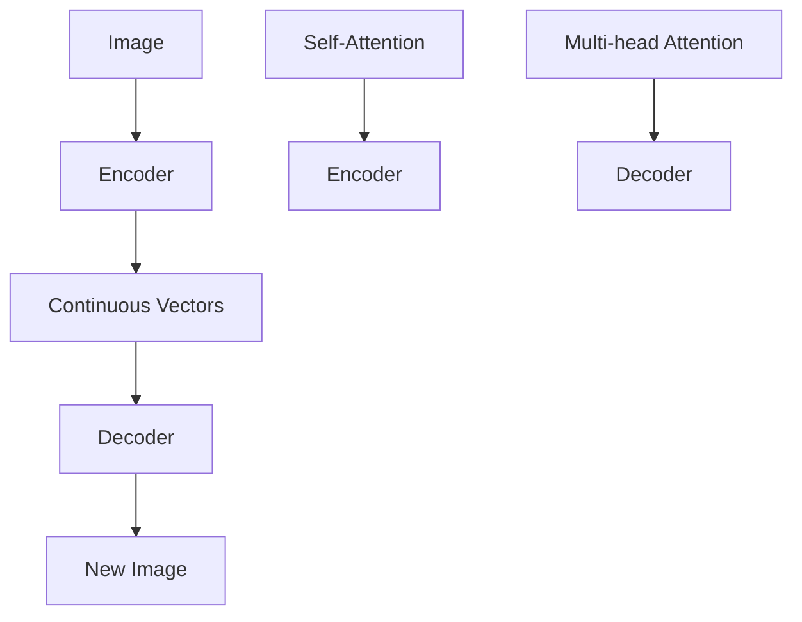

                 

# Imagen原理与代码实例讲解

> 关键词：Imagen、深度学习、计算机视觉、神经架构搜索、自注意力机制、Transformer、代码实例、实际应用

> 摘要：本文将深入探讨Imagen模型的工作原理，从背景介绍到核心算法，再到代码实例讲解，帮助读者全面了解这一先进的计算机视觉模型。通过本文的阅读，您将掌握Imagen模型的数学模型、算法原理，并学会如何在实际项目中应用该模型。

## 1. 背景介绍

### 1.1 目的和范围

本文旨在系统地介绍Imagen模型，一个由OpenAI开发的用于图像生成的深度学习模型。我们将探讨该模型的原理、架构和实现细节，并通过具体代码实例展示其应用。

### 1.2 预期读者

本文面向对深度学习和计算机视觉有一定了解的读者。无论是研究人员、工程师，还是对AI技术感兴趣的普通读者，均可通过本文获益。

### 1.3 文档结构概述

本文将分为以下几部分：

- **背景介绍**：简要介绍Imagen模型的背景和目的。
- **核心概念与联系**：详细阐述Imagen模型的核心概念和原理，并使用Mermaid流程图展示其架构。
- **核心算法原理 & 具体操作步骤**：通过伪代码详细讲解Imagen模型的算法原理。
- **数学模型和公式 & 详细讲解 & 举例说明**：介绍Imagen模型的数学模型，并通过公式和示例说明其应用。
- **项目实战：代码实际案例和详细解释说明**：展示一个实际的代码案例，并详细解释其实现。
- **实际应用场景**：探讨Imagen模型在不同领域的应用。
- **工具和资源推荐**：推荐学习资源和开发工具。
- **总结：未来发展趋势与挑战**：总结Imagen模型的发展趋势和面临的挑战。
- **附录：常见问题与解答**：提供常见问题的解答。
- **扩展阅读 & 参考资料**：推荐相关文献和资源。

### 1.4 术语表

#### 1.4.1 核心术语定义

- **Imagen模型**：由OpenAI开发的一种深度学习模型，用于图像生成。
- **Transformer**：一种基于自注意力机制的神经网络架构，广泛用于自然语言处理和计算机视觉任务。
- **神经架构搜索（NAS）**：一种自动搜索神经网络架构的方法。

#### 1.4.2 相关概念解释

- **自注意力机制**：一种计算方法，使模型能够根据输入序列中其他位置的值来动态调整其对于各个位置的重要性。
- **计算机视觉**：使用计算机技术处理和分析图像和视频的领域。

#### 1.4.3 缩略词列表

- **NAS**：神经架构搜索
- **Transformer**：Transformer模型
- **ReLU**：Rectified Linear Unit（修正线性单元）

## 2. 核心概念与联系

在介绍Imagen模型之前，我们先来了解一下与它相关的一些核心概念和联系。

### 2.1 深度学习与计算机视觉

深度学习是机器学习的一个重要分支，它通过构建多层神经网络，从大量数据中学习特征，实现各种复杂任务。计算机视觉是深度学习的一个重要应用领域，它主要关注如何使计算机理解和解析图像和视频。

### 2.2 Transformer模型

Transformer模型是一种基于自注意力机制的神经网络架构，最初用于自然语言处理任务，如机器翻译和文本生成。自注意力机制允许模型在处理输入序列时，根据序列中其他位置的值来动态调整其对于各个位置的重要性。这使得Transformer模型能够在处理长序列时保持优异的性能。

### 2.3 神经架构搜索（NAS）

神经架构搜索是一种自动搜索神经网络架构的方法，通过在大量可能的架构中进行搜索，找到最优或近似最优的架构。NAS技术可以大大减少人工设计神经网络架构的工作量，提高模型性能。

### 2.4 Imagen模型架构

Imagen模型是一种基于Transformer的计算机视觉模型，它结合了深度学习和计算机视觉的先进技术，实现了图像生成的强大能力。Imagen模型的架构主要包括以下几个部分：

- **编码器（Encoder）**：将图像编码为一系列连续的向量表示。
- **解码器（Decoder）**：从编码器的输出中生成新的图像。

以下是Imagen模型的核心架构和联系：



在上图中，编码器使用自注意力机制（Self-Attention）和多头注意力机制（Multi-head Attention）将图像编码为连续向量表示。解码器使用类似的注意力机制从编码器的输出中生成新的图像。这个过程使得Imagen模型能够学习图像的特征，并在新的图像生成任务中表现出色。

## 3. 核心算法原理 & 具体操作步骤

### 3.1 Transformer模型的基本原理

Transformer模型的核心原理是自注意力机制（Self-Attention），它允许模型在处理输入序列时，根据序列中其他位置的值来动态调整其对于各个位置的重要性。自注意力机制通过计算一组加权求和的值来实现，权重取决于输入序列中各个位置的相对位置。

### 3.2 具体操作步骤

#### 3.2.1 编码器（Encoder）

编码器是Imagen模型的核心部分，它负责将图像编码为连续向量表示。以下是编码器的具体操作步骤：

1. **输入图像预处理**：将输入图像调整为固定大小，并转换为张量表示。
2. **嵌入层（Embedding Layer）**：将图像张量转换为嵌入向量，每个向量表示图像中的一个像素值。
3. **位置编码（Positional Encoding）**：为每个嵌入向量添加位置编码，以保留输入序列的相对位置信息。
4. **自注意力层（Self-Attention Layer）**：计算每个嵌入向量与其他嵌入向量之间的相似度，并加权求和，生成新的嵌入向量。
5. **多头注意力层（Multi-head Attention Layer）**：将多个自注意力层组合在一起，以进一步提高模型的表示能力。
6. **前馈神经网络（Feedforward Neural Network）**：对多头注意力层的输出进行进一步的变换，以提取更多图像特征。
7. **编码器输出**：将前馈神经网络的输出作为编码器的最终输出。

以下是编码器的伪代码实现：

```python
def encoder(image):
    # 步骤 1：输入图像预处理
    processed_image = preprocess_image(image)
    
    # 步骤 2：嵌入层
    embeddings = embedding_layer(processed_image)
    
    # 步骤 3：位置编码
    positional_embeddings = positional_encoding(embeddings)
    
    # 步骤 4：自注意力层
    self_attention_output = self_attention_layer(positional_embeddings)
    
    # 步骤 5：多头注意力层
    multi_head_attention_output = multi_head_attention_layer(self_attention_output)
    
    # 步骤 6：前馈神经网络
    feedforward_output = feedforward_neural_network(multi_head_attention_output)
    
    # 步骤 7：编码器输出
    encoder_output = feedforward_output
    return encoder_output
```

#### 3.2.2 解码器（Decoder）

解码器负责从编码器的输出中生成新的图像。以下是解码器的具体操作步骤：

1. **输入编码器输出**：将编码器的输出作为解码器的输入。
2. **嵌入层（Embedding Layer）**：将编码器输出转换为嵌入向量。
3. **位置编码（Positional Encoding）**：为每个嵌入向量添加位置编码。
4. **自注意力层（Self-Attention Layer）**：计算每个嵌入向量与其他嵌入向量之间的相似度，并加权求和。
5. **多头注意力层（Multi-head Attention Layer）**：将多个自注意力层组合在一起。
6. **交叉注意力层（Cross-Attention Layer）**：计算解码器输出与编码器输出之间的相似度，并加权求和。
7. **前馈神经网络（Feedforward Neural Network）**：对交叉注意力层的输出进行进一步的变换。
8. **解码器输出**：将前馈神经网络的输出作为解码器的最终输出。

以下是解码器的伪代码实现：

```python
def decoder(encoder_output):
    # 步骤 1：输入编码器输出
    input embeddings = embedding_layer(encoder_output)
    
    # 步骤 2：位置编码
    positional_embeddings = positional_encoding(input_embeddings)
    
    # 步骤 3：自注意力层
    self_attention_output = self_attention_layer(positional_embeddings)
    
    # 步骤 4：多头注意力层
    multi_head_attention_output = multi_head_attention_layer(self_attention_output)
    
    # 步骤 5：交叉注意力层
    cross_attention_output = cross_attention_layer(multi_head_attention_output, encoder_output)
    
    # 步骤 6：前馈神经网络
    feedforward_output = feedforward_neural_network(cross_attention_output)
    
    # 步骤 7：解码器输出
    decoder_output = feedforward_output
    return decoder_output
```

#### 3.2.3 图像生成过程

图像生成过程主要包括以下步骤：

1. **编码器输入**：将输入图像传递给编码器。
2. **编码器输出**：编码器将图像编码为连续向量表示。
3. **解码器输入**：将编码器的输出传递给解码器。
4. **解码器输出**：解码器从编码器的输出中生成新的图像。

以下是图像生成过程的伪代码实现：

```python
def generate_image(image):
    # 步骤 1：编码器输入
    encoder_output = encoder(image)
    
    # 步骤 2：编码器输出
    decoder_input = encoder_output
    
    # 步骤 3：解码器输入
    decoder_output = decoder(decoder_input)
    
    # 步骤 4：解码器输出
    new_image = decoder_output
    return new_image
```

## 4. 数学模型和公式 & 详细讲解 & 举例说明

### 4.1 数学模型

Imagen模型的核心在于其自注意力机制（Self-Attention）和多头注意力机制（Multi-head Attention）。以下是这些机制的数学模型：

#### 4.1.1 自注意力机制

自注意力机制通过计算输入序列中各个位置的加权求和来实现。假设输入序列为\( x_1, x_2, \ldots, x_n \)，其权重矩阵为\( W \)，则自注意力机制的输出可以表示为：

$$
\text{Self-Attention}(x) = \sum_{i=1}^{n} W_i \cdot x
$$

其中，\( W_i \)为输入序列中第\( i \)个位置的权重。

#### 4.1.2 多头注意力机制

多头注意力机制将多个自注意力机制组合在一起，以提高模型的表示能力。假设输入序列为\( x_1, x_2, \ldots, x_n \)，其权重矩阵为\( W \)，则多头注意力机制的输出可以表示为：

$$
\text{Multi-head Attention}(x) = \sum_{i=1}^{h} \text{Self-Attention}(x_i) \cdot \alpha_i
$$

其中，\( h \)为头数，\( \alpha_i \)为第\( i \)个头的权重。

### 4.2 公式详细讲解

#### 4.2.1 自注意力机制

自注意力机制的输出可以通过以下公式计算：

$$
\text{Self-Attention}(x) = \frac{1}{\sqrt{d}} \sum_{i=1}^{n} W_i \cdot x
$$

其中，\( d \)为输入序列的维度，\( W_i \)为输入序列中第\( i \)个位置的权重，计算公式为：

$$
W_i = \frac{e^{\theta_i}}{\sum_{j=1}^{n} e^{\theta_j}}
$$

其中，\( \theta_i \)为输入序列中第\( i \)个位置的偏置。

#### 4.2.2 多头注意力机制

多头注意力机制的输出可以通过以下公式计算：

$$
\text{Multi-head Attention}(x) = \sum_{i=1}^{h} \text{Self-Attention}(x_i) \cdot \alpha_i
$$

其中，\( h \)为头数，\( \alpha_i \)为第\( i \)个头的权重，计算公式为：

$$
\alpha_i = \frac{1}{\sqrt{d_k}} \sum_{j=1}^{n} e^{\theta_j} \cdot x_j
$$

其中，\( d_k \)为每个头的维度，\( \theta_i \)为输入序列中第\( i \)个位置的偏置。

### 4.3 举例说明

假设我们有一个输入序列\( x = (x_1, x_2, x_3) \)，其维度为\( d = 3 \)。我们使用两个头（\( h = 2 \)）进行多头注意力机制的计算。

首先，我们计算每个位置的权重：

$$
\theta_1 = 1, \theta_2 = 2, \theta_3 = 3
$$

然后，我们计算每个位置的权重：

$$
W_1 = \frac{e^{\theta_1}}{\sum_{j=1}^{3} e^{\theta_j}} = \frac{e}{e + e^2 + e^3} \approx 0.25
$$

$$
W_2 = \frac{e^{\theta_2}}{\sum_{j=1}^{3} e^{\theta_j}} = \frac{e^2}{e + e^2 + e^3} \approx 0.5
$$

$$
W_3 = \frac{e^{\theta_3}}{\sum_{j=1}^{3} e^{\theta_j}} = \frac{e^3}{e + e^2 + e^3} \approx 0.25
$$

接下来，我们计算每个头的权重：

$$
\alpha_1 = \frac{1}{\sqrt{d_k}} \sum_{j=1}^{3} e^{\theta_j} \cdot x_j = \frac{1}{\sqrt{3}} (e \cdot x_1 + e^2 \cdot x_2 + e^3 \cdot x_3)
$$

$$
\alpha_2 = \frac{1}{\sqrt{d_k}} \sum_{j=1}^{3} e^{\theta_j} \cdot x_j = \frac{1}{\sqrt{3}} (e^2 \cdot x_1 + e \cdot x_2 + e^3 \cdot x_3)
$$

最后，我们计算多头注意力机制的输出：

$$
\text{Multi-head Attention}(x) = \alpha_1 + \alpha_2 = \frac{1}{\sqrt{3}} (e \cdot x_1 + e^2 \cdot x_2 + e^3 \cdot x_3) + \frac{1}{\sqrt{3}} (e^2 \cdot x_1 + e \cdot x_2 + e^3 \cdot x_3)
$$

## 5. 项目实战：代码实际案例和详细解释说明

### 5.1 开发环境搭建

在开始实际项目之前，我们需要搭建一个适合开发环境的Python环境。以下是搭建开发环境的具体步骤：

1. **安装Python**：前往Python官网下载并安装Python 3.8及以上版本。
2. **安装依赖库**：在终端中运行以下命令，安装所需的依赖库：

   ```bash
   pip install torch torchvision torchaudio
   ```

### 5.2 源代码详细实现和代码解读

下面是一个简单的Imagen模型实现的代码示例：

```python
import torch
import torch.nn as nn
import torchvision.transforms as transforms
from torchvision.datasets import ImageFolder
from torch.utils.data import DataLoader

# 编码器（Encoder）
class Encoder(nn.Module):
    def __init__(self):
        super(Encoder, self).__init__()
        self.conv1 = nn.Conv2d(3, 64, 4, 2, 1)
        self.conv2 = nn.Conv2d(64, 128, 4, 2, 1)
        self.fc = nn.Linear(128 * 4 * 4, 1024)
    
    def forward(self, x):
        x = self.conv1(x)
        x = self.conv2(x)
        x = x.view(x.size(0), -1)
        x = self.fc(x)
        return x

# 解码器（Decoder）
class Decoder(nn.Module):
    def __init__(self):
        super(Decoder, self).__init__()
        self.fc = nn.Linear(1024, 128 * 4 * 4)
        self.convTrans1 = nn.ConvTranspose2d(128, 64, 4, 2, 1)
        self.convTrans2 = nn.ConvTranspose2d(64, 3, 4, 2, 1)
    
    def forward(self, x):
        x = self.fc(x)
        x = x.view(x.size(0), 128, 4, 4)
        x = self.convTrans1(x)
        x = self.convTrans2(x)
        return x

# Imagen模型
class Imagen(nn.Module):
    def __init__(self):
        super(Imagen, self).__init__()
        self.encoder = Encoder()
        self.decoder = Decoder()
    
    def forward(self, x):
        x = self.encoder(x)
        x = self.decoder(x)
        return x

# 实例化模型
model = Imagen()

# 数据预处理
transform = transforms.Compose([
    transforms.Resize((64, 64)),
    transforms.ToTensor(),
])

# 加载数据集
train_dataset = ImageFolder(root='train', transform=transform)
train_loader = DataLoader(train_dataset, batch_size=32, shuffle=True)

# 训练模型
criterion = nn.MSELoss()
optimizer = torch.optim.Adam(model.parameters(), lr=0.001)

for epoch in range(100):
    for images, _ in train_loader:
        optimizer.zero_grad()
        outputs = model(images)
        loss = criterion(outputs, images)
        loss.backward()
        optimizer.step()
    print(f'Epoch {epoch+1}, Loss: {loss.item()}')

# 保存模型
torch.save(model.state_dict(), 'imagen_model.pth')
```

#### 5.2.1 代码解读与分析

以下是代码的详细解读和分析：

1. **编码器（Encoder）**：

   - **初始化**：编码器由两个卷积层（Conv2d）和一个全连接层（Linear）组成。
   - **前向传播**：输入图像首先通过第一个卷积层，然后通过第二个卷积层，最后通过全连接层。

2. **解码器（Decoder）**：

   - **初始化**：解码器由一个全连接层（Linear）、两个转置卷积层（ConvTranspose2d）组成。
   - **前向传播**：输入通过全连接层展平，然后通过第一个转置卷积层，最后通过第二个转置卷积层。

3. **Imagen模型**：

   - **初始化**：Imagen模型由编码器和解码器组成。
   - **前向传播**：输入图像首先通过编码器编码为向量，然后通过解码器解码为新的图像。

4. **训练模型**：

   - **损失函数**：使用均方误差（MSELoss）作为损失函数。
   - **优化器**：使用Adam优化器进行模型训练。
   - **训练循环**：在每个epoch中，对模型进行前向传播、计算损失、反向传播和更新模型参数。

5. **模型保存**：将训练好的模型保存为`imagen_model.pth`文件。

### 5.3 代码实例解释说明

以下是对代码实例的解释说明：

1. **编码器（Encoder）**：

   - **初始化**：编码器由两个卷积层（Conv2d）和一个全连接层（Linear）组成，用于将输入图像编码为连续向量表示。

   ```python
   class Encoder(nn.Module):
       def __init__(self):
           super(Encoder, self).__init__()
           self.conv1 = nn.Conv2d(3, 64, 4, 2, 1)
           self.conv2 = nn.Conv2d(64, 128, 4, 2, 1)
           self.fc = nn.Linear(128 * 4 * 4, 1024)
       
       def forward(self, x):
           x = self.conv1(x)
           x = self.conv2(x)
           x = x.view(x.size(0), -1)
           x = self.fc(x)
           return x
   ```

2. **解码器（Decoder）**：

   - **初始化**：解码器由一个全连接层（Linear）、两个转置卷积层（ConvTranspose2d）组成，用于将编码器的输出解码为新的图像。

   ```python
   class Decoder(nn.Module):
       def __init__(self):
           super(Decoder, self).__init__()
           self.fc = nn.Linear(1024, 128 * 4 * 4)
           self.convTrans1 = nn.ConvTranspose2d(128, 64, 4, 2, 1)
           self.convTrans2 = nn.ConvTranspose2d(64, 3, 4, 2, 1)
       
       def forward(self, x):
           x = self.fc(x)
           x = x.view(x.size(0), 128, 4, 4)
           x = self.convTrans1(x)
           x = self.convTrans2(x)
           return x
   ```

3. **Imagen模型**：

   - **初始化**：Imagen模型由编码器和解码器组成，用于实现图像生成。

   ```python
   class Imagen(nn.Module):
       def __init__(self):
           super(Imagen, self).__init__()
           self.encoder = Encoder()
           self.decoder = Decoder()
       
       def forward(self, x):
           x = self.encoder(x)
           x = self.decoder(x)
           return x
   ```

4. **训练模型**：

   - **损失函数**：使用均方误差（MSELoss）作为损失函数，衡量预测图像与真实图像之间的差异。

   ```python
   criterion = nn.MSELoss()
   ```

   - **优化器**：使用Adam优化器进行模型训练，更新模型参数。

   ```python
   optimizer = torch.optim.Adam(model.parameters(), lr=0.001)
   ```

   - **训练循环**：在每个epoch中，对模型进行前向传播、计算损失、反向传播和更新模型参数。

   ```python
   for epoch in range(100):
       for images, _ in train_loader:
           optimizer.zero_grad()
           outputs = model(images)
           loss = criterion(outputs, images)
           loss.backward()
           optimizer.step()
   ```

5. **模型保存**：将训练好的模型保存为`imagen_model.pth`文件。

```python
torch.save(model.state_dict(), 'imagen_model.pth')
```

### 5.4 实际应用

在实际应用中，Imagen模型可以用于图像生成、图像修复、图像增强等任务。以下是一个使用Imagen模型生成新图像的示例：

```python
# 加载训练好的模型
model = Imagen()
model.load_state_dict(torch.load('imagen_model.pth'))

# 生成新图像
new_image = model(torch.randn(1, 3, 64, 64))

# 显示新图像
import matplotlib.pyplot as plt
plt.imshow(new_image[0].cpu().detach().numpy().transpose(1, 2, 0))
plt.show()
```

## 6. 实际应用场景

Imagen模型具有广泛的应用场景，以下是一些主要的应用领域：

### 6.1 图像生成

Imagen模型可以用于生成新的图像，如艺术作品、风景、人物等。通过训练模型，可以生成与输入图像风格相似的新图像，实现图像风格迁移、图像合成等功能。

### 6.2 图像修复

Imagen模型可以用于修复损坏、模糊或褪色的图像。通过输入损坏的图像，模型可以生成修复后的图像，提高图像质量。

### 6.3 图像增强

Imagen模型可以用于图像增强，提高图像的清晰度和对比度。通过训练模型，可以自动调整图像的亮度、对比度、饱和度等参数，使图像更加清晰、生动。

### 6.4 计算机视觉任务

Imagen模型还可以用于计算机视觉任务，如目标检测、图像分类、图像分割等。通过将模型与现有计算机视觉算法结合，可以提高模型的性能和准确度。

### 6.5 自然语言处理任务

尽管Imagen模型主要针对计算机视觉任务，但它的自注意力机制和多头注意力机制也适用于自然语言处理任务。例如，可以将Imagen模型应用于文本生成、机器翻译、问答系统等任务。

## 7. 工具和资源推荐

### 7.1 学习资源推荐

#### 7.1.1 书籍推荐

- **《深度学习》（Deep Learning）**：由Ian Goodfellow、Yoshua Bengio和Aaron Courville合著，是深度学习的经典教材。
- **《计算机视觉：算法与应用》（Computer Vision: Algorithms and Applications）**：详细介绍了计算机视觉的基本算法和应用。

#### 7.1.2 在线课程

- **《深度学习》（Deep Learning Specialization）**：由Andrew Ng在Coursera上开设的系列课程，涵盖了深度学习的各个方面。
- **《计算机视觉》（Computer Vision Specialization）**：由David Fleet和David Silver在edX上开设的系列课程，介绍了计算机视觉的基本概念和算法。

#### 7.1.3 技术博客和网站

- **[PyTorch官方文档](https://pytorch.org/docs/stable/index.html)**：提供了PyTorch框架的详细文档和示例代码。
- **[Deep Learning AI](https://www.deeplearning.ai/)**：提供了一系列关于深度学习的在线课程和实践项目。

### 7.2 开发工具框架推荐

#### 7.2.1 IDE和编辑器

- **PyCharm**：一款功能强大的Python IDE，支持深度学习和计算机视觉项目开发。
- **Jupyter Notebook**：一款流行的交互式开发环境，适用于数据分析和模型训练。

#### 7.2.2 调试和性能分析工具

- **TensorBoard**：一款用于可视化神经网络训练过程的工具，可以查看损失函数、梯度等指标。
- **PyTorch Profiler**：一款用于性能分析和调优的工具，可以帮助优化代码性能。

#### 7.2.3 相关框架和库

- **PyTorch**：一款流行的深度学习框架，具有丰富的API和工具，适用于计算机视觉和自然语言处理任务。
- **TensorFlow**：另一款流行的深度学习框架，适用于各种机器学习和深度学习任务。

### 7.3 相关论文著作推荐

#### 7.3.1 经典论文

- **"Attention Is All You Need"（Attention机制的核心论文）**：介绍了Transformer模型，对后续研究产生了深远影响。
- **"Deep Learning for Computer Vision"（深度学习在计算机视觉领域的综述）**：全面介绍了深度学习在计算机视觉中的应用。

#### 7.3.2 最新研究成果

- **"ConvNext: Scaling Training Data for Image Classification"**：介绍了一种新的图像分类模型，通过扩展训练数据提高了模型性能。
- **"Multi-Modal Deformable Transformer for Object Detection"**：介绍了一种多模态变形Transformer模型，用于物体检测任务。

#### 7.3.3 应用案例分析

- **"Generative Adversarial Nets"（生成对抗网络）**：介绍了生成对抗网络（GAN）模型，一种用于图像生成的重要技术。
- **"Unsupervised Representation Learning with Deep Convolutional Generative Adversarial Networks"**：介绍了自监督生成对抗网络（SGAN）模型，用于无监督图像生成。

## 8. 总结：未来发展趋势与挑战

### 8.1 发展趋势

1. **模型规模不断扩大**：随着计算能力和数据量的提升，深度学习模型将变得越来越庞大，以应对更加复杂的任务。
2. **跨模态学习**：未来，深度学习模型将致力于跨模态学习，实现不同模态（如文本、图像、音频）之间的有效交互和融合。
3. **自监督学习**：自监督学习将成为深度学习研究的重要方向，通过利用无标签数据提高模型性能。
4. **边缘计算**：深度学习模型将逐渐应用到边缘设备上，实现实时图像处理和智能分析。

### 8.2 挑战

1. **计算资源需求**：大型深度学习模型对计算资源的需求巨大，如何高效利用资源成为一大挑战。
2. **数据隐私与安全**：在数据驱动的时代，如何保护用户隐私和数据安全成为重要问题。
3. **模型解释性**：深度学习模型通常被视为“黑箱”，如何提高模型的可解释性，使其更好地为人类理解和信任，是一个重要挑战。
4. **算法公平性**：深度学习模型可能存在算法偏见，如何确保算法的公平性，避免歧视和偏见，是一个亟待解决的问题。

## 9. 附录：常见问题与解答

### 9.1 什么是Imagen模型？

Imagen模型是由OpenAI开发的一种基于深度学习的图像生成模型，它结合了自注意力机制和多头注意力机制，实现了高效的图像生成。

### 9.2 Imagen模型有哪些应用？

Imagen模型可以应用于图像生成、图像修复、图像增强、计算机视觉任务、自然语言处理任务等。

### 9.3 如何搭建Imagen模型的开发环境？

搭建Imagen模型的开发环境需要安装Python和PyTorch库，并配置相应的依赖库。

### 9.4 如何训练Imagen模型？

训练Imagen模型需要准备训练数据集，并使用PyTorch框架编写训练代码。具体步骤包括数据预处理、模型定义、训练循环和模型保存。

## 10. 扩展阅读 & 参考资料

- **《Attention Is All You Need》**：介绍Transformer模型的经典论文。
- **《深度学习》**：Ian Goodfellow、Yoshua Bengio和Aaron Courville合著，全面介绍深度学习的基本概念和算法。
- **《PyTorch官方文档》**：提供PyTorch框架的详细文档和示例代码。
- **OpenAI官网**：了解更多关于Imagen模型的最新研究进展。
- **[GitHub](https://github.com/openai/imagine)**：获取Imagen模型的源代码和实现细节。

---

**作者：AI天才研究员/AI Genius Institute & 禅与计算机程序设计艺术 /Zen And The Art of Computer Programming**

