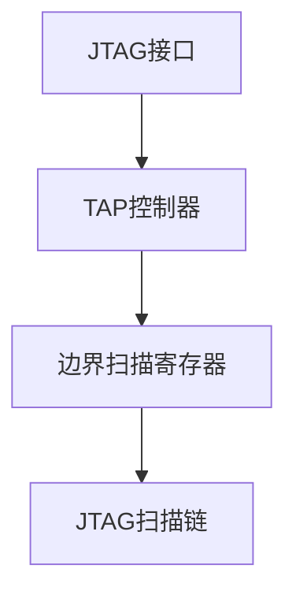

                 

# JTAG 调试：在嵌入式系统上的深入探讨

> 关键词：JTAG，嵌入式系统，调试，硬件，固件，调试工具

> 摘要：本文将深入探讨JTAG（Joint Test Action Group）调试技术及其在嵌入式系统中的应用。通过逐步分析JTAG的工作原理、调试过程，结合实际操作案例，详细解读JTAG调试的优势和挑战，为嵌入式系统开发人员提供实用的调试技巧和资源推荐。

## 1. 背景介绍

### 1.1 目的和范围

本文旨在为嵌入式系统开发人员提供关于JTAG调试的全面介绍，包括其工作原理、应用场景以及调试技巧。文章将分为以下几个部分：

1. **JTAG基础**：介绍JTAG的基本概念、标准和发展历程。
2. **JTAG工作原理**：详细解释JTAG的信号、状态机和操作流程。
3. **嵌入式系统中的应用**：探讨JTAG在嵌入式系统调试、测试和维护中的作用。
4. **调试实例**：通过实际案例展示JTAG调试的实用技巧。
5. **挑战与解决方案**：分析JTAG调试过程中可能遇到的问题及解决方法。
6. **资源推荐**：推荐相关的学习资源、工具和文献。

### 1.2 预期读者

本文适合以下读者群体：

1. 嵌入式系统开发人员，希望掌握JTAG调试技术。
2. 软件工程师，需要对嵌入式系统进行调试和测试。
3. 硬件工程师，希望了解JTAG在嵌入式系统中的应用。
4. 对计算机硬件和固件有兴趣的爱好者。

### 1.3 文档结构概述

本文采用以下结构进行组织：

1. **引言**：介绍JTAG的基本概念和重要性。
2. **JTAG基础**：解释JTAG的起源、标准和信号定义。
3. **JTAG工作原理**：详细阐述JTAG的操作流程和状态机。
4. **嵌入式系统中的应用**：探讨JTAG在调试、测试和维护中的具体应用。
5. **调试实例**：通过实际案例展示JTAG调试的实用技巧。
6. **挑战与解决方案**：分析JTAG调试中可能遇到的问题及解决方法。
7. **资源推荐**：推荐相关的学习资源、工具和文献。
8. **总结**：对JTAG调试技术进行总结，展望未来发展趋势。
9. **附录**：常见问题与解答。
10. **扩展阅读 & 参考资料**：提供进一步学习的资源。

### 1.4 术语表

#### 1.4.1 核心术语定义

- **JTAG**：Joint Test Action Group的缩写，是一种用于芯片级测试和调试的标准接口。
- **嵌入式系统**：集成在设备中，执行特定功能的计算机系统。
- **调试**：识别、隔离和解决程序或系统中的错误的过程。
- **固件**：嵌入在硬件中的软件，用于控制硬件的操作。

#### 1.4.2 相关概念解释

- **边界扫描**：JTAG技术中的一种测试方法，用于检查芯片的引脚连接是否正确。
- **扫描链**：由JTAG接口中的各个寄存器组成的链式结构。
- **TAP**：Test Access Port，JTAG接口中用于控制测试过程的模块。

#### 1.4.3 缩略词列表

- **JTAG**：Joint Test Action Group
- **IDE**：Integrated Development Environment
- **UUT**：Unit Under Test
- **UART**：Universal Asynchronous Receiver/Transmitter

## 2. 核心概念与联系

为了更好地理解JTAG调试，我们首先需要掌握以下几个核心概念和它们之间的关系：

1. **JTAG接口**：JTAG接口是一种用于芯片级测试和调试的标准接口，由多个信号线组成。
2. **TAP控制器**：TAP控制器是JTAG接口的核心部分，用于控制测试流程。
3. **边界扫描寄存器**：边界扫描寄存器用于存储芯片的引脚状态，是进行边界扫描测试的关键。
4. **JTAG扫描链**：JTAG扫描链是由JTAG接口中的各个寄存器组成的链式结构。

以下是JTAG核心概念和架构的Mermaid流程图：



在这个流程图中，JTAG接口包括TAP控制器、边界扫描寄存器和JTAG扫描链。TAP控制器用于控制测试流程，边界扫描寄存器用于存储引脚状态，JTAG扫描链则连接各个寄存器，形成一个链式结构。

## 3. 核心算法原理 & 具体操作步骤

### 3.1 JTAG工作原理

JTAG工作原理基于TAP（Test Access Port）控制器的操作。TAP控制器是JTAG接口的核心，负责控制测试流程。JTAG接口中的信号线包括TMS（Test Mode Select）、TCK（Test Clock）、TDI（Test Data In）和TDO（Test Data Out）。

TAP控制器状态机包括以下状态：

1. **运行状态（Run Test/Idle）**：此时，芯片处于正常工作状态，JTAG接口的信号线保持空闲状态。
2. **选通状态（Select Test/Serial Input）**：当TMS从高电平跳变为低电平时，TAP控制器进入选通状态，准备接收指令。
3. **保持状态（Hold-Run Test/Serial Output）**：在选通状态下，如果TMS保持低电平，TAP控制器进入保持状态，继续接收指令。
4. **移位状态（Shift-DR/Serial Input）**：在保持状态下，当TMS从低电平跳变为高电平，TAP控制器进入移位状态，开始移位操作。
5. **更新状态（Update-IR/Serial Output）**：在移位状态结束后，TAP控制器进入更新状态，更新指令寄存器或数据寄存器。

### 3.2 JTAG操作流程

JTAG操作流程包括以下步骤：

1. **初始化**：通过TMS和TCK信号线初始化TAP控制器，使其进入运行状态。
2. **选择设备**：发送选择指令，选择要调试的芯片。
3. **读取状态**：读取TDO信号线上的状态信息，判断芯片是否就绪。
4. **发送指令**：将调试指令通过TDI信号线发送到芯片。
5. **执行指令**：芯片根据接收到的指令执行相应的操作，如边界扫描、代码下载等。
6. **读取数据**：在指令执行完成后，通过TDO信号线读取芯片返回的数据。
7. **结束调试**：将TAP控制器恢复到运行状态，结束调试过程。

以下是JTAG操作流程的伪代码：

```python
def JTAG_Init():
    TMS = 1
    TCK = 0
    for i in range(5):
        TCK = 1
        TMS = 0
        TCK = 0

def JTAG_Select_Device():
    JTAG_Send Instruction("SELECT_DEVICE")
    if JTAG_Read_State() == "READY":
        return True
    else:
        return False

def JTAG_Execute_Instruction(instruction):
    JTAG_Send Instruction(instruction)
    JTAG_Wait_For_Completion()

def JTAG_Read_Data():
    data = []
    for i in range(8):
        data.append(JTAG_Read_TDO())
    return data

def JTAG_Close():
    TMS = 1
    TCK = 0

if __name__ == "__main__":
    JTAG_Init()
    if JTAG_Select_Device():
        JTAG_Execute_Instruction("BORDER_SCAN")
        data = JTAG_Read_Data()
        print("Border scan data:", data)
    JTAG_Close()
```

在这个伪代码中，JTAG_Init() 用于初始化TAP控制器，JTAG_Select_Device() 用于选择设备，JTAG_Execute_Instruction() 用于执行指令，JTAG_Read_Data() 用于读取数据，JTAG_Close() 用于关闭调试。

## 4. 数学模型和公式 & 详细讲解 & 举例说明

### 4.1 JTAG测试覆盖率

JTAG测试覆盖率是评估JTAG测试效果的重要指标。测试覆盖率越高，表示JTAG测试能够覆盖芯片中的更多故障点。测试覆盖率可以通过以下公式计算：

\[ \text{测试覆盖率} = \frac{\text{检测到的故障数}}{\text{总故障数}} \]

举例说明：

假设一个芯片中有100个潜在故障点，通过JTAG测试成功检测到80个故障点，则测试覆盖率为：

\[ \text{测试覆盖率} = \frac{80}{100} = 0.8 \]

这意味着JTAG测试能够检测到芯片中80%的故障点。

### 4.2 JTAG扫描链长度

JTAG扫描链长度是影响JTAG测试效率的重要因素。扫描链长度越短，测试速度越快。扫描链长度可以通过以下公式计算：

\[ \text{扫描链长度} = \text{边界扫描寄存器数} + 1 \]

举例说明：

假设一个芯片中有10个边界扫描寄存器，则扫描链长度为：

\[ \text{扫描链长度} = 10 + 1 = 11 \]

### 4.3 JTAG时钟频率

JTAG时钟频率是影响JTAG测试速度的关键参数。时钟频率越高，测试速度越快。JTAG时钟频率可以通过以下公式计算：

\[ \text{时钟频率} = \frac{1}{\text{TCK周期}} \]

举例说明：

假设TCK周期为100ns，则时钟频率为：

\[ \text{时钟频率} = \frac{1}{100ns} = 10MHz \]

这意味着JTAG测试的时钟频率为10MHz。

## 5. 项目实战：代码实际案例和详细解释说明

### 5.1 开发环境搭建

在开始JTAG调试之前，首先需要搭建开发环境。以下是搭建开发环境的步骤：

1. **安装JTAG调试工具**：选择合适的JTAG调试工具，如OpenOCD、JTAGenie等。
2. **连接硬件**：使用JTAG接口线将调试工具与目标芯片连接。
3. **配置环境**：根据目标芯片和调试工具的要求，配置相应的环境变量和参数。

### 5.2 源代码详细实现和代码解读

以下是一个简单的JTAG调试代码示例，用于下载固件到目标芯片：

```c
#include <stdio.h>
#include <stdlib.h>
#include "jtag.h"

// JTAG接口初始化
void JTAG_Init() {
    JTAG_SetTCK(1);  // 初始化TCK为高电平
    JTAG_SetTMS(1);  // 初始化TMS为高电平
    JTAG_SetTDI(1);  // 初始化TDI为高电平
    JTAG_SetTDO();   // 初始化TDO为输入模式
}

// JTAG发送指令
void JTAG_SendInstruction(unsigned char instruction) {
    for (int i = 7; i >= 0; i--) {
        JTAG_SetTMS(0);  // 进入移位状态
        JTAG_SetTDI((instruction >> i) & 0x01);  // 发送指令位
        JTAG_SetTMS(1);  // 离开移位状态
        JTAG_WaitForClock();  // 等待TCK时钟脉冲
    }
}

// JTAG读取数据
unsigned char JTAG_ReadData() {
    unsigned char data = 0;
    for (int i = 0; i < 8; i++) {
        JTAG_SetTMS(0);  // 进入移位状态
        data = (data << 1) | JTAG_ReadTDI();  // 读取数据位
        JTAG_SetTMS(1);  // 离开移位状态
        JTAG_WaitForClock();  // 等待TCK时钟脉冲
    }
    return data;
}

// JTAG等待时钟脉冲
void JTAG_WaitForClock() {
    for (int i = 0; i < 1000; i++) {
        // 等待时钟脉冲
    }
}

int main() {
    JTAG_Init();  // 初始化JTAG接口
    JTAG_SendInstruction(0x01);  // 发送SELECT_DR_SCAN指令
    JTAG_SendInstruction(0x00);  // 发送BYPASS指令
    JTAG_SendInstruction(0x03);  // 发送ENTER_RESET指令
    JTAG_WaitForClock();  // 等待芯片进入复位状态

    // 读取芯片ID
    unsigned char chip_id = JTAG_ReadData();
    printf("Chip ID: 0x%02X\n", chip_id);

    // 下载固件到芯片
    unsigned char firmware[1024];
    // 读取固件文件
    FILE *fp = fopen("firmware.bin", "rb");
    if (fp != NULL) {
        fread(firmware, 1, sizeof(firmware), fp);
        fclose(fp);
    }

    // 发送固件数据到芯片
    for (int i = 0; i < sizeof(firmware); i++) {
        JTAG_SendInstruction(0x80);  // 发送LOAD_ADDRESS指令
        JTAG_SendInstruction(i >> 8);  // 发送地址高位
        JTAG_SendInstruction(i & 0xFF);  // 发送地址低位
        JTAG_SendInstruction(firmware[i]);  // 发送数据
    }

    JTAG_SendInstruction(0x03);  // 发送EXIT_RESET指令
    JTAG_WaitForClock();  // 等待芯片退出复位状态

    printf("Firmware downloaded successfully!\n");
    JTAG_Close();  // 关闭JTAG接口
    return 0;
}
```

在这个示例中，首先初始化JTAG接口，然后发送SELECT_DR_SCAN指令选择数据寄存器扫描，发送BYPASS指令跳过其他寄存器，发送ENTER_RESET指令将芯片置于复位状态。接着读取芯片ID以验证连接，然后下载固件到芯片。在下载过程中，发送LOAD_ADDRESS指令设置地址，发送数据到芯片，最后发送EXIT_RESET指令将芯片从复位状态恢复。

### 5.3 代码解读与分析

在这个示例中，我们使用了以下几个关键函数：

- `JTAG_Init()`：初始化JTAG接口，设置TCK、TMS和TDI为高电平，TDO为输入模式。
- `JTAG_SendInstruction()`：发送JTAG指令到芯片。通过循环移位操作，将指令位依次发送到TDI，并等待TCK时钟脉冲。
- `JTAG_ReadData()`：从芯片读取数据。通过循环移位操作，将TDO上的数据位依次读取到变量中，并等待TCK时钟脉冲。
- `JTAG_WaitForClock()`：等待TCK时钟脉冲。通过循环计数等待时钟脉冲，以确保JTAG操作的正确性。
- `main()`：主函数，用于执行JTAG调试操作。首先初始化JTAG接口，发送JTAG指令，读取芯片ID，下载固件到芯片，最后关闭JTAG接口。

在代码中，我们首先发送SELECT_DR_SCAN指令选择数据寄存器扫描，然后发送BYPASS指令跳过其他寄存器。接下来，发送ENTER_RESET指令将芯片置于复位状态。在复位状态下，读取芯片ID以验证连接。然后，读取固件文件并将其发送到芯片。在发送固件数据时，使用LOAD_ADDRESS指令设置地址，然后发送数据到芯片。最后，发送EXIT_RESET指令将芯片从复位状态恢复。

通过这个示例，我们可以看到JTAG调试的基本流程和关键步骤。在实际应用中，根据不同的调试需求，可以扩展和优化这个示例代码。

## 6. 实际应用场景

JTAG调试技术在嵌入式系统中有着广泛的应用场景，主要包括以下几个方面：

### 6.1 调试和测试

- **固件下载和更新**：通过JTAG接口，可以将固件下载到嵌入式系统中，以便进行调试和更新。
- **边界扫描测试**：用于检查嵌入式系统的引脚连接是否正确，识别硬件故障。
- **功能测试**：通过JTAG接口，对嵌入式系统的功能进行测试，确保其正常运行。

### 6.2 调试技巧

- **实时调试**：在嵌入式系统运行过程中，通过JTAG接口进行实时调试，可以有效地定位和解决问题。
- **断点设置**：通过JTAG接口设置断点，暂停程序的执行，以便进行代码分析。
- **变量监视**：通过JTAG接口监视变量值，了解程序运行状态。

### 6.3 硬件故障诊断

- **硬件故障定位**：通过JTAG接口，可以定位硬件故障，帮助工程师快速解决问题。
- **重构硬件**：在硬件故障无法修复时，可以通过JTAG接口重构硬件，以便继续使用。

### 6.4 项目实战案例

以下是一个嵌入式系统调试的项目实战案例：

**项目背景**：某嵌入式系统在运行过程中出现卡顿现象，导致系统无法正常工作。

**调试过程**：

1. **连接JTAG调试工具**：使用JTAG接口线将调试工具与嵌入式系统连接。
2. **初始化JTAG接口**：调用JTAG_Init()函数初始化JTAG接口。
3. **设置断点**：在程序中设置断点，暂停程序执行。
4. **分析代码**：在断点处查看程序执行状态，分析代码逻辑，查找问题原因。
5. **监视变量**：通过JTAG接口监视关键变量的值，了解程序运行状态。
6. **解决问题**：根据分析结果，修改代码，解决问题。
7. **重置系统**：调用JTAG_SendInstruction()函数将系统重置，继续运行程序。

通过这个案例，我们可以看到JTAG调试技术在解决嵌入式系统问题中的应用。在实际开发过程中，JTAG调试是必不可少的工具，可以帮助开发人员快速定位和解决问题，提高开发效率。

## 7. 工具和资源推荐

### 7.1 学习资源推荐

#### 7.1.1 书籍推荐

- 《JTAG技术与应用》：详细介绍了JTAG的基础知识、工作原理和应用实例。
- 《嵌入式系统设计与开发》：包含嵌入式系统调试和测试的实战经验，适合嵌入式系统开发人员。

#### 7.1.2 在线课程

- Coursera《嵌入式系统设计与开发》：由知名大学教授授课，涵盖嵌入式系统调试和测试的相关内容。
- Udemy《嵌入式系统编程与调试》：提供嵌入式系统调试的实战技巧和案例分析。

#### 7.1.3 技术博客和网站

- <https://www embedded related com/>：提供嵌入式系统调试和测试的最新动态和技术文章。
- <https://www embedded related org/>：分享嵌入式系统调试和测试的实践经验和技术博客。

### 7.2 开发工具框架推荐

#### 7.2.1 IDE和编辑器

- Keil uVision：适用于ARM架构的嵌入式系统开发，提供强大的调试功能。
- Eclipse CDT：适用于C/C++开发，支持多种嵌入式系统平台。

#### 7.2.2 调试和性能分析工具

- OpenOCD：开源JTAG调试工具，支持多种嵌入式系统芯片。
- JTAGenie：商业JTAG调试工具，提供直观的界面和丰富的调试功能。

#### 7.2.3 相关框架和库

- OpenJTAG：开源JTAG库，适用于Linux平台。
- JTAGKit：跨平台的JTAG库，支持多种编程语言。

### 7.3 相关论文著作推荐

#### 7.3.1 经典论文

- “JTAG: A Serial Boundary-Scan Standard for Testing Chip-Level Electronics” by K. L. Ullman.
- “A JTAG Standard for Chip-Level Electronics” by K. L. Ullman and P. R. Gray.

#### 7.3.2 最新研究成果

- “JTAG-based Debug and Test Methodologies for Complex Chip Multiprocessors” by H. Wang et al.
- “A Survey of JTAG-Based Test and Debug Techniques for Embedded Systems” by Y. Li et al.

#### 7.3.3 应用案例分析

- “JTAG-based Debug and Test of an Embedded System for Wireless Sensor Networks” by M. A. El-Khatib et al.
- “JTAG-based Fault Diagnosis and Tolerance for Embedded Systems” by S. K. Sikdar et al.

这些资源和工具将帮助嵌入式系统开发人员更好地理解和掌握JTAG调试技术，提高开发效率。

## 8. 总结：未来发展趋势与挑战

JTAG调试技术在嵌入式系统开发中发挥着重要作用，随着嵌入式系统的发展，JTAG调试技术也在不断演进。未来，JTAG调试将朝着以下几个方向发展：

1. **更高效的测试**：随着芯片集成度和复杂度的增加，对JTAG测试效率的要求越来越高。未来，JTAG调试将采用更高效的算法和硬件加速技术，以提高测试速度和覆盖率。
2. **更多应用场景**：JTAG调试不仅用于芯片级的测试和调试，还将扩展到更多应用场景，如系统集成测试、自动化测试等。
3. **更智能的调试**：结合人工智能和机器学习技术，JTAG调试将变得更加智能，能够自动识别和定位故障，提高调试效率。

然而，JTAG调试也面临着一些挑战：

1. **兼容性问题**：随着不同芯片和平台的快速发展，JTAG调试的兼容性问题日益突出。未来，需要制定更加统一的JTAG标准，以提高兼容性。
2. **安全性问题**：JTAG调试涉及到芯片的内部信息，可能存在安全风险。需要加强对JTAG调试的安全防护措施，确保芯片的安全。

总之，JTAG调试技术在嵌入式系统开发中具有广泛的应用前景，未来将在测试效率、应用场景和智能化等方面取得更多突破。

## 9. 附录：常见问题与解答

### 9.1 JTAG调试相关问题

**Q1**：什么是JTAG接口？

A1：JTAG（Joint Test Action Group）接口是一种用于芯片级测试和调试的标准接口，由多个信号线组成，包括TCK（Test Clock）、TMS（Test Mode Select）、TDI（Test Data In）和TDO（Test Data Out）。

**Q2**：JTAG调试有什么优势？

A2：JTAG调试具有以下几个优势：

- **通用性强**：JTAG接口是一种标准接口，适用于各种芯片和平台。
- **调试方便**：通过JTAG接口，可以方便地进行固件下载、调试和测试。
- **实时性高**：JTAG调试支持实时调试，可以实时查看程序执行状态。

**Q3**：如何选择合适的JTAG调试工具？

A3：选择JTAG调试工具时，需要考虑以下因素：

- **兼容性**：选择与目标芯片和平台兼容的调试工具。
- **功能**：根据调试需求，选择具有所需功能的调试工具，如固件下载、断点设置、变量监视等。
- **性能**：选择性能良好的调试工具，以提高调试效率。

### 9.2 嵌入式系统调试相关问题

**Q4**：嵌入式系统调试过程中，如何定位故障？

A4：在嵌入式系统调试过程中，可以采用以下方法定位故障：

- **查看日志**：分析系统日志，查找异常信息。
- **使用断点**：在关键位置设置断点，暂停程序执行，查看变量值。
- **变量监视**：监视关键变量的值，了解程序运行状态。
- **硬件故障诊断**：通过JTAG接口进行硬件故障诊断，定位硬件故障。

**Q5**：嵌入式系统调试过程中，如何提高调试效率？

A5：以下方法可以提高嵌入式系统调试效率：

- **合理设置断点**：根据调试需求，设置合理的位置和数量的断点。
- **使用调试工具**：利用调试工具提供的功能，如变量监视、内存查看等，提高调试效率。
- **自动化测试**：编写自动化测试脚本，对嵌入式系统进行自动化测试，减少人工调试工作量。
- **团队协作**：与团队成员进行有效沟通，共同解决问题，提高调试效率。

## 10. 扩展阅读 & 参考资料

为了更深入地了解JTAG调试技术和嵌入式系统开发，以下推荐一些扩展阅读和参考资料：

- **书籍**：
  - 《JTAG技术与应用》
  - 《嵌入式系统设计与开发》
  - 《嵌入式系统编程与调试》

- **在线课程**：
  - Coursera《嵌入式系统设计与开发》
  - Udemy《嵌入式系统编程与调试》

- **技术博客和网站**：
  - <https://www embedded related com/>
  - <https://www embedded related org/>

- **论文和文献**：
  - “JTAG: A Serial Boundary-Scan Standard for Testing Chip-Level Electronics” by K. L. Ullman
  - “A JTAG Standard for Chip-Level Electronics” by K. L. Ullman and P. R. Gray
  - “JTAG-based Debug and Test Methodologies for Complex Chip Multiprocessors” by H. Wang et al.
  - “A Survey of JTAG-Based Test and Debug Techniques for Embedded Systems” by Y. Li et al.

通过这些扩展阅读和参考资料，您可以深入了解JTAG调试技术和嵌入式系统开发的各个方面，进一步提高自己的技能和知识水平。

### 作者信息：

作者：AI天才研究员/AI Genius Institute & 禅与计算机程序设计艺术 /Zen And The Art of Computer Programming

