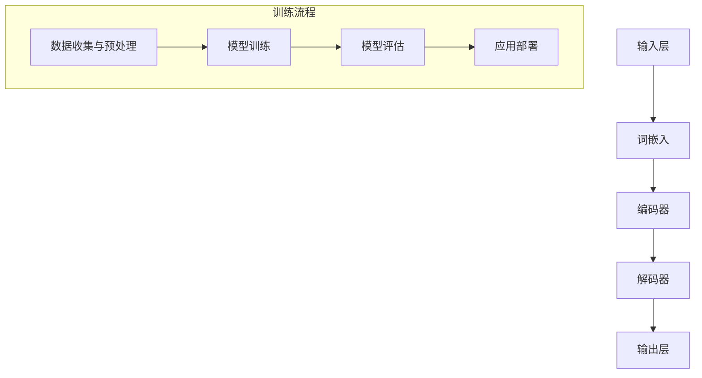

                 

# LLM 对就业市场的影响：工作创造和替代

> **关键词：** 人工智能，大语言模型，就业市场，工作创造，工作替代，劳动力市场。

> **摘要：** 本文将探讨大型语言模型（LLM）在就业市场中的影响，分析其在创造新工作机会和替代传统工作岗位方面的作用。通过对LLM的核心原理、技术发展、应用场景及对就业市场的具体影响进行详细分析，本文旨在为读者提供一个全面而深入的视角，以了解LLM在未来就业市场中的潜在作用和挑战。

## 1. 背景介绍

### 1.1 目的和范围

本文旨在探讨大型语言模型（LLM）对就业市场的影响，重点关注工作创造和替代的现象。随着人工智能技术的快速发展，LLM已经在诸多领域展现出强大的应用潜力，从自然语言处理、数据分析到自动化写作，其应用范围日益广泛。本文将通过对LLM的核心原理、技术发展、应用场景及具体影响的深入分析，探讨LLM如何改变劳动力市场，创造新的工作机会，同时替代某些传统工作岗位。

### 1.2 预期读者

本文预期读者为对人工智能和就业市场感兴趣的专业人士、学者、政策制定者及对技术发展趋势感兴趣的普通读者。无论您是从事人工智能相关领域的研究者，还是关注未来就业市场的从业人员，本文都将为您提供有价值的信息和洞察。

### 1.3 文档结构概述

本文将分为以下八个主要部分：

1. **背景介绍**：简要介绍本文的目的、预期读者及文档结构。
2. **核心概念与联系**：定义关键术语，描述LLM的技术原理和架构。
3. **核心算法原理 & 具体操作步骤**：详细介绍LLM的核心算法原理，包括数据处理和模型训练的具体步骤。
4. **数学模型和公式 & 详细讲解 & 举例说明**：探讨LLM的数学模型和关键公式，并通过具体实例进行说明。
5. **项目实战：代码实际案例和详细解释说明**：提供LLM的实际应用案例，并进行详细解读。
6. **实际应用场景**：讨论LLM在不同行业和领域中的应用实例。
7. **工具和资源推荐**：推荐相关学习资源、开发工具和框架。
8. **总结：未来发展趋势与挑战**：总结LLM对就业市场的影响，并展望未来趋势与面临的挑战。

### 1.4 术语表

#### 1.4.1 核心术语定义

- **大型语言模型（LLM）**：一种基于神经网络的语言模型，能够理解和生成自然语言。
- **自然语言处理（NLP）**：一门计算机科学领域，旨在使计算机能够理解和处理自然语言。
- **就业市场**：指劳动力市场中求职者与雇主之间的互动和匹配过程。
- **工作创造**：指新技术和应用带来的新工作岗位。
- **工作替代**：指新技术替代传统工作岗位，导致部分劳动力失业。

#### 1.4.2 相关概念解释

- **神经网络**：一种模拟生物神经系统的计算模型，广泛应用于人工智能领域。
- **深度学习**：一种机器学习方法，通过多层神经网络进行模型训练和预测。
- **转移学习**：一种将预训练模型应用于新任务的方法，能够提高模型在新领域的表现。
- **数据标注**：指对大规模语料库进行人工标注，用于训练语言模型。

#### 1.4.3 缩略词列表

- **LLM**：Large Language Model（大型语言模型）
- **NLP**：Natural Language Processing（自然语言处理）
- **AI**：Artificial Intelligence（人工智能）
- **ML**：Machine Learning（机器学习）
- **DL**：Deep Learning（深度学习）

## 2. 核心概念与联系

在探讨LLM对就业市场的影响之前，有必要首先了解LLM的核心概念和技术原理。以下内容将定义关键术语，并描述LLM的技术原理和架构，以帮助读者更好地理解后续讨论。

### 2.1 LLM的技术原理

LLM是一种基于神经网络的语言模型，能够理解和生成自然语言。其核心原理包括：

1. **词嵌入（Word Embedding）**：将单词映射为向量表示，以便在神经网络中进行处理。
2. **循环神经网络（RNN）**：一种能够处理序列数据的神经网络，能够考虑单词之间的顺序关系。
3. **长短时记忆网络（LSTM）**：RNN的一种变体，能够解决长序列数据中的梯度消失问题。
4. **Transformer模型**：一种基于自注意力机制的神经网络模型，在NLP任务中表现出色。

### 2.2 LLM的架构

LLM的架构通常包括以下主要部分：

1. **输入层**：接收自然语言文本序列，将其转换为词嵌入向量。
2. **编码器**：将词嵌入向量输入编码器，进行编码处理，生成上下文信息。
3. **解码器**：将编码后的上下文信息输入解码器，生成目标语言的文本序列。
4. **输出层**：解码器输出最终的文本序列，可以用于生成文本、回答问题等任务。

### 2.3 LLM的工作流程

LLM的工作流程可以概括为以下步骤：

1. **数据收集与预处理**：收集大量自然语言文本数据，并进行预处理，如分词、去噪等。
2. **模型训练**：使用预处理后的数据对LLM进行训练，调整模型参数，使其能够理解和生成自然语言。
3. **模型评估**：使用验证集对训练好的模型进行评估，调整模型参数，提高模型性能。
4. **应用部署**：将训练好的模型部署到实际应用场景中，如自动化写作、智能客服等。

### 2.4 LLM的核心概念原理和架构的Mermaid流程图

以下是LLM的核心概念原理和架构的Mermaid流程图：



## 3. 核心算法原理 & 具体操作步骤

在深入了解LLM的核心算法原理和具体操作步骤之前，我们需要明确LLM在自然语言处理任务中的基本流程。以下内容将详细介绍LLM的核心算法原理，包括词嵌入、循环神经网络（RNN）、长短时记忆网络（LSTM）和Transformer模型，并通过伪代码形式展示具体操作步骤。

### 3.1 词嵌入（Word Embedding）

词嵌入是将自然语言文本中的单词映射为固定长度的向量表示。这一步骤为后续的神经网络处理提供基础。词嵌入通常使用预训练模型（如Word2Vec、GloVe等）或自训练模型进行。

#### 3.1.1 伪代码

```python
# 输入：单词列表，预训练词嵌入模型
# 输出：单词向量表示列表

def word_embedding(words, embedding_model):
    word_vectors = []
    for word in words:
        vector = embedding_model[word]
        word_vectors.append(vector)
    return word_vectors
```

### 3.2 循环神经网络（RNN）

循环神经网络（RNN）是一种能够处理序列数据的神经网络，能够考虑单词之间的顺序关系。RNN的基本结构包括输入层、隐藏层和输出层。

#### 3.2.1 伪代码

```python
# 输入：单词向量列表，隐藏状态，时间步
# 输出：更新后的隐藏状态

def rnn(input_vector, hidden_state, time_step):
    # 前向传播
    output = activation(wx + b)
    hidden_state = tanh(output)

    return hidden_state
```

### 3.3 长短时记忆网络（LSTM）

长短时记忆网络（LSTM）是RNN的一种变体，能够解决长序列数据中的梯度消失问题。LSTM通过引入门控机制，能够更好地控制信息的传递和遗忘。

#### 3.3.1 伪代码

```python
# 输入：单词向量列表，隐藏状态，时间步
# 输出：更新后的隐藏状态

def lstm(input_vector, hidden_state, cell_state, time_step):
    # 前向传播
    i_f, o_f, g_f, i_g = activation(W_f * [input_vector, hidden_state], b_f)
    i_c, o_c, g_c, i_g = activation(W_c * [input_vector, hidden_state], b_c)

    f = sigmoid(i_f)
    g = tanh(g_f)
    i = sigmoid(i_g)
    o = sigmoid(o_g)

    c = f * c_prev + i * g
    h = o * tanh(c)

    return h, c
```

### 3.4 Transformer模型

Transformer模型是一种基于自注意力机制的神经网络模型，在NLP任务中表现出色。Transformer模型的核心思想是通过多头自注意力机制，对输入序列进行全局关注和局部关注。

#### 3.4.1 伪代码

```python
# 输入：单词向量列表，查询向量，键向量，值向量
# 输出：自注意力得分列表

def self_attention(query, key, value):
    # 计算注意力得分
    attention_scores = softmax(QK^T)

    # 计算自注意力输出
    attention_output = attention_scores @ V

    return attention_output
```

### 3.5 LLM的工作流程

LLM的工作流程通常包括以下步骤：

1. **数据预处理**：对自然语言文本进行预处理，如分词、去噪等。
2. **词嵌入**：将预处理后的文本转换为词嵌入向量。
3. **模型训练**：使用词嵌入向量训练LLM，调整模型参数。
4. **模型评估**：使用验证集对训练好的模型进行评估，调整模型参数。
5. **应用部署**：将训练好的模型部署到实际应用场景中。

#### 3.5.1 伪代码

```python
# 输入：文本数据，词嵌入模型，训练参数
# 输出：训练好的LLM模型

def train_LLM(text_data, embedding_model, train_params):
    # 数据预处理
    preprocessed_data = preprocess_data(text_data)

    # 词嵌入
    word_vectors = word_embedding(preprocessed_data, embedding_model)

    # 模型训练
    model = train_model(word_vectors, train_params)

    # 模型评估
    evaluate_model(model, validation_data)

    return model
```

## 4. 数学模型和公式 & 详细讲解 & 举例说明

在深入探讨大型语言模型（LLM）的数学模型和公式之前，我们需要了解一些基础的数学和机器学习概念。以下内容将介绍LLM中常用的数学模型和公式，并通过具体实例进行说明。

### 4.1 常用数学符号和定义

- **向量**：表示为$\mathbf{x} = (x_1, x_2, \ldots, x_n)$，其中$x_i$是向量的第$i$个元素。
- **矩阵**：表示为$\mathbf{A} = (a_{ij})_{m \times n}$，其中$a_{ij}$是矩阵的第$i$行第$j$列的元素。
- **标量**：表示为$s$，没有维度。
- **函数**：表示为$f(x)$，将输入$x$映射到输出$f(x)$。
- **损失函数**：用于衡量模型预测值与实际值之间的差异，常见的有均方误差（MSE）和交叉熵（Cross Entropy）。

### 4.2 LLM中的数学模型

LLM中的数学模型主要包括词嵌入、循环神经网络（RNN）、长短时记忆网络（LSTM）和Transformer模型。以下内容将分别介绍这些模型的数学公式。

#### 4.2.1 词嵌入

词嵌入是将单词映射为向量表示的数学模型。常见的词嵌入模型有Word2Vec和GloVe。

1. **Word2Vec**：

   Word2Vec使用以下公式进行训练：

   $$\mathbf{v}_w = \mathbf{v}_c + \sum_{j \in context(w)} \mathbf{v}_j$$

   其中，$\mathbf{v}_w$是单词$w$的向量表示，$\mathbf{v}_c$是中心词向量，$\mathbf{v}_j$是上下文词向量，$context(w)$是单词$w$的上下文。

2. **GloVe**：

   GloVe使用以下公式进行训练：

   $$\mathbf{v}_w = \mathbf{V}_w \cdot \text{softmax}\left(\frac{\mathbf{W}_w \cdot \mathbf{X}}{\sqrt{\|\mathbf{W}_w\|_2 \|\mathbf{X}\|_2}}\right)$$

   其中，$\mathbf{V}_w$是单词$w$的向量表示，$\mathbf{W}_w$是单词$w$的上下文词向量，$\mathbf{X}$是所有单词的上下文词向量，$\|\mathbf{X}\|_2$是$\mathbf{X}$的L2范数。

#### 4.2.2 循环神经网络（RNN）

循环神经网络（RNN）用于处理序列数据，其基本数学模型包括输入层、隐藏层和输出层。

1. **输入层**：

   输入层接收单词向量序列$\mathbf{x}_t$，并将其传递给隐藏层。

   $$\mathbf{h}_t = \tanh(\mathbf{W}_x \mathbf{x}_t + \mathbf{b}_h)$$

   其中，$\mathbf{h}_t$是隐藏状态，$\mathbf{W}_x$是输入权重矩阵，$\mathbf{b}_h$是隐藏偏置。

2. **隐藏层**：

   隐藏层接收前一个时间步的隐藏状态$\mathbf{h}_{t-1}$和当前时间步的输入$\mathbf{x}_t$，并计算当前时间步的隐藏状态。

   $$\mathbf{h}_t = \tanh(\mathbf{W}_h \mathbf{h}_{t-1} + \mathbf{W}_x \mathbf{x}_t + \mathbf{b}_h)$$

   其中，$\mathbf{W}_h$是隐藏权重矩阵。

3. **输出层**：

   输出层将隐藏状态$\mathbf{h}_t$传递给softmax层，生成当前时间步的输出$\mathbf{y}_t$。

   $$\mathbf{y}_t = \text{softmax}(\mathbf{W}_y \mathbf{h}_t + \mathbf{b}_y)$$

   其中，$\mathbf{W}_y$是输出权重矩阵，$\mathbf{b}_y$是输出偏置。

#### 4.2.3 长短时记忆网络（LSTM）

长短时记忆网络（LSTM）是RNN的一种变体，用于解决长序列数据中的梯度消失问题。LSTM的基本数学模型包括输入门、遗忘门、输出门和单元状态。

1. **输入门**：

   输入门决定当前输入对单元状态的影响。

   $$i_t = \sigma(\mathbf{W}_i [\mathbf{h}_{t-1}, \mathbf{x}_t] + \mathbf{b}_i)$$

   其中，$i_t$是输入门状态，$\sigma$是sigmoid函数，$\mathbf{W}_i$是输入权重矩阵，$\mathbf{b}_i$是输入偏置。

2. **遗忘门**：

   遗忘门决定当前隐藏状态对单元状态的影响。

   $$f_t = \sigma(\mathbf{W}_f [\mathbf{h}_{t-1}, \mathbf{x}_t] + \mathbf{b}_f)$$

   其中，$f_t$是遗忘门状态，$\mathbf{W}_f$是遗忘权重矩阵，$\mathbf{b}_f$是遗忘偏置。

3. **输出门**：

   输出门决定当前单元状态对输出状态的影响。

   $$o_t = \sigma(\mathbf{W}_o [\mathbf{h}_{t-1}, \mathbf{x}_t] + \mathbf{b}_o)$$

   其中，$o_t$是输出门状态，$\mathbf{W}_o$是输出权重矩阵，$\mathbf{b}_o$是输出偏置。

4. **单元状态**：

   单元状态由遗忘门和输入门共同决定。

   $$c_t = f_t \odot c_{t-1} + i_t \odot \tanh(\mathbf{W}_c [\mathbf{h}_{t-1}, \mathbf{x}_t] + \mathbf{b}_c)$$

   其中，$c_t$是单元状态，$\odot$是点乘运算，$\mathbf{W}_c$是单元权重矩阵，$\mathbf{b}_c$是单元偏置。

5. **隐藏状态**：

   隐藏状态由输出门和单元状态共同决定。

   $$h_t = o_t \odot \tanh(c_t)$$

   其中，$h_t$是隐藏状态。

#### 4.2.4 Transformer模型

Transformer模型是一种基于自注意力机制的神经网络模型，其基本数学模型包括多头自注意力机制和前馈神经网络。

1. **多头自注意力机制**：

   多头自注意力机制通过多个独立的自注意力模块对输入序列进行全局关注和局部关注。

   $$\mathbf{h}_t = \text{softmax}\left(\frac{\mathbf{W}_Q \mathbf{h}_{t-1} \mathbf{W}_K^T}{\sqrt{d_k}}\right) \mathbf{W}_V$$

   其中，$\mathbf{h}_t$是当前时间步的隐藏状态，$\mathbf{W}_Q$、$\mathbf{W}_K$和$\mathbf{W}_V$分别是查询权重矩阵、键权重矩阵和值权重矩阵，$d_k$是键值向量的维度。

2. **前馈神经网络**：

   前馈神经网络对自注意力模块的输出进行进一步处理。

   $$\mathbf{h}_t = \text{ReLU}(\mathbf{W}_f \mathbf{h}_t + \mathbf{b}_f)$$

   其中，$\text{ReLU}$是ReLU激活函数，$\mathbf{W}_f$是前馈权重矩阵，$\mathbf{b}_f$是前馈偏置。

### 4.3 举例说明

以下是一个简单的LLM训练过程的数学模型举例：

假设我们有一个包含100个单词的语料库，使用Word2Vec模型进行词嵌入。给定一个单词序列$w_1, w_2, \ldots, w_n$，我们首先对每个单词进行词嵌入，得到词嵌入向量序列$\mathbf{v}_1, \mathbf{v}_2, \ldots, \mathbf{v}_n$。

接下来，我们使用RNN对词嵌入向量序列进行训练。给定一个时间步$t$，我们首先计算输入层到隐藏层的激活函数：

$$\mathbf{h}_t = \tanh(\mathbf{W}_x \mathbf{v}_t + \mathbf{b}_h)$$

然后，我们使用隐藏状态$\mathbf{h}_t$计算输出层到softmax层的激活函数：

$$\mathbf{y}_t = \text{softmax}(\mathbf{W}_y \mathbf{h}_t + \mathbf{b}_y)$$

最终，我们使用均方误差（MSE）损失函数计算模型预测值与实际值之间的差异，并通过反向传播更新模型参数。

$$\mathcal{L} = \frac{1}{n} \sum_{t=1}^n \sum_{i=1}^n (y_{ti} - \hat{y}_{ti})^2$$

其中，$y_{ti}$是实际标签，$\hat{y}_{ti}$是模型预测值。

## 5. 项目实战：代码实际案例和详细解释说明

为了更好地理解大型语言模型（LLM）在实际项目中的应用，以下我们将通过一个简单的项目实战，展示如何使用Python和TensorFlow库搭建一个基于Transformer模型的LLM。我们将详细介绍开发环境搭建、源代码实现和代码解读与分析。

### 5.1 开发环境搭建

在开始项目之前，我们需要搭建一个适合开发LLM的开发环境。以下是一些建议的步骤：

1. **安装Python**：确保已经安装了Python 3.7或更高版本。
2. **安装TensorFlow**：使用以下命令安装TensorFlow：

   ```bash
   pip install tensorflow
   ```

3. **安装其他依赖库**：包括Numpy、Pandas等：

   ```bash
   pip install numpy pandas
   ```

4. **创建项目文件夹**：在合适的位置创建一个名为“llm_project”的项目文件夹，并在其中创建一个名为“src”的子文件夹，用于存放源代码。

### 5.2 源代码详细实现和代码解读

在“src”文件夹中，我们将创建两个主要文件：“data_preprocessing.py”和“llm_model.py”。以下是这两个文件的详细实现和代码解读。

#### 5.2.1 data_preprocessing.py

**功能**：负责数据预处理，包括文本的分词、清洗和转换为词嵌入向量。

**代码解读**：

```python
import pandas as pd
import numpy as np
from tensorflow.keras.preprocessing.text import Tokenizer
from tensorflow.keras.preprocessing.sequence import pad_sequences

def preprocess_text(text):
    # 去除文本中的特殊字符和标点符号
    text = re.sub(r"[^a-zA-Z0-9\s]", "", text)
    # 转换为小写
    text = text.lower()
    # 分词
    words = text.split()
    return words

def load_data(file_path):
    # 读取数据
    data = pd.read_csv(file_path)
    # 预处理文本
    texts = data['text'].apply(preprocess_text)
    return texts

def prepare_tokenizer(texts, max_words=10000):
    # 准备分词器
    tokenizer = Tokenizer(num_words=max_words, oov_token='<OOV>', filters='')
    tokenizer.fit_on_texts(texts)
    return tokenizer

def convert_sequences(tokenizer, texts, max_length=100):
    # 转换为序列
    sequences = tokenizer.texts_to_sequences(texts)
    padded_sequences = pad_sequences(sequences, maxlen=max_length, padding='post', truncating='post')
    return padded_sequences
```

#### 5.2.2 llm_model.py

**功能**：定义LLM模型，包括输入层、编码器、解码器和输出层。

**代码解读**：

```python
import tensorflow as tf
from tensorflow.keras.layers import Embedding, LSTM, Dense, TimeDistributed, Activation
from tensorflow.keras.models import Model

def create_llm_model(input_shape, embedding_dim, hidden_units, output_units):
    # 输入层
    inputs = tf.keras.Input(shape=input_shape)

    # 词嵌入层
    embeddings = Embedding(input_dim=10000, output_dim=embedding_dim)(inputs)

    # 编码器
    encoder_lstm = LSTM(hidden_units, return_sequences=True)(embeddings)

    # 解码器
    decoder_lstm = LSTM(hidden_units, return_sequences=True)(encoder_lstm)

    # 输出层
    outputs = TimeDistributed(Dense(output_units, activation='softmax'))(decoder_lstm)

    # 模型
    model = Model(inputs=inputs, outputs=outputs)

    # 编译模型
    model.compile(optimizer='adam', loss='categorical_crossentropy', metrics=['accuracy'])

    return model
```

### 5.3 代码解读与分析

在代码解读与分析部分，我们将详细解释上述代码的功能和实现细节。

#### 5.3.1 数据预处理

在“data_preprocessing.py”中，我们首先定义了三个功能函数：

1. **preprocess_text**：负责去除文本中的特殊字符和标点符号，并将文本转换为小写。这有助于减少文本中的噪声，提高模型的泛化能力。
2. **load_data**：负责读取CSV文件中的文本数据，并将其传递给预处理函数。这将生成一个包含预处理后文本的列表。
3. **prepare_tokenizer**：负责准备分词器，将文本转换为词嵌入向量。我们使用Tokenize

