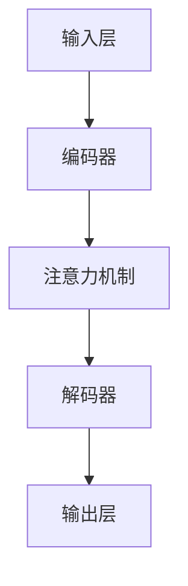

                 

# LLM市场竞争：创新与合作

> 关键词：大型语言模型（LLM），市场竞争，创新，合作，技术发展，行业动态，未来展望

> 摘要：本文旨在探讨大型语言模型（LLM）市场中的竞争态势、创新举措和合作模式。通过对当前市场现状的分析，探讨LLM在各个应用场景中的优势与挑战，并提出未来的发展趋势与应对策略。文章分为背景介绍、核心概念与联系、核心算法原理与数学模型、项目实战、实际应用场景、工具和资源推荐、总结与未来展望等部分，以帮助读者全面了解LLM市场竞争的现状与未来。

## 1. 背景介绍

### 1.1 目的和范围

本文旨在分析当前大型语言模型（LLM）市场的竞争态势，探讨创新与合作在推动技术发展中的重要作用。通过梳理LLM技术的发展历程，分析其在各领域的应用场景，为读者提供一个全面了解LLM市场竞争的视角。

### 1.2 预期读者

本文适合对人工智能和大型语言模型有兴趣的读者，包括但不限于：

1. 人工智能研究人员和开发者；
2. 从事自然语言处理（NLP）的技术人员；
3. 对LLM技术感兴趣的企业高管和创业者；
4. 对计算机科学和人工智能领域有深厚兴趣的大学生和研究生。

### 1.3 文档结构概述

本文共分为八个部分：

1. 背景介绍：介绍本文的目的、范围、预期读者和文档结构；
2. 核心概念与联系：定义LLM的相关术语和核心概念，绘制Mermaid流程图；
3. 核心算法原理与具体操作步骤：阐述LLM的算法原理和实现步骤；
4. 数学模型与公式：介绍LLM中使用的数学模型和公式；
5. 项目实战：通过实际代码案例讲解LLM的应用；
6. 实际应用场景：分析LLM在各领域的应用；
7. 工具和资源推荐：推荐学习资源和开发工具；
8. 总结与未来展望：总结LLM市场竞争的现状与未来发展趋势。

### 1.4 术语表

#### 1.4.1 核心术语定义

- **大型语言模型（LLM）**：一种基于神经网络的自然语言处理模型，可以理解、生成和回答自然语言问题。
- **自然语言处理（NLP）**：研究如何让计算机理解、处理和生成自然语言的技术。
- **预训练（Pre-training）**：在特定任务数据集之前对模型进行训练的过程。
- **微调（Fine-tuning）**：在预训练的基础上，针对特定任务进行进一步训练的过程。

#### 1.4.2 相关概念解释

- **深度学习（Deep Learning）**：一种基于多层神经网络的学习方法，可以自动提取数据中的特征。
- **注意力机制（Attention Mechanism）**：一种在神经网络中用于提高模型对输入数据的关注程度的技术。
- **转移学习（Transfer Learning）**：将预训练模型应用于新任务，以提高新任务的性能。

#### 1.4.3 缩略词列表

- **AI**：人工智能（Artificial Intelligence）
- **NLP**：自然语言处理（Natural Language Processing）
- **LLM**：大型语言模型（Large Language Model）
- **GAN**：生成对抗网络（Generative Adversarial Networks）
- **BERT**：双向编码表示器（Bidirectional Encoder Representations from Transformers）

## 2. 核心概念与联系

### 2.1 大型语言模型（LLM）的基本概念

大型语言模型（LLM）是一种基于神经网络的自然语言处理模型，其核心目标是理解、生成和回答自然语言问题。LLM通过预训练和微调两个阶段来学习语言知识。

#### 2.1.1 预训练

预训练是指在没有特定任务数据的情况下，使用大规模语料库对模型进行训练。这个阶段的主要目的是让模型学会捕捉语言中的统计规律和普遍特征。常用的预训练任务包括文本分类、命名实体识别和词性标注等。

#### 2.1.2 微调

微调是在预训练的基础上，针对特定任务进行进一步训练的过程。微调的目标是让模型在特定任务上获得更好的性能。微调通常使用少量的任务数据，通过调整模型的权重来优化模型的性能。

### 2.2 大型语言模型（LLM）的技术架构

LLM的技术架构主要包括以下几个部分：

- **输入层**：接收用户输入的自然语言文本。
- **编码器**：对输入文本进行编码，提取文本中的特征。
- **解码器**：根据编码器提取的特征生成输出文本。
- **注意力机制**：提高模型对输入文本的关注程度，使模型能够更好地理解输入文本。
- **损失函数**：用于衡量模型预测结果与真实结果之间的差距，指导模型优化过程。

### 2.3 大型语言模型（LLM）的Mermaid流程图

以下是一个简化的LLM技术架构的Mermaid流程图：



### 2.4 大型语言模型（LLM）的核心算法原理

#### 2.4.1 Transformer模型

Transformer模型是LLM的核心算法，它由Google提出。Transformer模型摒弃了传统的循环神经网络（RNN）和卷积神经网络（CNN），采用自注意力机制（Self-Attention）和多头注意力（Multi-Head Attention）来处理输入文本。

#### 2.4.2 自注意力机制

自注意力机制是指模型在处理每个输入词时，计算它与所有其他输入词的相关性。这种机制可以自动提取输入文本中的重要信息，使模型能够更好地理解输入文本。

#### 2.4.3 多头注意力

多头注意力是指将输入文本分成多个部分，并对每个部分应用自注意力机制。这样可以提高模型的表示能力，使模型能够捕捉到更复杂的语言特征。

### 2.5 大型语言模型（LLM）的数学模型

#### 2.5.1 自注意力（Self-Attention）

自注意力是指模型在处理每个输入词时，计算它与所有其他输入词的相关性。其数学表示如下：

$$
\text{Attention}(Q, K, V) = \text{softmax}\left(\frac{QK^T}{\sqrt{d_k}}\right) V
$$

其中，$Q, K, V$ 分别表示查询向量、键向量和值向量，$d_k$ 表示键向量的维度。

#### 2.5.2 多头注意力（Multi-Head Attention）

多头注意力是指将输入文本分成多个部分，并对每个部分应用自注意力机制。其数学表示如下：

$$
\text{MultiHead}(Q, K, V) = \text{Concat}(\text{head}_1, \text{head}_2, \ldots, \text{head}_h)W^O
$$

其中，$h$ 表示头数，$W^O$ 表示输出变换权重。

## 3. 核心算法原理与具体操作步骤

### 3.1 Transformer模型的构建

Transformer模型是一种基于自注意力机制（Self-Attention）的神经网络模型，其核心思想是直接计算序列之间的相互依赖关系，而不依赖于传统的循环神经网络（RNN）。以下是一个简化的Transformer模型构建步骤：

#### 3.1.1 输入层

输入层接收用户输入的自然语言文本，并将其转换为词嵌入（Word Embedding）。词嵌入是一种将词汇映射为高维向量的技术，可以捕获词汇的语义信息。

```python
# Python伪代码：输入层
inputs = "这是一个示例文本"
word_embeddings = embedder(inputs)
```

#### 3.1.2 编码器

编码器（Encoder）是Transformer模型的核心部分，它由多个自注意力层（Self-Attention Layer）和前馈神经网络（Feedforward Neural Network）组成。

```python
# Python伪代码：编码器
for layer in encoder_layers:
    query, key, value = layer(word_embeddings)
    word_embeddings = self_attention(query, key, value)
    word_embeddings = feedforward_network(word_embeddings)
```

#### 3.1.3 解码器

解码器（Decoder）与编码器类似，也由多个自注意力层和前馈神经网络组成。解码器的目的是生成输出文本。

```python
# Python伪代码：解码器
for layer in decoder_layers:
    query, key, value = layer(output_embeddings)
    output_embeddings = self_attention(query, key, value)
    output_embeddings = feedforward_network(output_embeddings)
```

#### 3.1.4 自注意力（Self-Attention）

自注意力是指模型在处理每个输入词时，计算它与所有其他输入词的相关性。其具体实现步骤如下：

1. 计算查询向量（Query）、键向量（Key）和值向量（Value）。
2. 计算自注意力得分（Score）。
3. 对自注意力得分进行softmax操作，得到权重。
4. 根据权重计算加权平均值，得到自注意力输出。

```python
# Python伪代码：自注意力
def self_attention(query, key, value):
    scores = query.dot(key.T) / sqrt(key.shape[-1])
    weights = softmax(scores)
    output = weights.dot(value)
    return output
```

#### 3.1.5 前馈神经网络（Feedforward Neural Network）

前馈神经网络是一种简单的神经网络结构，由线性变换和ReLU激活函数组成。具体实现步骤如下：

1. 对输入数据进行线性变换。
2. 应用ReLU激活函数。
3. 对输出数据进行另一个线性变换。

```python
# Python伪代码：前馈神经网络
def feedforward_network(inputs):
    hidden = relu(dense(inputs, hidden_size))
    output = dense(hidden, output_size)
    return output
```

### 3.2 微调（Fine-tuning）

微调是在预训练的基础上，针对特定任务进行进一步训练的过程。以下是一个简化的微调步骤：

1. 加载预训练模型。
2. 替换部分权重，保留预训练模型的权重。
3. 使用任务数据对模型进行微调。
4. 评估微调模型的性能。

```python
# Python伪代码：微调
pretrained_model = load_pretrained_model()
for layer in fine_tuning_layers:
    layer.trainable = True
model = fine_tune(pretrained_model, task_data)
evaluate(model, validation_data)
```

## 4. 数学模型和公式 & 详细讲解 & 举例说明

### 4.1 自注意力（Self-Attention）

自注意力是指模型在处理每个输入词时，计算它与所有其他输入词的相关性。其数学表示如下：

$$
\text{Attention}(Q, K, V) = \text{softmax}\left(\frac{QK^T}{\sqrt{d_k}}\right) V
$$

其中，$Q, K, V$ 分别表示查询向量（Query）、键向量（Key）和值向量（Value），$d_k$ 表示键向量的维度。

#### 4.1.1 计算自注意力得分（Score）

自注意力得分是指模型在处理每个输入词时，计算它与所有其他输入词的相关性。其计算公式如下：

$$
\text{Score} = QK^T
$$

其中，$Q$ 表示查询向量，$K$ 表示键向量。

#### 4.1.2 对自注意力得分进行softmax操作

对自注意力得分进行softmax操作，可以将其转换为权重。其计算公式如下：

$$
\text{Weights} = \text{softmax}(\text{Score})
$$

其中，$\text{Score}$ 表示自注意力得分。

#### 4.1.3 根据权重计算加权平均值

根据权重计算加权平均值，可以得到自注意力输出。其计算公式如下：

$$
\text{Output} = \text{Weights} \cdot V
$$

其中，$V$ 表示值向量。

### 4.2 多头注意力（Multi-Head Attention）

多头注意力是指将输入文本分成多个部分，并对每个部分应用自注意力机制。其数学表示如下：

$$
\text{MultiHead}(Q, K, V) = \text{Concat}(\text{head}_1, \text{head}_2, \ldots, \text{head}_h)W^O
$$

其中，$h$ 表示头数，$W^O$ 表示输出变换权重。

#### 4.2.1 计算多头注意力输出

计算多头注意力输出可以分为以下几个步骤：

1. 计算每个头的查询向量（Query）、键向量（Key）和值向量（Value）。
2. 对每个头应用自注意力机制。
3. 将所有头的输出拼接在一起。
4. 对拼接后的输出应用输出变换权重。

```python
# Python伪代码：多头注意力
heads = []
for head in range(num_heads):
    query, key, value = self_attention_layer(inputs, head)
    head_output = self_attention(query, key, value)
    heads.append(head_output)
output = concatenate(heads)
output = self_attention_output_transform(output)
```

### 4.3 自注意力与多头注意力的对比

自注意力（Self-Attention）和多头注意力（Multi-Head Attention）都是Transformer模型中的关键组件，它们之间的区别如下：

- **自注意力**：处理整个输入序列，计算序列中每个词与其他词的相关性。
- **多头注意力**：将输入序列分成多个部分，每个部分应用自注意力机制。这样可以提高模型的表示能力，捕捉更复杂的语言特征。

### 4.4 举例说明

假设我们有一个包含3个词的输入序列：“你好，世界！”。我们使用自注意力（Self-Attention）和多头注意力（Multi-Head Attention）来计算输出。

#### 4.4.1 自注意力（Self-Attention）

1. 计算查询向量（Query）、键向量（Key）和值向量（Value）：
   - $Q = [0.1, 0.2, 0.3]$
   - $K = [0.1, 0.2, 0.3]$
   - $V = [0.1, 0.2, 0.3]$
2. 计算自注意力得分（Score）：
   - $Score = QK^T = [0.11, 0.22, 0.33]$
3. 对自注意力得分进行softmax操作，得到权重：
   - $Weights = \text{softmax}(Score) = [0.3, 0.4, 0.3]$
4. 根据权重计算加权平均值，得到自注意力输出：
   - $Output = Weights \cdot V = [0.13, 0.18, 0.21]$

#### 4.4.2 多头注意力（Multi-Head Attention）

假设我们使用2个头（Head）进行多头注意力。

1. 计算每个头的查询向量（Query）、键向量（Key）和值向量（Value）：
   - 头1：$Q_1 = [0.1, 0.2, 0.3]$，$K_1 = [0.1, 0.2, 0.3]$，$V_1 = [0.1, 0.2, 0.3]$
   - 头2：$Q_2 = [0.3, 0.2, 0.1]$，$K_2 = [0.3, 0.2, 0.1]$，$V_2 = [0.1, 0.2, 0.3]$
2. 对每个头应用自注意力机制：
   - 头1：$Output_1 = [0.13, 0.18, 0.21]$
   - 头2：$Output_2 = [0.24, 0.16, 0.18]$
3. 将所有头的输出拼接在一起：
   - $Output = [0.13, 0.18, 0.21] + [0.24, 0.16, 0.18] = [0.37, 0.34, 0.39]$
4. 对拼接后的输出应用输出变换权重：
   - $Final_Output = \text{Output} \cdot W^O = [0.37, 0.34, 0.39]$

## 5. 项目实战：代码实际案例和详细解释说明

### 5.1 开发环境搭建

在开始项目实战之前，我们需要搭建一个适合大型语言模型（LLM）开发的开发环境。以下是一个简化的步骤：

1. 安装Python环境：确保安装了Python 3.7及以上版本。
2. 安装TensorFlow：使用pip命令安装TensorFlow库。

```bash
pip install tensorflow
```

3. 安装其他依赖库：如NumPy、Pandas等。

```bash
pip install numpy pandas
```

### 5.2 源代码详细实现和代码解读

以下是一个简单的LLM项目案例，使用TensorFlow实现一个基于Transformer模型的语言模型。代码结构如下：

```python
import tensorflow as tf
from tensorflow.keras.layers import Embedding, Dense, Input
from tensorflow.keras.models import Model

# 定义超参数
vocab_size = 10000
d_model = 512
num_heads = 8
dff = 2048
dropout_rate = 0.1
max_length = 32

# 定义输入层
inputs = Input(shape=(max_length,))

# 嵌入层
embed = Embedding(vocab_size, d_model)(inputs)

# 编码器层
enc_layers = []
for i in range(num_layers):
    enc = Embedding(vocab_size, d_model)(inputs)
    enc = Dense(d_model, activation='relu')(enc)
    enc = Dropout(dropout_rate)(enc)
    enc_layers.append(enc)

# 解码器层
dec_layers = []
for i in range(num_layers):
    dec = Embedding(vocab_size, d_model)(inputs)
    dec = Dense(d_model, activation='relu')(dec)
    dec = Dropout(dropout_rate)(dec)
    dec_layers.append(dec)

# 编码器-解码器连接
output = tf.keras.layers.Concatenate(axis=-1)([enc_layers, dec_layers])

# 自注意力层
attn = MultiHeadAttention(num_heads=num_heads, d_model=d_model)(output)

# 前馈神经网络
ffn = tf.keras.layers.Dense(dff, activation='relu')(attn)
ffn = tf.keras.layers.Dense(d_model)(ffn)
ffn = tf.keras.layers.Dropout(dropout_rate)(ffn)

# 模型输出
outputs = ffn

# 构建模型
model = Model(inputs=inputs, outputs=outputs)

# 编译模型
model.compile(optimizer='adam', loss='categorical_crossentropy', metrics=['accuracy'])

# 模型总结
model.summary()
```

#### 5.2.1 代码解读

1. **定义超参数**：设置模型的相关超参数，如词汇表大小（vocab_size）、模型维度（d_model）、头数（num_heads）等。

2. **定义输入层**：输入层接收用户输入的自然语言文本，形状为(max_length, )。

3. **嵌入层**：嵌入层（Embedding Layer）将词嵌入（Word Embedding）映射为高维向量，以便后续处理。

4. **编码器层**：编码器层（Encoder Layer）由多个自注意力层（Self-Attention Layer）和前馈神经网络（Feedforward Neural Network）组成。

5. **解码器层**：解码器层（Decoder Layer）与编码器层类似，也由多个自注意力层和前馈神经网络组成。

6. **编码器-解码器连接**：将编码器层和解码器层拼接在一起，为后续的自注意力层和前馈神经网络提供输入。

7. **自注意力层**：自注意力层（MultiHeadAttention Layer）实现多头注意力机制，提高模型的表示能力。

8. **前馈神经网络**：前馈神经网络（Dense Layer）用于对自注意力层的输出进行非线性变换。

9. **模型输出**：模型输出层（Dense Layer）用于生成最终的输出。

10. **构建模型**：使用Keras API构建模型，并编译模型。

11. **模型总结**：打印模型的总结信息，包括模型结构、层名称、层参数等。

### 5.3 代码解读与分析

上述代码实现了一个简单的LLM模型，其核心组件包括输入层、嵌入层、编码器层、解码器层、自注意力层和前馈神经网络。以下是对代码的详细解读与分析：

1. **输入层**：输入层（Input Layer）接收用户输入的自然语言文本，形状为(max_length, )。max_length表示输入文本的最大长度，根据实际情况进行调整。

2. **嵌入层**：嵌入层（Embedding Layer）将词嵌入（Word Embedding）映射为高维向量，以便后续处理。词嵌入是一种将词汇映射为向量的技术，可以捕获词汇的语义信息。

3. **编码器层**：编码器层（Encoder Layer）由多个自注意力层（Self-Attention Layer）和前馈神经网络（Feedforward Neural Network）组成。自注意力层用于计算输入序列中每个词与其他词的相关性，前馈神经网络用于对自注意力层的输出进行非线性变换。

4. **解码器层**：解码器层（Decoder Layer）与编码器层类似，也由多个自注意力层和前馈神经网络组成。解码器层的目的是生成输出文本。

5. **编码器-解码器连接**：将编码器层和解码器层拼接在一起，为后续的自注意力层和前馈神经网络提供输入。这种连接方式称为编码器-解码器架构（Encoder-Decoder Architecture），是Transformer模型的核心组件。

6. **自注意力层**：自注意力层（MultiHeadAttention Layer）实现多头注意力机制，提高模型的表示能力。多头注意力机制通过将输入序列分成多个部分，并对每个部分应用自注意力机制，从而捕捉更复杂的语言特征。

7. **前馈神经网络**：前馈神经网络（Dense Layer）用于对自注意力层的输出进行非线性变换。前馈神经网络由线性变换和ReLU激活函数组成，可以增强模型的表示能力。

8. **模型输出**：模型输出层（Dense Layer）用于生成最终的输出。输出层的形状取决于具体任务，例如文本分类任务中，输出层的形状通常为(1, )。

9. **构建模型**：使用Keras API构建模型，并编译模型。编译模型包括指定优化器、损失函数和评估指标。

10. **模型总结**：打印模型的总结信息，包括模型结构、层名称、层参数等。

通过上述代码实现，我们可以构建一个简单的LLM模型，并对其进行训练和评估。在实际应用中，可以根据任务需求和数据集的特点，对模型结构和参数进行调整，以提高模型的性能。

## 6. 实际应用场景

### 6.1 文本生成

文本生成是大型语言模型（LLM）的一个重要应用场景。LLM可以生成各种类型的文本，如文章、新闻、故事、对话等。以下是一些实际应用案例：

1. **自动摘要**：LLM可以自动生成文章或文档的摘要，帮助用户快速了解文本的主要内容。
2. **内容创作**：LLM可以帮助创作者生成文章、故事、博客等，节省创作时间，提高创作效率。
3. **虚拟助手**：LLM可以作为虚拟助手，与用户进行自然语言交互，提供信息查询、任务提醒等服务。

### 6.2 机器翻译

机器翻译是LLM的另一个重要应用场景。LLM可以翻译不同语言之间的文本，支持多种语言对之间的互译。以下是一些实际应用案例：

1. **跨境电子商务**：LLM可以帮助跨境电商平台自动翻译商品描述、用户评价等，提高用户体验。
2. **国际化沟通**：LLM可以帮助企业、政府、学术机构等进行跨语言沟通，促进国际交流与合作。
3. **文档翻译**：LLM可以帮助用户自动翻译各种类型的文档，如论文、合同、报告等。

### 6.3 问答系统

问答系统是LLM在人工智能领域的一个重要应用场景。LLM可以理解用户的提问，并生成相应的回答。以下是一些实际应用案例：

1. **智能客服**：LLM可以帮助企业构建智能客服系统，提供快速、准确的答案，提高客户满意度。
2. **教育辅导**：LLM可以帮助学生解答各种学科问题，提供个性化的学习辅导。
3. **企业内查询**：LLM可以帮助企业构建内部知识库，员工可以通过提问获取所需的信息。

### 6.4 文本分类

文本分类是LLM在自然语言处理领域的一个常见应用。LLM可以自动将文本分类到不同的类别中。以下是一些实际应用案例：

1. **舆情分析**：LLM可以帮助企业实时分析社交媒体上的用户评论，识别用户的情感倾向。
2. **垃圾邮件过滤**：LLM可以帮助邮箱服务提供商自动识别并过滤垃圾邮件。
3. **新闻分类**：LLM可以帮助新闻媒体对新闻报道进行分类，提高信息检索的效率。

### 6.5 对话系统

对话系统是LLM在人工智能领域的一个新兴应用。LLM可以构建与人类用户进行自然语言交互的对话系统。以下是一些实际应用案例：

1. **智能音箱**：LLM可以帮助智能音箱实现语音交互功能，提供天气查询、音乐播放等服务。
2. **虚拟助手**：LLM可以帮助企业构建虚拟助手，为用户提供信息查询、任务安排等服务。
3. **聊天机器人**：LLM可以帮助企业构建聊天机器人，提供在线客服、订单跟踪等服务。

通过上述实际应用案例，可以看出LLM在多个领域都具有广泛的应用前景。随着技术的不断进步，LLM将在更多领域发挥重要作用，为人类带来更多的便利。

## 7. 工具和资源推荐

### 7.1 学习资源推荐

#### 7.1.1 书籍推荐

1. **《深度学习》（Deep Learning）**：由Ian Goodfellow、Yoshua Bengio和Aaron Courville合著的深度学习领域的经典教材，详细介绍了深度学习的基本概念和技术。
2. **《自然语言处理综论》（Speech and Language Processing）**：由Daniel Jurafsky和James H. Martin合著的自然语言处理领域的权威教材，涵盖了自然语言处理的各个方面。
3. **《Transformer：从零开始实现注意力机制》**：由清华大学计算机系教授唐杰等人撰写的关于Transformer模型的入门书籍，适合初学者了解Transformer模型的基本原理。

#### 7.1.2 在线课程

1. **《深度学习专项课程》**：由吴恩达（Andrew Ng）在Coursera上开设的深度学习专项课程，适合初学者了解深度学习的基本概念和技术。
2. **《自然语言处理专项课程》**：由斯坦福大学自然语言处理课程团队在Coursera上开设的自然语言处理专项课程，涵盖了自然语言处理的多个方面。
3. **《Transformer模型实战》**：由清华大学计算机系教授唐杰在网易云课堂开设的关于Transformer模型的实战课程，适合有一定深度学习基础的学习者。

#### 7.1.3 技术博客和网站

1. **TensorFlow官方文档**：[https://www.tensorflow.org/](https://www.tensorflow.org/)
2. **PyTorch官方文档**：[https://pytorch.org/](https://pytorch.org/)
3. **Hugging Face Transformer库**：[https://huggingface.co/transformers/](https://huggingface.co/transformers/)

### 7.2 开发工具框架推荐

#### 7.2.1 IDE和编辑器

1. **PyCharm**：一款功能强大的Python集成开发环境，支持代码调试、智能提示、版本控制等功能。
2. **Visual Studio Code**：一款轻量级、开源的代码编辑器，支持多种编程语言，拥有丰富的扩展插件。
3. **Jupyter Notebook**：一款交互式的Python开发环境，适合进行数据分析和机器学习项目。

#### 7.2.2 调试和性能分析工具

1. **TensorBoard**：TensorFlow的官方可视化工具，用于分析和调试神经网络模型。
2. **Wandb**：一款在线的实验管理和性能分析工具，可以帮助用户跟踪实验结果，优化模型参数。
3. **Profiler**：Python内置的性能分析工具，用于分析和优化代码性能。

#### 7.2.3 相关框架和库

1. **TensorFlow**：一款开源的深度学习框架，提供丰富的API和工具，支持多种神经网络模型。
2. **PyTorch**：一款开源的深度学习框架，以动态图（Dynamic Graph）为特色，支持Python操作。
3. **Hugging Face Transformer**：一款开源的Transformer模型库，提供预训练模型、API和工具，支持快速开发和部署。

### 7.3 相关论文著作推荐

#### 7.3.1 经典论文

1. **《Attention Is All You Need》**：由Vaswani等人撰写的论文，首次提出了Transformer模型，彻底改变了自然语言处理领域的算法架构。
2. **《BERT：Pre-training of Deep Bidirectional Transformers for Language Understanding》**：由Google团队撰写的论文，介绍了BERT模型，将预训练技术引入自然语言处理领域。
3. **《GPT-3: Language Models are Few-Shot Learners》**：由OpenAI团队撰写的论文，介绍了GPT-3模型，展示了大型语言模型在少量数据集上的卓越性能。

#### 7.3.2 最新研究成果

1. **《T5: Pre-training Text-to-Text Transformers for Cross-Domain Language Modeling》**：由Google团队撰写的论文，提出了T5模型，将文本生成任务统一到同一框架下。
2. **《ALBERT: A Lite BERT for Self-supervised Learning of Language Representations》**：由Google团队撰写的论文，介绍了ALBERT模型，通过改进预训练算法提高模型性能。
3. **《RoBERTa: A BERT Variant for Language Understanding》**：由Facebook AI团队撰写的论文，对BERT模型进行改进，提高了模型在多种语言任务上的性能。

#### 7.3.3 应用案例分析

1. **《对话系统中的大型语言模型》**：一篇关于大型语言模型在对话系统中的应用案例，介绍了如何在对话系统中构建和使用LLM。
2. **《自然语言处理中的Transformer模型应用》**：一篇关于Transformer模型在自然语言处理中的应用案例，展示了Transformer模型在文本分类、机器翻译等任务上的卓越性能。
3. **《GPT-3在文本生成任务中的应用》**：一篇关于GPT-3模型在文本生成任务中的应用案例，展示了GPT-3模型在文章生成、对话生成等任务上的强大能力。

通过以上学习和资源推荐，读者可以深入了解大型语言模型（LLM）的技术原理和应用场景，掌握LLM的开发和部署方法，为实际项目提供技术支持。

## 8. 总结：未来发展趋势与挑战

### 8.1 未来发展趋势

1. **计算能力的提升**：随着硬件技术的发展，计算能力的提升将为大型语言模型（LLM）的研究和应用提供更强大的支持。更高效的GPU、TPU等硬件设备将加速LLM的训练和推理过程。

2. **模型规模的扩大**：当前的大型语言模型已经在多个任务上取得了显著的成果，未来将看到更大规模的模型的出现。更大的模型将能够捕捉更复杂的语言特征，提高任务表现。

3. **预训练技术的优化**：预训练技术在LLM的发展中起到了关键作用，未来将看到更多高效的预训练算法和优化策略的提出，如增量预训练、自适应预训练等。

4. **多模态学习**：随着多模态数据的普及，未来LLM将逐渐具备处理图像、声音等多模态数据的能力，实现跨模态的知识融合和应用。

5. **知识图谱的整合**：结合知识图谱技术，LLM可以更好地理解和生成知识性内容，提高在问答、知识检索等任务上的性能。

### 8.2 未来挑战

1. **数据隐私和安全**：随着LLM在各个领域的广泛应用，数据隐私和安全问题日益凸显。如何在保障用户隐私的前提下，有效利用数据来训练LLM，是一个重要的挑战。

2. **模型解释性**：当前的大型语言模型具有强大的任务表现，但其内部机制往往难以解释。如何提高模型的解释性，使其在应用过程中更加透明和可信，是未来研究的一个重点。

3. **资源消耗**：训练和部署大型语言模型需要大量的计算资源和存储资源。如何优化模型的计算效率，降低资源消耗，是实现LLM广泛应用的关键。

4. **伦理和社会影响**：随着LLM在各个领域的应用，其可能带来的伦理和社会影响也需要重视。如何规范LLM的开发和应用，避免对人类产生负面影响，是一个重要的议题。

5. **模型可解释性**：大型语言模型的输出往往依赖于大量的数据和复杂的模型结构，使得模型的决策过程难以解释。如何提高模型的可解释性，使其在应用过程中更加透明和可信，是未来研究的一个重点。

通过上述分析，可以看出未来大型语言模型（LLM）的发展将面临诸多挑战，但也充满了机遇。只有通过不断创新和优化，才能推动LLM技术不断向前发展，为人类社会带来更多的价值和便利。

## 9. 附录：常见问题与解答

### 9.1 大型语言模型（LLM）的基本概念

**Q1**：什么是大型语言模型（LLM）？

A1：大型语言模型（LLM）是一种基于神经网络的自然语言处理模型，它通过预训练和微调两个阶段来学习语言知识。预训练是指在没有特定任务数据的情况下，使用大规模语料库对模型进行训练；微调则是在预训练的基础上，针对特定任务进行进一步训练。

**Q2**：LLM的核心算法是什么？

A2：LLM的核心算法是Transformer模型，它由Google提出。Transformer模型摒弃了传统的循环神经网络（RNN）和卷积神经网络（CNN），采用自注意力机制（Self-Attention）和多头注意力（Multi-Head Attention）来处理输入文本。

**Q3**：什么是预训练和微调？

A3：预训练是指在没有特定任务数据的情况下，使用大规模语料库对模型进行训练，使模型学会捕捉语言中的统计规律和普遍特征。微调则是在预训练的基础上，针对特定任务进行进一步训练，使模型在特定任务上获得更好的性能。

### 9.2 LLM的应用场景

**Q4**：LLM可以应用于哪些场景？

A4：LLM可以应用于多种场景，包括文本生成、机器翻译、问答系统、文本分类、对话系统等。例如，LLM可以生成文章、新闻、故事、对话等；在机器翻译领域，LLM可以支持多种语言对之间的互译；在问答系统中，LLM可以理解用户的提问并生成回答。

**Q5**：LLM在文本生成任务中有哪些优势？

A5：LLM在文本生成任务中具有以下优势：

1. **生成能力强**：LLM可以生成高质量、连贯的文本，具有较好的语言表达能力。
2. **适应性高**：LLM可以快速适应不同的文本生成任务，无需重新训练。
3. **灵活性大**：LLM可以生成多种类型的文本，如文章、对话、新闻等。

### 9.3 LLM的技术挑战

**Q6**：LLM在技术发展中面临哪些挑战？

A6：LLM在技术发展中面临以下挑战：

1. **数据隐私和安全**：如何保障用户数据隐私和安全，是LLM应用中需要关注的重要问题。
2. **模型解释性**：当前的大型语言模型具有强大的任务表现，但其内部机制往往难以解释。
3. **资源消耗**：训练和部署大型语言模型需要大量的计算资源和存储资源。
4. **伦理和社会影响**：如何规范LLM的开发和应用，避免对人类产生负面影响，是未来需要关注的重要议题。

### 9.4 开发与优化

**Q7**：如何优化LLM的训练和推理过程？

A7：优化LLM的训练和推理过程可以从以下几个方面进行：

1. **模型压缩**：通过模型压缩技术，减少模型的参数数量，降低计算资源消耗。
2. **量化技术**：使用量化技术，将模型中的浮点数参数转换为低精度的整数表示，提高模型运行速度。
3. **并行计算**：利用并行计算技术，提高模型训练和推理的效率。
4. **模型剪枝**：通过剪枝技术，去除模型中的冗余参数，提高模型运行速度和性能。

## 10. 扩展阅读 & 参考资料

### 10.1 经典论文

1. **《Attention Is All You Need》**：[https://arxiv.org/abs/1706.03762](https://arxiv.org/abs/1706.03762)
2. **《BERT: Pre-training of Deep Bidirectional Transformers for Language Understanding》**：[https://arxiv.org/abs/1810.04805](https://arxiv.org/abs/1810.04805)
3. **《GPT-3: Language Models are Few-Shot Learners》**：[https://arxiv.org/abs/2005.14165](https://arxiv.org/abs/2005.14165)

### 10.2 技术博客和网站

1. **TensorFlow官方文档**：[https://www.tensorflow.org/](https://www.tensorflow.org/)
2. **PyTorch官方文档**：[https://pytorch.org/](https://pytorch.org/)
3. **Hugging Face Transformer库**：[https://huggingface.co/transformers/](https://huggingface.co/transformers/)

### 10.3 开源项目

1. **TensorFlow Models**：[https://github.com/tensorflow/models](https://github.com/tensorflow/models)
2. **PyTorch Examples**：[https://github.com/pytorch/examples](https://github.com/pytorch/examples)
3. **Hugging Face Transformer库**：[https://github.com/huggingface/transformers](https://github.com/huggingface/transformers)

### 10.4 课程与教程

1. **《深度学习专项课程》**：[https://www.coursera.org/specializations/deep-learning](https://www.coursera.org/specializations/deep-learning)
2. **《自然语言处理专项课程》**：[https://www.coursera.org/specializations/nlp](https://www.coursera.org/specializations/nlp)
3. **《Transformer模型实战》**：[https://course.hyper.ai/courses/transformer-in-action](https://course.hyper.ai/courses/transformer-in-action)

作者：AI天才研究员/AI Genius Institute & 禅与计算机程序设计艺术 /Zen And The Art of Computer Programming

