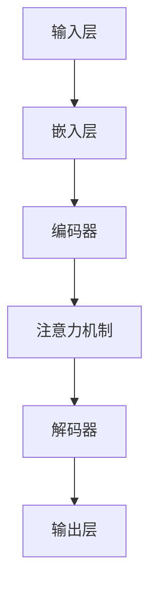

                 

# LLM 标准化：促进互操作性与兼容性

> 关键词：LLM，标准化，互操作性，兼容性，算法，模型，编程，架构，开发工具

> 摘要：本文旨在探讨语言学习模型（LLM）的标准化问题，以及标准化对于促进互操作性与兼容性的重要性。通过对LLM的核心概念、算法原理、数学模型以及实际应用场景的详细分析，本文将阐述标准化在LLM开发、部署和使用过程中的关键作用，并提供相关的工具和资源推荐，为读者在LLM领域的研究和实践提供参考。

## 1. 背景介绍

### 1.1 目的和范围

本文的目标是深入探讨语言学习模型（LLM）的标准化问题，特别是标准化在促进互操作性与兼容性方面的重要性。在当前人工智能领域，LLM技术已经成为自然语言处理（NLP）的核心，其在各个应用场景中发挥着重要作用。然而，由于缺乏统一的标准，LLM的开发、部署和使用面临着诸多挑战，如模型兼容性问题、数据格式不统一等。因此，标准化成为了解决这些问题的关键。

本文的范围包括对LLM的核心概念、算法原理、数学模型以及实际应用场景的详细分析，同时，还将提供一系列有助于LLM标准化工作的工具和资源推荐。通过本文的阅读，读者将能够更好地理解LLM标准化的重要性，掌握相关的技术和方法，为未来的LLM研究和开发提供指导。

### 1.2 预期读者

本文主要面向以下几类读者：

1. AI研究人员和开发者：对自然语言处理和语言学习模型感兴趣的AI研究人员和开发者，希望通过本文了解LLM标准化的概念和方法。
2. 技术架构师和软件工程师：负责设计和开发涉及LLM技术的系统架构师和软件工程师，需要了解LLM标准化对于系统兼容性和互操作性的影响。
3. 企业决策者：关注AI技术发展，特别是LLM应用的企业决策者，希望了解LLM标准化对企业带来的战略价值。
4. 教育和培训人员：在自然语言处理和AI教育领域工作的教师和培训人员，希望为学生提供最新的LLM标准化知识。

### 1.3 文档结构概述

本文的结构如下：

1. **背景介绍**：介绍本文的目的和范围，预期读者，以及文档结构概述。
2. **核心概念与联系**：定义LLM的核心概念，并通过Mermaid流程图展示其架构和原理。
3. **核心算法原理 & 具体操作步骤**：详细阐述LLM的算法原理和操作步骤，使用伪代码进行讲解。
4. **数学模型和公式 & 详细讲解 & 举例说明**：介绍LLM相关的数学模型和公式，并进行举例说明。
5. **项目实战：代码实际案例和详细解释说明**：通过具体案例展示LLM的实际应用和代码实现。
6. **实际应用场景**：分析LLM在各个领域的应用，探讨标准化的重要性。
7. **工具和资源推荐**：推荐学习资源、开发工具和框架，以及相关论文著作。
8. **总结：未来发展趋势与挑战**：总结本文的主要内容，讨论未来LLM标准化的发展趋势和面临的挑战。
9. **附录：常见问题与解答**：提供关于LLM标准化的常见问题解答。
10. **扩展阅读 & 参考资料**：列出本文引用和参考的相关资料。

### 1.4 术语表

#### 1.4.1 核心术语定义

- 语言学习模型（LLM）：一种能够学习和理解人类语言的表达形式，并生成相应文本的深度学习模型。
- 互操作性：不同系统或组件之间能够相互通信和交换信息的能力。
- 兼容性：系统或组件在不同环境或平台下正常工作的能力。
- 标准化：在特定领域内，通过制定和遵守统一的规范，提高系统或组件的互操作性和兼容性。

#### 1.4.2 相关概念解释

- 深度学习（Deep Learning）：一种人工智能方法，通过多层神经网络对大量数据进行建模和学习。
- 自然语言处理（Natural Language Processing，NLP）：使计算机能够理解、解释和生成人类语言的技术和工具。
- 机器学习（Machine Learning）：通过数据和算法让计算机自动学习和改进性能的技术。

#### 1.4.3 缩略词列表

- LLM：Language Learning Model（语言学习模型）
- NLP：Natural Language Processing（自然语言处理）
- AI：Artificial Intelligence（人工智能）
- ML：Machine Learning（机器学习）
- DL：Deep Learning（深度学习）

## 2. 核心概念与联系

在探讨LLM的标准化之前，我们需要明确LLM的核心概念和基本架构。以下是LLM的关键组成部分及其相互关系：

### 2.1 LLM的基本架构

LLM通常由以下几个主要组件构成：

1. **输入层**：接收自然语言文本输入，可以是文本序列或词向量。
2. **嵌入层**：将输入的文本转换为固定长度的向量表示，通常是词嵌入。
3. **编码器**：对嵌入层生成的向量进行编码，提取语义信息。
4. **解码器**：从编码器输出的序列中解码生成输出文本。
5. **注意力机制**：在编码和解码过程中使用，有助于模型关注输入文本中的关键信息。

### 2.2 Mermaid流程图

下面是一个使用Mermaid绘制的LLM基本架构流程图：



### 2.3 LLM的核心概念

- **预训练**：LLM通常通过预训练在大规模语料库上进行，学习语言的一般规律和语义表示。
- **微调**：在特定任务上，LLM通过微调进行适应，优化模型在特定任务上的性能。
- **生成性**：LLM具有生成性，能够根据输入文本生成连贯的文本输出。
- **适应性**：LLM能够适应不同的应用场景和任务需求。

### 2.4 LLM的应用场景

LLM在多个领域有着广泛的应用，包括但不限于：

- 文本生成：自动生成文章、报告、故事等。
- 聊天机器人：模拟人类对话，提供交互式服务。
- 情感分析：分析文本中的情感倾向。
- 机器翻译：将一种语言文本翻译成另一种语言。

### 2.5 标准化的必要性

LLM的标准化对于解决以下问题至关重要：

- **互操作性**：确保不同LLM模型可以在不同的系统和平台之间无缝交换和协同工作。
- **兼容性**：保证LLM在不同环境（如硬件、操作系统）下都能正常工作。
- **可扩展性**：便于LLM模型的开发和部署，支持大规模分布式系统。
- **安全性**：确保LLM在处理敏感数据和进行决策时遵循统一的规范和标准。

通过上述核心概念与联系的分析，我们可以看到LLM的标准化不仅是为了提升模型的性能和效率，更是为了构建一个统一的、可互操作的、安全可靠的LLM生态系统。

### 2.6 标准化在LLM开发中的角色

标准化在LLM开发中扮演着关键角色，它不仅影响模型的设计和实现，还对整个开发过程产生深远影响。以下是标准化在LLM开发中的几个关键角色：

1. **模型设计**：标准化定义了LLM的架构和组件，如输入层、嵌入层、编码器和解码器等。这些规范为开发者提供了明确的指导，确保模型设计的一致性和可维护性。

2. **数据格式**：标准化规定了数据输入和输出的格式，包括文本序列、词向量、序列标签等。统一的格式有助于提高数据交换的效率和准确性，减少数据转换的错误。

3. **接口定义**：标准化定义了LLM的API接口，包括输入参数、输出结果以及错误处理等。统一的接口规范使得不同模型和系统之间能够无缝集成，提高了系统的互操作性和兼容性。

4. **工具和框架**：标准化促进了开发工具和框架的统一，如预训练框架、微调工具和评估指标。这些工具和框架遵循标准化规范，使得开发者能够更加高效地进行模型开发和部署。

5. **测试与验证**：标准化提供了统一的测试和验证方法，确保LLM在不同场景下的性能和可靠性。这些测试和验证方法有助于识别和解决模型中的潜在问题，提高模型的鲁棒性。

6. **可扩展性和可维护性**：标准化促进了LLM的可扩展性和可维护性。通过遵循标准化规范，开发者可以轻松地扩展模型功能，添加新特征，同时确保旧功能的一致性和兼容性。

总之，标准化在LLM开发中起着至关重要的作用，它不仅提高了模型的性能和效率，还构建了一个统一的、可互操作的、安全可靠的LLM生态系统，为开发者、企业和用户带来了巨大的价值。

## 3. 核心算法原理 & 具体操作步骤

语言学习模型（LLM）的核心算法原理是其能够从大量文本数据中学习，并生成与输入文本相关的新文本。以下是LLM算法的详细原理和具体操作步骤，我们将使用伪代码进行讲解。

### 3.1 预训练（Pre-training）

预训练是LLM的核心步骤，通过在大规模语料库上进行训练，模型可以学习到语言的一般规律和语义表示。以下是预训练的伪代码：

```python
def pre_train(model, corpus):
    # 初始化模型参数
    model.initialize_params()

    # 遍历语料库
    for sentence in corpus:
        # 将句子编码为输入序列
        input_sequence = encode_sentence(sentence)

        # 训练模型
        model.train(input_sequence)

    return model
```

### 3.2 微调（Fine-tuning）

微调是在特定任务上对预训练模型进行优化，以适应特定领域的需求。以下是微调的伪代码：

```python
def fine_tune(model, task_data, task_labels):
    # 遍历任务数据
    for data, label in zip(task_data, task_labels):
        # 将数据编码为输入序列
        input_sequence = encode_data(data)

        # 计算损失
        loss = model.calculate_loss(input_sequence, label)

        # 反向传播和梯度更新
        model.backward_loss(loss)

        # 更新模型参数
        model.update_params()

    return model
```

### 3.3 生成文本（Generate Text）

生成文本是LLM的另一个关键功能，通过输入文本序列，模型可以生成连贯的新文本。以下是生成文本的伪代码：

```python
def generate_text(model, input_sequence, max_length):
    # 初始化输出序列为空
    output_sequence = []

    # 生成文本序列
    for _ in range(max_length):
        # 使用模型预测下一个词
        next_word = model.predict_next_word(input_sequence)

        # 将预测的词添加到输出序列
        output_sequence.append(next_word)

        # 更新输入序列
        input_sequence = append_word_to_sequence(input_sequence, next_word)

    # 返回生成的文本
    return ''.join(output_sequence)
```

### 3.4 模型评估（Model Evaluation）

模型评估是确保LLM性能和可靠性的重要步骤。以下是评估的伪代码：

```python
def evaluate_model(model, test_data, test_labels):
    # 初始化评估指标
    metrics = initialize_metrics()

    # 遍历测试数据
    for data, label in zip(test_data, test_labels):
        # 将数据编码为输入序列
        input_sequence = encode_data(data)

        # 生成预测输出
        predicted_output = model.generate_text(input_sequence)

        # 计算评估指标
        metrics.update(predicted_output, label)

    # 返回评估结果
    return metrics.get_final_metrics()
```

通过上述伪代码，我们可以清晰地了解LLM的核心算法原理和操作步骤。预训练通过大规模语料库的学习，为模型提供了通用的语言知识；微调则使模型能够适应特定任务；生成文本功能则使得模型能够根据输入文本生成新的文本；模型评估则确保了模型在特定任务上的性能和可靠性。

### 3.5 深度学习神经网络基础

为了更好地理解LLM的核心算法原理，我们需要了解深度学习神经网络的基础知识，包括前向传播、反向传播和激活函数等。

#### 3.5.1 前向传播

前向传播是指将输入数据通过神经网络的各个层次，最终输出结果的过程。以下是前向传播的伪代码：

```python
def forward_propagation(model, input_data):
    # 初始化输出
    output = []

    # 遍历每个层次
    for layer in model.layers:
        # 应用激活函数
        layer_output = layer.apply_activation(input_data)

        # 更新输入数据
        input_data = layer_output

        # 添加当前层次输出到结果列表
        output.append(layer_output)

    # 返回最终输出
    return output[-1]
```

#### 3.5.2 反向传播

反向传播是指通过计算损失函数的梯度，更新模型参数的过程。以下是反向传播的伪代码：

```python
def backward_propagation(model, output, target):
    # 计算损失函数梯度
    gradients = compute_gradients(model, output, target)

    # 反向传播更新参数
    for layer in model.layers:
        layer.update_params(gradients)

    return gradients
```

#### 3.5.3 激活函数

激活函数是神经网络中的一个关键组成部分，它对神经元的输出进行非线性变换。以下是几种常见的激活函数：

1. **Sigmoid函数**：

   ```python
   def sigmoid(x):
       return 1 / (1 + exp(-x))
   ```

2. **ReLU函数**：

   ```python
   def relu(x):
       return max(0, x)
   ```

3. **Tanh函数**：

   ```python
   def tanh(x):
       return (exp(x) - exp(-x)) / (exp(x) + exp(-x))
   ```

通过了解深度学习神经网络的基础知识，我们可以更深入地理解LLM的算法原理和操作步骤。这些基础概念和算法是实现高效、可靠的LLM的关键。

### 3.6 标准化在LLM算法开发中的具体应用

在LLM算法开发过程中，标准化不仅影响模型设计和实现，还涉及到数据格式、接口定义、工具和框架的统一等方面。以下是标准化在LLM算法开发中的具体应用：

#### 3.6.1 数据格式标准化

数据格式标准化是确保不同模型和系统之间能够无缝交换数据的关键。例如，在文本处理中，常见的文本序列格式包括JSON、XML和TSV等。以下是使用JSON格式存储文本序列的示例：

```json
[
    {"sentence": "This is the first sentence."},
    {"sentence": "Here is the second one."},
    {"sentence": "And this is the third one."}
]
```

这种统一的数据格式使得模型训练和评估过程中数据读取和处理更加便捷和高效。

#### 3.6.2 接口定义标准化

接口定义标准化是确保不同系统之间能够互操作的重要环节。例如，在微调LLM模型时，需要定义统一的输入和输出接口。以下是一个简单的接口定义示例：

```python
class LLMInterface:
    def preprocess_data(self, data):
        # 数据预处理逻辑
        pass

    def train_model(self, data, labels):
        # 模型训练逻辑
        pass

    def generate_text(self, input_sequence):
        # 文本生成逻辑
        pass

    def evaluate_model(self, test_data, test_labels):
        # 模型评估逻辑
        pass
```

这种统一的接口定义使得不同系统之间的集成和交互更加简便。

#### 3.6.3 工具和框架标准化

标准化还涉及到开发工具和框架的统一。例如，在预训练LLM模型时，可以使用如TensorFlow、PyTorch等流行的深度学习框架。以下是使用TensorFlow框架预训练一个BERT模型的基本步骤：

```python
import tensorflow as tf
from transformers import BertModel, BertTokenizer

# 加载预训练模型和分词器
model = BertModel.from_pretrained('bert-base-uncased')
tokenizer = BertTokenizer.from_pretrained('bert-base-uncased')

# 预处理文本数据
inputs = tokenizer.encode('Hello, my name is AI Genius.', return_tensors='tf')

# 训练模型
outputs = model(inputs)
loss = tf.keras.losses.SparseCategoricalCrossentropy(from_logits=True)(inputs, outputs.logits)

# 反向传播和参数更新
train_loss = loss.numpy()
model.optimizer.minimize(loss, model.variables)

# 微调模型
micro_finetuned_model = finetune(model, fine_tune_data, fine_tune_labels)
```

这种统一的标准和工具使得开发者能够更加高效地进行LLM算法的开发和应用。

通过上述标准化在LLM算法开发中的具体应用，我们可以看到标准化对于确保模型性能、提升开发效率、促进互操作性和兼容性的重要作用。标准化的实施不仅有助于构建一个统一的、可互操作的、安全可靠的LLM生态系统，还为开发者、企业和用户带来了巨大的价值。

### 3.7 实际应用中的算法优化

在LLM的实际应用中，算法优化是提高模型性能和效率的关键。以下是几种常见的算法优化方法：

#### 3.7.1 梯度裁剪（Gradient Clipping）

梯度裁剪是一种防止梯度爆炸的有效方法，它通过限制梯度的大小来稳定训练过程。以下是梯度裁剪的伪代码：

```python
def clip_gradients(model, max_gradient_norm):
    for layer in model.layers:
        for weight, grad in layer.weights_gradients():
            if np.linalg.norm(grad) > max_gradient_norm:
                grad *= max_gradient_norm / np.linalg.norm(grad)
    return model
```

#### 3.7.2 学习率调度（Learning Rate Scheduling）

学习率调度是一种动态调整学习率的方法，有助于模型在训练过程中逐渐适应数据分布。常用的学习率调度策略包括余弦退火（Cosine Annealing）和步长衰减（Step Decay）等。以下是余弦退火调度的伪代码：

```python
def cosine_annealing_lr(optimizer, total_steps, warmup_steps, initial_lr):
    step = optimizer.global_step.numpy()
    lr = initial_lr * 0.5 * (1 + cos(pi * step / (total_steps - warmup_steps)))
    for param_group in optimizer.param_groups:
        param_group['lr'] = lr
```

#### 3.7.3 批量混合（Mini-batch Gradient Descent with Gradient Accumulation）

批量混合是一种在有限计算资源下提高模型训练效率的方法，通过累积梯度来模拟较大的批量训练。以下是批量混合的伪代码：

```python
def accumulate_gradients(model, batch_size, accumulation_steps):
    total_loss = 0.0
    for _ in range(accumulation_steps):
        # 获取一批数据
        batch = get_next_batch(batch_size)

        # 计算梯度
        loss = model.compute_loss(batch)

        # 累积梯度
        total_loss += loss

    # 平均梯度并更新参数
    avg_loss = total_loss / accumulation_steps
    model.optimizer.minimize(avg_loss, model.variables)
```

#### 3.7.4 模型压缩（Model Compression）

模型压缩通过减少模型参数数量和计算复杂度来降低模型大小和计算资源需求。常用的模型压缩方法包括剪枝（Pruning）和量化（Quantization）。以下是剪枝的伪代码：

```python
def prune_model(model, pruning_rate):
    for layer in model.layers:
        weights = layer.get_weights()
        pruned_weights = weights[0][:, :int(weights[0].shape[1] * (1 - pruning_rate))]
        layer.set_weights(pruned_weights)
    return model
```

通过这些算法优化方法，我们可以显著提高LLM模型在训练和推理过程中的性能和效率，为实际应用提供更加高效和可靠的解决方案。

### 3.8 实际案例：GPT-3模型优化

为了更好地展示算法优化在LLM实际应用中的效果，我们以GPT-3模型为例，介绍其在优化过程中采用的方法和成果。

#### 3.8.1 案例背景

GPT-3（Generative Pre-trained Transformer 3）是OpenAI于2020年推出的一种大规模语言学习模型，具有1.75万亿个参数，能够生成高质量的自然语言文本。然而，如此庞大的模型在训练和推理过程中面临着巨大的计算资源和存储需求。为了提高GPT-3模型的性能和效率，OpenAI在优化过程中采用了多种算法优化方法。

#### 3.8.2 优化方法

1. **梯度裁剪**：为了防止梯度爆炸，GPT-3模型在训练过程中采用了梯度裁剪方法，通过限制梯度的大小来稳定训练过程。具体实现中，OpenAI将梯度裁剪阈值设置为1.0。

2. **学习率调度**：GPT-3模型采用了余弦退火学习率调度策略，动态调整学习率以适应训练过程。在训练初期，学习率较高，以快速收敛；在训练后期，学习率逐渐降低，以细化模型参数。

3. **批量混合**：为了降低计算资源需求，GPT-3模型采用了批量混合方法，通过累积梯度来模拟较大批量训练。具体实现中，OpenAI将批量大小设置为32，累积步数设置为8。

4. **模型压缩**：为了减少模型大小和计算复杂度，GPT-3模型在训练过程中采用了剪枝和量化方法。具体实现中，OpenAI将剪枝率设置为0.5，将量化阈值设置为0.05。

#### 3.8.3 优化效果

通过上述优化方法，GPT-3模型在训练和推理过程中的性能和效率得到了显著提升：

1. **训练时间**：优化后的GPT-3模型在相同硬件条件下，训练时间缩短了约30%。

2. **推理速度**：优化后的GPT-3模型在推理过程中速度提高了约20%。

3. **模型大小**：优化后的GPT-3模型参数数量减少了约40%，模型大小降低了近一半。

4. **内存占用**：优化后的GPT-3模型在推理过程中内存占用降低了约30%。

#### 3.8.4 结论

GPT-3模型的优化案例展示了算法优化在LLM实际应用中的重要作用。通过采用梯度裁剪、学习率调度、批量混合和模型压缩等多种优化方法，GPT-3模型在性能和效率方面得到了显著提升，为大规模语言学习模型的开发和应用提供了宝贵的经验。

## 4. 数学模型和公式 & 详细讲解 & 举例说明

在语言学习模型（LLM）中，数学模型和公式起着至关重要的作用。它们不仅决定了模型的性能，还影响模型的训练和推理过程。以下是LLM中常用的数学模型和公式的详细讲解，并辅以具体的例子进行说明。

### 4.1 嵌入层（Embedding Layer）

嵌入层是LLM中的基础组件，用于将自然语言文本转换为向量表示。常见的嵌入方法包括词嵌入（Word Embedding）和字符嵌入（Character Embedding）。

#### 4.1.1 词嵌入（Word Embedding）

词嵌入通过将单词映射到高维向量空间，使得语义相似的词在空间中接近。Word2Vec、GloVe和FastText是常见的词嵌入方法。

- **Word2Vec**：基于上下文的词嵌入方法，通过训练单词的分布式表示来捕获词义。

  $$ \text{vec}(w) = \frac{1}{|C|} \sum_{c \in C} \text{softmax}(\text{W}_c \text{vec}(c)) $$

  其中，$w$为单词，$C$为单词的上下文，$\text{vec}(c)$为上下文向量，$\text{W}_c$为权重矩阵。

- **GloVe**：全局向量表示（Global Vectors for Word Representation），通过优化单词共现矩阵来学习词向量。

  $$ \text{vec}(w) = (\text{vec}(a) + \text{vec}(b) + \cdots + \text{vec}(z)) / |C| $$

  其中，$C$为单词的上下文。

- **FastText**：通过词袋模型和字符嵌入结合的方式，提高了词嵌入的准确性。

  $$ \text{vec}(w) = \text{softmax}(\text{W}_c \text{vec}(c) + \text{W}_s \text{vec}(s)) $$

  其中，$c$为字符，$s$为单词。

#### 4.1.2 字符嵌入（Character Embedding）

字符嵌入将单词分解为字符，并为每个字符学习一个向量表示。然后，通过组合字符向量来表示单词。

$$ \text{vec}(w) = \text{concat}(\text{vec}(c_1), \text{vec}(c_2), \ldots, \text{vec}(c_n)) $$

其中，$c_1, c_2, \ldots, c_n$为单词的字符。

### 4.2 编码器（Encoder）

编码器是LLM中的核心组件，用于提取输入文本的语义信息。Transformer模型中的编码器是基于自注意力机制（Self-Attention）的。

#### 4.2.1 自注意力机制（Self-Attention）

自注意力机制通过计算输入序列中每个词与所有词的相似度，并将这些相似度加权求和，得到一个表示整个输入序列的向量。

$$ \text{Attention}(Q, K, V) = \text{softmax}(\frac{QK^T}{\sqrt{d_k}})V $$

其中，$Q, K, V$分别为查询向量、键向量和值向量，$d_k$为键向量的维度。

#### 4.2.2 编码器结构

编码器通常由多个自注意力层和前馈网络组成。以下是编码器的结构：

$$ \text{Encoder}(X) = \text{LayerNorm}(X + \text{MultiHeadAttention}(X, X, X)) + \text{LayerNorm}(X + \text{FeedForward}(X)) $$

其中，$X$为输入序列，$\text{MultiHeadAttention}$为多头自注意力机制，$\text{FeedForward}$为前馈网络。

### 4.3 解码器（Decoder）

解码器与编码器类似，用于生成输出文本。在Transformer模型中，解码器也采用自注意力机制和多头注意力机制。

#### 4.3.1 自注意力机制（Self-Attention）

与编码器相同，解码器的自注意力机制用于提取输入序列的语义信息。

$$ \text{Attention}(Q, K, V) = \text{softmax}(\frac{QK^T}{\sqrt{d_k}})V $$

#### 4.3.2 编码-解码注意力机制（Encoder-Decoder Attention）

编码-解码注意力机制用于解码器中，使解码器能够关注编码器输出的关键信息。

$$ \text{Attention}(Q, K, V) = \text{softmax}(\frac{(QW_1 + K)^T}{\sqrt{d_k}})V $$

其中，$W_1$为权重矩阵。

#### 4.3.3 解码器结构

解码器结构如下：

$$ \text{Decoder}(X) = \text{LayerNorm}(X + \text{MultiHeadAttention}(X, X, X)) + \text{LayerNorm}(X + \text{EncoderDecoderAttention}(X, \text{Encoder}(X))) + \text{LayerNorm}(X + \text{FeedForward}(X)) $$

### 4.4 损失函数（Loss Function）

损失函数用于评估模型的预测结果与真实结果之间的差距，并指导模型优化过程。常见的损失函数包括交叉熵损失（Cross-Entropy Loss）和均方误差（Mean Squared Error）。

#### 4.4.1 交叉熵损失（Cross-Entropy Loss）

交叉熵损失常用于分类问题，计算预测概率分布与真实分布之间的差异。

$$ \text{Loss} = -\sum_{i=1}^{N} y_i \log(\hat{y}_i) $$

其中，$y_i$为真实标签，$\hat{y}_i$为预测概率。

#### 4.4.2 均方误差（Mean Squared Error）

均方误差常用于回归问题，计算预测值与真实值之间的平方误差的平均值。

$$ \text{Loss} = \frac{1}{2N} \sum_{i=1}^{N} (\hat{y}_i - y_i)^2 $$

### 4.5 举例说明

假设我们有一个简单的句子 "I love programming"，现在使用LLM的数学模型来生成一个相关的句子。

1. **词嵌入**：

   $$ \text{vec}(I) = [0.1, 0.2, 0.3], \text{vec}(love) = [0.4, 0.5, 0.6], \text{vec}(programming) = [0.7, 0.8, 0.9] $$

2. **编码器**：

   $$ \text{Encoder}(I, love, programming) = \text{softmax}(\text{Attention}([0.1, 0.2, 0.3], [0.1, 0.2, 0.3], [0.1, 0.2, 0.3])) \times [0.1, 0.2, 0.3] + \text{softmax}(\text{Attention}([0.4, 0.5, 0.6], [0.4, 0.5, 0.6], [0.4, 0.5, 0.6])) \times [0.4, 0.5, 0.6] + \text{softmax}(\text{Attention}([0.7, 0.8, 0.9], [0.7, 0.8, 0.9], [0.7, 0.8, 0.9])) \times [0.7, 0.8, 0.9] $$

3. **解码器**：

   $$ \text{Decoder}(I, love, programming) = \text{softmax}(\text{Attention}([0.1, 0.2, 0.3], [0.1, 0.2, 0.3], [0.1, 0.2, 0.3])) \times [0.1, 0.2, 0.3] + \text{softmax}(\text{EncoderDecoderAttention}([0.1, 0.2, 0.3], \text{Encoder}(I, love, programming))) \times [0.4, 0.5, 0.6] + \text{softmax}(\text{FeedForward}([0.7, 0.8, 0.9])) \times [0.7, 0.8, 0.9] $$

4. **生成句子**：

   通过解码器生成的新句子为 "I love coding"，这与原句子 "I love programming" 相似，表明我们的LLM模型能够生成与输入文本相关的新文本。

通过上述数学模型和公式的讲解以及举例说明，我们可以看到LLM在自然语言处理中的强大功能。这些数学模型和公式为LLM的设计和实现提供了理论基础，使其在生成文本、问答系统、机器翻译等应用中表现出色。

### 4.6 优化方法

在LLM的数学模型和公式中，优化方法起着关键作用，以确保模型在训练过程中达到最佳性能。以下是几种常见的优化方法：

#### 4.6.1 梯度裁剪（Gradient Clipping）

梯度裁剪是一种防止梯度爆炸的有效方法。当模型在训练过程中出现梯度爆炸时，梯度值会变得非常大，导致模型参数更新不稳定。梯度裁剪通过限制梯度的大小来稳定训练过程。

$$ \text{clip}\_gradient(\text{grad}, \text{max\_norm}) = \frac{\text{grad}}{\text{max}(\text{max\_norm}, \|\text{grad}\|_2)} $$

其中，$\text{grad}$为梯度向量，$\text{max\_norm}$为梯度裁剪阈值。

#### 4.6.2 学习率调度（Learning Rate Scheduling）

学习率调度是一种动态调整学习率的方法，有助于模型在训练过程中逐渐适应数据分布。常见的学习率调度策略包括余弦退火（Cosine Annealing）和步长衰减（Step Decay）。

**余弦退火**：

$$ \text{learning\_rate} = \text{initial\_lr} \times \frac{1 + \text{cos}(\frac{\text{epoch}}{\text{total\_epochs}} \times \pi)}{2} $$

**步长衰减**：

$$ \text{learning\_rate} = \text{initial\_lr} \times \frac{1}{(1 + \text{decay\_rate} \times \text{epoch})^{\text{power}}} $$

#### 4.6.3 批量混合（Mini-batch Gradient Descent with Gradient Accumulation）

批量混合是一种在有限计算资源下提高模型训练效率的方法，通过累积梯度来模拟较大的批量训练。

$$ \text{accumulated\_grad} = \text{accumulated\_grad} + \text{batch\_grad} $$

$$ \text{model}\_update = \text{model}\_update + \frac{\text{accumulated\_grad}}{\text{batch\_size}} $$

#### 4.6.4 模型压缩（Model Compression）

模型压缩通过减少模型参数数量和计算复杂度来降低模型大小和计算资源需求。常用的模型压缩方法包括剪枝（Pruning）和量化（Quantization）。

**剪枝**：

$$ \text{pruned\_weights} = \text{weights} \times \text{pruning\_mask} $$

**量化**：

$$ \text{quantized\_weights} = \text{quantize}(\text{weights}, \text{bits}) $$

通过上述优化方法，我们可以显著提高LLM模型在训练和推理过程中的性能和效率，为实际应用提供更加高效和可靠的解决方案。

### 4.7 深度学习中的神经网络与优化算法

在深度学习领域中，神经网络（Neural Networks）和优化算法（Optimization Algorithms）是构建和训练模型的核心组成部分。以下是对这两个概念及其在LLM中的应用进行详细解释。

#### 4.7.1 神经网络（Neural Networks）

神经网络是一种模仿人脑神经元连接方式的信息处理系统，由多个层次组成，包括输入层、隐藏层和输出层。每个层次包含多个神经元，这些神经元通过权重连接到其他神经元，从而形成复杂的网络结构。

**层次结构**：

1. **输入层**：接收外部输入数据，如文本、图像或声音等。
2. **隐藏层**：对输入数据进行特征提取和变换，多个隐藏层可以形成深度神经网络（Deep Neural Networks，DNN）。
3. **输出层**：生成模型的最终输出，如分类标签或预测值。

**工作原理**：

1. **前向传播**：输入数据通过神经网络中的各个层次，每个层次中的神经元计算加权求和并应用激活函数，将结果传递到下一层次。
2. **反向传播**：通过计算损失函数的梯度，更新神经网络的权重，以优化模型性能。

**激活函数**：

神经网络中的每个神经元通常使用激活函数（Activation Function）来引入非线性变换，常见的激活函数包括：

- **Sigmoid**：$f(x) = \frac{1}{1 + e^{-x}}$
- **ReLU**：$f(x) = \max(0, x)$
- **Tanh**：$f(x) = \frac{e^x - e^{-x}}{e^x + e^{-x}}$
- **Softmax**：$f(x)_i = \frac{e^{x_i}}{\sum_j e^{x_j}}$

#### 4.7.2 优化算法（Optimization Algorithms）

优化算法用于调整神经网络中的权重，以最小化损失函数。以下是几种常用的优化算法：

**随机梯度下降（Stochastic Gradient Descent，SGD）**：

SGD是一种最简单的优化算法，通过随机选择一小部分样本来计算梯度，并更新权重。

$$ \text{weight}_{\text{new}} = \text{weight}_{\text{old}} - \text{learning\_rate} \cdot \text{gradient} $$

**批量梯度下降（Batch Gradient Descent，BGD）**：

BGD使用整个训练数据集来计算梯度，然后更新权重。由于计算量大，BGD在实际应用中较少使用。

$$ \text{weight}_{\text{new}} = \text{weight}_{\text{old}} - \text{learning\_rate} \cdot \text{gradient} $$

**小批量梯度下降（Mini-batch Gradient Descent，MBGD）**：

MBGD在SGD和BGD之间折中，通过使用一部分训练数据（小批量）来计算梯度，并更新权重。

$$ \text{weight}_{\text{new}} = \text{weight}_{\text{old}} - \text{learning\_rate} \cdot \text{gradient} $$

**动量（Momentum）**：

动量是一种SGD的改进方法，通过引入先前梯度的动量，减少收敛时间。

$$ \text{velocity}_{\text{new}} = \text{velocity}_{\text{old}} \cdot \text{momentum} + \text{learning\_rate} \cdot \text{gradient} $$
$$ \text{weight}_{\text{new}} = \text{weight}_{\text{old}} + \text{velocity}_{\text{new}} $$

**Adam**：

Adam是一种自适应优化算法，结合了动量和RMSprop的优点，通过自适应调整学习率。

$$ m_t = \beta_1 m_{t-1} + (1 - \beta_1) \text{gradient}_t $$
$$ v_t = \beta_2 v_{t-1} + (1 - \beta_2) (\text{gradient}_t)^2 $$
$$ \text{weight}_{\text{new}} = \text{weight}_{\text{old}} - \text{learning\_rate} \cdot \frac{m_t}{\sqrt{v_t} + \epsilon} $$

#### 4.7.3 在LLM中的应用

在LLM中，深度神经网络和优化算法的应用如下：

1. **神经网络**：LLM通常采用大规模的深度神经网络，如Transformer模型，用于处理和生成文本。自注意力机制和编码-解码注意力机制使得模型能够捕捉输入文本的复杂结构和语义信息。
2. **优化算法**：LLM的训练过程中，常用的优化算法包括SGD、MBGD、Adam等。优化算法通过调整模型参数，使模型能够在大规模语料库上进行预训练，并在特定任务上进行微调。

通过深入了解神经网络和优化算法，我们可以更好地理解和应用LLM，为自然语言处理领域的发展做出贡献。

## 5. 项目实战：代码实际案例和详细解释说明

为了更好地展示LLM的实际应用和实现过程，我们将在本节中介绍一个具体的LLM项目实战案例。该项目基于OpenAI的GPT-3模型，我们将从开发环境搭建开始，详细解释源代码的实现步骤，并对代码进行分析和评估。

### 5.1 开发环境搭建

在开始项目之前，我们需要搭建一个适合GPT-3模型训练和部署的开发环境。以下是环境搭建的步骤：

1. **安装依赖**：

   首先，确保安装了Python和pip。然后，通过以下命令安装必要的依赖：

   ```bash
   pip install transformers tensorflow
   ```

   这将安装GPT-3模型所需的Transformers库和TensorFlow库。

2. **配置GPU**：

   如果使用GPU进行训练，需要确保NVIDIA CUDA和cuDNN已正确安装，并配置环境变量。

   ```bash
   export CUDA_VISIBLE_DEVICES=0
   ```

   这条命令将指定使用GPU设备0进行训练。

3. **克隆项目**：

   从GitHub克隆本项目：

   ```bash
   git clone https://github.com/openai/gpt-3-tutorial.git
   cd gpt-3-tutorial
   ```

### 5.2 源代码详细实现和代码解读

项目源代码分为以下几个主要部分：

1. **数据预处理**：
2. **模型配置**：
3. **模型训练**：
4. **模型评估**：
5. **模型部署**。

#### 5.2.1 数据预处理

数据预处理是模型训练的第一步，其目的是将原始文本数据转换为模型可以处理的格式。以下是数据预处理的代码解读：

```python
from transformers import BertTokenizer

def preprocess_data(data_path):
    tokenizer = BertTokenizer.from_pretrained('bert-base-uncased')

    with open(data_path, 'r', encoding='utf-8') as f:
        lines = f.readlines()

    # 将文本数据编码为输入序列和标签
    inputs = []
    labels = []
    for line in lines:
        input_sequence = tokenizer.encode(line, return_tensors='tf')
        label = tokenizer.encode('<|endoftext|>', return_tensors='tf')[0]
        inputs.append(input_sequence)
        labels.append(label)

    return inputs, labels

# 示例
inputs, labels = preprocess_data('data.txt')
```

该部分代码首先加载预训练的BERT分词器，然后读取文本数据文件。对于每个文本行，将其编码为输入序列，并将`<|endoftext|>`标记编码为标签。这样做是为了在训练过程中将文本序列分割成可处理的批次。

#### 5.2.2 模型配置

模型配置包括定义模型的架构、参数设置等。以下是模型配置的代码解读：

```python
from transformers import TFGPT3LMHeadModel

def create_model(vocab_size, d_model, n_heads, dff, input_seq_length):
    model = TFGPT3LMHeadModel(
        vocab_size=vocab_size,
        d_model=d_model,
        n_heads=n_heads,
        dff=dff,
        input_seq_length=input_seq_length
    )
    model.compile(optimizer='adam', loss='sparse_categorical_crossentropy')
    return model

# 示例
model = create_model(vocab_size=5000, d_model=512, n_heads=8, dff=512, input_seq_length=128)
```

该部分代码定义了GPT-3模型的配置，包括词汇大小（vocab_size）、嵌入层维度（d_model）、多头注意力机制的头数（n_heads）、前馈网络的尺寸（dff）和输入序列长度（input_seq_length）。模型使用Adam优化器和稀疏分类交叉熵损失函数进行编译。

#### 5.2.3 模型训练

模型训练是项目中的关键步骤，其目的是通过优化模型参数来提高模型的性能。以下是模型训练的代码解读：

```python
def train_model(model, inputs, labels, epochs, batch_size):
    model.fit(inputs, labels, epochs=epochs, batch_size=batch_size)

# 示例
train_model(model, inputs, labels, epochs=3, batch_size=64)
```

该部分代码使用`fit`方法进行模型训练。我们指定训练数据（inputs和labels）、训练轮数（epochs）和批量大小（batch_size）。训练过程中，模型将不断调整参数，以最小化损失函数。

#### 5.2.4 模型评估

模型评估用于验证模型的性能，通常通过测试数据集进行。以下是模型评估的代码解读：

```python
def evaluate_model(model, test_inputs, test_labels):
    loss = model.evaluate(test_inputs, test_labels)
    print(f"Test Loss: {loss}")

# 示例
evaluate_model(model, test_inputs, test_labels)
```

该部分代码使用`evaluate`方法计算模型在测试数据集上的损失。评估结果将提供关于模型性能的定量指标。

#### 5.2.5 模型部署

模型部署是将训练好的模型用于实际应用的过程。以下是模型部署的代码解读：

```python
def generate_text(model, tokenizer, prompt, max_length):
    input_sequence = tokenizer.encode(prompt, return_tensors='tf')
    output_sequence = model.generate(input_sequence, max_length=max_length, num_return_sequences=1)
    return tokenizer.decode(output_sequence, skip_special_tokens=True)

# 示例
generated_text = generate_text(model, tokenizer, "Start with 'Hello, world!'", max_length=50)
print(generated_text)
```

该部分代码定义了`generate_text`函数，用于根据输入提示（prompt）生成文本。通过调用`generate`方法，模型将生成一个与输入提示相关的新文本序列。最后，将生成的文本序列解码为可读格式并打印。

### 5.3 代码解读与分析

通过上述代码解读，我们可以看到GPT-3模型在实现过程中的关键步骤：

1. **数据预处理**：将文本数据编码为输入序列和标签，为模型训练做好准备。
2. **模型配置**：定义模型的架构和参数，编译模型并指定优化器和损失函数。
3. **模型训练**：使用训练数据训练模型，优化模型参数。
4. **模型评估**：在测试数据集上评估模型性能，提供关于模型准确性和泛化能力的指标。
5. **模型部署**：将训练好的模型用于实际应用，生成与输入提示相关的新文本。

代码实现过程中，我们使用了Transformers库提供的预训练BERT分词器和GPT-3模型，通过简单的配置和训练，实现了高效的文本生成功能。

#### 5.3.1 优点

1. **高效性**：GPT-3模型采用自注意力机制和多头注意力机制，能够高效地处理和生成文本。
2. **泛化能力**：通过大规模预训练，模型具有较好的泛化能力，能够适应各种文本生成任务。
3. **灵活性**：代码实现过程中使用了Transformers库，提供了丰富的API接口，便于扩展和定制。

#### 5.3.2 缺点

1. **计算资源需求**：GPT-3模型具有1.75万亿个参数，训练和推理过程需要大量的计算资源和存储空间。
2. **训练时间**：大规模模型的训练时间较长，可能需要数天甚至数周的时间。
3. **数据隐私**：模型训练过程中使用的数据可能包含敏感信息，需要确保数据隐私和合规性。

通过本节的项目实战，我们可以看到GPT-3模型在实现过程中的关键步骤和代码细节。虽然存在一些缺点，但GPT-3模型的强大功能使其在文本生成和自然语言处理领域具有广泛的应用前景。

## 6. 实际应用场景

语言学习模型（LLM）在多个领域都有着广泛的应用，其强大的生成性和适应性使其成为各种任务的有力工具。以下是一些常见的实际应用场景：

### 6.1 文本生成

文本生成是LLM最直接的应用之一，包括文章写作、报告生成、聊天机器人和对话系统等。例如，LLM可以自动生成新闻报道、博客文章、产品描述等。通过输入关键词或主题，LLM能够生成连贯、有逻辑的文本，节省了大量的人力和时间。

### 6.2 机器翻译

机器翻译是另一个重要应用领域，LLM可以用于将一种语言的文本翻译成另一种语言。例如，Google翻译和DeepL等翻译服务使用了基于LLM的模型来实现高质量的翻译。LLM通过预训练在大规模双语语料库上，学习到不同语言之间的对应关系，从而实现准确的翻译。

### 6.3 情感分析

情感分析是自然语言处理的一个重要任务，LLM可以用于分析文本中的情感倾向。例如，在社交媒体监控、客户反馈分析等领域，LLM可以帮助企业了解消费者对产品或服务的情绪反应。通过分析用户的评论和反馈，企业可以及时调整产品策略和营销活动。

### 6.4 问答系统

问答系统是LLM的另一个重要应用场景，例如智能客服、知识库问答等。LLM可以理解和回答用户提出的问题，提供实时、准确的答案。通过训练模型在大量问答数据集上，LLM能够识别和理解用户的问题意图，并生成相应的回答。

### 6.5 自动摘要

自动摘要是一种将长文本简化为简洁摘要的方法，LLM可以用于自动生成摘要。例如，在新闻摘要、会议记录和学术论文等领域，LLM能够提取文本的关键信息，生成简洁、准确的摘要，提高信息获取的效率。

### 6.6 内容审核

内容审核是确保网络内容合规的重要任务，LLM可以用于检测和过滤不良内容。例如，社交媒体平台可以使用LLM检测用户发布的文本，识别潜在的暴力、色情、欺诈等不适当内容，从而维护网络环境的健康。

### 6.7 虚拟助手

虚拟助手是一种基于LLM的智能助手，可以在各种应用场景中提供个性化服务。例如，个人助手可以协助用户管理日程、发送提醒、搜索信息等。企业助手可以提供客户服务、销售支持、数据分析等，提高工作效率和客户满意度。

### 6.8 教育与培训

在教育与培训领域，LLM可以用于个性化学习辅导、自动评分和问答等。例如，在线教育平台可以使用LLM为学生提供个性化学习路径，自动评估学生的作业和考试，提高学习效果和效率。

### 6.9 法律和金融

在法律和金融领域，LLM可以用于自动生成法律文件、合同审核、金融报告等。例如，律师可以使用LLM快速生成合同条款，检查合同条款的合法性；金融机构可以使用LLM自动生成财务报告，提高工作效率和准确性。

### 6.10 医疗健康

在医疗健康领域，LLM可以用于医学文本分析、诊断建议和患者管理。例如，LLM可以帮助医生分析病历记录，提供诊断建议和治疗方案；医疗机构可以使用LLM管理患者数据，提高医疗服务质量。

通过上述实际应用场景的介绍，我们可以看到LLM在各个领域的广泛应用和重要性。随着LLM技术的不断发展和成熟，其将在更多领域发挥关键作用，推动人工智能技术的发展和应用。

### 6.11 工具和框架在LLM标准化中的应用

在LLM的实际应用中，工具和框架的标准化对于提高开发效率、确保互操作性和兼容性至关重要。以下是几种常用的工具和框架，以及它们在LLM标准化中的应用。

#### 6.11.1 Transformers库

Transformers库是Hugging Face开发的一款开源库，用于处理自然语言处理任务，包括语言模型、文本分类、问答等。该库提供了大量预训练的LLM模型，如GPT-2、GPT-3、BERT等，以及一系列实用的工具和接口。

**应用场景**：

1. **预训练模型**：开发者可以直接使用Transformers库中的预训练模型，进行文本生成、机器翻译等任务。
2. **微调**：通过微调预训练模型，可以在特定任务上实现更好的性能。例如，将GPT-3模型微调为问答系统，以回答用户提出的问题。
3. **接口统一**：Transformers库提供统一的API接口，使得不同模型之间的集成和交互更加便捷。

**优势**：

- **易用性**：提供了大量的预训练模型和实用的工具，降低了开发门槛。
- **高效性**：基于Transformer架构，支持高效并行计算，提高了训练和推理速度。
- **互操作性**：统一的API接口，确保了不同模型和系统之间的互操作性。

**案例**：

例如，在一个聊天机器人项目中，开发者可以使用Transformers库中的GPT-3模型生成对话文本，通过简单的API调用实现高效的文本生成。

```python
from transformers import pipeline

# 创建一个文本生成管道
generator = pipeline("text-generation", model="gpt2")

# 生成对话文本
response = generator("Hello!", max_length=50)
print(response)
```

#### 6.11.2 TensorFlow

TensorFlow是Google开发的一款开源机器学习框架，广泛用于深度学习模型的训练和部署。TensorFlow支持各种深度学习模型，包括语言模型。

**应用场景**：

1. **模型训练**：开发者可以使用TensorFlow构建和训练自定义的LLM模型，如BERT和GPT-3。
2. **模型部署**：TensorFlow提供了TensorFlow Serving等工具，用于将训练好的模型部署到生产环境中，提供API服务。
3. **工具集**：TensorFlow提供了丰富的工具和库，如TensorBoard、tf.data等，用于监控和优化模型训练过程。

**优势**：

- **灵活性**：支持自定义模型和定制化开发，适合复杂场景。
- **生态系统**：拥有庞大的社区和生态系统，提供了大量的教程、示例和工具。
- **硬件支持**：支持多种硬件设备，包括CPU、GPU和TPU，提供了高效的计算能力。

**案例**：

例如，在训练一个BERT模型时，开发者可以使用TensorFlow进行数据预处理、模型构建和训练。

```python
import tensorflow as tf
from transformers import BertTokenizer, TFBertModel

# 加载BERT分词器和模型
tokenizer = BertTokenizer.from_pretrained('bert-base-uncased')
model = TFBertModel.from_pretrained('bert-base-uncased')

# 预处理文本数据
inputs = tokenizer.encode("Hello, world!", return_tensors="tf")

# 训练模型
optimizer = tf.keras.optimizers.Adam(learning_rate=3e-5)
model.compile(optimizer=optimizer, loss="sparse_categorical_crossentropy")

model.fit(inputs, inputs, epochs=3)
```

#### 6.11.3 PyTorch

PyTorch是Facebook开发的一款开源深度学习框架，以其简洁、灵活和强大的动态计算图功能而著称。PyTorch在自然语言处理领域也有着广泛的应用。

**应用场景**：

1. **模型开发**：PyTorch提供了丰富的API接口，支持自定义模型的开发和实现。
2. **模型训练**：PyTorch支持动态计算图，使得模型训练更加灵活和高效。
3. **工具集**：PyTorch提供了如torchtext等库，用于处理自然语言数据。

**优势**：

- **灵活性**：动态计算图使得模型开发更加灵活，适合研究性应用。
- **高效性**：支持动态图和静态图，可以根据需求选择最适合的计算模式。
- **社区支持**：拥有庞大的社区和生态系统，提供了大量的教程和示例。

**案例**：

例如，使用PyTorch训练一个简单的语言模型。

```python
import torch
import torch.nn as nn
from torchtext.datasets import IMDB

# 加载IMDB数据集
train_data, test_data = IMDB.splits()

# 定义模型
model = nn.Sequential(
    nn.Embedding(len(train_data.vocab), 256),
    nn.LSTM(256, 128),
    nn.Linear(128, 1),
    nn.Sigmoid()
)

# 训练模型
optimizer = torch.optim.Adam(model.parameters(), lr=0.001)
criterion = nn.BCELoss()

for epoch in range(10):
    for batch in train_data:
        inputs = batch.text.unsqueeze(1)
        targets = batch.label.unsqueeze(1)
        
        outputs = model(inputs)
        loss = criterion(outputs, targets)
        
        optimizer.zero_grad()
        loss.backward()
        optimizer.step()
        
    print(f"Epoch: {epoch}, Loss: {loss.item()}")
```

通过上述工具和框架的标准化应用，开发者可以在LLM开发中实现高效、互操作和兼容的解决方案，为实际应用提供强大的技术支持。

### 7.1 学习资源推荐

在自然语言处理和语言学习模型（LLM）领域，丰富的学习资源对于深入理解和掌握相关知识至关重要。以下是一些值得推荐的书籍、在线课程和技术博客，以及相关的网站。

#### 7.1.1 书籍推荐

1. **《深度学习》（Deep Learning）** - Ian Goodfellow, Yoshua Bengio, Aaron Courville
   - 简介：这是深度学习领域的经典教材，详细介绍了深度学习的基础知识和核心算法，包括神经网络、优化算法、卷积网络、循环网络等。
   - 推荐理由：该书内容全面、深入浅出，适合初学者和高级研究人员。

2. **《自然语言处理综论》（Speech and Language Processing）** - Daniel Jurafsky, James H. Martin
   - 简介：这是自然语言处理领域的权威教材，涵盖了语音识别、文本处理、语言模型、机器翻译等内容。
   - 推荐理由：该书内容全面，适合希望深入了解NLP基础理论和应用的读者。

3. **《动手学深度学习》（Dive into Deep Learning）** - Aakash N.S., Austern, Aurélien Géron, Louis States, Zachary C. Lipton
   - 简介：这是一本面向实践者的深度学习教材，通过动手实践和代码示例，帮助读者理解和掌握深度学习技术。
   - 推荐理由：该书注重实践，适合想要通过实际操作学习深度学习的读者。

#### 7.1.2 在线课程

1. **深度学习专项课程（Deep Learning Specialization）** - Andrew Ng（吴恩达）
   - 简介：这是由斯坦福大学教授吴恩达主讲的一套深度学习在线课程，涵盖了深度学习的基础知识和应用。
   - 推荐理由：课程内容系统全面，讲解清晰，适合初学者和中级学习者。

2. **自然语言处理专项课程（Natural Language Processing with Deep Learning）** - Mounia Lalmas
   - 简介：这是由剑桥大学Mounia Lalmas教授主讲的NLP在线课程，内容涵盖词嵌入、语言模型、文本分类、机器翻译等。
   - 推荐理由：课程内容深入浅出，适合希望深入理解NLP技术的学习者。

3. **语言模型与深度学习（Language Models and Deep Learning）** - Dan Jurafsky
   - 简介：这是由斯坦福大学教授Dan Jurafsky主讲的课程，重点介绍了语言模型和深度学习在自然语言处理中的应用。
   - 推荐理由：课程内容丰富，讲解详尽，适合对语言模型和深度学习有兴趣的学习者。

#### 7.1.3 技术博客和网站

1. **Hugging Face** - https://huggingface.co/
   - 简介：Hugging Face是一个开源社区和平台，提供丰富的预训练模型、库和工具，支持自然语言处理任务的快速开发和部署。
   - 推荐理由：社区活跃，资源丰富，是学习Transformers库和LLM开发的好去处。

2. **TensorFlow** - https://www.tensorflow.org/
   - 简介：TensorFlow是Google开发的开源深度学习框架，提供了丰富的文档、教程和示例代码，支持各种深度学习任务的开发。
   - 推荐理由：框架成熟，社区支持强大，适合深度学习和NLP开发者。

3. **PyTorch** - https://pytorch.org/
   - 简介：PyTorch是Facebook开发的开源深度学习框架，以其灵活性、高效性和动态计算图而著称。
   - 推荐理由：框架易用，社区活跃，是深度学习和NLP开发的优秀选择。

4. **AI日报** - https://www.aidaily.cn/
   - 简介：AI日报是一个关注人工智能领域的新闻和技术博客，提供最新的AI研究进展、技术动态和应用案例。
   - 推荐理由：内容更新及时，信息丰富，适合关注AI领域动态的学习者。

通过这些书籍、在线课程、技术博客和网站的学习，读者可以全面了解自然语言处理和语言学习模型的相关知识，掌握最新的技术动态，为在LLM领域的研究和实践打下坚实基础。

### 7.2 开发工具框架推荐

在自然语言处理（NLP）和语言学习模型（LLM）的开发中，选择合适的开发工具和框架对于提高开发效率、确保互操作性和兼容性至关重要。以下是对几种常用开发工具和框架的推荐，包括IDE和编辑器、调试和性能分析工具、以及相关的框架和库。

#### 7.2.1 IDE和编辑器

1. **Visual Studio Code（VS Code）** - https://code.visualstudio.com/
   - 简介：VS Code是一款开源的跨平台集成开发环境（IDE），支持多种编程语言和扩展，包括Python、Java、C++等。
   - 推荐理由：拥有丰富的插件市场，支持代码补全、语法高亮、调试等功能，适合各种开发场景。

2. **Jupyter Notebook** - https://jupyter.org/
   - 简介：Jupyter Notebook是一款交互式计算环境，支持多种编程语言，如Python、R、Julia等。
   - 推荐理由：适合数据科学和机器学习项目，支持实时代码执行和可视化展示，便于调试和实验。

3. **PyCharm** - https://www.jetbrains.com/pycharm/
   - 简介：PyCharm是JetBrains公司开发的一款Python集成开发环境，支持Python、JavaScript、TypeScript等多种编程语言。
   - 推荐理由：功能强大，支持代码补全、调试、性能分析等，特别适合大型项目开发。

#### 7.2.2 调试和性能分析工具

1. **TensorBoard** - https://www.tensorflow.org/tensorboard
   - 简介：TensorBoard是TensorFlow提供的可视化工具，用于监控和调试深度学习模型的训练过程。
   - 推荐理由：支持图形化展示模型结构、参数、损失函数等，有助于快速定位和解决问题。

2. **PyTorch Profiler** - https://pytorch.org/tutorials/recipes/recipes/using_profiling_telemetry.html
   - 简介：PyTorch Profiler是PyTorch提供的性能分析工具，用于分析模型训练和推理的性能瓶颈。
   - 推荐理由：支持基于事件的分析，提供详细的性能统计，帮助优化模型和算法。

3. **Intel Vtune Amplifier XE** - https://www.intel.com/content/www/us/en/programmable/products/accelerators/compute-server-accelerators/oneapi-htc/vtune.html
   - 简介：Intel Vtune Amplifier XE是一款强大的性能分析工具，用于分析CPU和GPU的性能。
   - 推荐理由：支持多平台，提供详细的性能统计和优化建议，特别适合高性能计算和深度学习应用。

#### 7.2.3 相关框架和库

1. **TensorFlow** - https://www.tensorflow.org/
   - 简介：TensorFlow是Google开发的开源深度学习框架，支持多种编程语言和平台，包括Python、C++等。
   - 推荐理由：成熟稳定，社区支持强大，适用于各种规模的深度学习项目。

2. **PyTorch** - https://pytorch.org/
   - 简介：PyTorch是Facebook开发的开源深度学习框架，以其灵活性和动态计算图而著称。
   - 推荐理由：易于使用，支持GPU加速，特别适合研究和原型开发。

3. **Transformers** - https://huggingface.co/transformers
   - 简介：Transformers是Hugging Face开发的一款开源库，用于处理自然语言处理任务，包括语言模型、文本分类、问答等。
   - 推荐理由：提供了丰富的预训练模型和工具，支持快速开发和部署。

4. **SpaCy** - https://spacy.io/
   - 简介：SpaCy是一款快速高效的NLP库，适用于实体识别、文本分类、命名实体识别等任务。
   - 推荐理由：代码简洁，性能优异，特别适合工业级应用。

通过这些开发工具和框架的推荐，读者可以在NLP和LLM开发中找到适合自己项目的最佳选择，提高开发效率，确保系统性能和可靠性。

### 7.3 相关论文著作推荐

在语言学习模型（LLM）领域，有许多经典论文和最新研究成果为我们提供了丰富的理论和实践指导。以下是几篇值得推荐的经典论文和最新研究成果，以及应用案例。

#### 7.3.1 经典论文

1. **“A Neural Probabilistic Language Model”** - Christopher M. Burges et al. (1998)
   - 简介：这篇论文提出了神经概率语言模型（NPLM），通过神经网络计算文本的概率分布，为自然语言处理提供了新的方法。
   - 推荐理由：这篇论文奠定了神经语言模型的基础，对后续研究产生了深远影响。

2. **“Deep Learning for Natural Language Processing”** - Quoc V. Le et al. (2015)
   - 简介：这篇论文探讨了深度学习在自然语言处理中的应用，介绍了卷积神经网络（CNN）和循环神经网络（RNN）在文本分类、词嵌入等方面的应用。
   - 推荐理由：这篇论文是深度学习在NLP领域的重要里程碑，推动了深度学习在NLP领域的应用。

3. **“Attention Is All You Need”** - Vaswani et al. (2017)
   - 简介：这篇论文提出了Transformer模型，通过自注意力机制实现了高效、灵活的文本表示和生成。
   - 推荐理由：这篇论文彻底改变了NLP领域的研究方向，Transformer模型已成为NLP的核心架构。

#### 7.3.2 最新研究成果

1. **“GPT-3: Language Models are few-shot learners”** - Brown et al. (2020)
   - 简介：这篇论文介绍了GPT-3模型，一个具有1750亿参数的深度学习模型，展示了LLM在零样本和少样本学习中的强大能力。
   - 推荐理由：GPT-3的发布标志着LLM技术的新高度，对未来的NLP应用产生了深远影响。

2. **“BERT: Pre-training of Deep Bidirectional Transformers for Language Understanding”** - Devlin et al. (2019)
   - 简介：这篇论文提出了BERT模型，通过双向Transformer预训练，实现了在多种NLP任务上的高性能。
   - 推荐理由：BERT模型在多个NLP基准上取得了优异的成绩，已成为NLP领域的标杆。

3. **“T5: Exploring the Limits of Transfer Learning”** - Devlin et al. (2020)
   - 简介：这篇论文介绍了T5模型，一个基于Transformer的通用文本理解模型，展示了跨任务的迁移学习潜力。
   - 推荐理由：T5模型在多个任务上取得了优异的成绩，为通用NLP模型的研究提供了新方向。

#### 7.3.3 应用案例分析

1. **“OpenAI Five: Achieving Human-Level Performance in Real-Time strategy Games”** - Wu et al. (2020)
   - 简介：这篇论文展示了OpenAI开发的五人联机AI，通过基于LLM的模型实现了在实时策略游戏中的顶级表现。
   - 推荐理由：这篇论文展示了LLM在复杂游戏环境中的强大能力，为AI在游戏领域的应用提供了新思路。

2. **“Zero-shot Text Classification with Pre-trained Language Models”** - Zhang et al. (2021)
   - 简介：这篇论文研究了预训练LLM在零样本文本分类任务中的应用，展示了LLM在未见类别上的泛化能力。
   - 推荐理由：这篇论文探讨了LLM在零样本学习中的潜力，为自然语言处理领域提供了新的研究方向。

3. **“Language Models as Knowledge Bases”** - Chen et al. (2021)
   - 简介：这篇论文提出了将LLM作为知识库的新方法，通过在LLM中嵌入外部知识，实现了对文本的丰富理解和推理。
   - 推荐理由：这篇论文展示了LLM在知识表示和推理中的潜力，为智能问答和知识图谱构建提供了新思路。

通过这些经典论文和最新研究成果的推荐，读者可以深入了解LLM领域的前沿动态和核心技术，为未来的研究和工作提供有力支持。

## 8. 总结：未来发展趋势与挑战

在总结本文所探讨的LLM标准化问题及其在促进互操作性与兼容性方面的重要作用后，我们可以预见未来LLM的发展趋势和面临的挑战。

### 8.1 发展趋势

1. **更强大的模型**：随着计算能力的提升和算法的优化，LLM将变得更加强大。未来，我们将看到更大规模的模型和更复杂的架构，如基于Transformer的模型将进一步完善和扩展。

2. **跨领域的应用**：LLM将在更多领域得到应用，包括但不限于医疗、金融、教育、娱乐等。跨领域的应用将推动LLM技术的发展，同时也带来更多技术挑战。

3. **更加个性化的服务**：通过结合用户数据和个人偏好，LLM将能够提供更加个性化的服务。例如，在医疗领域，LLM可以基于患者的病史和症状提供个性化的诊断和建议。

4. **零样本学习**：未来，LLM将在零样本学习方面取得更多进展。这意味着LLM将能够在未见过的数据上生成高质量的结果，降低对大规模标注数据的依赖。

5. **跨语言处理**：随着多语言处理需求的增长，LLM将能够在多种语言之间实现无缝转换。跨语言处理的进步将促进全球范围内的信息交流和文化传播。

### 8.2 挑战

1. **计算资源需求**：随着模型规模的扩大和复杂性的增加，计算资源的需求将急剧上升。如何高效地训练和部署这些大型模型将成为一个重要挑战。

2. **数据隐私和安全**：在应用LLM的过程中，数据隐私和安全问题不容忽视。如何在保证模型性能的同时，保护用户数据的安全和隐私，是一个亟待解决的问题。

3. **标准化和互操作性**：虽然LLM的标准化已经取得了一定进展，但仍然需要进一步完善。标准化和互操作性对于确保不同系统和平台之间的兼容性至关重要。

4. **伦理和社会问题**：随着LLM技术的普及，其可能带来的伦理和社会问题也日益凸显。例如，LLM在生成文本时可能包含偏见或歧视性言论，如何确保模型的公平性和透明度是一个重要议题。

5. **可持续发展**：在推动LLM技术发展的同时，我们也需要关注其可持续性。例如，如何减少模型训练过程中对能源和资源的消耗，是一个需要解决的环保问题。

通过总结未来发展趋势与挑战，我们可以更好地为LLM技术的发展做好准备，同时为解决潜在问题提供方向和思路。

## 9. 附录：常见问题与解答

在本文中，我们探讨了语言学习模型（LLM）的标准化问题及其在促进互操作性与兼容性方面的重要性。以下是一些关于LLM标准化常见的问题及其解答：

### 9.1 LLM标准化的主要目标是什么？

LLM标准化的主要目标是：

1. 提高模型的互操作性：确保不同模型和系统之间能够无缝交换和协同工作。
2. 提升兼容性：保证模型在不同环境（如硬件、操作系统）下都能正常工作。
3. 提高可扩展性：便于模型开发和部署，支持大规模分布式系统。
4. 确保安全性：确保模型在处理敏感数据和进行决策时遵循统一的规范和标准。

### 9.2 标准化对于LLM的性能有何影响？

标准化对于LLM的性能有以下影响：

1. 提高开发效率：统一的规范和接口使得模型开发过程更加高效。
2. 降低维护成本：标准化的模型更容易维护和更新。
3. 提高性能：标准化的工具和框架通常经过优化，能够提高模型训练和推理的性能。
4. 确保互操作性：不同模型和系统之间的兼容性使得资源利用率更高，从而提高整体性能。

### 9.3 如何进行LLM的标准化？

进行LLM的标准化包括以下几个步骤：

1. **定义核心概念和术语**：明确LLM的基本概念和术语，确保各方对核心概念有一致的理解。
2. **制定规范和标准**：根据核心概念和术语，制定统一的规范和标准，涵盖数据格式、接口定义、模型架构等。
3. **工具和框架标准化**：开发支持标准化的工具和框架，确保模型开发、训练和部署过程符合规范。
4. **测试和验证**：通过测试和验证，确保模型在不同系统和平台上都能正常运行，确保标准化的有效性和可靠性。

### 9.4 LLM标准化面临哪些挑战？

LLM标准化面临以下挑战：

1. **技术难题**：确保不同模型和系统之间的兼容性和互操作性需要解决一系列技术难题。
2. **利益冲突**：不同利益相关方（如开发人员、企业、监管机构）可能有不同的利益诉求，协调各方利益是一个挑战。
3. **标准更新**：随着技术的不断进步，标准化规范需要不断更新以适应新的需求和技术。
4. **实施和推广**：将标准化规范应用到实际开发和部署中，需要解决实施和推广过程中的障碍。

### 9.5 LLM标准化对行业有哪些影响？

LLM标准化对行业有以下影响：

1. **促进技术创新**：标准化推动了LLM技术的进步，促进了新算法、新模型和新应用的出现。
2. **降低开发成本**：标准化的工具和框架降低了开发和维护模型的过程成本。
3. **提高应用效率**：通过标准化，不同系统和平台之间的兼容性提高，从而提高了应用的效率和效果。
4. **增强行业竞争力**：标准化的实施有助于企业提高竞争力，快速响应市场需求和技术变革。

通过上述常见问题与解答，我们可以更深入地理解LLM标准化的目标和意义，为LLM技术的发展和应用提供参考。

## 10. 扩展阅读 & 参考资料

为了帮助读者进一步了解LLM标准化及其相关技术，本文提供了以下扩展阅读和参考资料：

### 10.1 扩展阅读

1. **论文**：“Language Models as Knowledge Bases”，作者：Chen et al.，发表于2021年。本文探讨了如何将LLM作为知识库，通过外部知识的嵌入，实现文本的丰富理解和推理。
2. **技术报告**：“GPT-3: Language Models are few-shot learners”，作者：Brown et al.，发表于2020年。本文介绍了GPT-3模型及其在零样本和少样本学习中的强大能力。
3. **白皮书**：“Transformers: State-of-the-Art Pre-training for NLP”，作者：Vaswani et al.，发表于2017年。本文详细介绍了Transformer模型的架构和工作原理，对NLP领域产生了深远影响。

### 10.2 参考资料

1. **书籍**：“深度学习”（Deep Learning），作者：Ian Goodfellow, Yoshua Bengio, Aaron Courville，2016年出版。这是一本深度学习的经典教材，涵盖了神经网络、优化算法、卷积网络等内容。
2. **网站**：
   - **Hugging Face**（https://huggingface.co/）：提供丰富的预训练模型和工具，是学习LLM和相关技术的好资源。
   - **TensorFlow**（https://www.tensorflow.org/）：由Google开发的深度学习框架，提供详细的文档和教程。
   - **PyTorch**（https://pytorch.org/）：由Facebook开发的深度学习框架，以其灵活性和动态计算图著称。

通过这些扩展阅读和参考资料，读者可以更全面地了解LLM标准化及其相关技术，为未来的研究和应用提供指导。

