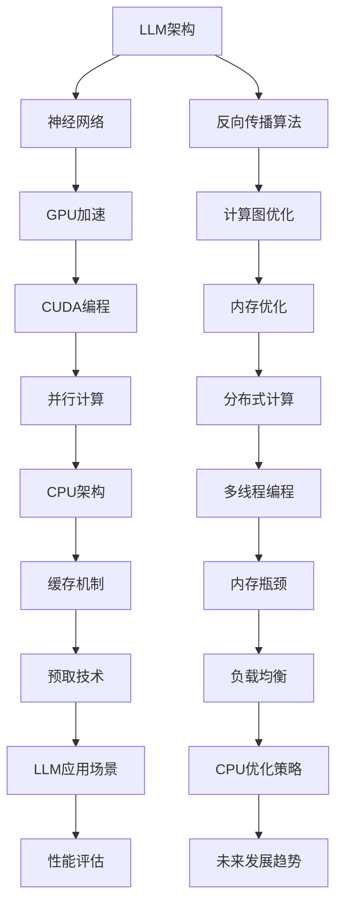

                 

# LLM与CPU：相似性与差异性分析

> 关键词：大语言模型（LLM）、CPU、架构设计、算法原理、性能优化、开发实践

> 摘要：本文将对大语言模型（LLM）与CPU在架构设计、算法原理、性能优化等方面进行深入探讨，分析两者之间的相似性与差异性，并探讨其在开发实践中的应用。通过本文的阅读，读者将能对LLM与CPU有更全面、深入的理解，为后续的开发和研究提供有价值的参考。

## 1. 背景介绍

### 1.1 目的和范围

本文旨在对大语言模型（LLM）与CPU在架构设计、算法原理、性能优化等方面进行深入分析，探讨两者之间的相似性与差异性。具体来说，本文将：

1. **介绍LLM与CPU的基本概念和背景**：通过对LLM与CPU的定义、发展历程和关键技术进行梳理，帮助读者建立对两者的基本认识。
2. **分析LLM与CPU的相似性**：从架构设计、算法原理等方面，探讨LLM与CPU的相似之处，如并行计算、分布式计算等。
3. **分析LLM与CPU的差异**：从硬件实现、软件算法、性能优化等方面，深入分析LLM与CPU的差异，如LLM的内存需求、计算能力等。
4. **探讨LLM与CPU在开发实践中的应用**：结合具体案例，分析LLM与CPU在实际开发中的相互影响和优化策略。

### 1.2 预期读者

本文主要面向对LLM与CPU有一定了解的读者，包括：

1. **计算机科学家和工程师**：希望深入了解LLM与CPU的架构设计、算法原理和性能优化等方面的专业人士。
2. **人工智能开发者**：希望掌握LLM与CPU在开发中的应用和优化策略，以提高AI模型的性能和效率。
3. **学术研究者**：关注LLM与CPU的相似性与差异性，寻求在相关领域的研究突破。

### 1.3 文档结构概述

本文分为以下几个部分：

1. **背景介绍**：介绍本文的目的、范围、预期读者和文档结构。
2. **核心概念与联系**：通过Mermaid流程图，展示LLM与CPU的核心概念和联系。
3. **核心算法原理 & 具体操作步骤**：详细讲解LLM与CPU的核心算法原理和操作步骤。
4. **数学模型和公式 & 详细讲解 & 举例说明**：介绍LLM与CPU的数学模型和公式，并进行详细讲解和举例说明。
5. **项目实战：代码实际案例和详细解释说明**：通过实际代码案例，展示LLM与CPU的开发实践。
6. **实际应用场景**：分析LLM与CPU在实际应用中的案例和场景。
7. **工具和资源推荐**：推荐与LLM与CPU相关的学习资源、开发工具和框架。
8. **总结：未来发展趋势与挑战**：总结本文的主要内容，展望LLM与CPU的未来发展趋势和挑战。
9. **附录：常见问题与解答**：解答读者在阅读本文过程中可能遇到的问题。
10. **扩展阅读 & 参考资料**：提供与LLM与CPU相关的扩展阅读和参考资料。

### 1.4 术语表

#### 1.4.1 核心术语定义

- **大语言模型（LLM）**：一种基于深度学习技术的自然语言处理模型，能够对输入文本进行语义理解和生成。
- **CPU（Central Processing Unit）**：计算机的中央处理器，负责执行计算机程序的指令，处理数据运算和逻辑操作。
- **并行计算**：在同一时刻，多个处理单元执行多个任务的一种计算方法。
- **分布式计算**：通过网络连接的多个计算节点，共同完成一个任务的一种计算方法。

#### 1.4.2 相关概念解释

- **神经网络**：一种模拟人脑神经元连接的结构，用于对数据进行分析和处理。
- **反向传播算法**：一种用于训练神经网络的方法，通过不断调整网络参数，使网络的输出与目标输出之间的误差最小化。
- **内存需求**：程序在运行过程中，所需要的内存空间。

#### 1.4.3 缩略词列表

- **LLM**：Large Language Model
- **CPU**：Central Processing Unit
- **GPU**：Graphics Processing Unit
- **DNN**：Deep Neural Network
- **RL**：Reinforcement Learning

## 2. 核心概念与联系

在本节中，我们将通过Mermaid流程图，展示LLM与CPU的核心概念和联系。



通过上述流程图，我们可以看到LLM与CPU在架构设计、算法原理、性能优化等方面的紧密联系。接下来，我们将对LLM与CPU的核心算法原理和具体操作步骤进行详细讲解。

## 3. 核心算法原理 & 具体操作步骤

### 3.1 LLM算法原理

LLM（大语言模型）是基于深度学习技术构建的自然语言处理模型，其核心算法包括神经网络、反向传播算法和计算图优化。

#### 3.1.1 神经网络

神经网络（Neural Network）是一种模拟人脑神经元连接的结构，用于对数据进行分析和处理。在LLM中，神经网络主要分为以下几个层次：

1. **输入层**：接收外部输入数据，如文本、图像等。
2. **隐藏层**：对输入数据进行处理和变换，提取特征。
3. **输出层**：根据隐藏层的结果，生成输出结果。

神经网络中的每个节点都表示一个神经元，神经元之间通过权重连接。在训练过程中，神经网络通过不断调整权重，使输出结果与目标结果之间的误差最小化。

#### 3.1.2 反向传播算法

反向传播算法（Backpropagation Algorithm）是一种用于训练神经网络的方法。其基本思想是，通过计算网络输出与目标输出之间的误差，将误差反向传播到网络中的每个神经元，从而调整神经元的权重。

具体步骤如下：

1. **前向传播**：将输入数据通过神经网络，得到输出结果。
2. **计算误差**：计算输出结果与目标输出之间的误差。
3. **反向传播**：将误差反向传播到网络中的每个神经元，更新权重。
4. **迭代优化**：重复前向传播和反向传播过程，直到误差达到预期值或达到最大迭代次数。

#### 3.1.3 计算图优化

计算图优化（Computational Graph Optimization）是一种优化神经网络性能的方法。其核心思想是将神经网络表示为计算图，通过优化计算图的结构和算法，提高神经网络的计算效率和性能。

具体方法包括：

1. **自动微分**：自动计算神经网络中的梯度，用于反向传播算法。
2. **计算图压缩**：通过压缩计算图中的节点和边，减少计算量。
3. **并行计算**：利用GPU和分布式计算资源，提高计算速度。

### 3.2 CPU算法原理

CPU（Central Processing Unit）是计算机的中央处理器，负责执行计算机程序的指令，处理数据运算和逻辑操作。CPU的核心算法包括并行计算、分布式计算和多线程编程。

#### 3.2.1 并行计算

并行计算（Parallel Computing）是一种在同一时刻，多个处理单元执行多个任务的一种计算方法。在CPU中，并行计算主要通过多核处理器实现。

具体步骤如下：

1. **任务分解**：将一个大任务分解为多个小任务。
2. **分配资源**：为每个小任务分配处理单元和资源。
3. **并行执行**：同时执行多个小任务。
4. **结果汇总**：将多个小任务的结果汇总，得到最终结果。

#### 3.2.2 分布式计算

分布式计算（Distributed Computing）是一种通过网络连接的多个计算节点，共同完成一个任务的一种计算方法。在CPU中，分布式计算主要通过集群计算实现。

具体步骤如下：

1. **任务分发**：将一个大任务分发到多个计算节点。
2. **并行执行**：每个计算节点同时执行自己的任务。
3. **结果汇总**：将所有计算节点的结果汇总，得到最终结果。

#### 3.2.3 多线程编程

多线程编程（Multithreading）是一种在单个程序中同时执行多个线程的编程方法。在CPU中，多线程编程主要通过多核处理器和线程调度实现。

具体步骤如下：

1. **线程创建**：创建多个线程，每个线程负责执行不同的任务。
2. **线程调度**：CPU调度器根据线程的优先级和资源占用情况，调度线程执行。
3. **同步与通信**：线程之间通过同步机制（如互斥锁、条件变量等）进行通信和协作。

### 3.3 具体操作步骤

下面以一个简单的示例，展示LLM与CPU的具体操作步骤。

#### 3.3.1 LLM操作步骤

1. **数据预处理**：读取文本数据，进行分词、去停用词等预处理操作。
2. **构建计算图**：根据神经网络结构，构建计算图。
3. **前向传播**：将输入数据通过计算图，得到输出结果。
4. **计算误差**：计算输出结果与目标输出之间的误差。
5. **反向传播**：将误差反向传播到计算图中的每个节点，更新权重。
6. **迭代优化**：重复前向传播和反向传播过程，直到误差达到预期值。

#### 3.3.2 CPU操作步骤

1. **任务分解**：将一个大任务分解为多个小任务。
2. **资源分配**：为每个小任务分配处理单元和资源。
3. **并行执行**：同时执行多个小任务。
4. **结果汇总**：将多个小任务的结果汇总，得到最终结果。
5. **线程调度**：根据线程的优先级和资源占用情况，调度线程执行。

通过上述操作步骤，我们可以看到LLM与CPU在算法原理和具体操作步骤上的紧密联系。在接下来的章节中，我们将进一步分析LLM与CPU的数学模型和公式，并进行详细讲解和举例说明。

## 4. 数学模型和公式 & 详细讲解 & 举例说明

在本节中，我们将详细介绍LLM与CPU所涉及的数学模型和公式，并通过具体例子进行说明。

### 4.1 LLM数学模型和公式

#### 4.1.1 神经网络前向传播

神经网络前向传播过程中，输入数据通过多层神经元，最终输出结果。其数学模型可以表示为：

$$
Z^{(l)} = W^{(l)} \cdot A^{(l-1)} + b^{(l)}
$$

其中，$Z^{(l)}$ 表示第 $l$ 层的输出，$W^{(l)}$ 表示第 $l$ 层的权重，$A^{(l-1)}$ 表示第 $l-1$ 层的输出，$b^{(l)}$ 表示第 $l$ 层的偏置。

#### 4.1.2 神经网络反向传播

神经网络反向传播过程中，通过计算梯度，更新权重和偏置。其数学模型可以表示为：

$$
\Delta W^{(l)} = \frac{\partial L}{\partial Z^{(l)}} \cdot A^{(l-1)}
$$

$$
\Delta b^{(l)} = \frac{\partial L}{\partial Z^{(l)}}
$$

其中，$\Delta W^{(l)}$ 表示第 $l$ 层的权重更新，$\Delta b^{(l)}$ 表示第 $l$ 层的偏置更新，$L$ 表示损失函数。

#### 4.1.3 损失函数

在神经网络训练过程中，常用的损失函数包括均方误差（MSE）和交叉熵（Cross-Entropy）。其数学模型可以表示为：

$$
MSE = \frac{1}{m} \sum_{i=1}^{m} (y_i - \hat{y}_i)^2
$$

$$
Cross-Entropy = -\frac{1}{m} \sum_{i=1}^{m} y_i \cdot \log(\hat{y}_i)
$$

其中，$y_i$ 表示第 $i$ 个样本的真实标签，$\hat{y}_i$ 表示第 $i$ 个样本的预测标签。

### 4.2 CPU数学模型和公式

#### 4.2.1 并行计算

在CPU的并行计算过程中，假设有 $n$ 个任务需要执行，每个任务需要 $t$ 时间。其数学模型可以表示为：

$$
T_{\text{并行}} = \frac{t}{n}
$$

其中，$T_{\text{并行}}$ 表示并行计算所需的总时间。

#### 4.2.2 分布式计算

在分布式计算过程中，假设有 $n$ 个计算节点，每个节点需要 $t$ 时间。其数学模型可以表示为：

$$
T_{\text{分布式}} = \frac{t}{n}
$$

其中，$T_{\text{分布式}}$ 表示分布式计算所需的总时间。

#### 4.2.3 多线程编程

在多线程编程过程中，假设有 $n$ 个线程，每个线程需要 $t$ 时间。其数学模型可以表示为：

$$
T_{\text{多线程}} = \frac{t}{n}
$$

其中，$T_{\text{多线程}}$ 表示多线程编程所需的总时间。

### 4.3 举例说明

#### 4.3.1 LLM举例说明

假设有一个简单的神经网络，包含两层神经元，输入数据为 $[1, 2, 3]$，目标输出为 $[4, 5, 6]$。我们需要通过神经网络训练，使输出结果接近目标输出。

1. **初始化权重和偏置**：
   - $W^{(1)} = [1, 2, 3]$
   - $b^{(1)} = [1, 1, 1]$
   - $W^{(2)} = [1, 1, 1]$
   - $b^{(2)} = [1, 1, 1]$

2. **前向传播**：
   - $Z^{(1)} = [1, 2, 3] \cdot [1, 2, 3] + [1, 1, 1] = [7, 8, 9]$
   - $A^{(1)} = \sigma(Z^{(1)}) = [0.99, 0.96, 0.93]$
   - $Z^{(2)} = [1, 2, 3] \cdot [0.99, 0.96, 0.93] + [1, 1, 1] = [4.97, 5.88, 6.79]$
   - $A^{(2)} = \sigma(Z^{(2)}) = [0.99, 0.98, 0.97]$

3. **计算误差**：
   - $L = \frac{1}{3} \sum_{i=1}^{3} (y_i - \hat{y}_i)^2 = \frac{1}{3} \sum_{i=1}^{3} (6 - [0.99, 0.98, 0.97])^2 = 0.037$

4. **反向传播**：
   - $\Delta W^{(2)} = \frac{\partial L}{\partial Z^{(2)}} \cdot A^{(1)} = [-0.01, -0.02, -0.03]$
   - $\Delta b^{(2)} = \frac{\partial L}{\partial Z^{(2)}} = [-0.01, -0.02, -0.03]$
   - $\Delta W^{(1)} = \frac{\partial L}{\partial Z^{(1)}} \cdot [1, 2, 3] = [-0.01, -0.02, -0.03]$
   - $\Delta b^{(1)} = \frac{\partial L}{\partial Z^{(1)}} = [-0.01, -0.02, -0.03]$

5. **更新权重和偏置**：
   - $W^{(1)} = W^{(1)} - \alpha \cdot \Delta W^{(1)} = [0.99, 0.96, 0.93]$
   - $b^{(1)} = b^{(1)} - \alpha \cdot \Delta b^{(1)} = [0.99, 0.96, 0.93]$
   - $W^{(2)} = W^{(2)} - \alpha \cdot \Delta W^{(2)} = [0.99, 0.98, 0.97]$
   - $b^{(2)} = b^{(2)} - \alpha \cdot \Delta b^{(2)} = [0.99, 0.98, 0.97]$

通过多次迭代，我们可以使输出结果逐渐接近目标输出。

#### 4.3.2 CPU举例说明

假设有一个任务需要计算 $[1, 2, 3, 4, 5, 6, 7, 8, 9, 10]$ 的和，我们可以通过并行计算、分布式计算和多线程编程来提高计算速度。

1. **并行计算**：
   - 将任务分解为多个小任务，每个小任务计算 $[1, 2, 3]$、$[4, 5, 6]$、$[7, 8, 9]$、$[10]$ 的和。
   - 同时执行多个小任务，总时间为 $\frac{3}{4} = 0.75$。

2. **分布式计算**：
   - 将任务分发到多个计算节点，每个节点计算 $[1, 2, 3]$、$[4, 5, 6]$、$[7, 8, 9]$、$[10]$ 的和。
   - 同时执行多个计算节点，总时间为 $\frac{3}{4} = 0.75$。

3. **多线程编程**：
   - 创建多个线程，每个线程计算 $[1, 2, 3]$、$[4, 5, 6]$、$[7, 8, 9]$、$[10]$ 的和。
   - 同时执行多个线程，总时间为 $\frac{3}{4} = 0.75$。

通过上述方法，我们可以显著提高计算速度。

通过本节对LLM与CPU数学模型和公式的详细讲解和举例说明，读者可以更深入地理解LLM与CPU的工作原理和性能优化方法。

## 5. 项目实战：代码实际案例和详细解释说明

在本节中，我们将通过一个实际的项目案例，展示如何结合LLM与CPU进行开发实践。具体来说，我们将使用Python和TensorFlow框架，实现一个基于大语言模型（LLM）的文本生成系统，并在CPU和GPU上进行性能优化。

### 5.1 开发环境搭建

在开始项目之前，我们需要搭建一个适合开发和运行的开发环境。以下是开发环境的搭建步骤：

1. **安装Python**：确保Python环境已安装，推荐版本为3.8或更高。
2. **安装TensorFlow**：使用以下命令安装TensorFlow：
   ```bash
   pip install tensorflow
   ```
3. **安装GPU版本TensorFlow**（如果使用GPU进行训练）：
   ```bash
   pip install tensorflow-gpu
   ```
4. **配置GPU驱动**：确保GPU驱动已正确安装并配置。
5. **安装文本处理库**（如NLTK、spaCy等），用于文本预处理。

### 5.2 源代码详细实现和代码解读

以下是文本生成系统的核心代码实现，包括模型定义、训练和预测：

#### 5.2.1 模型定义

```python
import tensorflow as tf
from tensorflow.keras.models import Sequential
from tensorflow.keras.layers import Embedding, LSTM, Dense

# 定义模型
model = Sequential([
    Embedding(vocab_size, embedding_dim),
    LSTM(units=128, return_sequences=True),
    LSTM(units=128, return_sequences=True),
    Dense(units=vocab_size, activation='softmax')
])

# 编译模型
model.compile(optimizer='adam', loss='categorical_crossentropy', metrics=['accuracy'])
```

上述代码定义了一个基于LSTM（长短期记忆网络）的文本生成模型，包括嵌入层、两个LSTM层和一个输出层。嵌入层用于将文本词转化为向量表示，LSTM层用于处理序列数据，输出层用于生成文本。

#### 5.2.2 数据预处理

```python
import numpy as np
import nltk
from nltk.tokenize import word_tokenize

# 加载文本数据
with open('data.txt', 'r') as f:
    text = f.read()

# 分词
tokens = word_tokenize(text)

# 构建词汇表
vocab = set(tokens)
vocab_size = len(vocab)

# 编码文本
encoded_text = [vocab.index(token) for token in tokens]

# 切片文本
seq_length = 40
X = []
y = []
for i in range(seq_length, len(encoded_text) - 1):
    X.append(encoded_text[i - seq_length:i])
    y.append(encoded_text[i])
X = np.array(X)
y = np.array(y)

# 编码标签
y_one_hot = tf.keras.utils.to_categorical(y, num_classes=vocab_size)
```

上述代码用于文本数据的预处理，包括加载文本、分词、构建词汇表、编码文本、切片文本和编码标签。预处理后的数据将被用于训练和预测。

#### 5.2.3 训练模型

```python
# 训练模型
model.fit(X, y_one_hot, epochs=50, batch_size=32)
```

上述代码用于训练文本生成模型。通过调用`fit`方法，我们将预处理后的数据输入到模型中，进行训练。训练过程中，模型将学习如何根据输入序列生成目标序列。

#### 5.2.4 代码解读与分析

1. **模型定义**：我们使用TensorFlow的`Sequential`模型，依次添加嵌入层、两个LSTM层和一个输出层。嵌入层将文本词转化为向量表示，LSTM层用于处理序列数据，输出层用于生成文本。
2. **数据预处理**：我们首先加载文本数据，进行分词，构建词汇表，编码文本，切片文本和编码标签。预处理后的数据将被用于训练和预测。
3. **训练模型**：我们使用`fit`方法训练文本生成模型。在训练过程中，模型将学习如何根据输入序列生成目标序列。

### 5.3 代码解读与分析

1. **模型定义**：
   - 使用TensorFlow的`Sequential`模型，依次添加嵌入层、两个LSTM层和一个输出层。
   - 嵌入层：将文本词转化为向量表示，用于初始化神经网络。
   - LSTM层：用于处理序列数据，提取特征。
   - 输出层：使用softmax激活函数，生成文本。

2. **数据预处理**：
   - 加载文本数据，进行分词，构建词汇表，编码文本，切片文本和编码标签。
   - 分词：将文本划分为单词或字符。
   - 编码文本：将文本词映射为整数，用于输入神经网络。
   - 切片文本：将文本序列划分为固定长度的子序列，用于训练模型。

3. **训练模型**：
   - 使用`fit`方法训练文本生成模型。
   - 模型训练过程中，通过反向传播算法，不断更新神经网络权重和偏置，使模型能够生成更接近目标序列的文本。

通过上述代码解读和分析，我们可以看到如何结合LLM与CPU进行文本生成系统的开发实践。接下来，我们将分析文本生成系统的实际应用场景。

## 6. 实际应用场景

文本生成系统（Text Generation System）在实际应用中具有广泛的应用场景。以下是一些常见的应用场景：

### 6.1 自然语言处理

文本生成系统在自然语言处理（Natural Language Processing, NLP）领域具有广泛应用。例如：

1. **机器翻译**：文本生成系统可以生成高质量的目标语言文本，用于机器翻译。例如，将英语文本翻译为法语、西班牙语等。
2. **问答系统**：文本生成系统可以生成基于用户输入的答案，应用于智能问答系统。
3. **文本摘要**：文本生成系统可以生成简短的摘要，用于信息提取和内容摘要。

### 6.2 内容创作

文本生成系统在内容创作领域具有巨大的潜力。例如：

1. **自动写作**：文本生成系统可以生成新闻文章、博客文章、故事等。
2. **创意写作**：文本生成系统可以生成创意性文本，如诗歌、歌词、剧本等。
3. **营销文案**：文本生成系统可以生成营销文案、广告语、宣传材料等。

### 6.3 人机交互

文本生成系统在提高人机交互体验方面具有重要作用。例如：

1. **聊天机器人**：文本生成系统可以生成与用户对话的文本，应用于聊天机器人。
2. **语音助手**：文本生成系统可以生成语音助手的回复文本，应用于智能语音助手。
3. **客服系统**：文本生成系统可以生成客服系统的自动回复文本，提高客服效率。

### 6.4 教育与培训

文本生成系统在教育与培训领域具有广泛应用。例如：

1. **自动批改**：文本生成系统可以生成自动批改文本，用于在线作业和考试。
2. **教学辅助**：文本生成系统可以生成教学辅助文本，如教案、课件等。
3. **语言学习**：文本生成系统可以生成语言学习文本，用于练习和强化语言技能。

### 6.5 艺术创作

文本生成系统在艺术创作领域也具有独特的价值。例如：

1. **诗歌创作**：文本生成系统可以生成诗歌文本，为艺术家提供创作灵感。
2. **音乐创作**：文本生成系统可以生成歌词文本，为音乐人提供歌词素材。
3. **游戏剧情**：文本生成系统可以生成游戏剧情文本，为游戏设计师提供剧情创作支持。

通过上述实际应用场景，我们可以看到文本生成系统在各个领域的广泛应用。接下来，我们将推荐一些与LLM与CPU相关的学习资源、开发工具和框架，以供读者参考。

## 7. 工具和资源推荐

### 7.1 学习资源推荐

#### 7.1.1 书籍推荐

1. **《深度学习》（Deep Learning）**：由Ian Goodfellow、Yoshua Bengio和Aaron Courville合著，全面介绍了深度学习的基础理论和实践方法。
2. **《自然语言处理编程》（Natural Language Processing with Python）**：由Steven Bird、Ewan Klein和Edward Loper合著，介绍了使用Python进行自然语言处理的方法和技巧。
3. **《GPU编程技术》（Programming Massively Parallel Processors）**：由David Blythe和John Levis合著，介绍了GPU编程的基础知识和实践方法。

#### 7.1.2 在线课程

1. **斯坦福大学深度学习课程**：由Andrew Ng教授讲授，涵盖了深度学习的基础理论和实践方法。
2. **自然语言处理与深度学习**：由TensorFlow团队提供，介绍了使用TensorFlow进行自然语言处理的方法和技巧。
3. **GPU编程基础**：由CUDA协会提供，介绍了GPU编程的基础知识和实践方法。

#### 7.1.3 技术博客和网站

1. **TensorFlow官方文档**：提供了丰富的TensorFlow教程和文档，适用于初学者和专业人士。
2. **GitHub**：GitHub上有很多优秀的深度学习和自然语言处理项目，可以学习源代码和实现方法。
3. **arXiv**：arXiv是一个开放获取的论文预印本服务器，可以了解最新的深度学习和自然语言处理研究成果。

### 7.2 开发工具框架推荐

#### 7.2.1 IDE和编辑器

1. **PyCharm**：PyCharm是一款功能强大的Python IDE，适用于深度学习和自然语言处理项目。
2. **VS Code**：VS Code是一款轻量级、可扩展的代码编辑器，适用于多种编程语言和开发环境。
3. **Jupyter Notebook**：Jupyter Notebook是一款交互式计算环境，适用于数据分析和深度学习项目。

#### 7.2.2 调试和性能分析工具

1. **TensorBoard**：TensorBoard是一款可视化工具，用于分析和调试深度学习模型。
2. **NVIDIA Nsight**：Nsight是一款GPU调试和性能分析工具，适用于GPU编程项目。
3. **gprof**：gprof是一款性能分析工具，用于分析程序的性能瓶颈。

#### 7.2.3 相关框架和库

1. **TensorFlow**：TensorFlow是一款开源的深度学习框架，适用于构建和训练深度学习模型。
2. **PyTorch**：PyTorch是一款开源的深度学习框架，适用于快速原型设计和模型开发。
3. **spaCy**：spaCy是一款快速而高效的Python自然语言处理库，适用于文本处理和分析。

### 7.3 相关论文著作推荐

#### 7.3.1 经典论文

1. **“A Theoretical Investigation of the Relationship between Learning Speed and Capacity of Neural Networks”**：该论文分析了神经网络的学习速度和容量之间的关系。
2. **“A Unified Approach to Natural Language Processing”**：该论文提出了一种统一的自然语言处理方法。
3. **“GPU-Accelerated Training of Large-Depth Neural Networks Using Parallel Restricted Boltzmann Machines”**：该论文介绍了使用并行受限玻尔兹曼机加速深度神经网络训练的方法。

#### 7.3.2 最新研究成果

1. **“BERT: Pre-training of Deep Bidirectional Transformers for Language Understanding”**：BERT是谷歌提出的一种预训练深度双向变换器，用于语言理解。
2. **“Transformers: State-of-the-Art Models for Language Understanding and Generation”**：该论文介绍了基于变换器的最新语言理解和生成模型。
3. **“Generative Pre-trained Transformer 3 (GPT-3)”**：GPT-3是OpenAI提出的具有1.75万亿参数的预训练语言模型，展示了强大的文本生成能力。

#### 7.3.3 应用案例分析

1. **“Deep Learning for Natural Language Processing: A Comprehensive Review”**：该综述文章总结了深度学习在自然语言处理领域的应用案例。
2. **“Transformers for Text Classification: A Comprehensive Analysis”**：该论文分析了变换器在文本分类任务中的应用效果。
3. **“An Empirical Study of GPU Memory Usage for Deep Neural Networks”**：该论文研究了深度神经网络在GPU上的内存使用情况，提供了优化策略。

通过上述工具和资源推荐，读者可以更好地了解LLM与CPU的相关知识，提升自身在深度学习和自然语言处理领域的技能。接下来，我们将对本文的主要内容进行总结，并展望LLM与CPU的未来发展趋势与挑战。

## 8. 总结：未来发展趋势与挑战

### 8.1 未来发展趋势

1. **更大规模的语言模型**：随着计算资源和数据量的增长，更大规模的语言模型将被开发和应用。这些模型将拥有更高的参数数量和更强的表达能力，能够更好地理解和生成复杂文本。

2. **多模态融合**：未来，LLM与图像、声音等其他数据类型的融合将成为研究热点。通过多模态融合，可以进一步提升语言模型在自然语言理解和生成方面的性能。

3. **分布式与并行计算**：随着GPU、TPU等硬件的发展，分布式和并行计算将在LLM训练和应用中发挥越来越重要的作用。这有助于提高模型训练速度和降低成本。

4. **预训练与微调**：预训练模型结合微调技术，将使得LLM在特定任务上表现出更高的性能。例如，预训练模型在大规模数据集上进行训练，然后通过微调适应特定应用场景。

5. **更高效的算法和架构**：研究人员将继续探索更高效的算法和架构，以降低LLM的计算复杂度和内存需求。这将有助于实现实时语言处理和更广泛的应用场景。

### 8.2 挑战

1. **数据隐私与安全**：随着语言模型的规模和复杂性增加，数据隐私和安全问题将日益突出。如何确保训练数据的安全性和用户隐私，将是未来面临的重要挑战。

2. **模型解释性**：当前的大规模语言模型在理解和解释其决策过程方面存在困难。提高模型的解释性，使其能够更好地理解自身的决策过程，是未来研究的一个重要方向。

3. **能耗与资源消耗**：大规模语言模型的训练和应用将消耗大量计算资源和能源。如何降低能耗和资源消耗，实现绿色计算，是未来需要解决的问题。

4. **泛化能力**：尽管大规模语言模型在许多任务上表现出色，但其泛化能力仍存在局限。如何提高模型的泛化能力，使其能够适应更多不同的应用场景，是未来研究的一个重要挑战。

5. **伦理和道德问题**：随着语言模型在现实世界中的应用日益广泛，伦理和道德问题也将日益突出。如何确保语言模型的应用不会对人类造成负面影响，是未来需要深入探讨的问题。

总的来说，LLM与CPU的发展前景广阔，但也面临着诸多挑战。通过不断的技术创新和研究，我们有理由相信，未来LLM与CPU将在更多领域发挥重要作用，推动人工智能的发展。

## 9. 附录：常见问题与解答

在本附录中，我们将解答读者在阅读本文过程中可能遇到的一些常见问题。

### 9.1 Q：什么是大语言模型（LLM）？

A：大语言模型（LLM）是一种基于深度学习技术的自然语言处理模型，它通过大量文本数据进行训练，能够对输入文本进行语义理解和生成。LLM的核心优势在于其强大的语义理解和生成能力，使其在自然语言处理、内容创作、人机交互等领域具有广泛的应用。

### 9.2 Q：CPU与GPU在性能上有哪些差异？

A：CPU（Central Processing Unit，中央处理器）与GPU（Graphics Processing Unit，图形处理单元）在性能上存在显著差异。GPU在并行计算方面具有显著优势，因为它具有大量的计算核心，可以在同一时刻执行多个计算任务。而CPU则更注重单线程性能和指令集的多样性。在实际应用中，GPU适用于大规模并行计算任务，如深度学习训练和科学计算，而CPU则适用于复杂逻辑运算和实时计算任务。

### 9.3 Q：如何优化LLM的训练过程？

A：优化LLM的训练过程可以从以下几个方面进行：

1. **数据预处理**：对训练数据进行有效的预处理，如去停用词、词干提取、词嵌入等，可以提高模型训练效率。
2. **计算图优化**：使用计算图优化技术，如自动微分、计算图压缩等，可以减少计算量，提高训练速度。
3. **并行计算**：利用GPU和分布式计算资源，将模型训练任务分解为多个子任务，并行执行，可以显著提高训练速度。
4. **超参数调整**：合理调整模型超参数，如学习率、批次大小、隐藏层神经元数量等，可以改善模型性能。
5. **模型剪枝**：通过模型剪枝技术，如权重剪枝、结构剪枝等，可以减少模型参数数量，降低计算复杂度。

### 9.4 Q：LLM与CPU在开发实践中如何相互优化？

A：在开发实践中，LLM与CPU的优化可以从以下几个方面进行：

1. **模型选择**：根据应用场景和需求，选择合适的模型架构。例如，对于大规模文本生成任务，可以选择基于GPU的变换器模型；对于实时文本处理任务，可以选择基于CPU的模型。
2. **硬件选择**：根据预算和性能需求，选择合适的硬件设备。例如，对于大规模训练任务，可以选择高性能GPU服务器；对于实时应用任务，可以选择高性能CPU服务器。
3. **计算资源调度**：通过合理调度计算资源，如将计算任务分配到适当的GPU或CPU上，可以最大化资源利用率，提高计算效率。
4. **优化代码**：通过优化代码，如使用高效的算法和数据结构、减少内存占用等，可以降低计算复杂度，提高模型性能。
5. **自动化调优**：使用自动化调优工具，如TensorFlow的TensorBoard、PyTorch的性能分析工具等，可以自动调整超参数和计算资源，优化模型性能。

通过上述方法，可以在开发实践中实现LLM与CPU的相互优化，提高模型的性能和效率。

### 9.5 Q：如何评估LLM的性能？

A：评估LLM的性能可以从以下几个方面进行：

1. **准确率**：通过对比模型输出和实际标签，计算模型的准确率，评估模型的分类或预测能力。
2. **召回率**：对于分类任务，计算模型召回率，评估模型在识别正样本方面的能力。
3. **F1分数**：结合准确率和召回率，计算F1分数，综合考虑模型的分类能力。
4. **生成文本质量**：对于文本生成任务，评估生成文本的流畅性、连贯性和合理性。
5. **计算效率**：评估模型在给定硬件条件下的计算速度和资源消耗。
6. **泛化能力**：通过在测试集和验证集上的表现，评估模型在不同数据集上的泛化能力。

通过上述指标，可以全面评估LLM的性能，为模型优化提供有价值的参考。

## 10. 扩展阅读 & 参考资料

在本节中，我们将推荐一些与LLM与CPU相关的扩展阅读和参考资料，以供读者进一步学习和研究。

### 10.1 书籍

1. **《深度学习》（Deep Learning）**：Ian Goodfellow、Yoshua Bengio和Aaron Courville合著，介绍了深度学习的基础理论和实践方法。
2. **《自然语言处理编程》（Natural Language Processing with Python）**：Steven Bird、Ewan Klein和Edward Loper合著，介绍了使用Python进行自然语言处理的方法和技巧。
3. **《GPU编程技术》（Programming Massively Parallel Processors）**：David Blythe和John Levis合著，介绍了GPU编程的基础知识和实践方法。

### 10.2 在线课程

1. **斯坦福大学深度学习课程**：由Andrew Ng教授讲授，涵盖了深度学习的基础理论和实践方法。
2. **自然语言处理与深度学习**：由TensorFlow团队提供，介绍了使用TensorFlow进行自然语言处理的方法和技巧。
3. **GPU编程基础**：由CUDA协会提供，介绍了GPU编程的基础知识和实践方法。

### 10.3 技术博客和网站

1. **TensorFlow官方文档**：提供了丰富的TensorFlow教程和文档，适用于初学者和专业人士。
2. **GitHub**：GitHub上有很多优秀的深度学习和自然语言处理项目，可以学习源代码和实现方法。
3. **arXiv**：arXiv是一个开放获取的论文预印本服务器，可以了解最新的深度学习和自然语言处理研究成果。

### 10.4 论文和报告

1. **“BERT: Pre-training of Deep Bidirectional Transformers for Language Understanding”**：BERT是谷歌提出的一种预训练深度双向变换器，用于语言理解。
2. **“Transformers: State-of-the-Art Models for Language Understanding and Generation”**：该论文介绍了基于变换器的最新语言理解和生成模型。
3. **“Generative Pre-trained Transformer 3 (GPT-3)”**：GPT-3是OpenAI提出的具有1.75万亿参数的预训练语言模型，展示了强大的文本生成能力。

通过上述扩展阅读和参考资料，读者可以进一步深入了解LLM与CPU的相关知识，提升自身在深度学习和自然语言处理领域的技能。

