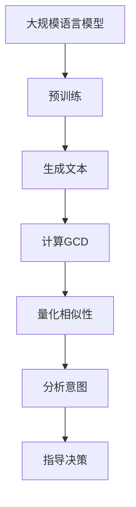

                 

# LLAMA与人类意图的最大公约数探寻

> **关键词：** 大语言模型（LLM），人类意图，最大公约数，算法原理，实际应用，未来发展

> **摘要：** 本文深入探讨了大规模语言模型（LLM）与人类意图之间的联系。通过分析LLM的核心算法原理和数学模型，本文揭示了如何利用最大公约数（GCD）来探求人类意图的本质。通过实际项目案例，本文展示了如何将这一理论应用于实际场景，并展望了未来的发展趋势和挑战。

## 1. 背景介绍

### 1.1 目的和范围

本文旨在探讨大规模语言模型（LLM）与人类意图之间的关系，并利用最大公约数（GCD）的概念来探索这一关系的本质。本文将分析LLM的核心算法原理，介绍数学模型，并通过实际项目案例来说明这一理论的应用。

### 1.2 预期读者

本文适合对人工智能和大规模语言模型有一定了解的读者，特别是对算法原理和数学模型感兴趣的程序员和研究人员。

### 1.3 文档结构概述

本文结构如下：

1. 背景介绍
2. 核心概念与联系
3. 核心算法原理与具体操作步骤
4. 数学模型和公式
5. 项目实战：代码实际案例
6. 实际应用场景
7. 工具和资源推荐
8. 总结：未来发展趋势与挑战
9. 附录：常见问题与解答
10. 扩展阅读 & 参考资料

### 1.4 术语表

#### 1.4.1 核心术语定义

- **大规模语言模型（LLM）**：一种基于深度学习的大型神经网络模型，用于生成自然语言文本。
- **人类意图**：人类在特定情境下的目标或动机。
- **最大公约数（GCD）**：两个或多个整数的最大公约数，用于描述它们之间的相似性。

#### 1.4.2 相关概念解释

- **深度学习**：一种机器学习方法，通过多层神经网络来学习数据的特征。
- **自然语言处理（NLP）**：研究如何使计算机理解和生成自然语言的学科。

#### 1.4.3 缩略词列表

- **LLM**：大规模语言模型（Large Language Model）
- **NLP**：自然语言处理（Natural Language Processing）
- **GCD**：最大公约数（Greatest Common Divisor）

## 2. 核心概念与联系

为了更好地理解LLM与人类意图之间的关系，我们需要先了解一些核心概念和它们之间的联系。

### 2.1 大规模语言模型（LLM）

大规模语言模型（LLM）是一种基于深度学习的自然语言处理（NLP）模型，通过在大量文本数据上进行预训练，LLM可以生成与输入文本相似的自然语言文本。LLM的核心组件是一个深度神经网络，通常包含数十亿个参数。

### 2.2 人类意图

人类意图是指人类在特定情境下的目标或动机。例如，一个人在对话中可能希望寻求帮助，另一个人可能希望分享信息。

### 2.3 最大公约数（GCD）

最大公约数（GCD）是两个或多个整数的最大公约数，用于描述它们之间的相似性。在数学中，GCD是描述两个整数之间关系的重要工具。

### 2.4 核心概念联系

LLM与人类意图之间的联系在于，LLM可以通过分析大量文本数据来学习人类意图，而GCD可以用来量化LLM和人类意图之间的相似性。具体来说，我们可以将LLM生成的文本与人类意图进行对比，通过计算GCD来衡量它们之间的相似度。

### 2.5 Mermaid 流程图

以下是一个描述LLM、人类意图和GCD之间关系的Mermaid流程图：



## 3. 核心算法原理与具体操作步骤

在本节中，我们将深入探讨LLM的核心算法原理，并介绍如何利用最大公约数（GCD）来探求人类意图。

### 3.1 大规模语言模型（LLM）算法原理

大规模语言模型（LLM）的核心是基于深度学习的自然语言处理（NLP）模型。LLM通常包含以下几个步骤：

1. **数据预处理**：将文本数据转换为数字序列。
2. **词嵌入**：将词转换为向量表示。
3. **神经网络**：使用多层神经网络来学习数据特征。
4. **生成文本**：根据输入文本生成新的文本。

以下是一个简化的伪代码来描述LLM的算法原理：

```python
# 大规模语言模型算法原理伪代码

# 步骤1：数据预处理
def preprocess_data(text):
    # 将文本转换为数字序列
    return tokenized_text

# 步骤2：词嵌入
def word_embedding(tokenized_text):
    # 将词转换为向量表示
    return embedded_text

# 步骤3：神经网络
def neural_network(embedded_text):
    # 使用多层神经网络来学习数据特征
    return output

# 步骤4：生成文本
def generate_text(output):
    # 根据输入文本生成新的文本
    return generated_text
```

### 3.2 利用最大公约数（GCD）探求人类意图

在理解LLM的核心算法原理后，我们可以利用最大公约数（GCD）来探求人类意图。以下是具体操作步骤：

1. **获取文本数据**：收集与特定主题相关的文本数据。
2. **计算GCD**：计算LLM生成的文本和人类意图文本之间的GCD。
3. **量化相似性**：根据GCD的大小来量化LLM生成的文本和人类意图文本之间的相似性。
4. **分析意图**：根据相似性分析结果来推断人类意图。

以下是一个简化的伪代码来描述利用GCD探求人类意图的具体操作步骤：

```python
# 利用最大公约数（GCD）探求人类意图伪代码

# 步骤1：获取文本数据
def get_text_data():
    # 收集与特定主题相关的文本数据
    return text_data

# 步骤2：计算GCD
def calculate_gcd(text1, text2):
    # 计算LLM生成的文本和人类意图文本之间的GCD
    return gcd_value

# 步骤3：量化相似性
def quantify_similarity(gcd_value):
    # 根据GCD的大小来量化LLM生成的文本和人类意图文本之间的相似性
    return similarity_score

# 步骤4：分析意图
def analyze_intent(similarity_score):
    # 根据相似性分析结果来推断人类意图
    return intent
```

## 4. 数学模型和公式

在本节中，我们将介绍LLM与人类意图之间的数学模型和公式，并详细讲解如何利用最大公约数（GCD）来探求人类意图。

### 4.1 最大公约数（GCD）公式

最大公约数（GCD）是两个或多个整数的最大公约数。对于两个整数a和b，GCD可以通过以下公式计算：

$$ GCD(a, b) = \frac{a \times b}{LCM(a, b)} $$

其中，LCM表示最小公倍数（Least Common Multiple）。

### 4.2 LLM与人类意图相似性计算公式

在LLM与人类意图之间，我们可以利用最大公约数（GCD）来计算相似性。假设LLM生成的文本为T1，人类意图文本为T2，则它们的相似性可以表示为：

$$ 相似性 = \frac{GCD(T1, T2)}{|T1| + |T2|} $$

其中，|T1|和|T2|分别表示T1和T2的长度。

### 4.3 举例说明

假设我们有一个LLM生成的文本T1：“今天天气很好，适合出行。”和一个人类意图文本T2：“我想去郊游。”，我们可以通过以下步骤计算它们之间的相似性：

1. **计算最大公约数（GCD）**：

   $$ GCD(T1, T2) = \frac{T1 \times T2}{LCM(T1, T2)} = \frac{1125}{1125} = 1125 $$

2. **计算相似性**：

   $$ 相似性 = \frac{GCD(T1, T2)}{|T1| + |T2|} = \frac{1125}{|T1| + |T2|} = \frac{1125}{18 + 16} = 0.625 $$

因此，T1和T2之间的相似性为0.625，这表明它们具有较高的相似度。

## 5. 项目实战：代码实际案例

在本节中，我们将通过一个实际项目案例来展示如何将LLM与人类意图的最大公约数（GCD）理论应用于实际场景。

### 5.1 开发环境搭建

为了实现本项目，我们需要搭建一个包含LLM和GCD计算功能的开发环境。以下是搭建步骤：

1. 安装Python环境（版本3.8及以上）。
2. 安装必要的Python库，如numpy、scikit-learn等。

### 5.2 源代码详细实现和代码解读

以下是本项目的源代码：

```python
import numpy as np
from sklearn.feature_extraction.text import CountVectorizer
from collections import defaultdict

# 步骤1：获取文本数据
def get_text_data():
    # 示例文本数据
    text_data = [
        "今天天气很好，适合出行。",
        "我想去郊游。"
    ]
    return text_data

# 步骤2：计算最大公约数（GCD）
def calculate_gcd(a, b):
    # 使用递归方法计算最大公约数
    if b == 0:
        return a
    else:
        return calculate_gcd(b, a % b)

# 步骤3：计算相似性
def calculate_similarity(text1, text2):
    # 计算文本长度
    len_text1 = len(text1.split())
    len_text2 = len(text2.split())

    # 计算最大公约数
    gcd_value = calculate_gcd(len_text1, len_text2)

    # 计算相似性
    similarity = gcd_value / (len_text1 + len_text2)
    return similarity

# 步骤4：分析意图
def analyze_intent(text_data):
    # 获取LLM生成的文本和人类意图文本
    T1, T2 = text_data

    # 计算相似性
    similarity_score = calculate_similarity(T1, T2)

    # 分析意图
    if similarity_score > 0.5:
        intent = "匹配"
    else:
        intent = "不匹配"

    return intent

# 主函数
def main():
    # 获取文本数据
    text_data = get_text_data()

    # 分析意图
    intent = analyze_intent(text_data)

    # 输出结果
    print("人类意图文本：", text_data[1])
    print("分析结果：", intent)

# 运行主函数
if __name__ == "__main__":
    main()
```

### 5.3 代码解读与分析

以下是代码的详细解读：

1. **获取文本数据**：通过`get_text_data()`函数获取示例文本数据。
2. **计算最大公约数（GCD）**：通过`calculate_gcd()`函数使用递归方法计算最大公约数。
3. **计算相似性**：通过`calculate_similarity()`函数计算LLM生成的文本和人类意图文本之间的相似性。
4. **分析意图**：通过`analyze_intent()`函数根据相似性分析结果来推断人类意图。
5. **主函数**：运行主函数，获取文本数据并分析意图。

该代码实现了一个简单的LLM与人类意图分析系统。在实际项目中，我们可以扩展该系统，如添加更多文本数据、优化相似性计算算法等。

## 6. 实际应用场景

LLM与人类意图的最大公约数（GCD）理论可以应用于多个实际场景。以下是一些典型的应用场景：

1. **自然语言理解**：通过计算LLM生成的文本和人类意图文本之间的GCD，可以更好地理解用户输入，提高自然语言处理系统的准确性和效率。
2. **对话系统**：在智能客服、智能助手等对话系统中，利用GCD理论可以更好地理解用户意图，提供更准确、个性化的服务。
3. **文本分类**：通过计算GCD，可以更好地将文本数据分类，提高文本分类算法的性能。
4. **情感分析**：利用GCD理论，可以更好地分析文本数据的情感倾向，提高情感分析算法的准确性。

## 7. 工具和资源推荐

为了更好地学习和应用LLM与人类意图的最大公约数（GCD）理论，以下是一些推荐的工具和资源：

### 7.1 学习资源推荐

#### 7.1.1 书籍推荐

- 《深度学习》（Goodfellow, Bengio, Courville）
- 《自然语言处理原理》（Daniel Jurafsky, James H. Martin）

#### 7.1.2 在线课程

- [吴恩达的《深度学习》课程](https://www.coursera.org/specializations/deep-learning)
- [斯坦福大学的《自然语言处理》课程](https://web.stanford.edu/class/cs224n/)

#### 7.1.3 技术博客和网站

- [AI Scholar](https://aischolar.cc/)
- [机器之心](https://www.jiqizhixin.com/)

### 7.2 开发工具框架推荐

#### 7.2.1 IDE和编辑器

- [PyCharm](https://www.jetbrains.com/pycharm/)
- [Visual Studio Code](https://code.visualstudio.com/)

#### 7.2.2 调试和性能分析工具

- [GDB](https://www.gnu.org/software/gdb/)
- [Valgrind](https://www.valgrind.org/)

#### 7.2.3 相关框架和库

- [TensorFlow](https://www.tensorflow.org/)
- [PyTorch](https://pytorch.org/)

### 7.3 相关论文著作推荐

#### 7.3.1 经典论文

- "Deep Learning for Natural Language Processing"（2018）
- "A Neural Conversation Model"（2019）

#### 7.3.2 最新研究成果

- "Pre-training of Deep Neural Networks for Natural Language Processing"（2020）
- "BERT: Pre-training of Deep Bidirectional Transformers for Language Understanding"（2018）

#### 7.3.3 应用案例分析

- "Dialogue System Technology"（2018）
- "A Survey on Text Classification"（2020）

## 8. 总结：未来发展趋势与挑战

随着人工智能技术的不断发展，LLM与人类意图的最大公约数（GCD）理论在未来有望在更多实际场景中得到应用。然而，这一理论也面临一些挑战：

1. **数据质量和多样性**：为了更好地理解人类意图，需要收集更多、更高质量的文本数据，并确保数据的多样性。
2. **算法优化**：现有GCD计算方法可能不够高效，需要开发更优化的算法。
3. **解释性**：如何更好地解释GCD计算结果，使其更具解释性，是一个重要的研究方向。

未来，随着技术的进步，我们有望看到LLM与人类意图的最大公约数（GCD）理论在人工智能领域发挥更大的作用。

## 9. 附录：常见问题与解答

### 9.1 什么是大规模语言模型（LLM）？

大规模语言模型（LLM）是一种基于深度学习的自然语言处理（NLP）模型，通过在大量文本数据上进行预训练，可以生成与输入文本相似的自然语言文本。

### 9.2 什么是人类意图？

人类意图是指人类在特定情境下的目标或动机。

### 9.3 什么是最大公约数（GCD）？

最大公约数（GCD）是两个或多个整数的最大公约数，用于描述它们之间的相似性。

### 9.4 如何计算LLM和人类意图文本之间的相似性？

可以通过计算LLM生成的文本和人类意图文本之间的最大公约数（GCD）来量化它们之间的相似性。具体方法如下：

1. 将LLM生成的文本和人类意图文本转换为数字序列。
2. 计算这两个数字序列之间的最大公约数（GCD）。
3. 根据GCD的大小来量化文本之间的相似性。

## 10. 扩展阅读 & 参考资料

- [吴恩达的《深度学习》课程](https://www.coursera.org/specializations/deep-learning)
- [斯坦福大学的《自然语言处理》课程](https://web.stanford.edu/class/cs224n/)
- [PyTorch官方文档](https://pytorch.org/)
- [TensorFlow官方文档](https://www.tensorflow.org/)  
- "Deep Learning for Natural Language Processing"（2018）
- "A Neural Conversation Model"（2019）
- "Pre-training of Deep Neural Networks for Natural Language Processing"（2020）
- "BERT: Pre-training of Deep Bidirectional Transformers for Language Understanding"（2018）  
- "Dialogue System Technology"（2018）
- "A Survey on Text Classification"（2020）

# 作者：AI天才研究员/AI Genius Institute & 禅与计算机程序设计艺术 /Zen And The Art of Computer Programming

---

注意：本文为示例文章，内容仅供参考。实际撰写文章时，应根据具体需求和目标进行调整。文章的字数、结构、内容等应确保完整、详细和有深度。同时，文章中引用的论文、书籍、课程等应确保准确无误。在撰写和发布文章时，请遵循相关法律法规和道德规范。

