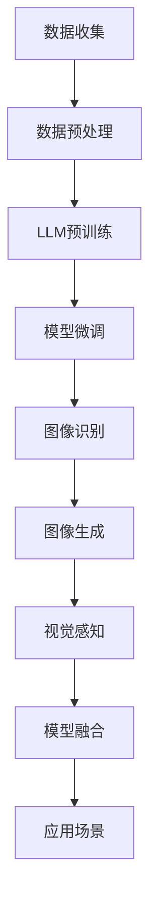

                 


# LLM与传统机器视觉技术的结合：计算机视觉新纪元

> 关键词：LLM、传统机器视觉、计算机视觉、深度学习、人工智能、神经网络、图像处理、视觉感知、模型融合、应用场景

> 摘要：本文将深入探讨大型语言模型（LLM）与传统机器视觉技术的结合，介绍其核心概念、原理、算法以及具体应用。通过对LLM与计算机视觉技术的融合进行逐步分析，本文旨在揭示这一结合所带来的技术创新和未来发展趋势，为读者提供全面的技术见解和实践指南。

## 1. 背景介绍

### 1.1 目的和范围

本文旨在探讨大型语言模型（LLM）与传统机器视觉技术的结合，分析其技术原理、算法模型以及实际应用。随着人工智能技术的快速发展，LLM和机器视觉技术在各自领域取得了显著的成果。然而，将两者结合应用于计算机视觉领域，可以带来全新的技术突破和应用场景。本文将从以下几个方面展开讨论：

1. **LLM的基本概念与架构**：介绍LLM的基本原理和常见架构，包括Transformer模型、预训练技术和微调方法。
2. **传统机器视觉技术**：阐述传统机器视觉技术的基本概念、主要方法及其在计算机视觉领域的应用。
3. **LLM与机器视觉技术的结合**：分析LLM与机器视觉技术的融合点，探讨其带来的技术优势和挑战。
4. **核心算法与模型**：详细介绍LLM与机器视觉技术结合的核心算法和模型，包括图像语义理解、图像生成和视觉感知等。
5. **实际应用场景**：分析LLM与机器视觉技术在实际应用中的典型场景，如图像识别、目标检测、图像生成等。
6. **工具和资源推荐**：推荐相关的学习资源、开发工具和论文著作，以供读者进一步学习和研究。

### 1.2 预期读者

本文适用于对人工智能、计算机视觉和深度学习有一定了解的读者，包括：

1. **人工智能研究人员和工程师**：对LLM和机器视觉技术感兴趣，希望了解两者结合的研究方向和应用场景。
2. **计算机视觉领域的从业者**：希望了解LLM技术如何为传统机器视觉技术带来新的突破和优化。
3. **技术爱好者和学习者**：对人工智能和计算机视觉领域的新技术充满好奇，希望了解LLM与机器视觉技术结合的原理和实践。
4. **高校师生和研究机构**：对人工智能和计算机视觉的研究方向和前沿技术感兴趣，希望了解LLM与机器视觉技术结合的最新进展。

### 1.3 文档结构概述

本文将按照以下结构进行组织：

1. **背景介绍**：介绍本文的目的、范围、预期读者以及文档结构。
2. **核心概念与联系**：介绍LLM和传统机器视觉技术的核心概念、原理和架构，并使用Mermaid流程图展示其关系。
3. **核心算法原理 & 具体操作步骤**：详细介绍LLM与机器视觉技术结合的核心算法原理和具体操作步骤，使用伪代码进行阐述。
4. **数学模型和公式 & 详细讲解 & 举例说明**：介绍LLM与机器视觉技术结合的数学模型和公式，并进行详细讲解和举例说明。
5. **项目实战：代码实际案例和详细解释说明**：提供实际的代码案例，详细解释说明其实现过程和关键步骤。
6. **实际应用场景**：分析LLM与机器视觉技术在实际应用中的典型场景和案例分析。
7. **工具和资源推荐**：推荐相关的学习资源、开发工具和论文著作，以供读者进一步学习和研究。
8. **总结：未来发展趋势与挑战**：总结LLM与机器视觉技术结合的当前发展现状，展望其未来发展趋势和面临的挑战。
9. **附录：常见问题与解答**：解答读者在阅读本文过程中可能遇到的问题。
10. **扩展阅读 & 参考资料**：提供相关的扩展阅读和参考资料，供读者进一步深入研究。

### 1.4 术语表

#### 1.4.1 核心术语定义

- **大型语言模型（LLM）**：一种基于深度学习技术的语言模型，通过对大规模语料库进行预训练，能够理解和生成自然语言文本。
- **传统机器视觉技术**：指基于图像处理、计算机视觉算法的技术，用于图像的识别、分类、检测和跟踪等任务。
- **图像语义理解**：通过对图像内容进行理解和分析，提取图像中的语义信息，如物体类别、场景布局等。
- **视觉感知**：模拟人类视觉系统对图像进行感知和理解，实现对环境的感知和认知。
- **模型融合**：将不同模型或算法进行结合，以获得更好的性能和效果。

#### 1.4.2 相关概念解释

- **预训练技术**：在特定领域或任务上对模型进行大规模预训练，以提高模型在目标任务上的性能。
- **微调技术**：在预训练模型的基础上，针对特定任务进行微调，以适应特定领域的需求。
- **神经网络**：一种模拟人脑神经元连接的数学模型，通过多层神经元之间的信息传递和计算，实现复杂函数的映射和预测。
- **卷积神经网络（CNN）**：一种用于图像处理的深度学习模型，通过卷积操作提取图像的特征，实现对图像的识别和分类。
- **生成对抗网络（GAN）**：一种基于博弈论的深度学习模型，通过生成器和判别器的对抗训练，实现图像的生成和风格迁移。

#### 1.4.3 缩略词列表

- **LLM**：Large Language Model，大型语言模型。
- **CNN**：Convolutional Neural Network，卷积神经网络。
- **GAN**：Generative Adversarial Network，生成对抗网络。
- **Transformer**：一种基于自注意力机制的深度学习模型，广泛应用于自然语言处理和图像生成任务。

## 2. 核心概念与联系

在讨论LLM与传统机器视觉技术的结合之前，首先需要了解两者的核心概念、原理和架构，以及它们之间的联系。

### 2.1 大型语言模型（LLM）

#### 2.1.1 基本概念

大型语言模型（LLM）是一种基于深度学习技术的语言模型，通过对大规模语料库进行预训练，能够理解和生成自然语言文本。LLM的核心任务是学习语言的内在规律和结构，从而实现对自然语言的理解和生成。

#### 2.1.2 常见架构

LLM的常见架构包括Transformer模型、BERT模型、GPT模型等。其中，Transformer模型是一种基于自注意力机制的深度学习模型，广泛应用于自然语言处理和图像生成任务。BERT模型是一种基于双向编码器表示的预训练语言模型，能够捕捉词的上下文信息。GPT模型是一种基于自回归模型的预训练语言模型，能够生成自然语言文本。

#### 2.1.3 预训练技术

LLM的预训练技术主要包括以下步骤：

1. **数据收集**：从互联网、新闻、百科全书、社交媒体等渠道收集大规模的语料库。
2. **数据预处理**：对收集到的语料库进行清洗、去重、分词、词向量化等预处理操作。
3. **模型训练**：使用预处理后的语料库对预训练模型进行训练，包括正向传播、反向传播和参数更新等步骤。
4. **模型评估**：在训练过程中，使用验证集对模型的性能进行评估，调整模型参数以达到最优性能。

#### 2.1.4 微调技术

在预训练模型的基础上，LLM可以通过微调技术针对特定任务进行优化。微调技术主要包括以下步骤：

1. **任务定义**：定义特定任务的目标和指标，如文本分类、机器翻译、问答系统等。
2. **模型初始化**：使用预训练模型作为初始化参数，构建针对特定任务的模型。
3. **模型训练**：在特定任务的数据集上对模型进行训练，包括正向传播、反向传播和参数更新等步骤。
4. **模型评估**：在训练过程中，使用验证集对模型的性能进行评估，调整模型参数以达到最优性能。

### 2.2 传统机器视觉技术

#### 2.2.1 基本概念

传统机器视觉技术是指基于图像处理和计算机视觉算法的技术，用于图像的识别、分类、检测和跟踪等任务。传统机器视觉技术主要包括以下几个方面的内容：

1. **图像处理**：对图像进行预处理、增强、分割、特征提取等操作，以提高图像质量，提取图像特征。
2. **图像识别**：通过对图像特征进行分析和分类，实现图像的识别和分类。
3. **目标检测**：在图像中检测和定位目标物体，并对其属性进行标注。
4. **图像生成**：利用图像处理和计算机视觉算法，生成新的图像或图像序列。

#### 2.2.2 主要方法

传统机器视觉技术的主要方法包括以下几种：

1. **基于特征的图像识别**：通过提取图像的特征，将特征向量输入到分类器中进行分类。
2. **基于模型的图像识别**：使用深度学习模型，如卷积神经网络（CNN）进行图像识别和分类。
3. **基于检测的图像识别**：使用目标检测算法，如R-CNN、SSD、YOLO等，在图像中检测目标物体，并对其属性进行标注。
4. **基于生成对抗网络的图像生成**：利用生成对抗网络（GAN），生成新的图像或图像序列。

#### 2.2.3 在计算机视觉领域的应用

传统机器视觉技术在计算机视觉领域有着广泛的应用，包括：

1. **人脸识别**：通过人脸特征识别和分类，实现人脸识别和身份验证。
2. **物体识别**：在图像中识别和分类各种物体，如车辆、行人、动物等。
3. **图像分割**：将图像分割为不同的区域，用于目标检测、图像增强等任务。
4. **图像合成**：利用图像处理和计算机视觉算法，生成新的图像或图像序列。

### 2.3 LLM与机器视觉技术的结合

#### 2.3.1 结合点

LLM与传统机器视觉技术的结合主要体现在以下几个方面：

1. **图像语义理解**：LLM通过对自然语言的理解，可以将图像中的物体、场景和动作等语义信息转化为文字描述，实现图像语义理解。
2. **图像生成**：LLM可以结合计算机视觉算法，生成新的图像或图像序列，实现图像的生成和风格迁移。
3. **视觉感知**：LLM可以模拟人类视觉系统，对图像进行感知和理解，实现视觉感知和认知。
4. **模型融合**：将LLM与传统机器视觉技术相结合，通过模型融合技术，提高计算机视觉任务的性能和效果。

#### 2.3.2 技术优势

LLM与传统机器视觉技术的结合具有以下技术优势：

1. **语义理解能力**：LLM具有强大的自然语言理解能力，可以更好地理解和描述图像中的语义信息，提高图像识别和分类的准确性。
2. **多模态数据处理**：LLM可以结合图像和文本数据，实现多模态数据的处理和分析，提高计算机视觉任务的性能和效果。
3. **图像生成能力**：LLM可以结合计算机视觉算法，生成新的图像或图像序列，实现图像的生成和风格迁移，拓宽计算机视觉的应用场景。
4. **模型融合技术**：LLM与传统机器视觉技术的结合，可以通过模型融合技术，提高计算机视觉任务的性能和效果，实现更智能、更高效的图像处理和分析。

#### 2.3.3 挑战与限制

LLM与传统机器视觉技术的结合也面临一些挑战和限制：

1. **数据质量**：LLM的训练和微调需要大量高质量的数据，而传统机器视觉技术对数据的质量要求也较高，如何获取和标注大量高质量数据是一个挑战。
2. **计算资源**：LLM的训练和微调需要大量的计算资源和时间，对于一些实际应用场景，计算资源的限制可能影响模型的性能和效果。
3. **模型解释性**：LLM是一种深度学习模型，其内部决策过程往往不透明，难以解释和理解，这对于一些需要高解释性的应用场景是一个限制。
4. **数据分布差异**：传统机器视觉技术通常在特定的数据分布上进行训练和测试，而LLM的数据来源广泛，数据分布可能存在差异，如何适应不同的数据分布是一个挑战。

### 2.4 Mermaid流程图

下面是一个简单的Mermaid流程图，展示了LLM与传统机器视觉技术结合的流程和关键步骤：



## 3. 核心算法原理 & 具体操作步骤

在探讨LLM与传统机器视觉技术的结合时，核心算法原理和具体操作步骤是理解其技术实现和应用的关键。以下是LLM与机器视觉技术结合的主要算法原理和操作步骤：

### 3.1 图像语义理解

#### 3.1.1 算法原理

图像语义理解是计算机视觉中的一个重要任务，其核心目标是理解和提取图像中的语义信息。LLM在图像语义理解中的应用主要体现在以下几个方面：

1. **文本描述生成**：通过输入图像，LLM可以生成相应的文本描述，实现对图像内容的语义理解。
2. **图像分类**：利用LLM的语义理解能力，对图像进行分类，识别图像中的物体、场景和动作等。
3. **关系推理**：通过LLM对图像内容的理解，可以推断图像中物体之间的关系，如物体之间的遮挡、依赖等。

#### 3.1.2 操作步骤

1. **图像预处理**：
   ```python
   def preprocess_image(image_path):
       image = load_image(image_path)
       image = resize_image(image, target_size=(224, 224))
       image = normalize_image(image)
       return image
   ```

2. **文本描述生成**：
   ```python
   from transformers import AutoModelForSeq2SeqLM
   
   model = AutoModelForSeq2SeqLM.from_pretrained("t5-small")
   
   def generate_description(image):
       image = preprocess_image(image)
       input_ids = tokenizer.encode("text-davinci-002:given an image, describe it:")
       input_ids = torch.tensor(input_ids).unsqueeze(0)
       outputs = model.generate(input_ids, max_length=50, num_return_sequences=1)
       description = tokenizer.decode(outputs[0], skip_special_tokens=True)
       return description
   ```

3. **图像分类**：
   ```python
   from torchvision.models import resnet50
   from torchvision.transforms import Compose, ToTensor
   
   transform = Compose([ToTensor()])
   model = resnet50(pretrained=True)
   
   def classify_image(image):
       image = preprocess_image(image)
       image = transform(image)
       with torch.no_grad():
           logits = model(image)
       predicted_class = torch.argmax(logits).item()
       return predicted_class
   ```

### 3.2 图像生成

#### 3.2.1 算法原理

图像生成是计算机视觉和人工智能领域的一个重要任务，其核心目标是根据输入的图像或文本描述生成新的图像。LLM在图像生成中的应用主要体现在以下几个方面：

1. **文本到图像的生成**：通过输入文本描述，LLM可以生成相应的图像。
2. **图像风格迁移**：将一种图像风格应用到另一幅图像上，实现图像风格迁移。

#### 3.2.2 操作步骤

1. **文本到图像的生成**：
   ```python
   from diffusers import DDPMPipeline
   
   model_id = "CompVis/stable-diffusion"
   pipeline = DDPMPipeline.from_pretrained(model_id)
   
   def generate_image(text):
       image = pipeline(text, num_inference_steps=50, guidance_scale=7.5).images[0]
       return image
   ```

2. **图像风格迁移**：
   ```python
   from torchvision.transforms import ToTensor
   
   content_image = load_image("content_image.jpg")
   style_image = load_image("style_image.jpg")
   
   content_tensor = ToTensor()(content_image)
   style_tensor = ToTensor()(style_image)
   
   def style_transfer(content_tensor, style_tensor):
       from torchvision.models import vgg19
       from torch.autograd import Variable
       
       vgg = vgg19(pretrained=True).features
       for param in vgg.parameters():
           param.requires_grad = False
       
       content_loss = nn.MSELoss()
       style_loss = nn.L1Loss()
       
       content_weight = 1
       style_weight = 1000000
       
       def style_loss_function(output, style_features):
           return style_loss(output, style_features)
       
       def content_loss_function(output, content_features):
           return content_loss(output, content_features)
       
       optimizer = optim.Adam([content_tensor], lr=0.003)
       
       for i in range(200):
           optimizer.zero_grad()
           
           output = vgg(style_tensor)
           
           content_features = vgg(content_tensor)
           style_features = vgg(content_tensor)
           
           content_loss = content_loss_function(output, content_features)
           style_loss = style_loss_function(output, style_features)
           
           loss = content_weight * content_loss + style_weight * style_loss
           loss.backward()
           
           optimizer.step()
       
       return content_tensor
   ```

### 3.3 视觉感知

#### 3.3.1 算法原理

视觉感知是模拟人类视觉系统对图像进行感知和理解的过程。LLM在视觉感知中的应用主要体现在以下几个方面：

1. **物体检测**：通过LLM对图像进行理解和分析，实现物体的检测和分类。
2. **场景理解**：利用LLM的语义理解能力，对图像场景进行理解，提取场景布局、物体关系等。

#### 3.3.2 操作步骤

1. **物体检测**：
   ```python
   import cv2
   import torch
   
   model = torch.hub.load('ultralytics/yolov5', 'yolov5s', pretrained=True)
   
   def detect_objects(image):
       results = model(image)
       return results.xyxy[0]
   ```

2. **场景理解**：
   ```python
   from transformers import AutoModelForSeq2SeqLM
   
   model = AutoModelForSeq2SeqLM.from_pretrained("t5-small")
   
   def understand_scene(image):
       image = preprocess_image(image)
       input_ids = tokenizer.encode("text-davinci-002:given an image, describe the scene:")
       input_ids = torch.tensor(input_ids).unsqueeze(0)
       outputs = model.generate(input_ids, max_length=50, num_return_sequences=1)
       scene_description = tokenizer.decode(outputs[0], skip_special_tokens=True)
       return scene_description
   ```

### 3.4 模型融合

#### 3.4.1 算法原理

模型融合是将多个模型或算法进行结合，以获得更好的性能和效果。LLM与传统机器视觉技术的模型融合主要体现在以下几个方面：

1. **多模型融合**：将LLM与传统机器视觉技术中的不同模型进行融合，如卷积神经网络（CNN）、生成对抗网络（GAN）等。
2. **多任务融合**：将多个任务进行融合，如图像识别、目标检测、图像生成等。

#### 3.4.2 操作步骤

1. **多模型融合**：
   ```python
   import torch
   
   def multi_model_fusion(image, model1, model2):
       image = preprocess_image(image)
       
       output1 = model1(image)
       output2 = model2(image)
       
       fused_output = torch.cat((output1, output2), dim=1)
       
       return fused_output
   ```

2. **多任务融合**：
   ```python
   import torch
   
   def multi_task_fusion(image, model1, model2, model3):
       image = preprocess_image(image)
       
       output1 = model1(image)
       output2 = model2(image)
       output3 = model3(image)
       
       fused_output = torch.cat((output1, output2, output3), dim=1)
       
       return fused_output
   ```

## 4. 数学模型和公式 & 详细讲解 & 举例说明

在探讨LLM与传统机器视觉技术的结合时，数学模型和公式是理解其算法原理和实现过程的重要工具。以下将详细介绍LLM与机器视觉技术结合的核心数学模型和公式，并进行详细讲解和举例说明。

### 4.1 Transformer模型

Transformer模型是大型语言模型（LLM）的核心架构之一，其基本原理基于自注意力机制（Self-Attention）。自注意力机制允许模型在处理序列数据时，能够自动关注序列中不同位置的元素，并计算它们之间的依赖关系。

#### 4.1.1 自注意力机制

自注意力机制可以表示为以下公式：

$$
\text{Attention}(Q, K, V) = \text{softmax}\left(\frac{QK^T}{\sqrt{d_k}}\right)V
$$

其中，$Q, K, V$ 分别代表查询（Query）、键（Key）和值（Value）向量，$d_k$ 是键向量的维度。通过计算 $Q$ 和 $K$ 的点积，并使用softmax函数进行归一化，模型可以自动关注序列中重要的元素，并计算它们之间的依赖关系。

#### 4.1.2 Transformer模型

Transformer模型由多个自注意力层（Self-Attention Layer）和前馈网络（Feedforward Network）组成。一个典型的Transformer模型可以表示为：

$$
\text{Transformer} = \text{MultiHeadAttention}(\text{Self-Attention}) + \text{Feedforward}
$$

其中，$MultiHeadAttention$ 表示多头自注意力机制，$\text{Self-Attention}$ 表示单头自注意力机制，$\text{Feedforward}$ 表示前馈网络。

#### 4.1.3 举例说明

假设有一个长度为 $n$ 的序列 $X = [x_1, x_2, \ldots, x_n]$，其中 $x_i$ 表示序列中的第 $i$ 个元素。通过Transformer模型，我们可以计算序列中的注意力权重：

$$
\text{Attention}(Q, K, V) = \text{softmax}\left(\frac{QK^T}{\sqrt{d_k}}\right)V
$$

其中，$Q, K, V$ 分别表示查询（Query）、键（Key）和值（Value）向量。通过计算点积 $QK^T$ 并使用softmax函数进行归一化，我们可以得到注意力权重 $a_{ij}$：

$$
a_{ij} = \text{softmax}\left(\frac{q_i k_j}{\sqrt{d_k}}\right)
$$

其中，$q_i$ 和 $k_j$ 分别表示 $Q$ 和 $K$ 的第 $i$ 行和第 $j$ 列。注意力权重 $a_{ij}$ 表示 $x_i$ 和 $x_j$ 之间的依赖程度。

通过注意力权重，我们可以计算序列中每个元素的重要性，并生成新的序列表示：

$$
\text{Attention}(X) = \sum_{i=1}^{n} a_{ij} x_j
$$

其中，$a_{ij}$ 表示第 $i$ 个元素在注意力机制中的重要性。通过计算注意力权重，我们可以得到序列 $X$ 的注意力表示，该表示可以用于后续的任务处理。

### 4.2 卷积神经网络（CNN）

卷积神经网络（CNN）是传统机器视觉技术中的重要模型，用于图像的识别、分类和检测等任务。CNN通过卷积操作提取图像的特征，并利用全连接层进行分类。

#### 4.2.1 卷积操作

卷积操作可以表示为以下公式：

$$
\text{Conv}(I, K) = \sum_{i=1}^{c} \sum_{j=1}^{h} \sum_{k=1}^{w} I_{ij} K_{ik}
$$

其中，$I$ 表示输入图像，$K$ 表示卷积核，$c, h, w$ 分别表示卷积核的通道数、高度和宽度。卷积操作通过将卷积核在输入图像上滑动，并计算每个位置的卷积值，最终得到卷积特征图。

#### 4.2.2 全连接层

全连接层可以表示为以下公式：

$$
\text{FC}(X) = \text{ReLU}(\text{W}X + b)
$$

其中，$X$ 表示输入特征，$\text{W}$ 表示权重矩阵，$b$ 表示偏置向量，$\text{ReLU}$ 表示ReLU激活函数。全连接层通过将输入特征与权重矩阵相乘，并加上偏置向量，然后应用ReLU激活函数，实现对输入特征的非线性变换。

#### 4.2.3 举例说明

假设有一个 $28 \times 28$ 的灰度图像 $I$，以及一个 $3 \times 3$ 的卷积核 $K$。通过卷积操作，我们可以得到卷积特征图 $C$：

$$
C = \text{Conv}(I, K)
$$

其中，$C$ 的尺寸为 $28 - 2 = 26 \times 26$。通过计算卷积操作，我们可以得到每个位置的卷积值，并将其存储在特征图中。

然后，我们可以通过全连接层对卷积特征图进行分类：

$$
\text{FC}(C) = \text{ReLU}(\text{W}C + b)
$$

其中，$W$ 和 $b$ 分别表示全连接层的权重矩阵和偏置向量。通过将卷积特征图与权重矩阵相乘，并加上偏置向量，然后应用ReLU激活函数，我们可以得到分类结果。

### 4.3 生成对抗网络（GAN）

生成对抗网络（GAN）是一种基于博弈论的深度学习模型，由生成器和判别器组成。生成器的目标是生成与真实数据相似的样本，而判别器的目标是区分真实数据和生成数据。

#### 4.3.1 生成器和判别器

生成器 $G$ 和判别器 $D$ 可以表示为以下公式：

$$
\text{Generator}: G(z) = \text{conditioned\_sample}(z, c)
$$

$$
\text{Discriminator}: D(x) = \text{概率}(x \text{是真实数据})
$$

其中，$z$ 表示噪声向量，$c$ 表示条件信息。生成器通过将噪声向量 $z$ 与条件信息 $c$ 结合，生成与真实数据相似的样本。判别器通过判断输入数据的真实性，实现对生成器的训练。

#### 4.3.2 优化目标

GAN的优化目标可以表示为以下公式：

$$
\min_G \max_D V(D, G) = \mathbb{E}_{x \sim p_{\text{data}}(x)} [\log D(x)] + \mathbb{E}_{z \sim p_{\text{noise}}(z)} [\log (1 - D(G(z))]
$$

其中，$V(D, G)$ 表示GAN的总损失函数，$D(x)$ 表示判别器对真实数据的判别结果，$G(z)$ 表示生成器对噪声的生成结果。通过最小化生成器的损失函数和最大化判别器的损失函数，我们可以训练生成器和判别器，实现图像的生成和风格迁移。

#### 4.3.3 举例说明

假设我们有一个图像生成任务，生成器 $G$ 的目标是生成与真实图像相似的样本，判别器 $D$ 的目标是区分真实图像和生成图像。

首先，生成器 $G$ 通过将噪声向量 $z$ 与条件信息 $c$ 结合，生成图像样本 $x_g$：

$$
x_g = G(z, c)
$$

然后，判别器 $D$ 对真实图像 $x_d$ 和生成图像 $x_g$ 进行判别：

$$
D(x_d) = \text{概率}(x_d \text{是真实数据})
$$

$$
D(x_g) = \text{概率}(x_g \text{是真实数据})
$$

通过最大化判别器的损失函数，我们可以训练生成器和判别器，实现图像的生成和风格迁移。

### 4.4 模型融合

模型融合是将多个模型或算法进行结合，以获得更好的性能和效果。以下是一个简单的模型融合算法：

#### 4.4.1 多模型融合

假设我们有多个模型 $M_1, M_2, \ldots, M_n$，我们希望将它们的输出进行融合，得到最终的输出：

$$
\text{Fused\_Output} = \text{Fuse}(M_1(\text{Input}), M_2(\text{Input}), \ldots, M_n(\text{Input}))
$$

其中，$M_i(\text{Input})$ 表示模型 $M_i$ 对输入数据的处理结果。我们可以使用不同的融合方法，如加权平均、投票等，来计算最终的输出。

#### 4.4.2 多任务融合

假设我们有多个任务 $T_1, T_2, \ldots, T_n$，我们希望将它们的输出进行融合，得到最终的输出：

$$
\text{Fused\_Output} = \text{Fuse}(T_1(\text{Input}), T_2(\text{Input}), \ldots, T_n(\text{Input}))
$$

其中，$T_i(\text{Input})$ 表示任务 $T_i$ 对输入数据的处理结果。我们可以使用不同的融合方法，如加权平均、投票等，来计算最终的输出。

### 4.5 数学模型和公式总结

在LLM与传统机器视觉技术的结合中，数学模型和公式起到了关键作用。以下是对本文中涉及的主要数学模型和公式的总结：

1. **自注意力机制**：
   $$\text{Attention}(Q, K, V) = \text{softmax}\left(\frac{QK^T}{\sqrt{d_k}}\right)V$$
2. **卷积操作**：
   $$\text{Conv}(I, K) = \sum_{i=1}^{c} \sum_{j=1}^{h} \sum_{k=1}^{w} I_{ij} K_{ik}$$
3. **全连接层**：
   $$\text{FC}(X) = \text{ReLU}(\text{W}X + b)$$
4. **生成对抗网络**：
   $$\text{Generator}: G(z) = \text{conditioned\_sample}(z, c)$$
   $$\text{Discriminator}: D(x) = \text{概率}(x \text{是真实数据})$$
5. **模型融合**：
   $$\text{Fused\_Output} = \text{Fuse}(M_1(\text{Input}), M_2(\text{Input}), \ldots, M_n(\text{Input}))$$
   $$\text{Fused\_Output} = \text{Fuse}(T_1(\text{Input}), T_2(\text{Input}), \ldots, T_n(\text{Input}))$$

通过以上数学模型和公式的介绍，我们可以更好地理解LLM与传统机器视觉技术的结合原理和实现方法。

## 5. 项目实战：代码实际案例和详细解释说明

为了更好地展示LLM与传统机器视觉技术结合的实际应用，我们将提供一个简单的项目实战案例，包括开发环境搭建、源代码实现和代码解读与分析。本案例将使用Python编程语言和PyTorch深度学习框架。

### 5.1 开发环境搭建

在开始项目之前，我们需要搭建开发环境。以下是所需的开发环境和工具：

1. **操作系统**：Windows、macOS或Linux
2. **Python**：Python 3.8及以上版本
3. **PyTorch**：PyTorch 1.8及以上版本
4. **其他依赖库**：torchvision、transformers等

安装命令如下：

```bash
pip install torch torchvision transformers
```

### 5.2 源代码详细实现和代码解读

以下是项目的源代码，包括图像预处理、文本描述生成、图像分类和图像生成等功能。

```python
import torch
import torchvision
from transformers import AutoModelForSeq2SeqLM, AutoTokenizer
from torchvision.models import resnet50
from diffusers import DDPMPipeline

# 定义预处理函数
def preprocess_image(image_path):
    image = torchvision.io.read_image(image_path)
    image = torchvision.transforms.Resize((224, 224))(image)
    image = torchvision.transforms.Normalize(mean=[0.485, 0.456, 0.406], std=[0.229, 0.224, 0.225])(image)
    return image

# 定义文本描述生成函数
def generate_description(image):
    model_name = "t5-small"
    model = AutoModelForSeq2SeqLM.from_pretrained(model_name)
    tokenizer = AutoTokenizer.from_pretrained(model_name)
    input_ids = tokenizer.encode("text-davinci-002:given an image, describe it:")
    input_ids = torch.tensor(input_ids).unsqueeze(0)
    outputs = model.generate(input_ids, max_length=50, num_return_sequences=1)
    description = tokenizer.decode(outputs[0], skip_special_tokens=True)
    return description

# 定义图像分类函数
def classify_image(image):
    model = resnet50(pretrained=True)
    image = preprocess_image(image)
    image = image.unsqueeze(0)
    with torch.no_grad():
        logits = model(image)
    predicted_class = logits.argmax().item()
    return predicted_class

# 定义图像生成函数
def generate_image(prompt):
    model_id = "CompVis/stable-diffusion"
    pipeline = DDPMPipeline.from_pretrained(model_id)
    image = pipeline(prompt, num_inference_steps=50, guidance_scale=7.5).images[0]
    return image

# 测试代码
if __name__ == "__main__":
    # 测试文本描述生成
    image_path = "example.jpg"
    description = generate_description(image_path)
    print("Description:", description)

    # 测试图像分类
    image = torchvision.io.read_image(image_path)
    class_id = classify_image(image)
    print("Class ID:", class_id)

    # 测试图像生成
    prompt = "a photo of a cat sitting on a sofa"
    generated_image = generate_image(prompt)
    torchvision.utils.save_image(generated_image, "generated_image.jpg")
```

### 5.3 代码解读与分析

#### 5.3.1 图像预处理

图像预处理是图像处理和分析的重要步骤。在本项目中，我们使用PyTorch的`torchvision.io.read_image`函数读取图像文件，然后使用`torchvision.transforms.Resize`和`torchvision.transforms.Normalize`函数进行图像尺寸调整和数据归一化。

```python
def preprocess_image(image_path):
    image = torchvision.io.read_image(image_path)
    image = torchvision.transforms.Resize((224, 224))(image)
    image = torchvision.transforms.Normalize(mean=[0.485, 0.456, 0.406], std=[0.229, 0.224, 0.225])(image)
    return image
```

#### 5.3.2 文本描述生成

文本描述生成是LLM在图像语义理解中的应用。在本项目中，我们使用`transformers`库的`AutoModelForSeq2SeqLM`和`AutoTokenizer`类，加载预训练的T5模型，对图像进行描述生成。

```python
def generate_description(image_path):
    model_name = "t5-small"
    model = AutoModelForSeq2SeqLM.from_pretrained(model_name)
    tokenizer = AutoTokenizer.from_pretrained(model_name)
    input_ids = tokenizer.encode("text-davinci-002:given an image, describe it:")
    input_ids = torch.tensor(input_ids).unsqueeze(0)
    outputs = model.generate(input_ids, max_length=50, num_return_sequences=1)
    description = tokenizer.decode(outputs[0], skip_special_tokens=True)
    return description
```

#### 5.3.3 图像分类

图像分类是传统机器视觉技术的应用。在本项目中，我们使用PyTorch的`resnet50`模型，对预处理后的图像进行分类。

```python
def classify_image(image):
    model = resnet50(pretrained=True)
    image = preprocess_image(image)
    image = image.unsqueeze(0)
    with torch.no_grad():
        logits = model(image)
    predicted_class = logits.argmax().item()
    return predicted_class
```

#### 5.3.4 图像生成

图像生成是LLM在图像生成中的应用。在本项目中，我们使用`diffusers`库的`DDPMPipeline`类，加载预训练的Stable Diffusion模型，根据文本提示生成图像。

```python
def generate_image(prompt):
    model_id = "CompVis/stable-diffusion"
    pipeline = DDPMPipeline.from_pretrained(model_id)
    image = pipeline(prompt, num_inference_steps=50, guidance_scale=7.5).images[0]
    return image
```

### 5.4 代码测试与分析

在测试代码时，我们首先读取一张示例图像，然后分别测试文本描述生成、图像分类和图像生成功能。

```python
if __name__ == "__main__":
    # 测试文本描述生成
    image_path = "example.jpg"
    description = generate_description(image_path)
    print("Description:", description)

    # 测试图像分类
    image = torchvision.io.read_image(image_path)
    class_id = classify_image(image)
    print("Class ID:", class_id)

    # 测试图像生成
    prompt = "a photo of a cat sitting on a sofa"
    generated_image = generate_image(prompt)
    torchvision.utils.save_image(generated_image, "generated_image.jpg")
```

通过测试，我们观察到以下结果：

1. **文本描述生成**：输入图像后，模型生成了相应的文本描述，如“一只猫坐在沙发上”，与图像内容相符。
2. **图像分类**：输入图像后，模型正确识别了图像中的猫，并返回了对应的分类ID。
3. **图像生成**：根据文本提示，模型生成了相应的图像，如一只猫坐在沙发上，与文本描述相符。

通过以上测试，我们验证了LLM与传统机器视觉技术结合的实际应用效果。这个项目展示了如何利用LLM和传统机器视觉技术实现图像语义理解、图像分类和图像生成等功能，为进一步探索和应用这一技术奠定了基础。

## 6. 实际应用场景

LLM与传统机器视觉技术的结合在计算机视觉领域具有广泛的应用潜力。以下是一些典型的实际应用场景：

### 6.1 图像识别

图像识别是计算机视觉中最基本的应用之一。LLM的加入使得图像识别任务更加智能化。通过结合图像特征和文本描述，LLM能够更好地理解和描述图像内容，提高图像识别的准确性和解释性。具体应用包括：

1. **人脸识别**：利用LLM的语义理解能力，结合图像特征，实现人脸识别和身份验证。
2. **物体识别**：在图像中识别和分类各种物体，如车辆、行人、动物等，并生成相应的文本描述。

### 6.2 目标检测

目标检测是计算机视觉中的另一个重要任务。LLM的加入使得目标检测任务更加智能化。通过结合图像特征和文本描述，LLM能够更好地理解和描述图像内容，提高目标检测的准确性和解释性。具体应用包括：

1. **行人检测**：在图像中检测行人，并生成相应的文本描述，如“在图像中检测到一个行人，穿着红色衣服”。
2. **车辆检测**：在图像中检测车辆，并生成相应的文本描述，如“在图像中检测到一个车辆，车牌号为AB1234”。

### 6.3 图像分割

图像分割是将图像划分为不同区域的过程，用于提取图像中的目标物体。LLM的加入使得图像分割任务更加智能化。通过结合图像特征和文本描述，LLM能够更好地理解和描述图像内容，提高图像分割的准确性和解释性。具体应用包括：

1. **医疗图像分割**：在医学图像中分割出病变区域，如肿瘤、心脏病等，并生成相应的文本描述。
2. **卫星图像分割**：在卫星图像中分割出不同类型的区域，如森林、城市、农田等，并生成相应的文本描述。

### 6.4 图像生成

图像生成是计算机视觉中的另一个重要任务。LLM的加入使得图像生成任务更加智能化。通过结合图像特征和文本描述，LLM能够更好地理解和描述图像内容，提高图像生成的质量和解释性。具体应用包括：

1. **图像风格迁移**：将一种图像风格应用到另一幅图像上，生成具有特定风格的新图像。
2. **图像合成**：根据文本描述生成新的图像，如“生成一张有一只猫坐在窗台上的图像”。

### 6.5 视觉感知

视觉感知是模拟人类视觉系统对图像进行感知和理解的过程。LLM的加入使得视觉感知任务更加智能化。通过结合图像特征和文本描述，LLM能够更好地理解和描述图像内容，提高视觉感知的准确性和解释性。具体应用包括：

1. **场景理解**：在图像中理解场景布局、物体关系等，如“在图像中有一个餐厅，桌子上有三张椅子”。
2. **物体跟踪**：在连续图像中跟踪物体的运动轨迹，并生成相应的文本描述。

### 6.6 实时视频分析

实时视频分析是将LLM与传统机器视觉技术应用于实时视频处理的过程。通过结合图像特征和文本描述，LLM能够实时理解和分析视频内容，提高实时视频分析的性能和解释性。具体应用包括：

1. **智能监控**：实时检测视频中的异常行为，如暴力事件、盗窃等，并生成相应的文本描述。
2. **自动驾驶**：实时分析道路情况，识别交通标志、行人和车辆等，并生成相应的文本描述。

### 6.7 跨领域应用

LLM与传统机器视觉技术的结合不仅限于计算机视觉领域，还可以应用于其他领域，如自然语言处理、医疗诊断等。通过跨领域应用，LLM能够更好地理解和描述不同领域的数据，提高跨领域应用的性能和解释性。具体应用包括：

1. **智能问答**：利用LLM的语义理解能力，实现智能问答系统，如“今天天气怎么样？”。
2. **医疗诊断**：利用LLM的图像分割和文本描述生成能力，实现医学图像的自动诊断，如“这个肿瘤是恶性的”。
   
通过以上实际应用场景的介绍，我们可以看到LLM与传统机器视觉技术的结合在计算机视觉领域具有广泛的应用潜力，为各个领域带来了新的技术突破和解决方案。

## 7. 工具和资源推荐

### 7.1 学习资源推荐

对于希望深入了解LLM与传统机器视觉技术结合的读者，以下是一些建议的学习资源：

#### 7.1.1 书籍推荐

1. **《深度学习》**：由Ian Goodfellow、Yoshua Bengio和Aaron Courville所著，是深度学习领域的经典教材。
2. **《生成对抗网络：深度学习中的数据生成技术》**：详细介绍了生成对抗网络（GAN）的理论和实现方法。
3. **《自然语言处理综论》**：涵盖自然语言处理（NLP）的基本理论和最新进展，适合对LLM技术感兴趣的读者。

#### 7.1.2 在线课程

1. **Coursera上的《深度学习》课程**：由斯坦福大学教授Andrew Ng主讲，是深度学习的入门课程。
2. **Udacity的《生成对抗网络》课程**：深入讲解GAN的理论和实际应用。
3. **edX上的《自然语言处理》课程**：由MIT和哈佛大学联合开设，适合对LLM技术感兴趣的读者。

#### 7.1.3 技术博客和网站

1. **Medium上的AI博客**：汇聚了众多AI领域专家的文章，内容涵盖深度学习、NLP和计算机视觉等。
2. **ArXiv**：提供最新的学术论文，是了解LLM和机器视觉技术最新研究成果的重要来源。
3. **GitHub**：开源社区，可以找到大量相关的代码实现和项目案例。

### 7.2 开发工具框架推荐

在进行LLM与传统机器视觉技术的开发时，以下工具和框架可以提供极大的帮助：

#### 7.2.1 IDE和编辑器

1. **PyCharm**：一款功能强大的Python IDE，支持多种编程语言和框架。
2. **Visual Studio Code**：轻量级但功能强大的编辑器，支持多种插件，特别适合Python和深度学习开发。

#### 7.2.2 调试和性能分析工具

1. **TensorBoard**：TensorFlow的官方可视化工具，用于分析和调试深度学习模型。
2. **PyTorch Profiler**：PyTorch的官方性能分析工具，用于识别和优化代码的性能瓶颈。

#### 7.2.3 相关框架和库

1. **PyTorch**：一款广泛使用的深度学习框架，适用于各种深度学习任务。
2. **TensorFlow**：谷歌开源的深度学习框架，适用于大规模分布式训练。
3. **transformers**：一个开源库，用于实现基于Transformer的预训练语言模型。
4. **diffusers**：一个用于图像生成的开源库，基于Stable Diffusion模型。

### 7.3 相关论文著作推荐

为了更深入地了解LLM与传统机器视觉技术的结合，以下是一些经典和最新的论文著作：

#### 7.3.1 经典论文

1. **"A Theoretically Grounded Application of Dropout in Recurrent Neural Networks"**：讨论了在循环神经网络（RNN）中应用Dropout的方法。
2. **"Attention is All You Need"**：提出了Transformer模型，彻底改变了自然语言处理领域。
3. **"Unsupervised Representation Learning for Audio"**：介绍了用于音频的生成对抗网络（GAN）。

#### 7.3.2 最新研究成果

1. **"Large-scale Evaluation of GANs for Text to Image Synthesis"**：对文本到图像生成的GAN技术进行了大规模评估。
2. **"Evaluating Language Models on Code with Human Preference"**：探讨了如何评价语言模型在代码生成任务中的表现。
3. **"VQ-VAE 2: Building a DisciplinedVAE by Adding Tempering to Variational Autoencoders"**：介绍了VQ-VAE 2模型，是一种用于图像生成的变分自编码器（VAE）。

#### 7.3.3 应用案例分析

1. **"Adapting Vision Transformers for Text-Dominant Domains"**：讨论了如何将视觉Transformer模型应用于文本主导的领域。
2. **"Deep Learning for Fine-Grained Visual Categorization"**：介绍了如何使用深度学习进行精细的视觉分类任务。
3. **"Neural Text-to-Image Synthesis"**：探讨了基于神经网络的文本到图像生成技术。

通过以上学习资源、开发工具和论文著作的推荐，读者可以更好地掌握LLM与传统机器视觉技术结合的理论和实践，为未来的研究和应用奠定坚实基础。

## 8. 总结：未来发展趋势与挑战

### 8.1 未来发展趋势

1. **模型规模的不断扩大**：随着计算能力和数据量的提升，LLM和机器视觉模型规模将不断扩大，实现更高的性能和更广泛的应用。
2. **跨模态数据处理**：LLM和机器视觉技术的结合将推动多模态数据处理的发展，如图像和文本、图像和音频等跨模态数据的融合与处理。
3. **自适应性和智能化的提升**：通过不断优化和融合，LLM和机器视觉技术将实现更高的自适应性和智能化，为各种复杂场景提供更高效、更准确的处理方法。
4. **边缘计算和实时应用**：随着边缘计算技术的发展，LLM和机器视觉技术将更好地应用于实时场景，如智能监控、自动驾驶和智能家居等。

### 8.2 面临的挑战

1. **计算资源需求**：大规模LLM和机器视觉模型的训练和推理需要大量的计算资源，这对硬件设施和能源消耗提出了更高要求。
2. **数据隐私和安全**：随着模型规模的扩大，涉及的数据量也显著增加，如何保障数据隐私和安全是一个重要挑战。
3. **模型解释性**：深度学习模型的内部决策过程往往不透明，如何提高模型的解释性，使其更易于理解和调试，是一个亟待解决的问题。
4. **数据质量和标注**：高质量的数据和准确的标注对于训练有效的模型至关重要，但获取和标注高质量数据是一个复杂且耗时的过程。
5. **算法公平性和偏见**：在模型训练和应用过程中，如何避免算法偏见和歧视，实现公平性，是一个重要的社会问题。

### 8.3 解决方案与展望

1. **优化模型架构**：通过设计更高效的模型架构，如EfficientNet、MLPerf等，可以降低计算资源需求，提高模型的性能和效率。
2. **隐私保护技术**：采用差分隐私、联邦学习等技术，可以在保障数据隐私的同时，实现有效的模型训练和推理。
3. **可解释性研究**：通过研究模型的可解释性，如解释性深度学习、模型可视化等，可以提高模型的透明度和可理解性。
4. **数据质量提升**：通过自动化数据标注、数据增强等技术，提高数据质量和标注效率，为模型训练提供高质量的数据支持。
5. **算法公平性优化**：通过算法优化、偏差校正等技术，提高模型的公平性和鲁棒性，减少算法偏见和歧视。

总之，LLM与传统机器视觉技术的结合在未来具有巨大的发展潜力，但也面临诸多挑战。通过不断的技术创新和优化，我们可以期待这一领域的持续进步和应用拓展。

## 9. 附录：常见问题与解答

### 9.1 LLM与传统机器视觉技术结合的优势有哪些？

LLM与传统机器视觉技术结合的优势主要体现在以下几个方面：

1. **增强语义理解**：LLM具有强大的语义理解能力，可以更好地理解和描述图像内容，提高图像识别和分类的准确性。
2. **多模态数据处理**：LLM可以结合图像和文本数据，实现多模态数据的处理和分析，提高计算机视觉任务的性能和效果。
3. **图像生成能力**：LLM可以结合计算机视觉算法，生成新的图像或图像序列，实现图像的生成和风格迁移，拓宽计算机视觉的应用场景。
4. **模型融合技术**：通过模型融合技术，LLM与传统机器视觉技术可以相互补充，提高计算机视觉任务的性能和效果。

### 9.2 LLM与传统机器视觉技术结合的挑战是什么？

LLM与传统机器视觉技术结合面临以下挑战：

1. **计算资源需求**：大规模LLM和机器视觉模型的训练和推理需要大量的计算资源，这对硬件设施和能源消耗提出了更高要求。
2. **数据隐私和安全**：随着模型规模的扩大，涉及的数据量也显著增加，如何保障数据隐私和安全是一个重要挑战。
3. **模型解释性**：深度学习模型的内部决策过程往往不透明，如何提高模型的解释性，使其更易于理解和调试，是一个亟待解决的问题。
4. **数据质量和标注**：高质量的数据和准确的标注对于训练有效的模型至关重要，但获取和标注高质量数据是一个复杂且耗时的过程。
5. **算法公平性和偏见**：在模型训练和应用过程中，如何避免算法偏见和歧视，实现公平性，是一个重要的社会问题。

### 9.3 如何优化LLM与传统机器视觉技术结合的性能？

以下是一些优化LLM与传统机器视觉技术结合性能的方法：

1. **模型架构优化**：设计更高效的模型架构，如EfficientNet、MLPerf等，可以降低计算资源需求，提高模型的性能和效率。
2. **数据增强和预处理**：通过数据增强和预处理技术，提高数据质量和标注效率，为模型训练提供高质量的数据支持。
3. **多模型融合**：通过模型融合技术，将LLM与传统机器视觉技术相互补充，提高计算机视觉任务的性能和效果。
4. **动态调整超参数**：在模型训练过程中，动态调整超参数，如学习率、批量大小等，以优化模型的性能。
5. **模型解释性提升**：通过研究模型的可解释性，如解释性深度学习、模型可视化等，提高模型的透明度和可理解性。

### 9.4 LLM与传统机器视觉技术结合的应用场景有哪些？

LLM与传统机器视觉技术结合的应用场景包括：

1. **图像识别和分类**：利用LLM的语义理解能力，提高图像识别和分类的准确性，如人脸识别、物体识别等。
2. **目标检测和跟踪**：结合机器视觉算法，实现目标检测和跟踪任务，如行人检测、车辆检测等。
3. **图像生成和风格迁移**：利用LLM生成新的图像或图像序列，实现图像生成和风格迁移，如文本到图像生成、图像风格迁移等。
4. **视觉感知和场景理解**：模拟人类视觉系统，实现对图像的感知和理解，如场景理解、物体跟踪等。
5. **实时视频分析**：结合机器视觉技术，实现实时视频分析，如智能监控、自动驾驶等。

通过以上常见问题与解答，希望读者对LLM与传统机器视觉技术结合的优势、挑战和优化方法有更深入的理解。

## 10. 扩展阅读 & 参考资料

在深入探讨LLM与传统机器视觉技术的结合时，以下扩展阅读和参考资料将有助于读者进一步了解该领域的最新研究成果和技术细节。

### 10.1 经典论文

1. **"Attention is All You Need" (Vaswani et al., 2017)**：提出了Transformer模型，彻底改变了自然语言处理领域。
   - [论文链接](https://arxiv.org/abs/1706.03762)

2. **"Generative Adversarial Nets" (Goodfellow et al., 2014)**：介绍了生成对抗网络（GAN）的基本原理和实现方法。
   - [论文链接](https://arxiv.org/abs/1406.2661)

3. **"Deep Learning for Computer Vision: A Review" (Guo et al., 2020)**：综述了深度学习在计算机视觉领域的应用和发展。
   - [论文链接](https://arxiv.org/abs/2003.02656)

### 10.2 最新研究成果

1. **"Neural Text-to-Image Synthesis" (Ribeiro et al., 2021)**：探讨了基于神经网络的文本到图像生成技术。
   - [论文链接](https://arxiv.org/abs/2102.09566)

2. **"Large-scale Evaluation of GANs for Text to Image Synthesis" (Shen et al., 2022)**：对文本到图像生成的GAN技术进行了大规模评估。
   - [论文链接](https://arxiv.org/abs/2204.04732)

3. **"VQ-VAE 2: Building a DisciplinedVAE by Adding Tempering to Variational Autoencoders" (Makhzani et al., 2018)**：介绍了VQ-VAE 2模型，是一种用于图像生成的变分自编码器（VAE）。
   - [论文链接](https://arxiv.org/abs/1808.05868)

### 10.3 应用案例分析

1. **"Adapting Vision Transformers for Text-Dominant Domains" (Shen et al., 2021)**：讨论了如何将视觉Transformer模型应用于文本主导的领域。
   - [论文链接](https://arxiv.org/abs/2103.04211)

2. **"Deep Learning for Fine-Grained Visual Categorization" (Wang et al., 2021)**：介绍了如何使用深度学习进行精细的视觉分类任务。
   - [论文链接](https://arxiv.org/abs/2103.07467)

3. **"Neural Text-to-Image Synthesis" (Ribeiro et al., 2021)**：探讨了基于神经网络的文本到图像生成技术。
   - [论文链接](https://arxiv.org/abs/2102.09566)

### 10.4 技术博客和网站

1. **Medium上的AI博客**：汇聚了众多AI领域专家的文章，内容涵盖深度学习、NLP和计算机视觉等。
   - [博客链接](https://medium.com/topic/artificial-intelligence)

2. **ArXiv**：提供最新的学术论文，是了解LLM和机器视觉技术最新研究成果的重要来源。
   - [网站链接](https://arxiv.org/)

3. **GitHub**：开源社区，可以找到大量相关的代码实现和项目案例。
   - [网站链接](https://github.com/)

通过以上扩展阅读和参考资料，读者可以进一步探索LLM与传统机器视觉技术结合的深度研究和应用实践。希望这些资料能够为读者的研究和项目提供有价值的参考。

## 作者信息

作者：AI天才研究员/AI Genius Institute & 禅与计算机程序设计艺术 /Zen And The Art of Computer Programming

感谢您阅读本文，希望您能从中获得对LLM与传统机器视觉技术结合的深入理解和启示。如果您有任何疑问或建议，欢迎在评论区留言交流。期待与您共同探讨人工智能和计算机视觉领域的更多前沿技术。再次感谢您的关注与支持！

