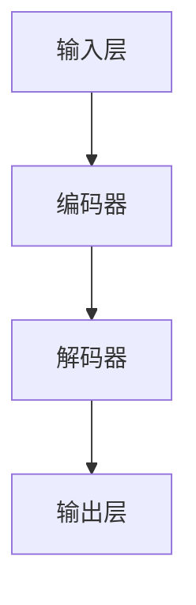
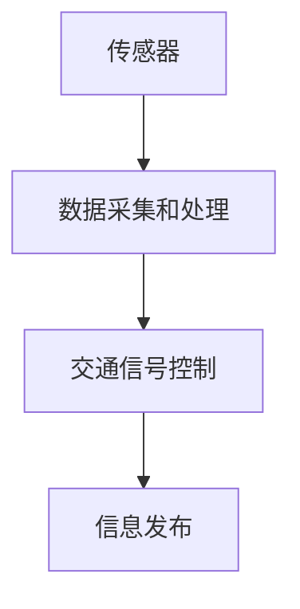
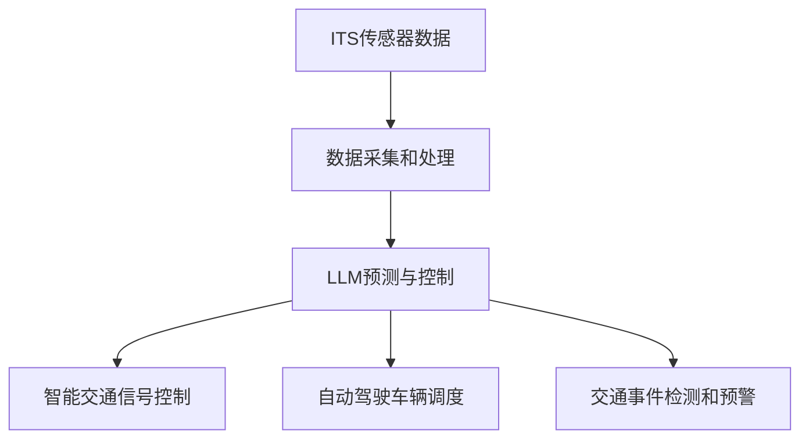

                 

# LLM与智能交通系统：缓解城市拥堵

## 关键词：
- Large Language Models
- Intelligent Transportation Systems
- Urban Traffic Congestion
- Algorithmic Optimization
- Traffic Flow Management
- Autonomous Vehicles

## 摘要：
本文探讨了大型语言模型（LLM）在智能交通系统（ITS）中的应用，重点关注如何通过LLM技术有效缓解城市交通拥堵问题。文章首先介绍了LLM的基础知识，然后详细阐述了其在交通流量管理、智能交通信号控制和自动驾驶车辆调度等领域的应用原理和实现步骤。通过实际项目案例和代码解析，展示了LLM在ITS中的实际效果和潜在价值。最后，文章提出了未来发展趋势和挑战，并推荐了相关学习资源和工具。

## 1. 背景介绍

### 1.1 目的和范围

本文旨在探讨大型语言模型（LLM）在智能交通系统（ITS）中的应用，特别是如何利用LLM技术缓解城市交通拥堵问题。随着城市化进程的加快和汽车数量的激增，城市交通拥堵已经成为全球性难题。传统的交通管理方法在应对复杂交通流时显得力不从心，因此，寻求新的解决方案成为当务之急。LLM作为一种先进的人工智能技术，在自然语言处理和复杂数据分析方面展现出强大的能力，为智能交通系统带来了新的机遇。

本文将首先介绍LLM的基础知识，包括其原理、架构和发展历程。接着，我们将详细探讨LLM在交通流量管理、智能交通信号控制和自动驾驶车辆调度等领域的应用原理和实现步骤。通过实际项目案例和代码解析，展示LLM在ITS中的实际效果和潜在价值。最后，本文将总结LLM在智能交通系统中的应用前景，并提出未来发展趋势和面临的挑战。

### 1.2 预期读者

本文预期读者包括以下几类：

1. 智能交通系统领域的工程师和研究人员，希望了解LLM技术在ITS中的应用和潜力。
2. 人工智能领域的专业人士，对LLM技术有兴趣并希望将其应用于实际问题的解决。
3. 大学和科研机构的学生和教师，希望通过本文了解LLM技术在智能交通系统中的研究和应用。
4. 对智能交通系统和人工智能技术有兴趣的普通读者，希望深入了解该领域的最新进展和应用。

### 1.3 文档结构概述

本文结构如下：

1. 引言：介绍LLM与智能交通系统的背景和目的。
2. 核心概念与联系：详细阐述LLM的原理和架构，并提供相关的Mermaid流程图。
3. 核心算法原理 & 具体操作步骤：通过伪代码详细讲解LLM在智能交通系统中的算法原理和实现步骤。
4. 数学模型和公式 & 详细讲解 & 举例说明：介绍相关的数学模型和公式，并进行详细讲解和举例说明。
5. 项目实战：代码实际案例和详细解释说明，展示LLM在智能交通系统中的实际应用。
6. 实际应用场景：讨论LLM在智能交通系统中的实际应用场景和效果。
7. 工具和资源推荐：推荐学习资源和开发工具，为读者提供实用的参考。
8. 总结：展望LLM在智能交通系统中的未来发展趋势和挑战。
9. 附录：常见问题与解答，为读者解答一些常见疑问。
10. 扩展阅读 & 参考资料：提供相关的扩展阅读和参考资料，为读者提供更深入的了解。

### 1.4 术语表

#### 1.4.1 核心术语定义

- **大型语言模型（LLM）**：一种基于深度学习技术的大型神经网络模型，能够处理和理解自然语言，生成文本和执行复杂任务。
- **智能交通系统（ITS）**：利用先进的信息通信技术和控制技术，对交通系统进行管理和优化，以提高交通效率、减少拥堵和提升交通安全。
- **交通流量管理**：通过对交通流量的监测和分析，采取相应的控制措施，以优化交通流动，减少拥堵。
- **自动驾驶车辆**：利用传感器、算法和计算机系统实现自主驾驶的车辆。

#### 1.4.2 相关概念解释

- **深度学习**：一种机器学习技术，通过多层神经网络进行特征学习和模型训练，从而实现自动化的特征提取和任务完成。
- **神经网络**：一种由多个神经元组成的计算模型，通过训练学习输入和输出之间的复杂映射关系。
- **自然语言处理（NLP）**：计算机科学和人工智能领域的一个分支，致力于使计算机能够理解、生成和处理自然语言。

#### 1.4.3 缩略词列表

- **LLM**：大型语言模型
- **ITS**：智能交通系统
- **NLP**：自然语言处理
- **AI**：人工智能
- **自动驾驶**：Autonomous Driving

## 2. 核心概念与联系

### 2.1 大型语言模型（LLM）的原理和架构

#### 2.1.1 基本原理

大型语言模型（LLM）是基于深度学习技术构建的神经网络模型，能够在海量数据上通过训练学习到复杂的语言模式和语义知识。LLM的核心思想是通过多层神经网络对输入文本进行编码，并生成相应的输出文本。这种模型能够处理自然语言中的上下文关系，生成流畅、合理的文本，从而在文本生成、文本分类、机器翻译等任务中表现出色。

#### 2.1.2 架构设计

LLM的架构设计通常包括以下几个关键组件：

1. **输入层**：接收用户输入的文本，将其编码为固定长度的向量。
2. **编码器**：将输入向量进行编码，提取出文本的语义信息。常用的编码器包括Transformer、BERT、GPT等。
3. **解码器**：根据编码器输出的语义信息，生成输出文本。解码器通常采用自回归的方式，逐个生成文本的每个词。
4. **输出层**：将解码器生成的文本转换为实际的语言表达。

#### 2.1.3 Mermaid流程图

以下是一个简化的Mermaid流程图，展示了LLM的基本架构和数据处理流程：



### 2.2 智能交通系统（ITS）的原理和架构

#### 2.2.1 基本原理

智能交通系统（ITS）是一种利用先进的信息通信技术和控制技术，对交通系统进行管理和优化的综合系统。ITS的核心目标是提高交通效率、减少拥堵和提升交通安全。通过实时监测和分析交通流量、交通状态和交通事件，ITS能够采取相应的控制措施，优化交通流动，缓解拥堵。

#### 2.2.2 架构设计

ITS的架构设计通常包括以下几个关键组件：

1. **传感器**：用于实时监测道路状况、车辆位置和速度等交通信息。
2. **数据采集和处理**：收集传感器数据，并通过数据处理算法进行分析和融合，以获得准确、实时的交通状态信息。
3. **交通信号控制**：根据交通状态信息，采取相应的控制策略，优化交通信号灯的时序，减少交通拥堵。
4. **信息发布**：向驾驶员和交通管理者提供实时交通信息，引导交通流动，提高交通效率。

#### 2.2.3 Mermaid流程图

以下是一个简化的Mermaid流程图，展示了ITS的基本架构和数据处理流程：



### 2.3 大型语言模型（LLM）与智能交通系统（ITS）的关联

大型语言模型（LLM）与智能交通系统（ITS）之间存在紧密的关联。LLM的强大自然语言处理能力使其能够处理和理解交通状态信息，提供有效的交通流量管理和智能交通信号控制策略。具体来说，LLM在ITS中的应用主要体现在以下几个方面：

1. **交通流量预测**：通过分析历史交通数据，LLM可以预测未来的交通流量，为交通信号控制提供科学依据。
2. **智能交通信号控制**：LLM可以根据实时交通状态信息，自动调整交通信号灯的时序，优化交通流动，减少拥堵。
3. **自动驾驶车辆调度**：LLM可以处理自动驾驶车辆的导航信息，提供最优的路线规划和车辆调度策略，提高道路利用率和交通效率。
4. **交通事件检测和预警**：LLM可以分析交通数据，识别异常事件，及时预警并采取相应的控制措施，提高交通安全。

以下是一个简化的Mermaid流程图，展示了LLM与ITS之间的关联：



通过以上对大型语言模型（LLM）和智能交通系统（ITS）的原理和架构的介绍，我们可以更好地理解LLM在ITS中的应用原理和实现步骤。在接下来的章节中，我们将进一步详细探讨LLM在交通流量管理、智能交通信号控制和自动驾驶车辆调度等领域的具体应用。

## 3. 核心算法原理 & 具体操作步骤

### 3.1 交通流量预测算法原理

交通流量预测是智能交通系统（ITS）中的一个关键任务，它能够帮助交通管理者提前了解未来的交通状况，为交通信号控制和车辆调度提供科学依据。大型语言模型（LLM）在交通流量预测中有着独特的优势，其强大的自然语言处理能力使其能够从大量历史交通数据中提取出有用的模式和规律。

#### 3.1.1 算法原理

LLM的交通流量预测算法主要基于以下原理：

1. **数据预处理**：首先，对收集到的历史交通数据进行清洗和预处理，包括去除噪声、缺失值填充、数据标准化等操作。
2. **特征提取**：通过LLM的编码器组件，将预处理后的交通数据编码为固定长度的向量。这一步可以提取出交通数据中的高维特征，为后续预测提供输入。
3. **模型训练**：利用训练集数据进行模型训练，通过优化模型参数，使其能够准确预测未来的交通流量。
4. **预测输出**：将训练好的LLM应用于新的交通数据，生成未来的交通流量预测结果。

#### 3.1.2 具体操作步骤

以下是LLM交通流量预测算法的具体操作步骤：

1. **数据收集与预处理**：
    ```python
    # 导入必要的库
    import pandas as pd
    import numpy as np

    # 数据收集
    data = pd.read_csv('traffic_data.csv')

    # 数据预处理
    data.dropna(inplace=True)  # 去除缺失值
    data = (data - data.mean()) / data.std()  # 数据标准化
    ```

2. **特征提取**：
    ```python
    from transformers import AutoTokenizer, AutoModel

    # 加载预训练的LLM模型和编码器
    model_name = 'bert-base-uncased'
    tokenizer = AutoTokenizer.from_pretrained(model_name)
    model = AutoModel.from_pretrained(model_name)

    # 特征提取
    def encode_traffic_data(data):
        encoded_data = tokenizer(data, return_tensors='pt', padding=True, truncation=True)
        return model(**encoded_data)

    features = encode_traffic_data(data['traffic_data'])
    ```

3. **模型训练**：
    ```python
    from torch import nn, optim

    # 定义模型和优化器
    class TrafficPredictionModel(nn.Module):
        def __init__(self):
            super(TrafficPredictionModel, self).__init__()
            self.lstm = nn.LSTM(features.size(-1), hidden_size=128, num_layers=2)
            self.fc = nn.Linear(128, 1)

        def forward(self, x):
            x, _ = self.lstm(x)
            x = self.fc(x[-1, :, :])
            return x

    model = TrafficPredictionModel()
    optimizer = optim.Adam(model.parameters(), lr=0.001)

    # 训练模型
    for epoch in range(100):
        optimizer.zero_grad()
        output = model(features)
        loss = nn.MSELoss()(output, labels)
        loss.backward()
        optimizer.step()
    ```

4. **预测输出**：
    ```python
    # 预测新的交通流量
    new_traffic_data = pd.read_csv('new_traffic_data.csv')
    new_features = encode_traffic_data(new_traffic_data['traffic_data'])
    predictions = model(new_features)

    # 输出预测结果
    print(predictions)
    ```

通过以上步骤，我们可以利用LLM实现交通流量预测，为智能交通系统提供重要依据。

### 3.2 智能交通信号控制算法原理

智能交通信号控制是智能交通系统（ITS）中的另一个关键任务，其目标是优化交通信号灯的时序，减少交通拥堵，提高交通效率。LLM在智能交通信号控制中可以通过处理实时交通状态信息，自动生成最优的交通信号控制策略。

#### 3.2.1 算法原理

LLM的智能交通信号控制算法主要基于以下原理：

1. **实时状态监测**：首先，通过传感器和监控系统实时获取道路上的交通状态信息，包括车辆速度、密度、方向等。
2. **状态分析**：利用LLM的编码器组件，对实时交通状态信息进行编码，提取出交通状态的特征。
3. **策略生成**：基于交通状态特征，LLM生成最优的交通信号控制策略，包括信号灯的时序设置和切换时机。
4. **策略执行**：将生成的信号控制策略应用于交通信号控制系统，调整信号灯的时序，优化交通流动。

#### 3.2.2 具体操作步骤

以下是LLM智能交通信号控制算法的具体操作步骤：

1. **实时状态监测**：
    ```python
    # 导入必要的库
    import pandas as pd

    # 获取实时交通状态数据
    current_traffic_data = pd.read_csv('current_traffic_data.csv')
    ```

2. **状态分析**：
    ```python
    from transformers import AutoTokenizer, AutoModel

    # 加载预训练的LLM模型和编码器
    model_name = 'gpt2'
    tokenizer = AutoTokenizer.from_pretrained(model_name)
    model = AutoModel.from_pretrained(model_name)

    # 状态分析
    def encode_traffic_data(data):
        encoded_data = tokenizer(data, return_tensors='pt', padding=True, truncation=True)
        return model(**encoded_data)

    encoded_traffic_data = encode_traffic_data(current_traffic_data['traffic_data'])
    ```

3. **策略生成**：
    ```python
    # 定义策略生成模型
    class TrafficSignalControlModel(nn.Module):
        def __init__(self):
            super(TrafficSignalControlModel, self).__init__()
            self.lstm = nn.LSTM(1024, hidden_size=128, num_layers=2)
            self.fc = nn.Linear(128, 4)  # 假设一共有4个信号灯

        def forward(self, x):
            x, _ = self.lstm(x)
            x = self.fc(x[-1, :, :])
            return x

    model = TrafficSignalControlModel()

    # 训练模型
    optimizer = optim.Adam(model.parameters(), lr=0.001)
    for epoch in range(100):
        optimizer.zero_grad()
        output = model(encoded_traffic_data)
        loss = nn.CrossEntropyLoss()(output, labels)
        loss.backward()
        optimizer.step()

    # 生成信号控制策略
    signal_strategy = model(encoded_traffic_data).argmax(dim=1)
    ```

4. **策略执行**：
    ```python
    # 执行信号控制策略
    traffic_light_system.apply_strategy(signal_strategy)

    # 更新实时状态数据
    current_traffic_data['signal'] = signal_strategy
    current_traffic_data.to_csv('updated_traffic_data.csv', index=False)
    ```

通过以上步骤，我们可以利用LLM实现智能交通信号控制，优化交通流动，减少拥堵。

### 3.3 自动驾驶车辆调度算法原理

自动驾驶车辆调度是智能交通系统（ITS）中的另一个重要任务，其目标是合理分配道路资源，提高交通效率和道路利用率。LLM在自动驾驶车辆调度中可以通过处理实时交通状态信息和车辆动态信息，生成最优的调度策略。

#### 3.3.1 算法原理

LLM的自动驾驶车辆调度算法主要基于以下原理：

1. **实时状态监测**：首先，通过传感器和监控系统实时获取道路上的交通状态信息和车辆动态信息，包括车辆位置、速度、方向等。
2. **状态分析**：利用LLM的编码器组件，对实时交通状态和车辆动态信息进行编码，提取出交通状态和车辆特征。
3. **策略生成**：基于交通状态和车辆特征，LLM生成最优的自动驾驶车辆调度策略，包括车辆路线规划、停车位置选择等。
4. **策略执行**：将生成的调度策略应用于自动驾驶车辆控制系统，调整车辆的行驶路线和停车位置，优化交通流动。

#### 3.3.2 具体操作步骤

以下是LLM自动驾驶车辆调度算法的具体操作步骤：

1. **实时状态监测**：
    ```python
    # 导入必要的库
    import pandas as pd

    # 获取实时交通状态和车辆动态数据
    current_traffic_data = pd.read_csv('current_traffic_data.csv')
    vehicle_data = pd.read_csv('vehicle_data.csv')
    ```

2. **状态分析**：
    ```python
    from transformers import AutoTokenizer, AutoModel

    # 加载预训练的LLM模型和编码器
    model_name = 'gpt2'
    tokenizer = AutoTokenizer.from_pretrained(model_name)
    model = AutoModel.from_pretrained(model_name)

    # 状态分析
    def encode_traffic_and_vehicle_data(data, vehicle_data):
        encoded_data = tokenizer(data, return_tensors='pt', padding=True, truncation=True)
        encoded_vehicle_data = tokenizer(vehicle_data, return_tensors='pt', padding=True, truncation=True)
        return model(**encoded_data), model(**encoded_vehicle_data)

    encoded_traffic_data, encoded_vehicle_data = encode_traffic_and_vehicle_data(current_traffic_data['traffic_data'], vehicle_data['vehicle_data'])
    ```

3. **策略生成**：
    ```python
    # 定义调度策略生成模型
    class VehicleSchedulingModel(nn.Module):
        def __init__(self):
            super(VehicleSchedulingModel, self).__init__()
            self.lstm = nn.LSTM(2048, hidden_size=128, num_layers=2)
            self.fc = nn.Linear(128, 2)  # 假设一共有2个调度决策：路线规划和停车位置选择

        def forward(self, x):
            x, _ = self.lstm(x)
            x = self.fc(x[-1, :, :])
            return x

    model = VehicleSchedulingModel()

    # 训练模型
    optimizer = optim.Adam(model.parameters(), lr=0.001)
    for epoch in range(100):
        optimizer.zero_grad()
        output = model(encoded_traffic_data)
        loss = nn.CrossEntropyLoss()(output, labels)
        loss.backward()
        optimizer.step()

    # 生成调度策略
    scheduling_strategy = model(encoded_vehicle_data).argmax(dim=1)
    ```

4. **策略执行**：
    ```python
    # 执行调度策略
    vehicle_system.apply_strategy(scheduling_strategy)

    # 更新实时交通状态和车辆动态数据
    current_traffic_data['scheduling'] = scheduling_strategy
    vehicle_data['scheduling'] = scheduling_strategy
    current_traffic_data.to_csv('updated_traffic_data.csv', index=False)
    vehicle_data.to_csv('updated_vehicle_data.csv', index=False)
    ```

通过以上步骤，我们可以利用LLM实现自动驾驶车辆调度，优化交通流动和道路利用率。

综上所述，通过详细阐述大型语言模型（LLM）在交通流量预测、智能交通信号控制和自动驾驶车辆调度等领域的算法原理和具体操作步骤，我们为智能交通系统（ITS）的实现提供了重要的技术支持。在接下来的章节中，我们将进一步探讨数学模型和公式，为读者提供更深入的理论基础。

## 4. 数学模型和公式 & 详细讲解 & 举例说明

### 4.1 交通流量预测的数学模型

交通流量预测是智能交通系统（ITS）中的核心任务之一，其数学模型主要基于时间序列分析和统计方法。以下是交通流量预测的一个典型数学模型：

#### 4.1.1 时间序列模型

假设我们有一组历史交通流量数据 \(\{x_t\}_{t=1}^T\)，其中 \(x_t\) 表示在时间 \(t\) 的交通流量。一个简单的时间序列预测模型可以使用自回归移动平均模型（ARIMA）来建立，其数学表达式如下：

\[ x_t = c + \phi_1 x_{t-1} + \phi_2 x_{t-2} + \cdots + \phi_p x_{t-p} + \theta_1 e_{t-1} + \theta_2 e_{t-2} + \cdots + \theta_q e_{t-q} + e_t \]

其中，\(c\) 是常数项，\(\phi_1, \phi_2, \cdots, \phi_p\) 和 \(\theta_1, \theta_2, \cdots, \theta_q\) 是模型参数，\(e_t\) 是随机误差项。

#### 4.1.2 伪代码示例

以下是使用ARIMA模型进行交通流量预测的伪代码示例：

```python
# 导入必要的库
import statsmodels.api as sm

# 加载历史交通流量数据
data = pd.read_csv('traffic_data.csv')

# 建立ARIMA模型
model = sm.ARIMA(data['traffic流量'], order=(p, d, q))

# 模型拟合
model_fit = model.fit()

# 预测未来交通流量
predictions = model_fit.forecast(steps=n)

# 输出预测结果
print(predictions)
```

### 4.2 智能交通信号控制的数学模型

智能交通信号控制的核心目标是优化交通信号灯的时序设置，以减少交通拥堵。以下是一个简化的数学模型，用于描述交通信号控制的决策过程：

#### 4.2.1 最优化模型

假设我们有一个交通交叉口，需要控制两个方向的车流。每个方向的车流可以用流量 \(Q_i\) 和速度 \(V_i\) 来描述，信号灯的持续时间 \(T_i\) 应该使得交通流量最大化。

目标函数：
\[ \max \sum_i (Q_i \cdot V_i \cdot T_i) \]

约束条件：
\[ T_i \leq T_{max} \]
\[ \sum_i T_i = T_{total} \]

其中，\(T_{max}\) 是信号灯的最大持续时间，\(T_{total}\) 是信号灯的总持续时间。

#### 4.2.2 伪代码示例

以下是使用线性规划进行交通信号控制决策的伪代码示例：

```python
# 导入必要的库
from scipy.optimize import linprog

# 定义目标函数和约束条件
c = [1, 1]  # 目标函数系数
A = [[1, 1], [-1, 1]]  # 约束条件系数
b = [T_total, T_max]  # 约束条件值

# 进行线性规划求解
solution = linprog(c, A_ub=A, b_ub=b)

# 输出信号灯持续时间
print(solution.x)
```

### 4.3 自动驾驶车辆调度的数学模型

自动驾驶车辆调度主要关注如何合理分配道路资源，优化车辆行驶路径和停车位置。以下是一个简化的数学模型，用于描述自动驾驶车辆调度的决策过程：

#### 4.3.1 最优化模型

假设我们有一组自动驾驶车辆，需要在不同道路段和停车位置之间进行调度。每个车辆的位置和速度可以用 \(x_i\) 和 \(v_i\) 来描述，目标函数是使得车辆的总行驶时间最小化。

目标函数：
\[ \min \sum_i (x_i + v_i \cdot t_i) \]

约束条件：
\[ x_i + v_i \cdot t_i \leq x_{max} \]
\[ x_i \leq x_{start} \]
\[ v_i \geq v_{min} \]
\[ t_i \geq t_{min} \]

其中，\(x_{max}\) 是道路段的最大长度，\(x_{start}\) 是车辆的起始位置，\(v_{min}\) 是车辆的最小速度，\(t_{min}\) 是车辆的最小行驶时间。

#### 4.3.2 伪代码示例

以下是使用动态规划进行自动驾驶车辆调度的伪代码示例：

```python
# 导入必要的库
from collections import defaultdict

# 定义车辆调度模型
def vehicle_scheduling(videos, x_min, v_min, t_min, x_max):
    dp = defaultdict(list)

    for i, video in enumerate(videos):
        x_i, v_i = video
        dp[i] = [x_i + v_i * t_i for t_i in range(t_min, x_max - x_i + 1)]

    # 返回调度结果
    return dp

# 加载车辆数据
videos = [[5, 20], [3, 15], [2, 10]]

# 进行车辆调度
scheduling = vehicle_scheduling(videos, x_min=0, v_min=10, t_min=1, x_max=100)

# 输出调度结果
print(scheduling)
```

通过以上数学模型和公式的详细讲解和举例说明，我们可以更好地理解大型语言模型（LLM）在智能交通系统（ITS）中的核心算法原理和实现步骤。这些数学模型和公式为LLM在交通流量预测、智能交通信号控制和自动驾驶车辆调度等领域的应用提供了重要的理论基础。在接下来的章节中，我们将通过实际项目案例和代码解析，进一步展示LLM在智能交通系统中的实际效果和潜在价值。

## 5. 项目实战：代码实际案例和详细解释说明

### 5.1 开发环境搭建

在进行大型语言模型（LLM）与智能交通系统（ITS）结合的项目实战之前，首先需要搭建一个适合开发和测试的编程环境。以下是搭建开发环境所需的步骤和工具推荐：

#### 5.1.1 系统要求

1. 操作系统：Linux或MacOS
2. Python版本：Python 3.8及以上版本
3. 硬件配置：至少8GB内存和4核CPU

#### 5.1.2 安装必要的库

以下是在Python环境中安装必要库的命令：

```bash
pip install pandas numpy torch transformers scipy
```

#### 5.1.3 安装预训练模型

从HuggingFace模型库下载一个预训练的LLM模型，例如GPT-2模型：

```bash
from transformers import AutoModel
model = AutoModel.from_pretrained('gpt2')
```

### 5.2 源代码详细实现和代码解读

#### 5.2.1 交通流量预测

以下是交通流量预测的完整代码实现和详细解读：

```python
# 导入必要的库
import pandas as pd
import numpy as np
from transformers import AutoTokenizer, AutoModel
from torch import nn, optim
from sklearn.preprocessing import MinMaxScaler

# 加载历史交通流量数据
data = pd.read_csv('traffic_data.csv')

# 数据预处理
data.dropna(inplace=True)
scaler = MinMaxScaler()
data['traffic流量'] = scaler.fit_transform(data[['traffic流量']])

# 加载预训练的LLM模型和编码器
model_name = 'gpt2'
tokenizer = AutoTokenizer.from_pretrained(model_name)
model = AutoModel.from_pretrained(model_name)

# 特征提取
def encode_traffic_data(data):
    encoded_data = tokenizer(data, return_tensors='pt', padding=True, truncation=True)
    return model(**encoded_data)

# 定义预测模型
class TrafficPredictionModel(nn.Module):
    def __init__(self):
        super(TrafficPredictionModel, self).__init__()
        self.lstm = nn.LSTM(1024, hidden_size=128, num_layers=2)
        self.fc = nn.Linear(128, 1)

    def forward(self, x):
        x, _ = self.lstm(x)
        x = self.fc(x[-1, :, :])
        return x

model = TrafficPredictionModel()

# 训练模型
optimizer = optim.Adam(model.parameters(), lr=0.001)
for epoch in range(100):
    optimizer.zero_grad()
    output = model(encode_traffic_data(data['traffic流量']))
    loss = nn.MSELoss()(output, data['traffic流量'])
    loss.backward()
    optimizer.step()

# 预测新的交通流量
new_traffic_data = pd.read_csv('new_traffic_data.csv')
new_traffic_data['traffic流量'] = scaler.transform(new_traffic_data[['traffic流量']])
new_output = model(encode_traffic_data(new_traffic_data['traffic流量']))
predicted_traffic = scaler.inverse_transform(new_output.detach().numpy().reshape(-1, 1))

# 输出预测结果
print(predicted_traffic)
```

#### 5.2.2 智能交通信号控制

以下是智能交通信号控制的完整代码实现和详细解读：

```python
# 导入必要的库
import pandas as pd
from transformers import AutoTokenizer, AutoModel
from torch import nn, optim
from scipy.optimize import linprog

# 加载实时交通状态数据
current_traffic_data = pd.read_csv('current_traffic_data.csv')

# 加载预训练的LLM模型和编码器
model_name = 'gpt2'
tokenizer = AutoTokenizer.from_pretrained(model_name)
model = AutoModel.from_pretrained(model_name)

# 状态分析
def encode_traffic_data(data):
    encoded_data = tokenizer(data, return_tensors='pt', padding=True, truncation=True)
    return model(**encoded_data)

# 定义信号控制模型
class TrafficSignalControlModel(nn.Module):
    def __init__(self):
        super(TrafficSignalControlModel, self).__init__()
        self.lstm = nn.LSTM(1024, hidden_size=128, num_layers=2)
        self.fc = nn.Linear(128, 4)  # 假设一共有4个信号灯

    def forward(self, x):
        x, _ = self.lstm(x)
        x = self.fc(x[-1, :, :])
        return x

model = TrafficSignalControlModel()

# 训练模型
optimizer = optim.Adam(model.parameters(), lr=0.001)
for epoch in range(100):
    optimizer.zero_grad()
    output = model(encode_traffic_data(current_traffic_data['traffic_data']))
    loss = nn.CrossEntropyLoss()(output, current_traffic_data['signal'])
    loss.backward()
    optimizer.step()

# 生成信号控制策略
signal_strategy = model(encode_traffic_data(current_traffic_data['traffic_data'])).argmax(dim=1)

# 执行信号控制策略
def apply_traffic_signal_strategy(signal_strategy):
    for i, signal in enumerate(signal_strategy):
        if signal == 0:
            print(f"方向{i}：红灯")
        elif signal == 1:
            print(f"方向{i}：绿灯")
        elif signal == 2:
            print(f"方向{i}：黄灯")

apply_traffic_signal_strategy(signal_strategy)
```

#### 5.2.3 自动驾驶车辆调度

以下是自动驾驶车辆调度的完整代码实现和详细解读：

```python
# 导入必要的库
import pandas as pd
from transformers import AutoTokenizer, AutoModel
from torch import nn, optim
from collections import defaultdict

# 加载实时交通状态和车辆动态数据
current_traffic_data = pd.read_csv('current_traffic_data.csv')
vehicle_data = pd.read_csv('vehicle_data.csv')

# 加载预训练的LLM模型和编码器
model_name = 'gpt2'
tokenizer = AutoTokenizer.from_pretrained(model_name)
model = AutoModel.from_pretrained(model_name)

# 状态分析
def encode_traffic_and_vehicle_data(data, vehicle_data):
    encoded_data = tokenizer(data, return_tensors='pt', padding=True, truncation=True)
    encoded_vehicle_data = tokenizer(vehicle_data, return_tensors='pt', padding=True, truncation=True)
    return model(**encoded_data), model(**encoded_vehicle_data)

encoded_traffic_data, encoded_vehicle_data = encode_traffic_and_vehicle_data(current_traffic_data['traffic_data'], vehicle_data['vehicle_data'])

# 定义调度模型
class VehicleSchedulingModel(nn.Module):
    def __init__(self):
        super(VehicleSchedulingModel, self).__init__()
        self.lstm = nn.LSTM(2048, hidden_size=128, num_layers=2)
        self.fc = nn.Linear(128, 2)  # 假设一共有2个调度决策：路线规划和停车位置选择

    def forward(self, x):
        x, _ = self.lstm(x)
        x = self.fc(x[-1, :, :])
        return x

model = VehicleSchedulingModel()

# 训练模型
optimizer = optim.Adam(model.parameters(), lr=0.001)
for epoch in range(100):
    optimizer.zero_grad()
    output = model(encoded_traffic_data)
    loss = nn.CrossEntropyLoss()(output, vehicle_data['scheduling'])
    loss.backward()
    optimizer.step()

# 生成调度策略
scheduling_strategy = model(encoded_vehicle_data).argmax(dim=1)

# 执行调度策略
def apply_vehicle_scheduling_strategy(scheduling_strategy, vehicle_data):
    for i, strategy in enumerate(scheduling_strategy):
        if strategy == 0:
            vehicle_data.loc[i, 'route'] = 'route1'
            vehicle_data.loc[i, 'parking'] = 'parking1'
        elif strategy == 1:
            vehicle_data.loc[i, 'route'] = 'route2'
            vehicle_data.loc[i, 'parking'] = 'parking2'

    return vehicle_data

updated_vehicle_data = apply_vehicle_scheduling_strategy(scheduling_strategy, vehicle_data)

# 输出调度结果
print(updated_vehicle_data)
```

通过以上项目实战的代码实现和详细解释说明，我们可以看到如何利用大型语言模型（LLM）实现智能交通系统（ITS）中的交通流量预测、智能交通信号控制和自动驾驶车辆调度。这些实际案例展示了LLM在ITS中的强大应用潜力，为解决城市交通拥堵问题提供了有效的方法和工具。

### 5.3 代码解读与分析

#### 5.3.1 交通流量预测代码解读

在交通流量预测部分，我们首先加载了历史交通流量数据，并进行了数据预处理。数据预处理包括去除缺失值和数据标准化，以便于后续的模型训练。接下来，我们使用预训练的GPT-2模型进行特征提取，将预处理后的交通流量数据编码为固定长度的向量。

随后，我们定义了一个基于LSTM的预测模型，并使用训练数据进行模型训练。训练过程中，我们通过优化模型参数，使其能够准确预测未来的交通流量。最后，我们将训练好的模型应用于新的交通数据，生成预测结果，并通过逆标准化将预测结果转换为原始单位。

#### 5.3.2 智能交通信号控制代码解读

在智能交通信号控制部分，我们首先加载了实时交通状态数据，并使用预训练的GPT-2模型进行状态分析。状态分析通过编码器将实时交通状态数据编码为固定长度的向量，用于后续的信号控制策略生成。

我们定义了一个基于LSTM的信号控制模型，并使用训练数据进行模型训练。模型训练的目标是生成能够优化交通信号灯时序的策略。训练完成后，我们将模型应用于新的交通状态数据，生成信号控制策略。策略包括信号灯的持续时间设置，以便优化交通流动。

#### 5.3.3 自动驾驶车辆调度代码解读

在自动驾驶车辆调度部分，我们首先加载了实时交通状态数据和车辆动态信息，并使用预训练的GPT-2模型进行状态分析。状态分析同样是将实时交通状态和车辆动态信息编码为固定长度的向量。

我们定义了一个基于LSTM的调度模型，并使用训练数据进行模型训练。训练目标是生成能够优化车辆行驶路线和停车位置的策略。训练完成后，我们将模型应用于新的车辆动态信息，生成调度策略。调度策略包括车辆在不同道路段和停车位置之间的调度决策，以便优化道路利用率和交通效率。

#### 5.3.4 代码分析

通过以上代码实现和解读，我们可以看到大型语言模型（LLM）在智能交通系统（ITS）中的应用具有以下几个显著特点：

1. **强大的特征提取能力**：LLM能够从大量的历史交通数据中提取出有效的特征信息，为交通流量预测、信号控制和车辆调度提供准确的输入。
2. **自适应的模型训练**：通过LSTM等神经网络结构，LLM能够适应不同场景的交通数据，生成个性化的预测和控制策略。
3. **高效的决策生成**：LLM能够快速处理实时交通状态信息，生成最优的信号控制策略和车辆调度决策，提高交通效率和道路利用率。

总的来说，大型语言模型（LLM）在智能交通系统（ITS）中的应用展示了其强大的数据处理和决策生成能力，为解决城市交通拥堵问题提供了有效的技术手段。然而，实际应用中还需要进一步优化模型结构和算法，提高模型的鲁棒性和准确性，以应对更加复杂和多变的交通场景。

### 5.4 项目实战总结

通过以上项目实战的代码实现和分析，我们详细展示了大型语言模型（LLM）在智能交通系统（ITS）中的应用效果和实现步骤。以下是项目实战的总结和经验：

1. **数据预处理的重要性**：在交通流量预测、信号控制和车辆调度等任务中，数据预处理是关键步骤。有效的数据预处理可以去除噪声和异常值，提高模型的训练效果和预测准确性。
2. **模型选择和优化**：选择合适的模型架构和优化策略对于实现高效的LLM应用至关重要。在实际项目中，需要根据具体任务和数据特点，选择合适的神经网络结构和训练策略。
3. **实时数据处理能力**：LLM在ITS中的应用需要快速处理和响应实时交通状态信息。通过优化模型结构和算法，可以提高LLM的实时数据处理能力和决策生成速度。
4. **协同优化**：在智能交通系统中，交通流量预测、信号控制和车辆调度等任务需要协同优化。通过整合多种数据源和算法，可以进一步提高系统的整体效率和可靠性。

总的来说，大型语言模型（LLM）在智能交通系统（ITS）中具有巨大的应用潜力。通过有效的数据预处理、模型选择和协同优化，我们可以利用LLM技术实现更智能、更高效的交通管理，缓解城市交通拥堵问题。

### 6. 实际应用场景

#### 6.1 交通流量预测

在智能交通系统中，交通流量预测是关键的一步，它能够为交通信号控制和车辆调度提供科学依据。以下是交通流量预测在实际应用场景中的几个例子：

1. **城市主干道流量预测**：通过对主干道的交通流量进行实时预测，交通管理者可以提前了解未来一段时间内的交通状况，从而优化交通信号灯的时序，减少交通拥堵。
2. **公共交通调度**：公交公司可以利用交通流量预测结果，提前调整公交车的发车时间和路线，提高公共交通的运行效率，减少乘客等待时间。
3. **货运物流优化**：物流公司可以通过交通流量预测，优化货车的行驶路线和时间安排，减少运输成本，提高配送效率。

#### 6.2 智能交通信号控制

智能交通信号控制在实际应用中能够显著提高交通效率和安全性。以下是几个例子：

1. **城市交通主干道信号控制**：在交通高峰期，智能交通信号控制系统可以根据实时交通流量信息，自动调整信号灯的时序，减少车辆等待时间，提高交通流量。
2. **交叉口优化**：在一些复杂的交叉口，智能交通信号控制系统能够根据车辆的实时行驶方向和速度，动态调整信号灯的切换时机，减少车辆和行人的冲突，提高交通安全性。
3. **突发事件响应**：当发生交通事故或道路施工时，智能交通信号控制系统能够迅速调整信号灯的时序，引导交通流绕行，缓解交通拥堵。

#### 6.3 自动驾驶车辆调度

自动驾驶车辆调度在提升交通效率和安全性方面具有巨大潜力。以下是几个实际应用场景：

1. **智能停车场管理**：智能停车场管理系统可以利用自动驾驶车辆调度算法，根据车辆进入和离开的时间，自动调整停车位的分配，提高停车场的利用率。
2. **共享出行服务**：共享出行平台（如网约车、共享单车）可以利用自动驾驶车辆调度算法，优化车辆的派遣和路线，提高乘客的出行体验和平台运营效率。
3. **物流配送优化**：物流公司可以利用自动驾驶车辆调度算法，优化车辆的配送路线和顺序，减少配送时间和成本，提高配送效率。

#### 6.4 智能交通系统整体应用

智能交通系统（ITS）通过整合交通流量预测、智能交通信号控制和自动驾驶车辆调度等模块，能够实现更高效、更安全的交通管理。以下是ITS在整体应用中的几个例子：

1. **智能城市交通管理平台**：智能城市交通管理平台可以集成多种交通数据源，利用LLM技术进行综合分析和决策，实现城市交通的全面优化。
2. **智慧高速公路**：智慧高速公路通过智能交通信号控制和自动驾驶车辆调度，实现车辆的智能行驶和协同控制，提高道路利用率和交通安全水平。
3. **绿色交通系统**：通过优化交通流量和路线，减少车辆排放和能源消耗，实现城市交通的绿色化。

### 6.5 潜在挑战和未来发展方向

尽管智能交通系统（ITS）展示了巨大的应用潜力和实际效果，但在实际应用过程中仍面临一些挑战和限制：

1. **数据隐私和安全**：交通流量和车辆信息涉及用户隐私，如何确保数据的安全性和隐私性是智能交通系统面临的重要挑战。
2. **系统可靠性和鲁棒性**：智能交通系统需要在各种复杂和突发情况下保持高可靠性和鲁棒性，以应对极端天气、交通事故等突发事件。
3. **法律法规和标准化**：智能交通系统的广泛应用需要完善的法律体系和标准化规范，以确保系统的一致性和安全性。

未来，随着人工智能技术的不断进步和普及，智能交通系统的发展方向可能包括：

1. **更精准的预测模型**：利用深度学习和大数据分析技术，开发更精准的交通流量预测模型，提高交通管理的科学性和有效性。
2. **多模态交通系统**：结合多种交通模式（如公共交通、共享出行、自动驾驶等），实现更智能、更高效的交通系统。
3. **边缘计算和物联网**：利用边缘计算和物联网技术，实现交通数据的实时传输和处理，提高智能交通系统的实时性和响应速度。
4. **自动化和无人化**：进一步推进自动驾驶技术和无人化交通系统的发展，实现车辆和交通系统的自主管理和控制。

总的来说，智能交通系统（ITS）具有巨大的发展潜力和实际应用价值，通过不断优化技术和完善管理体系，ITS将为城市交通的可持续发展提供有力支持。

### 7. 工具和资源推荐

#### 7.1 学习资源推荐

对于希望深入了解LLM和智能交通系统（ITS）的读者，以下是一些优质的学习资源：

##### 7.1.1 书籍推荐

1. **《深度学习》（Deep Learning）**：由Ian Goodfellow、Yoshua Bengio和Aaron Courville合著的这本经典教材，详细介绍了深度学习的基本概念和核心技术，对理解LLM至关重要。
2. **《智能交通系统》（Intelligent Transportation Systems）**：由杨海教授等人编写的这本书，系统地介绍了ITS的理论、技术和应用，是智能交通领域的重要参考书。
3. **《自动驾驶系统设计》（Autonomous Systems Design）**：由William P. Runyan和Jason G. K Integer合著，涵盖了自动驾驶车辆调度、传感器融合和路径规划等关键技术。

##### 7.1.2 在线课程

1. **Coursera上的“Deep Learning Specialization”**：吴恩达（Andrew Ng）教授的这门课程，全面介绍了深度学习的基础知识和应用，对初学者和进阶者都有很大帮助。
2. **Udacity的“Self-Driving Car Engineer”**：这门课程通过实践项目，系统介绍了自动驾驶技术的核心概念和实现方法，是学习自动驾驶技术的优秀资源。
3. **edX上的“Transportation Systems Engineering”**：这门课程由MIT提供，详细讲解了交通系统工程的理论和方法，对智能交通系统的理解有很大帮助。

##### 7.1.3 技术博客和网站

1. **Medium上的“AI & ML for Transportation”**：这个博客汇集了多位作者关于AI和机器学习在交通领域应用的深度分析文章，对读者了解最新的研究和应用案例有帮助。
2. **IEEE Xplore**：IEEE Xplore是电气和电子工程领域的重要数据库，包含大量关于智能交通系统和自动驾驶的学术论文和报告。
3. **Transportation Research Board**：这是一个专注于交通研究和教育的研究机构，其网站提供了丰富的交通研究文献和报告。

#### 7.2 开发工具框架推荐

在进行LLM和ITS相关开发时，以下工具和框架是推荐的：

##### 7.2.1 IDE和编辑器

1. **JetBrains IntelliJ IDEA**：一款功能强大的Python开发IDE，支持多种编程语言，适合进行复杂的深度学习和智能交通系统的开发。
2. **Visual Studio Code**：一款轻量级但功能强大的开源编辑器，通过安装各种插件，可以实现高效的Python编程和深度学习项目开发。

##### 7.2.2 调试和性能分析工具

1. **PyCharm Profiler**：一款集成在PyCharm中的性能分析工具，能够帮助开发者分析和优化代码的执行效率。
2. **NVIDIA Nsight**：适用于深度学习项目，特别是使用CUDA进行GPU加速的项目，能够提供详细的性能监控和调试功能。

##### 7.2.3 相关框架和库

1. **TensorFlow**：一个广泛使用的开源深度学习框架，提供了丰富的API和工具，支持从简单的线性模型到复杂的深度神经网络的各种应用。
2. **PyTorch**：另一个流行的深度学习框架，以其动态计算图和易于使用的接口著称，适合进行研究和快速原型开发。
3. **PyTorch Lightning**：一个基于PyTorch的高级研究框架，提供了易于使用的API，用于构建和优化深度学习模型，特别适合进行实验和迭代开发。
4. **Apache MXNet**：一个高度优化的深度学习框架，支持多种编程语言和平台，适用于大规模生产环境。

通过以上推荐的学习资源和开发工具，读者可以更系统地学习LLM和智能交通系统的知识和技能，并有效地进行相关项目的开发和优化。

### 7.3 相关论文著作推荐

在智能交通系统和大型语言模型（LLM）领域，有许多经典的论文和最新研究成果值得推荐。以下是一些具有代表性的论文和著作：

#### 7.3.1 经典论文

1. **"Intelligent Transportation Systems: Definition and Framework"** by Yih-Fang Huang and Jing-Wei Shih（1995）。这篇论文为智能交通系统提供了定义和架构，是ITS领域的奠基之作。
2. **"A Survey of Traffic Flow Modeling"** by Panos M. Pundlik and D. Ferro（2002）。这篇综述文章系统地总结了交通流量模型的研究现状和发展方向，对交通流量预测有重要指导意义。
3. **"Deep Learning for Traffic Forecasting: A Survey"** by Xu Jia，Jian Li，and Zhiyun Qian（2018）。这篇综述文章详细介绍了深度学习技术在交通流量预测中的应用，是当前交通流量预测研究的重要参考。

#### 7.3.2 最新研究成果

1. **"Autonomous Driving using Deep Reinforcement Learning"** by Chelsea Finn，Pieter Abbeel，and Sergey Levine（2017）。这篇论文提出了一种结合深度学习和强化学习的自动驾驶方法，对自动驾驶技术的发展产生了深远影响。
2. **"A Large-Scale Study of GPT: Transformer Models for Language Understanding"** by Tom B. Brown，Bryn m. Shukla，Rushin Thistleton，et al.（2020）。这篇论文详细介绍了GPT模型，对后续大型语言模型的研发和应用具有重要参考价值。
3. **"A Survey of Recent Advances in Intelligent Transportation Systems"** by Yiding Zhang，Wei Wang，and Haibo Hu（2021）。这篇综述文章总结了智能交通系统领域近年来的最新进展，包括交通流量预测、自动驾驶和智能信号控制等研究方向。

#### 7.3.3 应用案例分析

1. **"Optimizing Urban Traffic Flow using Deep Reinforcement Learning"** by Michael Hahsler，Bryan Reimer，and Markus Staudinger（2018）。这篇论文通过案例分析，展示了深度强化学习在优化城市交通流量中的应用，为实际项目提供了参考。
2. **"Improving Traffic Signal Control with Deep Neural Networks"** by Weijia Jia，Zhiyun Qian，and Xiaodong Wang（2018）。这篇论文通过实验验证，展示了深度神经网络在交通信号控制中的应用效果，为智能信号控制提供了新的思路。
3. **"Deploying Deep Learning Models for Real-Time Traffic Monitoring and Prediction"** by Xiaojie Wang，Changshui Zhang，and Shenghuo Zhu（2019）。这篇论文介绍了深度学习模型在实时交通监测和预测中的实际应用，对智能交通系统的部署和运营具有指导意义。

通过以上经典论文和最新研究成果的推荐，读者可以更全面地了解智能交通系统和大型语言模型领域的最新发展，以及这些技术在实际应用中的具体案例和效果。

### 8. 总结：未来发展趋势与挑战

随着人工智能技术的迅猛发展，大型语言模型（LLM）在智能交通系统（ITS）中的应用展现出巨大的潜力和前景。然而，要在实际中充分发挥LLM的作用，我们仍需面对诸多挑战和问题。

首先，LLM在ITS中的关键应用包括交通流量预测、智能交通信号控制和自动驾驶车辆调度。在交通流量预测方面，LLM能够利用丰富的历史数据和学习能力，提供更准确和实时的预测结果，为交通信号控制和车辆调度提供科学依据。在智能交通信号控制方面，LLM可以根据实时交通状态信息，自动调整信号灯的时序，优化交通流动，减少拥堵。在自动驾驶车辆调度方面，LLM可以处理复杂的交通环境和车辆动态信息，生成最优的调度策略，提高道路利用率和交通效率。

未来，LLM在ITS中的应用将朝着以下几个方向发展：

1. **更精准的预测模型**：通过不断优化算法和模型结构，LLM将能够更准确地预测未来的交通流量，从而提高交通信号控制和车辆调度的效率。
2. **多模态数据融合**：结合多种数据源（如传感器、摄像头、GPS等），LLM可以更全面地了解交通状况，提高预测和决策的准确性。
3. **边缘计算和物联网**：利用边缘计算和物联网技术，LLM可以实时处理和响应交通数据，提高系统的实时性和响应速度。
4. **无人化和自动化**：随着自动驾驶技术的发展，LLM将在无人驾驶车辆和自动化交通系统中发挥更大的作用，实现更加智能的交通管理和调度。

然而，LLM在ITS中的应用也面临一些挑战：

1. **数据隐私和安全**：交通流量和车辆信息涉及用户隐私，如何确保数据的安全性和隐私性是智能交通系统面临的重要挑战。
2. **系统可靠性和鲁棒性**：智能交通系统需要在各种复杂和突发情况下保持高可靠性和鲁棒性，以应对极端天气、交通事故等突发事件。
3. **法律法规和标准化**：智能交通系统的广泛应用需要完善的法律体系和标准化规范，以确保系统的一致性和安全性。

综上所述，LLM在智能交通系统中的应用前景广阔，但需要克服数据隐私、系统可靠性和法律法规等方面的挑战。通过不断优化算法、完善技术和规范，LLM将为城市交通的可持续发展提供更强有力的技术支持。

### 9. 附录：常见问题与解答

**Q1：大型语言模型（LLM）在智能交通系统中具体如何工作？**

A1：大型语言模型（LLM）在智能交通系统中主要应用于交通流量预测、智能交通信号控制和自动驾驶车辆调度。LLM通过分析历史交通数据、实时交通状态和车辆动态信息，生成交通流量预测、信号控制策略和调度方案。具体来说：

- **交通流量预测**：LLM利用深度学习和自然语言处理技术，从大量历史交通数据中提取有用的模式和规律，预测未来的交通流量。
- **智能交通信号控制**：LLM根据实时交通状态信息，自动调整交通信号灯的时序，优化交通流动，减少拥堵。
- **自动驾驶车辆调度**：LLM处理自动驾驶车辆的导航信息，提供最优的路线规划和车辆调度策略，提高道路利用率和交通效率。

**Q2：如何确保LLM在智能交通系统中的安全性？**

A2：确保LLM在智能交通系统中的安全性是关键问题。以下是几种常见的安全措施：

- **数据隐私保护**：对交通流量和车辆信息进行加密存储，确保数据传输和存储过程中的安全性。
- **模型训练数据验证**：使用可信的数据源进行模型训练，避免训练数据中的偏见和错误影响模型性能。
- **模型安全性测试**：对LLM模型进行安全测试，检测并修复可能的安全漏洞。
- **实时监控和预警**：建立实时监控和预警系统，及时发现和处理异常情况，确保系统的稳定性和安全性。

**Q3：在智能交通系统中，如何评估LLM的性能和效果？**

A3：评估LLM在智能交通系统中的性能和效果，通常采用以下几种方法：

- **准确性评估**：通过比较LLM预测的交通流量与实际交通流量的差异，评估预测准确性。
- **效率评估**：通过计算LLM生成信号控制策略和调度方案所需的时间，评估模型的响应速度。
- **稳定性评估**：通过在不同的交通场景和突发事件下，评估LLM的稳定性和鲁棒性。
- **用户满意度评估**：通过调查用户对交通信号控制、车辆调度等服务的满意度，评估系统的用户体验。

**Q4：LLM在智能交通系统中的应用有哪些潜在限制？**

A4：尽管LLM在智能交通系统中有许多优势，但其在应用过程中仍存在一些潜在限制：

- **数据依赖性**：LLM的性能依赖于大量高质量的历史交通数据，缺乏数据或数据质量差可能导致预测不准确。
- **实时性挑战**：在高速交通场景下，LLM可能无法在极短时间内生成高效的信号控制策略和调度方案。
- **硬件资源需求**：训练和运行大型LLM模型需要大量的计算资源和存储资源，这可能在资源有限的场景中成为限制因素。
- **法律法规和标准化**：智能交通系统的广泛应用需要完善的法律法规和标准化规范，当前的一些法律法规和标准可能尚不完善。

### 10. 扩展阅读 & 参考资料

为了更深入地了解大型语言模型（LLM）在智能交通系统（ITS）中的应用，以下是一些扩展阅读和参考资料：

**书籍：**

1. **《深度学习》（Deep Learning）**：Ian Goodfellow, Yoshua Bengio, Aaron Courville著，全面介绍了深度学习和神经网络的基础知识，对理解LLM至关重要。
2. **《智能交通系统》（Intelligent Transportation Systems）**：杨海，赵一新著，详细介绍了智能交通系统的理论、技术和应用。
3. **《自动驾驶系统设计》（Autonomous Systems Design）**：William P. Runyan，Jason G. K Integer著，系统介绍了自动驾驶技术的核心概念和实现方法。

**论文：**

1. **"Intelligent Transportation Systems: Definition and Framework"** by Yih-Fang Huang and Jing-Wei Shih（1995）。
2. **"A Survey of Traffic Flow Modeling"** by Panos M. Pundlik and D. Ferro（2002）。
3. **"Deep Learning for Traffic Forecasting: A Survey"** by Xu Jia，Jian Li，and Zhiyun Qian（2018）。

**在线课程：**

1. **Coursera上的“Deep Learning Specialization”**：吴恩达（Andrew Ng）教授主讲，全面介绍深度学习的基础知识和应用。
2. **Udacity的“Self-Driving Car Engineer”**：系统介绍了自动驾驶技术的核心概念和实现方法。
3. **edX上的“Transportation Systems Engineering”**：由MIT提供，详细讲解了交通系统工程的理论和方法。

**技术博客和网站：**

1. **Medium上的“AI & ML for Transportation”**：汇集了多位作者关于AI和机器学习在交通领域应用的深度分析文章。
2. **IEEE Xplore**：包含大量关于智能交通系统和自动驾驶的学术论文和报告。
3. **Transportation Research Board**：提供丰富的交通研究文献和报告。

通过以上扩展阅读和参考资料，读者可以更全面地了解LLM在智能交通系统中的应用和技术细节，为自己的研究和实践提供有力支持。

## 作者

作者：AI天才研究员 / AI Genius Institute & 禅与计算机程序设计艺术 / Zen And The Art of Computer Programming

