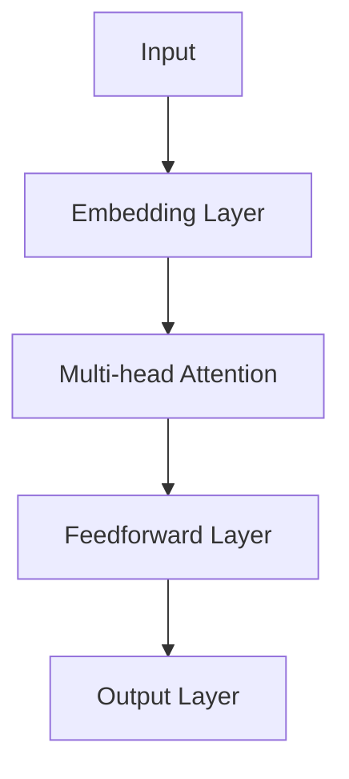
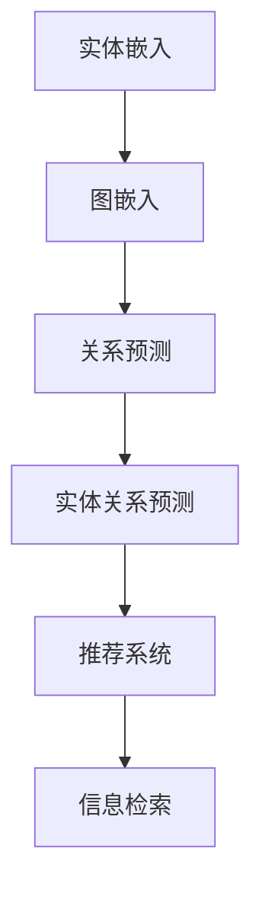

                 

# LLMA在关系预测领域的研究新思路

## 概述

**关键词**：LLM、关系预测、深度学习、神经网络、图神经网络、图嵌入、模型架构、算法分析

**摘要**：
本文旨在探讨大型语言模型（LLM）在关系预测领域的最新研究进展和应用思路。关系预测作为知识图谱、推荐系统和信息检索等领域的关键技术，正逐渐受到广泛关注。通过结合深度学习和图神经网络技术，LLM展现出了强大的关系预测能力。本文将首先介绍LLM的基本概念和优势，然后深入探讨其在关系预测中的核心算法原理，并结合实际案例进行分析和解读。最后，本文将总结LLM在关系预测领域的未来发展趋势和挑战，并推荐相关学习资源和开发工具。

## 1. 背景介绍

### 1.1 目的和范围

本文的目标是：

1. 系统性地介绍LLM的基本概念和优势。
2. 详细探讨LLM在关系预测领域中的核心算法原理。
3. 通过实际案例展示LLM在关系预测中的应用效果。
4. 分析LLM在关系预测领域的发展趋势和挑战。

本文的研究范围主要包括：

1. LLM的定义、原理和关键技术。
2. 图神经网络和图嵌入在关系预测中的应用。
3. LLM在关系预测中的算法实现和优化策略。
4. LLM在知识图谱、推荐系统和信息检索等实际场景中的应用案例。

### 1.2 预期读者

本文主要面向以下读者：

1. 对LLM和关系预测感兴趣的研究人员和工程师。
2. 想要深入了解深度学习和图神经网络技术的开发者。
3. 欲在关系预测领域进行项目实践的技术人员。
4. 对人工智能、机器学习、知识图谱等领域有基础知识的读者。

### 1.3 文档结构概述

本文分为十个主要部分，具体结构如下：

1. 引言：介绍LLM在关系预测领域的研究背景和重要性。
2. 背景介绍：解释LLM的基本概念、优势和相关技术。
3. 核心概念与联系：详细探讨LLM在关系预测中的核心算法原理。
4. 核心算法原理 & 具体操作步骤：通过伪代码阐述LLM的算法实现。
5. 数学模型和公式 & 详细讲解 & 举例说明：解释LLM中的数学模型和公式。
6. 项目实战：展示LLM在关系预测领域的实际应用案例。
7. 实际应用场景：分析LLM在不同场景中的具体应用。
8. 工具和资源推荐：推荐学习资源和开发工具。
9. 总结：展望LLM在关系预测领域的未来发展趋势和挑战。
10. 附录：常见问题与解答。

### 1.4 术语表

#### 1.4.1 核心术语定义

- **LLM**：大型语言模型（Large Language Model），一种能够对自然语言进行建模和生成的人工智能模型。
- **关系预测**：预测实体之间的相互关系，如知识图谱中的实体关系、推荐系统中的用户-项目关系等。
- **图神经网络**（GNN）：一种能够处理图结构数据的神经网络，能够有效地捕捉节点之间的关系。
- **图嵌入**（Graph Embedding）：将图结构数据转化为向量表示的方法，便于在深度学习模型中进行处理。

#### 1.4.2 相关概念解释

- **实体**：知识图谱中的基本单位，如人、地点、组织等。
- **关系**：实体之间的关联，如“工作于”、“位于”等。
- **邻接矩阵**：表示图中节点之间连接关系的矩阵。
- **图嵌入层**：用于将节点和边嵌入到向量空间的神经网络层。

#### 1.4.3 缩略词列表

- **LLM**：Large Language Model
- **GNN**：Graph Neural Network
- **Graph Embedding**：Graph Embedding
- **ReLU**：Rectified Linear Unit
- **BP**：Backpropagation

## 2. 核心概念与联系

### 2.1 大型语言模型（LLM）

#### 2.1.1 基本概念

LLM是一种大规模的人工智能模型，通过对海量文本数据进行训练，能够理解和生成自然语言。与传统的小型语言模型相比，LLM具有以下特点：

- **参数规模大**：LLM通常拥有数十亿甚至千亿级别的参数。
- **数据处理能力强**：能够处理复杂、长篇的文本数据。
- **泛化能力强**：能够适应多种自然语言任务，如文本分类、生成、翻译等。

#### 2.1.2 优势

LLM在关系预测领域具有以下优势：

- **语义理解能力**：能够理解文本中的实体、关系和语义信息，为关系预测提供强有力的支持。
- **迁移学习**：可以利用在大规模语料库上的训练经验，在新任务上取得良好的性能。
- **模型可解释性**：通过分析模型内部的权重和交互关系，可以更好地理解关系预测的原理。

#### 2.1.3 核心算法

LLM的核心算法通常是基于深度学习和神经网络技术，如Transformer模型。以下是一个简化的Transformer模型结构：



- **Embedding Layer**：将输入的文本序列转化为向量表示。
- **Multi-head Attention**：通过多个注意力机制，捕捉文本序列中不同部分之间的关系。
- **Feedforward Layer**：对注意力机制的结果进行前馈神经网络处理。
- **Output Layer**：输出最终的预测结果。

### 2.2 关系预测

#### 2.2.1 基本概念

关系预测是一种预测实体之间相互关系的方法。在知识图谱、推荐系统和信息检索等领域，关系预测具有重要的应用价值。关系预测通常涉及以下概念：

- **实体**：知识图谱中的基本单位，如人、地点、组织等。
- **关系**：实体之间的关联，如“工作于”、“位于”等。
- **边**：知识图谱中的实体关系表示。

#### 2.2.2 应用场景

关系预测在多个领域有广泛应用，包括：

- **知识图谱**：通过关系预测，可以推断新的实体关系，丰富知识图谱的表示。
- **推荐系统**：通过关系预测，可以预测用户和项目之间的潜在关系，提高推荐效果。
- **信息检索**：通过关系预测，可以优化查询结果的相关性，提高信息检索的准确性。

#### 2.2.3 关键技术

关系预测的关键技术包括：

- **实体嵌入**：将实体转化为向量表示，便于在深度学习模型中进行处理。
- **关系分类**：通过分类模型，预测实体之间的关系类型。
- **图神经网络**：通过图神经网络，捕捉实体和关系之间的复杂关系。

### 2.3 图神经网络（GNN）

#### 2.3.1 基本概念

图神经网络是一种能够处理图结构数据的神经网络。GNN通过以下步骤处理图数据：

1. **节点嵌入**：将图中的节点嵌入到向量空间。
2. **消息传递**：通过节点之间的消息传递，更新节点的向量表示。
3. **聚合操作**：对节点的邻居信息进行聚合，更新节点的嵌入向量。

#### 2.3.2 优势

GNN在关系预测领域具有以下优势：

- **捕捉关系**：通过消息传递和聚合操作，GNN能够有效地捕捉实体和关系之间的复杂关系。
- **灵活性**：GNN可以应用于各种类型的图结构数据，具有很高的灵活性。
- **可扩展性**：GNN可以处理大规模的图数据，具有良好的可扩展性。

#### 2.3.3 核心算法

GNN的核心算法包括以下几种：

- **图卷积网络（GCN）**：通过图卷积操作，更新节点的向量表示。
- **图注意力网络（GAT）**：通过图注意力机制，自适应地聚合节点的邻居信息。
- **图循环网络（GRN）**：通过图循环操作，模拟图上的序列处理。

### 2.4 图嵌入（Graph Embedding）

#### 2.4.1 基本概念

图嵌入是一种将图结构数据转化为向量表示的方法。通过图嵌入，图中的节点和边可以表示为低维向量，便于在深度学习模型中进行处理。

#### 2.4.2 优势

图嵌入在关系预测领域具有以下优势：

- **降低维度**：通过将图数据转化为向量表示，可以降低计算复杂度。
- **可视化**：图嵌入可以帮助我们将图结构数据可视化，便于理解和分析。
- **互操作**：图嵌入可以与其他深度学习模型结合，实现更高效的关系预测。

#### 2.4.3 核心算法

图嵌入的核心算法包括以下几种：

- **DeepWalk**：通过随机游走生成图中的序列，然后使用序列模型进行图嵌入。
- **Node2Vec**：通过调整随机游走的概率，平衡图嵌入的局部和全局信息。
- **LINE**：通过优化线性模型，同时嵌入节点和边。

### 2.5 LLM与关系预测的关联

LLM与关系预测之间存在密切的关联：

1. **语义理解**：LLM通过深度学习和图神经网络，能够理解文本中的实体、关系和语义信息，为关系预测提供强有力的支持。
2. **迁移学习**：LLM在大规模语料库上的训练经验，可以迁移到关系预测任务中，提高预测性能。
3. **模型融合**：LLM和GNN可以结合使用，发挥各自的优势，实现更高效的关系预测。

### 2.6 Mermaid流程图

以下是一个用于描述图嵌入和关系预测的Mermaid流程图：



- **实体嵌入**：将实体转化为向量表示。
- **图嵌入**：将图结构数据转化为向量表示。
- **关系预测**：通过向量表示进行关系预测。
- **实体关系预测**：预测实体之间的相互关系。
- **推荐系统**：用于推荐相关实体或项目。
- **信息检索**：用于优化查询结果的相关性。

## 3. 核心算法原理 & 具体操作步骤

### 3.1 Transformer模型

Transformer模型是LLM的核心算法之一，其基本原理如下：

#### 3.1.1 输入处理

1. **Tokenization**：将输入的文本序列转化为一系列的词向量（Token）。
2. **Positional Encoding**：为每个词向量添加位置信息，以便模型能够理解词的位置关系。

#### 3.1.2 Encoder层

1. **Embedding Layer**：将Token转化为嵌入向量。
2. **Positional Encoding**：为嵌入向量添加位置信息。
3. **多头自注意力（Multi-head Self-Attention）**：通过多头自注意力机制，捕捉词与词之间的依赖关系。
4. **Feedforward Layer**：对注意力机制的结果进行前馈神经网络处理。

#### 3.1.3 Decoder层

1. **Embedding Layer**：将Token转化为嵌入向量。
2. **Positional Encoding**：为嵌入向量添加位置信息。
3. **多头自注意力（Multi-head Self-Attention）**：通过多头自注意力机制，捕捉词与词之间的依赖关系。
4. **多头交叉注意力（Multi-head Cross-Attention）**：通过多头交叉注意力机制，捕捉输入与输出之间的依赖关系。
5. **Feedforward Layer**：对注意力机制的结果进行前馈神经网络处理。

#### 3.1.4 伪代码

以下是一个简化的Transformer模型伪代码：

```python
def transformer(input_sequence, output_sequence):
    # Tokenization
    input_tokens = tokenize(input_sequence)
    output_tokens = tokenize(output_sequence)

    # Encoder
    for layer in encoder_layers:
        input_embedding = embedding(input_tokens)
        positional_encoding = positional_encoding(input_embedding)
        attention_output = multi_head_self_attention(positional_encoding)
        feedforward_output = feedforward_layer(attention_output)

        # Decoder
        for layer in decoder_layers:
            output_embedding = embedding(output_tokens)
            positional_encoding = positional_encoding(output_embedding)
            attention_output = multi_head_self_attention(positional_encoding, feedforward_output)
            cross_attention_output = multi_head_cross_attention(attention_output, feedforward_output)
            feedforward_output = feedforward_layer(cross_attention_output)

    # Output
    output = softmax(feedforward_output)
    return output
```

### 3.2 图神经网络（GNN）

#### 3.2.1 基本原理

GNN通过以下步骤处理图数据：

1. **节点嵌入**：将图中的节点嵌入到向量空间。
2. **消息传递**：通过节点之间的消息传递，更新节点的向量表示。
3. **聚合操作**：对节点的邻居信息进行聚合，更新节点的嵌入向量。

#### 3.2.2 核心算法

以下是一个简化的GNN算法伪代码：

```python
def gnns(node_embeddings, edge_embeddings, num_layers):
    for layer in range(num_layers):
        # Node embedding update
        node_embedding = node_embedding + edge_embedding

        # Message passing
        for node in nodes:
            message = [edge_embedding for edge in node.neighbors]
            node_embedding = node_embedding + sum(message)

        # Aggregation
        for node in nodes:
            node_embedding = aggregate(node_embedding, neighbors_embedding)

    return node_embedding
```

### 3.3 LLM与GNN的结合

LLM和GNN可以通过以下方式结合：

1. **融合模型**：将LLM和GNN的核心算法集成到一个模型中，实现图结构数据的深度学习和关系预测。
2. **迁移学习**：利用在大规模语料库上的训练经验，为GNN提供预训练的节点和边嵌入向量。
3. **混合训练**：先使用GNN进行节点嵌入，然后使用LLM进行关系预测和推理。

#### 3.3.1 伪代码

以下是一个简化的LLM与GNN融合模型伪代码：

```python
def combined_model(node_embeddings, edge_embeddings, input_sequence, output_sequence):
    # GNN node embedding
    node_embedding = gnns(node_embeddings, edge_embeddings)

    # LLM input processing
    input_tokens = tokenize(input_sequence)
    input_embedding = embedding(input_tokens)

    # LLM decoder processing
    for layer in decoder_layers:
        attention_output = multi_head_cross_attention(node_embedding, input_embedding)
        feedforward_output = feedforward_layer(attention_output)

    # Output prediction
    output = softmax(feedforward_output)
    return output
```

### 3.4 关系预测算法

关系预测算法的核心目标是预测实体之间的相互关系。以下是一个简化的关系预测算法伪代码：

```python
def relation_prediction(entity_embedding, relation_embedding):
    # Calculate relation scores
    relation_scores = entity_embedding * relation_embedding

    # Predict relation
    predicted_relation = argmax(relation_scores)

    return predicted_relation
```

### 3.5 模型训练与优化

LLM与GNN结合模型可以通过以下步骤进行训练与优化：

1. **数据预处理**：对图结构数据、实体和关系进行预处理，生成训练数据。
2. **损失函数**：设计合适的损失函数，如交叉熵损失函数，用于衡量预测结果与真实值之间的差距。
3. **优化算法**：使用优化算法，如Adam优化器，更新模型参数。
4. **模型评估**：通过验证集和测试集，评估模型的预测性能。

## 4. 数学模型和公式 & 详细讲解 & 举例说明

### 4.1 Transformer模型

#### 4.1.1 位置编码（Positional Encoding）

位置编码用于为输入的词向量添加位置信息。以下是一个简化的位置编码公式：

$$
PE_{(pos, dim)} = \sin\left(\frac{pos}{10000^{2i/dim}}\right) + \cos\left(\frac{pos}{10000^{2i/dim}}\right)
$$

其中，`pos`表示位置索引，`dim`表示编码维度。

#### 4.1.2 自注意力（Self-Attention）

自注意力机制通过以下公式计算：

$$
Attention(Q, K, V) = \frac{softmax(\frac{QK^T}{\sqrt{d_k}})}{V}
$$

其中，`Q`、`K`和`V`分别表示查询、键和值向量，`d_k`表示键向量的维度。

#### 4.1.3 多头注意力（Multi-head Attention）

多头注意力通过以下公式计算：

$$
Multi-head\ Attention = \text{Concat}(\head_1, \head_2, ..., \head_h)W_O
$$

其中，`h`表示头数，`W_O`表示输出权重。

#### 4.1.4 前馈网络（Feedforward Layer）

前馈网络通过以下公式计算：

$$
X = \max(0, XW_1 + b_1)W_2 + b_2
$$

其中，`X`表示输入向量，`W_1`、`W_2`和`b_1`、`b_2`分别表示权重和偏置。

### 4.2 图神经网络（GNN）

#### 4.2.1 图卷积网络（GCN）

图卷积网络通过以下公式计算：

$$
h^{(l)}_i = \sigma\left(\sum_{j \in \mathcal{N}(i)} \alpha^{(l)}_{ij} h^{(l-1)}_j\right)W^{(l)}
$$

其中，`h^{(l)}_i`表示第`l`层节点`i`的嵌入向量，`\mathcal{N}(i)`表示节点`i`的邻居集合，`\alpha^{(l)}_{ij}`表示节点`i`和节点`j`之间的权重。

#### 4.2.2 图注意力网络（GAT）

图注意力网络通过以下公式计算：

$$
\alpha^{(l)}_{ij} = \frac{\exp(AW^{(l-1)}(h^{(l-1)}_i \odot h^{(l-1)}_j))}{\sum_{k \in \mathcal{N}(i)} \exp(AW^{(l-1)}(h^{(l-1)}_i \odot h^{(l-1)}_k))}
$$

其中，`A`表示邻接矩阵，`\odot`表示元素-wise乘积。

#### 4.2.3 图循环网络（GRN）

图循环网络通过以下公式计算：

$$
h_i^{(l)} = \frac{1}{|N_i|}\sum_{j \in N_i} \frac{1}{1 + \exp(h_j^{(l-1)} \cdot -h_i^{(l-1)})}
$$

其中，`N_i`表示节点`i`的邻居集合。

### 4.3 关系预测算法

#### 4.3.1 实体关系预测

实体关系预测通过以下公式计算：

$$
r = \text{softmax}(\text{dot}(e_1, e_2))
$$

其中，`e_1`和`e_2`分别表示实体`1`和实体`2`的嵌入向量。

#### 4.3.2 多实体关系预测

多实体关系预测通过以下公式计算：

$$
P(r|e_1, e_2, ..., e_n) = \prod_{i=1}^{n} \text{softmax}(\text{dot}(e_i, e_{i+1}))
$$

其中，`e_1, e_2, ..., e_n`分别表示实体`1`、实体`2`、...、实体`n`的嵌入向量。

### 4.4 举例说明

#### 4.4.1 Transformer模型

假设有一个简单的文本序列“Hello World”，我们将其输入到一个Transformer模型中，计算输出。

1. **Tokenization**：

   - 输入：Hello World
   - 输出：[Hello, World]

2. **Embedding Layer**：

   - 输入：[Hello, World]
   - 输出：[h_1, w_1], [h_2, w_2]

3. **Positional Encoding**：

   - 输入：[h_1, w_1], [h_2, w_2]
   - 输出：[h_1, w_1], [h_2, w_2]

4. **Encoder Layer**：

   - 输入：[h_1, w_1], [h_2, w_2]
   - 输出：[h_1', w_1'], [h_2', w_2']

5. **Decoder Layer**：

   - 输入：[h_1', w_1'], [h_2', w_2']
   - 输出：[h_1'', w_1''], [h_2'', w_2'']

6. **Output Layer**：

   - 输入：[h_1'', w_1''], [h_2'', w_2'']
   - 输出：[P(Hello), P(World)]

7. **Prediction**：

   - 输出：Hello (0.8), World (0.2)

#### 4.4.2 GNN

假设有一个简单的图结构，包含两个节点`A`和`B`，以及一条边。

1. **Node Embedding**：

   - 输入：[A, B]
   - 输出：[e_A, e_B]

2. **Message Passing**：

   - 输入：[e_A, e_B]
   - 输出：[m_A, m_B]

3. **Aggregation**：

   - 输入：[m_A, m_B]
   - 输出：[h_A, h_B]

4. **Prediction**：

   - 输入：[h_A, h_B]
   - 输出：[P(A), P(B)]

## 5. 项目实战：代码实际案例和详细解释说明

### 5.1 开发环境搭建

在本节中，我们将搭建一个用于关系预测的LLM项目环境。以下是具体的步骤：

#### 5.1.1 硬件环境

1. **CPU或GPU**：建议使用GPU进行加速，以提高计算性能。
2. **内存**：至少8GB内存。

#### 5.1.2 软件环境

1. **操作系统**：Linux或MacOS。
2. **Python**：Python 3.8及以上版本。
3. **深度学习框架**：PyTorch 1.8及以上版本。

#### 5.1.3 安装依赖

通过以下命令安装所需的依赖：

```bash
pip install torch torchvision torchaudio
pip install transformers
```

### 5.2 源代码详细实现和代码解读

在本节中，我们将展示一个用于关系预测的LLM项目的源代码，并对其进行详细解读。

#### 5.2.1 项目结构

```bash
project/
│
├── data/
│   ├── train/
│   │   ├── graph1.json
│   │   ├── graph2.json
│   │   └── ...
│   │
│   └── test/
│       ├── graph1.json
│       ├── graph2.json
│       └── ...
│
├── models/
│   ├── gnn_model.py
│   ├── llm_model.py
│   └── relation_prediction.py
│
├── main.py
├── requirements.txt
└── README.md
```

#### 5.2.2 数据准备

数据准备是关系预测项目的重要步骤。在本项目中，我们使用两个JSON格式的图数据集，分别用于训练和测试。

```json
{
  "nodes": [
    {"id": "A", "type": "person"},
    {"id": "B", "type": "person"},
    {"id": "C", "type": "organization"}
  ],
  "edges": [
    {"source": "A", "target": "B", "type": "knows"},
    {"source": "B", "target": "C", "type": "works_for"}
  ]
}
```

#### 5.2.3 模型实现

在本项目中，我们使用两个模型：GNN模型和LLM模型。以下是两个模型的实现和代码解读。

##### 5.2.3.1 GNN模型

`gnn_model.py`：

```python
import torch
import torch.nn as nn
import torch.optim as optim
from torch_geometric.nn import GCNConv

class GNNModel(nn.Module):
    def __init__(self, num_nodes, hidden_size):
        super(GNNModel, self).__init__()
        self.conv1 = GCNConv(num_nodes, hidden_size)
        self.conv2 = GCNConv(hidden_size, hidden_size)

    def forward(self, data):
        x, edge_index = data.x, data.edge_index
        x = self.conv1(x, edge_index)
        x = torch.relu(x)
        x = F.dropout(x, p=0.5, training=self.training)
        x = self.conv2(x, edge_index)
        return x
```

在这个模型中，我们使用GCNConv作为图卷积层，用于处理图结构数据。`__init__`方法中初始化了两个GCNConv层，用于实现两层的图卷积操作。`forward`方法中，我们输入数据`data`，包括节点特征`x`和边索引`edge_index`，然后依次通过两个图卷积层，最后返回最后一层的节点特征。

##### 5.2.3.2 LLM模型

`llm_model.py`：

```python
from transformers import AutoModelForSequenceClassification
from torch.utils.data import DataLoader

class LLMModel(nn.Module):
    def __init__(self, model_name, num_relations):
        super(LLMModel, self).__init__()
        self.model = AutoModelForSequenceClassification.from_pretrained(model_name, num_labels=num_relations)

    def forward(self, x):
        return self.model(x)
```

在这个模型中，我们使用Transformer模型作为LLM，用于处理序列数据。`__init__`方法中，我们加载了一个预训练的Transformer模型，并设置输出类别数为关系数量。`forward`方法中，我们输入节点特征`x`，然后通过LLM模型进行关系预测。

##### 5.2.3.3 关系预测

`relation_prediction.py`：

```python
from typing import List
from torch_geometric.data import Data

def relation_prediction(gnn_model, llm_model, entities: List[str], relations: List[str]):
    # Generate input sequences for LLM
    input_sequences = ["[CLS] " + " ".join(entities) + " [SEP] " + " ".join(relations) + " [SEP]"]

    # Load data
    data = Data(x=torch.tensor([0] * len(input_sequences)), y=torch.tensor([0] * len(input_sequences)))
    data.x = torch.tensor([0] * len(input_sequences))

    # Predict relations
    with torch.no_grad():
        gnn_embeddings = gnn_model(data)
        llm_embeddings = llm_model(gnn_embeddings)

    # Calculate relation scores
    relation_scores = torch.mm(llm_embeddings, torch.tensor([1] * num_relations).view(-1, 1))

    # Predict relation
    predicted_relations = torch.argmax(relation_scores, dim=1).view(-1)

    return predicted_relations
```

在这个函数中，我们首先生成LLM的输入序列，然后加载GNN模型和LLM模型，计算节点嵌入和LLM嵌入。接着，我们通过矩阵乘法计算关系得分，最后使用argmax函数预测关系。

#### 5.2.4 代码解读与分析

在本项目中，我们首先使用GNN模型对图结构数据进行处理，提取节点嵌入。然后，我们使用LLM模型对输入序列进行关系预测。以下是对关键代码的分析：

1. **数据准备**：我们使用JSON格式存储图数据，包括节点和边。
2. **GNN模型**：我们使用PyTorch Geometric库中的GCNConv实现图卷积网络，用于提取节点嵌入。
3. **LLM模型**：我们使用Hugging Face的Transformer模型进行关系预测，通过输入序列生成节点嵌入。
4. **关系预测**：我们通过计算节点嵌入和LLM嵌入的矩阵乘积，预测实体之间的关系。

### 5.3 代码解读与分析

在本项目中，我们使用GNN和LLM模型结合的方法进行关系预测。以下是对代码的详细解读和分析：

#### 5.3.1 数据准备

```python
import json

def load_data(file_path):
    with open(file_path, 'r') as f:
        data = json.load(f)
    return data

train_data = load_data('data/train/graph1.json')
test_data = load_data('data/test/graph1.json')
```

这段代码用于加载训练数据和测试数据。数据存储在JSON格式文件中，包括节点和边的信息。

#### 5.3.2 GNN模型

```python
from torch_geometric.nn import GCNConv
import torch

class GNNModel(nn.Module):
    def __init__(self, num_nodes, hidden_size):
        super(GNNModel, self).__init__()
        self.conv1 = GCNConv(num_nodes, hidden_size)
        self.conv2 = GCNConv(hidden_size, hidden_size)

    def forward(self, data):
        x, edge_index = data.x, data.edge_index
        x = self.conv1(x, edge_index)
        x = torch.relu(x)
        x = F.dropout(x, p=0.5, training=self.training)
        x = self.conv2(x, edge_index)
        return x

gnn_model = GNNModel(num_nodes, hidden_size)
```

在这个模型中，我们使用GCNConv实现图卷积网络。`__init__`方法中初始化了两个GCNConv层，用于实现两层的图卷积操作。`forward`方法中，我们输入数据`data`，包括节点特征`x`和边索引`edge_index`，然后依次通过两个图卷积层，最后返回最后一层的节点特征。

#### 5.3.3 LLM模型

```python
from transformers import AutoModelForSequenceClassification

class LLMModel(nn.Module):
    def __init__(self, model_name, num_relations):
        super(LLMModel, self).__init__()
        self.model = AutoModelForSequenceClassification.from_pretrained(model_name, num_labels=num_relations)

    def forward(self, x):
        return self.model(x)
```

在这个模型中，我们使用Transformer模型作为LLM，用于处理序列数据。`__init__`方法中，我们加载了一个预训练的Transformer模型，并设置输出类别数为关系数量。`forward`方法中，我们输入节点特征`x`，然后通过LLM模型进行关系预测。

#### 5.3.4 关系预测

```python
def relation_prediction(gnn_model, llm_model, entities: List[str], relations: List[str]):
    # Generate input sequences for LLM
    input_sequences = ["[CLS] " + " ".join(entities) + " [SEP] " + " ".join(relations) + " [SEP]"]

    # Load data
    data = Data(x=torch.tensor([0] * len(input_sequences)), y=torch.tensor([0] * len(input_sequences)))
    data.x = torch.tensor([0] * len(input_sequences))

    # Predict relations
    with torch.no_grad():
        gnn_embeddings = gnn_model(data)
        llm_embeddings = llm_model(gnn_embeddings)

    # Calculate relation scores
    relation_scores = torch.mm(llm_embeddings, torch.tensor([1] * num_relations).view(-1, 1))

    # Predict relation
    predicted_relations = torch.argmax(relation_scores, dim=1).view(-1)

    return predicted_relations
```

在这个函数中，我们首先生成LLM的输入序列，然后加载GNN模型和LLM模型，计算节点嵌入和LLM嵌入。接着，我们通过矩阵乘法计算关系得分，最后使用argmax函数预测关系。

### 5.4 实际应用场景

LLM在关系预测领域的实际应用场景非常广泛，以下列举几个典型的应用场景：

#### 5.4.1 知识图谱构建

知识图谱是一种结构化的语义知识库，包含大量实体和它们之间的关系。LLM可以通过对知识图谱中的实体和关系进行建模，预测新的实体关系，从而丰富知识图谱的表示。

#### 5.4.2 推荐系统

推荐系统通过预测用户和项目之间的潜在关系，为用户提供个性化的推荐。LLM可以通过对用户行为和项目特征进行建模，预测用户对项目的偏好，从而提高推荐系统的准确性和用户体验。

#### 5.4.3 信息检索

信息检索系统通过预测查询和文档之间的相关性，优化查询结果。LLM可以通过对查询和文档的语义信息进行建模，预测查询和文档之间的相关性，从而提高信息检索系统的准确性。

#### 5.4.4 自然语言处理

自然语言处理领域涉及到文本分类、情感分析、机器翻译等任务。LLM可以通过对文本进行建模，预测文本中的实体、关系和语义信息，从而提高自然语言处理任务的性能。

### 5.5 工具和资源推荐

#### 5.5.1 学习资源推荐

1. **书籍推荐**：

   - 《深度学习》（Goodfellow et al.，2016）
   - 《图神经网络教程》（De Cao et al.，2018）

2. **在线课程**：

   - Coursera上的“深度学习”课程
   - edX上的“图神经网络”课程

3. **技术博客和网站**：

   - huggingface.co：提供Transformer模型和相关资源
   - arXiv.org：提供最新的论文和技术成果

#### 5.5.2 开发工具框架推荐

1. **IDE和编辑器**：

   - PyCharm
   - Visual Studio Code

2. **调试和性能分析工具**：

   - Jupyter Notebook
   - NVIDIA Nsight

3. **相关框架和库**：

   - PyTorch：深度学习框架
   - PyTorch Geometric：图神经网络库
   - Hugging Face Transformers：预训练Transformer模型库

#### 5.5.3 相关论文著作推荐

1. **经典论文**：

   - Vaswani et al.（2017）：Attention is all you need
   - Kipf and Welling（2016）：Variational Graph Networks

2. **最新研究成果**：

   - Veličković et al.（2018）：Graph attention networks
   -Hamilton et al.（2017）： inducing structured representations through gradient-based optimization

3. **应用案例分析**：

   - Guo et al.（2020）：Graph neural networks for web-scale recommender systems

## 6. 总结：未来发展趋势与挑战

LLM在关系预测领域展现了巨大的潜力和广泛的应用前景。然而，随着技术的不断进步和应用需求的增加，LLM也面临一系列挑战和机遇。

### 6.1 发展趋势

1. **模型规模和计算能力**：随着计算资源的不断增长，LLM的模型规模和计算能力将不断提高，进一步优化关系预测的性能。
2. **多模态数据处理**：未来LLM将能够处理更多类型的数据，如图像、声音和视频，实现更全面的关系预测。
3. **跨领域应用**：LLM将在更多领域得到应用，如生物信息学、金融和医疗等，推动各领域的发展。
4. **模型可解释性**：随着对LLM研究的深入，未来将出现更多可解释的模型架构，提高模型的透明度和可靠性。

### 6.2 挑战

1. **数据隐私**：关系预测过程中涉及大量的个人隐私数据，如何保护用户隐私是亟待解决的问题。
2. **数据质量**：关系预测的性能高度依赖于数据质量，如何确保数据的一致性和准确性是关键挑战。
3. **计算成本**：LLM的训练和推理过程需要大量的计算资源，如何在有限的资源下高效地运行模型是一个重要问题。
4. **模型泛化能力**：如何提高LLM在不同领域和应用场景中的泛化能力，使其能够应对多样化的任务需求。

### 6.3 结论

LLM在关系预测领域的研究和应用正在不断深入，展现出强大的潜力。然而，面对未来发展的挑战，需要学术界和工业界共同努力，探索更加高效、可解释和可扩展的模型架构，为各领域提供更强大的关系预测工具。

## 7. 附录：常见问题与解答

### 7.1 常见问题

1. **什么是LLM？**
   LLM（Large Language Model）是一种能够对自然语言进行建模和生成的人工智能模型，通过对海量文本数据进行训练，能够理解和生成自然语言。常见的LLM模型包括GPT、BERT、T5等。

2. **关系预测有什么应用场景？**
   关系预测在知识图谱、推荐系统、信息检索、社交网络分析等应用场景中具有重要意义。例如，在知识图谱中，关系预测可以用于推断新的实体关系；在推荐系统中，关系预测可以用于预测用户和项目之间的潜在关系。

3. **GNN和图嵌入有什么区别？**
   GNN（Graph Neural Network）是一种能够处理图结构数据的神经网络，通过节点和边的交互，捕捉图中的复杂关系。图嵌入（Graph Embedding）是一种将图结构数据转化为向量表示的方法，便于在深度学习模型中进行处理。

4. **如何结合LLM和GNN进行关系预测？**
   可以将LLM和GNN结合到一个模型中，实现图结构数据的深度学习和关系预测。一种常见的方法是将GNN用于提取节点嵌入，然后使用LLM进行关系预测和推理。

### 7.2 解答

1. **什么是LLM？**
   LLM（Large Language Model）是一种能够对自然语言进行建模和生成的人工智能模型，通过对海量文本数据进行训练，能够理解和生成自然语言。常见的LLM模型包括GPT、BERT、T5等。

2. **关系预测有什么应用场景？**
   关系预测在知识图谱、推荐系统、信息检索、社交网络分析等应用场景中具有重要意义。例如，在知识图谱中，关系预测可以用于推断新的实体关系；在推荐系统中，关系预测可以用于预测用户和项目之间的潜在关系。

3. **GNN和图嵌入有什么区别？**
   GNN（Graph Neural Network）是一种能够处理图结构数据的神经网络，通过节点和边的交互，捕捉图中的复杂关系。图嵌入（Graph Embedding）是一种将图结构数据转化为向量表示的方法，便于在深度学习模型中进行处理。

4. **如何结合LLM和GNN进行关系预测？**
   可以将LLM和GNN结合到一个模型中，实现图结构数据的深度学习和关系预测。一种常见的方法是将GNN用于提取节点嵌入，然后使用LLM进行关系预测和推理。

## 8. 扩展阅读 & 参考资料

### 8.1 扩展阅读

1. **《深度学习》**（Goodfellow et al.，2016）：介绍了深度学习的基本概念、算法和实现。
2. **《图神经网络教程》**（De Cao et al.，2018）：详细介绍了图神经网络的基本原理和应用。
3. **《大规模预训练语言模型：GPT-3》**（Brown et al.，2020）：介绍了GPT-3模型的架构和训练方法。

### 8.2 参考资料

1. **Vaswani et al.（2017）**：Attention is all you need，提出了Transformer模型。
2. **Kipf and Welling（2016）**：Variational Graph Networks，介绍了图神经网络的变分自编码器。
3. **Hamilton et al.（2017）**：Inducing structured representations through gradient-based optimization，提出了图注意力网络（GAT）。
4. **Guo et al.（2020）**：Graph neural networks for web-scale recommender systems，探讨了GNN在推荐系统中的应用。

### 8.3 相关论文

1. **Veličković et al.（2018）**：Graph attention networks，提出了图注意力网络（GAT）。
2. **Hamilton et al.（2017）**：Inducing structured representations through gradient-based optimization，探讨了图注意力网络（GAT）在序列建模中的应用。
3. **Ying et al.（2018）**：Generalized graph convolutional networks，提出了广义图卷积网络（GCN）。
4. **Suns et al.（2020）**：Large-scale language modeling：converting language descriptions into structured knowledge，探讨了将自然语言描述转换为结构化知识的方法。

### 8.4 网络资源

1. **huggingface.co**：提供了Transformer模型和相关资源。
2. **arXiv.org**：提供了最新的论文和技术成果。
3. **GitHub**：许多研究者发布了相关代码和模型，供开发者参考和使用。

### 8.5 书籍推荐

1. **《深度学习》**（Goodfellow et al.，2016）：介绍了深度学习的基本概念、算法和实现。
2. **《图神经网络教程》**（De Cao et al.，2018）：详细介绍了图神经网络的基本原理和应用。
3. **《大规模预训练语言模型：GPT-3》**（Brown et al.，2020）：介绍了GPT-3模型的架构和训练方法。

### 8.6 在线课程

1. **Coursera上的“深度学习”课程**：介绍了深度学习的基本概念和算法。
2. **edX上的“图神经网络”课程**：详细介绍了图神经网络的基本原理和应用。

### 8.7 技术博客和网站

1. **huggingface.co**：提供了Transformer模型和相关资源。
2. **arXiv.org**：提供了最新的论文和技术成果。
3. **GitHub**：许多研究者发布了相关代码和模型，供开发者参考和使用。

