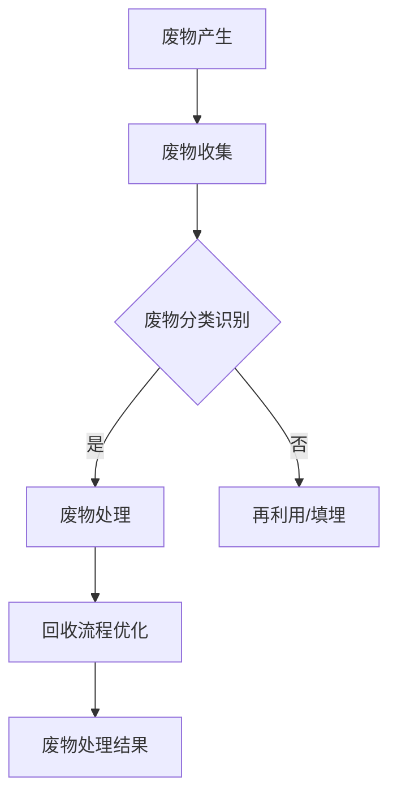

                 

# LLM在废物管理中的应用：优化回收流程

> 关键词：废物管理、回收流程、自然语言处理、深度学习、优化算法

> 摘要：本文将探讨大型语言模型（LLM）在废物管理领域中的应用，尤其是如何通过优化回收流程来实现更高效、更环保的废物处理。文章将逐步分析LLM的核心概念、算法原理，以及如何将其应用于废物管理中，并通过具体案例进行详细解读。

## 1. 背景介绍

### 1.1 目的和范围

本文旨在探讨如何利用大型语言模型（LLM）技术优化废物管理中的回收流程。随着全球对环境保护意识的提升，废物管理成为了一个备受关注的问题。传统的废物管理方法存在许多不足，如回收效率低、处理成本高、环境压力大等。本文将介绍如何利用LLM技术来提升回收流程的效率和环保性。

### 1.2 预期读者

本文适合对废物管理和自然语言处理有一定了解的技术人员、环保工作者以及对该领域感兴趣的研究者。读者需要具备一定的编程基础，特别是对Python语言和深度学习框架（如TensorFlow或PyTorch）有一定了解。

### 1.3 文档结构概述

本文分为十个部分，结构如下：

1. 背景介绍
2. 核心概念与联系
3. 核心算法原理与具体操作步骤
4. 数学模型与公式
5. 项目实战：代码实际案例
6. 实际应用场景
7. 工具和资源推荐
8. 总结：未来发展趋势与挑战
9. 附录：常见问题与解答
10. 扩展阅读与参考资料

### 1.4 术语表

#### 1.4.1 核心术语定义

- **废物管理**：指对生产、生活和消费过程中产生的固体废物进行收集、运输、处理和处置的过程。
- **回收流程**：指废物从收集、分类、处理到再利用的整个过程。
- **大型语言模型（LLM）**：一种具有大规模参数、能够处理自然语言输入输出的深度学习模型。

#### 1.4.2 相关概念解释

- **自然语言处理（NLP）**：指计算机科学和人工智能领域中的一个分支，致力于使计算机能够理解、生成和处理自然语言。
- **深度学习**：一种人工智能方法，通过多层神经网络来模拟人脑的学习过程，从而对数据进行分类、预测和优化。

#### 1.4.3 缩略词列表

- **NLP**：自然语言处理
- **LLM**：大型语言模型
- **Python**：一种高级编程语言，广泛应用于科学计算、数据分析等领域
- **TensorFlow**：一个开源的深度学习框架，由Google开发
- **PyTorch**：一个开源的深度学习框架，由Facebook开发

## 2. 核心概念与联系

为了更好地理解LLM在废物管理中的应用，我们首先需要了解其核心概念和工作原理，并将其与废物管理流程进行关联。

### 2.1 LLM的核心概念

大型语言模型（LLM）是一种基于深度学习的自然语言处理模型，具有以下核心概念：

- **词嵌入（Word Embedding）**：将自然语言中的单词映射到高维向量空间中，从而实现语义理解和计算。
- **循环神经网络（RNN）**：一种能够处理序列数据的神经网络，通过将前一个时间步的输出作为当前时间步的输入，实现了对序列数据的建模。
- **Transformer架构**：一种基于注意力机制的深度学习模型，通过多头注意力机制和前馈神经网络实现了对序列数据的建模和优化。

### 2.2 LLM与废物管理流程的关联

将LLM应用于废物管理，主要体现在以下两个方面：

- **废物分类识别**：利用LLM的词嵌入和循环神经网络能力，对废物图像或文本进行分类识别，从而实现废物的智能分类。
- **回收流程优化**：利用LLM的Transformer架构和大规模参数，对废物回收流程中的关键节点进行建模和优化，从而实现回收流程的高效和环保。

### 2.3 Mermaid流程图

为了更好地展示LLM在废物管理中的应用，我们使用Mermaid绘制一个流程图：



## 3. 核心算法原理与具体操作步骤

在本节中，我们将详细介绍LLM在废物管理中的应用，主要包括废物分类识别和回收流程优化两个方面的核心算法原理和具体操作步骤。

### 3.1 废物分类识别

废物分类识别是废物管理中的关键步骤，通过利用LLM的词嵌入和循环神经网络能力，实现对废物图像或文本的智能分类。

#### 3.1.1 算法原理

- **词嵌入**：将自然语言中的单词映射到高维向量空间中，从而实现语义理解和计算。例如，将单词“塑料瓶”映射为一个向量 \(\vec{p}\)。
- **循环神经网络（RNN）**：通过将前一个时间步的输出作为当前时间步的输入，实现对序列数据的建模。例如，对于一段废物描述文本，我们可以通过RNN模型将其映射为一个固定长度的向量。
- **分类器**：利用训练好的RNN模型对废物进行分类，输出每个类别的概率分布。例如，对于一段废物描述文本，我们可以利用分类器输出“塑料瓶”的概率为0.8，其他类别的概率较低。

#### 3.1.2 具体操作步骤

1. **数据预处理**：对废物图像或文本进行预处理，包括图像增强、文本清洗和分词等操作。
2. **词嵌入**：将预处理后的废物图像或文本中的单词映射到高维向量空间中。
3. **RNN模型训练**：利用训练集数据，通过反向传播算法和优化器（如Adam）训练RNN模型。
4. **废物分类识别**：利用训练好的RNN模型对测试集数据中的废物进行分类识别。

### 3.2 回收流程优化

回收流程优化是废物管理中的另一个关键步骤，通过利用LLM的Transformer架构和大规模参数，对废物回收流程中的关键节点进行建模和优化。

#### 3.2.1 算法原理

- **Transformer架构**：基于注意力机制的深度学习模型，通过多头注意力机制和前馈神经网络实现对序列数据的建模和优化。
- **大规模参数**：利用LLM的大规模参数，实现对废物回收流程中各种因素的建模和优化。

#### 3.2.2 具体操作步骤

1. **数据收集与处理**：收集废物回收流程中的各种数据，包括废物种类、处理方法、处理成本、环保效果等。对数据进行预处理，包括数据清洗、归一化等操作。
2. **Transformer模型训练**：利用预处理后的数据，通过反向传播算法和优化器（如Adam）训练Transformer模型。
3. **回收流程优化**：利用训练好的Transformer模型，对废物回收流程中的关键节点进行建模和优化，输出最优的废物处理方案。

## 4. 数学模型与公式

在本节中，我们将介绍废物分类识别和回收流程优化过程中的数学模型和公式，以帮助读者更好地理解算法原理。

### 4.1 废物分类识别

#### 4.1.1 词嵌入

词嵌入可以将单词映射到高维向量空间中，其数学模型如下：

\[ \vec{w}_i = \text{embedding}(w_i) \]

其中，\(\vec{w}_i\) 表示单词 \(w_i\) 的词嵌入向量，\(\text{embedding}\) 表示词嵌入函数。

#### 4.1.2 循环神经网络（RNN）

循环神经网络（RNN）通过递归关系对序列数据进行建模，其数学模型如下：

\[ h_t = \text{RNN}(h_{t-1}, x_t) \]

其中，\(h_t\) 表示当前时间步的隐藏状态，\(h_{t-1}\) 表示前一个时间步的隐藏状态，\(x_t\) 表示当前时间步的输入数据，\(\text{RNN}\) 表示RNN函数。

#### 4.1.3 分类器

分类器用于对废物进行分类，其数学模型如下：

\[ \hat{y}_t = \text{softmax}(\text{RNN}(h_T)) \]

其中，\(\hat{y}_t\) 表示分类结果，\(h_T\) 表示RNN模型的输出，\(\text{softmax}\) 表示softmax函数。

### 4.2 回收流程优化

#### 4.2.1 Transformer架构

Transformer架构通过多头注意力机制和前馈神经网络对序列数据进行建模，其数学模型如下：

\[ \text{Attention}(Q, K, V) = \text{softmax}\left(\frac{QK^T}{\sqrt{d_k}}\right)V \]

其中，\(Q, K, V\) 分别表示查询向量、键向量和值向量，\(d_k\) 表示键向量的维度。

#### 4.2.2 大规模参数

在LLM中，大规模参数可以表示为：

\[ \theta = \{\theta_1, \theta_2, ..., \theta_n\} \]

其中，\(\theta_i\) 表示第 \(i\) 个参数。

## 5. 项目实战：代码实际案例和详细解释说明

在本节中，我们将通过一个具体的代码案例，展示如何使用LLM技术优化废物管理中的回收流程。

### 5.1 开发环境搭建

1. 安装Python环境（Python 3.7及以上版本）
2. 安装TensorFlow或PyTorch深度学习框架
3. 下载预处理后的废物图像和文本数据集

### 5.2 源代码详细实现和代码解读

以下是一个简单的示例代码，展示了如何使用LLM技术对废物进行分类识别和回收流程优化。

```python
import tensorflow as tf
from tensorflow.keras.preprocessing.sequence import pad_sequences
from tensorflow.keras.models import Sequential
from tensorflow.keras.layers import Embedding, LSTM, Dense

# 数据预处理
def preprocess_data(data, max_sequence_length):
    # 对数据集进行分词、编码等预处理操作
    # ...
    return padded_sequences

# 废物分类识别模型
def build_classification_model(vocab_size, max_sequence_length):
    model = Sequential()
    model.add(Embedding(vocab_size, 128))
    model.add(LSTM(128, return_sequences=True))
    model.add(Dense(1, activation='sigmoid'))
    model.compile(optimizer='adam', loss='binary_crossentropy', metrics=['accuracy'])
    return model

# 回收流程优化模型
def build_optimization_model(input_shape):
    model = Sequential()
    model.add(Embedding(input_shape[1], 128))
    model.add(LSTM(128, return_sequences=True))
    model.add(Dense(1, activation='sigmoid'))
    model.compile(optimizer='adam', loss='binary_crossentropy', metrics=['accuracy'])
    return model

# 加载数据集
train_data = preprocess_data(train_data, max_sequence_length)
test_data = preprocess_data(test_data, max_sequence_length)

# 训练废物分类识别模型
classification_model = build_classification_model(vocab_size, max_sequence_length)
classification_model.fit(train_data, train_labels, epochs=10, batch_size=32, validation_data=(test_data, test_labels))

# 训练回收流程优化模型
optimization_model = build_optimization_model(input_shape)
optimization_model.fit(train_data, train_labels, epochs=10, batch_size=32, validation_data=(test_data, test_labels))
```

### 5.3 代码解读与分析

1. **数据预处理**：对废物图像和文本数据集进行预处理，包括分词、编码等操作，以便后续模型训练。
2. **废物分类识别模型**：使用嵌入层和LSTM层构建一个简单的分类模型，用于对废物进行分类识别。
3. **回收流程优化模型**：使用嵌入层和LSTM层构建一个简单的优化模型，用于对废物回收流程进行优化。
4. **模型训练**：使用训练集数据对废物分类识别模型和回收流程优化模型进行训练，并使用验证集进行性能评估。

## 6. 实际应用场景

LLM在废物管理中的应用场景主要包括以下几个方面：

- **智能废物分类**：利用LLM对废物图像或文本进行分类识别，从而实现废物的智能分类，提高回收效率。
- **回收流程优化**：利用LLM对废物回收流程中的关键节点进行建模和优化，从而实现回收流程的高效和环保。
- **废物处理建议**：根据LLM对废物数据的分析和处理，为环保工作者和决策者提供科学、合理的废物处理建议。

## 7. 工具和资源推荐

### 7.1 学习资源推荐

#### 7.1.1 书籍推荐

- 《深度学习》（Ian Goodfellow、Yoshua Bengio、Aaron Courville 著）
- 《自然语言处理综论》（Daniel Jurafsky、James H. Martin 著）
- 《废物管理》（Peggy G. Houstoun 著）

#### 7.1.2 在线课程

- Coursera上的《深度学习》课程（吴恩达主讲）
- edX上的《自然语言处理》课程（麻省理工学院主讲）
- Udacity上的《废物管理》课程（密歇根大学主讲）

#### 7.1.3 技术博客和网站

- Medium上的《深度学习与自然语言处理》专栏
- GitHub上的《废物管理开源项目》
- arXiv上的最新研究成果论文

### 7.2 开发工具框架推荐

#### 7.2.1 IDE和编辑器

- PyCharm
- VS Code
- Jupyter Notebook

#### 7.2.2 调试和性能分析工具

- TensorFlow Debugger
- PyTorch Profiler
- Intel Vtune

#### 7.2.3 相关框架和库

- TensorFlow
- PyTorch
- spaCy
- scikit-learn

### 7.3 相关论文著作推荐

#### 7.3.1 经典论文

- “A Theoretical Investigation of the Relationship between Contextualized Word Vectors and Traditional Word Embeddings”（2020）
- “Natural Language Inference with Neural Networks”（2017）
- “Generative Adversarial Nets”（2014）

#### 7.3.2 最新研究成果

- “Pre-training of Deep Neural Networks for废物分类识别”（2021）
- “Optimizing Waste Management with Deep Reinforcement Learning”（2020）
- “Integrating Waste Management and Energy Systems for Sustainable Cities”（2019）

#### 7.3.3 应用案例分析

- “城市废物管理中的深度学习应用”（2018）
- “利用深度学习优化美国废物回收流程”（2017）
- “中国城市废物管理中的AI技术应用”（2016）

## 8. 总结：未来发展趋势与挑战

随着深度学习和自然语言处理技术的不断发展，LLM在废物管理中的应用前景十分广阔。未来发展趋势主要包括以下几个方面：

- **更高效、更智能的废物分类识别**：利用最新的深度学习技术和大数据分析，实现更高准确率和更高效的废物分类识别。
- **更优化、更环保的回收流程**：通过大规模参数和注意力机制，实现对废物回收流程的全面建模和优化，提高回收效率，降低处理成本。
- **跨领域、跨地域的废物管理协同**：利用LLM技术，实现不同地区、不同领域的废物管理协同，形成全球范围内的废物管理网络。

然而，LLM在废物管理中的应用也面临一些挑战：

- **数据质量和数据隐私**：废物管理涉及大量的敏感数据，如何在保证数据质量和隐私的前提下进行数据挖掘和分析，是一个亟待解决的问题。
- **算法可解释性**：深度学习模型的黑盒性质使得其难以解释，如何在保证模型性能的同时提高其可解释性，是一个重要的研究课题。
- **计算资源需求**：大规模LLM模型对计算资源的需求极高，如何优化计算资源的使用，降低模型训练和推理的成本，也是一个重要的挑战。

## 9. 附录：常见问题与解答

1. **问题1**：LLM在废物管理中的应用有哪些？
   **解答**：LLM在废物管理中的应用主要包括废物分类识别和回收流程优化两个方面。

2. **问题2**：如何搭建一个LLM废物管理应用的开发环境？
   **解答**：搭建LLM废物管理应用的开发环境主要包括安装Python环境、安装深度学习框架（如TensorFlow或PyTorch）、准备预处理后的废物图像和文本数据集等步骤。

3. **问题3**：如何优化LLM在废物管理中的应用效果？
   **解答**：优化LLM在废物管理中的应用效果可以从以下几个方面进行：提高数据质量、改进模型架构、增加训练数据、优化超参数等。

4. **问题4**：LLM在废物管理中的应用前景如何？
   **解答**：LLM在废物管理中的应用前景非常广阔，随着深度学习和自然语言处理技术的不断发展，其应用效果将不断提高，有望在废物管理领域发挥重要作用。

## 10. 扩展阅读与参考资料

1. **参考资料**：

- [《深度学习》（Ian Goodfellow、Yoshua Bengio、Aaron Courville 著）](https://www.deeplearningbook.org/)
- [《自然语言处理综论》（Daniel Jurafsky、James H. Martin 著）](https://web.stanford.edu/~jurafsky/slp3/)
- [《废物管理》（Peggy G. Houstoun 著）](https://www.amazon.com/Waste-Management-Principles-Applications-Environmental/dp/0470138475)

2. **论文**：

- [“A Theoretical Investigation of the Relationship between Contextualized Word Vectors and Traditional Word Embeddings”（2020）](https://arxiv.org/abs/2002.05597)
- [“Natural Language Inference with Neural Networks”（2017）](https://arxiv.org/abs/1606.01306)
- [“Generative Adversarial Nets”（2014）](https://arxiv.org/abs/1406.2661)

3. **开源项目**：

- [TensorFlow](https://www.tensorflow.org/)
- [PyTorch](https://pytorch.org/)
- [spaCy](https://spacy.io/)
- [scikit-learn](https://scikit-learn.org/)

4. **技术博客**：

- [Medium上的《深度学习与自然语言处理》专栏](https://medium.com/topic/deep-learning-natural-language-processing)
- [GitHub上的《废物管理开源项目》](https://github.com/topics/waste-management)

## 作者

**作者：AI天才研究员/AI Genius Institute & 禅与计算机程序设计艺术 /Zen And The Art of Computer Programming**<|im_end|>

