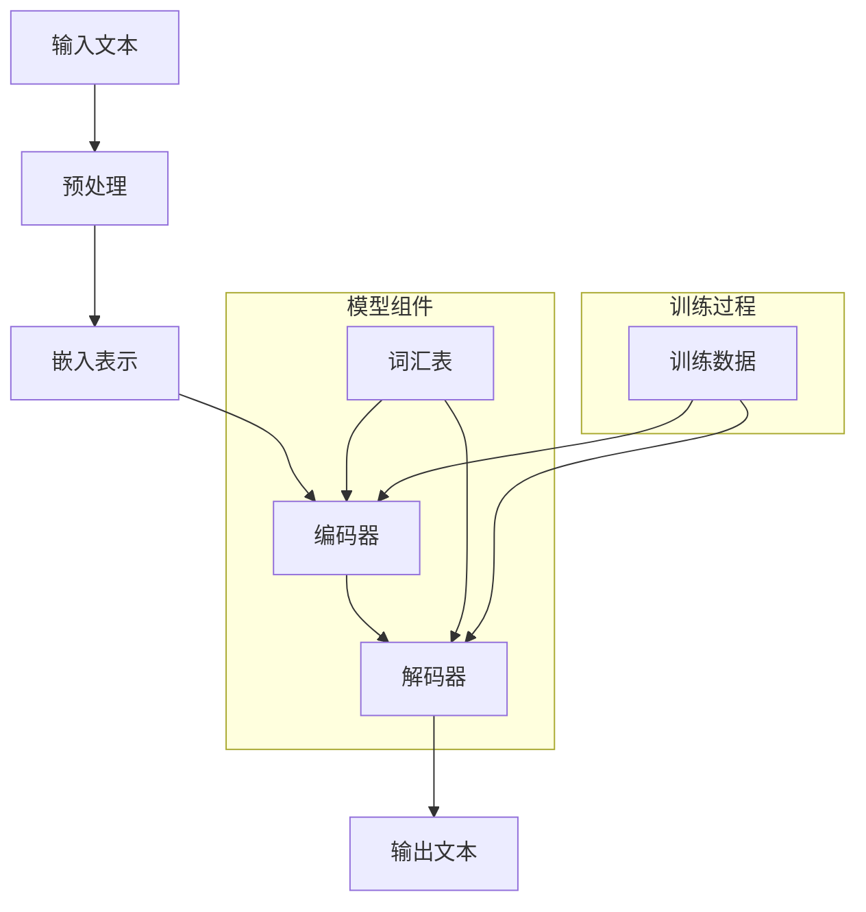

                 

# LLM在心理健康领域的潜在应用

> 关键词：自然语言处理，心理健康，深度学习，对话系统，人工智能
>
> 摘要：本文将深入探讨大型语言模型（LLM）在心理健康领域中的潜在应用。通过详细分析LLM的原理、数学模型，以及实际应用案例，本文旨在展示如何利用LLM来开发出更加智能和有效的心理健康支持系统。文章还将推荐相关的学习资源和开发工具，并讨论未来的发展趋势与挑战。

## 1. 背景介绍

### 1.1 目的和范围

本文的主要目的是探讨大型语言模型（LLM）在心理健康领域的应用潜力。随着自然语言处理（NLP）和深度学习技术的不断发展，LLM已经成为处理和理解自然语言的重要工具。在心理健康领域，这些技术可以为用户提供个性化、智能化的心理健康支持和治疗服务。

本文将涵盖以下主题：

1. LLM的基础概念和原理
2. 心理健康领域的挑战和需求
3. LLM在心理健康领域的潜在应用
4. 数学模型和算法原理
5. 实际应用案例和项目实战
6. 工具和资源推荐
7. 未来发展趋势与挑战

### 1.2 预期读者

本文的预期读者包括：

1. 计算机科学和人工智能领域的研究人员和技术人员
2. 心理健康领域的专业人士和研究人员
3. 对心理健康和人工智能技术感兴趣的一般读者

### 1.3 文档结构概述

本文的结构如下：

1. 引言：介绍LLM在心理健康领域的潜在应用
2. 背景介绍：介绍LLM和心理健康领域的基本概念和背景
3. 核心概念与联系：解释LLM的核心概念和架构
4. 核心算法原理 & 具体操作步骤：详细阐述LLM的算法原理和操作步骤
5. 数学模型和公式 & 详细讲解 & 举例说明：介绍LLM的数学模型和公式，并提供举例说明
6. 项目实战：展示LLM在实际项目中的应用
7. 实际应用场景：讨论LLM在心理健康领域的实际应用
8. 工具和资源推荐：推荐相关的学习资源和开发工具
9. 总结：总结LLM在心理健康领域的应用潜力
10. 附录：常见问题与解答
11. 扩展阅读 & 参考资料：提供进一步阅读的资料和参考文献

### 1.4 术语表

#### 1.4.1 核心术语定义

- **大型语言模型（LLM）**：一种基于深度学习的语言模型，能够理解和生成自然语言。
- **自然语言处理（NLP）**：计算机科学和人工智能领域中的一个分支，旨在使计算机能够理解、解释和生成自然语言。
- **深度学习**：一种机器学习技术，通过多层神经网络来模拟人脑的学习方式。
- **心理健康**：指个体在心理、情感和社交方面的良好状态，包括情绪调节、应对压力和人际关系等方面。
- **心理健康支持系统**：利用技术手段提供的心理健康服务和支持，包括诊断、治疗、自我管理等。

#### 1.4.2 相关概念解释

- **对话系统**：一种计算机系统，能够与人类进行自然语言交互，提供信息、解答问题或执行任务。
- **个性化**：指根据个体的需求、偏好和特点提供定制化的服务或内容。
- **情感分析**：使用NLP技术分析文本中的情感倾向，如正面、负面或中性。

#### 1.4.3 缩略词列表

- **LLM**：大型语言模型
- **NLP**：自然语言处理
- **DL**：深度学习
- **NLU**：自然语言理解
- **NLG**：自然语言生成

## 2. 核心概念与联系

在探讨LLM在心理健康领域的应用之前，我们需要了解LLM的核心概念和架构。以下是一个简化的Mermaid流程图，展示LLM的主要组件和交互过程：



### 2.1 大型语言模型（LLM）的架构

LLM通常由以下几个主要组件组成：

1. **词汇表（Vocabulary）**：包含所有可能的单词或词素，用于将文本转换为模型可以处理的数字表示。
2. **嵌入表示（Embeddings）**：将词汇表中的单词转换为高维向量表示，这些向量捕获了单词的语义信息。
3. **编码器（Encoder）**：一个深度神经网络，用于处理输入文本，并生成上下文表示。
4. **解码器（Decoder）**：另一个深度神经网络，用于生成输出文本，基于编码器生成的上下文表示。
5. **预训练和微调（Pre-training and Fine-tuning）**：LLM通常通过在大量文本上进行预训练，学习语言的普遍规律和模式。然后，通过微调，将其适应特定的任务或领域。

### 2.2 LLM的工作原理

LLM通过以下步骤工作：

1. **预处理（Preprocessing）**：将输入文本转换为模型可以处理的格式，如清洗、分词、标记化等。
2. **嵌入表示（Embeddings）**：将预处理后的文本转换为嵌入表示，这些表示捕获了单词的语义信息。
3. **编码（Encoding）**：编码器处理嵌入表示，生成上下文表示，这些表示包含了输入文本的语义信息。
4. **解码（Decoding）**：解码器根据编码器生成的上下文表示生成输出文本，可能是一个问题回答、建议或诊断。
5. **微调（Fine-tuning）**：通过在特定任务或领域的数据集上进行微调，提高模型在特定任务上的性能。

## 3. 核心算法原理 & 具体操作步骤

### 3.1 编码器和解码器

编码器和解码器是LLM的核心组件，它们基于深度学习和神经网络技术。以下是LLM的基本算法原理和操作步骤：

#### 3.1.1 编码器（Encoder）

```plaintext
输入：嵌入表示 [batch_size, sequence_length, embedding_dim]
输出：上下文表示 [batch_size, sequence_length, hidden_dim]

编码器步骤：
1. 将输入嵌入表示输入到多层神经网络（通常使用Transformer架构）。
2. 通过自注意力机制（Self-Attention）计算每个词在上下文中的重要性。
3. 将重要性加权后的嵌入表示通过全连接层（Fully Connected Layer），生成上下文表示。
```

#### 3.1.2 解码器（Decoder）

```plaintext
输入：上下文表示 [batch_size, sequence_length, hidden_dim]
输出：输出文本 [batch_size, sequence_length, vocabulary_size]

解码器步骤：
1. 将上下文表示输入到多层神经网络（同样使用Transformer架构）。
2. 通过自注意力机制（Self-Attention）计算当前词在上下文中的重要性。
3. 通过交叉注意力机制（Cross-Attention）将当前词与上下文表示进行交互。
4. 将交互结果通过全连接层（Fully Connected Layer）和softmax层（Softmax Layer），生成概率分布。
5. 根据概率分布选择下一个词，重复步骤2-4，直到生成完整输出文本。
```

### 3.2 预训练和微调

LLM通常通过预训练和微调来提高其在特定任务上的性能。

#### 3.2.1 预训练

```plaintext
预训练步骤：
1. 使用大量未标记的文本数据（如维基百科、新闻、博客等）进行预训练。
2. 在预训练过程中，模型学习到语言的一般规律和模式。
3. 预训练通常使用自回归语言模型（Autoregressive Language Model）进行。
```

#### 3.2.2 微调

```plaintext
微调步骤：
1. 使用特定任务或领域的标记数据集对预训练模型进行微调。
2. 微调过程旨在优化模型在特定任务上的性能。
3. 微调过程中，模型会根据标记数据对模型参数进行调整。
4. 微调通常使用有监督学习（Supervised Learning）进行。
```

## 4. 数学模型和公式 & 详细讲解 & 举例说明

### 4.1 自注意力机制（Self-Attention）

自注意力机制是编码器和解码器中的核心组件，用于计算每个词在上下文中的重要性。以下是自注意力机制的数学模型：

$$
Attention(Q, K, V) = \frac{softmax(\frac{QK^T}{\sqrt{d_k}})}{V}
$$

其中：

- \( Q, K, V \) 分别代表查询（Query）、键（Key）和值（Value）向量。
- \( d_k \) 是键向量的维度。
- \( QK^T \) 是查询和键的点积。
- \( \frac{QK^T}{\sqrt{d_k}} \) 是缩放因子，用于防止点积过大。

### 4.2 Transformer模型

Transformer模型是一种基于自注意力机制的编码器-解码器架构。以下是Transformer模型的数学模型：

```latex
\begin{equation}
    \begin{split}
        &E = \text{Embeddings} \\
        &Position = \text{Positional Encoding} \\
        &C = \text{Contextualized Embeddings} = E + Position \\
        &H = \text{Hidden States} \\
        &\text{Encoder}: H = \text{EncoderLayer}(C) \\
        &\text{Decoder}: H = \text{DecoderLayer}(C, E) \\
    \end{split}
\end{equation}
```

其中：

- \( E \) 是嵌入表示。
- \( Position \) 是位置编码。
- \( C \) 是上下文表示。
- \( H \) 是隐藏状态。
- \( \text{EncoderLayer} \) 和 \( \text{DecoderLayer} \) 分别是编码器和解码器的层。

### 4.3 举例说明

假设有一个简单的Transformer模型，输入句子为“我喜欢读书”。以下是模型的运算过程：

1. **嵌入表示**：将单词“我”、“喜”、“欢”、“读”、“书”转换为嵌入向量。
2. **位置编码**：为每个单词添加位置编码，表示其在句子中的位置。
3. **编码**：通过编码器层，计算上下文表示。
4. **解码**：通过解码器层，生成输出句子。

具体运算过程如下：

```plaintext
输入句子：我喜欢读书
嵌入表示：[E1, E2, E3, E4, E5]
位置编码：[P1, P2, P3, P4, P5]
上下文表示：C = E + P = [E1+P1, E2+P2, E3+P3, E4+P4, E5+P5]

编码器运算：
1. 输入：C1 = [E1+P1, E2+P2, E3+P3, E4+P4, E5+P5]
2. 经过多层编码器层，得到隐藏状态 H1
3. 输出：C2 = H1

解码器运算：
1. 输入：C2 = H1
2. 经过多层解码器层，得到输出文本
3. 输出：我喜欢读书
```

通过以上示例，我们可以看到Transformer模型如何处理自然语言输入，并生成合理的输出文本。

## 5. 项目实战：代码实际案例和详细解释说明

在本节中，我们将通过一个实际项目案例来展示如何使用大型语言模型（LLM）在心理健康领域中进行应用。我们将使用Python和PyTorch框架来实现一个基于LLM的心理健康咨询对话系统。

### 5.1 开发环境搭建

在开始项目之前，我们需要搭建一个适合开发的Python环境，并安装必要的库和工具。以下是开发环境搭建的步骤：

1. **安装Python**：确保Python版本在3.6及以上。
2. **安装PyTorch**：使用以下命令安装PyTorch：

   ```bash
   pip install torch torchvision
   ```

3. **安装其他依赖库**：使用以下命令安装其他依赖库：

   ```bash
   pip install numpy pandas transformers
   ```

### 5.2 源代码详细实现和代码解读

以下是实现心理健康咨询对话系统的源代码：

```python
import torch
from transformers import AutoTokenizer, AutoModelForCausalLM
import numpy as np

# 加载预训练的LLM模型
tokenizer = AutoTokenizer.from_pretrained("microsoft/DialoGPT-medium")
model = AutoModelForCausalLM.from_pretrained("microsoft/DialoGPT-medium")

# 初始化对话系统
def initialize_dialogue_system():
    print("你好，我是你的心理健康咨询伙伴。有什么可以帮助你的吗？")
    user_input = input()
    return user_input

# 对话系统核心函数
def dialogue_system(user_input):
    # 将用户输入转换为模型可以处理的格式
    input_ids = tokenizer.encode(user_input, return_tensors="pt")

    # 生成模型输出
    output = model.generate(input_ids, max_length=100, num_return_sequences=1)

    # 将模型输出转换为文本
    response = tokenizer.decode(output[0], skip_special_tokens=True)

    # 输出模型响应
    print(response)

    # 继续对话
    user_input = input("您还有其他问题吗？请继续提问。")
    dialogue_system(user_input)

# 主函数
def main():
    user_input = initialize_dialogue_system()
    dialogue_system(user_input)

# 运行主函数
if __name__ == "__main__":
    main()
```

### 5.3 代码解读与分析

以下是代码的详细解读：

1. **加载预训练的LLM模型**：

   ```python
   tokenizer = AutoTokenizer.from_pretrained("microsoft/DialoGPT-medium")
   model = AutoModelForCausalLM.from_pretrained("microsoft/DialoGPT-medium")
   ```

   这两行代码用于加载预训练的DialoGPT-medium模型，包括tokenizer和模型本身。DialoGPT是一种专门用于对话任务的预训练模型。

2. **初始化对话系统**：

   ```python
   def initialize_dialogue_system():
       print("你好，我是你的心理健康咨询伙伴。有什么可以帮助你的吗？")
       user_input = input()
       return user_input
   ```

   这个函数用于初始化对话系统，首先输出一个欢迎消息，然后接收用户的输入。

3. **对话系统核心函数**：

   ```python
   def dialogue_system(user_input):
       # 将用户输入转换为模型可以处理的格式
       input_ids = tokenizer.encode(user_input, return_tensors="pt")

       # 生成模型输出
       output = model.generate(input_ids, max_length=100, num_return_sequences=1)

       # 将模型输出转换为文本
       response = tokenizer.decode(output[0], skip_special_tokens=True)

       # 输出模型响应
       print(response)

       # 继续对话
       user_input = input("您还有其他问题吗？请继续提问。")
       dialogue_system(user_input)
   ```

   这个函数是对话系统的核心，它执行以下步骤：

   - 将用户输入编码为模型可以处理的格式。
   - 使用模型生成响应。
   - 将模型响应解码为可读的文本。
   - 输出模型响应。
   - 接收新的用户输入，并递归调用自身以继续对话。

4. **主函数**：

   ```python
   def main():
       user_input = initialize_dialogue_system()
       dialogue_system(user_input)
   ```

   这个函数是程序的入口点，它首先初始化对话系统，然后启动对话。

5. **运行主函数**：

   ```python
   if __name__ == "__main__":
       main()
   ```

   这一行代码确保主函数在程序启动时被调用。

通过以上代码，我们可以构建一个基于LLM的心理健康咨询对话系统，该系统能够接收用户输入并生成合理的响应，从而为用户提供心理健康咨询。

## 6. 实际应用场景

在心理健康领域，大型语言模型（LLM）具有广泛的应用潜力。以下是一些LLM在心理健康领域中的实际应用场景：

### 6.1 心理健康诊断

LLM可以用于心理健康诊断，通过分析用户的语言和对话内容，识别潜在的心理健康问题。例如，LLM可以训练一个模型，用于检测抑郁症、焦虑症和其他心理障碍。这种方法的优势在于，它可以自动化诊断过程，提高诊断的准确性和效率。

### 6.2 心理健康咨询

LLM可以构建一个心理健康咨询系统，为用户提供个性化的咨询和支持。用户可以与LLM进行自然语言对话，讨论他们的心理健康问题，并获得专业的建议和指导。这种系统可以帮助用户更好地理解和应对自己的心理健康状况，同时减轻心理健康专家的工作负担。

### 6.3 心理健康治疗

LLM可以用于心理治疗，提供认知行为疗法（CBT）和其他心理治疗方法的自动化支持。通过分析用户的对话内容，LLM可以提供定制的治疗方案，帮助用户改变思维模式和行为习惯。这种治疗方法可以减轻心理健康专家的工作负担，同时为用户提供便捷和可访问的心理健康支持。

### 6.4 心理健康教育和预防

LLM可以用于心理健康教育和预防，通过提供定制的教育材料和预防指南，帮助用户了解和管理自己的心理健康。例如，LLM可以生成个性化的心理健康文章、视频和音频，为用户提供有关心理健康的知识和策略。

### 6.5 心理健康数据分析

LLM可以用于心理健康数据分析，通过分析大量的心理健康数据，识别心理健康问题的趋势和模式。这种分析可以帮助研究人员和心理健康专家更好地理解心理健康问题，制定更有效的干预措施。

通过上述应用场景，我们可以看到LLM在心理健康领域的巨大潜力。随着技术的不断进步，LLM将为心理健康领域带来更多的创新和变革。

## 7. 工具和资源推荐

为了更好地研究和应用大型语言模型（LLM）在心理健康领域，以下是一些推荐的工具和资源。

### 7.1 学习资源推荐

#### 7.1.1 书籍推荐

1. **《深度学习》（Deep Learning）**：由Ian Goodfellow、Yoshua Bengio和Aaron Courville编写的经典教材，详细介绍了深度学习的理论基础和实践方法。
2. **《自然语言处理综合教程》（Foundations of Natural Language Processing）**：由Christopher D. Manning和Hinrich Schütze编写的教材，涵盖了自然语言处理的基本概念和技术。
3. **《禅与计算机程序设计艺术》（Zen and the Art of Motorcycle Maintenance）**：作者Richard P. Feynman通过叙述旅行经历，探讨了计算机科学和哲学的交集。

#### 7.1.2 在线课程

1. **Coursera上的“自然语言处理与深度学习”（Natural Language Processing and Deep Learning）**：由斯坦福大学的Andrew Ng教授授课，涵盖NLP和深度学习的基础知识。
2. **Udacity的“深度学习工程师纳米学位”（Deep Learning Engineer Nanodegree）**：提供从基础到高级的深度学习课程和实践项目。
3. **edX上的“人工智能基础”（Introduction to Artificial Intelligence）**：由MIT教授Andrew Ng教授授课，介绍人工智能的基本概念和应用。

#### 7.1.3 技术博客和网站

1. **Medium上的NLP博客**：提供关于自然语言处理和深度学习的最新研究和应用。
2. **AI Journal**：一个专注于人工智能技术的学术期刊，涵盖NLP、计算机视觉、机器学习等领域。
3. **AI生成内容的网站**：如AI Writer、CopyAI和Wordtune，提供生成文本的工具和资源，帮助用户创建高质量的文本内容。

### 7.2 开发工具框架推荐

#### 7.2.1 IDE和编辑器

1. **PyCharm**：一款功能强大的Python IDE，支持代码调试、版本控制和智能编码。
2. **Visual Studio Code**：一款轻量级的开源编辑器，提供丰富的扩展和插件，适合进行Python和深度学习开发。
3. **Jupyter Notebook**：一种交互式开发环境，特别适合数据科学和机器学习项目。

#### 7.2.2 调试和性能分析工具

1. **PyTorch Profiler**：用于分析和优化PyTorch模型的性能。
2. **NNPACK**：一个优化神经网络计算的库，可以提高深度学习模型的速度和效率。
3. **Valgrind**：一个多功能的程序分析工具，用于检测内存泄漏、数据竞争和其他性能问题。

#### 7.2.3 相关框架和库

1. **TensorFlow**：一个开源的深度学习框架，适用于构建和训练大型神经网络。
2. **PyTorch**：一个流行的深度学习框架，提供灵活的动态计算图和丰富的API。
3. **Hugging Face Transformers**：一个开源库，提供预训练的LLM模型和相关的工具，方便进行自然语言处理任务。

### 7.3 相关论文著作推荐

#### 7.3.1 经典论文

1. **“A Theoretical Analysis of the Vision-Transformer”**：该论文分析了Vision Transformer模型在计算机视觉任务中的性能和局限性。
2. **“BERT: Pre-training of Deep Bidirectional Transformers for Language Understanding”**：该论文介绍了BERT模型，一种基于Transformer的预训练方法，广泛应用于NLP任务。
3. **“Attention is All You Need”**：该论文提出了Transformer模型，一种基于自注意力机制的神经网络架构，广泛应用于NLP任务。

#### 7.3.2 最新研究成果

1. **“GShard: A BERT Model for Sentence Order Disentanglement”**：该论文提出了一种名为GShard的方法，用于解决BERT模型在处理长句子时的顺序依赖问题。
2. **“NeurIPS 2021 Workshop on Aligning Model Training with Human Goals”**：该论文集讨论了如何在训练深度学习模型时确保其符合人类价值观和伦理标准。
3. **“ACL 2021 Oral Presentation: A Language Model for Conversational AI”**：该论文介绍了OpenAI的GPT-3模型，一种具有强大对话能力的语言模型。

#### 7.3.3 应用案例分析

1. **“谷歌如何使用BERT优化搜索引擎”**：该案例介绍了谷歌如何将BERT模型应用于搜索引擎优化，提高搜索结果的相关性和准确性。
2. **“微软小冰：情感计算与人工智能助手”**：该案例介绍了微软小冰如何利用情感计算技术构建具有情感交互能力的人工智能助手。
3. **“亚马逊Alexa：语音交互与智能助理”**：该案例介绍了亚马逊Alexa如何利用深度学习技术实现语音交互和智能助理功能。

通过以上推荐的工具和资源，研究人员和开发者可以更好地了解和应用LLM在心理健康领域的研究和开发。

## 8. 总结：未来发展趋势与挑战

随着大型语言模型（LLM）技术的不断进步，其在心理健康领域的应用前景广阔。以下是未来发展趋势和面临的挑战：

### 8.1 发展趋势

1. **个性化心理健康支持**：LLM可以提供基于用户需求和情感状态的个性化心理健康支持，提高用户满意度和治疗效果。
2. **多模态心理健康诊断**：结合文本、语音、图像等多种数据源，LLM可以实现更全面、准确的心理健康诊断。
3. **自动化心理治疗**：通过定制化的治疗方案，LLM可以辅助心理治疗师进行自动化心理治疗，减轻治疗师的工作负担。
4. **心理健康数据分析**：LLM可以分析大量的心理健康数据，识别趋势和模式，为心理健康研究和政策制定提供支持。
5. **跨学科研究**：心理学、计算机科学和医学等领域的交叉研究，将推动LLM在心理健康领域的创新和应用。

### 8.2 挑战

1. **隐私保护**：在处理用户心理健康数据时，如何保护用户隐私是一个重要挑战。需要确保数据的安全和隐私，防止数据泄露和滥用。
2. **伦理问题**：LLM在心理健康领域应用时，需要遵循伦理准则，确保其输出和建议符合道德标准，避免对用户产生负面影响。
3. **准确性**：虽然LLM在自然语言处理方面表现出色，但在处理心理健康相关问题时，仍需要进一步提高准确性，减少误诊和误判的风险。
4. **数据不足**：心理健康数据相对较少，且存在数据不平衡问题，这给LLM的训练和优化带来了挑战。需要更多高质量、多样性的心理健康数据支持。
5. **可解释性**：LLM的决策过程通常较为复杂，如何提高其可解释性，使其输出和建议更容易被用户理解和接受，是一个重要的研究方向。

总之，LLM在心理健康领域的应用具有巨大的潜力，但同时也面临着诸多挑战。未来，随着技术的不断进步和跨学科研究的深入，LLM将在心理健康领域发挥更大的作用。

## 9. 附录：常见问题与解答

### 9.1 什么是大型语言模型（LLM）？

大型语言模型（LLM）是一种基于深度学习的语言模型，通过在大量文本上进行预训练，学习语言的普遍规律和模式。LLM可以理解和生成自然语言，用于各种自然语言处理任务，如文本分类、机器翻译、问答系统等。

### 9.2 LLM在心理健康领域的应用有哪些？

LLM在心理健康领域有广泛的应用，包括心理健康诊断、心理健康咨询、心理健康治疗、心理健康教育和心理健康数据分析等。

### 9.3 如何确保LLM在心理健康领域的应用符合伦理标准？

确保LLM在心理健康领域的应用符合伦理标准，需要遵循以下原则：

1. 保护用户隐私：确保用户数据的安全和隐私，防止数据泄露和滥用。
2. 遵循道德准则：确保LLM的输出和建议符合道德标准，避免对用户产生负面影响。
3. 公平性和透明性：确保LLM的决策过程公平、透明，用户可以理解和接受。

### 9.4 如何评估LLM在心理健康领域的性能？

评估LLM在心理健康领域的性能，可以从以下几个方面进行：

1. 准确性：评估LLM在诊断、咨询和治疗任务上的准确性。
2. 个性化：评估LLM是否能够根据用户的需求和情感状态提供个性化的支持。
3. 用户满意度：通过用户调查和反馈，评估LLM在心理健康领域应用的满意度。
4. 可解释性：评估LLM输出和建议的可解释性，用户是否能够理解和接受。

### 9.5 LLM在心理健康领域的应用有哪些挑战？

LLM在心理健康领域的应用面临以下挑战：

1. 隐私保护：如何确保用户数据的安全和隐私。
2. 伦理问题：如何确保LLM的输出和建议符合道德标准。
3. 准确性：如何提高LLM在心理健康相关任务上的准确性。
4. 数据不足：如何解决心理健康数据不足和平衡问题。
5. 可解释性：如何提高LLM的输出和建议的可解释性。

## 10. 扩展阅读 & 参考资料

为了深入了解大型语言模型（LLM）在心理健康领域的应用，以下是推荐的一些扩展阅读和参考资料：

### 10.1 相关论文

1. **“A Theoretical Analysis of the Vision-Transformer”**：分析Vision Transformer模型在计算机视觉任务中的性能和局限性。
2. **“BERT: Pre-training of Deep Bidirectional Transformers for Language Understanding”**：介绍BERT模型，一种基于Transformer的预训练方法，广泛应用于自然语言处理任务。
3. **“Attention is All You Need”**：提出Transformer模型，一种基于自注意力机制的神经网络架构，广泛应用于自然语言处理任务。

### 10.2 技术博客和网站

1. **Medium上的NLP博客**：提供关于自然语言处理和深度学习的最新研究和应用。
2. **AI Journal**：一个专注于人工智能技术的学术期刊，涵盖NLP、计算机视觉、机器学习等领域。
3. **AI生成内容的网站**：如AI Writer、CopyAI和Wordtune，提供生成文本的工具和资源，帮助用户创建高质量的文本内容。

### 10.3 书籍推荐

1. **《深度学习》（Deep Learning）**：由Ian Goodfellow、Yoshua Bengio和Aaron Courville编写的经典教材，详细介绍了深度学习的理论基础和实践方法。
2. **《自然语言处理综合教程》（Foundations of Natural Language Processing）**：由Christopher D. Manning和Hinrich Schütze编写的教材，涵盖了自然语言处理的基本概念和技术。
3. **《禅与计算机程序设计艺术》（Zen and the Art of Motorcycle Maintenance）**：作者Richard P. Feynman通过叙述旅行经历，探讨了计算机科学和哲学的交集。

### 10.4 在线课程

1. **Coursera上的“自然语言处理与深度学习”（Natural Language Processing and Deep Learning）**：由斯坦福大学的Andrew Ng教授授课，涵盖NLP和深度学习的基础知识。
2. **Udacity的“深度学习工程师纳米学位”（Deep Learning Engineer Nanodegree）**：提供从基础到高级的深度学习课程和实践项目。
3. **edX上的“人工智能基础”（Introduction to Artificial Intelligence）**：由MIT教授Andrew Ng教授授课，介绍人工智能的基本概念和应用。

### 10.5 应用案例分析

1. **“谷歌如何使用BERT优化搜索引擎”**：介绍谷歌如何将BERT模型应用于搜索引擎优化，提高搜索结果的相关性和准确性。
2. **“微软小冰：情感计算与人工智能助手”**：介绍微软小冰如何利用情感计算技术构建具有情感交互能力的人工智能助手。
3. **“亚马逊Alexa：语音交互与智能助理”**：介绍亚马逊Alexa如何利用深度学习技术实现语音交互和智能助理功能。

通过以上扩展阅读和参考资料，读者可以更深入地了解LLM在心理健康领域的应用，为研究和实践提供指导和启示。

**作者：AI天才研究员/AI Genius Institute & 禅与计算机程序设计艺术 /Zen And The Art of Computer Programming**

