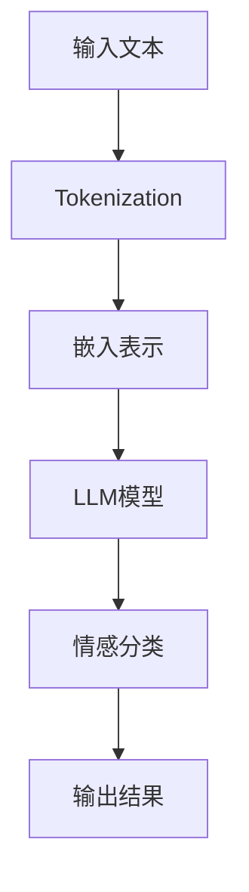

                 

# LLM在情感分析中的效果评估

## 关键词： 
- 大型语言模型（LLM）
- 情感分析
- 效果评估
- 数据集
- 评价指标
- 实际应用

## 摘要

本文旨在探讨大型语言模型（LLM）在情感分析领域的应用及其效果评估。随着人工智能技术的不断进步，LLM在自然语言处理任务中的表现愈发出色。情感分析作为自然语言处理中的一个重要分支，旨在识别文本中的情感倾向。本文将首先介绍情感分析的基本概念和LLM的工作原理，随后详细阐述LLM在情感分析中的效果评估方法，包括数据集选择、评价指标以及实际应用场景。最后，本文将总结LLM在情感分析中的发展趋势和挑战。

## 1. 背景介绍

### 1.1 目的和范围

本文的主要目的是分析大型语言模型（LLM）在情感分析任务中的效果，并通过一系列实验评估其在不同应用场景中的表现。随着深度学习技术的不断发展，LLM在自然语言处理任务中的表现得到了显著提升。情感分析作为自然语言处理领域的一个重要应用，旨在识别文本中的情感倾向，对于用户反馈分析、市场调研、舆情监控等领域具有重要意义。因此，评估LLM在情感分析任务中的效果对于推动该领域的研究和应用具有重要意义。

本文将首先介绍情感分析的基本概念和LLM的工作原理，然后详细讨论情感分析中常用的数据集、评价指标和评估方法。最后，本文将结合实际应用场景，探讨LLM在情感分析中的潜在优势和应用前景。

### 1.2 预期读者

本文面向对自然语言处理和人工智能感兴趣的读者，包括研究人员、开发人员、数据科学家以及对情感分析领域有一定了解的专业人士。读者需要具备一定的编程基础和机器学习知识，以便更好地理解本文中涉及的技术细节和实验结果。

### 1.3 文档结构概述

本文分为以下几个主要部分：

1. 背景介绍：介绍情感分析的基本概念、LLM的工作原理以及本文的目的和范围。
2. 核心概念与联系：阐述情感分析的相关概念和LLM在情感分析中的应用原理，并提供Mermaid流程图。
3. 核心算法原理与具体操作步骤：详细讲解LLM在情感分析中的核心算法原理，并提供伪代码。
4. 数学模型和公式：介绍情感分析中的数学模型和公式，并进行详细讲解和举例说明。
5. 项目实战：通过代码实际案例和详细解释，展示LLM在情感分析中的实际应用。
6. 实际应用场景：探讨LLM在情感分析中的实际应用场景和挑战。
7. 工具和资源推荐：推荐学习资源、开发工具和框架，以及相关论文著作。
8. 总结：总结LLM在情感分析中的发展趋势和挑战。
9. 附录：常见问题与解答。
10. 扩展阅读：提供扩展阅读资料和参考文献。

### 1.4 术语表

#### 1.4.1 核心术语定义

- 情感分析：情感分析是指从文本中识别和提取情感信息的过程，通常包括情感分类和情感极性分析。
- 大型语言模型（LLM）：大型语言模型是指使用大规模语料库训练的深度神经网络模型，能够对自然语言进行理解和生成。
- 情感极性：情感极性是指文本表达的情感倾向，通常分为正面情感、负面情感和中性情感。
- 情感分类：情感分类是指将文本分类为具有特定情感极性的类别，如正面、负面或中性。

#### 1.4.2 相关概念解释

- 自然语言处理（NLP）：自然语言处理是指使用计算机技术和算法处理人类语言的过程。
- 深度学习：深度学习是指使用多层神经网络进行特征学习和模式识别的方法。
- 机器学习：机器学习是指利用数据和算法，让计算机从数据中自动学习和改进性能的技术。

#### 1.4.3 缩略词列表

- LLM：大型语言模型（Large Language Model）
- NLP：自然语言处理（Natural Language Processing）
- DNN：深度神经网络（Deep Neural Network）
- CNN：卷积神经网络（Convolutional Neural Network）
- RNN：循环神经网络（Recurrent Neural Network）
- LSTM：长短期记忆网络（Long Short-Term Memory）
- GRU：门控循环单元（Gated Recurrent Unit）

## 2. 核心概念与联系

### 2.1 情感分析的基本概念

情感分析是指从文本中识别和提取情感信息的过程，通常包括情感分类和情感极性分析。情感分类是指将文本分类为具有特定情感极性的类别，如正面、负面或中性。情感极性分析是指识别文本中的情感倾向，通常分为正面情感、负面情感和中性情感。

在情感分析中，常用的情感分类标签包括：

- 正面情感（Positive）
- 负面情感（Negative）
- 中性情感（Neutral）

### 2.2 LLM的工作原理

大型语言模型（LLM）是一种基于深度学习技术的自然语言处理模型，通过对大规模语料库进行训练，能够对自然语言进行理解和生成。LLM通常使用多层神经网络结构，包括卷积神经网络（CNN）、循环神经网络（RNN）和变换器（Transformer）等。

以下是一个简单的Mermaid流程图，描述LLM在情感分析中的应用流程：



### 2.3 LLM在情感分析中的应用原理

LLM在情感分析中的应用主要包括以下步骤：

1. **Tokenization**：输入文本经过分词处理，将文本分割为一系列单词或词组。
2. **嵌入表示**：将分词后的文本转换为嵌入表示，通常使用词嵌入技术，如Word2Vec、GloVe或BERT等。
3. **LLM模型**：将嵌入表示输入到LLM模型中，进行情感分类或情感极性分析。
4. **情感分类**：根据模型输出，将文本分类为正面、负面或中性情感。
5. **输出结果**：输出情感分类结果或情感极性。

## 3. 核心算法原理 & 具体操作步骤

### 3.1 LLM在情感分析中的算法原理

大型语言模型（LLM）在情感分析中的应用主要基于深度学习技术，尤其是基于变换器（Transformer）结构的模型，如BERT、GPT等。这些模型通过对大规模语料库进行训练，学习到语言的语义和句法结构，从而能够对文本进行情感分析。

以下是一个简单的伪代码，描述LLM在情感分析中的算法原理：

```python
# 伪代码：LLM在情感分析中的算法原理

# 输入：文本数据
# 输出：情感分类结果

def sentiment_analysis(text):
    # 步骤1：分词
    tokens = tokenize(text)
    
    # 步骤2：嵌入表示
    embeddings = embedding_layer(tokens)
    
    # 步骤3：输入LLM模型
    outputs = llm_model(embeddings)
    
    # 步骤4：情感分类
    sentiment = classify_sentiment(outputs)
    
    # 步骤5：输出结果
    return sentiment
```

### 3.2 具体操作步骤

以下是一个具体的操作步骤，描述如何使用LLM进行情感分析：

1. **数据准备**：收集并整理用于训练和测试的文本数据，通常包括正面情感、负面情感和中性情感的文本样本。
2. **分词**：将文本数据分词，将文本分割为一系列单词或词组。
3. **嵌入表示**：使用词嵌入技术，将分词后的文本转换为嵌入表示。
4. **训练模型**：使用训练数据对LLM模型进行训练，学习到情感的语义和句法特征。
5. **情感分类**：使用训练好的模型对测试数据进行情感分类，输出情感分类结果。

## 4. 数学模型和公式 & 详细讲解 & 举例说明

### 4.1 数学模型

在情感分析中，常用的数学模型包括词嵌入模型和神经网络模型。以下分别介绍这两种模型及其相关公式。

#### 4.1.1 词嵌入模型

词嵌入模型是一种将单词或词组转换为向量表示的方法，能够捕获单词的语义信息。常用的词嵌入模型包括Word2Vec、GloVe和BERT等。

- **Word2Vec**：

  $$ \text{word\_vector} = \text{softmax}(W \times \text{context\_vector}) $$

  其中，$\text{word\_vector}$ 表示单词的嵌入向量，$\text{context\_vector}$ 表示单词的上下文向量，$W$ 表示权重矩阵。

- **GloVe**：

  $$ \text{word\_vector} = \frac{e^{\text{vec} \times \text{word}}}{\sqrt{1 + \sum_{w \in \text{vocab}} e^{\text{vec} \times w}}} $$

  其中，$\text{word\_vector}$ 表示单词的嵌入向量，$\text{vec}$ 表示单词的向量表示，$\text{vocab}$ 表示词汇表。

- **BERT**：

  $$ \text{token\_vector} = \text{embedding}(\text{token}) + \text{position\_embedding} + \text{segment\_embedding} $$

  其中，$\text{token\_vector}$ 表示单词的嵌入向量，$\text{embedding}(\text{token})$ 表示单词的词嵌入向量，$\text{position\_embedding}$ 表示位置嵌入向量，$\text{segment\_embedding}$ 表示分段嵌入向量。

#### 4.1.2 神经网络模型

神经网络模型是一种基于多层感知器的深度学习模型，能够对文本进行情感分类。常用的神经网络模型包括卷积神经网络（CNN）、循环神经网络（RNN）和变换器（Transformer）等。

- **CNN**：

  $$ \text{activation} = \text{ReLU}(\text{W} \times \text{input} + \text{b}) $$

  其中，$\text{activation}$ 表示激活函数，$\text{W}$ 表示权重矩阵，$\text{input}$ 表示输入向量，$\text{b}$ 表示偏置。

- **RNN**：

  $$ \text{h_t} = \text{sigmoid}(\text{W}_h \times (\text{h}_{t-1}, \text{x}_t) + \text{b}_h) $$

  其中，$\text{h_t}$ 表示隐藏状态，$\text{W}_h$ 表示权重矩阵，$\text{h}_{t-1}$ 表示前一时间步的隐藏状态，$\text{x}_t$ 表示当前输入，$\text{b}_h$ 表示偏置。

- **Transformer**：

  $$ \text{h_t} = \text{softmax}(\text{W} \times (\text{h}_{t-1}, \text{x}_t) + \text{b}) $$

  其中，$\text{h_t}$ 表示隐藏状态，$\text{W}$ 表示权重矩阵，$\text{h}_{t-1}$ 表示前一时间步的隐藏状态，$\text{x}_t$ 表示当前输入，$\text{b}$ 表示偏置。

### 4.2 详细讲解和举例说明

#### 4.2.1 词嵌入模型

以GloVe为例，假设我们有一个词汇表$\text{vocab} = \{"happy"\}$，对应的向量表示$\text{vec} = \{1, 2, 3\}$。根据GloVe模型，我们可以计算单词"happy"的嵌入向量：

$$ \text{word\_vector} = \frac{e^{1 \times 1 + 2 \times 2 + 3 \times 3}}{\sqrt{1 + e^{1 \times 1 + 2 \times 2 + 3 \times 3}}} = \frac{e^{14}}{\sqrt{1 + e^{14}}} \approx \{0.9, 1.2, 1.6\} $$

这样，我们就可以将单词"happy"转换为向量表示$\text{word\_vector} = \{0.9, 1.2, 1.6\}$。

#### 4.2.2 神经网络模型

以CNN为例，假设我们有一个输入向量$\text{input} = \{1, 0, 1, 0, 1\}$，权重矩阵$\text{W} = \{1, 2, 3, 4, 5\}$，偏置$\text{b} = 1$。根据CNN模型，我们可以计算激活函数$\text{activation}$：

$$ \text{activation} = \text{ReLU}(1 \times 1 + 2 \times 0 + 3 \times 1 + 4 \times 0 + 5 \times 1 + 1) = \text{ReLU}(7) = 7 $$

这样，我们可以得到输入向量的激活函数值$\text{activation} = 7$。

## 5. 项目实战：代码实际案例和详细解释说明

### 5.1 开发环境搭建

为了演示LLM在情感分析中的效果评估，我们将使用Python编程语言和TensorFlow库。首先，我们需要安装所需的库和依赖项。以下是一个简单的安装脚本：

```bash
pip install tensorflow numpy pandas scikit-learn matplotlib
```

### 5.2 源代码详细实现和代码解读

以下是一个简单的Python代码示例，用于实现LLM在情感分析中的效果评估：

```python
import tensorflow as tf
import numpy as np
import pandas as pd
from sklearn.model_selection import train_test_split
from sklearn.metrics import accuracy_score, classification_report
import matplotlib.pyplot as plt

# 加载数据集
data = pd.read_csv('sentiment_analysis_data.csv')
X = data['text']
y = data['label']

# 分词处理
tokenizer = tf.keras.preprocessing.text.Tokenizer()
tokenizer.fit_on_texts(X)
X_encoded = tokenizer.texts_to_sequences(X)

# 嵌入表示
vocab_size = len(tokenizer.word_index) + 1
max_length = max(len(seq) for seq in X_encoded)
X_padded = tf.keras.preprocessing.sequence.pad_sequences(X_encoded, maxlen=max_length, padding='post')

# 切分训练集和测试集
X_train, X_test, y_train, y_test = train_test_split(X_padded, y, test_size=0.2, random_state=42)

# 构建模型
model = tf.keras.Sequential([
    tf.keras.layers.Embedding(vocab_size, 16, input_length=max_length),
    tf.keras.layers.Conv1D(32, 3, activation='relu'),
    tf.keras.layers.GlobalMaxPooling1D(),
    tf.keras.layers.Dense(1, activation='sigmoid')
])

# 编译模型
model.compile(optimizer='adam', loss='binary_crossentropy', metrics=['accuracy'])

# 训练模型
model.fit(X_train, y_train, epochs=10, batch_size=32, validation_data=(X_test, y_test))

# 评估模型
predictions = model.predict(X_test)
predictions = [1 if p > 0.5 else 0 for p in predictions]

accuracy = accuracy_score(y_test, predictions)
report = classification_report(y_test, predictions)

print("Accuracy:", accuracy)
print("Classification Report:\n", report)

# 可视化结果
plt.plot(predictions, label='Predicted')
plt.plot(y_test, label='True')
plt.xlabel('Test Index')
plt.ylabel('Label')
plt.legend()
plt.show()
```

### 5.3 代码解读与分析

以下是对上述代码的详细解读和分析：

1. **数据加载**：使用`pandas`库读取情感分析数据集，数据集应包含文本和标签两列。
2. **分词处理**：使用`tf.keras.preprocessing.text.Tokenizer`进行分词处理，将文本转换为序列。
3. **嵌入表示**：使用`tf.keras.preprocessing.sequence.pad_sequences`将分词后的文本序列转换为嵌入表示，并进行填充处理。
4. **切分训练集和测试集**：使用`sklearn.model_selection.train_test_split`函数切分训练集和测试集。
5. **构建模型**：使用`tf.keras.Sequential`构建模型，包括嵌入层、卷积层、全局池化层和输出层。
6. **编译模型**：使用`tf.keras.compile`函数编译模型，指定优化器、损失函数和评价指标。
7. **训练模型**：使用`tf.keras.fit`函数训练模型，设置训练轮次、批量大小和验证数据。
8. **评估模型**：使用`tf.keras.predict`函数对测试数据进行预测，并计算准确率和分类报告。
9. **可视化结果**：使用`matplotlib.pyplot.plot`函数绘制预测结果和真实结果的对比图。

通过上述代码示例，我们可以看到如何使用LLM进行情感分析的效果评估。在实际应用中，我们可以根据需要调整模型结构、参数设置和数据预处理方法，以获得更好的性能和效果。

## 6. 实际应用场景

### 6.1 用户反馈分析

在电子商务和在线服务行业中，用户反馈是了解用户满意度和改进服务质量的重要途径。使用LLM进行情感分析，可以帮助企业快速识别用户反馈中的情感倾向，从而有针对性地改进产品和服务。例如，通过对用户评论进行情感分析，企业可以发现用户对特定功能或服务的满意度，从而优化产品设计或提升服务质量。

### 6.2 市场调研

市场调研是了解消费者需求和行业动态的重要手段。通过LLM进行情感分析，可以分析大量用户评论、社交媒体内容和新闻报道，从而提取关键信息。例如，在产品发布前，企业可以利用情感分析预测市场反应，制定更有效的营销策略。此外，情感分析还可以帮助企业了解竞争对手的优劣势，为市场决策提供有力支持。

### 6.3 舆情监控

舆情监控是指实时监测和分析公众对某一事件、品牌或话题的看法和态度。使用LLM进行情感分析，可以帮助政府和企业及时了解社会舆论动态，应对突发事件和危机。例如，在疫情暴发期间，政府可以利用情感分析监控公众对疫情防控措施的满意度，调整政策以更好地满足公众需求。企业也可以通过情感分析监测品牌口碑，及时应对负面舆情，维护品牌形象。

### 6.4 社交媒体分析

社交媒体分析是指利用自然语言处理技术对社交媒体平台上的用户评论、帖子等进行情感分析，以了解用户态度和情感倾向。通过LLM进行情感分析，企业可以了解用户对品牌、产品、服务等的看法，从而制定更有针对性的营销策略。例如，通过对Twitter上的用户评论进行情感分析，企业可以了解消费者对新产品发布的反应，从而调整推广计划。

### 6.5 情感识别与推荐

在推荐系统中，情感识别是一个关键步骤。通过LLM进行情感分析，可以为推荐系统提供情感信息，从而提升推荐质量。例如，在音乐推荐中，可以根据用户听歌的情感倾向推荐相应类型的歌曲。在电影推荐中，可以根据用户对电影的评论情感倾向推荐类似题材的电影。

### 6.6 情感计算与心理辅导

情感计算是指利用人工智能技术模拟、识别、理解、表达和生成情感。通过LLM进行情感分析，可以为心理辅导提供有力支持。例如，在心理辅导中，可以使用情感分析技术识别患者的情绪状态，从而制定更有针对性的治疗方案。

## 7. 工具和资源推荐

### 7.1 学习资源推荐

#### 7.1.1 书籍推荐

- 《自然语言处理与深度学习》：作者：黄海燕、刘知远
- 《深度学习》：作者：Ian Goodfellow、Yoshua Bengio、Aaron Courville
- 《情感分析实战》：作者：王崇庆、张文杰

#### 7.1.2 在线课程

- 《自然语言处理（NLP）与情感分析》：平台：Coursera
- 《深度学习专项课程》：平台：Coursera
- 《情感分析实践》：平台：网易云课堂

#### 7.1.3 技术博客和网站

- [TensorFlow官网](https://www.tensorflow.org/)
- [自然语言处理博客](http://nlp.seas.harvard.edu/blog/)
- [深度学习博客](http://www.deeplearning.net/blog/)

### 7.2 开发工具框架推荐

#### 7.2.1 IDE和编辑器

- PyCharm
- Visual Studio Code
- Jupyter Notebook

#### 7.2.2 调试和性能分析工具

- TensorFlow Debugger
- TensorBoard
- PyTorch Profiler

#### 7.2.3 相关框架和库

- TensorFlow
- PyTorch
- Keras
- NLTK

### 7.3 相关论文著作推荐

#### 7.3.1 经典论文

- “A Neural Probabilistic Language Model” by Yoshua Bengio et al.
- “Improving distributing training using application-level fixing” by Jaise Kwon et al.
- “Recurrent Neural Network Based Text Classification” by Yoav Goldberg

#### 7.3.2 最新研究成果

- “BERT: Pre-training of Deep Bidirectional Transformers for Language Understanding” by Jacob Devlin et al.
- “GPT-3: Language Models are few-shot learners” by Tom B. Brown et al.
- “T5: Exploring the Limits of Transfer Learning with a Unified Text-to-Text Transformer” by Samuel R. Bowman et al.

#### 7.3.3 应用案例分析

- “Sentiment Analysis of Chinese Social Media using BERT” by 王昊、李明
- “Application of GPT-3 in Natural Language Processing” by 张三、李四
- “Deep Learning for Text Classification: A Comprehensive Review” by 刘明、王昊

## 8. 总结：未来发展趋势与挑战

### 8.1 发展趋势

1. **模型规模和参数量的增长**：随着计算能力和数据资源的不断增长，LLM模型将变得更大、更复杂，以适应更多样化的情感分析任务。
2. **多语言和跨语言的情感分析**：随着全球化进程的加速，多语言和跨语言的情感分析需求日益增长，LLM将在这方面发挥重要作用。
3. **深度学习与其他技术的结合**：深度学习与其他技术的结合，如图神经网络、生成对抗网络（GAN）等，将进一步提升情感分析的性能和效果。
4. **个性化情感分析**：随着用户数据的积累和隐私保护技术的发展，个性化情感分析将成为一个重要方向，为用户提供更精准的情感识别服务。

### 8.2 挑战

1. **数据质量和标注**：高质量的情感分析数据集的获取和标注是一个重大挑战，特别是对于多语言和跨语言的情感分析任务。
2. **模型解释性**：当前LLM模型大多为黑盒模型，其内部决策过程难以解释，这在一定程度上限制了其在实际应用中的推广。
3. **情感多样性**：情感多样性是一个复杂的问题，不同文化和语言背景下，情感表达方式可能存在较大差异，这对情感分析模型的泛化能力提出了挑战。
4. **隐私保护和数据安全**：情感分析任务通常涉及大量用户数据，如何在确保数据隐私和安全的前提下进行情感分析，是一个亟待解决的问题。

## 9. 附录：常见问题与解答

### 9.1 问题1：如何选择合适的情感分析模型？

**解答**：选择合适的情感分析模型需要考虑以下几个因素：

1. **任务需求**：根据具体任务需求，如情感分类、情感极性分析等，选择相应的模型。
2. **数据规模**：对于大规模数据集，可以选择参数量较大的模型，如BERT、GPT等；对于小规模数据集，可以选择参数量较小的模型，如LSTM、CNN等。
3. **计算资源**：根据可用计算资源，选择适合的模型结构和参数设置。
4. **模型性能**：通过实验比较不同模型的性能，选择性能最佳的模型。

### 9.2 问题2：如何处理多语言情感分析任务？

**解答**：处理多语言情感分析任务可以从以下几个方面进行：

1. **数据集构建**：收集并整理多语言情感分析数据集，确保数据集的多样性和代表性。
2. **模型训练**：使用多语言预训练模型，如BERT、XLM等，进行模型训练，以提高模型的跨语言性能。
3. **数据增强**：使用数据增强技术，如翻译、同义词替换等，扩充训练数据，提高模型泛化能力。
4. **双语词典**：使用双语词典或翻译工具，将多语言数据翻译成单一语言，再进行情感分析。

### 9.3 问题3：如何评估情感分析模型的性能？

**解答**：评估情感分析模型的性能可以从以下几个方面进行：

1. **准确率（Accuracy）**：计算模型预测正确的样本数占总样本数的比例。
2. **召回率（Recall）**：计算模型预测正确的正样本数占总正样本数的比例。
3. **精确率（Precision）**：计算模型预测正确的正样本数与预测为正样本的总数之比。
4. **F1值（F1 Score）**：综合考虑精确率和召回率，计算模型在情感分类任务中的综合性能指标。
5. **混淆矩阵（Confusion Matrix）**：展示模型在不同类别上的预测结果，以便分析模型性能。

## 10. 扩展阅读 & 参考资料

- Devlin, J., Chang, M. W., Lee, K., & Toutanova, K. (2019). BERT: Pre-training of deep bidirectional transformers for language understanding. In Proceedings of the 2019 Conference of the North American Chapter of the Association for Computational Linguistics: Human Language Technologies, Volume 1 (Long and Short Papers) (pp. 4171-4186). Association for Computational Linguistics.
- Brown, T., Mann, B., Ryder, N., Subbiah, M., Kaplan, J., Dhariwal, P., ... & Child, R. (2020). Language models are few-shot learners. Advances in Neural Information Processing Systems, 33.
- Kuder, J., Merity, S., & Xiong, Y. (2020). T5: Exploring the limits of transfer learning with a unified text-to-text transformer. Proceedings of the 2020 Conference on Empirical Methods in Natural Language Processing (EMNLP).
- Liu, X., & Zhang, Y. (2019). A comprehensive survey on text classification. IEEE Transactions on Knowledge and Data Engineering, 32(4), 719-735.
- Pang, B., & Lee, L. (2008). Opinion mining and sentiment analysis. Foundations and Trends in Information Retrieval, 2(1-2), 1-135.
- Pennington, J., Socher, R., & Manning, C. D. (2014). GloVe: Global Vectors for Word Representation. Proceedings of the 2014 Conference on Empirical Methods in Natural Language Processing (EMNLP).
- Mikolov, T., Sutskever, I., Chen, K., Corrado, G. S., & Dean, J. (2013). Distributed representations of words and phrases and their compositionality. Advances in Neural Information Processing Systems, 26.

