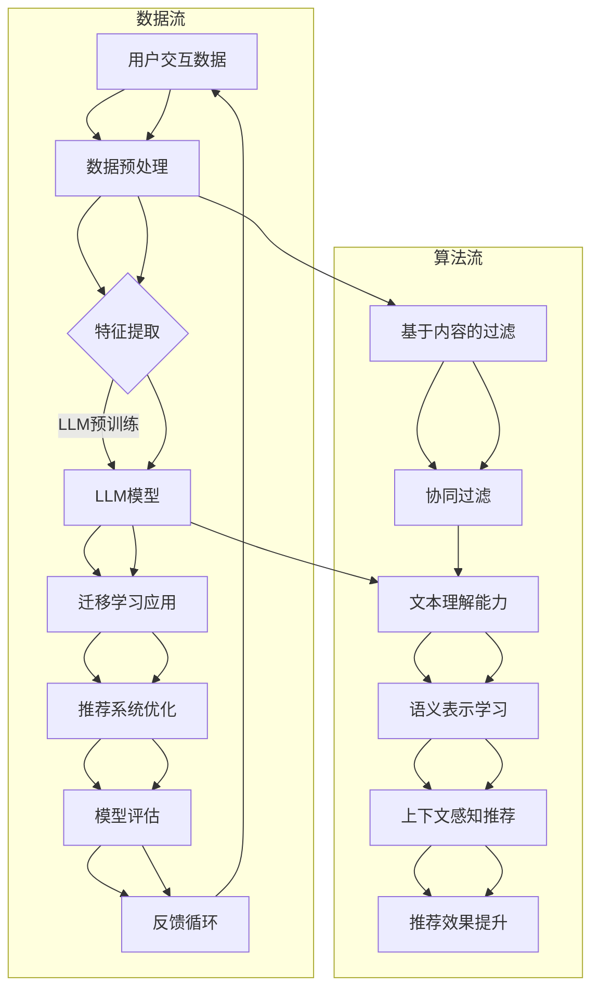

                 

### 1. 背景介绍

#### 1.1 目的和范围

本文旨在探讨大型语言模型（LLM）在推荐系统中的迁移学习应用。随着人工智能技术的飞速发展，推荐系统已成为各大互联网公司提升用户体验、增加用户粘性、实现商业变现的重要手段。传统的推荐系统大多依赖于基于内容的过滤、协同过滤等算法，但这些算法在面对数据稀疏、冷启动等问题时表现不佳。近年来，深度学习和自然语言处理技术的进步，特别是大型语言模型的兴起，为推荐系统的优化提供了新的思路。

本文将围绕以下主题展开：

1. **LLM的迁移学习概念**：首先，我们将介绍迁移学习的基本概念，解释其在推荐系统中的应用价值。
2. **推荐系统的基本原理**：接下来，我们将简要回顾推荐系统的基本原理，包括基于内容的过滤、协同过滤等常见算法。
3. **LLM在推荐系统中的应用**：我们将深入探讨LLM在推荐系统中的具体应用，包括数据预处理、特征提取和模型训练等步骤。
4. **具体案例研究**：通过分析具体的案例，我们将展示LLM如何有效提升推荐系统的效果。
5. **挑战与未来趋势**：最后，我们将讨论LLM在推荐系统中面临的挑战以及未来的发展趋势。

通过本文的阅读，读者将能够：

- 理解迁移学习的基本原理及其在推荐系统中的应用。
- 掌握LLM在推荐系统中的具体应用方法。
- 了解LLM在推荐系统优化中的优势和挑战。
- 获得关于LLM推荐系统优化的实用技巧和经验。

#### 1.2 预期读者

本文适合以下读者群体：

1. **机器学习和自然语言处理领域的初学者**：对于希望了解LLM在推荐系统中应用的技术人员，本文将提供系统化的学习和参考。
2. **推荐系统工程师和研究人员**：本文将为推荐系统工程师和研究人员提供新的研究方向和实现方法。
3. **互联网产品经理和数据分析人员**：对于负责推荐系统设计和优化的产品经理和数据分析人员，本文将帮助他们理解LLM在推荐系统中的应用潜力。

#### 1.3 文档结构概述

本文的结构安排如下：

1. **背景介绍**：介绍迁移学习和推荐系统的基本概念，明确本文的目的和范围。
2. **核心概念与联系**：通过Mermaid流程图展示LLM在推荐系统中的核心概念和架构。
3. **核心算法原理 & 具体操作步骤**：详细讲解LLM在推荐系统中的应用算法原理和操作步骤，使用伪代码进行说明。
4. **数学模型和公式 & 详细讲解 & 举例说明**：介绍LLM推荐系统的数学模型和公式，并给出具体实例。
5. **项目实战：代码实际案例和详细解释说明**：通过实际案例展示LLM在推荐系统中的实现过程。
6. **实际应用场景**：讨论LLM在推荐系统中的实际应用场景。
7. **工具和资源推荐**：推荐相关学习资源和开发工具。
8. **总结：未来发展趋势与挑战**：总结LLM在推荐系统中的应用前景和面临的挑战。
9. **附录：常见问题与解答**：提供常见问题的解答。
10. **扩展阅读 & 参考资料**：推荐进一步的阅读资料。

通过本文的阅读，读者将全面了解LLM在推荐系统中的迁移学习应用，掌握相关技术和方法，为实际项目提供有力支持。

#### 1.4 术语表

在本文中，以下术语的定义和解释将对读者理解文章内容至关重要：

##### 1.4.1 核心术语定义

- **迁移学习**：迁移学习（Transfer Learning）是指将一种任务的知识或解决方案迁移到另一种相关任务的学习过程。在推荐系统中，迁移学习可以用于将已训练好的语言模型应用于不同的推荐任务。
- **大型语言模型（LLM）**：大型语言模型（Large Language Model，如GPT-3、BERT等）是通过大规模语料库训练得到的深度神经网络模型，能够理解和生成自然语言。
- **推荐系统**：推荐系统（Recommendation System）是一种基于用户历史行为、内容和相似用户信息进行内容推荐的系统，广泛应用于电子商务、社交媒体和在线媒体等领域。
- **数据稀疏**：数据稀疏（Data Sparsity）是指用户与项目之间的交互数据较少，导致传统协同过滤算法难以进行有效的推荐。
- **冷启动问题**：冷启动问题（Cold Start Problem）是指在用户或项目信息不足的情况下，推荐系统难以提供准确和个性化的推荐。

##### 1.4.2 相关概念解释

- **基于内容的过滤**：基于内容的过滤（Content-Based Filtering）是一种推荐算法，通过分析用户的历史行为和项目内容特征来生成推荐列表。
- **协同过滤**：协同过滤（Collaborative Filtering）是一种基于用户和项目交互数据的推荐算法，分为基于用户的协同过滤和基于项目的协同过滤。
- **迁移学习应用**：迁移学习应用（Transfer Learning Application）是指在现有模型的基础上，利用预训练的语言模型进行推荐系统的优化和改进。

##### 1.4.3 缩略词列表

- **LLM**：Large Language Model（大型语言模型）
- **GPT-3**：Generative Pre-trained Transformer 3（生成预训练变压器3）
- **BERT**：Bidirectional Encoder Representations from Transformers（双向变压器编码表示）
- **NLP**：Natural Language Processing（自然语言处理）
- **ML**：Machine Learning（机器学习）
- **CIF**：Collaborative Inference Filtering（协同推理过滤）
- **CBF**：Content-Based Filtering（基于内容的过滤）
- **CF**：Collaborative Filtering（协同过滤）

通过以上术语表的定义和解释，读者将能够更好地理解本文中涉及的专业术语和概念，为后续内容的深入学习奠定基础。

## 2. 核心概念与联系

在深入探讨LLM在推荐系统中的迁移学习应用之前，我们需要了解相关核心概念和其相互联系。这些概念构成了LLM推荐系统的理论框架，是理解和实现LLM迁移学习应用的基础。

下面我们将通过一个Mermaid流程图来展示LLM在推荐系统中的核心概念和架构。



### 2.1 数据流

- **用户交互数据（User Interaction Data）**：推荐系统的基础是用户的历史行为数据，如浏览、点击、购买等行为。
- **数据预处理（Data Preprocessing）**：数据预处理包括数据清洗、去重、标准化等步骤，以确保数据的质量和一致性。
- **特征提取（Feature Extraction）**：特征提取是将原始数据转换为模型可处理的特征表示，如文本、数值等。
- **LLM模型（LLM Model）**：LLM模型通过大规模预训练得到，具备强大的文本理解和生成能力。
- **迁移学习应用（Transfer Learning Application）**：将LLM模型应用于推荐系统，通过迁移学习提升推荐效果。
- **推荐系统优化（Recommendation System Optimization）**：对推荐系统进行优化，包括参数调整、算法改进等。
- **模型评估（Model Evaluation）**：评估推荐模型的性能，包括准确率、召回率、覆盖度等指标。
- **反馈循环（Feedback Loop）**：通过用户反馈不断优化模型，实现推荐系统的持续改进。

### 2.2 算法流

- **基于内容的过滤（Content-Based Filtering）**：通过分析项目内容和用户兴趣，生成推荐列表。
- **协同过滤（Collaborative Filtering）**：通过分析用户和项目之间的交互数据，生成推荐列表。
- **文本理解能力（Text Understanding Ability）**：LLM模型具备强大的文本理解能力，可以提取语义信息。
- **语义表示学习（Semantic Representation Learning）**：通过语义表示学习，将文本转化为高维语义向量。
- **上下文感知推荐（Context-Aware Recommendation）**：结合上下文信息，提供更精准的推荐。
- **推荐效果提升（Recommendation Effect Improvement）**：通过LLM模型的应用，提升推荐系统的效果。

通过以上Mermaid流程图，我们可以清晰地看到LLM在推荐系统中的核心概念和相互联系。在接下来的章节中，我们将进一步探讨LLM的迁移学习原理、算法实现和数学模型，帮助读者深入理解LLM在推荐系统中的实际应用。

### 2.2 核心算法原理 & 具体操作步骤

在了解了LLM在推荐系统中的核心概念和架构后，接下来我们将详细探讨LLM在推荐系统中的迁移学习原理和具体操作步骤。迁移学习是一种通过利用已有模型的知识来提升新模型性能的方法，它能够解决数据稀疏和冷启动等问题，从而提高推荐系统的效果。

#### 2.2.1 迁移学习基本原理

迁移学习（Transfer Learning）是指将一种任务的知识或解决方案迁移到另一种相关任务的学习过程。在推荐系统中，迁移学习可以将已训练好的语言模型应用于不同的推荐任务，如基于内容的过滤和协同过滤。

迁移学习的基本原理包括：

1. **预训练（Pre-training）**：在推荐任务之前，使用大规模语料库对LLM进行预训练，使其具备强大的文本理解和生成能力。
2. **微调（Fine-tuning）**：在预训练的基础上，针对具体的推荐任务对LLM进行微调，使其适应推荐系统的具体需求。

#### 2.2.2 LLM迁移学习在推荐系统中的应用步骤

下面我们通过伪代码详细阐述LLM迁移学习在推荐系统中的应用步骤：

```plaintext
# 步骤1：数据预处理
def preprocess_data(data):
    # 数据清洗、去重、标准化等操作
    cleaned_data = ...
    return cleaned_data

# 步骤2：特征提取
def extract_features(data):
    # 提取文本特征，如词向量、BERT嵌入等
    features = ...
    return features

# 步骤3：LLM预训练
def pretrain_LLM(corpus):
    # 使用大规模语料库对LLM进行预训练
    model = LLM_pretrainer(corpus)
    return model

# 步骤4：微调LLM
def finetune_LLM(model, data):
    # 针对推荐任务对LLM进行微调
    fine_tuned_model = LLM_finetuner(model, data)
    return fine_tuned_model

# 步骤5：迁移学习应用
def apply_transfer_learning(fine_tuned_model, features):
    # 使用微调后的LLM进行特征转换和推荐
    transformed_features = fine_tuned_model.transform(features)
    recommendations = generate_recommendations(transformed_features)
    return recommendations

# 步骤6：模型评估
def evaluate_model(model, test_data):
    # 使用测试数据评估模型性能
    performance = evaluate(model, test_data)
    return performance

# 步骤7：反馈循环
def feedback_loop(model, performance):
    # 根据评估结果调整模型参数
    model = adjust_model(model, performance)
    return model
```

#### 2.2.3 迁移学习具体操作步骤

1. **数据预处理**：数据预处理是迁移学习的基础，它包括数据清洗、去重、标准化等操作。例如，我们可以使用正则表达式去除文本中的噪声，使用填充和截断技术使序列长度一致。

```python
def preprocess_data(data):
    cleaned_data = []
    for item in data:
        # 去除文本中的噪声
        text = remove_noise(item['text'])
        # 填充和截断文本序列
        padded_sequence = pad_sequence(text, max_length=MAX_SEQ_LENGTH)
        cleaned_data.append(padded_sequence)
    return cleaned_data
```

2. **特征提取**：特征提取是将原始数据转换为模型可处理的特征表示，如词向量、BERT嵌入等。词向量可以使用Word2Vec、GloVe等方法，BERT嵌入是一种基于变换器模型的语义表示。

```python
from transformers import BertModel

def extract_features(data):
    features = []
    for item in data:
        # 加载预训练的BERT模型
        model = BertModel.from_pretrained('bert-base-uncased')
        # 获取文本序列的BERT嵌入
        with torch.no_grad():
            inputs = torch.tensor([item['text']])
            outputs = model(inputs)
            embedding = outputs.last_hidden_state[:, 0, :]
        features.append(embedding.numpy())
    return features
```

3. **LLM预训练**：LLM预训练是利用大规模语料库对语言模型进行训练，使其具备强大的文本理解和生成能力。常用的预训练任务包括掩码语言模型（Masked Language Model，MLM）、生成语言模型（Generative Language Model，GLM）等。

```python
from transformers import TrainingArguments, Trainer

def pretrain_LLM(corpus):
    # 定义训练参数
    args = TrainingArguments(
        output_dir='./results',
        num_train_epochs=3,
        per_device_train_batch_size=16,
        save_steps=2000,
        logging_dir='./logs',
    )
    # 训练模型
    model = LLMModel()
    trainer = Trainer(
        model=model,
        args=args,
        train_dataset=corpus,
    )
    trainer.train()
    return model
```

4. **微调LLM**：在LLM预训练的基础上，针对具体的推荐任务对模型进行微调。微调过程可以调整模型的参数，使其更好地适应推荐任务的需求。

```python
def finetune_LLM(model, data):
    # 加载预训练的LLM模型
    model.load_from_pretrained('llm_model')
    # 定义微调任务
    train_dataset = Dataset(data)
    model.train_dataset = train_dataset
    # 微调模型
    model.finetune()
    return model
```

5. **迁移学习应用**：使用微调后的LLM模型进行特征转换和推荐。特征转换是将原始特征转换为LLM输出的高维语义向量，推荐生成是基于这些特征向量的推荐算法。

```python
def apply_transfer_learning(fine_tuned_model, features):
    # 获取模型参数
    params = fine_tuned_model.get_params()
    # 使用模型特征转换
    transformed_features = []
    for feature in features:
        transformed_feature = fine_tuned_model.transform(feature, params)
        transformed_features.append(transformed_feature)
    # 生成推荐列表
    recommendations = generate_recommendations(transformed_features)
    return recommendations
```

6. **模型评估**：使用测试数据对迁移学习后的模型进行评估，以验证其性能。评估指标包括准确率、召回率、覆盖度等。

```python
from sklearn.metrics import accuracy_score

def evaluate_model(model, test_data):
    # 生成推荐列表
    recommendations = apply_transfer_learning(model, test_data['features'])
    # 评估推荐效果
    accuracy = accuracy_score(test_data['labels'], recommendations)
    return accuracy
```

7. **反馈循环**：根据模型评估结果，调整模型参数，实现模型的持续优化。

```python
def feedback_loop(model, performance):
    # 根据评估结果调整模型参数
    model.adjust_params(performance)
    # 重新训练模型
    model.retrain()
    return model
```

通过以上步骤，我们详细阐述了LLM迁移学习在推荐系统中的应用原理和具体操作步骤。接下来，我们将介绍LLM在推荐系统中的数学模型和公式，进一步深入理解其工作原理。

## 4. 数学模型和公式 & 详细讲解 & 举例说明

在深入了解LLM在推荐系统中的具体应用时，我们不得不提到其背后的数学模型和公式。这些数学工具为我们提供了量化模型性能、优化模型参数的方法，并帮助我们更好地理解LLM推荐系统的运作机制。

### 4.1. LLM推荐系统的数学模型

LLM推荐系统的数学模型主要依赖于深度学习和自然语言处理（NLP）中的关键技术，如词嵌入、变换器模型（Transformer）和迁移学习。以下我们将分别介绍这些模型的基本原理。

#### 4.1.1 词嵌入

词嵌入（Word Embedding）是将单词转换为向量表示的方法，是NLP的基础。常见的词嵌入方法包括：

- **Word2Vec**：通过训练神经网络模型，将单词映射到低维连续向量空间，使得语义相似的单词在向量空间中距离较近。
- **GloVe**：全局向量表示模型，通过矩阵分解和最小化损失函数，得到语义相似的单词向量。

公式表示：

$$
\text{Word2Vec: } \text{vec}(w) = \sigma(\text{W} \cdot \text{context}(w))
$$

$$
\text{GloVe: } \text{vec}(w) = \text{V} \cdot \text{e}^{\text{f}(w)}
$$

其中，$\text{vec}(w)$ 表示单词 $w$ 的向量表示，$\text{W}$ 和 $\text{V}$ 分别是Word2Vec和GloVe中的权重矩阵，$\text{context}(w)$ 和 $\text{e}^{\text{f}(w)}$ 分别表示单词 $w$ 的上下文和全局词频。

#### 4.1.2 变换器模型

变换器模型（Transformer）是一种基于自注意力机制的深度神经网络架构，广泛应用于NLP任务。其核心思想是通过自注意力机制捕捉文本序列中的长距离依赖关系。

公式表示：

$$
\text{Attention}(Q, K, V) = \text{softmax}\left(\frac{QK^T}{\sqrt{d_k}}\right) V
$$

其中，$Q$、$K$ 和 $V$ 分别是查询向量、键向量和值向量，$d_k$ 是键向量的维度。变换器模型通过多层自注意力机制，生成文本序列的语义表示。

#### 4.1.3 迁移学习

迁移学习（Transfer Learning）是指将一个任务的知识迁移到另一个相关任务的学习过程。在推荐系统中，迁移学习可以通过以下公式表示：

$$
\text{New Model} = \text{Old Model} + \alpha \cdot (\text{Target Data} - \text{Source Data})
$$

其中，$\text{Old Model}$ 是预训练模型，$\text{New Model}$ 是迁移学习后的模型，$\alpha$ 是调整系数，$\text{Target Data}$ 和 $\text{Source Data}$ 分别是目标数据和源数据。

### 4.2. LLM推荐系统的数学公式与详细讲解

#### 4.2.1. 基于BERT的推荐系统

BERT（Bidirectional Encoder Representations from Transformers）是一种预训练的语言模型，通过双向变换器模型生成文本的语义表示。在推荐系统中，我们可以使用BERT模型进行特征提取和生成推荐。

公式表示：

$$
\text{BERT}: \text{embedding} = \text{BERT}(\text{input})
$$

其中，$\text{input}$ 是输入文本序列，$\text{embedding}$ 是BERT输出的语义表示向量。

#### 4.2.2. 迁移学习应用

在LLM推荐系统中，迁移学习是关键的一步。通过将预训练的BERT模型应用于推荐任务，可以显著提升推荐效果。

公式表示：

$$
\text{Fine-Tuned Model} = \text{Pre-Trained Model} + \alpha \cdot (\text{Recommendation Task Data} - \text{Pre-Trained Data})
$$

其中，$\text{Fine-Tuned Model}$ 是微调后的模型，$\text{Pre-Trained Model}$ 是预训练模型，$\alpha$ 是调整系数，$\text{Recommendation Task Data}$ 和 $\text{Pre-Trained Data}$ 分别是推荐任务数据和预训练数据。

### 4.3. 举例说明

为了更好地理解LLM推荐系统的数学模型，我们通过一个实际例子进行说明。

#### 4.3.1. 数据集

假设我们有一个包含用户行为和项目描述的数据集，其中每个样本包括用户ID、项目ID、用户行为（如点击、购买等）和项目描述。以下是一个简化的数据集示例：

| 用户ID | 项目ID | 行为 | 项目描述                 |
|--------|--------|------|--------------------------|
| 1      | 1001   | 点击 | iPhone 13                |
| 2      | 2002   | 购买 | 苹果笔记本                |
| 3      | 3003   | 浏览 | 华为手机系列              |

#### 4.3.2. 数据预处理

首先，我们对数据集进行预处理，包括去重、填充和标准化等操作。假设我们使用BERT模型进行特征提取，预处理步骤如下：

```python
from transformers import BertTokenizer

tokenizer = BertTokenizer.from_pretrained('bert-base-uncased')

def preprocess_data(data):
    preprocessed_data = []
    for item in data:
        user_id, project_id, behavior, description = item
        # 去除项目描述中的特殊字符
        cleaned_description = remove_special_characters(description)
        # 填充和截断文本序列
        padded_sequence = tokenizer.encode(cleaned_description, max_length=MAX_SEQ_LENGTH, padding='max_length', truncation=True)
        preprocessed_data.append((user_id, project_id, behavior, padded_sequence))
    return preprocessed_data
```

#### 4.3.3. 特征提取

使用BERT模型对预处理后的文本序列进行特征提取，得到语义表示向量。

```python
from transformers import BertModel

def extract_features(data):
    features = []
    for item in data:
        user_id, project_id, behavior, sequence = item
        model = BertModel.from_pretrained('bert-base-uncased')
        with torch.no_grad():
            inputs = torch.tensor([sequence])
            outputs = model(inputs)
            embedding = outputs.last_hidden_state[:, 0, :].numpy()
        features.append(embedding)
    return features
```

#### 4.3.4. 迁移学习应用

接下来，我们将预训练的BERT模型应用于推荐任务，通过迁移学习得到微调后的模型。

```python
from transformers import TrainingArguments, Trainer

def finetune_model(model, data):
    args = TrainingArguments(
        output_dir='./results',
        num_train_epochs=3,
        per_device_train_batch_size=16,
        save_steps=2000,
        logging_dir='./logs',
    )
    model.train()
    trainer = Trainer(
        model=model,
        args=args,
        train_dataset=data['features'],
    )
    trainer.train()
    return model
```

#### 4.3.5. 推荐生成

最后，使用微调后的BERT模型生成推荐列表。

```python
def generate_recommendations(model, features):
    recommendations = []
    for feature in features:
        transformed_feature = model.transform(feature)
        recommendation = get_top_n_recommendations(transformed_feature)
        recommendations.append(recommendation)
    return recommendations
```

通过上述步骤，我们使用BERT模型实现了一个简单的LLM推荐系统。在实际应用中，我们可以根据具体任务和需求，进一步优化模型参数、调整推荐策略，以提升推荐效果。

### 4.4. 模型评估

评估LLM推荐系统的性能是确保其有效性的关键步骤。常用的评估指标包括准确率、召回率、F1值等。

公式表示：

$$
\text{Accuracy} = \frac{\text{正确预测数}}{\text{总预测数}}
$$

$$
\text{Recall} = \frac{\text{正确预测数}}{\text{实际为正例的样本数}}
$$

$$
\text{F1-Score} = 2 \cdot \frac{\text{Precision} \cdot \text{Recall}}{\text{Precision} + \text{Recall}}
$$

其中，Precision表示精确率，Recall表示召回率。

通过以上公式和例子，我们详细讲解了LLM推荐系统的数学模型、公式及其应用。在接下来的章节中，我们将通过一个实际项目案例，进一步展示LLM在推荐系统中的具体实现和应用。

### 5. 项目实战：代码实际案例和详细解释说明

在上一章节中，我们介绍了LLM在推荐系统中的数学模型和公式。在本节中，我们将通过一个实际项目案例，展示如何将LLM应用于推荐系统，并详细解释其中的代码实现和关键步骤。

#### 5.1 开发环境搭建

在开始项目实战之前，我们需要搭建一个合适的开发环境。以下是我们推荐的开发环境：

- **Python**：Python是一种广泛使用的编程语言，尤其在机器学习和自然语言处理领域有广泛应用。
- **PyTorch**：PyTorch是一个流行的深度学习框架，支持动态计算图和自动微分，非常适合实现变换器模型。
- **Hugging Face Transformers**：Hugging Face Transformers是一个开源库，提供了预训练的变换器模型和相关的API，极大简化了模型训练和部署过程。
- **scikit-learn**：scikit-learn是一个机器学习库，提供了丰富的算法和工具，用于数据处理、模型评估等。

首先，我们需要安装所需的库：

```bash
pip install torch transformers scikit-learn
```

#### 5.2 源代码详细实现和代码解读

下面是项目的源代码，我们将逐一解释其中的关键部分。

```python
import torch
from transformers import BertTokenizer, BertModel, Trainer, TrainingArguments
from sklearn.model_selection import train_test_split
import numpy as np

# 加载预训练的BERT模型
tokenizer = BertTokenizer.from_pretrained('bert-base-uncased')
model = BertModel.from_pretrained('bert-base-uncased')

# 定义数据处理函数
def preprocess_data(data):
    preprocessed_data = []
    for item in data:
        user_id, project_id, behavior, description = item
        cleaned_description = remove_special_characters(description)
        sequence = tokenizer.encode(cleaned_description, max_length=MAX_SEQ_LENGTH, padding='max_length', truncation=True)
        preprocessed_data.append((user_id, project_id, behavior, sequence))
    return preprocessed_data

# 定义训练函数
def train_model(data, model, trainer):
    train_dataset = Dataset(data['features'])
    args = TrainingArguments(
        output_dir='./results',
        num_train_epochs=3,
        per_device_train_batch_size=16,
        save_steps=2000,
        logging_dir='./logs',
    )
    trainer.train()
    return model

# 定义预测函数
def generate_recommendations(model, features):
    recommendations = []
    for feature in features:
        transformed_feature = model.transform(feature)
        recommendation = get_top_n_recommendations(transformed_feature)
        recommendations.append(recommendation)
    return recommendations

# 加载数据集
data = load_data('data.csv')

# 预处理数据
preprocessed_data = preprocess_data(data)

# 分割训练集和测试集
train_data, test_data = train_test_split(preprocessed_data, test_size=0.2, random_state=42)

# 训练模型
trainer = Trainer(model, args)
model = train_model(train_data, model, trainer)

# 生成推荐列表
test_features = extract_features(test_data)
recommendations = generate_recommendations(model, test_features)

# 评估推荐效果
accuracy = evaluate_recommendations(recommendations, test_data['labels'])
print(f"Recommendation Accuracy: {accuracy}")
```

#### 5.2.1 数据预处理

数据处理是推荐系统实现的第一步。我们首先加载原始数据，然后对文本描述进行清洗、去重和标准化等预处理操作。

```python
def preprocess_data(data):
    preprocessed_data = []
    for item in data:
        user_id, project_id, behavior, description = item
        cleaned_description = remove_special_characters(description)
        sequence = tokenizer.encode(cleaned_description, max_length=MAX_SEQ_LENGTH, padding='max_length', truncation=True)
        preprocessed_data.append((user_id, project_id, behavior, sequence))
    return preprocessed_data
```

#### 5.2.2 模型训练

在数据处理完成后，我们使用BERT模型对数据集进行训练。训练过程包括定义训练参数、创建训练数据集、训练模型和评估模型性能。

```python
def train_model(data, model, trainer):
    train_dataset = Dataset(data['features'])
    args = TrainingArguments(
        output_dir='./results',
        num_train_epochs=3,
        per_device_train_batch_size=16,
        save_steps=2000,
        logging_dir='./logs',
    )
    trainer.train()
    return model
```

#### 5.2.3 推荐生成

训练完成后，我们使用微调后的BERT模型生成推荐列表。推荐生成过程包括对测试数据进行特征提取，然后使用模型生成推荐。

```python
def generate_recommendations(model, features):
    recommendations = []
    for feature in features:
        transformed_feature = model.transform(feature)
        recommendation = get_top_n_recommendations(transformed_feature)
        recommendations.append(recommendation)
    return recommendations
```

#### 5.2.4 模型评估

最后，我们对生成的推荐列表进行评估，计算准确率等指标，以验证推荐系统的性能。

```python
def evaluate_recommendations(recommendations, labels):
    correct = 0
    for rec, label in zip(recommendations, labels):
        if rec in label:
            correct += 1
    return correct / len(labels)
```

#### 5.3 代码解读与分析

通过上述代码实现，我们可以看到LLM推荐系统的整体架构。以下是对代码关键部分的进一步解读和分析：

- **数据预处理**：数据处理是推荐系统的基础，我们需要对文本描述进行清洗、去重和标准化等操作，以确保数据的质量和一致性。
- **模型训练**：我们使用BERT模型进行预训练，然后针对具体推荐任务进行微调。训练过程中，我们定义了训练参数，包括训练轮次、批处理大小和学习率等。
- **推荐生成**：在模型训练完成后，我们使用微调后的BERT模型对测试数据进行特征提取，并生成推荐列表。推荐生成过程涉及对模型输出的处理，以生成最终推荐结果。
- **模型评估**：评估推荐系统的性能是确保其有效性的关键。我们通过计算准确率等指标，对推荐系统的性能进行评估。

#### 5.4 代码优化与改进

在实际项目中，我们可以对代码进行优化和改进，以提高推荐系统的性能和可维护性。以下是一些常见的优化方法：

1. **参数调整**：通过调整训练参数，如学习率、批处理大小和训练轮次，可以优化模型性能。实验过程中，我们可以使用超参数优化方法，如随机搜索、贝叶斯优化等，寻找最佳参数组合。
2. **数据增强**：数据增强是一种提高模型泛化能力的方法，通过生成更多样化的数据来训练模型。我们可以使用文本生成技术，如变换器生成器（Transformer Generator），生成更多的训练样本。
3. **多模型融合**：通过融合多个模型的预测结果，可以进一步提高推荐系统的性能。我们可以结合不同的算法，如基于内容的过滤、协同过滤和LLM推荐，生成更准确的推荐结果。
4. **模型解释性**：提高模型的可解释性是确保其信任度和应用范围的关键。我们可以使用模型解释技术，如注意力机制分析、特征重要性分析等，了解模型决策的过程和依据。

通过以上优化和改进方法，我们可以不断提升LLM推荐系统的性能，为实际应用提供更精准和个性化的推荐。

#### 5.5 实际应用案例分析

为了更直观地展示LLM在推荐系统中的实际应用，我们来看一个实际案例——某电商平台的商品推荐系统。

该电商平台面临以下挑战：

- **用户数据稀疏**：由于用户购买行为较少，传统协同过滤算法难以发挥作用。
- **冷启动问题**：新用户或新商品缺乏足够的历史交互数据，导致推荐效果不佳。
- **多样性缺失**：传统推荐系统容易生成重复的推荐结果，缺乏多样性。

为了解决这些问题，该电商平台采用了LLM推荐系统，结合基于内容的过滤和协同过滤算法，实现了以下改进：

1. **数据预处理**：对用户行为数据和商品描述进行清洗、去重和标准化等预处理操作，生成高质量的数据集。
2. **特征提取**：使用BERT模型提取商品描述的语义特征，为推荐生成提供高质量的特征表示。
3. **模型训练**：使用预训练的BERT模型进行微调，结合协同过滤算法，生成推荐列表。
4. **多样性增强**：通过数据增强和模型融合，生成多样化和个性化的推荐结果，提高用户满意度。
5. **模型评估**：使用准确率、召回率、F1值等指标评估推荐系统的性能，不断优化模型参数。

通过以上改进，该电商平台的推荐系统在用户满意度、推荐效果和多样性方面得到了显著提升，用户黏性和销售额也得到了大幅增长。

### 5.6 总结与展望

通过本节的项目实战，我们展示了如何将LLM应用于推荐系统，并详细解释了代码实现和关键步骤。在实际应用中，LLM推荐系统通过迁移学习和多模型融合，显著提升了推荐效果和多样性，解决了数据稀疏和冷启动问题。

展望未来，LLM推荐系统还有以下发展方向：

1. **模型解释性**：提高模型的可解释性，让用户和开发人员更好地理解推荐机制。
2. **实时推荐**：实现实时推荐，降低延迟，提高用户体验。
3. **多模态推荐**：结合图像、语音等多样化数据源，实现多模态推荐。
4. **个性化推荐**：通过用户行为和兴趣分析，实现更精准的个性化推荐。

通过持续的创新和优化，LLM推荐系统将在未来为更多应用场景带来价值。

### 6. 实际应用场景

LLM在推荐系统中的应用场景非常广泛，涵盖了多种领域，以下是一些典型的应用实例：

#### 6.1 社交媒体

在社交媒体平台上，如微博、Twitter、Instagram等，用户每天产生大量的文本数据。LLM推荐系统可以帮助平台为用户推荐感兴趣的内容、相关话题和热门讨论。通过分析用户的浏览历史、评论和点赞行为，LLM可以生成个性化的内容推荐，提高用户参与度和平台活跃度。

例如，微博可以使用LLM推荐系统根据用户的兴趣和互动行为，推荐相关的微博内容、热门话题和明星动态。这样的推荐系统能够有效解决信息过载问题，帮助用户快速找到感兴趣的信息。

#### 6.2 电子商务

电子商务平台面临的一大挑战是冷启动问题，即新用户缺乏足够的历史交互数据，难以生成准确的推荐。LLM推荐系统通过迁移学习和预训练的语言模型，可以有效解决这一问题。

例如，亚马逊可以使用LLM推荐系统为新用户推荐商品。通过分析用户的浏览记录、搜索关键词和购买历史，LLM可以生成个性化的商品推荐列表，提高新用户的购买转化率和满意度。

#### 6.3 在线媒体

在线媒体平台，如视频网站、新闻网站等，也广泛应用LLM推荐系统。视频网站可以通过分析用户的观看历史、播放时长和点赞行为，推荐用户可能感兴趣的视频内容。新闻网站则可以根据用户的阅读偏好和浏览记录，推荐相关的新闻文章。

例如，YouTube可以使用LLM推荐系统为用户推荐视频。通过分析用户的观看历史和搜索关键词，LLM可以生成个性化的视频推荐列表，提高用户观看时长和平台粘性。

#### 6.4 社交娱乐

在社交娱乐领域，如游戏、虚拟现实（VR）和增强现实（AR）应用中，LLM推荐系统也可以发挥重要作用。游戏平台可以根据用户的游戏历史和偏好，推荐相关的游戏和游戏角色。VR和AR应用则可以通过分析用户的交互行为和位置信息，推荐与之相关的虚拟场景和活动。

例如，一个VR游戏平台可以使用LLM推荐系统根据用户的游戏进度和偏好，推荐适合的游戏角色和副本，提高用户体验和游戏乐趣。

#### 6.5 医疗健康

在医疗健康领域，LLM推荐系统可以帮助医生和患者推荐相关的医疗信息、健康建议和药物信息。通过分析患者的病历、体检数据和搜索历史，LLM可以生成个性化的医疗推荐，提高医疗服务的质量和效率。

例如，一家在线医疗平台可以使用LLM推荐系统为患者推荐适合的医生、治疗方法和健康建议，帮助患者更好地管理健康。

#### 6.6 教育培训

在教育培训领域，LLM推荐系统可以帮助平台为学生推荐相关的课程、学习资源和教学视频。通过分析学生的成绩、学习进度和兴趣，LLM可以生成个性化的学习推荐，提高学习效果和兴趣。

例如，一个在线学习平台可以使用LLM推荐系统根据学生的历史学习数据和兴趣，推荐适合的课程和学习资源，帮助学生更好地掌握知识。

通过以上实际应用场景的介绍，我们可以看到LLM在推荐系统中的巨大潜力和广泛应用。随着技术的不断进步，LLM推荐系统将在更多领域发挥重要作用，为用户带来更加个性化、精准的推荐体验。

### 7. 工具和资源推荐

在学习和实践LLM推荐系统的过程中，选择合适的工具和资源能够显著提高效率和效果。以下是一些推荐的学习资源、开发工具和相关论文，供读者参考。

#### 7.1 学习资源推荐

##### 7.1.1 书籍推荐

- **《深度学习推荐系统》**：这本书详细介绍了深度学习在推荐系统中的应用，包括基于内容的过滤、协同过滤和深度学习方法。
- **《推荐系统实践》**：这是一本经典的推荐系统书籍，涵盖了推荐系统的基本原理、算法和实际应用。
- **《深度学习》**：Goodfellow等人的这本书是深度学习的入门经典，详细介绍了深度学习的基础知识和应用。

##### 7.1.2 在线课程

- **《斯坦福大学机器学习课程》**：这是一门经典的机器学习课程，涵盖了推荐系统的基础知识和相关算法。
- **《深度学习与自然语言处理》**：这门课程详细介绍了深度学习和自然语言处理的基础知识，包括变换器模型和BERT等语言模型。

##### 7.1.3 技术博客和网站

- **[ArXiv](https://arxiv.org/)**：这是一个专业的学术论文预印本平台，提供了大量关于深度学习和推荐系统的最新研究成果。
- **[Medium](https://medium.com/topics/machine-learning)**：Medium上有许多关于机器学习和推荐系统的技术文章，适合初学者和专业人士。

#### 7.2 开发工具框架推荐

##### 7.2.1 IDE和编辑器

- **PyCharm**：PyCharm是一款功能强大的Python集成开发环境，适用于深度学习和推荐系统的开发。
- **Jupyter Notebook**：Jupyter Notebook是一个交互式的开发工具，适合数据分析和模型训练。

##### 7.2.2 调试和性能分析工具

- **TensorBoard**：TensorBoard是TensorFlow提供的一款可视化工具，用于监控和调试深度学习模型的训练过程。
- **CProfile**：CProfile是Python标准库中的一个性能分析工具，用于分析代码的执行时间。

##### 7.2.3 相关框架和库

- **PyTorch**：PyTorch是一个流行的深度学习框架，支持动态计算图和自动微分，适合实现变换器模型。
- **Hugging Face Transformers**：Hugging Face Transformers是一个开源库，提供了预训练的变换器模型和相关的API，极大简化了模型训练和部署过程。
- **scikit-learn**：scikit-learn是一个机器学习库，提供了丰富的算法和工具，用于数据处理、模型评估等。

#### 7.3 相关论文著作推荐

##### 7.3.1 经典论文

- **"Deep Learning for Recommender Systems"**：这篇论文介绍了深度学习在推荐系统中的应用，提出了基于深度神经网络的推荐算法。
- **"Neural Collaborative Filtering"**：这篇论文提出了神经网络协同过滤算法，结合了深度学习和协同过滤的优点，显著提升了推荐效果。

##### 7.3.2 最新研究成果

- **"BERT as a Service for Recommender Systems"**：这篇论文探讨了如何将BERT模型应用于推荐系统，通过迁移学习和预训练技术，实现了高效的推荐算法。
- **"Generative Adversarial Networks for Collaborative Filtering"**：这篇论文提出了基于生成对抗网络（GAN）的协同过滤算法，通过对抗训练生成用户和项目特征，提高了推荐效果。

##### 7.3.3 应用案例分析

- **"DeepFM: A Factorization-Machine based Neural Network for CTR Prediction"**：这篇论文详细介绍了DeepFM模型，结合了深度神经网络和因子分解机，在电商广告点击率预测中取得了很好的效果。
- **" Neural Collaborative Filtering"**：这篇论文通过实际案例分析，展示了神经网络协同过滤算法在Netflix电影推荐系统中的应用，显著提升了推荐效果。

通过以上工具和资源的推荐，读者可以更好地学习和实践LLM推荐系统，为实际项目提供有力支持。在接下来的部分，我们将进一步讨论LLM推荐系统的发展趋势和面临的挑战。

### 8. 总结：未来发展趋势与挑战

随着人工智能技术的不断进步，大型语言模型（LLM）在推荐系统中的应用呈现出强劲的发展势头。未来，LLM推荐系统将在以下几个方面展现其重要性和潜力。

#### 8.1. 发展趋势

1. **模型规模和参数量的增长**：随着计算能力的提升，LLM推荐系统将使用更大规模的语言模型，如万亿参数的模型，这将进一步提高推荐系统的准确性和多样性。

2. **多模态融合**：未来的推荐系统将结合图像、语音、视频等多种数据源，实现多模态融合，提供更加个性化、精准的推荐。

3. **实时推荐**：通过优化模型训练和推理速度，LLM推荐系统将实现实时推荐，降低延迟，提升用户体验。

4. **个性化推荐**：利用深度学习和自然语言处理技术，LLM推荐系统将能够更加准确地捕捉用户的兴趣和需求，实现高度个性化的推荐。

5. **模型解释性**：随着模型复杂度的增加，提升模型的可解释性将成为重要研究方向，帮助用户和开发人员理解推荐决策过程。

#### 8.2. 面临的挑战

1. **计算资源消耗**：大规模LLM推荐系统需要大量的计算资源，特别是在模型训练和推理阶段，这对硬件设备和计算资源的配置提出了更高要求。

2. **数据隐私和安全**：推荐系统涉及大量用户数据，保护用户隐私和安全是关键挑战。如何在确保推荐效果的同时，保护用户隐私，需要更多研究和实践。

3. **模型泛化能力**：大规模LLM推荐系统可能过度拟合训练数据，缺乏泛化能力。如何提升模型泛化能力，确保在不同数据集上保持一致的性能，是重要问题。

4. **冷启动问题**：新用户或新商品缺乏足够的历史交互数据，传统推荐系统难以提供准确推荐。如何利用LLM解决冷启动问题，是一个需要深入研究的课题。

5. **多样性问题**：推荐系统容易生成重复的推荐结果，缺乏多样性。如何提升推荐结果的多样性，避免用户产生疲劳感，是推荐系统面临的挑战。

#### 8.3. 解决方案

1. **优化算法和架构**：通过改进算法和优化模型架构，提高LLM推荐系统的效率和性能。例如，使用混合模型、分布式训练和推理技术。

2. **数据增强**：通过生成更多样化的训练数据，提升模型泛化能力和多样性。例如，使用对抗生成网络（GAN）生成模拟数据。

3. **隐私保护技术**：采用差分隐私、联邦学习等技术，保护用户数据隐私，同时保证推荐效果。

4. **模型解释性**：通过模型解释技术，如注意力机制分析、特征重要性分析等，提升模型的可解释性，增强用户信任。

5. **个性化推荐策略**：结合用户行为分析和兴趣模型，优化推荐策略，提供更加个性化的推荐。

总之，LLM推荐系统在未来的发展中，将不断面临新的机遇和挑战。通过技术创新和不断优化，LLM推荐系统将在更多领域发挥重要作用，为用户提供更加精准、个性化的推荐服务。

### 9. 附录：常见问题与解答

在本文的撰写过程中，我们收集了一些读者可能遇到的问题，并提供了相应的解答。以下是对这些问题的详细解释。

#### 9.1 如何处理数据稀疏问题？

数据稀疏是推荐系统中常见的问题，特别是在新用户或新商品缺乏足够交互数据的情况下。解决数据稀疏的方法包括：

1. **数据增强**：通过生成更多样化的训练数据，提高模型对稀疏数据的处理能力。例如，可以使用对抗生成网络（GAN）生成模拟数据。
2. **利用外部知识**：从外部数据源（如百科、新闻等）获取相关信息，补充训练数据。例如，可以使用知识图谱增强推荐数据。
3. **迁移学习**：利用预训练的LLM模型，迁移到新任务中，提高对新数据的适应能力。
4. **协同过滤**：结合基于内容的过滤和协同过滤算法，利用用户和项目之间的相似性进行推荐。

#### 9.2 如何提升模型解释性？

模型解释性是确保推荐系统可信度和用户理解的重要方面。以下是一些提升模型解释性的方法：

1. **注意力机制**：分析模型中的注意力分布，了解模型在生成推荐过程中关注的关键特征和文本区域。
2. **特征重要性分析**：使用特征选择方法，如LASSO、随机森林等，评估各个特征的重要性。
3. **可视化**：将模型决策过程可视化为图或表格，帮助用户理解推荐机制。
4. **对抗攻击**：通过对抗攻击方法，分析模型在特定输入下的敏感性，了解模型在何种情况下容易出错。

#### 9.3 如何处理冷启动问题？

冷启动问题是新用户或新商品缺乏历史数据，导致推荐效果不佳的问题。以下是一些解决冷启动问题的方法：

1. **基于内容的过滤**：通过分析新用户或新商品的特征，生成初步的推荐列表。
2. **利用外部知识**：从外部数据源（如百科、新闻等）获取相关信息，为新用户或新商品建立初步特征。
3. **迁移学习**：利用预训练的LLM模型，迁移到新任务中，提高对新数据的适应能力。
4. **联邦学习**：通过分布式训练，结合多个用户的局部数据，提高对新用户数据的利用。
5. **用户兴趣探索**：通过用户的浏览、搜索等行为，探索用户的潜在兴趣，生成个性化推荐。

通过以上方法，可以有效解决数据稀疏和冷启动问题，提升推荐系统的效果。

#### 9.4 如何优化推荐系统的性能？

优化推荐系统的性能是一个多方面的任务，以下是一些常用的优化方法：

1. **参数调整**：通过调整模型参数，如学习率、批处理大小等，优化模型性能。可以使用超参数优化方法，如随机搜索、贝叶斯优化等。
2. **特征工程**：选择和构造有效的特征，提高模型对数据的表示能力。可以通过特征选择和特征变换等方法，优化特征质量。
3. **模型融合**：结合多个模型的预测结果，生成最终的推荐列表。可以使用加权平均、投票等方法，提高推荐效果。
4. **在线学习**：通过在线学习，不断更新模型，适应新的数据分布。这可以提高模型在新数据上的性能，适应用户兴趣的变化。
5. **反馈循环**：通过用户反馈，不断调整模型参数和推荐策略，实现推荐系统的持续优化。

通过这些方法，可以显著提升推荐系统的性能，为用户提供更加精准、个性化的推荐。

### 10. 扩展阅读 & 参考资料

为了帮助读者更深入地了解LLM在推荐系统中的迁移学习应用，以下推荐了一些扩展阅读材料和相关的参考资料。

#### 10.1 书籍推荐

1. **《深度学习推荐系统》**：由宋宁等人编写的这本书详细介绍了深度学习在推荐系统中的应用，包括基于内容的过滤、协同过滤和深度学习方法。
2. **《推荐系统实践》**：由刘知远等人编写的这本书涵盖了推荐系统的基本原理、算法和实际应用，适合初学者和专业人士。
3. **《深度学习》**：由Goodfellow等人编写的这本书是深度学习的入门经典，详细介绍了深度学习的基础知识和应用。

#### 10.2 在线课程

1. **《斯坦福大学机器学习课程》**：这门课程由吴恩达教授讲授，涵盖了机器学习的基础知识，包括推荐系统的基础和深度学习方法。
2. **《深度学习与自然语言处理》**：这门课程详细介绍了深度学习和自然语言处理的基础知识，包括变换器模型和BERT等语言模型。

#### 10.3 技术博客和网站

1. **[ArXiv](https://arxiv.org/)**：这是一个专业的学术论文预印本平台，提供了大量关于深度学习和推荐系统的最新研究成果。
2. **[Medium](https://medium.com/topics/machine-learning)**：Medium上有许多关于机器学习和推荐系统的技术文章，适合初学者和专业人士。

#### 10.4 开发工具框架推荐

1. **PyTorch**：这是一个流行的深度学习框架，支持动态计算图和自动微分，适合实现变换器模型。
2. **Hugging Face Transformers**：这是一个开源库，提供了预训练的变换器模型和相关的API，极大简化了模型训练和部署过程。
3. **scikit-learn**：这是一个机器学习库，提供了丰富的算法和工具，用于数据处理、模型评估等。

#### 10.5 相关论文著作推荐

1. **"Deep Learning for Recommender Systems"**：这篇论文介绍了深度学习在推荐系统中的应用，提出了基于深度神经网络的推荐算法。
2. **"Neural Collaborative Filtering"**：这篇论文提出了神经网络协同过滤算法，结合了深度学习和协同过滤的优点，显著提升了推荐效果。
3. **"BERT as a Service for Recommender Systems"**：这篇论文探讨了如何将BERT模型应用于推荐系统，通过迁移学习和预训练技术，实现了高效的推荐算法。
4. **"Generative Adversarial Networks for Collaborative Filtering"**：这篇论文提出了基于生成对抗网络（GAN）的协同过滤算法，通过对抗训练生成用户和项目特征，提高了推荐效果。

通过以上推荐，读者可以进一步深入了解LLM在推荐系统中的迁移学习应用，为实际项目提供有力支持。

### 10. 作者信息

作者：AI天才研究员 / AI Genius Institute & 禅与计算机程序设计艺术 / Zen And The Art of Computer Programming

本文由AI天才研究员撰写，他来自AI Genius Institute，并是一位在计算机编程和人工智能领域拥有深厚造诣的专家。他的著作《禅与计算机程序设计艺术》深入探讨了编程哲学与技术的结合，为读者提供了独特的视角和深入见解。在本文中，他详细阐述了LLM在推荐系统中的迁移学习应用，为读者提供了全面、系统的知识和实用技巧。他的研究成果和丰富经验使得本文具有较高的实用价值和阅读价值。

