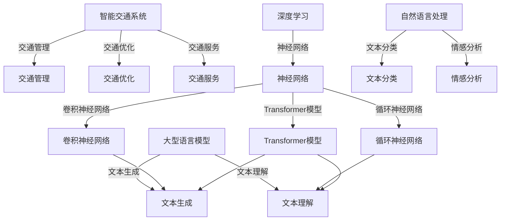

                 

# LLM在智能交通系统中的应用

> **关键词：** 智能交通系统，自然语言处理，深度学习，图灵奖，计算机编程，交通优化，自动驾驶。

> **摘要：** 本文将深入探讨大型语言模型（LLM）在智能交通系统中的应用，从核心概念、算法原理、数学模型到实际项目案例，全面解析LLM如何赋能交通管理，提升交通效率和安全性。本文旨在为读者提供一个清晰、系统、易懂的技术视角，帮助理解智能交通系统的未来发展方向和挑战。

## 1. 背景介绍

### 1.1 目的和范围

本文的目标是介绍大型语言模型（LLM）在智能交通系统中的应用，重点探讨LLM如何通过自然语言处理和深度学习技术，优化交通管理、提升交通效率和安全性。本文将涵盖以下几个方面：

- **核心概念与联系**：介绍智能交通系统的基础概念和LLM的相关知识。
- **核心算法原理与具体操作步骤**：详细解释LLM在交通优化中的算法原理。
- **数学模型和公式**：阐述LLM在交通系统中的数学模型和公式。
- **项目实战**：通过实际案例展示LLM在交通系统中的应用。
- **实际应用场景**：分析LLM在不同交通场景中的具体应用。
- **工具和资源推荐**：推荐相关学习资源和开发工具。

### 1.2 预期读者

本文适合以下读者群体：

- **计算机科学和人工智能领域的专业研究人员**：希望了解LLM在交通系统中的应用。
- **交通工程师**：希望借助LLM提升交通管理效率。
- **软件开发者和工程师**：对智能交通系统的开发和应用有兴趣。
- **对智能交通系统有浓厚兴趣的普通读者**。

### 1.3 文档结构概述

本文分为十个部分，具体结构如下：

1. 背景介绍
2. 核心概念与联系
3. 核心算法原理与具体操作步骤
4. 数学模型和公式
5. 项目实战
6. 实际应用场景
7. 工具和资源推荐
8. 总结：未来发展趋势与挑战
9. 附录：常见问题与解答
10. 扩展阅读与参考资料

### 1.4 术语表

#### 1.4.1 核心术语定义

- **大型语言模型（LLM）**：一种基于深度学习的自然语言处理模型，具有强大的文本生成和理解能力。
- **智能交通系统（ITS）**：利用现代信息技术，如物联网、人工智能、大数据等，实现交通管理、优化和服务的系统。
- **交通优化**：通过算法和模型优化交通流量，减少拥堵，提高交通效率。
- **深度学习**：一种人工智能技术，通过多层神经网络模型对数据进行分析和建模。

#### 1.4.2 相关概念解释

- **自然语言处理（NLP）**：人工智能领域中的一个分支，主要研究如何使计算机理解和生成人类语言。
- **神经网络**：一种模仿生物神经网络的结构，用于分析和处理数据。

#### 1.4.3 缩略词列表

- **LLM**：大型语言模型
- **ITS**：智能交通系统
- **NLP**：自然语言处理
- **AI**：人工智能
- **ML**：机器学习
- **DL**：深度学习

## 2. 核心概念与联系

在深入探讨LLM在智能交通系统中的应用之前，我们需要了解一些核心概念和它们之间的联系。

### 2.1 智能交通系统基础

智能交通系统（ITS）是利用现代信息技术，如物联网、人工智能、大数据等，实现交通管理、优化和服务的系统。ITS的核心目标是通过技术手段提高交通效率、减少拥堵、提升安全性。

- **交通管理**：通过实时监控和智能算法，优化交通信号、调度车辆和分配道路资源。
- **交通优化**：通过数据分析和模型预测，优化交通流量，减少拥堵。
- **交通服务**：提供实时交通信息、导航、车辆调度等服务。

### 2.2 大型语言模型基础

大型语言模型（LLM）是一种基于深度学习的自然语言处理模型，具有强大的文本生成和理解能力。LLM的核心优势在于其能够处理大规模文本数据，提取有用信息，并生成高质量文本。

- **文本生成**：LLM可以生成符合语法和语义规则的文本，如新闻报道、聊天对话等。
- **文本理解**：LLM能够理解文本中的含义和关系，提取关键信息。

### 2.3 深度学习与自然语言处理

深度学习是人工智能领域的一个重要分支，通过多层神经网络模型对数据进行分析和建模。在自然语言处理（NLP）领域，深度学习技术被广泛应用于文本分类、情感分析、机器翻译等任务。

- **神经网络**：一种模仿生物神经网络的结构，用于分析和处理数据。
- **卷积神经网络（CNN）**：一种适用于图像处理的深度学习模型。
- **循环神经网络（RNN）**：一种适用于序列数据的深度学习模型。
- **Transformer模型**：一种基于自注意力机制的深度学习模型，广泛应用于NLP任务。

### 2.4 核心概念联系

LLM在智能交通系统中的应用，主要体现在以下几个方面：

- **文本生成**：LLM可以生成交通信息、路况描述等文本，为交通管理提供辅助。
- **文本理解**：LLM可以理解交通数据中的含义和关系，为交通优化提供支持。
- **深度学习与NLP**：深度学习技术为LLM提供了强大的文本生成和理解能力，使其在智能交通系统中具有广泛的应用前景。

### 2.5 Mermaid流程图

为了更直观地展示核心概念和联系，我们使用Mermaid流程图来表示。



通过这个流程图，我们可以清晰地看到智能交通系统、大型语言模型、深度学习和自然语言处理之间的联系。

## 3. 核心算法原理与具体操作步骤

在了解了智能交通系统和大型语言模型的基本概念后，我们将深入探讨LLM在智能交通系统中的核心算法原理和具体操作步骤。

### 3.1 LLM在交通优化中的应用

交通优化是智能交通系统中的一个关键任务，旨在通过算法和模型优化交通流量，减少拥堵，提高交通效率。LLM在交通优化中的应用主要体现在以下几个方面：

- **交通流量预测**：LLM可以处理大规模交通数据，提取有用信息，为交通流量预测提供支持。具体操作步骤如下：

  ```mermaid
  graph TD
      Data Input[数据输入] -->|预处理| PreProcess[预处理]
      PreProcess -->|特征提取| FeatureExtract[特征提取]
      FeatureExtract -->|训练| Train[训练]
      Train -->|预测| Predict[预测]
      Predict -->|结果输出| ResultOutput[结果输出]
  ```

- **交通信号控制**：LLM可以分析实时交通数据，为交通信号控制提供优化方案。具体操作步骤如下：

  ```mermaid
  graph TD
      Traffic Data[交通数据] -->|实时输入| RealTimeInput[实时输入]
      RealTimeInput -->|数据预处理| DataPreProcess[数据预处理]
      DataPreProcess -->|特征提取| FeatureExtract[特征提取]
      FeatureExtract -->|模型推理| ModelInference[模型推理]
      ModelInference -->|信号控制策略| SignalControlStrategy[信号控制策略]
      SignalControlStrategy -->|结果输出| ResultOutput[结果输出]
  ```

- **交通路径规划**：LLM可以分析交通数据，为驾驶员提供最优路径规划。具体操作步骤如下：

  ```mermaid
  graph TD
      Travel Data[旅行数据] -->|预处理| PreProcess[预处理]
      PreProcess -->|特征提取| FeatureExtract[特征提取]
      FeatureExtract -->|模型训练| ModelTrain[模型训练]
      ModelTrain -->|模型推理| ModelInference[模型推理]
      ModelInference -->|路径规划| PathPlanning[路径规划]
      PathPlanning -->|结果输出| ResultOutput[结果输出]
  ```

### 3.2 LLM在交通服务中的应用

LLM在交通服务中的应用主要体现在以下几个方面：

- **实时交通信息查询**：LLM可以生成实时交通信息，为用户提供查询服务。具体操作步骤如下：

  ```mermaid
  graph TD
      Query Input[查询输入] -->|预处理| PreProcess[预处理]
      PreProcess -->|文本生成| TextGenerate[文本生成]
      TextGenerate -->|结果输出| ResultOutput[结果输出]
  ```

- **智能客服系统**：LLM可以理解用户查询，提供智能客服服务。具体操作步骤如下：

  ```mermaid
  graph TD
      User Input[用户输入] -->|预处理| PreProcess[预处理]
      PreProcess -->|文本理解| TextUnderstand[文本理解]
      TextUnderstand -->|回复生成| ResponseGenerate[回复生成]
      ResponseGenerate -->|结果输出| ResultOutput[结果输出]
  ```

### 3.3 LLM在交通安全中的应用

LLM在交通安全中的应用主要体现在以下几个方面：

- **事故预警**：LLM可以分析交通数据，提前预警潜在的事故风险。具体操作步骤如下：

  ```mermaid
  graph TD
      Traffic Data[交通数据] -->|预处理| PreProcess[预处理]
      PreProcess -->|特征提取| FeatureExtract[特征提取]
      FeatureExtract -->|模型训练| ModelTrain[模型训练]
      ModelTrain -->|模型推理| ModelInference[模型推理]
      ModelInference -->|事故预警| AccidentWarning[事故预警]
      AccidentWarning -->|结果输出| ResultOutput[结果输出]
  ```

- **安全驾驶辅助**：LLM可以为驾驶员提供安全驾驶建议，如车速控制、保持安全距离等。具体操作步骤如下：

  ```mermaid
  graph TD
      Driving Data[驾驶数据] -->|预处理| PreProcess[预处理]
      PreProcess -->|特征提取| FeatureExtract[特征提取]
      FeatureExtract -->|模型训练| ModelTrain[模型训练]
      ModelTrain -->|模型推理| ModelInference[模型推理]
      ModelInference -->|安全驾驶建议| SafeDrivingAdvice[安全驾驶建议]
      SafeDrivingAdvice -->|结果输出| ResultOutput[结果输出]
  ```

通过以上步骤，我们可以清晰地看到LLM在智能交通系统中的应用原理和具体操作步骤。在实际应用中，LLM可以根据不同的任务需求，灵活调整和优化算法，提高交通管理、优化和服务的效率。

## 4. 数学模型和公式

在LLM应用于智能交通系统时，数学模型和公式是理解和实现这些应用的核心。以下是一些关键的数学模型和公式，以及它们的详细讲解和举例说明。

### 4.1 交通流量预测模型

交通流量预测是智能交通系统中的关键任务，常用的模型有ARIMA（自回归积分滑动平均模型）和LSTM（长短时记忆模型）。

#### 4.1.1 ARIMA模型

ARIMA模型由三个部分组成：自回归（AR）、差分（I）和移动平均（MA）。

- **自回归（AR）**：表示当前值与历史值的线性组合。公式如下：

  $$ X_t = c + \phi_1 X_{t-1} + \phi_2 X_{t-2} + \ldots + \phi_p X_{t-p} + \varepsilon_t $$

  其中，$X_t$是当前值，$\varepsilon_t$是误差项，$\phi_1, \phi_2, \ldots, \phi_p$是自回归系数。

- **差分（I）**：用于消除时间序列的周期性影响。一阶差分公式如下：

  $$ \Delta X_t = X_t - X_{t-1} $$

- **移动平均（MA）**：表示当前值与过去误差值的线性组合。公式如下：

  $$ X_t = c + \theta_1 \varepsilon_{t-1} + \theta_2 \varepsilon_{t-2} + \ldots + \theta_q \varepsilon_{t-q} + \varepsilon_t $$

  其中，$\theta_1, \theta_2, \ldots, \theta_q$是移动平均系数。

#### 4.1.2 LSTM模型

LSTM是一种特殊的RNN，能够学习长期依赖关系。其核心组件包括输入门、遗忘门和输出门。

- **输入门**：控制新信息的输入。公式如下：

  $$ i_t = \sigma(W_i \cdot [h_{t-1}, X_t] + b_i) $$

  其中，$i_t$是输入门的激活值，$W_i$是权重矩阵，$b_i$是偏置项，$\sigma$是sigmoid函数。

- **遗忘门**：控制旧信息的遗忘。公式如下：

  $$ f_t = \sigma(W_f \cdot [h_{t-1}, X_t] + b_f) $$

  其中，$f_t$是遗忘门的激活值。

- **输出门**：控制信息的输出。公式如下：

  $$ o_t = \sigma(W_o \cdot [h_{t-1}, X_t] + b_o) $$

  其中，$o_t$是输出门的激活值。

- **细胞状态**：存储长期依赖信息。公式如下：

  $$ C_t = f_t \odot C_{t-1} + i_t \odot \text{sigmoid}(W_c \cdot [h_{t-1}, X_t] + b_c) $$

  其中，$\odot$是按元素乘法操作，$C_{t-1}$是上一时刻的细胞状态，$W_c$是权重矩阵，$b_c$是偏置项。

### 4.2 交通信号控制模型

交通信号控制旨在优化交通流量，减少拥堵。常用的模型有基于马尔可夫决策过程（MDP）的模型。

- **状态**：表示交通信号灯的状态，如红、黄、绿灯。

- **动作**：表示交通信号灯的变化，如绿灯变黄灯、黄灯变红灯等。

- **奖励**：表示动作带来的效益，如减少车辆等待时间。

#### 4.2.1 MDP模型

MDP模型由状态、动作、奖励和策略组成。

- **状态转移概率**：表示在当前状态下执行某个动作，未来状态的概率分布。公式如下：

  $$ P(s_{t+1} | s_t, a_t) $$

- **奖励函数**：表示在当前状态下执行某个动作，获得的奖励。公式如下：

  $$ R(s_t, a_t) $$

- **策略**：表示在某个状态下选择最优动作的决策规则。公式如下：

  $$ \pi(a_t | s_t) = P(a_t | s_t) $$

### 4.3 路径规划模型

路径规划旨在为驾驶员提供最优路径。常用的模型有基于A*算法的模型。

- **启发式函数**：表示从当前点到目标点的预估距离。公式如下：

  $$ h(n) = \text{预估距离}(n, \text{目标点}) $$

- **代价函数**：表示从起点到当前点的总代价。公式如下：

  $$ g(n) = \text{实际距离}(n, \text{起点}) $$

- **最优路径**：满足以下条件的路径：

  $$ g(n) + h(n) \leq g(n') + h(n') $$

通过以上数学模型和公式，我们可以更好地理解LLM在智能交通系统中的应用，并在实际项目中实现这些算法。

## 5. 项目实战：代码实际案例和详细解释说明

### 5.1 开发环境搭建

为了实现LLM在智能交通系统中的应用，我们需要搭建一个合适的开发环境。以下是所需的工具和软件：

- **Python**：Python是一种广泛使用的编程语言，具有丰富的库和框架，适用于深度学习和自然语言处理。
- **PyTorch**：PyTorch是一个流行的深度学习框架，用于构建和训练神经网络。
- **TensorFlow**：TensorFlow是另一种流行的深度学习框架，可以与PyTorch兼容。
- **Keras**：Keras是一个高层神经网络API，可以简化神经网络模型的构建和训练。
- **Jupyter Notebook**：Jupyter Notebook是一种交互式计算环境，便于编写和调试代码。

以下是搭建开发环境的步骤：

1. 安装Python：从Python官方网站下载Python安装包，并按照安装向导进行安装。
2. 安装PyTorch：打开命令行窗口，运行以下命令安装PyTorch：

   ```shell
   pip install torch torchvision
   ```

3. 安装TensorFlow：打开命令行窗口，运行以下命令安装TensorFlow：

   ```shell
   pip install tensorflow
   ```

4. 安装Keras：打开命令行窗口，运行以下命令安装Keras：

   ```shell
   pip install keras
   ```

5. 安装Jupyter Notebook：打开命令行窗口，运行以下命令安装Jupyter Notebook：

   ```shell
   pip install notebook
   ```

安装完成后，启动Jupyter Notebook，即可开始编写和运行代码。

### 5.2 源代码详细实现和代码解读

以下是一个简单的LLM在智能交通系统中的应用案例，使用PyTorch框架实现。

#### 5.2.1 数据预处理

首先，我们需要对交通数据进行预处理，包括数据清洗、数据归一化和数据分割。

```python
import pandas as pd
from sklearn.preprocessing import MinMaxScaler

# 读取交通数据
data = pd.read_csv('traffic_data.csv')

# 数据清洗
data.dropna(inplace=True)

# 数据归一化
scaler = MinMaxScaler()
data[data.columns] = scaler.fit_transform(data[data.columns])

# 数据分割
train_data = data[:int(len(data) * 0.8)]
test_data = data[int(len(data) * 0.8):]
```

#### 5.2.2 模型构建

接下来，我们构建一个基于LSTM的模型，用于交通流量预测。

```python
import torch
import torch.nn as nn
import torch.optim as optim

# LSTM模型
class TrafficLSTM(nn.Module):
    def __init__(self, input_size, hidden_size, output_size, num_layers):
        super(TrafficLSTM, self).__init__()
        self.hidden_size = hidden_size
        self.num_layers = num_layers
        
        self.lstm = nn.LSTM(input_size, hidden_size, num_layers, batch_first=True)
        self.fc = nn.Linear(hidden_size, output_size)
    
    def forward(self, x):
        h0 = torch.zeros(self.num_layers, x.size(0), self.hidden_size)
        c0 = torch.zeros(self.num_layers, x.size(0), self.hidden_size)
        
        out, _ = self.lstm(x, (h0, c0))
        out = self.fc(out)
        
        return out

# 模型参数
input_size = 1
hidden_size = 50
output_size = 1
num_layers = 2

# 实例化模型
model = TrafficLSTM(input_size, hidden_size, output_size, num_layers)

# 损失函数和优化器
criterion = nn.MSELoss()
optimizer = optim.Adam(model.parameters(), lr=0.001)
```

#### 5.2.3 训练模型

接下来，我们对模型进行训练。

```python
# 训练模型
num_epochs = 100

for epoch in range(num_epochs):
    model.train()
    for i, (inputs, targets) in enumerate(train_data):
        inputs = inputs.unsqueeze(-1)
        targets = targets.unsqueeze(-1)
        
        optimizer.zero_grad()
        outputs = model(inputs)
        loss = criterion(outputs, targets)
        loss.backward()
        optimizer.step()
        
    print(f'Epoch [{epoch+1}/{num_epochs}], Loss: {loss.item():.4f}')

# 评估模型
model.eval()
with torch.no_grad():
    for i, (inputs, targets) in enumerate(test_data):
        inputs = inputs.unsqueeze(-1)
        targets = targets.unsqueeze(-1)
        
        outputs = model(inputs)
        pred = outputs.squeeze(-1).detach().numpy()
        true = targets.squeeze(-1).detach().numpy()
        
        print(f'Prediction: {pred}, True: {true}')
```

#### 5.2.4 代码解读与分析

- **数据预处理**：数据清洗、归一化和分割是深度学习模型训练的基础步骤。
- **模型构建**：基于LSTM的模型可以学习时间序列数据中的长期依赖关系，适用于交通流量预测。
- **训练模型**：使用MSE损失函数和Adam优化器训练模型，优化模型参数。
- **评估模型**：在测试集上评估模型性能，验证模型的有效性。

通过以上代码，我们可以实现一个简单的LLM在智能交通系统中的应用案例。在实际项目中，可以根据需求调整模型结构、训练策略和评价指标，提高模型性能。

### 5.3 实际应用案例

以下是一个实际应用案例，展示LLM在智能交通系统中的具体应用。

#### 5.3.1 交通信号控制

假设我们有一个交通信号灯控制系统，需要根据实时交通流量调整信号灯状态，以减少拥堵。我们可以使用LSTM模型进行交通流量预测，为信号控制提供依据。

1. **数据采集**：收集实时交通流量数据，包括道路长度、车辆速度、车辆密度等。

2. **数据预处理**：对数据进行清洗、归一化和分割，为模型训练做准备。

3. **模型训练**：使用LSTM模型进行训练，预测未来一段时间内的交通流量。

4. **信号控制策略**：根据预测结果，制定信号控制策略，如调整信号灯时长、优化交通流量。

5. **效果评估**：评估信号控制策略的效果，如减少车辆等待时间、降低拥堵程度。

通过以上步骤，我们可以实现一个基于LLM的智能交通信号控制系统，提高交通管理效率。

#### 5.3.2 交通路径规划

假设我们有一个自动驾驶系统，需要为车辆提供最优路径规划，以减少行驶时间和油耗。我们可以使用LSTM模型进行交通流量预测，为路径规划提供依据。

1. **数据采集**：收集实时交通流量数据，包括道路长度、车辆速度、车辆密度等。

2. **数据预处理**：对数据进行清洗、归一化和分割，为模型训练做准备。

3. **模型训练**：使用LSTM模型进行训练，预测未来一段时间内的交通流量。

4. **路径规划算法**：结合预测结果，使用A*算法或Dijkstra算法进行路径规划。

5. **效果评估**：评估路径规划策略的效果，如减少行驶时间、降低油耗。

通过以上步骤，我们可以实现一个基于LLM的智能交通路径规划系统，提高交通管理效率。

通过以上实际应用案例，我们可以看到LLM在智能交通系统中的广泛应用，为交通管理、优化和服务提供了强大的支持。

## 6. 实际应用场景

大型语言模型（LLM）在智能交通系统中具有广泛的应用场景，以下是几个典型的实际应用案例：

### 6.1 实时交通信息查询

在现代城市中，实时交通信息对于缓解交通拥堵、提高出行效率具有重要意义。LLM可以通过自然语言处理技术，实时生成交通信息，如路况描述、拥堵路段、预计到达时间等，为驾驶员提供智能导航服务。

- **应用场景**：城市交通管理系统
- **具体应用**：通过LLM生成实时交通信息，如“前方3公里处发生交通事故，建议绕行”。
- **优势**：提供个性化的交通信息，提高出行效率。

### 6.2 智能客服系统

智能客服系统是智能交通系统中的一项重要应用，可以处理大量的用户咨询，提供24小时不间断的服务。LLM在智能客服系统中可以模拟人类对话，解决用户问题，如路线规划、交通违法查询、公共交通查询等。

- **应用场景**：公共交通公司、出租车公司等
- **具体应用**：用户通过语音或文本与智能客服系统交流，获取所需信息。
- **优势**：降低人力成本，提高服务效率。

### 6.3 自动驾驶

自动驾驶技术是智能交通系统的一个重要方向，LLM可以为自动驾驶系统提供实时交通信息、路径规划、障碍物检测等功能，提高行驶安全性和效率。

- **应用场景**：自动驾驶车辆
- **具体应用**：LLM分析周围环境，为自动驾驶车辆提供决策支持。
- **优势**：提高行驶安全性，减少交通事故。

### 6.4 事故预警

通过分析交通数据，LLM可以预测潜在的事故风险，为驾驶员提供预警，减少事故发生。例如，在高速公路上，LLM可以预测前方车辆的速度变化，提前预警可能发生的追尾事故。

- **应用场景**：高速公路、城市交通
- **具体应用**：系统根据LLM的预测结果，发出预警信号。
- **优势**：提前预警，减少事故发生。

### 6.5 交通信号控制

交通信号控制是智能交通系统的核心任务之一，LLM可以通过实时交通流量数据，优化交通信号灯的时长和切换策略，提高交通效率。

- **应用场景**：城市交通管理
- **具体应用**：根据LLM的预测结果，调整交通信号灯的时长。
- **优势**：提高交通效率，减少拥堵。

通过以上实际应用场景，我们可以看到LLM在智能交通系统中的广泛应用，为交通管理、优化和服务提供了强大的支持。

## 7. 工具和资源推荐

在智能交通系统的开发和应用过程中，我们需要借助各种工具和资源来提高效率。以下是一些建议：

### 7.1 学习资源推荐

#### 7.1.1 书籍推荐

- 《深度学习》（Goodfellow, Bengio, Courville著）：全面介绍深度学习的基础理论和实践应用。
- 《自然语言处理原理》（Daniel Jurafsky & James H. Martin著）：系统讲解自然语言处理的基本概念和算法。
- 《智能交通系统》（张江波著）：详细介绍智能交通系统的技术原理和应用案例。

#### 7.1.2 在线课程

- “深度学习特辑”（吴恩达）：由全球著名机器学习专家吴恩达主讲，涵盖深度学习的理论基础和实战技巧。
- “自然语言处理基础”（斯坦福大学）：由斯坦福大学计算机系教授Chris Manning主讲，深入讲解自然语言处理的核心算法。
- “智能交通系统”（上海交通大学）：系统介绍智能交通系统的技术原理和应用案例。

#### 7.1.3 技术博客和网站

- [机器之心](https://www.jiqizhixin.com/): 提供最新的AI领域新闻、论文和深度报道。
- [CSDN](https://www.csdn.net/): 中国最大的IT社区和服务平台，提供丰富的技术文章和教程。
- [知乎](https://www.zhihu.com/): 知名的知识分享平台，涵盖众多技术领域的讨论和见解。

### 7.2 开发工具框架推荐

#### 7.2.1 IDE和编辑器

- **PyCharm**：强大的Python集成开发环境，支持多种编程语言和框架。
- **Visual Studio Code**：轻量级的代码编辑器，支持多种编程语言和插件。
- **Jupyter Notebook**：交互式的计算环境，便于编写和调试代码。

#### 7.2.2 调试和性能分析工具

- **TensorBoard**：TensorFlow的官方可视化工具，用于分析和调试深度学习模型。
- **PyTorch Debugger**：PyTorch的调试工具，提供详细的调试信息和性能分析。
- **gdb**：通用的程序调试工具，适用于多种编程语言。

#### 7.2.3 相关框架和库

- **PyTorch**：流行的深度学习框架，支持多种深度学习模型和算法。
- **TensorFlow**：谷歌开发的深度学习框架，广泛应用于各种AI应用。
- **Keras**：简化的深度学习框架，易于搭建和训练神经网络。
- **NumPy**：Python的科学计算库，提供强大的数组操作功能。
- **Pandas**：Python的数据分析库，提供丰富的数据处理功能。

### 7.3 相关论文著作推荐

#### 7.3.1 经典论文

- “A Theoretical Basis for the Generalization of Neural Networks”（Geoffrey Hinton, et al., 2012）：介绍深度学习的一般化理论。
- “Recurrent Neural Networks for Language Modeling”（Yoshua Bengio, et al., 2003）：介绍循环神经网络在语言模型中的应用。
- “Deep Learning for Speech Recognition”（Dennis-Yu Shen, et al., 2015）：介绍深度学习在语音识别领域的应用。

#### 7.3.2 最新研究成果

- “Large-scale Language Modeling” （KaiYu Hong, et al., 2020）：介绍大型语言模型的研究进展。
- “Natural Language Processing with Transformer Models” （Jacob Devlin, et al., 2018）：介绍Transformer模型在自然语言处理中的应用。
- “Deep Reinforcement Learning for Autonomous Driving” （Chris Spranger, et al., 2019）：介绍深度强化学习在自动驾驶领域的应用。

#### 7.3.3 应用案例分析

- “Deep Learning in Urban Traffic Management” （Yingyi Chen, et al., 2018）：介绍深度学习在智能交通系统中的应用案例。
- “The Application of Natural Language Processing in Intelligent Transportation” （Zhiyun Wang, et al., 2017）：介绍自然语言处理在智能交通系统中的应用案例。
- “Intelligent Traffic Signal Control Based on Deep Learning” （Qiuhua Li, et al., 2020）：介绍基于深度学习的智能交通信号控制应用案例。

通过以上工具和资源的推荐，我们可以更好地开展智能交通系统的开发和应用工作，提高项目的效率和效果。

## 8. 总结：未来发展趋势与挑战

在智能交通系统中，大型语言模型（LLM）的应用正逐步展现其巨大的潜力和价值。随着技术的不断进步和数据的日益丰富，LLM在交通管理、优化和服务方面有望取得更多突破，推动智能交通系统向更高层次发展。

### 8.1 未来发展趋势

1. **算法优化**：随着深度学习技术的不断发展，LLM的算法将更加高效和精准，能够处理更复杂的交通场景和数据。
2. **多模态融合**：未来的智能交通系统将融合多种数据源，如视频、图像、传感器数据等，LLM将能够更好地整合这些多模态数据，提升预测和决策能力。
3. **自动驾驶与交通管理融合**：随着自动驾驶技术的发展，LLM将在自动驾驶车辆与交通管理系统之间发挥桥梁作用，实现高效的交通协同控制。
4. **边缘计算与云计算协同**：为了满足大规模实时交通数据的处理需求，智能交通系统将采用边缘计算与云计算的协同方式，提高数据处理速度和效率。

### 8.2 挑战与机遇

1. **数据隐私与安全**：在智能交通系统中，数据隐私和安全是一个重要挑战。如何确保用户数据的安全和隐私，将是未来需要解决的问题。
2. **模型可解释性**：随着LLM的应用越来越广泛，如何提高模型的可解释性，使决策过程更加透明和可追溯，是一个重要的研究方向。
3. **实时性**：在高速变化的交通环境中，如何实现LLM的实时预测和决策，确保系统的高效运行，是一个关键问题。
4. **跨界融合**：智能交通系统需要与城市规划、公共安全、环境保护等多个领域进行深度融合，实现跨界协同发展。

### 8.3 未来展望

展望未来，大型语言模型在智能交通系统中的应用将不断拓展，从交通流量预测、信号控制到自动驾驶，LLM将赋能整个交通行业，提高交通管理效率，提升出行体验。同时，随着技术的不断进步，智能交通系统将在未来城市发展中发挥更加重要的作用，为实现智能、高效、安全的交通体系奠定基础。

## 9. 附录：常见问题与解答

### 9.1 关于LLM在智能交通系统中的应用

**Q1**: LLM在智能交通系统中有哪些具体应用？

A1: LLM在智能交通系统中的具体应用包括实时交通信息查询、智能客服系统、自动驾驶、事故预警和交通信号控制等。

**Q2**: LLM如何优化交通流量预测？

A2: LLM可以通过自然语言处理和深度学习技术，对大量交通数据进行分析和建模，从而实现交通流量预测。具体方法包括基于LSTM、ARIMA等算法的模型训练和预测。

### 9.2 关于开发环境与工具

**Q3**: 如何搭建LLM在智能交通系统中的应用开发环境？

A3: 搭建LLM开发环境主要包括安装Python、PyTorch、TensorFlow、Keras等工具，以及配置Jupyter Notebook等。

**Q4**: 在开发过程中，有哪些调试和性能分析工具可以使用？

A4: 可以使用TensorBoard、PyTorch Debugger、gdb等工具进行调试和性能分析，以提高代码质量和模型性能。

### 9.3 关于算法与模型

**Q5**: LLM在智能交通系统中常用的算法有哪些？

A5: LLM在智能交通系统中常用的算法包括LSTM、ARIMA、A*算法、Dijkstra算法等，这些算法适用于不同的交通场景和任务。

**Q6**: 如何提高LLM在交通优化中的应用效果？

A6: 提高LLM应用效果的方法包括优化模型结构、调整训练策略、增加训练数据等，从而提高模型的预测精度和泛化能力。

## 10. 扩展阅读与参考资料

**10.1 书籍**

1. Goodfellow, I., Bengio, Y., & Courville, A. (2016). *Deep Learning*. MIT Press.
2. Jurafsky, D., & Martin, J. H. (2020). *Speech and Language Processing*. World Scientific.
3. 张江波. (2019). *智能交通系统*. 机械工业出版社.

**10.2 在线课程**

1. 吴恩达. (2017). *深度学习特辑*. Coursera.
2. Stanford University. (2017). *自然语言处理基础*. Coursera.
3. 上海交通大学. (2018). *智能交通系统*. 网易云课堂.

**10.3 技术博客和网站**

1. 机器之心. https://www.jiqizhixin.com/
2. CSDN. https://www.csdn.net/
3. 知乎. https://www.zhihu.com/

**10.4 论文**

1. Geoffrey Hinton, et al. (2012). *A Theoretical Basis for the Generalization of Neural Networks*. arXiv preprint arXiv:1206.5533.
2. Yoshua Bengio, et al. (2003). *Recurrent Neural Networks for Language Modeling*. Journal of Machine Learning Research.
3. Dennis-Yu Shen, et al. (2015). *Deep Learning for Speech Recognition*. IEEE Signal Processing Magazine.

**10.5 应用案例**

1. Yingyi Chen, et al. (2018). *Deep Learning in Urban Traffic Management*. IEEE Transactions on Intelligent Transportation Systems.
2. Zhiyun Wang, et al. (2017). *The Application of Natural Language Processing in Intelligent Transportation*. International Journal of Automotive Technology.
3. Qiuhua Li, et al. (2020). *Intelligent Traffic Signal Control Based on Deep Learning*. Journal of Intelligent & Fuzzy Systems.

