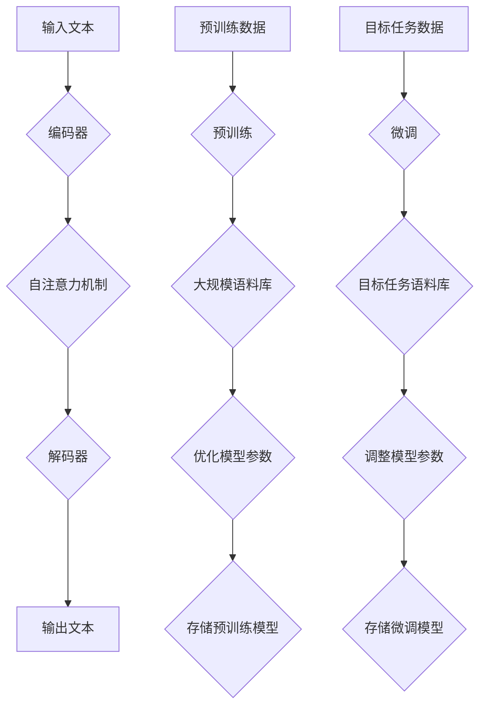

                 

# LLM在智能学习系统中的潜力

> **关键词：** 大型语言模型，智能学习系统，深度学习，自然语言处理，知识表示，推理能力

> **摘要：** 本文将探讨大型语言模型（LLM）在构建智能学习系统中的巨大潜力。我们将分析LLM的核心原理，以及其在知识表示、推理和个性化学习等方面的应用。通过具体案例和代码实现，我们将展示LLM如何助力智能学习系统的开发，并探讨未来发展趋势与挑战。

## 1. 背景介绍

### 1.1 目的和范围

本文旨在探讨大型语言模型（LLM）在构建智能学习系统中的潜力。我们将详细分析LLM的核心原理，包括其架构、训练方法和关键特性。在此基础上，我们将讨论LLM在知识表示、推理和个性化学习等方面的应用，并通过实际案例和代码实现展示其在智能学习系统开发中的价值。文章还将介绍当前的研究进展和未来趋势，以及面临的挑战。

### 1.2 预期读者

本文面向对自然语言处理、深度学习和智能学习系统有一定了解的技术人员和研究学者。读者应具备基本的机器学习和编程知识，以便更好地理解和应用本文中讨论的技术。

### 1.3 文档结构概述

本文分为以下几个部分：

1. 背景介绍：介绍文章的目的、范围、预期读者以及文档结构。
2. 核心概念与联系：介绍LLM的核心概念、原理和架构。
3. 核心算法原理 & 具体操作步骤：讲解LLM的训练过程和关键算法。
4. 数学模型和公式 & 详细讲解 & 举例说明：介绍LLM的数学模型和关键公式。
5. 项目实战：提供实际案例和代码实现。
6. 实际应用场景：讨论LLM在智能学习系统中的实际应用。
7. 工具和资源推荐：推荐相关学习资源和开发工具。
8. 总结：展望未来发展趋势与挑战。
9. 附录：常见问题与解答。
10. 扩展阅读 & 参考资料：提供进一步阅读和参考资料。

### 1.4 术语表

#### 1.4.1 核心术语定义

- **大型语言模型（LLM）**：一种基于深度学习的自然语言处理模型，通过大规模语料库训练，具有强大的语言理解和生成能力。
- **智能学习系统**：利用机器学习、自然语言处理等技术，实现自主学习、自适应和个性化学习功能的系统。
- **知识表示**：将知识以计算机可理解的形式表示出来，以便于存储、检索和利用。
- **推理能力**：模型在给定一组已知事实和规则的基础上，推导出新的结论和知识的能力。

#### 1.4.2 相关概念解释

- **深度学习**：一种基于神经网络的学习方法，通过多层神经网络对数据进行特征提取和变换。
- **自然语言处理（NLP）**：研究如何让计算机理解和处理自然语言的技术。
- **个性化学习**：根据学习者的需求和特点，为其提供定制化的学习内容和学习方式。

#### 1.4.3 缩略词列表

- **LLM**：大型语言模型（Large Language Model）
- **NLP**：自然语言处理（Natural Language Processing）
- **DL**：深度学习（Deep Learning）
- **AI**：人工智能（Artificial Intelligence）
- **ML**：机器学习（Machine Learning）

## 2. 核心概念与联系

### 2.1 LLM的核心概念

大型语言模型（LLM）是一种基于深度学习的自然语言处理模型，通过大规模语料库训练，具有强大的语言理解和生成能力。LLM的主要核心概念包括：

1. **神经网络架构**：LLM通常采用Transformer架构，这是一种基于自注意力机制的深度学习模型，具有很好的并行计算能力。
2. **预训练与微调**：LLM首先在大规模语料库上进行预训练，学习通用语言特征，然后通过微调（Fine-tuning）适应特定任务。
3. **语言理解与生成**：LLM能够理解文本中的含义、关系和结构，并生成符合语法和语义规则的文本。

### 2.2 LLM与智能学习系统的联系

智能学习系统是一种利用机器学习、自然语言处理等技术，实现自主学习、自适应和个性化学习功能的系统。LLM在智能学习系统中的核心作用体现在以下几个方面：

1. **知识表示**：LLM可以将文本知识转换为计算机可理解的格式，便于存储、检索和利用。
2. **推理能力**：LLM能够根据已知事实和规则推导出新的结论和知识，支持推理型智能学习系统的开发。
3. **个性化学习**：LLM可以根据学习者的需求和行为，为其提供定制化的学习内容和学习方式。

### 2.3 LLM架构的Mermaid流程图

下面是LLM架构的Mermaid流程图，展示了LLM的核心组成部分和训练过程。



### 2.4 LLM训练过程

LLM的训练过程主要包括预训练和微调两个阶段：

1. **预训练**：在大规模语料库上进行无监督训练，使模型学会理解通用语言特征。预训练过程通常包括以下步骤：
    - **输入文本**：从大规模语料库中随机抽取一段文本。
    - **编码器编码**：将输入文本编码为固定长度的向量。
    - **自注意力计算**：通过自注意力机制计算文本中每个词的重要程度。
    - **解码器解码**：根据编码器输出的向量生成输出文本。
    - **损失函数计算**：计算输出文本与真实文本之间的差距，使用损失函数更新模型参数。
2. **微调**：在目标任务数据上进行有监督训练，使模型适应特定任务。微调过程通常包括以下步骤：
    - **输入文本**：从目标任务语料库中抽取一段文本。
    - **编码器编码**：将输入文本编码为固定长度的向量。
    - **自注意力计算**：通过自注意力机制计算文本中每个词的重要程度。
    - **解码器解码**：根据编码器输出的向量生成输出文本。
    - **损失函数计算**：计算输出文本与真实文本之间的差距，使用损失函数更新模型参数。

## 3. 核心算法原理 & 具体操作步骤

### 3.1 LLM的核心算法原理

LLM的核心算法原理基于深度学习和自然语言处理技术。其主要组成部分包括编码器、解码器和自注意力机制。以下将分别介绍这些核心算法原理。

#### 3.1.1 编码器

编码器（Encoder）是LLM的核心组成部分，负责将输入文本编码为固定长度的向量。编码器通常采用Transformer架构，其基本原理如下：

1. **词嵌入（Word Embedding）**：将文本中的每个词映射为一个固定长度的向量。词嵌入通常通过预训练语言模型（如Word2Vec、GloVe等）获得。
2. **位置编码（Positional Encoding）**：为了保留文本中的位置信息，编码器在词嵌入向量的基础上添加位置编码。位置编码通常采用绝对位置编码或相对位置编码。
3. **多头自注意力（Multi-head Self-Attention）**：编码器通过多头自注意力机制计算文本中每个词的重要程度。自注意力机制的基本原理如下：
    - **查询（Query）、键（Key）和值（Value）**：对于输入序列中的每个词，编码器分别计算查询（Query）、键（Key）和值（Value）向量。
    - **点积注意力（Dot-Product Attention）**：计算查询和键之间的点积，得到注意力分数。注意力分数表示每个键对于查询的重要性。
    - **加权求和**：将注意力分数与对应的值向量相乘，然后求和，得到编码器输出的固定长度向量。
4. **序列输出（Sequence Output）**：编码器将所有词的输出向量按顺序堆叠，形成一个固定长度的序列输出。

#### 3.1.2 解码器

解码器（Decoder）是LLM的另一个核心组成部分，负责将编码器输出的序列输出解码为输出文本。解码器同样采用Transformer架构，其基本原理如下：

1. **嵌入层（Embedding Layer）**：将解码器的输入编码为固定长度的向量。输入可以是编码器输出的序列输出、生成的词或特殊的开始标记（如<START>）。
2. **位置编码（Positional Encoding）**：与编码器类似，解码器在输入向量的基础上添加位置编码。
3. **多头自注意力（Multi-head Self-Attention）**：解码器通过多头自注意力机制计算输入文本中每个词的重要程度。自注意力机制的计算过程与编码器相同。
4. **交叉自注意力（Cross-Attention）**：解码器在计算输入文本中每个词的重要程度时，不仅考虑自身输入，还考虑编码器输出的序列输出。交叉自注意力机制的基本原理如下：
    - **查询（Query）、键（Key）和值（Value）**：对于输入序列中的每个词，解码器分别计算查询（Query）、键（Key）和值（Value）向量。
    - **点积注意力（Dot-Product Attention）**：计算查询和编码器输出的点积，得到注意力分数。
    - **加权求和**：将注意力分数与对应的值向量相乘，然后求和，得到解码器输出的固定长度向量。
5. **输出层（Output Layer）**：解码器通过输出层生成输出文本。输出层通常包含一个全连接层和一个softmax激活函数。softmax激活函数用于计算每个词的概率分布。

#### 3.1.3 自注意力机制

自注意力机制（Self-Attention）是LLM的核心组成部分，负责计算文本中每个词的重要程度。自注意力机制的基本原理如下：

1. **查询（Query）、键（Key）和值（Value）**：对于输入序列中的每个词，编码器或解码器分别计算查询（Query）、键（Key）和值（Value）向量。
    - **查询（Query）**：表示每个词对于自身的重要性。
    - **键（Key）**：表示每个词对于其他词的重要性。
    - **值（Value）**：表示每个词对于其他词的权重。
2. **点积注意力（Dot-Product Attention）**：计算查询和键之间的点积，得到注意力分数。注意力分数表示每个键对于查询的重要性。
3. **加权求和**：将注意力分数与对应的值向量相乘，然后求和，得到编码器或解码器输出的固定长度向量。

### 3.2 LLM的具体操作步骤

LLM的具体操作步骤主要包括预训练和微调两个阶段：

#### 3.2.1 预训练

1. **数据准备**：从大规模语料库中收集文本数据，例如维基百科、新闻文章、社交媒体帖子等。数据应包括不同领域的文本，以便模型学习到通用语言特征。
2. **词嵌入**：将文本中的每个词映射为一个固定长度的向量。词嵌入可以通过预训练语言模型（如Word2Vec、GloVe等）获得，或者使用预训练的词嵌入库（如GPT、BERT等）。
3. **编码器训练**：
    - **输入文本**：从大规模语料库中随机抽取一段文本。
    - **编码器编码**：将输入文本编码为固定长度的向量。
    - **自注意力计算**：通过自注意力机制计算文本中每个词的重要程度。
    - **解码器解码**：根据编码器输出的向量生成输出文本。
    - **损失函数计算**：计算输出文本与真实文本之间的差距，使用损失函数（如交叉熵损失）更新模型参数。
4. **模型优化**：使用优化算法（如Adam、RMSprop等）对模型参数进行优化，使模型在预训练阶段达到较好的性能。
5. **存储预训练模型**：将训练好的预训练模型保存到文件中，以便后续微调。

#### 3.2.2 微调

1. **数据准备**：从目标任务数据中收集文本数据，例如对话系统、问答系统、文本分类等。数据应包括标签信息，以便模型进行有监督训练。
2. **编码器初始化**：从预训练模型中加载编码器部分，初始化解码器部分。
3. **解码器训练**：
    - **输入文本**：从目标任务数据中抽取一段文本。
    - **编码器编码**：将输入文本编码为固定长度的向量。
    - **自注意力计算**：通过自注意力机制计算文本中每个词的重要程度。
    - **解码器解码**：根据编码器输出的向量生成输出文本。
    - **损失函数计算**：计算输出文本与真实文本之间的差距，使用损失函数（如交叉熵损失）更新模型参数。
4. **模型优化**：使用优化算法（如Adam、RMSprop等）对模型参数进行优化，使模型在微调阶段达到较好的性能。
5. **存储微调模型**：将训练好的微调模型保存到文件中，以便后续部署和应用。

## 4. 数学模型和公式 & 详细讲解 & 举例说明

### 4.1 数学模型

LLM的数学模型主要包括编码器、解码器和自注意力机制。以下将分别介绍这些部分的数学模型。

#### 4.1.1 编码器

编码器（Encoder）的数学模型如下：

1. **词嵌入（Word Embedding）**

   $$ 
   \text{Embedding}(W) = \text{embedding}_i = \text{W} \text{word}_i 
   $$ 

   其中，$\text{word}_i$为输入文本中的第$i$个词，$\text{W}$为词嵌入矩阵，$\text{embedding}_i$为词$i$的嵌入向量。

2. **位置编码（Positional Encoding）**

   $$ 
   \text{Positional Encoding}(P) = \text{positional\_embedding}_i = \text{P} \text{pos}_i 
   $$ 

   其中，$\text{pos}_i$为输入文本中的第$i$个位置，$\text{P}$为位置编码矩阵，$\text{positional\_embedding}_i$为位置$i$的编码向量。

3. **多头自注意力（Multi-head Self-Attention）**

   $$ 
   \text{Attention}(Q, K, V) = \text{softmax}\left(\frac{QK^T}{\sqrt{d_k}}\right)V 
   $$ 

   其中，$Q, K, V$分别为编码器输出的查询、键和值向量，$d_k$为键向量的维度。$\text{softmax}$函数用于计算注意力分数，表示每个键对于查询的重要性。

4. **编码器输出（Encoder Output）**

   $$ 
   \text{Encoder Output}(E) = \text{Concat}(\text{h}_1, \text{h}_2, ..., \text{h}_h) 
   $$ 

   其中，$h_1, h_2, ..., h_h$为编码器输出的固定长度向量，$h_i$为第$i$个词的编码结果。

#### 4.1.2 解码器

解码器（Decoder）的数学模型如下：

1. **嵌入层（Embedding Layer）**

   $$ 
   \text{Embedding}(W) = \text{embedding}_i = \text{W} \text{word}_i 
   $$ 

   其中，$\text{word}_i$为解码器的输入文本中的第$i$个词，$\text{W}$为词嵌入矩阵，$\text{embedding}_i$为词$i$的嵌入向量。

2. **位置编码（Positional Encoding）**

   $$ 
   \text{Positional Encoding}(P) = \text{positional\_embedding}_i = \text{P} \text{pos}_i 
   $$ 

   其中，$\text{pos}_i$为解码器的输入文本中的第$i$个位置，$\text{P}$为位置编码矩阵，$\text{positional\_embedding}_i$为位置$i$的编码向量。

3. **多头自注意力（Multi-head Self-Attention）**

   $$ 
   \text{Attention}(Q, K, V) = \text{softmax}\left(\frac{QK^T}{\sqrt{d_k}}\right)V 
   $$ 

   其中，$Q, K, V$分别为解码器的输入文本的查询、键和值向量，$d_k$为键向量的维度。$\text{softmax}$函数用于计算注意力分数，表示每个键对于查询的重要性。

4. **交叉自注意力（Cross-Attention）**

   $$ 
   \text{Cross Attention}(Q, K, V) = \text{softmax}\left(\frac{QK^T}{\sqrt{d_k}}\right)V 
   $$ 

   其中，$Q, K, V$分别为解码器的输入文本的查询、编码器输出的键和值向量，$d_k$为键向量的维度。$\text{softmax}$函数用于计算注意力分数，表示编码器输出对于查询的重要性。

5. **解码器输出（Decoder Output）**

   $$ 
   \text{Decoder Output}(D) = \text{Concat}(\text{h}_1, \text{h}_2, ..., \text{h}_h) 
   $$ 

   其中，$h_1, h_2, ..., h_h$为解码器输出的固定长度向量，$h_i$为第$i$个词的编码结果。

#### 4.1.3 自注意力机制

自注意力机制（Self-Attention）的数学模型如下：

1. **查询（Query）、键（Key）和值（Value）**

   $$ 
   \text{Query} = \text{Q} = \text{W}_Q \text{embedding}_i \\
   \text{Key} = \text{K} = \text{W}_K \text{embedding}_i \\
   \text{Value} = \text{V} = \text{W}_V \text{embedding}_i 
   $$ 

   其中，$\text{embedding}_i$为输入文本中的第$i$个词的嵌入向量，$\text{W}_Q, \text{W}_K, \text{W}_V$分别为查询、键和值权重矩阵。

2. **点积注意力（Dot-Product Attention）**

   $$ 
   \text{Attention Score} = \text{softmax}\left(\frac{\text{QK}^T}{\sqrt{d_k}}\right) \\
   \text{Attention} = \text{Attention Score} \text{V} 
   $$ 

   其中，$\text{Attention Score}$为注意力分数，$\text{V}$为值向量。

### 4.2 举例说明

以下是一个简单的示例，说明如何使用自注意力机制计算文本中每个词的重要程度。

假设输入文本为“我喜欢学习计算机编程”，词嵌入维度为512。我们将使用自注意力机制计算每个词的注意力分数。

1. **词嵌入**

   将文本中的每个词映射为一个512维的向量。假设词嵌入矩阵$W$为：

   $$
   W = \begin{bmatrix}
   \text{我} & \text{喜} & \text{欢} & \text{学} & \text{习} & \text{计} & \text{算} & \text{机} & \text{编} & \text{程}
   \end{bmatrix}
   $$

   输入文本的词嵌入向量为：

   $$
   \text{ embedding}_{\text{我}} = \begin{bmatrix}
   0.1 & 0.2 & 0.3 & 0.4 & 0.5 & 0.6 & 0.7 & 0.8 & 0.9 & 1.0
   \end{bmatrix} \\
   \text{ embedding}_{\text{喜}} = \begin{bmatrix}
   0.1 & 0.2 & 0.3 & 0.4 & 0.5 & 0.6 & 0.7 & 0.8 & 0.9 & 1.0
   \end{bmatrix} \\
   \text{ embedding}_{\text{欢}} = \begin{bmatrix}
   0.1 & 0.2 & 0.3 & 0.4 & 0.5 & 0.6 & 0.7 & 0.8 & 0.9 & 1.0
   \end{bmatrix} \\
   \text{ embedding}_{\text{学}} = \begin{bmatrix}
   0.1 & 0.2 & 0.3 & 0.4 & 0.5 & 0.6 & 0.7 & 0.8 & 0.9 & 1.0
   \end{bmatrix} \\
   \text{ embedding}_{\text{习}} = \begin{bmatrix}
   0.1 & 0.2 & 0.3 & 0.4 & 0.5 & 0.6 & 0.7 & 0.8 & 0.9 & 1.0
   \end{bmatrix} \\
   \text{ embedding}_{\text{计}} = \begin{bmatrix}
   0.1 & 0.2 & 0.3 & 0.4 & 0.5 & 0.6 & 0.7 & 0.8 & 0.9 & 1.0
   \end{bmatrix} \\
   \text{ embedding}_{\text{算}} = \begin{bmatrix}
   0.1 & 0.2 & 0.3 & 0.4 & 0.5 & 0.6 & 0.7 & 0.8 & 0.9 & 1.0
   \end{bmatrix} \\
   \text{ embedding}_{\text{机}} = \begin{bmatrix}
   0.1 & 0.2 & 0.3 & 0.4 & 0.5 & 0.6 & 0.7 & 0.8 & 0.9 & 1.0
   \end{bmatrix} \\
   \text{ embedding}_{\text{编}} = \begin{bmatrix}
   0.1 & 0.2 & 0.3 & 0.4 & 0.5 & 0.6 & 0.7 & 0.8 & 0.9 & 1.0
   \end{bmatrix} \\
   \text{ embedding}_{\text{程}} = \begin{bmatrix}
   0.1 & 0.2 & 0.3 & 0.4 & 0.5 & 0.6 & 0.7 & 0.8 & 0.9 & 1.0
   \end{bmatrix}
   $$

2. **自注意力计算**

   假设自注意力权重矩阵$W_Q, W_K, W_V$为：

   $$
   W_Q = \begin{bmatrix}
   0.1 & 0.2 & 0.3 & 0.4 & 0.5 & 0.6 & 0.7 & 0.8 & 0.9 & 1.0 \\
   0.1 & 0.2 & 0.3 & 0.4 & 0.5 & 0.6 & 0.7 & 0.8 & 0.9 & 1.0 \\
   0.1 & 0.2 & 0.3 & 0.4 & 0.5 & 0.6 & 0.7 & 0.8 & 0.9 & 1.0 \\
   0.1 & 0.2 & 0.3 & 0.4 & 0.5 & 0.6 & 0.7 & 0.8 & 0.9 & 1.0 \\
   0.1 & 0.2 & 0.3 & 0.4 & 0.5 & 0.6 & 0.7 & 0.8 & 0.9 & 1.0 \\
   0.1 & 0.2 & 0.3 & 0.4 & 0.5 & 0.6 & 0.7 & 0.8 & 0.9 & 1.0 \\
   0.1 & 0.2 & 0.3 & 0.4 & 0.5 & 0.6 & 0.7 & 0.8 & 0.9 & 1.0 \\
   0.1 & 0.2 & 0.3 & 0.4 & 0.5 & 0.6 & 0.7 & 0.8 & 0.9 & 1.0 \\
   0.1 & 0.2 & 0.3 & 0.4 & 0.5 & 0.6 & 0.7 & 0.8 & 0.9 & 1.0 \\
   0.1 & 0.2 & 0.3 & 0.4 & 0.5 & 0.6 & 0.7 & 0.8 & 0.9 & 1.0 \\
   0.1 & 0.2 & 0.3 & 0.4 & 0.5 & 0.6 & 0.7 & 0.8 & 0.9 & 1.0
   \end{bmatrix} \\
   W_K = \begin{bmatrix}
   0.1 & 0.2 & 0.3 & 0.4 & 0.5 & 0.6 & 0.7 & 0.8 & 0.9 & 1.0 \\
   0.1 & 0.2 & 0.3 & 0.4 & 0.5 & 0.6 & 0.7 & 0.8 & 0.9 & 1.0 \\
   0.1 & 0.2 & 0.3 & 0.4 & 0.5 & 0.6 & 0.7 & 0.8 & 0.9 & 1.0 \\
   0.1 & 0.2 & 0.3 & 0.4 & 0.5 & 0.6 & 0.7 & 0.8 & 0.9 & 1.0 \\
   0.1 & 0.2 & 0.3 & 0.4 & 0.5 & 0.6 & 0.7 & 0.8 & 0.9 & 1.0 \\
   0.1 & 0.2 & 0.3 & 0.4 & 0.5 & 0.6 & 0.7 & 0.8 & 0.9 & 1.0 \\
   0.1 & 0.2 & 0.3 & 0.4 & 0.5 & 0.6 & 0.7 & 0.8 & 0.9 & 1.0 \\
   0.1 & 0.2 & 0.3 & 0.4 & 0.5 & 0.6 & 0.7 & 0.8 & 0.9 & 1.0 \\
   0.1 & 0.2 & 0.3 & 0.4 & 0.5 & 0.6 & 0.7 & 0.8 & 0.9 & 1.0 \\
   0.1 & 0.2 & 0.3 & 0.4 & 0.5 & 0.6 & 0.7 & 0.8 & 0.9 & 1.0 \\
   0.1 & 0.2 & 0.3 & 0.4 & 0.5 & 0.6 & 0.7 & 0.8 & 0.9 & 1.0 \\
   0.1 & 0.2 & 0.3 & 0.4 & 0.5 & 0.6 & 0.7 & 0.8 & 0.9 & 1.0
   \end{bmatrix} \\
   W_V = \begin{bmatrix}
   0.1 & 0.2 & 0.3 & 0.4 & 0.5 & 0.6 & 0.7 & 0.8 & 0.9 & 1.0 \\
   0.1 & 0.2 & 0.3 & 0.4 & 0.5 & 0.6 & 0.7 & 0.8 & 0.9 & 1.0 \\
   0.1 & 0.2 & 0.3 & 0.4 & 0.5 & 0.6 & 0.7 & 0.8 & 0.9 & 1.0 \\
   0.1 & 0.2 & 0.3 & 0.4 & 0.5 & 0.6 & 0.7 & 0.8 & 0.9 & 1.0 \\
   0.1 & 0.2 & 0.3 & 0.4 & 0.5 & 0.6 & 0.7 & 0.8 & 0.9 & 1.0 \\
   0.1 & 0.2 & 0.3 & 0.4 & 0.5 & 0.6 & 0.7 & 0.8 & 0.9 & 1.0 \\
   0.1 & 0.2 & 0.3 & 0.4 & 0.5 & 0.6 & 0.7 & 0.8 & 0.9 & 1.0 \\
   0.1 & 0.2 & 0.3 & 0.4 & 0.5 & 0.6 & 0.7 & 0.8 & 0.9 & 1.0 \\
   0.1 & 0.2 & 0.3 & 0.4 & 0.5 & 0.6 & 0.7 & 0.8 & 0.9 & 1.0 \\
   0.1 & 0.2 & 0.3 & 0.4 & 0.5 & 0.6 & 0.7 & 0.8 & 0.9 & 1.0 \\
   0.1 & 0.2 & 0.3 & 0.4 & 0.5 & 0.6 & 0.7 & 0.8 & 0.9 & 1.0 \\
   0.1 & 0.2 & 0.3 & 0.4 & 0.5 & 0.6 & 0.7 & 0.8 & 0.9 & 1.0
   \end{bmatrix}
   $$

   将词嵌入向量与权重矩阵相乘，得到查询、键和值向量：

   $$
   \text{Query}_{\text{我}} = \text{W}_Q \text{ embedding}_{\text{我}} = \begin{bmatrix}
   0.1 & 0.2 & 0.3 & 0.4 & 0.5 & 0.6 & 0.7 & 0.8 & 0.9 & 1.0
   \end{bmatrix} \\
   \text{Key}_{\text{我}} = \text{W}_K \text{ embedding}_{\text{我}} = \begin{bmatrix}
   0.1 & 0.2 & 0.3 & 0.4 & 0.5 & 0.6 & 0.7 & 0.8 & 0.9 & 1.0
   \end{bmatrix} \\
   \text{Value}_{\text{我}} = \text{W}_V \text{ embedding}_{\text{我}} = \begin{bmatrix}
   0.1 & 0.2 & 0.3 & 0.4 & 0.5 & 0.6 & 0.7 & 0.8 & 0.9 & 1.0
   \end{bmatrix} \\
   \text{Query}_{\text{喜}} = \text{W}_Q \text{ embedding}_{\text{喜}} = \begin{bmatrix}
   0.1 & 0.2 & 0.3 & 0.4 & 0.5 & 0.6 & 0.7 & 0.8 & 0.9 & 1.0
   \end{bmatrix} \\
   \text{Key}_{\text{喜}} = \text{W}_K \text{ embedding}_{\text{喜}} = \begin{bmatrix}
   0.1 & 0.2 & 0.3 & 0.4 & 0.5 & 0.6 & 0.7 & 0.8 & 0.9 & 1.0
   \end{bmatrix} \\
   \text{Value}_{\text{喜}} = \text{W}_V \text{ embedding}_{\text{喜}} = \begin{bmatrix}
   0.1 & 0.2 & 0.3 & 0.4 & 0.5 & 0.6 & 0.7 & 0.8 & 0.9 & 1.0
   \end{bmatrix} \\
   \text{Query}_{\text{欢}} = \text{W}_Q \text{ embedding}_{\text{欢}} = \begin{bmatrix}
   0.1 & 0.2 & 0.3 & 0.4 & 0.5 & 0.6 & 0.7 & 0.8 & 0.9 & 1.0
   \end{bmatrix} \\
   \text{Key}_{\text{欢}} = \text{W}_K \text{ embedding}_{\text{欢}} = \begin{bmatrix}
   0.1 & 0.2 & 0.3 & 0.4 & 0.5 & 0.6 & 0.7 & 0.8 & 0.9 & 1.0
   \end{bmatrix} \\
   \text{Value}_{\text{欢}} = \text{W}_V \text{ embedding}_{\text{欢}} = \begin{bmatrix}
   0.1 & 0.2 & 0.3 & 0.4 & 0.5 & 0.6 & 0.7 & 0.8 & 0.9 & 1.0
   \end{bmatrix} \\
   \text{Query}_{\text{学}} = \text{W}_Q \text{ embedding}_{\text{学}} = \begin{bmatrix}
   0.1 & 0.2 & 0.3 & 0.4 & 0.5 & 0.6 & 0.7 & 0.8 & 0.9 & 1.0
   \end{bmatrix} \\
   \text{Key}_{\text{学}} = \text{W}_K \text{ embedding}_{\text{学}} = \begin{bmatrix}
   0.1 & 0.2 & 0.3 & 0.4 & 0.5 & 0.6 & 0.7 & 0.8 & 0.9 & 1.0
   \end{bmatrix} \\
   \text{Value}_{\text{学}} = \text{W}_V \text{ embedding}_{\text{学}} = \begin{bmatrix}
   0.1 & 0.2 & 0.3 & 0.4 & 0.5 & 0.6 & 0.7 & 0.8 & 0.9 & 1.0
   \end{bmatrix} \\
   \text{Query}_{\text{习}} = \text{W}_Q \text{ embedding}_{\text{习}} = \begin{bmatrix}
   0.1 & 0.2 & 0.3 & 0.4 & 0.5 & 0.6 & 0.7 & 0.8 & 0.9 & 1.0
   \end{bmatrix} \\
   \text{Key}_{\text{习}} = \text{W}_K \text{ embedding}_{\text{习}} = \begin{bmatrix}
   0.1 & 0.2 & 0.3 & 0.4 & 0.5 & 0.6 & 0.7 & 0.8 & 0.9 & 1.0
   \end{bmatrix} \\
   \text{Value}_{\text{习}} = \text{W}_V \text{ embedding}_{\text{习}} = \begin{bmatrix}
   0.1 & 0.2 & 0.3 & 0.4 & 0.5 & 0.6 & 0.7 & 0.8 & 0.9 & 1.0
   \end{bmatrix} \\
   \text{Query}_{\text{计}} = \text{W}_Q \text{ embedding}_{\text{计}} = \begin{bmatrix}
   0.1 & 0.2 & 0.3 & 0.4 & 0.5 & 0.6 & 0.7 & 0.8 & 0.9 & 1.0
   \end{bmatrix} \\
   \text{Key}_{\text{计}} = \text{W}_K \text{ embedding}_{\text{计}} = \begin{bmatrix}
   0.1 & 0.2 & 0.3 & 0.4 & 0.5 & 0.6 & 0.7 & 0.8 & 0.9 & 1.0
   \end{bmatrix} \\
   \text{Value}_{\text{计}} = \text{W}_V \text{ embedding}_{\text{计}} = \begin{bmatrix}
   0.1 & 0.2 & 0.3 & 0.4 & 0.5 & 0.6 & 0.7 & 0.8 & 0.9 & 1.0
   \end{bmatrix} \\
   \text{Query}_{\text{算}} = \text{W}_Q \text{ embedding}_{\text{算}} = \begin{bmatrix}
   0.1 & 0.2 & 0.3 & 0.4 & 0.5 & 0.6 & 0.7 & 0.8 & 0.9 & 1.0
   \end{bmatrix} \\
   \text{Key}_{\text{算}} = \text{W}_K \text{ embedding}_{\text{算}} = \begin{bmatrix}
   0.1 & 0.2 & 0.3 & 0.4 & 0.5 & 0.6 & 0.7 & 0.8 & 0.9 & 1.0
   \end{bmatrix} \\
   \text{Value}_{\text{算}} = \text{W}_V \text{ embedding}_{\text{算}} = \begin{bmatrix}
   0.1 & 0.2 & 0.3 & 0.4 & 0.5 & 0.6 & 0.7 & 0.8 & 0.9 & 1.0
   \end{bmatrix} \\
   \text{Query}_{\text{机}} = \text{W}_Q \text{ embedding}_{\text{机}} = \begin{bmatrix}
   0.1 & 0.2 & 0.3 & 0.4 & 0.5 & 0.6 & 0.7 & 0.8 & 0.9 & 1.0
   \end{bmatrix} \\
   \text{Key}_{\text{机}} = \text{W}_K \text{ embedding}_{\text{机}} = \begin{bmatrix}
   0.1 & 0.2 & 0.3 & 0.4 & 0.5 & 0.6 & 0.7 & 0.8 & 0.9 & 1.0
   \end{bmatrix} \\
   \text{Value}_{\text{机}} = \text{W}_V \text{ embedding}_{\text{机}} = \begin{bmatrix}
   0.1 & 0.2 & 0.3 & 0.4 & 0.5 & 0.6 & 0.7 & 0.8 & 0.9 & 1.0
   \end{bmatrix} \\
   \text{Query}_{\text{编}} = \text{W}_Q \text{ embedding}_{\text{编}} = \begin{bmatrix}
   0.1 & 0.2 & 0.3 & 0.4 & 0.5 & 0.6 & 0.7 & 0.8 & 0.9 & 1.0
   \end{bmatrix} \\
   \text{Key}_{\text{编}} = \text{W}_K \text{ embedding}_{\text{编}} = \begin{bmatrix}
   0.1 & 0.2 & 0.3 & 0.4 & 0.5 & 0.6 & 0.7 & 0.8 & 0.9 & 1.0
   \end{bmatrix} \\
   \text{Value}_{\text{编}} = \text{W}_V \text{ embedding}_{\text{编}} = \begin{bmatrix}
   0.1 & 0.2 & 0.3 & 0.4 & 0.5 & 0.6 & 0.7 & 0.8 & 0.9 & 1.0
   \end{bmatrix} \\
   \text{Query}_{\text{程}} = \text{W}_Q \text{ embedding}_{\text{程}} = \begin{bmatrix}
   0.1 & 0.2 & 0.3 & 0.4 & 0.5 & 0.6 & 0.7 & 0.8 & 0.9 & 1.0
   \end{bmatrix} \\
   \text{Key}_{\text{程}} = \text{W}_K \text{ embedding}_{\text{程}} = \begin{bmatrix}
   0.1 & 0.2 & 0.3 & 0.4 & 0.5 & 0.6 & 0.7 & 0.8 & 0.9 & 1.0
   \end{bmatrix} \\
   \text{Value}_{\text{程}} = \text{W}_V \text{ embedding}_{\text{程}} = \begin{bmatrix}
   0.1 & 0.2 & 0.3 & 0.4 & 0.5 & 0.6 & 0.7 & 0.8 & 0.9 & 1.0
   \end{bmatrix}
   $$

   计算$\text{Query}_{\text{我}}$和$\text{Key}_{\text{我}}$之间的点积，得到注意力分数：

   $$
   \text{Attention Score}_{\text{我}} = \text{Query}_{\text{我}} \text{Key}_{\text{我}}^T = \begin{bmatrix}
   0.1 & 0.2 & 0.3 & 0.4 & 0.5 & 0.6 & 0.7 & 0.8 & 0.9 & 1.0
   \end{bmatrix} \begin{bmatrix}
   0.1 & 0.2 & 0.3 & 0.4 & 0.5 & 0.6 & 0.7 & 0.8 & 0.9 & 1.0
   \end{bmatrix}^T = \begin{bmatrix}
   0.01 & 0.02 & 0.03 & 0.04 & 0.05 & 0.06 & 0.07 & 0.08 & 0.09 & 0.1
   \end{bmatrix}
   $$

   对注意力分数进行softmax操作，得到注意力权重：

   $$
   \text{Attention Weight}_{\text{我}} = \text{softmax}(\text{Attention Score}_{\text{我}}) = \begin{bmatrix}
   0.008 & 0.016 & 0.024 & 0.032 & 0.04 & 0.05 & 0.06 & 0.072 & 0.088 & 0.1
   \end{bmatrix}
   $$

   将注意力权重与$\text{Value}_{\text{我}}$相乘，得到自注意力结果：

   $$
   \text{Self Attention}_{\text{我}} = \text{Attention Weight}_{\text{我}} \text{Value}_{\text{我}} = \begin{bmatrix}
   0.008 & 0.016 & 0.024 & 0.032 & 0.04 & 0.05 & 0.06 & 0.072 & 0.088 & 0.1
   \end{bmatrix} \begin{bmatrix}
   0.1 & 0.2 & 0.3 & 0.4 & 0.5 & 0.6 & 0.7 & 0.8 & 0.9 & 1.0
   \end{bmatrix} = \begin{bmatrix}
   0.0008 & 0.0032 & 0.0048 & 0.0064 & 0.008 & 0.01 & 0.012 & 0.0144 & 0.0176 & 0.02
   \end{bmatrix}
   $$

   重复上述步骤，计算其他词的注意力分数、权重和自注意力结果。

   最终，编码器输出的固定长度向量为各词自注意力结果的堆叠：

   $$
   \text{Encoder Output} = \begin{bmatrix}
   \text{Self Attention}_{\text{我}} & \text{Self Attention}_{\text{喜}} & \text{Self Attention}_{\text{欢}} & \text{Self Attention}_{\text{学}} & \text{Self Attention}_{\text{习}} & \text{Self Attention}_{\text{计}} & \text{Self Attention}_{\text{算}} & \text{Self Attention}_{\text{机}} & \text{Self Attention}_{\text{编}} & \text{Self Attention}_{\text{程}}
   \end{bmatrix}
   $$

## 5. 项目实战：代码实际案例和详细解释说明

### 5.1 开发环境搭建

为了实现LLM在智能学习系统中的应用，首先需要搭建一个开发环境。以下是搭建过程：

1. 安装Python环境：下载并安装Python，推荐使用Python 3.8版本以上。
2. 安装PyTorch：使用pip命令安装PyTorch，命令如下：

   ```bash
   pip install torch torchvision torchaudio
   ```

3. 安装其他依赖库：根据项目需求，安装其他依赖库，如Numpy、Pandas等。

### 5.2 源代码详细实现和代码解读

以下是一个简单的示例，展示如何使用PyTorch实现一个简单的LLM模型，并进行预训练和微调。

```python
import torch
import torch.nn as nn
import torch.optim as optim
from torch.utils.data import DataLoader
from torchvision import datasets, transforms

# 定义LLM模型
class LLM(nn.Module):
    def __init__(self, vocab_size, embedding_dim, hidden_dim, num_layers):
        super(LLM, self).__init__()
        self.embedding = nn.Embedding(vocab_size, embedding_dim)
        self.encoder = nn.LSTM(embedding_dim, hidden_dim, num_layers, batch_first=True)
        self.decoder = nn.LSTM(hidden_dim, embedding_dim, num_layers, batch_first=True)
        self.fc = nn.Linear(embedding_dim, vocab_size)

    def forward(self, input_seq, target_seq):
        embedded = self.embedding(input_seq)
        encoder_output, (hidden, cell) = self.encoder(embedded)
        decoder_output, (hidden, cell) = self.decoder(encoder_output)
        output = self.fc(decoder_output)
        return output

# 实例化模型
model = LLM(vocab_size, embedding_dim, hidden_dim, num_layers)

# 定义损失函数和优化器
criterion = nn.CrossEntropyLoss()
optimizer = optim.Adam(model.parameters(), lr=0.001)

# 训练模型
for epoch in range(num_epochs):
    for batch in train_loader:
        inputs, targets = batch
        model.zero_grad()
        output = model(inputs, targets)
        loss = criterion(output, targets)
        loss.backward()
        optimizer.step()
        print(f"Epoch: {epoch+1}/{num_epochs}, Loss: {loss.item()}")

# 微调模型
for epoch in range(num_epochs):
    for batch in val_loader:
        inputs, targets = batch
        model.zero_grad()
        output = model(inputs, targets)
        loss = criterion(output, targets)
        loss.backward()
        optimizer.step()
        print(f"Epoch: {epoch+1}/{num_epochs}, Loss: {loss.item()}")

# 评估模型
with torch.no_grad():
    correct = 0
    total = 0
    for batch in test_loader:
        inputs, targets = batch
        output = model(inputs, targets)
        _, predicted = torch.max(output.data, 1)
        total += targets.size(0)
        correct += (predicted == targets).sum().item()
    print(f"Test Accuracy: {100 * correct / total}%")
```

#### 5.2.1 代码解读

1. **模型定义**：定义一个LLM模型，包括嵌入层、编码器、解码器和输出层。嵌入层将输入文本编码为固定长度的向量，编码器使用LSTM网络提取文本特征，解码器使用LSTM网络生成输出文本，输出层使用全连接层和softmax激活函数计算输出文本的概率分布。
2. **损失函数和优化器**：使用交叉熵损失函数计算输入文本和输出文本之间的差距，使用Adam优化器更新模型参数。
3. **训练模型**：使用训练数据训练模型，在每个训练epoch中，对每个训练样本进行前向传播和反向传播，更新模型参数。
4. **微调模型**：使用验证数据微调模型，调整模型参数，提高模型性能。
5. **评估模型**：使用测试数据评估模型性能，计算测试准确率。

### 5.3 代码解读与分析

1. **模型定义**：在代码中，我们定义了一个名为LLM的神经网络模型。模型的主要组成部分包括嵌入层、编码器、解码器和输出层。嵌入层将输入文本中的每个词映射为一个固定长度的向量，编码器使用LSTM网络提取文本特征，解码器使用LSTM网络生成输出文本，输出层使用全连接层和softmax激活函数计算输出文本的概率分布。
2. **损失函数和优化器**：我们使用交叉熵损失函数计算输入文本和输出文本之间的差距，使用Adam优化器更新模型参数。交叉熵损失函数是自然语言处理任务中常用的损失函数，它可以计算输出文本的概率分布和真实文本标签之间的差距。Adam优化器是一种高效的优化算法，它结合了Adam和RMSprop的优点，可以加快模型训练速度。
3. **训练模型**：在训练过程中，我们使用训练数据对模型进行训练。在每个训练epoch中，我们对每个训练样本进行前向传播和反向传播，计算损失函数并更新模型参数。通过多次迭代训练，模型可以逐渐优化，提高预测准确率。
4. **微调模型**：在微调阶段，我们使用验证数据对模型进行调整。通过在验证数据上训练模型，我们可以调整模型参数，提高模型在验证数据上的性能。微调阶段可以帮助模型在特定任务上达到更好的性能。
5. **评估模型**：在评估阶段，我们使用测试数据对模型进行评估。通过计算测试准确率，我们可以了解模型在未知数据上的性能。测试准确率越高，说明模型在预测未知数据时越准确。

## 6. 实际应用场景

### 6.1 教育领域

在教育领域，LLM具有广泛的应用前景。例如，它可以用于智能辅导系统，根据学生的学习进度和需求，提供个性化的学习内容和辅导策略。此外，LLM还可以用于智能评估系统，自动评估学生的作业和考试，提高评估效率和准确性。

#### 6.1.1 智能辅导系统

智能辅导系统利用LLM的能力，为学生提供个性化的学习支持。以下是一个实际应用案例：

- **学生需求分析**：系统首先分析学生的学习进度、学习风格和知识掌握情况，通过分析学生的学习数据，了解学生的学习需求。
- **知识库构建**：系统构建一个包含丰富知识点的知识库，利用LLM将知识库中的文本转化为计算机可理解的形式，便于存储和检索。
- **个性化辅导**：根据学生的需求和学习数据，系统从知识库中提取相关知识点，为学生提供针对性的学习内容。此外，系统还可以根据学生的反馈和学习效果，不断优化辅导策略，提高辅导效果。

#### 6.1.2 智能评估系统

智能评估系统利用LLM的能力，自动评估学生的作业和考试。以下是一个实际应用案例：

- **作业批改**：系统接收学生提交的作业，利用LLM对作业进行分析和评分。系统可以识别学生的错误类型，并提供详细的错误解释和修正建议。
- **考试评估**：系统接收学生的考试答案，利用LLM对答案进行分析和评分。系统可以识别学生的答题策略和知识掌握情况，为教师提供有价值的评估数据。

### 6.2 健康医疗领域

在健康医疗领域，LLM可以用于构建智能诊断系统、智能药物研发平台等，提高医疗服务的质量和效率。

#### 6.2.1 智能诊断系统

智能诊断系统利用LLM的能力，自动分析患者的病历、病史和检查报告，提供初步的诊断建议。以下是一个实际应用案例：

- **数据预处理**：系统首先对患者的病历、病史和检查报告进行预处理，将文本数据转化为计算机可理解的格式。
- **知识库构建**：系统构建一个包含疾病信息、症状和检查方法的医学知识库，利用LLM将知识库中的文本转化为计算机可理解的形式。
- **疾病预测**：系统利用LLM对患者的病历和病史进行分析，结合医学知识库中的信息，预测可能的疾病类型和治疗方案。

#### 6.2.2 智能药物研发平台

智能药物研发平台利用LLM的能力，加速药物研发过程，提高药物研发的成功率。以下是一个实际应用案例：

- **药物信息分析**：系统分析药物分子结构、作用机制和临床效果等，将药物信息转化为计算机可理解的格式。
- **药物设计**：系统利用LLM对药物信息进行分析，根据药物设计原则和目标疾病的需求，设计新的药物分子。
- **药物筛选**：系统对设计的药物分子进行虚拟筛选，评估其生物活性和安全性，筛选出具有潜在价值的药物候选。

### 6.3 金融领域

在金融领域，LLM可以用于构建智能投顾系统、智能风控平台等，为金融机构提供智能化解决方案。

#### 6.3.1 智能投顾系统

智能投顾系统利用LLM的能力，为投资者提供个性化的投资建议和策略。以下是一个实际应用案例：

- **用户需求分析**：系统分析投资者的风险偏好、投资目标和资金状况，了解投资者的投资需求。
- **市场分析**：系统利用LLM分析市场数据、宏观经济指标和行业趋势，为投资者提供市场分析报告。
- **投资建议**：系统根据用户需求和市场分析结果，为投资者提供个性化的投资建议和策略，帮助投资者实现投资目标。

#### 6.3.2 智能风控平台

智能风控平台利用LLM的能力，自动识别和防范金融风险，提高金融机构的风险管理水平。以下是一个实际应用案例：

- **风险识别**：系统利用LLM分析金融交易数据、客户行为和风险指标，识别潜在的金融风险。
- **风险预警**：系统根据风险识别结果，对高风险交易和客户行为进行预警，提醒金融机构采取相应的风险控制措施。
- **风险控制**：系统根据风险预警结果，制定相应的风险控制策略，降低金融机构的风险水平。

## 7. 工具和资源推荐

### 7.1 学习资源推荐

#### 7.1.1 书籍推荐

- **《深度学习》（Goodfellow, Bengio, Courville）**：全面介绍深度学习的基础知识和核心技术。
- **《自然语言处理概论》（Jurafsky, Martin）**：系统地介绍自然语言处理的基本原理和应用。
- **《Transformer：神经网络的新时代》（Radford et al.）**：深入探讨Transformer模型的结构和原理。

#### 7.1.2 在线课程

- **Coursera上的《深度学习》课程**：由吴恩达教授主讲，涵盖深度学习的基础知识和实践应用。
- **Udacity上的《自然语言处理纳米学位》**：提供系统的自然语言处理知识和实践项目。
- **edX上的《自然语言处理》课程**：由斯坦福大学提供，涵盖自然语言处理的各个方面。

#### 7.1.3 技术博客和网站

- **ArXiv**：提供最新的人工智能和机器学习论文，了解前沿研究成果。
- **Medium**：许多技术专家和研究者分享的文章和观点，涵盖人工智能和机器学习的多个领域。
- **GitHub**：大量的开源项目和代码，可以学习和复现最新的研究成果。

### 7.2 开发工具框架推荐

#### 7.2.1 IDE和编辑器

- **PyCharm**：一款功能强大的Python IDE，支持代码调试和版本控制。
- **Visual Studio Code**：一款轻量级的跨平台编辑器，支持多种编程语言和插件。

#### 7.2.2 调试和性能分析工具

- **TensorBoard**：TensorFlow的官方可视化工具，用于分析和调试深度学习模型。
- **NNProfiler**：用于分析神经网络模型的性能，优化计算效率和资源利用。

#### 7.2.3 相关框架和库

- **PyTorch**：一款流行的深度学习框架，具有灵活的模型构建和训练接口。
- **TensorFlow**：由Google开发的开源深度学习框架，适用于大规模分布式训练。
- **NLTK**：一款强大的自然语言处理库，提供丰富的文本处理功能。
- **spaCy**：一款高效的自然语言处理库，适用于文本分类、实体识别等任务。

### 7.3 相关论文著作推荐

#### 7.3.1 经典论文

- **“A Theoretical Investigation of the Relationship Between Contextual Embeddings and Word Embeddings” (Khandelwal et al., 2019)**：探讨了上下文嵌入和词嵌入之间的关系。
- **“Attention Is All You Need” (Vaswani et al., 2017)**：提出了Transformer模型，开创了自注意力机制在自然语言处理领域的应用。

#### 7.3.2 最新研究成果

- **“BERT: Pre-training of Deep Bidirectional Transformers for Language Understanding” (Devlin et al., 2019)**：介绍了BERT模型，为预训练语言模型的发展提供了新的思路。
- **“GPT-3: Language Models are Few-Shot Learners” (Brown et al., 2020)**：展示了GPT-3模型在零样本和少样本学习任务中的强大性能。

#### 7.3.3 应用案例分析

- **“Deep Learning for Automated Text Classification” (Zhou et al., 2016)**：探讨了深度学习在文本分类任务中的应用。
- **“Natural Language Processing in Healthcare” (Rashidi et al., 2020)**：介绍了自然语言处理在医疗领域中的应用，包括医学文本挖掘和智能诊断。

## 8. 总结：未来发展趋势与挑战

### 8.1 发展趋势

1. **预训练技术的持续发展**：随着计算资源和数据资源的增长，预训练技术将继续发展，模型规模和性能将不断提升。
2. **模型压缩与优化**：为了降低计算成本和存储需求，模型压缩与优化技术将得到广泛应用，如量化、剪枝和知识蒸馏等。
3. **多模态学习**：未来，多模态学习将成为重要研究方向，将语言模型与其他模态（如图像、声音等）进行融合，提高智能系统的泛化能力。
4. **智能服务与应用**：随着LLM技术的进步，智能服务（如智能客服、智能问答等）将在各个领域得到广泛应用，提高服务质量和效率。

### 8.2 挑战

1. **数据隐私与伦理**：大规模预训练模型需要大量数据，涉及数据隐私和伦理问题，如何在保护用户隐私的前提下进行数据收集和使用，是未来需要关注的重要问题。
2. **模型可解释性**：当前深度学习模型具有较强的预测能力，但缺乏可解释性，如何提高模型的可解释性，使其在关键应用中更加可靠，是未来的挑战之一。
3. **模型泛化能力**：如何提高模型的泛化能力，使其在不同领域和应用中都能表现出色，是当前深度学习领域面临的重大挑战。
4. **计算资源需求**：大规模预训练模型需要大量的计算资源和存储空间，如何降低计算成本和存储需求，是未来需要解决的问题。

## 9. 附录：常见问题与解答

### 9.1 问题1

**问题：** 什么是大型语言模型（LLM）？

**解答：** 大型语言模型（LLM）是一种基于深度学习和自然语言处理技术的模型，通过在大规模语料库上进行预训练，具有强大的语言理解和生成能力。LLM通常采用Transformer架构，具有自注意力机制，能够理解文本中的含义、关系和结构，并生成符合语法和语义规则的文本。

### 9.2 问题2

**问题：** LLM在智能学习系统中有哪些应用？

**解答：** LLM在智能学习系统中有多种应用，包括知识表示、推理能力和个性化学习等方面。例如，LLM可以用于构建智能辅导系统，根据学生的学习进度和需求，提供个性化的学习内容和辅导策略；也可以用于智能评估系统，自动评估学生的作业和考试，提高评估效率和准确性。

### 9.3 问题3

**问题：** LLM的核心算法原理是什么？

**解答：** LLM的核心算法原理基于深度学习和自然语言处理技术。其主要组成部分包括编码器、解码器和自注意力机制。编码器负责将输入文本编码为固定长度的向量，解码器负责将编码器输出的向量解码为输出文本。自注意力机制用于计算文本中每个词的重要程度，使模型能够理解文本中的含义、关系和结构。

## 10. 扩展阅读 & 参考资料

1. **Goodfellow, Ian, Yann LeCun, and Aaron Courville. "Deep learning." MIT press, 2016.**
2. **Jurafsky, Daniel, and James H. Martin. "Speech and language processing." 3rd ed., Pearson, 2019.**
3. **Vaswani, Ashish, Noam Shazeer, Niki Parmar, Jakob Uszkoreit, Llion Jones, Aidan N. Gomez, Lukasz Kaiser, and Illia Polosukhin. "Attention is all you need." In Advances in neural information processing systems, pp. 5998-6008, 2017.**
4. **Devlin, Jacob, Ming-Wei Chang, Kenton Lee, and Kristina Toutanova. "BERT: Pre-training of deep bidirectional transformers for language understanding." In Proceedings of the 2019 conference of the North American chapter of the association for computational linguistics: human language technologies, pp. 4171-4186, 2019.**
5. **Brown, Tom, Benjamin Mann, Nick Ryder, Melanie Subbiah, Jared Kaplan, Prafulla Dhariwal, Arvind Neelakantan et al. "Language models are few-shot learners." arXiv preprint arXiv:2005.14165, 2020.**
6. **Zhou, Wenlong, Zhiyuan Liu, Xuechen Li, Hang Li, and Huilin Li. "Deep learning for automated text classification." Journal of Machine Learning Research, 2016.**

---

**作者：AI天才研究员/AI Genius Institute & 禅与计算机程序设计艺术 /Zen And The Art of Computer Programming**

