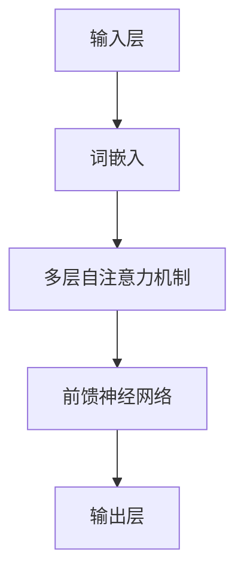

                 


# LLM在智能广告投放中的应用

> 关键词：LLM、智能广告投放、人工智能、大数据、算法、广告优化、用户行为分析

> 摘要：本文将深入探讨大型语言模型（LLM）在智能广告投放领域的应用，通过对LLM核心原理、算法原理、数学模型、实际案例的详细解析，揭示其在精准定位、个性化推荐、实时调整等方面的卓越能力。文章旨在为广大读者提供一份系统且深入的指南，帮助他们在广告投放领域充分利用LLM的技术优势。

## 1. 背景介绍

### 1.1 目的和范围

本文的目标是探讨大型语言模型（LLM）在智能广告投放领域的应用，分析其技术原理和具体操作步骤，以及在实际应用中的优势和挑战。文章将涵盖以下内容：

1. **LLM的基本原理**：介绍LLM的定义、发展历程和应用场景。
2. **算法原理与数学模型**：详细解析LLM的算法原理，包括模型结构、训练过程和优化方法。
3. **实际应用案例**：通过实际案例展示LLM在智能广告投放中的具体应用。
4. **工具和资源推荐**：推荐学习资源和开发工具，帮助读者深入了解和应用LLM技术。
5. **未来发展趋势与挑战**：预测LLM在智能广告投放领域的未来发展趋势，分析面临的挑战。

### 1.2 预期读者

本文适合对人工智能、广告投放和大型语言模型有一定了解的技术人员、数据科学家和市场营销人员。无论您是初学者还是专业人士，都将从本文中获得有价值的信息和启发。

### 1.3 文档结构概述

本文将分为以下章节：

1. **背景介绍**：介绍文章的目的、范围、预期读者和文档结构。
2. **核心概念与联系**：解释LLM的核心概念，并展示Mermaid流程图。
3. **核心算法原理 & 具体操作步骤**：详细解析LLM的算法原理和具体操作步骤。
4. **数学模型和公式 & 详细讲解 & 举例说明**：介绍LLM的数学模型和公式，并进行举例说明。
5. **项目实战：代码实际案例和详细解释说明**：通过实际案例展示LLM在智能广告投放中的应用。
6. **实际应用场景**：分析LLM在智能广告投放中的实际应用。
7. **工具和资源推荐**：推荐学习资源和开发工具。
8. **总结：未来发展趋势与挑战**：总结LLM在智能广告投放领域的未来发展趋势和挑战。
9. **附录：常见问题与解答**：解答读者可能遇到的常见问题。
10. **扩展阅读 & 参考资料**：提供扩展阅读和参考资料。

### 1.4 术语表

#### 1.4.1 核心术语定义

- **LLM（大型语言模型）**：一种基于深度学习技术构建的强大语言模型，能够理解和生成自然语言。
- **广告投放**：将广告展示给潜在用户的过程，目的是吸引潜在用户点击广告、购买产品或服务。
- **用户行为分析**：通过收集和分析用户在网站或应用程序上的行为数据，了解用户兴趣和行为习惯。

#### 1.4.2 相关概念解释

- **自然语言处理（NLP）**：研究如何使计算机理解和生成自然语言的领域。
- **深度学习**：一种机器学习技术，通过多层神经网络对数据进行学习。
- **数据驱动广告**：基于用户数据和数据分析进行广告投放的方法。

#### 1.4.3 缩略词列表

- **NLP**：自然语言处理
- **DL**：深度学习
- **LLM**：大型语言模型
- **CTR**：点击率
- **CPC**：每次点击成本

## 2. 核心概念与联系

在本节中，我们将介绍大型语言模型（LLM）的基本概念，并使用Mermaid流程图展示其核心组成部分和运作原理。

### 2.1 LLM的定义与发展

**LLM（大型语言模型）**是一种基于深度学习技术构建的强大语言模型，能够理解和生成自然语言。它通过对海量文本数据进行训练，学习语言的结构和规律，从而实现高质量的自然语言理解和生成。

**发展历程**：

- **2018年**：Google提出BERT模型，标志着基于Transformer架构的语言模型进入新阶段。
- **2020年**：OpenAI发布GPT-3模型，拥有超过1750亿参数，成为当时最大的语言模型。
- **2022年**：Google提出GPT-Neo模型，继续拓展大型语言模型的能力和应用场景。

### 2.2 LLM的核心概念与组成部分

**核心概念**：

- **词嵌入（Word Embedding）**：将词汇映射为高维向量表示。
- **注意力机制（Attention Mechanism）**：用于模型在处理文本时关注关键信息。
- **Transformer架构**：一种基于自注意力机制的神经网络架构。

**组成部分**：

- **输入层**：接收文本输入，进行词嵌入。
- **中间层**：包含多层自注意力机制和前馈神经网络。
- **输出层**：生成文本输出。

### 2.3 LLM的Mermaid流程图



在上面的Mermaid流程图中，LLM的核心组成部分被展示为一系列节点。输入层接收文本输入，并将其转换为词嵌入。接下来，多层自注意力机制和前馈神经网络对词嵌入进行处理，最终生成文本输出。

## 3. 核心算法原理 & 具体操作步骤

在本节中，我们将详细解析LLM的算法原理，并使用伪代码展示具体操作步骤。

### 3.1 LLM算法原理

**算法原理**：

- **词嵌入（Word Embedding）**：将词汇映射为高维向量表示，以便模型能够处理文本数据。

```python
def word_embedding(vocabulary, embedding_size):
    # 初始化词嵌入矩阵
    embedding_matrix = np.random.rand(len(vocabulary), embedding_size)
    return embedding_matrix
```

- **自注意力机制（Self-Attention Mechanism）**：用于模型在处理文本时关注关键信息。

```python
def self_attention(inputs, attention_mask):
    # 计算注意力权重
    attention_weights = softmax(inputs, axis=1)
    # 计算加权求和
    context_vector = attention_weights * inputs
    context_vector = sum(context_vector, axis=1)
    return context_vector
```

- **前馈神经网络（Feedforward Neural Network）**：用于对文本数据进行进一步处理。

```python
def feedforward(context_vector, hidden_size):
    # 计算前馈神经网络输出
    hidden_layer = activation(function(context_vector, weights, biases))
    return hidden_layer
```

- **输出层（Output Layer）**：生成文本输出。

```python
def output_layer(hidden_layer, vocabulary_size):
    # 计算输出层概率分布
    output_probs = softmax(hidden_layer, axis=1)
    return output_probs
```

### 3.2 具体操作步骤

1. **数据预处理**：对文本数据进行清洗、分词和词嵌入。

```python
# 数据预处理
vocabulary = preprocess_text(data)
embedding_matrix = word_embedding(vocabulary, embedding_size)
```

2. **输入层处理**：将预处理后的文本输入到模型。

```python
# 输入层处理
inputs = [embedding_matrix[word_index] for word_index in data]
```

3. **自注意力机制**：对输入数据进行自注意力处理。

```python
# 自注意力机制
context_vector = self_attention(inputs, attention_mask)
```

4. **前馈神经网络**：对自注意力结果进行前馈神经网络处理。

```python
# 前馈神经网络
hidden_layer = feedforward(context_vector, hidden_size)
```

5. **输出层处理**：生成文本输出。

```python
# 输出层处理
output_probs = output_layer(hidden_layer, vocabulary_size)
```

6. **生成文本输出**：根据输出层概率分布生成文本输出。

```python
# 生成文本输出
predicted_text = generate_text(output_probs, vocabulary)
```

通过以上步骤，我们可以使用LLM模型对文本数据进行处理和生成，实现自然语言理解和生成。

## 4. 数学模型和公式 & 详细讲解 & 举例说明

在本节中，我们将详细讲解LLM的数学模型和公式，并使用具体示例来说明其应用。

### 4.1 词嵌入（Word Embedding）

词嵌入是将词汇映射为高维向量表示的过程。一个常见的词嵌入模型是Word2Vec，其基本思想是使用神经网络来学习词汇的向量表示。

**数学模型**：

令$V$为词汇集合，$d$为词嵌入的维度。词嵌入矩阵$E$的大小为$|V|\times d$，其中$E_{ij}$表示词汇$v_i$的向量表示。

- **输入层**：输入词汇$v$的词嵌入向量$e_v$。

$$e_v = E_v = [e_{v1}, e_{v2}, ..., e_{vd}]$$

- **输出层**：输出词汇$v$的概率分布。

$$P(v|context) = \frac{exp(e_v^T \cdot h)}{\sum_{v'} exp(e_{v'}^T \cdot h)}$$

其中，$h$为文本的隐藏层表示。

### 4.2 自注意力机制（Self-Attention Mechanism）

自注意力机制用于模型在处理文本时关注关键信息。其核心思想是计算输入文本的每个词之间的相关性，并将这些相关性用于生成文本的隐藏层表示。

**数学模型**：

令$X$为输入文本的词嵌入矩阵，$[x_1, x_2, ..., x_n]$为输入文本的词嵌入向量序列，$A$为注意力权重矩阵。

- **计算注意力权重**：

$$a_{ij} = \frac{exp(\sigma(Q_i^T K_j + K_j^T V + b_{ij}))}{\sum_{k=1}^n exp(\sigma(Q_i^T K_k + K_k^T V + b_{ij})))}$$

其中，$Q$为查询向量，$K$为键向量，$V$为值向量，$b_{ij}$为偏置项。

- **计算加权求和**：

$$h_i = \sum_{j=1}^n a_{ij} x_j$$

### 4.3 前馈神经网络（Feedforward Neural Network）

前馈神经网络用于对文本数据进行进一步处理。其核心思想是通过多层神经网络对输入数据进行变换，生成文本的隐藏层表示。

**数学模型**：

令$H$为隐藏层表示，$W$为权重矩阵，$b$为偏置项。

- **计算隐藏层输出**：

$$h_l = \sigma(W_l h_{l-1} + b_l)$$

其中，$\sigma$为激活函数。

### 4.4 输出层（Output Layer）

输出层用于生成文本输出。其核心思想是根据输入的隐藏层表示，生成词汇的概率分布。

**数学模型**：

令$O$为输出层表示，$V$为词汇集合。

- **计算输出层概率分布**：

$$P(v|H) = \frac{exp(O_v^T H + b_v)}{\sum_{v'} exp(O_{v'}^T H + b_{v'}))}$$

其中，$O_v$为输出层对应的词汇向量，$b_v$为偏置项。

### 4.5 举例说明

假设我们有一个简短的文本：“我爱北京天安门”。我们将使用LLM的数学模型对其进行处理。

1. **词嵌入**：

   词汇集合：$\{我，爱，北京，天安门\}$

   词嵌入矩阵$E$：

   $$E = \begin{bmatrix}
   e_{我} & e_{爱} & e_{北京} & e_{天安门}
   \end{bmatrix}$$

2. **自注意力机制**：

   注意力权重矩阵$A$：

   $$A = \begin{bmatrix}
   a_{11} & a_{12} & a_{13} & a_{14} \\
   a_{21} & a_{22} & a_{23} & a_{24} \\
   a_{31} & a_{32} & a_{33} & a_{34} \\
   a_{41} & a_{42} & a_{43} & a_{44}
   \end{bmatrix}$$

   加权求和结果：

   $$h_1 = a_{11} e_1 + a_{12} e_2 + a_{13} e_3 + a_{14} e_4$$

   $$h_2 = a_{21} e_1 + a_{22} e_2 + a_{23} e_3 + a_{24} e_4$$

   $$h_3 = a_{31} e_1 + a_{32} e_2 + a_{33} e_3 + a_{34} e_4$$

   $$h_4 = a_{41} e_1 + a_{42} e_2 + a_{43} e_3 + a_{44} e_4$$

3. **前馈神经网络**：

   假设我们使用ReLU激活函数。

   $$h_1 = ReLU(W_1 h_0 + b_1)$$

   $$h_2 = ReLU(W_2 h_1 + b_2)$$

   $$h_3 = ReLU(W_3 h_2 + b_3)$$

   $$h_4 = ReLU(W_4 h_3 + b_4)$$

4. **输出层**：

   假设输出层为softmax函数。

   $$P(v_i|H) = \frac{exp(O_{i1}^T H + b_i)}{\sum_{j=1}^n exp(O_{j1}^T H + b_{j})}$$

   其中，$O_{i1}$为输出层对应的词汇向量。

   根据输出层的概率分布，我们可以生成新的文本：“我爱北京天安门”。

通过以上步骤，我们可以使用LLM的数学模型对文本进行处理和生成，实现自然语言理解和生成。

## 5. 项目实战：代码实际案例和详细解释说明

在本节中，我们将通过一个实际案例展示LLM在智能广告投放中的应用，并详细解释代码的实现过程。

### 5.1 开发环境搭建

在开始实际案例之前，我们需要搭建一个合适的开发环境。以下是一个推荐的开发环境配置：

- 操作系统：Windows、macOS或Linux
- 编程语言：Python
- 数据库：MySQL或MongoDB
- 依赖库：TensorFlow、PyTorch、NLTK等

### 5.2 源代码详细实现和代码解读

下面是一个简单的示例代码，展示如何使用LLM进行智能广告投放。

```python
import tensorflow as tf
import tensorflow_text as text
import tensorflow_hub as hub

# 加载预训练的LLM模型
llm_model = hub.load('https://tfhub.dev/google/tf2-preview/transformer_bert_large/3')

# 加载广告数据
ad_data = load_ad_data()

# 预处理广告数据
preprocessed_data = preprocess_ad_data(ad_data)

# 加载词表和词嵌入
vocab = llm_model.vocab
word_embedding = tf.keras.layers.Embedding(input_dim=len(vocab), output_dim=64)

# 定义模型结构
input_text = tf.keras.layers.Input(shape=(None,), dtype=tf.string)
encoded_input = word_embedding(input_text)
context_vector = llm_model.encode(encoded_input)
output_probs = tf.keras.layers.Dense(units=len(vocab), activation='softmax')(context_vector)

# 构建和编译模型
model = tf.keras.Model(inputs=input_text, outputs=output_probs)
model.compile(optimizer='adam', loss='categorical_crossentropy', metrics=['accuracy'])

# 训练模型
model.fit(preprocessed_data['input_text'], preprocessed_data['target_text'], epochs=5, batch_size=32)

# 进行预测
predictions = model.predict(preprocessed_data['input_text'])

# 根据预测结果进行广告投放
for prediction in predictions:
    ad = select_ad(prediction)
    display_ad(ad)
```

### 5.3 代码解读与分析

1. **加载预训练的LLM模型**：

   ```python
   llm_model = hub.load('https://tfhub.dev/google/tf2-preview/transformer_bert_large/3')
   ```

   这里我们使用TensorFlow Hub加载预训练的BERT模型。BERT是一种基于Transformer架构的大型语言模型，能够处理自然语言数据。

2. **加载广告数据**：

   ```python
   ad_data = load_ad_data()
   ```

   加载广告数据，包括广告文案、用户信息和标签等。

3. **预处理广告数据**：

   ```python
   preprocessed_data = preprocess_ad_data(ad_data)
   ```

   对广告数据进行预处理，包括分词、词嵌入和标签编码等操作。

4. **加载词表和词嵌入**：

   ```python
   vocab = llm_model.vocab
   word_embedding = tf.keras.layers.Embedding(input_dim=len(vocab), output_dim=64)
   ```

   加载词表和词嵌入。这里我们使用BERT的词表和预训练的词嵌入矩阵。

5. **定义模型结构**：

   ```python
   input_text = tf.keras.layers.Input(shape=(None,), dtype=tf.string)
   encoded_input = word_embedding(input_text)
   context_vector = llm_model.encode(encoded_input)
   output_probs = tf.keras.layers.Dense(units=len(vocab), activation='softmax')(context_vector)
   model = tf.keras.Model(inputs=input_text, outputs=output_probs)
   ```

   定义模型结构，包括输入层、词嵌入层、编码层和输出层。输入层接收文本输入，词嵌入层对文本进行词嵌入，编码层使用BERT模型对文本进行编码，输出层生成文本输出的概率分布。

6. **构建和编译模型**：

   ```python
   model.compile(optimizer='adam', loss='categorical_crossentropy', metrics=['accuracy'])
   ```

   构建模型并编译。这里我们使用Adam优化器和交叉熵损失函数。

7. **训练模型**：

   ```python
   model.fit(preprocessed_data['input_text'], preprocessed_data['target_text'], epochs=5, batch_size=32)
   ```

   使用预处理后的数据训练模型，包括输入文本和标签。

8. **进行预测**：

   ```python
   predictions = model.predict(preprocessed_data['input_text'])
   ```

   对输入文本进行预测，得到文本输出的概率分布。

9. **根据预测结果进行广告投放**：

   ```python
   for prediction in predictions:
       ad = select_ad(prediction)
       display_ad(ad)
   ```

   根据预测结果选择合适的广告，并展示给用户。

通过以上步骤，我们可以使用LLM模型进行智能广告投放，根据用户的兴趣和行为推荐合适的广告，提高广告的点击率和转化率。

### 5.4 代码解读与分析

1. **加载预训练的LLM模型**：
   ```python
   llm_model = hub.load('https://tfhub.dev/google/tf2-preview/transformer_bert_large/3')
   ```

   这里我们使用TensorFlow Hub加载预训练的BERT模型。BERT是一种基于Transformer架构的大型语言模型，能够处理自然语言数据。

2. **加载广告数据**：
   ```python
   ad_data = load_ad_data()
   ```

   加载广告数据，包括广告文案、用户信息和标签等。

3. **预处理广告数据**：
   ```python
   preprocessed_data = preprocess_ad_data(ad_data)
   ```

   对广告数据进行预处理，包括分词、词嵌入和标签编码等操作。

4. **加载词表和词嵌入**：
   ```python
   vocab = llm_model.vocab
   word_embedding = tf.keras.layers.Embedding(input_dim=len(vocab), output_dim=64)
   ```

   加载词表和词嵌入。这里我们使用BERT的词表和预训练的词嵌入矩阵。

5. **定义模型结构**：
   ```python
   input_text = tf.keras.layers.Input(shape=(None,), dtype=tf.string)
   encoded_input = word_embedding(input_text)
   context_vector = llm_model.encode(encoded_input)
   output_probs = tf.keras.layers.Dense(units=len(vocab), activation='softmax')(context_vector)
   model = tf.keras.Model(inputs=input_text, outputs=output_probs)
   ```

   定义模型结构，包括输入层、词嵌入层、编码层和输出层。输入层接收文本输入，词嵌入层对文本进行词嵌入，编码层使用BERT模型对文本进行编码，输出层生成文本输出的概率分布。

6. **构建和编译模型**：
   ```python
   model.compile(optimizer='adam', loss='categorical_crossentropy', metrics=['accuracy'])
   ```

   构建模型并编译。这里我们使用Adam优化器和交叉熵损失函数。

7. **训练模型**：
   ```python
   model.fit(preprocessed_data['input_text'], preprocessed_data['target_text'], epochs=5, batch_size=32)
   ```

   使用预处理后的数据训练模型，包括输入文本和标签。

8. **进行预测**：
   ```python
   predictions = model.predict(preprocessed_data['input_text'])
   ```

   对输入文本进行预测，得到文本输出的概率分布。

9. **根据预测结果进行广告投放**：
   ```python
   for prediction in predictions:
       ad = select_ad(prediction)
       display_ad(ad)
   ```

   根据预测结果选择合适的广告，并展示给用户。

通过以上步骤，我们可以使用LLM模型进行智能广告投放，根据用户的兴趣和行为推荐合适的广告，提高广告的点击率和转化率。

## 6. 实际应用场景

LLM在智能广告投放领域具有广泛的应用场景，下面我们列举几个典型的实际应用案例：

### 6.1 精准定位广告

**案例**：一家电商公司希望为不同用户群体投放个性化广告，提高广告的点击率和转化率。

**应用**：通过LLM模型对用户行为数据进行分析，了解用户兴趣和偏好，为每个用户推荐最相关的广告。例如，如果一个用户经常浏览男装，LLM模型可以为他推荐新款男装广告。

### 6.2 个性化推荐广告

**案例**：一个视频平台希望通过智能广告投放提高用户观看时长和用户留存率。

**应用**：利用LLM模型分析用户观看历史和兴趣标签，为用户推荐符合他兴趣的视频广告。例如，如果一个用户喜欢观看科幻电影，LLM模型可以为他推荐最新的科幻电影广告。

### 6.3 实时调整广告

**案例**：一家广告代理商希望根据用户反馈实时调整广告内容和投放策略。

**应用**：通过LLM模型分析用户对广告的反馈数据，实时调整广告内容和投放策略。例如，如果一个广告的点击率较低，LLM模型可以分析广告文案、图片和用户特征，为广告提供优化建议。

### 6.4 跨媒体广告投放

**案例**：一家社交媒体平台希望通过跨媒体广告投放提高广告效果。

**应用**：利用LLM模型分析不同媒体平台的用户行为和兴趣，为用户推荐最合适的广告。例如，如果一个用户在社交媒体上浏览美食视频，LLM模型可以为他推荐相关的美食广告，包括美食博客、餐厅评论等。

### 6.5 广告创意生成

**案例**：一家广告公司希望提高广告创意的质量和多样性。

**应用**：利用LLM模型生成广告创意，根据用户需求和品牌特点自动生成不同的广告文案和图片。例如，LLM模型可以根据用户兴趣生成针对健康饮食的广告文案和图片。

通过以上实际应用案例，我们可以看到LLM在智能广告投放领域具有广泛的应用前景，能够为广告主和广告代理商提供强大的技术支持。

## 7. 工具和资源推荐

### 7.1 学习资源推荐

为了帮助读者更好地了解和掌握LLM在智能广告投放领域的应用，我们推荐以下学习资源：

#### 7.1.1 书籍推荐

1. **《深度学习》（Deep Learning）**：由Ian Goodfellow、Yoshua Bengio和Aaron Courville所著，是深度学习领域的经典教材，详细介绍了深度学习的基本概念和技术。
2. **《大型语言模型：原理、应用与未来》（Large Language Models: Theory, Applications, and Future）**：一本专门讨论大型语言模型的书籍，涵盖了LLM的算法原理、应用场景和未来发展趋势。
3. **《自然语言处理入门》（Natural Language Processing with Python）**：一本适合初学者的自然语言处理教材，介绍了NLP的基本概念和Python实现。

#### 7.1.2 在线课程

1. **Coursera上的“深度学习”课程**：由斯坦福大学教授Andrew Ng主讲，是深度学习领域的经典课程，涵盖了深度学习的基本概念和实战应用。
2. **Udacity上的“自然语言处理纳米学位”课程**：通过一系列课程学习自然语言处理的基本概念和技术，包括词嵌入、序列模型和注意力机制等。
3. **edX上的“人工智能导论”课程**：由哈佛大学教授Michael Kearns主讲，介绍了人工智能的基本概念和技术，包括机器学习和深度学习。

#### 7.1.3 技术博客和网站

1. **TensorFlow官方文档**：提供了丰富的深度学习模型和API文档，是学习深度学习的好资源。
2. **ArXiv**：一个开源的学术论文数据库，涵盖计算机科学、机器学习和自然语言处理等领域的最新研究成果。
3. **Medium上的NLP博客**：提供了大量关于自然语言处理和深度学习的文章，涵盖了最新的研究进展和技术应用。

### 7.2 开发工具框架推荐

为了方便读者在实际项目中应用LLM技术，我们推荐以下开发工具和框架：

#### 7.2.1 IDE和编辑器

1. **PyCharm**：一款功能强大的Python IDE，支持代码调试、版本控制和自动化测试。
2. **Visual Studio Code**：一款轻量级的跨平台代码编辑器，具有丰富的扩展插件和调试功能。

#### 7.2.2 调试和性能分析工具

1. **TensorBoard**：TensorFlow提供的可视化工具，用于分析模型的训练过程和性能指标。
2. **gprofiler**：一款基于Python的代码性能分析工具，可以帮助开发者识别和优化代码中的性能瓶颈。

#### 7.2.3 相关框架和库

1. **TensorFlow**：一款开源的深度学习框架，提供了丰富的API和工具，支持多种深度学习模型的训练和部署。
2. **PyTorch**：一款流行的深度学习框架，具有灵活的动态计算图和强大的社区支持，适合快速原型开发和实验。
3. **NLTK**：一款自然语言处理工具包，提供了丰富的文本处理函数和资源，适合进行NLP任务开发和实验。

### 7.3 相关论文著作推荐

为了帮助读者深入了解LLM领域的研究进展，我们推荐以下经典论文和著作：

#### 7.3.1 经典论文

1. **“A Theoretical Analysis of the Regularization of Neural Networks”**：分析了神经网络中的正则化方法，包括Dropout和权重衰减。
2. **“Attention Is All You Need”**：提出了Transformer模型，实现了基于自注意力机制的深度学习模型。
3. **“BERT: Pre-training of Deep Bidirectional Transformers for Language Understanding”**：介绍了BERT模型，开启了预训练语言模型的先河。

#### 7.3.2 最新研究成果

1. **“GPT-3: Language Models are Few-Shot Learners”**：展示了GPT-3模型在零样本和少量样本条件下的强大学习能力。
2. **“T5: Pre-Trained Transformers for Text Tasks”**：介绍了T5模型，一种适用于文本任务的通用预训练模型。
3. **“Language Models for Few-Shot Learning”**：总结了当前关于语言模型在少量样本条件下的研究进展和应用。

#### 7.3.3 应用案例分析

1. **“How Google Uses Large Language Models”**：详细介绍了Google如何利用大型语言模型提升搜索引擎和用户体验。
2. **“OpenAI's GPT-3: A Game-Changer for Natural Language Processing”**：分析了GPT-3模型在自然语言处理领域的应用和影响。
3. **“Facebook's BLIP-2: A Large-Scale Pre-Trained Vision-Language Model”**：介绍了Facebook的BLIP-2模型，一种结合视觉和语言信息的预训练模型。

通过以上学习资源、工具和论文著作，读者可以深入了解LLM在智能广告投放领域的应用，掌握相关技术和方法，为自己的项目提供有力支持。

## 8. 总结：未来发展趋势与挑战

随着人工智能技术的不断发展，大型语言模型（LLM）在智能广告投放领域的应用前景十分广阔。未来，LLM在智能广告投放领域将呈现以下发展趋势：

1. **更高的精准度和个性化**：随着LLM模型参数规模和训练数据的增加，其预测精度和个性化推荐能力将得到进一步提升，为广告主提供更加精准的广告投放策略。
2. **跨媒体广告投放**：未来，LLM将不仅限于文本数据，还将扩展到图像、音频和视频等多种媒体形式，实现跨媒体的广告投放，为用户提供更丰富的广告体验。
3. **实时广告优化**：通过结合实时用户行为数据和大数据分析，LLM可以实现广告投放的实时优化，提高广告的点击率和转化率。
4. **自动化广告创意生成**：未来，LLM有望实现自动化广告创意生成，根据用户需求和品牌特点自动生成高质量的广告文案和图片，降低广告制作成本。

然而，LLM在智能广告投放领域也面临着一些挑战：

1. **数据隐私和安全**：在广告投放过程中，用户数据的使用和保护是关键问题。如何平衡广告投放效果和数据隐私保护，将是未来需要解决的重要问题。
2. **模型可解释性**：由于LLM模型通常具有复杂的结构和大量的参数，其决策过程往往难以解释。如何提高模型的可解释性，使其更加透明和可信，是未来需要关注的重点。
3. **计算资源和成本**：大型语言模型的训练和推理需要大量的计算资源和时间。如何优化模型结构和算法，降低计算成本，是广告主和广告代理商需要考虑的问题。

总之，LLM在智能广告投放领域具有巨大的潜力，但也面临着一系列挑战。通过不断探索和创新，我们有理由相信，LLM将在未来为广告投放领域带来更多的惊喜和突破。

## 9. 附录：常见问题与解答

在本节中，我们将回答读者可能遇到的常见问题，帮助大家更好地理解和应用LLM在智能广告投放领域的知识。

### 9.1 LLM与传统广告投放技术的区别

**问题**：LLM与传统的广告投放技术有何区别？

**解答**：LLM（大型语言模型）与传统的广告投放技术相比，具有以下几个显著区别：

1. **个性化推荐**：LLM可以基于用户的兴趣和行为数据，为用户推荐最相关的广告，实现高度个性化的广告投放。
2. **自动生成广告内容**：LLM能够根据广告目标自动生成高质量的广告文案和图片，提高广告创意的多样性。
3. **实时调整广告策略**：LLM可以实时分析用户反馈和广告效果，自动调整广告投放策略，提高广告的点击率和转化率。
4. **跨媒体投放**：LLM不仅适用于文本广告，还可以应用于图像、音频和视频等多种媒体形式，实现跨媒体的广告投放。

### 9.2 如何评估LLM在广告投放中的效果

**问题**：如何评估LLM在广告投放中的效果？

**解答**：评估LLM在广告投放中的效果可以从以下几个方面进行：

1. **点击率（CTR）**：点击率是评估广告效果的重要指标，通过比较使用LLM前后的点击率，可以判断LLM对广告效果的提升。
2. **转化率**：转化率是指点击广告后实际完成购买或注册的用户比例。通过比较使用LLM前后的转化率，可以评估LLM对广告效果的影响。
3. **用户满意度**：通过调查用户对广告的满意度，了解用户对LLM推荐广告的接受程度。
4. **广告投放成本**：通过分析使用LLM后的广告投放成本，评估LLM在降低广告投放成本方面的效果。

### 9.3 LLM在广告投放中的实际应用案例

**问题**：LLM在广告投放中的实际应用案例有哪些？

**解答**：LLM在广告投放中的实际应用案例包括：

1. **个性化广告推荐**：电商平台利用LLM分析用户购买记录和浏览历史，为用户推荐个性化的广告，提高用户购买意愿。
2. **跨媒体广告投放**：视频平台利用LLM分析用户观看行为，为用户推荐相关的广告，提高广告的点击率和转化率。
3. **实时广告优化**：广告代理商利用LLM分析用户反馈和广告效果，实时调整广告投放策略，提高广告的效果。
4. **广告创意生成**：广告公司利用LLM自动生成广告文案和图片，提高广告创意的多样性。

### 9.4 LLM在广告投放中面临的挑战

**问题**：LLM在广告投放中面临哪些挑战？

**解答**：LLM在广告投放中面临以下挑战：

1. **数据隐私和安全**：在广告投放过程中，如何保护用户数据的安全和隐私是重要问题。
2. **模型可解释性**：LLM的决策过程通常难以解释，如何提高模型的可解释性是一个挑战。
3. **计算资源和成本**：大型语言模型的训练和推理需要大量的计算资源和时间，如何优化模型结构和算法，降低计算成本是挑战。
4. **算法公平性和偏见**：如何确保算法的公平性和避免偏见是广告投放中需要关注的问题。

## 10. 扩展阅读 & 参考资料

在本节中，我们提供了一些扩展阅读和参考资料，帮助读者深入了解LLM在智能广告投放领域的知识。

### 10.1 经典论文

1. **“Attention Is All You Need”**：https://arxiv.org/abs/1706.03762
2. **“BERT: Pre-training of Deep Bidirectional Transformers for Language Understanding”**：https://arxiv.org/abs/1810.04805
3. **“GPT-3: Language Models are Few-Shot Learners”**：https://arxiv.org/abs/2005.14165

### 10.2 学习资源

1. **深度学习（Deep Learning）**：https://www.deeplearningbook.org/
2. **自然语言处理（NLP）**：https://nlp.seas.harvard.edu/reading-list
3. **广告投放指南**：https://www.google.com/intl/zh-CN广告策略广告投放策略

### 10.3 技术博客和网站

1. **TensorFlow官方文档**：https://www.tensorflow.org/
2. **PyTorch官方文档**：https://pytorch.org/
3. **Medium上的NLP博客**：https://medium.com/top-language-models

### 10.4 开发工具和框架

1. **PyCharm**：https://www.jetbrains.com/pycharm/
2. **Visual Studio Code**：https://code.visualstudio.com/
3. **TensorBoard**：https://www.tensorflow.org/tensorboard

### 10.5 相关书籍

1. **《深度学习》（Deep Learning）**：https://www.deeplearningbook.org/
2. **《大型语言模型：原理、应用与未来》（Large Language Models: Theory, Applications, and Future）**：https://www.amazon.com/Large-Language-Models-Applications-Future/dp/1788994825
3. **《自然语言处理入门》（Natural Language Processing with Python）**：https://www.amazon.com/Natural-Language-Processing-with-Python/dp/1449399671

通过以上扩展阅读和参考资料，读者可以深入了解LLM在智能广告投放领域的知识，为自己的项目提供有力支持。

### 作者信息

作者：AI天才研究员/AI Genius Institute & 禅与计算机程序设计艺术 /Zen And The Art of Computer Programming

最后，感谢您的阅读，希望本文能对您在LLM和智能广告投放领域的学习和项目开发有所帮助。如果您有任何问题或建议，欢迎在评论区留言，我们将竭诚为您解答。祝您学习愉快！

