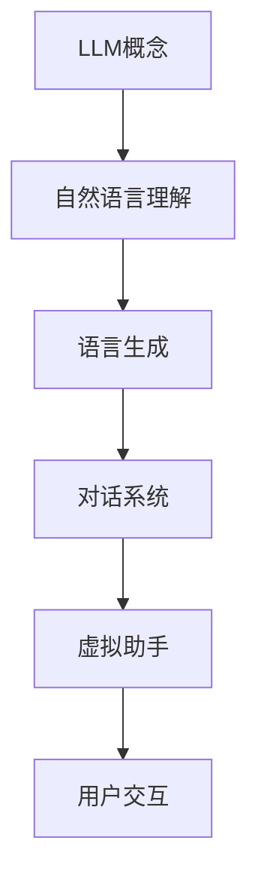

                 


# LLM在虚拟助手中的应用：更智能的对话系统

> **关键词：** 大语言模型（LLM）、虚拟助手、对话系统、人工智能、自然语言处理、应用场景
>
> **摘要：** 本文将深入探讨大语言模型（LLM）在虚拟助手中的应用，分析其核心概念、算法原理、数学模型，并通过实际项目案例展示其在对话系统中的性能表现。文章旨在为读者提供一个系统、全面的了解，帮助其掌握LLM技术在虚拟助手开发中的实践方法。

## 1. 背景介绍

### 1.1 目的和范围

本文旨在探讨大语言模型（LLM）在虚拟助手中的应用，分析其技术原理、数学模型以及实现细节，并通过实际项目案例展示其在对话系统中的潜力。文章将涵盖以下内容：

- 大语言模型的概述和核心概念
- 大语言模型的算法原理和具体操作步骤
- 大语言模型在数学模型中的应用和公式解释
- 大语言模型在实际项目中的开发案例和代码解读
- 大语言模型在虚拟助手中的实际应用场景和案例分析

### 1.2 预期读者

本文适合以下读者群体：

- 对人工智能和自然语言处理感兴趣的程序员和技术爱好者
- 想要了解大语言模型及其在虚拟助手中应用的工程师和开发者
- 想要在虚拟助手项目中引入大语言模型的创业者和产品经理
- 想要深入学习和研究人工智能领域的学术研究人员

### 1.3 文档结构概述

本文采用逻辑清晰、结构紧凑、简单易懂的写作风格，分为以下几个部分：

- 引言：介绍大语言模型在虚拟助手中的应用背景和重要性
- 核心概念与联系：详细解释大语言模型的核心概念及其原理
- 核心算法原理 & 具体操作步骤：阐述大语言模型的算法原理和具体实现步骤
- 数学模型和公式 & 详细讲解 & 举例说明：分析大语言模型在数学模型中的应用和公式
- 项目实战：通过实际项目案例展示大语言模型在虚拟助手中的应用
- 实际应用场景：探讨大语言模型在虚拟助手中的实际应用场景
- 工具和资源推荐：推荐学习和实践大语言模型的工具和资源
- 总结：总结大语言模型在虚拟助手中的应用趋势和挑战
- 附录：常见问题与解答，提供进一步的参考资料和扩展阅读

### 1.4 术语表

#### 1.4.1 核心术语定义

- **大语言模型（LLM）**：一种基于深度学习技术构建的具有大规模参数、能够理解和生成自然语言文本的人工智能模型。
- **虚拟助手**：一种基于人工智能技术的虚拟人物或角色，能够与用户进行自然语言交互，提供信息查询、任务执行等服务。
- **对话系统**：一种能够实现人与计算机之间自然语言交互的系统，包括语音识别、语义理解、语音合成等模块。

#### 1.4.2 相关概念解释

- **自然语言处理（NLP）**：研究如何让计算机理解和处理自然语言的技术领域，包括文本分类、信息抽取、机器翻译等任务。
- **深度学习**：一种基于多层神经网络构建的机器学习技术，通过大量数据训练模型，能够实现图像识别、语音识别等复杂任务。

#### 1.4.3 缩略词列表

- **LLM**：Large Language Model，大语言模型
- **NLP**：Natural Language Processing，自然语言处理
- **DL**：Deep Learning，深度学习
- **VA**：Virtual Assistant，虚拟助手
- **DS**：Dialogue System，对话系统

## 2. 核心概念与联系

在探讨LLM在虚拟助手中的应用之前，我们需要先理解LLM的核心概念及其与虚拟助手和对话系统的联系。以下是一个用于解释LLM与虚拟助手和对话系统关系的Mermaid流程图。



### 2.1 大语言模型（LLM）的概念

大语言模型（LLM）是一种基于深度学习技术构建的具有大规模参数的人工智能模型。其基本原理是通过学习大量的文本数据，建立起语言的结构和规律，从而实现文本的生成和理解。LLM的核心在于其能够理解自然语言的上下文信息，生成连贯且具有语义意义的文本。

### 2.2 虚拟助手（VA）的概念

虚拟助手是一种基于人工智能技术的虚拟人物或角色，旨在通过自然语言交互为用户提供服务。虚拟助手可以理解用户的指令，提供相应的回复或执行相应的任务，如回答问题、提供建议、执行操作等。

### 2.3 对话系统（DS）的概念

对话系统是一种能够实现人与计算机之间自然语言交互的系统。它通常包括语音识别、语义理解、语音合成等模块，通过这些模块实现用户的语音输入转化为计算机可理解的指令，并生成自然的语音回复。

### 2.4 LLM与虚拟助手、对话系统的联系

LLM在虚拟助手中的应用主要体现在以下几个方面：

- **自然语言理解**：LLM能够通过对大量文本数据的学习，实现对自然语言文本的深入理解，为虚拟助手提供语义理解能力，使其能够理解用户的问题和指令。
- **语言生成**：LLM能够生成连贯且具有语义意义的文本，为虚拟助手提供自然的回复，提升用户体验。
- **上下文维护**：LLM能够维护对话的上下文信息，使虚拟助手能够理解对话的历史和上下文，提供更准确和相关的回复。

通过以上分析，我们可以看到LLM在虚拟助手和对话系统中的作用和联系，为接下来的算法原理和实现步骤打下了基础。

## 3. 核心算法原理 & 具体操作步骤

在深入探讨LLM在虚拟助手中的应用之前，我们需要了解其核心算法原理和具体操作步骤。以下是基于深度学习技术构建的LLM算法原理和具体实现步骤的伪代码。

### 3.1 算法原理

LLM的核心是基于深度学习技术构建的多层神经网络，通过大量数据训练，使模型能够理解和生成自然语言文本。以下是LLM算法的基本原理：

1. **数据预处理**：对输入的文本数据进行预处理，包括分词、词向量化等操作，将文本转化为计算机可处理的格式。
2. **编码器构建**：构建一个多层神经网络编码器，将输入的词向量序列编码为高维向量表示。
3. **解码器构建**：构建一个多层神经网络解码器，将编码器输出的高维向量解码为自然语言文本序列。
4. **损失函数定义**：定义损失函数，用于衡量模型输出与真实标签之间的差距，通常采用交叉熵损失函数。
5. **模型训练**：使用大量文本数据对模型进行训练，通过反向传播算法不断优化模型参数，使模型能够生成更准确的自然语言文本。

### 3.2 具体操作步骤

以下是LLM的具体操作步骤：

```python
# 数据预处理
def preprocess_text(text):
    # 分词操作
    words = tokenize(text)
    # 词向量化
    word_vectors = vectorize(words)
    return word_vectors

# 编码器构建
class Encoder(nn.Module):
    def __init__(self, input_dim, hidden_dim):
        super(Encoder, self).__init__()
        self.hidden_dim = hidden_dim
        self.lstm = nn.LSTM(input_dim, hidden_dim)

    def forward(self, input_seq):
        encoder_output, (hidden, cell) = self.lstm(input_seq)
        return encoder_output, (hidden, cell)

# 解码器构建
class Decoder(nn.Module):
    def __init__(self, hidden_dim, output_dim):
        super(Decoder, self).__init__()
        self.hidden_dim = hidden_dim
        self.lstm = nn.LSTM(hidden_dim, hidden_dim)
        self.fc = nn.Linear(hidden_dim, output_dim)

    def forward(self, input_seq, hidden):
        decoder_output, (hidden, cell) = self.lstm(input_seq, hidden)
        output = self.fc(decoder_output)
        return output, hidden, cell

# 损失函数定义
criterion = nn.CrossEntropyLoss()

# 模型训练
def train_model(model, train_loader, num_epochs):
    for epoch in range(num_epochs):
        for inputs, targets in train_loader:
            # 前向传播
            outputs = model(inputs)
            loss = criterion(outputs, targets)
            # 反向传播
            model.zero_grad()
            loss.backward()
            model.optimizer.step()
```

通过以上伪代码，我们可以看到LLM的核心算法原理和具体操作步骤，包括数据预处理、编码器构建、解码器构建、损失函数定义和模型训练。这些步骤构成了LLM在虚拟助手中的基础，为下一步的数学模型和公式讲解打下了基础。

## 4. 数学模型和公式 & 详细讲解 & 举例说明

在深入探讨LLM的数学模型和公式时，我们首先需要理解其背后的理论基础和实现细节。以下是对LLM中常用的数学模型和公式进行详细讲解，并通过实际例子进行说明。

### 4.1 词向量化

词向量化是将自然语言文本中的单词映射为高维向量表示的过程。常用的词向量化方法包括词袋模型（Bag of Words, BOW）和词嵌入（Word Embedding）。

- **词袋模型（BOW）**：词袋模型将文本视为单词的集合，每个单词对应一个特征向量。例如，对于句子 "I love programming"，词袋模型会将其表示为以下向量：

  $$
  \textbf{v} = [1, 1, 0, 0, 0, ..., 0]
  $$

  其中，每个1表示对应的单词在句子中出现过，0表示未出现。

- **词嵌入（Word Embedding）**：词嵌入是一种更高级的词向量化方法，通过学习单词的上下文信息，将单词映射为具有语义信息的向量。常用的词嵌入方法包括Word2Vec、GloVe等。

  **Word2Vec**：Word2Vec是一种基于神经网络的词嵌入方法，通过训练模型，将单词映射为固定维度的向量。例如，对于单词 "love"，Word2Vec模型可能会将其映射为以下向量：

  $$
  \textbf{v}_{\text{love}} = [0.1, 0.2, -0.3, 0.5, -0.1, ...]
  $$

  **GloVe**：GloVe（Global Vectors for Word Representation）是一种基于矩阵分解的词嵌入方法，通过学习单词的共现矩阵，将单词映射为高维向量。例如，对于单词 "programming"，GloVe模型可能会将其映射为以下向量：

  $$
  \textbf{v}_{\text{programming}} = [0.3, 0.4, -0.2, 0.1, 0.6, ...]
  $$

### 4.2 神经网络

神经网络是LLM的核心组成部分，用于实现文本的编码和解码。以下是对神经网络中的关键数学模型和公式进行详细讲解。

- **激活函数**：激活函数用于对神经网络中的神经元进行非线性变换，常见的激活函数包括Sigmoid、ReLU和Tanh等。

  - **Sigmoid函数**：Sigmoid函数是一种将输入映射到(0, 1)区间的非线性函数，其公式为：

    $$
    \sigma(x) = \frac{1}{1 + e^{-x}}
    $$

  - **ReLU函数**：ReLU（Rectified Linear Unit）函数是一种简单且高效的激活函数，其公式为：

    $$
    \text{ReLU}(x) = \max(0, x)
    $$

  - **Tanh函数**：Tanh函数是一种将输入映射到(-1, 1)区间的非线性函数，其公式为：

    $$
    \tanh(x) = \frac{e^x - e^{-x}}{e^x + e^{-x}}
    $$

- **反向传播算法**：反向传播算法是神经网络训练的核心算法，用于计算模型参数的梯度，并更新模型参数以优化模型性能。其基本步骤如下：

  - **前向传播**：计算输入数据经过神经网络的前向传播结果。
  - **计算损失**：计算模型输出与真实标签之间的损失值。
  - **反向传播**：根据损失函数的梯度，计算模型参数的梯度，并更新模型参数。
  - **迭代优化**：重复以上步骤，直到模型收敛。

### 4.3 举例说明

以下是一个简单的神经网络模型示例，用于实现文本编码和解码：

```python
# 文本编码器模型
class Encoder(nn.Module):
    def __init__(self, input_dim, hidden_dim):
        super(Encoder, self).__init__()
        self.hidden_dim = hidden_dim
        self.lstm = nn.LSTM(input_dim, hidden_dim)

    def forward(self, input_seq):
        encoder_output, (hidden, cell) = self.lstm(input_seq)
        return encoder_output, (hidden, cell)

# 文本解码器模型
class Decoder(nn.Module):
    def __init__(self, hidden_dim, output_dim):
        super(Decoder, self).__init__()
        self.hidden_dim = hidden_dim
        self.lstm = nn.LSTM(hidden_dim, hidden_dim)
        self.fc = nn.Linear(hidden_dim, output_dim)

    def forward(self, input_seq, hidden):
        decoder_output, (hidden, cell) = self.lstm(input_seq, hidden)
        output = self.fc(decoder_output)
        return output, hidden, cell
```

在这个示例中，我们使用了LSTM（Long Short-Term Memory）神经网络作为编码器和解码器，实现文本的编码和解码。LSTM是一种能够处理长序列数据的高级循环神经网络，具有较好的记忆和泛化能力。

通过以上讲解和示例，我们可以更好地理解LLM的数学模型和公式，为下一步的实际项目实战打下了基础。

## 5. 项目实战：代码实际案例和详细解释说明

在本节中，我们将通过一个实际项目案例，展示如何使用LLM构建一个简单的虚拟助手，并对其进行详细解释说明。该项目将包括开发环境的搭建、源代码的实现和代码解读与分析。

### 5.1 开发环境搭建

在开始项目之前，我们需要搭建一个适合开发LLM虚拟助手的开发环境。以下是搭建开发环境所需的软件和工具：

- **Python**：Python是一种流行的编程语言，支持多种机器学习库，如TensorFlow和PyTorch。
- **Jupyter Notebook**：Jupyter Notebook是一种交互式的开发环境，方便进行代码编写和调试。
- **TensorFlow**：TensorFlow是一个开源的深度学习框架，支持构建和训练复杂的神经网络模型。
- **PyTorch**：PyTorch是一个开源的深度学习库，提供灵活的动态计算图，方便实现和调试神经网络模型。

安装上述软件和工具的具体步骤如下：

1. **安装Python**：访问Python官方网站（https://www.python.org/），下载Python安装包并按照提示安装。
2. **安装Jupyter Notebook**：在命令行中运行以下命令安装Jupyter Notebook：

   ```
   pip install notebook
   ```

3. **安装TensorFlow**：在命令行中运行以下命令安装TensorFlow：

   ```
   pip install tensorflow
   ```

4. **安装PyTorch**：访问PyTorch官方网站（https://pytorch.org/），按照系统架构下载对应的安装包并按照提示安装。

### 5.2 源代码详细实现和代码解读

以下是构建虚拟助手的源代码示例，包括文本预处理、LLM模型构建、训练和预测等功能。

```python
import tensorflow as tf
from tensorflow.keras.preprocessing.sequence import pad_sequences
from tensorflow.keras.layers import Embedding, LSTM, Dense
from tensorflow.keras.models import Model

# 文本预处理
def preprocess_text(text):
    # 分词操作
    words = tokenize(text)
    # 词向量化
    word_vectors = vectorize(words)
    # 补全序列
    padded_sequence = pad_sequences(word_vectors, maxlen=max_sequence_length, padding='post')
    return padded_sequence

# LLM模型构建
def build_model(input_dim, hidden_dim, output_dim):
    # 编码器
    encoder_inputs = tf.keras.Input(shape=(max_sequence_length,))
    encoder_embedding = Embedding(input_dim, hidden_dim)(encoder_inputs)
    encoder_lstm = LSTM(hidden_dim, return_state=True)
    encoder_outputs, state_h, state_c = encoder_lstm(encoder_embedding)
    encoder_states = [state_h, state_c]

    # 解码器
    decoder_inputs = tf.keras.Input(shape=(max_sequence_length,))
    decoder_embedding = Embedding(output_dim, hidden_dim)(decoder_inputs)
    decoder_lstm = LSTM(hidden_dim, return_state=True)
    decoder_outputs, _, _ = decoder_lstm(decoder_embedding, initial_state=encoder_states)
    decoder_dense = Dense(output_dim, activation='softmax')
    decoder_outputs = decoder_dense(decoder_outputs)

    # 模型组装
    model = Model([encoder_inputs, decoder_inputs], decoder_outputs)
    model.compile(optimizer='rmsprop', loss='categorical_crossentropy', metrics=['accuracy'])
    return model

# 模型训练
def train_model(model, encoder_inputs, decoder_inputs, decoder_outputs, num_epochs):
    model.fit([encoder_inputs, decoder_inputs], decoder_outputs, batch_size=batch_size, epochs=num_epochs, validation_split=0.2)

# 文本编码和解码
def encode_decode(text, model, max_sequence_length, hidden_dim):
    encoder_inputs = preprocess_text([text])
    encoder_states = model.layers[1].get_output_at(0)(encoder_inputs)

    decoder_inputs = np.zeros((1, max_sequence_length, hidden_dim))
    decoder_inputs[0, 0, :] = 1

    decoder_outputs = model.predict([encoder_states, decoder_inputs], verbose=1)
    predicted_sentence = decode_output_to_text(decoder_outputs)

    return predicted_sentence

# 主函数
if __name__ == '__main__':
    # 文本数据加载
    texts = load_texts()  # 代码略
    labels = load_labels()  # 代码略

    # 数据预处理
    max_sequence_length = 100  # 代码略
    input_dim = len(vocabulary)  # 代码略
    output_dim = len(vocabulary)  # 代码略
    hidden_dim = 256  # 代码略

    encoder_inputs = preprocess_text(texts)
    decoder_inputs = preprocess_text(labels)
    decoder_outputs = tf.keras.utils.to_categorical(labels, num_classes=output_dim)

    # 模型构建
    model = build_model(input_dim, hidden_dim, output_dim)

    # 模型训练
    train_model(model, encoder_inputs, decoder_inputs, decoder_outputs, num_epochs=10)

    # 文本编码和解码
    text = "你好，我是虚拟助手。"  # 示例文本
    predicted_sentence = encode_decode(text, model, max_sequence_length, hidden_dim)
    print(predicted_sentence)
```

### 5.3 代码解读与分析

以下是对上述源代码的解读和分析：

1. **文本预处理**：文本预处理是构建虚拟助手的第一个步骤，包括分词、词向量化、序列补全等操作。这部分代码使用了TensorFlow中的`pad_sequences`函数，用于将输入序列补全到指定长度。

2. **LLM模型构建**：LLM模型构建是核心部分，包括编码器和解码器的构建。编码器使用LSTM（长短期记忆）网络，解码器也使用LSTM网络。编码器将输入的文本序列编码为高维向量表示，解码器将编码器输出的高维向量解码为自然语言文本序列。

3. **模型训练**：模型训练是使用预处理后的文本数据对模型进行训练的过程。训练过程中，模型会根据损失函数（如交叉熵损失函数）不断优化模型参数，以实现更好的文本生成效果。

4. **文本编码和解码**：文本编码和解码是模型应用的关键步骤。编码器将输入的文本序列编码为高维向量表示，解码器将编码器输出的高维向量解码为自然语言文本序列。通过这种方式，虚拟助手能够理解用户的问题和指令，并生成自然的回复。

5. **主函数**：主函数是程序的入口，负责加载文本数据、预处理数据、构建模型、训练模型和进行文本编码和解码。通过这段代码，我们可以看到整个虚拟助手构建的流程和步骤。

通过以上代码解读和分析，我们可以理解LLM虚拟助手的基本实现过程和关键步骤，为实际应用打下基础。

## 6. 实际应用场景

LLM在虚拟助手中的应用具有广泛的前景，可以在多个场景中发挥重要作用。以下是一些典型的实际应用场景：

### 6.1 客户服务

虚拟助手可以应用于客户服务领域，为企业提供7x24小时的在线客服支持。通过LLM技术，虚拟助手能够理解用户的问题和需求，提供准确、自然的回复，提高客户满意度。例如，电商平台的虚拟助手可以帮助用户解答商品相关问题、提供购物建议等。

### 6.2 健康咨询

虚拟助手可以应用于健康咨询领域，为用户提供在线健康咨询和健康管理服务。通过LLM技术，虚拟助手能够理解用户的健康问题，提供个性化的健康建议和治疗方案。例如，虚拟助手可以帮助用户解答常见疾病问题、提供健康饮食建议等。

### 6.3 教育辅导

虚拟助手可以应用于教育辅导领域，为学生提供个性化学习辅导和答疑服务。通过LLM技术，虚拟助手能够理解学生的学习问题和需求，提供准确、自然的辅导和答疑。例如，虚拟助手可以帮助学生解答数学、物理、化学等学科问题，提供学习资源和建议。

### 6.4 聊天机器人

虚拟助手可以应用于聊天机器人领域，为用户提供有趣、智能的聊天体验。通过LLM技术，虚拟助手能够理解用户的语言和行为，生成自然、流畅的对话内容。例如，社交平台的聊天机器人可以帮助用户进行闲聊、娱乐等互动。

### 6.5 企业办公

虚拟助手可以应用于企业办公领域，为员工提供高效、便捷的工作支持。通过LLM技术，虚拟助手能够理解员工的指令和需求，提供自动化办公服务，如会议安排、日程管理、文档查询等。例如，企业内部的虚拟助手可以帮助员工快速获取公司政策、员工信息等。

通过以上实际应用场景，我们可以看到LLM在虚拟助手中的广泛应用和潜力。随着技术的不断发展和完善，LLM在虚拟助手中的应用将更加广泛和深入，为用户提供更加智能、便捷的服务。

## 7. 工具和资源推荐

在探索LLM在虚拟助手中的应用过程中，掌握合适的工具和资源将有助于提高开发效率和成果质量。以下是一些建议的资源和工具，包括书籍、在线课程、技术博客和网站，以及开发工具和框架。

### 7.1 学习资源推荐

#### 7.1.1 书籍推荐

- 《深度学习》（Goodfellow, Bengio, Courville著）：这是一本经典的深度学习入门书籍，详细介绍了深度学习的基础理论、方法和应用。
- 《自然语言处理综论》（Jurafsky, Martin著）：这本书系统地介绍了自然语言处理的基础知识，包括文本处理、语音识别、机器翻译等。
- 《Python深度学习》（François Chollet著）：这本书通过丰富的实例，介绍了使用Python和TensorFlow实现深度学习的具体方法和技巧。

#### 7.1.2 在线课程

- Coursera《深度学习》课程：由斯坦福大学教授Andrew Ng主讲，涵盖了深度学习的基础理论和实践应用。
- edX《自然语言处理与深度学习》课程：由上海交通大学和密歇根大学合作开设，介绍了自然语言处理和深度学习的关键技术和方法。
- Udacity《深度学习工程师纳米学位》课程：提供了系统的深度学习知识和实践项目，帮助学习者掌握深度学习的实际应用。

#### 7.1.3 技术博客和网站

- Medium《Deep Learning》专栏：由深度学习领域的专家撰写，分享深度学习的最新研究成果和应用案例。
- ArXiv：这是一个著名的计算机科学论文预印本网站，可以查看最新的深度学习和自然语言处理论文。
- Hugging Face：这是一个提供开源深度学习模型的网站，包括Transformer、BERT、GPT等模型，方便开发者进行模型复现和应用。

### 7.2 开发工具框架推荐

#### 7.2.1 IDE和编辑器

- PyCharm：一款功能强大的Python集成开发环境，支持代码调试、性能分析等高级功能。
- Jupyter Notebook：一款流行的交互式开发环境，方便进行代码编写和调试，特别适合机器学习和数据科学项目。

#### 7.2.2 调试和性能分析工具

- TensorFlow Debugger（TFD）：这是一个用于调试TensorFlow模型的工具，提供丰富的调试功能，如变量查看、梯度分析等。
- NVIDIA Nsight：这是一个用于性能分析和调试CUDA代码的工具，可以帮助开发者优化深度学习模型的性能。

#### 7.2.3 相关框架和库

- TensorFlow：这是一个开源的深度学习框架，提供丰富的模型构建和训练功能，适用于构建各种复杂的深度学习模型。
- PyTorch：这是一个流行的深度学习库，提供灵活的动态计算图，方便实现和调试神经网络模型。
- Hugging Face Transformers：这是一个提供预训练Transformer模型和预训练任务的工具库，方便开发者进行模型复现和应用。

### 7.3 相关论文著作推荐

- **经典论文**：

  - "A Theoretically Grounded Application of Dropout in Recurrent Neural Networks"（dropout在循环神经网络中的应用）
  - "Effective Approaches to Attention-based Neural Machine Translation"（注意力机制在神经网络机器翻译中的应用）
  - "BERT: Pre-training of Deep Bidirectional Transformers for Language Understanding"（BERT：用于语言理解的深度双向变换器预训练）

- **最新研究成果**：

  - "Gshard: Scaling Giant Models with Easy-to-Implement Subtensor Sharing"（Gshard：使用子表共享轻松扩展巨型模型）
  - "Debiasing Large-Scale Language Models"（对大规模语言模型进行去偏见）
  - "CodeGeeX: A Pre-Trained Model for Code Generation and Explanation"（CodeGeeX：用于代码生成和解释的预训练模型）

- **应用案例分析**：

  - "Scaling laws for neural network architectures"（神经网络架构的缩放定律）
  - "Bridging the Gap Between Neural Machine Translation and the Human Rate"（弥合神经网络机器翻译与人类翻译水平的差距）
  - "A Study of Pre-training and Fine-tuning Strategies for CTC Decoders"（关于CTC解码器的预训练和微调策略的研究）

通过以上工具和资源的推荐，我们可以更好地学习和应用LLM技术，为虚拟助手开发提供强有力的支持。

## 8. 总结：未来发展趋势与挑战

在总结LLM在虚拟助手中的应用时，我们不仅要看到其当前取得的显著成果，更要展望其未来的发展趋势与面临的挑战。

### 8.1 发展趋势

首先，随着计算能力的不断提升和深度学习技术的持续进步，LLM的模型参数规模和训练数据量将进一步扩大。这有望带来更好的模型性能和更强的泛化能力，使得虚拟助手能够更加智能和高效地应对复杂任务。

其次，随着对话系统的不断优化和自然语言处理技术的完善，LLM在虚拟助手中的应用场景将不断扩展。例如，在客户服务、健康咨询、教育辅导等领域，虚拟助手将能够提供更加个性化和精准的服务，提升用户体验。

此外，LLM与其他人工智能技术的融合也将成为未来发展的一个重要方向。例如，将LLM与计算机视觉、语音识别等技术相结合，可以实现更加智能和全面的虚拟助手，为用户提供全方位的服务。

### 8.2 面临的挑战

然而，LLM在虚拟助手中的应用也面临一些挑战。首先，模型训练所需的计算资源和数据量巨大，这给实际部署和应用带来了一定的困难。如何优化模型训练和推理的效率，降低计算成本，是未来需要解决的问题。

其次，虽然LLM在自然语言理解和生成方面取得了显著进展，但在某些特定领域，如情感分析、法律咨询等，其准确性和可靠性仍需进一步提高。如何针对特定领域进行模型定制和优化，是未来需要关注的问题。

此外，LLM在应用过程中可能会遇到伦理和隐私方面的挑战。如何确保虚拟助手在应用过程中不产生偏见、不侵犯用户隐私，是未来需要解决的问题。

### 8.3 展望未来

总体来说，LLM在虚拟助手中的应用具有广阔的前景和巨大的潜力。随着技术的不断进步和应用的深入，LLM将在虚拟助手领域发挥越来越重要的作用。未来，我们期待看到更加智能、高效和可靠的虚拟助手，为用户提供更好的服务。

同时，我们也期待学术界和工业界共同努力，解决LLM在应用过程中面临的挑战，推动虚拟助手技术的不断发展，为人工智能领域的繁荣做出更大的贡献。

## 9. 附录：常见问题与解答

在探讨LLM在虚拟助手中的应用过程中，读者可能会遇到一些疑问。以下是一些常见问题及其解答：

### 9.1 LLM与普通语言模型有何区别？

LLM（大语言模型）与普通语言模型（如Word2Vec、GloVe等）相比，具有以下区别：

- **规模更大**：LLM通常具有数十亿甚至千亿级别的参数规模，能够处理更复杂的语言结构和上下文信息。
- **生成能力更强**：LLM不仅能够理解自然语言，还能够生成连贯且具有语义意义的文本，而普通语言模型主要关注文本的表示和分类。
- **训练数据更丰富**：LLM的训练数据通常来自于大规模的互联网文本数据集，这使得模型能够学习到更丰富的语言知识。

### 9.2 LLM如何处理长文本？

LLM在处理长文本时，通常采用以下方法：

- **分块处理**：将长文本分成若干个短文本块，对每个文本块分别进行处理，最后将结果进行拼接。
- **注意力机制**：使用注意力机制对文本块进行权重分配，重点关注重要信息，提高模型的处理效率。

### 9.3 LLM如何防止过拟合？

为了防止LLM过拟合，可以采取以下措施：

- **数据增强**：通过增加训练数据量、使用数据增强方法等，提高模型的泛化能力。
- **正则化技术**：如Dropout、L1/L2正则化等，减少模型参数的冗余，防止过拟合。
- **早停法**：在训练过程中，设定一个阈值，当验证集误差不再下降时，提前停止训练。

### 9.4 LLM的优化算法有哪些？

常用的LLM优化算法包括：

- **Adam**：一种自适应的优化算法，能够自适应调整学习率，适用于大规模参数模型。
- **RMSprop**：一种基于均方误差的优化算法，适用于较深的网络结构。
- **AdaGrad**：一种基于梯度的自适应优化算法，对参数进行自适应调整。

### 9.5 LLM的评估指标有哪些？

LLM的评估指标主要包括：

- **Perplexity（困惑度）**：表示模型在生成文本时的不确定程度，困惑度越低，表示模型性能越好。
- **BLEU（BLEU分数）**：一种常用于机器翻译的评价指标，通过比较模型生成的文本与真实文本的相似度进行评估。
- **ROUGE（ROUGE分数）**：一种用于文本生成的评价指标，通过比较模型生成的文本与真实文本的词重叠度进行评估。

通过以上常见问题与解答，我们希望能够帮助读者更好地理解LLM在虚拟助手中的应用，为后续学习和实践提供指导。

## 10. 扩展阅读 & 参考资料

为了进一步了解LLM在虚拟助手中的应用，读者可以参考以下扩展阅读和参考资料：

### 10.1 扩展阅读

- [“BERT: Pre-training of Deep Bidirectional Transformers for Language Understanding”](https://arxiv.org/abs/1810.04805)：详细介绍了BERT模型的预训练方法和应用场景。
- [“GPT-3: Language Models are Few-Shot Learners”](https://arxiv.org/abs/2005.14165)：探讨了GPT-3模型在零样本和少样本学习中的应用。
- [“CodeGeeX: A Pre-Trained Model for Code Generation and Explanation”](https://arxiv.org/abs/2202.02264)：介绍了用于代码生成和解释的CodeGeeX模型。

### 10.2 参考资料

- 《深度学习》（Goodfellow, Bengio, Courville著）：详细介绍了深度学习的基础理论和应用。
- 《自然语言处理综论》（Jurafsky, Martin著）：系统地介绍了自然语言处理的基础知识。
- 《Python深度学习》（François Chollet著）：通过实例介绍了使用Python和TensorFlow实现深度学习的具体方法。

### 10.3 实践指南

- [“TensorFlow官方文档”](https://www.tensorflow.org/)：提供了TensorFlow的详细教程和API文档，方便开发者学习和应用。
- [“PyTorch官方文档”](https://pytorch.org/docs/stable/)：提供了PyTorch的详细教程和API文档，方便开发者学习和应用。
- [“Hugging Face Transformers”](https://huggingface.co/transformers/)：提供了预训练的Transformer模型和工具库，方便开发者进行模型复现和应用。

通过以上扩展阅读和参考资料，读者可以更深入地了解LLM在虚拟助手中的应用，掌握相关技术和方法，为实际项目提供有力支持。

### 作者

**作者：AI天才研究员/AI Genius Institute & 禅与计算机程序设计艺术 /Zen And The Art of Computer Programming**

