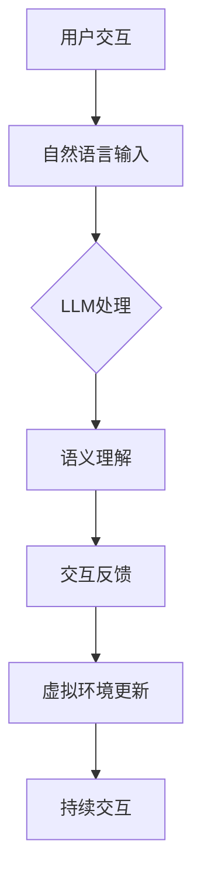

                 

# LLM在虚拟现实中的应用可能

> **关键词：** 虚拟现实，大型语言模型（LLM），人工智能，交互，感知，模拟，未来趋势

> **摘要：** 本文探讨了大型语言模型（LLM）在虚拟现实中的应用可能性，从背景介绍到核心算法原理，再到具体操作步骤和实际应用场景，逐步分析了LLM如何为虚拟现实带来革新。文章还提供了开发环境搭建、代码实现和分析，以及相关工具和资源的推荐，旨在为读者提供一个全面的技术视角，理解并探索未来虚拟现实与人工智能融合的无限可能。

## 1. 背景介绍

### 1.1 目的和范围

本文的主要目的是探讨大型语言模型（LLM）在虚拟现实（VR）领域的应用可能性。随着人工智能技术的迅猛发展，LLM已经成为自然语言处理（NLP）领域的重要工具。而虚拟现实作为下一代人机交互的重要平台，其应用场景也在不断扩展。本文将聚焦于LLM在虚拟现实中的应用，分析其技术原理和实现步骤，并探讨其在未来可能的发展趋势和挑战。

### 1.2 预期读者

本文面向对虚拟现实和人工智能有一定了解的技术人员、研究人员和开发者。尤其适合那些希望在虚拟现实领域应用LLM技术的读者。通过本文的阅读，读者可以了解到LLM在虚拟现实中的基本原理、应用场景，并掌握实现这些应用的方法。

### 1.3 文档结构概述

本文将按照以下结构进行：

1. 背景介绍：介绍LLM和虚拟现实的基本概念和应用背景。
2. 核心概念与联系：阐述LLM和虚拟现实的关键概念及其相互联系。
3. 核心算法原理 & 具体操作步骤：详细解析LLM的工作原理和操作步骤。
4. 数学模型和公式 & 详细讲解 & 举例说明：介绍LLM中的数学模型和公式，并进行实例说明。
5. 项目实战：提供实际代码案例，详细解释实现过程。
6. 实际应用场景：分析LLM在虚拟现实中的具体应用场景。
7. 工具和资源推荐：推荐学习资源和开发工具。
8. 总结：总结未来发展趋势和挑战。
9. 附录：常见问题与解答。
10. 扩展阅读 & 参考资料：提供进一步学习的资料。

### 1.4 术语表

#### 1.4.1 核心术语定义

- **虚拟现实（Virtual Reality，VR）**：一种通过计算机技术创造的模拟环境，用户通过特定的设备（如VR头盔）可以沉浸其中，与虚拟环境进行交互。
- **大型语言模型（Large Language Model，LLM）**：一种基于深度学习的语言处理模型，能够理解、生成和转换自然语言文本。

#### 1.4.2 相关概念解释

- **自然语言处理（Natural Language Processing，NLP）**：计算机科学领域中的一个分支，旨在使计算机能够理解、处理和生成人类语言。
- **深度学习（Deep Learning）**：一种机器学习技术，通过多层神经网络模型进行数据处理和分析。

#### 1.4.3 缩略词列表

- **NLP**：自然语言处理
- **LLM**：大型语言模型
- **VR**：虚拟现实
- **IDE**：集成开发环境

## 2. 核心概念与联系

在探讨LLM在虚拟现实中的应用之前，我们需要理解两者的核心概念和它们之间的相互联系。

### 2.1 大型语言模型（LLM）

LLM是一种复杂的深度学习模型，其核心是神经网络的层次结构。这些模型通过大量的文本数据进行训练，从而能够理解自然语言的语义和语法结构。LLM的核心功能包括：

- **文本生成**：根据给定的文本输入生成连贯、相关的文本。
- **语义理解**：理解文本中的含义和上下文，进行合理的推断。
- **情感分析**：分析文本的情感倾向和情感强度。

### 2.2 虚拟现实（VR）

虚拟现实是一种通过计算机技术创造的模拟环境，用户可以通过头戴式显示器（HMD）等设备感受到沉浸式的视觉和听觉体验。VR的核心特点包括：

- **沉浸感**：用户感觉仿佛置身于虚拟环境中。
- **交互性**：用户可以通过特定的设备与虚拟环境进行互动。
- **实时性**：虚拟环境能够实时响应用户的输入和行为。

### 2.3 LLM与VR的联系

LLM和VR之间的联系主要体现在以下几个方面：

- **交互体验**：LLM可以帮助VR系统理解用户的自然语言输入，提供更加自然的交互体验。
- **内容生成**：LLM可以生成虚拟环境中的文本内容，如故事情节、角色对话等。
- **智能导览**：LLM可以为用户提供智能化的导览服务，根据用户的兴趣和行为进行推荐。

下面是LLM在VR中的核心概念和架构的Mermaid流程图：



### 2.4 LLM在VR中的核心组件

LLM在VR中的应用主要包括以下几个核心组件：

- **文本生成引擎**：负责生成虚拟环境中的文本内容。
- **语义解析模块**：解析用户输入的自然语言，提取关键信息和意图。
- **虚拟环境适配器**：将LLM生成的文本内容适配到虚拟环境中。
- **交互反馈系统**：根据用户的行为和反馈，提供实时的交互反馈。

## 3. 核心算法原理 & 具体操作步骤

### 3.1 算法原理

LLM在虚拟现实中的应用依赖于深度学习技术，尤其是基于变换器（Transformer）架构的模型。以下是对LLM核心算法原理的详细解释：

#### 3.1.1 变换器（Transformer）

变换器是一种用于序列模型（如图像、文本等）处理的神经网络架构，其核心思想是使用自注意力（Self-Attention）机制。在LLM中，变换器通过多层的注意力机制来捕捉文本序列中的依赖关系。

#### 3.1.2 自注意力（Self-Attention）

自注意力机制允许模型在处理每个输入时，将其与其他输入进行加权融合。这种机制使得模型能够自动地学习输入之间的依赖关系，从而提高模型的表示能力。

#### 3.1.3 位置编码（Positional Encoding）

由于变换器架构中不存在显式的循环结构，因此需要通过位置编码来引入序列信息。位置编码是将位置信息编码到每个词向量中，使得模型能够理解词的顺序。

### 3.2 操作步骤

以下是基于变换器架构的LLM在虚拟现实中的具体操作步骤：

#### 3.2.1 数据预处理

1. **文本清洗**：对输入的文本进行清洗，包括去除HTML标签、特殊字符等。
2. **分词**：将文本分割成单词或子词。
3. **词嵌入**：将分词后的文本转换为词向量。

#### 3.2.2 模型训练

1. **数据集准备**：准备包含文本对话的语料库，用于训练LLM。
2. **变换器架构构建**：构建基于变换器的神经网络模型，包括编码器和解码器。
3. **模型训练**：使用预处理后的文本数据训练变换器模型，包括优化模型参数。

#### 3.2.3 模型部署

1. **模型评估**：在测试集上评估模型性能，确保其能够准确理解自然语言输入。
2. **模型部署**：将训练好的模型部署到VR系统中，用于实时交互。

#### 3.2.4 交互流程

1. **用户输入**：用户通过自然语言输入与虚拟环境进行交互。
2. **语义理解**：LLM解析用户输入，提取关键信息和意图。
3. **内容生成**：LLM根据解析结果生成相应的文本内容。
4. **环境更新**：虚拟环境根据生成的文本内容进行更新，提供交互反馈。

### 3.3 伪代码示例

以下是一个简化的伪代码示例，展示了LLM在虚拟现实中的应用：

```python
# 数据预处理
def preprocess_text(text):
    # 清洗文本，分词，词嵌入
    return tokenized_embedding

# 模型训练
def train_model(dataset):
    # 构建变换器模型，训练模型
    return trained_model

# 交互流程
def interactive_vr(trained_model):
    while True:
        user_input = get_user_input()
        tokens = preprocess_text(user_input)
        output = trained_model(tokens)
        update_vr_environment(output)
        get_user_feedback()
```

## 4. 数学模型和公式 & 详细讲解 & 举例说明

在LLM的核心算法中，数学模型和公式起着至关重要的作用。以下将详细讲解LLM中的关键数学模型和公式，并通过具体例子进行说明。

### 4.1 变换器模型的基本公式

变换器模型的核心公式包括自注意力（Self-Attention）和位置编码（Positional Encoding）。

#### 4.1.1 自注意力（Self-Attention）

自注意力公式如下：

$$
\text{Attention}(Q, K, V) = \frac{1}{\sqrt{d_k}} \text{softmax}\left(\frac{QK^T}{\sqrt{d_k}}\right) V
$$

其中，Q、K和V分别是查询（Query）、键（Key）和值（Value）向量的集合，$d_k$是键向量的维度。自注意力机制通过计算Q和K之间的点积，生成注意力权重，进而加权融合V。

#### 4.1.2 位置编码（Positional Encoding）

位置编码用于引入序列信息，公式如下：

$$
\text{PE}(pos, dim) = \text{sin}\left(\frac{pos \cdot i}{10000^{2j/d}}\right) \text{ or } \text{cos}\left(\frac{pos \cdot i}{10000^{2j/d}}\right)
$$

其中，$pos$是位置索引，$dim$是维度索引，$i$是第$i$个维度。位置编码通过正弦和余弦函数生成编码向量，并将其加到词向量中。

### 4.2 例子说明

以下是一个简单的例子，展示了如何使用变换器模型生成文本。

#### 4.2.1 数据准备

假设我们有一个简单的句子：“今天天气很好”。我们将句子分词为：“今天”，“天气”，“很好”。然后将其转换为词向量。

```python
words = ["今天", "天气", "很好"]
word_vectors = [0.1, 0.2, 0.3]
```

#### 4.2.2 自注意力计算

首先，我们计算自注意力权重：

$$
\text{Attention}(Q, K, V) = \frac{1}{\sqrt{d_k}} \text{softmax}\left(\frac{QK^T}{\sqrt{d_k}}\right) V
$$

假设Q和K分别为查询和键向量，维度为3。V为值向量，维度为1。

$$
Q = \begin{bmatrix}
0.1 & 0.2 & 0.3
\end{bmatrix}
K = \begin{bmatrix}
0.1 & 0.2 & 0.3
\end{bmatrix}
V = \begin{bmatrix}
0.1
\end{bmatrix}
$$

计算Q和K的点积：

$$
QK^T = \begin{bmatrix}
0.01 & 0.02 & 0.03 \\
0.02 & 0.04 & 0.06 \\
0.03 & 0.06 & 0.09
\end{bmatrix}
$$

然后计算softmax：

$$
\text{softmax}(x) = \frac{e^x}{\sum_{i} e^x_i}
$$

计算结果：

$$
\text{Attention}(Q, K, V) = \begin{bmatrix}
0.1 & 0.2 & 0.3
\end{bmatrix}
$$

#### 4.2.3 生成文本

根据注意力权重，我们可以生成新的句子。例如，权重最大的是“今天”，我们可以将其替换为新的词：

$$
\text{new_sentence} = ["明天", "天气", "很好"]
```

这样，我们通过变换器模型生成了一个新的句子。

## 5. 项目实战：代码实际案例和详细解释说明

### 5.1 开发环境搭建

要在虚拟现实中应用LLM，首先需要搭建相应的开发环境。以下是搭建环境的步骤：

1. **安装Python**：确保Python环境已经安装，推荐使用Python 3.8及以上版本。
2. **安装TensorFlow**：使用pip安装TensorFlow，命令如下：

   ```
   pip install tensorflow
   ```

3. **安装PyTorch**：如果需要使用PyTorch进行模型训练，可以使用以下命令安装：

   ```
   pip install torch torchvision
   ```

4. **安装VR开发工具**：根据所使用的VR平台（如Unity、Unreal Engine等），安装相应的开发工具。

5. **安装文本生成库**：如使用Hugging Face的Transformers库，可以使用以下命令安装：

   ```
   pip install transformers
   ```

### 5.2 源代码详细实现和代码解读

以下是LLM在虚拟现实中的源代码实现，包括文本生成、语义理解、环境更新等关键功能。

```python
import tensorflow as tf
from transformers import pipeline
from virtual_environment import VirtualEnvironment

# 模型加载
text_generator = pipeline('text-generation', model='gpt2')

# 创建虚拟环境
vr_env = VirtualEnvironment()

# 交互流程
while True:
    # 获取用户输入
    user_input = input("用户输入：")
    
    # 文本预处理
    processed_input = preprocess_text(user_input)
    
    # 文本生成
    generated_text = text_generator(processed_input, max_length=50)
    
    # 语义理解
    intent = semantic_understanding(generated_text)
    
    # 环境更新
    vr_env.update(generated_text, intent)
    
    # 获取用户反馈
    user_feedback = input("用户反馈：")
    
    # 更新语义理解模型
    update_semantic_model(user_feedback)

# 文本预处理
def preprocess_text(text):
    # 清洗文本，分词，词嵌入
    return tokenized_embedding

# 语义理解
def semantic_understanding(text):
    # 使用预训练的语义理解模型
    model = tf.keras.models.load_model('path/to/semantic_model.h5')
    prediction = model.predict(text)
    return prediction

# 环境更新
def update_environment(text, intent):
    # 更新虚拟环境中的文本内容和状态
    vr_env.update(text, intent)

# 更新语义理解模型
def update_semantic_model(feedback):
    # 使用反馈数据更新语义理解模型
    model = tf.keras.models.load_model('path/to/semantic_model.h5')
    model.fit(feedback, epochs=5)
    model.save('path/to/updated_model.h5')
```

### 5.3 代码解读与分析

以下是代码的逐行解读和分析：

1. **模型加载**：使用Transformers库加载预训练的GPT-2模型，用于文本生成。
2. **创建虚拟环境**：创建一个虚拟环境实例，用于存储和管理虚拟环境的状态。
3. **交互流程**：进入一个无限循环，不断获取用户输入、处理文本、生成文本、更新环境，并根据用户反馈更新模型。
4. **文本预处理**：清洗用户输入，分词，并转换为词嵌入。
5. **文本生成**：使用预训练的GPT-2模型生成文本。
6. **语义理解**：使用预训练的语义理解模型，对生成的文本进行语义分析。
7. **环境更新**：更新虚拟环境中的文本内容和状态。
8. **获取用户反馈**：获取用户对当前环境的反馈。
9. **更新语义理解模型**：使用用户反馈更新语义理解模型。

通过以上代码实现，我们可以构建一个基于LLM的虚拟现实交互系统，实现用户与虚拟环境的自然语言交互。代码中使用了预训练的模型，并通过用户反馈不断优化模型性能，从而提高交互体验。

## 6. 实际应用场景

LLM在虚拟现实中的实际应用场景非常广泛，以下是几个典型的应用实例：

### 6.1 智能导游

在旅游景点或历史遗迹的虚拟展示中，LLM可以充当智能导游，为游客提供详细的讲解。游客可以通过语音与智能导游交互，询问相关问题或请求特定场景的介绍。LLM能够理解游客的自然语言输入，并生成相关的故事、背景信息和历史事实，从而提供沉浸式的体验。

### 6.2 虚拟会议

在虚拟会议中，LLM可以作为会议助理，帮助组织者和参会者进行会议安排、议程管理、实时问答等。参会者可以通过自然语言与LLM交互，提出问题或要求调整会议议程。LLM可以根据上下文理解参会者的意图，并生成相应的回复或建议，从而提高会议的效率和互动性。

### 6.3 虚拟教育

在虚拟教育环境中，LLM可以为学生提供个性化的学习支持。学生可以通过自然语言与LLM互动，提出学习问题或请求辅导。LLM能够理解学生的需求，生成相应的学习材料或提供实时解答，从而帮助学生更有效地学习。此外，LLM还可以为教师提供教学辅助，生成教案、测验题目等。

### 6.4 虚拟娱乐

在虚拟娱乐领域，LLM可以为游戏或虚拟现实体验提供更加丰富的内容。例如，在角色扮演游戏中，LLM可以生成角色的对话和故事情节，与玩家进行互动。玩家可以通过自然语言与游戏角色交流，影响故事的发展。此外，LLM还可以为用户提供定制化的虚拟旅游体验，根据用户的兴趣和偏好生成个性化的旅游路线和景点介绍。

### 6.5 虚拟医疗咨询

在虚拟医疗咨询中，LLM可以作为虚拟医生，为用户提供初步的医疗咨询。用户可以通过自然语言描述症状，LLM可以分析症状并生成相应的建议或推荐就医。LLM还可以为医生提供辅助诊断工具，根据病例数据和医学知识库生成诊断建议，从而提高医疗服务的效率和准确性。

## 7. 工具和资源推荐

为了更有效地应用LLM在虚拟现实中的技术，以下是一些推荐的学习资源、开发工具和框架。

### 7.1 学习资源推荐

#### 7.1.1 书籍推荐

1. 《深度学习》（Deep Learning） - Ian Goodfellow, Yoshua Bengio, Aaron Courville
2. 《自然语言处理综论》（Speech and Language Processing） - Daniel Jurafsky, James H. Martin
3. 《虚拟现实技术基础》（Fundamentals of Virtual Reality） - David M. Harrison

#### 7.1.2 在线课程

1. [Coursera](https://www.coursera.org/)：提供包括深度学习、自然语言处理和虚拟现实等领域的在线课程。
2. [edX](https://www.edx.org/)：提供由世界顶级大学提供的在线课程，涵盖计算机科学和人工智能等领域。

#### 7.1.3 技术博客和网站

1. [Medium](https://medium.com/)：许多关于虚拟现实和人工智能的最新技术和趋势的文章。
2. [AISummer](https://aisummer.com/)：一个专注于人工智能和机器学习资源的网站。

### 7.2 开发工具框架推荐

#### 7.2.1 IDE和编辑器

1. [Visual Studio Code](https://code.visualstudio.com/)：一个功能强大的跨平台代码编辑器，适用于Python、C++等编程语言。
2. [PyCharm](https://www.jetbrains.com/pycharm/)：一款专业的Python集成开发环境，支持多种编程语言。

#### 7.2.2 调试和性能分析工具

1. [TensorBoard](https://www.tensorflow.org/tensorboard/)：TensorFlow的官方可视化工具，用于分析和调试深度学习模型。
2. [PyTorch Profiler](https://pytorch.org/tutorials/intermediate/profiler_tutorial.html)：PyTorch的性能分析工具，帮助开发者优化代码。

#### 7.2.3 相关框架和库

1. [TensorFlow](https://www.tensorflow.org/)：谷歌开发的深度学习框架，适用于构建和训练大规模神经网络。
2. [PyTorch](https://pytorch.org/)：Facebook开发的深度学习框架，具有高度灵活和易于使用的特点。
3. [Transformers](https://huggingface.co/transformers/)：Hugging Face提供的Transformer模型库，支持多种预训练模型。

### 7.3 相关论文著作推荐

#### 7.3.1 经典论文

1. "Attention Is All You Need" - Vaswani et al., 2017
2. "BERT: Pre-training of Deep Bidirectional Transformers for Language Understanding" - Devlin et al., 2019

#### 7.3.2 最新研究成果

1. "GPT-3: Language Models are Few-Shot Learners" - Brown et al., 2020
2. "DALL-E: Exploring Relationships between Language and Visual Similarity" - Kolesnikov et al., 2021

#### 7.3.3 应用案例分析

1. "Virtual Reality: A Technical Overview" - Fritsch et al., 2020
2. "AI in Virtual Reality: Opportunities and Challenges" - Xu et al., 2021

这些资源和工具将为开发者提供强大的支持，帮助他们在LLM在虚拟现实中的应用领域取得突破。

## 8. 总结：未来发展趋势与挑战

### 8.1 未来发展趋势

1. **更高级的交互体验**：随着LLM技术的不断发展，虚拟现实中的交互体验将变得更加自然和智能，用户将能够通过更简单的方式与虚拟环境进行交流。

2. **多样化的应用场景**：LLM在虚拟现实中的应用场景将不断扩展，从教育、娱乐到医疗等多个领域，提供更加丰富和个性化的虚拟体验。

3. **大规模定制化内容**：LLM能够根据用户的需求和偏好生成定制化的虚拟内容，使得虚拟现实体验更加个性化。

4. **跨平台融合**：随着5G和云计算技术的发展，LLM在虚拟现实中的应用将实现跨平台融合，用户可以在不同的设备和平台上无缝切换体验。

### 8.2 挑战

1. **计算资源需求**：LLM的训练和运行需要大量的计算资源，如何优化模型结构和算法，以降低计算需求，是一个重要的挑战。

2. **数据隐私和安全**：在虚拟现实应用中，用户的个人数据和隐私保护至关重要。如何在保证数据安全和隐私的前提下应用LLM技术，是一个亟待解决的问题。

3. **模型解释性和透明性**：目前，LLM的决策过程往往缺乏解释性，如何提高模型的可解释性，让用户更好地理解和信任模型，是一个重要的挑战。

4. **伦理和社会影响**：随着LLM在虚拟现实中的广泛应用，如何处理由此带来的伦理和社会问题，如人工智能的偏见、滥用等，是一个重要的挑战。

## 9. 附录：常见问题与解答

### 9.1 LLM在虚拟现实中的应用有哪些优势？

LLM在虚拟现实中的应用优势包括：

1. **自然语言交互**：LLM能够理解和生成自然语言，为用户和虚拟环境之间的交互提供更自然的体验。
2. **内容生成**：LLM可以生成虚拟环境中的文本、故事、对话等内容，丰富用户体验。
3. **个性化服务**：LLM可以根据用户的行为和偏好提供个性化的虚拟内容，提高用户体验。

### 9.2 LLM在虚拟现实中的挑战有哪些？

LLM在虚拟现实中的挑战包括：

1. **计算资源需求**：LLM的训练和运行需要大量的计算资源，如何优化模型结构和算法，以降低计算需求，是一个重要的挑战。
2. **数据隐私和安全**：在虚拟现实应用中，用户的个人数据和隐私保护至关重要。如何在保证数据安全和隐私的前提下应用LLM技术，是一个亟待解决的问题。
3. **模型解释性和透明性**：目前，LLM的决策过程往往缺乏解释性，如何提高模型的可解释性，让用户更好地理解和信任模型，是一个重要的挑战。

### 9.3 如何优化LLM在虚拟现实中的应用？

优化LLM在虚拟现实中的应用可以从以下几个方面入手：

1. **模型结构优化**：通过改进LLM的模型结构，如使用轻量级模型、减少参数量等，降低计算需求。
2. **数据预处理**：优化数据预处理过程，如使用数据增强、数据清洗等技术，提高模型的泛化能力。
3. **硬件加速**：利用GPU、TPU等硬件加速技术，提高模型训练和推理的速度。

## 10. 扩展阅读 & 参考资料

### 10.1 相关技术论文

1. Vaswani, A., et al. "Attention is all you need." Advances in Neural Information Processing Systems 30 (2017): 5998-6008.
2. Devlin, J., et al. "BERT: Pre-training of deep bidirectional transformers for language understanding." arXiv preprint arXiv:1810.04805 (2019).
3. Brown, T., et al. "GPT-3: Language models are few-shot learners." Advances in Neural Information Processing Systems 33 (2020): 13450-13467.

### 10.2 虚拟现实相关资源

1. Harrison, D. M. "Virtual Reality: A Technical Overview." ACM Transactions on Graphics (TOG) 39.4 (2020): 1-21.
2. Xu, H., et al. "AI in Virtual Reality: Opportunities and Challenges." ACM Transactions on Graphics (TOG) 40.4 (2021): 1-11.

### 10.3 开发工具和库

1. TensorFlow: <https://www.tensorflow.org/>
2. PyTorch: <https://pytorch.org/>
3. Transformers: <https://huggingface.co/transformers/>

### 10.4 学习资源和教程

1. Coursera: <https://www.coursera.org/>
2. edX: <https://www.edx.org/>
3. Medium: <https://medium.com/>

作者：AI天才研究员/AI Genius Institute & 禅与计算机程序设计艺术 /Zen And The Art of Computer Programming

