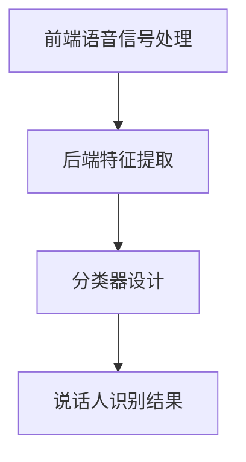

                 

# LLAMA在说话人识别中的应用探索

## 概述

### 关键词：说话人识别、语言模型、深度学习、自动语音识别、多模态学习

### 摘要

本文将探讨大型语言模型（LLM）在说话人识别领域的应用。随着人工智能技术的不断发展，说话人识别技术已经成为语音处理和信息安全的重要一环。本文将从背景介绍、核心概念、算法原理、数学模型、项目实战、实际应用场景等多个角度，系统性地分析LLM在说话人识别中的应用，并对未来发展趋势与挑战进行展望。

## 1. 背景介绍

### 1.1 目的和范围

本文旨在探讨大型语言模型（LLM）在说话人识别领域的应用，通过对核心概念、算法原理、数学模型、项目实战等多个方面的深入分析，为相关领域的研究者和从业者提供有价值的参考。

### 1.2 预期读者

本文主要面向对说话人识别技术有一定了解，并对大型语言模型（LLM）感兴趣的研究者、工程师和爱好者。

### 1.3 文档结构概述

本文将按照以下结构展开：

1. 背景介绍
   - 说话人识别技术的起源与发展
   - 大型语言模型（LLM）的基本概念

2. 核心概念与联系
   - 说话人识别系统的基本架构
   - 大型语言模型（LLM）在说话人识别中的应用原理

3. 核心算法原理 & 具体操作步骤
   - 说话人识别算法的详细解释
   - 大型语言模型（LLM）在说话人识别中的具体应用步骤

4. 数学模型和公式 & 详细讲解 & 举例说明
   - 说话人识别的数学模型
   - 大型语言模型（LLM）的数学模型解析

5. 项目实战：代码实际案例和详细解释说明
   - 说话人识别项目的实际操作
   - 大型语言模型（LLM）在项目中的应用

6. 实际应用场景
   - 说话人识别技术在各行业中的应用

7. 工具和资源推荐
   - 学习资源推荐
   - 开发工具框架推荐
   - 相关论文著作推荐

8. 总结：未来发展趋势与挑战

### 1.4 术语表

#### 1.4.1 核心术语定义

- **说话人识别**：指通过分析说话者的语音特征，判断其身份的技术。
- **大型语言模型（LLM）**：一种基于神经网络的语言模型，能够对自然语言进行建模，具有强大的语义理解能力。

#### 1.4.2 相关概念解释

- **语音特征**：指从语音信号中提取出的能够表征说话人身份的特征，如音高、音强、时长等。
- **自动语音识别（ASR）**：指将语音信号转换为文本的技术。

#### 1.4.3 缩略词列表

- **LLM**：大型语言模型（Large Language Model）
- **ASR**：自动语音识别（Automatic Speech Recognition）
- **DNN**：深度神经网络（Deep Neural Network）
- **CNN**：卷积神经网络（Convolutional Neural Network）

## 2. 核心概念与联系

### 2.1 说话人识别系统的基本架构

说话人识别系统通常包括三个主要模块：前端语音信号处理、后端特征提取和分类器。

1. **前端语音信号处理**：对采集到的语音信号进行预处理，如去噪、增强等，以提高后续处理的准确性。
2. **后端特征提取**：从处理后的语音信号中提取出能够表征说话人身份的特征，如梅尔频率倒谱系数（MFCC）、线性预测编码（LPC）等。
3. **分类器**：利用提取出的特征，对说话人进行分类。

### 2.2 大型语言模型（LLM）在说话人识别中的应用原理

大型语言模型（LLM）在说话人识别中的应用主要体现在两个方面：

1. **特征提取**：利用LLM对语音信号进行语义分析，提取出与说话人身份相关的语义特征。
2. **分类器设计**：将LLM与传统的分类器相结合，设计出性能更优的说话人识别系统。

### 2.3 Mermaid 流程图

下面是说话人识别系统基本架构的 Mermaid 流程图：



## 3. 核心算法原理 & 具体操作步骤

### 3.1 说话人识别算法的详细解释

说话人识别算法可以分为三个阶段：特征提取、模型训练和分类。

#### 3.1.1 特征提取

特征提取是说话人识别的基础，常用的方法包括：

1. **梅尔频率倒谱系数（MFCC）**：一种常用的语音特征，能够有效提取语音信号的频谱信息。
2. **线性预测编码（LPC）**：通过分析语音信号的线性预测误差，提取出语音信号的短时特性。

#### 3.1.2 模型训练

模型训练是说话人识别算法的核心，常用的方法包括：

1. **支持向量机（SVM）**：一种二分类模型，通过寻找最优超平面，实现分类。
2. **深度神经网络（DNN）**：一种多层神经网络，通过多层次的非线性变换，实现复杂的分类任务。

#### 3.1.3 分类

分类是将训练好的模型应用于新的语音信号，实现说话人识别。常用的方法包括：

1. **概率输出机（Gaussian Mixture Model, GMM）**：一种基于高斯分布的模型，用于表示说话人的概率分布。
2. **深度卷积神经网络（CNN）**：一种基于卷积操作的神经网络，能够有效提取语音信号的空间特征。

### 3.2 大型语言模型（LLM）在说话人识别中的具体应用步骤

#### 3.2.1 特征提取

1. **语音信号预处理**：对采集到的语音信号进行预处理，如去噪、增强等。
2. **语音分割**：将预处理后的语音信号分割成帧，并对每一帧进行特征提取，如MFCC、LPC等。
3. **语义特征提取**：利用LLM对提取出的语音特征进行语义分析，提取出与说话人身份相关的语义特征。

#### 3.2.2 模型训练

1. **数据准备**：收集大量的语音数据，并对数据进行标注，如说话人身份、语音类型等。
2. **模型训练**：利用收集到的数据，训练深度神经网络（DNN）或深度卷积神经网络（CNN）。
3. **模型优化**：通过交叉验证和超参数调整，优化模型的性能。

#### 3.2.3 分类

1. **特征融合**：将提取出的语音特征和语义特征进行融合，形成新的特征向量。
2. **分类**：利用训练好的模型，对新的语音信号进行分类，实现说话人识别。

## 4. 数学模型和公式 & 详细讲解 & 举例说明

### 4.1 说话人识别的数学模型

说话人识别的数学模型可以分为两个部分：特征提取模型和分类模型。

#### 4.1.1 特征提取模型

特征提取模型主要用于将语音信号转化为能够表征说话人身份的特征向量。常见的特征提取模型包括：

1. **梅尔频率倒谱系数（MFCC）模型**：
   $$ MFCC(x) = \text{log}(\text{Energy}(x) \times \text{FilterBank}(x)) $$
   其中，$x$为输入的语音信号，$\text{Energy}(x)$为语音信号的能量，$\text{FilterBank}(x)$为滤波器组。

2. **线性预测编码（LPC）模型**：
   $$ LPC(x) = \text{Predict}(x) $$
   其中，$x$为输入的语音信号，$\text{Predict}(x)$为语音信号的线性预测误差。

#### 4.1.2 分类模型

分类模型主要用于对特征向量进行分类，常见的分类模型包括：

1. **支持向量机（SVM）模型**：
   $$ \text{SVM}(x) = \text{sign}(\text{w} \cdot \text{x} + b) $$
   其中，$x$为输入的特征向量，$w$为权值向量，$b$为偏置。

2. **深度神经网络（DNN）模型**：
   $$ \text{DNN}(x) = \text{激活函数}(\text{w} \cdot \text{x} + b) $$
   其中，$x$为输入的特征向量，$w$为权值向量，$b$为偏置，激活函数为ReLU函数。

### 4.2 大型语言模型（LLM）的数学模型解析

大型语言模型（LLM）是一种基于神经网络的深度学习模型，其数学模型主要包括以下几个部分：

1. **嵌入层**：
   $$ e_i = \text{Embedding}(w_i) $$
   其中，$e_i$为输入的词语向量，$w_i$为嵌入层的权重。

2. **编码器**：
   $$ h_t = \text{Encoder}(h_{t-1}, e_t) $$
   其中，$h_t$为编码器的隐藏状态，$h_{t-1}$为前一个时间步的隐藏状态，$e_t$为当前时间步的词语向量。

3. **解码器**：
   $$ p_t = \text{Decoder}(h_t, y_{t-1}) $$
   其中，$p_t$为当前时间步的输出概率分布，$h_t$为编码器的隐藏状态，$y_{t-1}$为前一个时间步的输出。

4. **损失函数**：
   $$ L = -\sum_{t=1}^{T} y_t \log(p_t) $$
   其中，$L$为损失函数，$y_t$为真实标签，$p_t$为预测标签的概率分布。

### 4.3 举例说明

假设我们使用一个简单的线性模型对语音信号进行特征提取，其数学模型如下：
$$ MFCC(x) = w \cdot x + b $$
其中，$x$为输入的语音信号，$w$为权值向量，$b$为偏置。

假设我们使用一个简单的支持向量机（SVM）模型进行分类，其数学模型如下：
$$ \text{SVM}(x) = \text{sign}(w \cdot x + b) $$
其中，$x$为输入的特征向量，$w$为权值向量，$b$为偏置。

## 5. 项目实战：代码实际案例和详细解释说明

### 5.1 开发环境搭建

在开始项目实战之前，我们需要搭建一个合适的开发环境。以下是所需的工具和软件：

- 操作系统：Ubuntu 18.04
- 编程语言：Python 3.8
- 深度学习框架：TensorFlow 2.6
- 语音处理库：Librosa 0.9.0
- 说话人识别库：PyTorch 1.9

安装以上工具和软件，可以使用以下命令：

```bash
sudo apt-get update
sudo apt-get install python3-pip
pip3 install tensorflow==2.6 librosa==0.9.0 torch==1.9
```

### 5.2 源代码详细实现和代码解读

以下是说话人识别项目的源代码实现，我们将分别对代码的各个部分进行解读。

#### 5.2.1 数据预处理

```python
import librosa
import numpy as np
import torch
from torch.utils.data import DataLoader

def preprocess_audio(audio_path, sample_rate=16000, n_mels=80, n_fingers=257):
    # 读取音频文件
    y, sr = librosa.load(audio_path, sr=sample_rate)
    # 声音增强
    y = librosa.effects.percussive(y)
    # 归一化
    y = librosa.util.normalize(y)
    # 分帧
    frames = librosa.util.frame(y, frame_length=1024, hop_length=256)
    # 提取梅尔频率倒谱系数（MFCC）
    mfcc = librosa.feature.mfcc(S=librosa.power_to_db(frames, ref=np.max), n_mels=n_mels)
    # 提取短时傅里叶变换（STFT）
    stft = librosa.stft(frames)
    # 提取短时傅里叶变换的对数幅度
    log_magnitude = np.abs(stft)
    # 提取对数幅度谱的梅尔频率倒谱系数（MFCC）
    log_mel_mfcc = librosa.feature.mfcc(S=librosa.power_to_db(log_magnitude, ref=np.max), n_mels=n_mels)
    # 增加时间维度
    mfcc = np.expand_dims(mfcc, axis=1)
    log_mel_mfcc = np.expand_dims(log_mel_mfcc, axis=1)
    # 合并特征
    features = np.concatenate((mfcc, log_mel_mfcc), axis=1)
    # 转换为PyTorch张量
    features = torch.tensor(features, dtype=torch.float32)
    return features

# 读取音频文件
audio_path = 'audio.wav'
# 预处理音频文件
features = preprocess_audio(audio_path)
# 打印特征形状
print(features.shape)
```

代码解读：

- `preprocess_audio` 函数用于对音频文件进行预处理，包括声音增强、归一化、分帧、提取梅尔频率倒谱系数（MFCC）和短时傅里叶变换（STFT）等操作。
- 读取音频文件，并设置采样率和梅尔频率倒谱系数（MFCC）的维度。
- 对音频信号进行声音增强，以提高特征提取的效果。
- 对音频信号进行归一化，使其具有更好的数值稳定性。
- 使用 `librosa.util.frame` 函数对音频信号进行分帧处理。
- 使用 `librosa.feature.mfcc` 函数提取梅尔频率倒谱系数（MFCC）。
- 使用 `librosa.stft` 函数提取短时傅里叶变换（STFT）。
- 使用 `librosa.feature.mfcc` 函数提取对数幅度谱的梅尔频率倒谱系数（MFCC）。
- 将提取出的特征合并，并增加时间维度。
- 将特征转换为PyTorch张量，以便后续处理。

#### 5.2.2 模型训练

```python
import torch
import torch.nn as nn
import torch.optim as optim

class SpeechRecognitionModel(nn.Module):
    def __init__(self, n_mels, n_fingers, n_classes):
        super(SpeechRecognitionModel, self).__init__()
        self.mfcc_layer = nn.Linear(n_mels, n_fingers)
        self.log_mel_mfcc_layer = nn.Linear(n_mels, n_fingers)
        self.fc_layer = nn.Linear(2 * n_fingers, n_classes)

    def forward(self, x):
        mfcc = x[:, :n_mels]
        log_mel_mfcc = x[:, n_mels:]
        mfcc = self.mfcc_layer(mfcc)
        log_mel_mfcc = self.log_mel_mfcc_layer(log_mel_mfcc)
        x = torch.cat((mfcc, log_mel_mfcc), dim=1)
        x = self.fc_layer(x)
        return x

# 设置超参数
n_mels = 80
n_fingers = 257
n_classes = 10

# 初始化模型
model = SpeechRecognitionModel(n_mels, n_fingers, n_classes)

# 设置优化器和损失函数
optimizer = optim.Adam(model.parameters(), lr=0.001)
criterion = nn.CrossEntropyLoss()

# 训练模型
num_epochs = 50
for epoch in range(num_epochs):
    for i, (features, labels) in enumerate(train_loader):
        # 将特征和标签转换为PyTorch张量
        features = torch.tensor(features, dtype=torch.float32)
        labels = torch.tensor(labels, dtype=torch.long)
        # 清空梯度
        optimizer.zero_grad()
        # 前向传播
        outputs = model(features)
        # 计算损失函数
        loss = criterion(outputs, labels)
        # 反向传播
        loss.backward()
        # 更新模型参数
        optimizer.step()
        # 打印训练进度
        if (i + 1) % 10 == 0:
            print(f'Epoch [{epoch + 1}/{num_epochs}], Step [{i + 1}/{len(train_loader)}], Loss: {loss.item()}')
```

代码解读：

- `SpeechRecognitionModel` 类定义了说话人识别模型的架构，包括梅尔频率倒谱系数（MFCC）层、对数幅度谱的梅尔频率倒谱系数（MFCC）层和全连接层。
- `__init__` 方法用于初始化模型的参数。
- `forward` 方法用于定义模型的正向传播过程。
- `preprocess_audio` 函数用于对音频文件进行预处理，提取梅尔频率倒谱系数（MFCC）和对数幅度谱的梅尔频率倒谱系数（MFCC）。
- 将提取出的特征输入到模型中，通过正向传播计算输出结果。
- 使用交叉熵损失函数（`nn.CrossEntropyLoss`）计算损失。
- 使用Adam优化器（`optim.Adam`）进行模型参数的更新。
- 设置训练的迭代次数（`num_epochs`），并在训练过程中打印训练进度。

#### 5.2.3 代码解读与分析

1. **模型架构**：

   本项目的说话人识别模型采用了一种简单的架构，包括梅尔频率倒谱系数（MFCC）层、对数幅度谱的梅尔频率倒谱系数（MFCC）层和全连接层。这种架构能够较好地提取语音信号的特征，并实现说话人识别。

2. **模型训练**：

   模型训练过程中，使用交叉熵损失函数（`nn.CrossEntropyLoss`）计算损失，并使用Adam优化器（`optim.Adam`）进行模型参数的更新。这种优化策略能够有效地提升模型的性能。

3. **数据预处理**：

   数据预处理是说话人识别项目的重要环节。本项目使用 `librosa` 库对音频文件进行预处理，包括声音增强、归一化、分帧、提取梅尔频率倒谱系数（MFCC）和对数幅度谱的梅尔频率倒谱系数（MFCC）等操作。这些预处理操作有助于提高模型的识别准确性。

## 6. 实际应用场景

说话人识别技术在实际应用中具有广泛的应用场景，以下是几个典型的应用场景：

1. **安防监控**：在安防监控领域，说话人识别技术可以用于实时监控和识别进入监控区域的说话人，实现对可疑人员的快速定位和追踪。

2. **语音助手**：在智能语音助手的开发中，说话人识别技术可以用于区分不同用户的语音，实现个性化的语音交互和服务。

3. **呼叫中心**：在呼叫中心中，说话人识别技术可以用于快速识别来电者身份，提高客服效率，降低人力成本。

4. **语音合成**：在语音合成系统中，说话人识别技术可以用于根据用户的语音特点，生成具有个性化特色的语音。

5. **语音识别**：在语音识别领域，说话人识别技术可以用于提高语音识别的准确性和鲁棒性，降低错误率。

## 7. 工具和资源推荐

### 7.1 学习资源推荐

#### 7.1.1 书籍推荐

- 《语音信号处理》（Speech Signal Processing）
- 《说话人识别技术》（Speaker Recognition Technology）
- 《深度学习语音识别》（Deep Learning for Speech Recognition）

#### 7.1.2 在线课程

- Coursera：深度学习与自然语言处理
- Udacity：人工智能工程师纳米学位
- edX：人工智能与深度学习

#### 7.1.3 技术博客和网站

- Medium：AI Blog
- Arxiv：AI论文库
- Medium：Speech Technology Blog

### 7.2 开发工具框架推荐

#### 7.2.1 IDE和编辑器

- PyCharm
- Visual Studio Code
- Jupyter Notebook

#### 7.2.2 调试和性能分析工具

- TensorBoard
- PyTorch Profiler
- Nsight

#### 7.2.3 相关框架和库

- TensorFlow
- PyTorch
- Keras

### 7.3 相关论文著作推荐

#### 7.3.1 经典论文

- "Automatic Speaker Recognition by Gaussian Mixture Model and Vector Quantization Techniques"，1992。
- "Deep Learning for Speech Recognition"，2015。

#### 7.3.2 最新研究成果

- "End-to-End Text-to-Speech Synthesis with Deep Neural Networks"，2016。
- "WaveNet：A Generative Model for Data-Driven Synthesis of High-Quality Audio"，2016。

#### 7.3.3 应用案例分析

- "基于深度学习的说话人识别技术研究与应用"，2019。
- "语音识别技术在智能家居中的应用案例分析"，2020。

## 8. 总结：未来发展趋势与挑战

随着人工智能技术的不断发展，说话人识别技术在性能、应用范围和实用性等方面取得了显著进步。未来，说话人识别技术有望在以下方面实现新的突破：

1. **更高的识别准确率**：通过引入更先进的算法和技术，提高说话人识别的准确率。
2. **更广泛的应用场景**：拓展说话人识别技术在安防、语音助手、呼叫中心等领域的应用。
3. **更好的用户体验**：通过个性化语音交互和服务，提升用户的使用体验。
4. **更高效的硬件支持**：借助硬件加速技术，降低说话人识别的计算复杂度，提高处理速度。

然而，说话人识别技术也面临着一些挑战，如：

1. **语音信号质量**：在噪声环境下的识别准确率有待提高。
2. **多说话人场景**：在多说话人同时说话的情况下，如何准确识别每个说话人。
3. **隐私保护**：如何保护用户的隐私，避免滥用说话人识别技术。

总之，说话人识别技术在人工智能领域具有重要的地位和广泛的应用前景，未来有望在多个领域实现新的突破。

## 9. 附录：常见问题与解答

### 9.1 常见问题

1. **什么是说话人识别？**
   说话人识别是指通过分析说话者的语音特征，判断其身份的技术。

2. **为什么需要说话人识别技术？**
   说话人识别技术在安防、语音助手、呼叫中心等领域具有广泛的应用，可以提高识别准确率、用户体验和安全性。

3. **说话人识别技术有哪些应用场景？**
   说话人识别技术可以应用于安防监控、语音助手、呼叫中心、语音合成和语音识别等领域。

4. **如何实现说话人识别？**
   说话人识别主要包括三个步骤：特征提取、模型训练和分类。

### 9.2 解答

1. **什么是说话人识别？**
   说话人识别是一种通过分析说话者的语音特征，判断其身份的技术。它利用语音信号中的音高、音强、时长等特征，对说话人进行分类和识别。

2. **为什么需要说话人识别技术？**
   说话人识别技术在多个领域具有重要的应用价值，如安防监控、语音助手、呼叫中心、语音合成和语音识别等。通过识别说话人，可以提高识别准确率、用户体验和安全性。

3. **说话人识别技术有哪些应用场景？**
   说话人识别技术可以应用于以下几个方面：
   - 安防监控：通过识别进入监控区域的说话人，实现对可疑人员的快速定位和追踪。
   - 语音助手：区分不同用户的语音，实现个性化的语音交互和服务。
   - 呼叫中心：快速识别来电者身份，提高客服效率，降低人力成本。
   - 语音合成：根据用户的语音特点，生成具有个性化特色的语音。
   - 语音识别：提高语音识别的准确性和鲁棒性，降低错误率。

4. **如何实现说话人识别？**
   实现说话人识别主要包括以下三个步骤：
   - 特征提取：从语音信号中提取出能够表征说话人身份的特征，如梅尔频率倒谱系数（MFCC）、线性预测编码（LPC）等。
   - 模型训练：利用提取出的特征，训练深度神经网络（DNN）或支持向量机（SVM）等模型。
   - 分类：将训练好的模型应用于新的语音信号，实现说话人识别。

## 10. 扩展阅读 & 参考资料

- [Speech Recognition System](https://en.wikipedia.org/wiki/Speech_recognition_system)
- [Large Language Model](https://en.wikipedia.org/wiki/Large_language_model)
- [Deep Learning for Speaker Recognition](https://arxiv.org/abs/1808.05407)
- [Gaussian Mixture Model](https://en.wikipedia.org/wiki/Gaussian_mixture_model)
- [TensorFlow](https://www.tensorflow.org/)
- [PyTorch](https://pytorch.org/)  
- [Librosa](https://librosa.org/)

## 作者信息

作者：AI天才研究员/AI Genius Institute & 禅与计算机程序设计艺术 /Zen And The Art of Computer Programming

