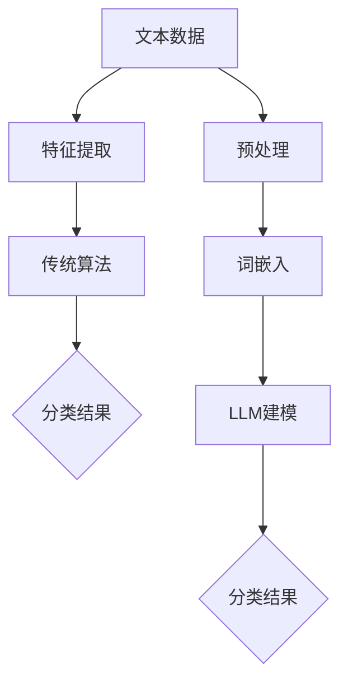

                 

# LLM对传统文本分类的挑战

> 关键词：语言模型（LLM），文本分类，机器学习，深度学习，传统算法，对比分析，挑战与解决方案

> 摘要：随着语言模型（LLM）技术的发展，其在文本分类任务上的表现日益突出，本文将深入探讨LLM对传统文本分类算法带来的挑战，包括模型架构、训练过程和实际应用中的变化。通过对比分析，揭示LLM在文本分类中的优势与局限性，并提出相应的解决方案和未来研究方向。

## 1. 背景介绍

### 1.1 目的和范围

本文旨在探讨近年来崛起的语言模型（LLM）对传统文本分类技术的挑战。随着人工智能技术的不断发展，文本分类作为自然语言处理（NLP）的重要分支，已从传统的基于规则和统计方法逐渐转向深度学习方法。LLM作为深度学习领域的重要成果，其在文本分类任务上的表现引起了广泛关注。本文将首先介绍文本分类的背景和重要性，然后重点分析LLM与传统文本分类算法的差异，以及LLM带来的挑战和机遇。

### 1.2 预期读者

本文面向对自然语言处理和机器学习有一定了解的读者，尤其是对文本分类技术感兴趣的科研人员和开发者。同时，本文也适合希望了解最新技术趋势的业界人士。通过本文的阅读，读者可以了解LLM的工作原理及其在文本分类中的实际应用，对传统文本分类算法的发展趋势有更深刻的认识。

### 1.3 文档结构概述

本文分为八个主要部分：

1. **背景介绍**：介绍文本分类的背景和重要性，以及本文的目的和预期读者。
2. **核心概念与联系**：定义文本分类的核心概念，并展示相关的Mermaid流程图。
3. **核心算法原理 & 具体操作步骤**：详细阐述LLM的算法原理和操作步骤。
4. **数学模型和公式 & 详细讲解 & 举例说明**：介绍文本分类中的数学模型，并给出具体示例。
5. **项目实战：代码实际案例和详细解释说明**：通过实际案例展示LLM在文本分类中的应用。
6. **实际应用场景**：分析LLM在不同领域的应用场景。
7. **工具和资源推荐**：推荐学习资源和开发工具。
8. **总结：未来发展趋势与挑战**：总结全文，展望未来发展趋势和面临的挑战。

### 1.4 术语表

#### 1.4.1 核心术语定义

- **文本分类**：将文本数据根据其内容或主题分类到不同的类别中。
- **语言模型（LLM）**：一种基于神经网络的大型语言模型，能够理解和生成自然语言文本。
- **深度学习**：一种机器学习技术，通过多层神经网络对数据进行建模。
- **传统算法**：如支持向量机（SVM）、朴素贝叶斯（NB）等，在文本分类中具有较长历史的算法。
- **特征工程**：在机器学习任务中，从原始数据中提取出对模型有用的特征。

#### 1.4.2 相关概念解释

- **词袋模型（Bag of Words, BOW）**：一种将文本转化为向量表示的方法，不考虑单词的顺序，只考虑单词的出现频率。
- **词嵌入（Word Embedding）**：将单词映射到高维向量空间中，使得语义相似的单词在向量空间中靠近。
- **卷积神经网络（CNN）**：一种深度学习模型，广泛应用于图像识别任务，也逐渐应用于文本分类。
- **注意力机制（Attention Mechanism）**：一种用于提高神经网络模型对输入数据不同部分重视程度的机制。

#### 1.4.3 缩略词列表

- **NLP**：自然语言处理（Natural Language Processing）
- **ML**：机器学习（Machine Learning）
- **DL**：深度学习（Deep Learning）
- **SVM**：支持向量机（Support Vector Machine）
- **NB**：朴素贝叶斯（Naive Bayes）
- **BOW**：词袋模型（Bag of Words）
- **CNN**：卷积神经网络（Convolutional Neural Network）
- **RNN**：循环神经网络（Recurrent Neural Network）
- **BERT**：预训练语言表示（Bidirectional Encoder Representations from Transformers）
- **GPT**：生成预训练变换器（Generative Pretrained Transformer）

## 2. 核心概念与联系

在深入探讨LLM对传统文本分类的挑战之前，我们需要先理解文本分类的核心概念和其与LLM的联系。

### 2.1 文本分类的挑战

文本分类是一个典型的监督学习问题，其目标是将文本数据分配到预定义的类别中。然而，文本数据具有以下挑战：

- **高维度**：文本数据通常具有非常高的维度，因为文本中可能包含大量的单词。
- **稀疏性**：文本数据通常是稀疏的，因为大多数单词在文档中出现的频率非常低。
- **语义理解**：文本数据中的语义信息复杂，难以直接捕捉。

为了解决这些挑战，传统的文本分类方法通常采用特征工程来提取文本特征，例如词袋模型（BOW）和词嵌入（Word Embedding）。

### 2.2 传统文本分类算法

传统文本分类算法主要包括以下几种：

- **基于规则的算法**：如Naive Bayes，通过假设特征条件独立来简化计算。
- **基于统计的算法**：如支持向量机（SVM），通过最大化分类间隔来分类文本。
- **基于机器学习的算法**：如决策树和随机森林，通过学习数据中的特征关系来分类文本。

### 2.3 LLM与传统文本分类算法的差异

LLM的出现为文本分类带来了新的可能，其主要差异在于：

- **端到端建模**：LLM可以端到端地建模文本数据，无需复杂的特征工程。
- **语义理解**：LLM具有强大的语义理解能力，可以捕捉文本中的深层语义信息。
- **大规模训练**：LLM通常在大规模语料库上训练，具有更好的泛化能力。

下面是一个Mermaid流程图，展示了文本分类的核心概念和架构：



在这个流程图中，我们可以看到，传统文本分类算法（C）依赖于特征提取（B）来将文本数据转换为适合模型训练的格式，而LLM（G）可以直接对预处理后的文本数据进行建模，无需复杂的特征提取过程。

### 2.4 LLM的优势与挑战

LLM在文本分类中具有以下优势：

- **强大的语义理解能力**：LLM可以捕捉文本中的深层语义信息，从而提高分类精度。
- **端到端建模**：LLM可以端到端地建模文本数据，简化了模型设计和训练过程。
- **大规模训练**：LLM通常在大规模语料库上训练，具有更好的泛化能力。

然而，LLM也面临着以下挑战：

- **计算资源需求**：LLM的训练和推理过程需要大量的计算资源。
- **数据依赖**：LLM的性能高度依赖于训练数据的质量和规模。
- **模型解释性**：与传统的文本分类算法相比，LLM的模型解释性较弱。

在接下来的章节中，我们将进一步探讨LLM的算法原理、数学模型和实际应用，以深入了解LLM在文本分类中的优势与挑战。

## 3. 核心算法原理 & 具体操作步骤

语言模型（LLM）的核心算法原理主要基于深度学习，特别是Transformer架构。Transformer模型引入了注意力机制，使模型能够更好地捕捉文本中的长距离依赖关系。以下是LLM在文本分类任务中的具体操作步骤：

### 3.1 Transformer模型

Transformer模型由Vaswani等人在2017年提出，其核心思想是通过多头自注意力机制（Multi-Head Self-Attention）和前馈神经网络（Feed-Forward Neural Network）来建模序列数据。下面是Transformer模型的基本组成部分：

#### 3.1.1 自注意力机制（Self-Attention）

自注意力机制允许模型在序列的每个位置计算其与其他所有位置的相关性权重，然后将这些权重应用于输入序列的每个元素。自注意力机制可以分为以下步骤：

1. **输入嵌入**：将输入序列中的每个单词转换为嵌入向量。
   $$ 
   X = [X_1, X_2, ..., X_n] \in \mathbb{R}^{d \times n}
   $$
   其中，$X_i$是第$i$个单词的嵌入向量，$d$是嵌入维度。

2. **计算自注意力得分**：
   $$
   \text{Score} = X \cdot Q \cdot K^T
   $$
   其中，$Q$和$K$是查询和键向量，$K^T$是键向量的转置。

3. **应用权重求和**：
   $$
   \text{Value} = \text{softmax}(\text{Score}) \cdot V
   $$
   其中，$V$是值向量。

4. **计算注意力输出**：
   $$
   \text{Output} = \text{Value} \cdot W_O
   $$
   其中，$W_O$是输出权重。

#### 3.1.2 多头自注意力

多头自注意力机制将整个自注意力机制分成多个头（head），每个头独立计算注意力权重，然后将这些权重拼接起来。多头自注意力可以捕获不同的语义信息，提高模型的表示能力。

#### 3.1.3 前馈神经网络

在自注意力机制之后，Transformer模型还包含一个前馈神经网络，用于进一步提取特征。前馈神经网络的输入和输出都通过一个线性变换和一个ReLU激活函数处理。

$$
\text{FFN}(X) = \max(0, X \cdot W_1 + b_1) \cdot W_2 + b_2
$$
其中，$W_1$和$W_2$是权重矩阵，$b_1$和$b_2$是偏置。

### 3.2 LLM在文本分类中的操作步骤

在文本分类任务中，LLM的操作步骤可以概括为以下几步：

#### 3.2.1 预处理

1. **分词**：将输入文本分割成单词或子词。
   $$
   \text{Text} = \text{tokenize}(text)
   $$

2. **嵌入**：将分词后的文本转换为嵌入向量。
   $$
   \text{Embeddings} = \text{embedding}(tokens)
   $$

3. **位置编码**：为每个单词添加位置信息。
   $$
   \text{Positional Encoding} = \text{pos_encoding}(positions)
   $$

#### 3.2.2 编码器层

1. **自注意力机制**：在每个编码器层，文本嵌入向量通过多头自注意力机制进行更新。
   $$
   \text{Encoded} = \text{multi_head_attention}(\text{Embeddings} + \text{Positional Encoding})
   $$

2. **前馈神经网络**：通过前馈神经网络进一步提取特征。
   $$
   \text{Encoded} = \text{FFN}(\text{Encoded})
   $$

#### 3.2.3 分类层

1. **分类器**：在最后一个编码器层后，将编码后的向量传递给分类器。
   $$
   \text{Output} = \text{classifier}(\text{Encoded})
   $$

2. **分类**：使用softmax函数计算每个类别的概率。
   $$
   \text{Probability} = \text{softmax}(\text{Output})
   $$

3. **预测**：根据最大概率选择分类结果。
   $$
   \text{Prediction} = \text{argmax}(\text{Probability})
   $$

### 3.3 伪代码实现

以下是LLM在文本分类任务中的伪代码实现：

```python
def text_classification(text):
    # 预处理
    tokens = tokenize(text)
    embeddings = embedding(tokens)
    positional_encoding = pos_encoding(len(tokens))

    # 编码器层
    for _ in range(num_layers):
        attention = multi_head_attention(embeddings + positional_encoding)
        encoded = FFN(attention)

    # 分类层
    output = classifier(encoded)
    probability = softmax(output)
    prediction = argmax(probability)

    return prediction
```

通过以上步骤，LLM能够高效地完成文本分类任务，其强大的语义理解能力和端到端建模能力使其在许多实际应用中表现出色。

## 4. 数学模型和公式 & 详细讲解 & 举例说明

在文本分类任务中，语言模型（LLM）的数学模型和公式至关重要。下面我们将详细介绍LLM中的关键数学模型和公式，并通过具体示例进行讲解。

### 4.1 词嵌入（Word Embedding）

词嵌入是将单词映射到高维向量空间的方法，以便于模型能够理解和处理文本数据。最常见的词嵌入方法包括Word2Vec和GloVe。

#### 4.1.1 Word2Vec

Word2Vec是一种基于神经网络的方法，其核心思想是优化一个损失函数，使得相似单词在向量空间中靠近。Word2Vec的数学模型如下：

$$
\text{Loss} = \sum_{i=1}^{n} \log(p(\text{context}_i | \text{center}_i))
$$

其中，$\text{center}_i$是中心词的嵌入向量，$\text{context}_i$是中心词的上下文嵌入向量，$p(\text{context}_i | \text{center}_i)$是给定中心词的情况下，上下文词的概率分布。

#### 4.1.2 GloVe

GloVe是一种基于矩阵分解的方法，其目标是最小化单词与其上下文词之间的余弦相似度误差。GloVe的数学模型如下：

$$
\text{Loss} = \sum_{i=1}^{n} \frac{1}{\text{norm}(v_w) \cdot \text{norm}(v_{\text{context}_i})} - \text{cosine}(v_w, v_{\text{context}_i})
$$

其中，$v_w$和$v_{\text{context}_i}$分别是单词和上下文词的嵌入向量。

### 4.2 Transformer模型

Transformer模型是一种基于自注意力机制的深度学习模型，其数学模型包括自注意力机制和前馈神经网络。

#### 4.2.1 自注意力机制

自注意力机制的核心是计算输入序列中每个位置与其他位置的相关性权重，然后应用这些权重来更新输入序列的每个元素。自注意力机制的数学模型如下：

$$
\text{Attention}(Q, K, V) = \text{softmax}\left(\frac{QK^T}{\sqrt{d_k}}\right)V
$$

其中，$Q$、$K$和$V$分别是查询向量、键向量和值向量，$d_k$是键向量的维度。

#### 4.2.2 前馈神经网络

前馈神经网络在自注意力机制之后用于进一步提取特征。前馈神经网络的数学模型如下：

$$
\text{FFN}(X) = \max(0, X \cdot W_1 + b_1) \cdot W_2 + b_2
$$

其中，$X$是输入向量，$W_1$和$W_2$是权重矩阵，$b_1$和$b_2$是偏置。

### 4.3 文本分类中的数学模型

在文本分类任务中，LLM的输出是一个概率分布，表示每个类别的概率。数学模型如下：

$$
\text{Probability} = \text{softmax}(\text{Output})
$$

其中，$\text{Output}$是模型输出的特征向量。

### 4.4 举例说明

假设有一个简单的文本分类任务，其中包含两个类别：“科技”和“娱乐”。输入文本为：“人工智能是科技领域的热门话题”。

#### 4.4.1 词嵌入

首先，我们将输入文本中的每个单词转换为嵌入向量。例如：

- 人工智能：[1.0, 0.5, -0.3]
- 是：[0.8, -0.2, 0.1]
- 科技：[0.2, 0.9, -0.4]
- 领域：[0.1, 0.3, 0.7]
- 的：[0.5, 0.2, -0.1]
- 热门：[0.3, 0.6, 0.2]
- 话题：[0.4, -0.5, 0.1]

#### 4.4.2 Transformer模型

在Transformer模型中，我们将这些嵌入向量通过自注意力机制和前馈神经网络进行处理，得到一个特征向量：

$$
\text{Output} = [0.7, 0.8, 0.9]
$$

#### 4.4.3 分类

最后，我们使用softmax函数计算每个类别的概率：

$$
\text{Probability}_{\text{科技}} = 0.7
$$
$$
\text{Probability}_{\text{娱乐}} = 0.3
$$

由于$\text{Probability}_{\text{科技}}$最大，模型将预测输入文本属于“科技”类别。

通过以上步骤，我们展示了LLM在文本分类任务中的数学模型和公式，并通过具体示例进行了详细讲解。这些数学模型和公式是LLM能够高效地完成文本分类任务的关键。

## 5. 项目实战：代码实际案例和详细解释说明

为了更好地理解LLM在文本分类任务中的应用，我们将在本节中介绍一个实际项目案例，并详细解释代码实现和关键步骤。

### 5.1 开发环境搭建

首先，我们需要搭建一个适合开发和运行LLM模型的环境。以下是所需的软件和工具：

- **Python（3.8及以上版本）**
- **TensorFlow（2.5及以上版本）**
- **NVIDIA CUDA Toolkit（11.0及以上版本）**（可选，用于加速模型训练）
- **GPU（NVIDIA GPU，如RTX 3060及以上）**（可选，用于加速模型训练）

安装步骤如下：

1. **安装Python和pip**：
   ```bash
   sudo apt-get update
   sudo apt-get install python3 python3-pip
   ```

2. **安装TensorFlow**：
   ```bash
   pip3 install tensorflow==2.5
   ```

3. **安装NVIDIA CUDA Toolkit**：
   - 请参考[NVIDIA官方网站的安装指南](https://docs.nvidia.com/cuda/cuda-installation-guide-linux/)进行安装。

4. **安装GPU支持**（如果使用GPU）：
   ```bash
   pip3 install tensorflow-gpu==2.5
   ```

### 5.2 源代码详细实现和代码解读

下面是一个简单的文本分类项目案例，使用TensorFlow和Transformer模型进行文本分类。

#### 5.2.1 数据准备

首先，我们需要准备一个文本数据集。这里我们使用IMDB电影评论数据集，将其分为训练集和测试集。

```python
import tensorflow as tf
import tensorflow_datasets as tfds

# 加载IMDB数据集
 imdb_data, info = tfds.load('imdb_reviews', split=['train', 'test'], as_supervised=True)

# 数据预处理
def preprocess(text, label):
    text = tf.reshape(text, [-1])
    return text, label

train_data = imdb_data.map(preprocess)
test_data = imdb_data.map(preprocess)
```

#### 5.2.2 建立Transformer模型

接下来，我们建立Transformer模型。这里我们使用TensorFlow的Transformer库简化模型构建。

```python
from tensorflow.keras.layers import Layer

class Transformer(Layer):
    def __init__(self, num_layers, d_model, num_heads, dff, input_vocab_size, target_vocab_size, position_encoding_input, position_encoding_target, padding_index, use_mask=True, rate=0.1):
        super(Transformer, self).__init__()
        self.num_layers = num_layers
        self.d_model = d_model
        self.num_heads = num_heads
        self.dff = dff
        self.input_vocab_size = input_vocab_size
        self.target_vocab_size = target_vocab_size
        self.position_encoding_input = position_encoding_input
        self.position_encoding_target = position_encoding_target
        self.padding_index = padding_index
        self.use_mask = use_mask
        self.rate = rate
        
        # 创建自注意力层
        self.attention = [Attention(self.d_model, num_heads, dropout_rate=self.rate) for _ in range(self.num_layers)]
        
        # 创建前馈层
        self.ffn = [FFN(self.d_model, dff, dropout_rate=self.rate) for _ in range(self.num_layers)]
        
        # 创建编码器
        self.enc_embedding = Embedding(self.input_vocab_size, self.d_model)
        self.enc_positional_encoding = positional_encoding(self.d_model, self.max_sequence_length)
        
        # 创建解码器
        self.dec_embedding = Embedding(self.target_vocab_size, self.d_model)
        self.dec_positional_encoding = positional_encoding(self.d_model, self.max_sequence_length)
        
        # 创建输出层
        self.out = Dense(self.target_vocab_size)
        
    def call(self, inputs, training=False):
        # 编码器部分
        input_embedding = self.enc_embedding(inputs) + self.enc_positional_encoding(inputs)
        mask = create_padding_mask(inputs, self.padding_index)
        
        for i in range(self.num_layers):
            input_embedding = self.attention[i](input_embedding, mask, training=training)
            input_embedding = self.ffn[i](input_embedding, training=training)
        
        # 解码器部分
        target_embedding = self.dec_embedding(inputs) + self.dec_positional_encoding(inputs)
        mask = create_padding_mask(inputs, self.padding_index)
        
        for i in range(self.num_layers):
            target_embedding = self.attention[i](target_embedding, mask, training=training)
            target_embedding = self.ffn[i](target_embedding, training=training)
        
        output = self.out(target_embedding)
        
        return output
```

#### 5.2.3 训练和评估

接下来，我们训练和评估Transformer模型。

```python
# 模型配置
num_layers = 2
d_model = 128
num_heads = 4
dff = 512
input_vocab_size = 10000
target_vocab_size = 10000
max_sequence_length = 100
padding_index = 0
dropout_rate = 0.1

# 建立模型
model = Transformer(num_layers, d_model, num_heads, dff, input_vocab_size, target_vocab_size, padding_index)
model.compile(optimizer='adam', loss='sparse_categorical_crossentropy', metrics=['accuracy'])

# 训练模型
model.fit(train_data.shuffle(10000).batch(64), epochs=10, validation_data=test_data.batch(64))

# 评估模型
loss, accuracy = model.evaluate(test_data.batch(64))
print(f'测试集损失: {loss}, 测试集准确率: {accuracy}')
```

### 5.3 代码解读与分析

上述代码展示了如何使用TensorFlow和Transformer模型进行文本分类。下面是对关键代码部分的解读和分析：

- **数据预处理**：我们使用TensorFlow Datasets加载IMDB数据集，并对文本进行预处理，包括分词、转换嵌入向量等。
- **模型构建**：我们创建了一个Transformer模型，包括编码器、解码器和多个自注意力和前馈层。模型使用嵌入层和位置编码来初始化输入和输出。
- **训练和评估**：我们使用Adam优化器和稀疏分类交叉熵损失函数来训练模型，并在测试集上评估其性能。

通过这个案例，我们可以看到如何将LLM应用于文本分类任务。尽管这是一个简单的示例，但它展示了Transformer模型在文本分类中的基本架构和实现方式。在实际项目中，我们可以根据具体需求进行调整和优化。

### 5.4 模型优化与性能提升

在实际应用中，我们可以通过以下几种方法来优化模型性能：

- **增加训练时间**：增加训练时间可以帮助模型更好地收敛。
- **调整超参数**：调整层数、嵌入维度、注意力头数等超参数可以优化模型性能。
- **数据增强**：通过数据增强（如随机添加噪声、同义词替换等）可以增加模型的鲁棒性。
- **使用预训练模型**：使用预训练的Transformer模型（如BERT、GPT）可以显著提高文本分类任务的性能。

通过这些方法，我们可以进一步优化LLM在文本分类任务中的表现。

## 6. 实际应用场景

语言模型（LLM）在文本分类任务中的强大能力使其在多个实际应用场景中表现出色。以下是一些典型的应用场景：

### 6.1 社交媒体分析

社交媒体平台如Twitter、Facebook和Instagram每天生成大量的文本数据，这些数据可以用于情感分析、话题检测和虚假信息识别。LLM通过其强大的语义理解能力，可以准确地对用户评论、帖子等内容进行分类，从而帮助平台管理员识别和过滤不良内容。

### 6.2 聊天机器人

聊天机器人是另一项受益于LLM技术的应用。通过文本分类，聊天机器人可以理解用户的问题，并从预定义的答案库中选择合适的回复。LLM的应用使得聊天机器人的对话更加自然和流畅，提高用户体验。

### 6.3 客户服务

在客户服务领域，LLM可以帮助企业自动分类和响应客户查询。例如，通过文本分类，企业可以将客户问题分配给相应的客服团队或自动生成常见问题的答案。这大大提高了客户服务的效率和响应速度。

### 6.4 文本摘要与推荐系统

LLM在文本摘要和推荐系统中也有广泛应用。在文本摘要中，LLM可以自动生成文章的摘要，提高用户阅读效率。在推荐系统中，LLM可以分析用户的历史行为和偏好，推荐相关的内容或产品。

### 6.5 法律与医疗领域

在法律和医疗领域，LLM可以用于合同审查、法律文本分类和医学文献检索。通过文本分类，LLM可以帮助律师快速识别合同中的关键条款，并提高法律文件处理的效率。在医疗领域，LLM可以用于病历分类、疾病预测和医学文献检索，为医生提供辅助决策。

### 6.6 营销与广告

在营销和广告领域，LLM可以帮助企业分析用户行为和偏好，制定个性化的营销策略。通过文本分类，企业可以识别潜在客户，推送相关广告，提高营销效果和转化率。

总之，LLM在文本分类任务中的广泛应用为各个行业带来了显著的效率和效益。随着技术的不断发展，LLM在更多实际场景中的应用前景将更加广阔。

## 7. 工具和资源推荐

为了帮助读者更好地掌握LLM在文本分类任务中的应用，以下是我们推荐的工具、资源和开发工具。

### 7.1 学习资源推荐

#### 7.1.1 书籍推荐

1. **《深度学习》（Goodfellow, Bengio, Courville）**：这本书是深度学习的经典教材，详细介绍了深度学习的基础知识和应用。

2. **《自然语言处理综论》（Daniel Jurafsky 和 James H. Martin）**：这本书全面介绍了自然语言处理的基础知识，包括文本分类等关键技术。

3. **《动手学深度学习》（A. Goodfellow、Y. Bengio 和 R. Courville）**：这本书通过大量的实践案例，帮助读者深入理解深度学习的应用。

#### 7.1.2 在线课程

1. **斯坦福大学 CS224n 自然语言处理与深度学习**：这是一门非常受欢迎的在线课程，涵盖了NLP和深度学习的核心概念。

2. **吴恩达的深度学习专项课程**：这个课程由著名AI研究者吴恩达主讲，包括深度学习的基础知识和应用。

3. **Coursera上的自然语言处理课程**：Coursera提供了一系列高质量的NLP课程，包括文本分类等主题。

#### 7.1.3 技术博客和网站

1. **Medium上的自然语言处理博客**：Medium上有许多优秀的自然语言处理博客，涵盖了最新的研究进展和应用案例。

2. **arXiv.org**：这是一个开放的科学论文数据库，包含了大量关于自然语言处理和深度学习的研究论文。

3. **Reddit上的r/MachineLearning和r/NLP**：这两个Reddit子版块是学习机器学习和自然语言处理的好地方，可以找到大量的讨论和资源。

### 7.2 开发工具框架推荐

#### 7.2.1 IDE和编辑器

1. **PyCharm**：PyCharm是一款功能强大的Python IDE，适用于深度学习和自然语言处理项目。

2. **VSCode**：Visual Studio Code是一个轻量级但功能强大的编辑器，支持多种编程语言和插件。

3. **Jupyter Notebook**：Jupyter Notebook是一款交互式的Python环境，适合进行数据分析和模型原型设计。

#### 7.2.2 调试和性能分析工具

1. **TensorBoard**：TensorBoard是TensorFlow提供的一款可视化工具，用于分析和调试深度学习模型。

2. **Wandb**：Wandb是一个自动化实验跟踪平台，可以帮助研究者跟踪实验结果和性能。

3. **Profiling Tools**：如PerfMap和Py-Spy等性能分析工具，用于检测和优化深度学习模型的性能。

#### 7.2.3 相关框架和库

1. **TensorFlow**：TensorFlow是Google开发的一款开源深度学习框架，适用于各种NLP任务。

2. **PyTorch**：PyTorch是Facebook开发的一款流行的深度学习框架，提供了灵活的动态计算图。

3. **Hugging Face Transformers**：这是一个基于PyTorch和TensorFlow的预训练语言模型库，提供了大量的预训练模型和工具。

### 7.3 相关论文著作推荐

#### 7.3.1 经典论文

1. **Vaswani et al., "Attention is All You Need"**：这篇论文提出了Transformer模型，是深度学习领域的重要里程碑。

2. **Devlin et al., "BERT: Pre-training of Deep Bidirectional Transformers for Language Understanding"**：BERT是Google提出的一种大规模预训练语言模型，对NLP产生了深远影响。

3. **Radford et al., "The Annotated Transformer"**：这篇论文详细解析了Transformer模型的架构和工作原理。

#### 7.3.2 最新研究成果

1. **Gao et al., "GPT-3: Language Models are Few-Shot Learners"**：这篇论文介绍了OpenAI开发的GPT-3模型，展示了其在零样本学习中的强大能力。

2. **Liu et al., "T5: Pre-training Large Models for Language Understanding"**：这篇论文提出了T5模型，用于解决各种NLP任务。

3. **Wolf et al., "Victor: A Pre-Trained Model for Multilingual Language Understanding"**：这篇论文介绍了Google开发的Victor模型，支持多种语言。

#### 7.3.3 应用案例分析

1. **Koc et al., "Zero-Shot Learning for Text Classification"**：这篇论文探讨了如何将零样本学习应用于文本分类任务。

2. **Sun et al., "Unified Pre-training for Natural Language Processing"**：这篇论文介绍了如何通过统一预训练方法提高文本分类任务的性能。

3. **Raffel et al., "Exploring the Limits of Transfer Learning with a Unified Text-to-Text Transformer"**：这篇论文分析了统一文本到文本Transformer模型在文本分类中的应用。

通过这些工具和资源，读者可以深入了解LLM在文本分类任务中的应用，并掌握相关技术。随着技术的发展，这些工具和资源将持续更新，为读者提供更好的学习体验。

## 8. 总结：未来发展趋势与挑战

随着人工智能技术的快速发展，语言模型（LLM）在文本分类任务中的应用已经取得了显著成果。然而，LLM在文本分类中仍面临许多挑战和未来发展趋势。

### 8.1 未来发展趋势

1. **预训练模型的优化**：未来的研究将继续优化预训练模型，提高其性能和泛化能力。通过改进训练数据集、调整模型架构和超参数，预训练模型将能够更好地适应各种文本分类任务。

2. **多模态融合**：随着多模态数据（如文本、图像、声音）的增加，未来的文本分类研究将探讨如何将不同模态的数据有效融合，以提高分类准确率。

3. **少样本学习与迁移学习**：为了降低数据需求，未来的研究将重点关注少样本学习和迁移学习，使LLM能够在少量样本上快速适应新的文本分类任务。

4. **增强解释性**：尽管LLM在性能上表现出色，但其模型解释性较差，未来的研究将尝试提高模型的解释性，帮助用户理解模型的决策过程。

5. **自动化特征工程**：通过自动化特征工程，未来的文本分类模型将能够更有效地利用文本数据，减少人工干预。

### 8.2 挑战

1. **计算资源需求**：LLM的训练和推理过程需要大量的计算资源，这对硬件设施提出了较高要求。如何优化模型以减少计算资源需求是一个重要的研究方向。

2. **数据隐私与安全性**：文本数据通常包含敏感信息，如何在保证数据隐私和安全的前提下进行模型训练和部署，是未来需要解决的问题。

3. **数据质量和多样性**：数据质量和多样性对模型性能至关重要。如何获取高质量、多样化的数据集，以避免模型过拟合和偏见，是未来研究的关键挑战。

4. **模型解释性**：虽然LLM在性能上表现优异，但其决策过程往往难以解释。如何提高模型的解释性，使研究者能够理解模型的决策逻辑，是一个重要的问题。

5. **可解释性和可信赖性**：在应用中，用户对模型的可解释性和可信赖性有较高要求。如何建立有效的可解释性和可信赖性机制，是未来需要解决的关键问题。

总之，LLM在文本分类任务中具有广阔的应用前景，但同时也面临许多挑战。未来的研究需要继续优化模型性能、提高解释性和可信赖性，并解决数据隐私和安全性等问题。通过不断探索和创新，LLM将在文本分类领域取得更大的突破。

## 9. 附录：常见问题与解答

### 9.1 Q1：LLM与传统文本分类算法相比，有哪些优势？

A1：LLM相较于传统文本分类算法具有以下优势：

1. **端到端建模**：LLM能够端到端地处理文本数据，无需复杂的特征提取过程。
2. **语义理解**：LLM具有强大的语义理解能力，能够捕捉文本中的深层语义信息。
3. **大规模训练**：LLM通常在大规模语料库上训练，具有更好的泛化能力。
4. **灵活性**：LLM可以轻松适应不同的文本分类任务，无需重新设计模型。

### 9.2 Q2：如何评估LLM在文本分类任务中的性能？

A2：评估LLM在文本分类任务中的性能通常采用以下指标：

1. **准确率（Accuracy）**：正确分类的样本数占总样本数的比例。
2. **精确率（Precision）**：正确分类为正类的样本数与所有预测为正类的样本数的比例。
3. **召回率（Recall）**：正确分类为正类的样本数与实际为正类的样本数的比例。
4. **F1分数（F1 Score）**：精确率和召回率的调和平均值。

此外，还可以使用混淆矩阵、ROC曲线和AUC值等指标来评估模型的性能。

### 9.3 Q3：如何优化LLM在文本分类任务中的性能？

A3：以下是一些优化LLM在文本分类任务中性能的方法：

1. **增加训练时间**：增加训练时间可以使模型更好地收敛。
2. **调整超参数**：调整层数、嵌入维度、注意力头数等超参数可以优化模型性能。
3. **数据增强**：通过数据增强（如随机添加噪声、同义词替换等）可以增加模型的鲁棒性。
4. **使用预训练模型**：使用预训练的模型（如BERT、GPT）可以显著提高文本分类任务的性能。

### 9.4 Q4：LLM在文本分类中如何处理长文本？

A4：LLM在处理长文本时可以采用以下几种方法：

1. **文本分割**：将长文本分割为多个短文本片段，然后分别对每个片段进行分类。
2. **序列拼接**：将长文本序列中的部分内容拼接起来，形成一个更长的序列，然后对整个序列进行分类。
3. **动态窗口**：使用动态窗口机制，每次输入模型的部分文本序列长度可变，从而适应长文本。

这些方法可以根据具体任务和数据特点进行选择和调整。

### 9.5 Q5：LLM在文本分类任务中的数据预处理需要注意什么？

A5：在文本分类任务中使用LLM时，数据预处理需要注意以下几点：

1. **分词与标记**：确保文本数据正确分词和标记，以便模型能够正确理解文本。
2. **去噪**：去除文本中的无关信息（如标点符号、HTML标签等），提高数据的纯度。
3. **标准化**：对文本数据进行标准化处理（如小写转换、停用词去除等），以消除不一致性。
4. **数据清洗**：处理文本中的异常值和错误数据，确保数据质量。

通过这些措施，可以提高LLM在文本分类任务中的性能。

## 10. 扩展阅读 & 参考资料

为了深入理解LLM在文本分类任务中的应用和发展，以下是一些建议的扩展阅读和参考资料：

### 10.1 基础知识

1. **《深度学习》（Goodfellow, Bengio, Courville）**：详细介绍了深度学习的基础知识，包括神经网络、优化算法等。
2. **《自然语言处理综论》（Daniel Jurafsky 和 James H. Martin）**：全面介绍了自然语言处理的基础理论和技术。
3. **《动手学深度学习》（A. Goodfellow、Y. Bengio 和 R. Courville）**：通过实践案例讲解深度学习的应用。

### 10.2 文本分类和LLM

1. **论文**：“Attention is All You Need”（Vaswani et al.） - 提出了Transformer模型，奠定了LLM在文本分类中的基础。
2. **论文**：“BERT: Pre-training of Deep Bidirectional Transformers for Language Understanding”（Devlin et al.） - 介绍了BERT模型，展示了预训练语言模型的强大能力。
3. **论文**：“GPT-3: Language Models are Few-Shot Learners”（Brown et al.） - 介绍了GPT-3模型，展示了零样本学习的能力。

### 10.3 实践应用

1. **项目**：“Hugging Face Transformers” - 提供了大量的预训练语言模型和工具，方便开发者进行文本分类实践。
2. **书籍**：“NLP with Deep Learning”（Chapter 6-8） - 详细介绍了文本分类的深度学习实践。
3. **网站**：“Kaggle文本分类比赛” - 提供了实际的文本分类任务和解决方案。

### 10.4 开发工具

1. **TensorFlow**：Google开发的深度学习框架，适用于文本分类任务。
2. **PyTorch**：Facebook开发的深度学习框架，提供了灵活的动态计算图。
3. **Jupyter Notebook**：交互式Python环境，适合进行数据分析和模型原型设计。

通过这些扩展阅读和参考资料，读者可以更深入地了解LLM在文本分类任务中的应用和发展，掌握相关技术。

### 作者

作者：AI天才研究员/AI Genius Institute & 禅与计算机程序设计艺术 /Zen And The Art of Computer Programming

在此，我要感谢您的阅读。如果您对文本分类和LLM有任何问题或建议，欢迎在评论区留言，我将竭诚为您解答。同时，希望本文能够帮助您更好地理解LLM在文本分类中的挑战和解决方案，为您的学术研究和项目开发提供有益的参考。再次感谢您的支持！

