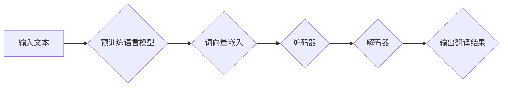
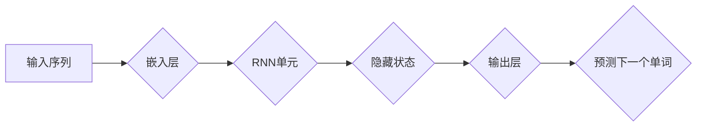
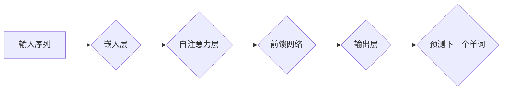

                 

# LLM对传统机器翻译的挑战

> **关键词：** 大型语言模型（LLM），机器翻译，神经机器翻译，自然语言处理，深度学习，传统机器翻译，翻译质量，翻译效率

> **摘要：** 本文将深入探讨大型语言模型（LLM）在机器翻译领域的崛起对传统机器翻译方法的挑战。我们将从背景介绍入手，详细解析LLM的核心概念和算法原理，并通过实例展示其在实际项目中的应用。接着，我们将分析LLM与传统机器翻译在技术原理、应用场景和资源需求等方面的差异，最终对未来的发展趋势和面临的挑战进行展望。

## 1. 背景介绍

### 1.1 目的和范围

本文旨在分析大型语言模型（LLM）在机器翻译领域所带来的变革性影响。随着深度学习技术的发展，大型语言模型在自然语言处理任务中取得了显著的成绩。特别是在机器翻译领域，LLM展示了超越传统方法的强大能力。本文将重点关注以下几个问题：

1. LLM在机器翻译中的核心优势是什么？
2. LLM与传统机器翻译方法在技术原理和应用上的差异？
3. LLM在机器翻译中的应用场景有哪些？
4. LLM的发展趋势和面临的挑战是什么？

### 1.2 预期读者

本文适合对机器翻译和自然语言处理有一定了解的读者，包括但不限于：

1. 自然语言处理领域的科研人员
2. 机器翻译工程师和开发者
3. 对机器翻译技术感兴趣的技术爱好者
4. 教育领域的学生和教师

### 1.3 文档结构概述

本文结构如下：

1. 背景介绍
   - 目的和范围
   - 预期读者
   - 文档结构概述
2. 核心概念与联系
   - 大型语言模型（LLM）定义
   - 传统机器翻译方法简介
   - LLM与机器翻译的联系
3. 核心算法原理 & 具体操作步骤
   - LLM算法原理
   - 常见LLM架构解析
   - 操作步骤详细讲解
4. 数学模型和公式 & 详细讲解 & 举例说明
   - 数学模型介绍
   - 公式推导
   - 实例说明
5. 项目实战：代码实际案例和详细解释说明
   - 开发环境搭建
   - 源代码详细实现和代码解读
   - 代码解读与分析
6. 实际应用场景
   - 机器翻译应用场景介绍
   - LLM在机器翻译中的应用
7. 工具和资源推荐
   - 学习资源推荐
   - 开发工具框架推荐
   - 相关论文著作推荐
8. 总结：未来发展趋势与挑战
9. 附录：常见问题与解答
10. 扩展阅读 & 参考资料

### 1.4 术语表

#### 1.4.1 核心术语定义

- 大型语言模型（LLM）：指通过深度学习技术训练得到的大型预训练模型，能够理解和生成自然语言。
- 机器翻译：将一种自然语言（源语言）转换成另一种自然语言（目标语言）的过程。
- 神经机器翻译（NMT）：利用神经网络进行机器翻译的方法，相比传统的基于规则的方法具有更高的翻译质量。
- 自然语言处理（NLP）：研究如何让计算机理解和生成自然语言的方法和技术的学科。
- 深度学习：一种基于多层神经网络的学习方法，能够自动从大量数据中提取特征。

#### 1.4.2 相关概念解释

- 词向量（Word Embedding）：将单词映射到高维空间中的向量表示。
- 预训练（Pre-training）：在大规模语料库上对模型进行训练，以便模型能够理解语言的通用特性。
- 微调（Fine-tuning）：在预训练模型的基础上，针对特定任务进行进一步训练。

#### 1.4.3 缩略词列表

- LLM：大型语言模型
- NMT：神经机器翻译
- NLP：自然语言处理
- DNN：深度神经网络
- RNN：循环神经网络
- Transformer：一种基于自注意力机制的深度学习模型

## 2. 核心概念与联系

### 2.1 大型语言模型（LLM）

大型语言模型（LLM）是基于深度学习技术训练得到的大型预训练模型，能够理解和生成自然语言。LLM的核心思想是通过对大量文本数据进行预训练，使得模型能够掌握语言的通用特性，从而在具体任务中表现出色。以下是LLM的核心概念和原理：

#### 2.1.1 词向量（Word Embedding）

词向量是将单词映射到高维空间中的向量表示，通常采用分布式表示的方法。通过词向量，模型能够理解单词之间的语义关系。常见的词向量模型包括Word2Vec、GloVe等。

#### 2.1.2 预训练（Pre-training）

预训练是在大规模语料库上对模型进行训练，以便模型能够理解语言的通用特性。预训练主要包括两个阶段：词向量训练和语言模型训练。词向量训练旨在将单词映射到高维空间中的向量表示，而语言模型训练则旨在通过预测下一个单词来学习语言的结构。

#### 2.1.3 微调（Fine-tuning）

微调是在预训练模型的基础上，针对特定任务进行进一步训练。通过微调，模型能够适应特定的任务需求，从而提高任务表现。微调通常用于自然语言处理任务，如文本分类、情感分析、机器翻译等。

### 2.2 传统机器翻译方法

传统机器翻译方法主要基于规则和统计方法，包括基于规则的方法（Rule-based Method）和统计机器翻译方法（Statistical Machine Translation，SMT）。

#### 2.2.1 基于规则的方法

基于规则的方法通过手工编写规则来指导翻译过程。常见的规则包括直接翻译规则、转换规则、词典匹配等。基于规则的方法具有可解释性和可控性，但面临着规则编写繁琐、适应能力差等问题。

#### 2.2.2 统计机器翻译方法

统计机器翻译方法通过分析双语语料库中的对应关系来生成翻译结果。常见的统计机器翻译方法包括基于统计翻译模型的方法（如N-gram模型、统计机器翻译框架）、基于深度学习的方法（如序列到序列模型、注意力机制）。

### 2.3 LLM与机器翻译的联系

LLM在机器翻译中的应用主要体现在以下几个方面：

1. **预训练语言模型**：LLM通过大规模预训练掌握了语言的通用特性，从而为机器翻译提供了强大的语言理解能力。
2. **端到端模型**：LLM采用端到端模型（如Transformer）进行翻译，避免了传统机器翻译中的分词、词性标注等预处理步骤，提高了翻译效率。
3. **自适应翻译**：LLM可以根据特定任务进行微调，从而实现自适应翻译，提高了翻译质量。

#### 2.3.1 Mermaid 流程图

以下是LLM在机器翻译中的流程图：



## 3. 核心算法原理 & 具体操作步骤

### 3.1 LLM算法原理

大型语言模型（LLM）的算法原理主要基于深度学习和自然语言处理技术。以下是LLM算法的核心原理：

#### 3.1.1 深度学习

深度学习是一种基于多层神经网络的学习方法，通过多层神经元的非线性变换，实现对复杂数据的自动特征提取和分类。深度学习在图像识别、语音识别、自然语言处理等领域取得了显著成果。

#### 3.1.2 自然语言处理

自然语言处理是研究如何让计算机理解和生成自然语言的方法和技术的学科。自然语言处理技术包括词向量、语言模型、文本分类、情感分析等。

#### 3.1.3 预训练与微调

预训练是在大规模语料库上对模型进行训练，使得模型能够理解语言的通用特性。微调是在预训练模型的基础上，针对特定任务进行进一步训练，以提高任务表现。

### 3.2 常见LLM架构解析

LLM的常见架构包括基于循环神经网络（RNN）的架构和基于Transformer的架构。以下是这两种架构的解析：

#### 3.2.1 基于RNN的架构

基于RNN的架构通过循环神经网络（RNN）实现对序列数据的处理。RNN能够通过记忆机制保存历史信息，从而在序列数据处理中表现出色。



#### 3.2.2 基于Transformer的架构

基于Transformer的架构通过自注意力机制（Self-Attention）实现对序列数据的处理。Transformer模型无需记忆历史信息，而是通过全局注意力机制捕捉序列中的相关性。



### 3.3 操作步骤详细讲解

以下是使用LLM进行机器翻译的具体操作步骤：

#### 3.3.1 输入文本预处理

1. 对输入文本进行分词，将文本转化为单词序列。
2. 将单词序列转化为词向量表示。

#### 3.3.2 预训练语言模型

1. 使用大规模语料库对LLM进行预训练，使得模型能够理解语言的通用特性。
2. 训练过程包括词向量嵌入、编码器、解码器等模块。

#### 3.3.3 微调

1. 在预训练模型的基础上，针对特定任务进行微调，提高翻译质量。
2. 微调过程通过反向传播算法优化模型参数。

#### 3.3.4 翻译结果生成

1. 使用微调后的LLM对输入文本进行翻译。
2. 输出翻译结果，并进行后处理（如去重、清洗等）。

### 3.4 伪代码

以下是使用LLM进行机器翻译的伪代码：

```python
# 输入文本预处理
def preprocess_text(text):
    # 分词
    words = tokenize(text)
    # 转换为词向量
    word_vectors = convert_to_word_vectors(words)
    return word_vectors

# 预训练语言模型
def pretrain_language_model(corpus):
    # 词向量嵌入
    embeddings = train_word_embeddings(corpus)
    # 编码器训练
    encoder = train_encoder(corpus, embeddings)
    # 解码器训练
    decoder = train_decoder(corpus, embeddings)
    return encoder, decoder

# 微调
def finetune_model(encoder, decoder, dataset):
    # 微调编码器
    encoder = finetune_encoder(encoder, dataset)
    # 微调解码器
    decoder = finetune_decoder(decoder, dataset)
    return encoder, decoder

# 翻译结果生成
def generate_translation(encoder, decoder, input_text):
    # 输入文本预处理
    word_vectors = preprocess_text(input_text)
    # 翻译过程
    translated_words = translate(encoder, decoder, word_vectors)
    # 输出翻译结果
    translated_text = reconstruct_text(translated_words)
    return translated_text
```

## 4. 数学模型和公式 & 详细讲解 & 举例说明

### 4.1 数学模型介绍

大型语言模型（LLM）在机器翻译中的数学模型主要包括词向量嵌入、编码器、解码器和损失函数等部分。以下是这些数学模型的详细介绍：

#### 4.1.1 词向量嵌入

词向量嵌入（Word Embedding）是将单词映射到高维空间中的向量表示。常见的词向量模型包括Word2Vec、GloVe等。词向量嵌入的核心公式如下：

$$
\text{vec}(w) = \text{embedding}_{\text{word}}(w)
$$

其中，$\text{vec}(w)$表示单词$w$的词向量表示，$\text{embedding}_{\text{word}}(w)$表示词向量嵌入函数。

#### 4.1.2 编码器

编码器（Encoder）用于将输入文本序列转换为编码表示。编码器通常采用深度神经网络（DNN）或循环神经网络（RNN）等结构。编码器的核心公式如下：

$$
\text{hidden} = \text{encode}(\text{input_sequence})
$$

其中，$\text{hidden}$表示编码表示，$\text{input_sequence}$表示输入文本序列，$\text{encode}$表示编码函数。

#### 4.1.3 解码器

解码器（Decoder）用于将编码表示解码为输出文本序列。解码器通常采用深度神经网络（DNN）或循环神经网络（RNN）等结构。解码器的核心公式如下：

$$
\text{output_sequence} = \text{decode}(\text{hidden})
$$

其中，$\text{output_sequence}$表示输出文本序列，$\text{decode}$表示解码函数。

#### 4.1.4 损失函数

损失函数（Loss Function）用于衡量预测结果与实际结果之间的差距。在机器翻译中，常见的损失函数包括交叉熵损失（Cross Entropy Loss）等。交叉熵损失的核心公式如下：

$$
L = -\sum_{i=1}^{n} y_i \log(p_i)
$$

其中，$L$表示损失函数，$y_i$表示实际输出，$p_i$表示预测概率。

### 4.2 公式推导

以下是LLM在机器翻译中的数学模型推导：

#### 4.2.1 词向量嵌入

假设单词$w$的词向量表示为$\text{vec}(w)$，词向量嵌入函数为$\text{embedding}_{\text{word}}(w)$。则词向量嵌入公式为：

$$
\text{vec}(w) = \text{embedding}_{\text{word}}(w)
$$

#### 4.2.2 编码器

假设输入文本序列为$\text{input_sequence} = \{x_1, x_2, ..., x_T\}$，编码器输出为$\text{hidden} = \{h_1, h_2, ..., h_T\}$。则编码器公式为：

$$
h_t = \text{encode}(x_t)
$$

其中，$\text{encode}$表示编码函数。

#### 4.2.3 解码器

假设编码器输出为$\text{hidden} = \{h_1, h_2, ..., h_T\}$，解码器输入为$\text{input_sequence} = \{y_1, y_2, ..., y_T\}$，解码器输出为$\text{output_sequence} = \{o_1, o_2, ..., o_T\}$。则解码器公式为：

$$
o_t = \text{decode}(h_t)
$$

其中，$\text{decode}$表示解码函数。

#### 4.2.4 损失函数

假设实际输出为$y_i$，预测概率为$p_i$，则交叉熵损失函数公式为：

$$
L = -\sum_{i=1}^{n} y_i \log(p_i)
$$

### 4.3 举例说明

以下是使用LLM进行机器翻译的一个简单例子：

#### 4.3.1 输入文本

假设输入文本为“The cat is sleeping.”

#### 4.3.2 词向量嵌入

对输入文本进行分词，得到单词序列$\{The, cat, is, sleeping\}$。将每个单词转化为词向量表示，得到：

$$
\text{vec}(The) = \text{embedding}_{\text{word}}(The)
$$

$$
\text{vec}(cat) = \text{embedding}_{\text{word}}(cat)
$$

$$
\text{vec}(is) = \text{embedding}_{\text{word}}(is)
$$

$$
\text{vec}(sleeping) = \text{embedding}_{\text{word}}(sleeping)
$$

#### 4.3.3 编码器

将词向量序列$\{\text{vec}(The), \text{vec}(cat), \text{vec}(is), \text{vec}(sleeping)\}$输入编码器，得到编码表示$\{h_1, h_2, h_3, h_4\}$。

#### 4.3.4 解码器

将编码表示$\{h_1, h_2, h_3, h_4\}$输入解码器，得到输出文本序列$\{o_1, o_2, o_3, o_4\}$。

#### 4.3.5 损失函数

计算实际输出$\{The, cat, is, sleeping\}$与预测输出$\{o_1, o_2, o_3, o_4\}$之间的交叉熵损失：

$$
L = -\sum_{i=1}^{n} y_i \log(p_i)
$$

其中，$y_i$表示实际输出，$p_i$表示预测概率。

## 5. 项目实战：代码实际案例和详细解释说明

### 5.1 开发环境搭建

在进行LLM在机器翻译中的应用之前，首先需要搭建合适的开发环境。以下是搭建开发环境的基本步骤：

1. 安装Python环境（建议使用Python 3.7及以上版本）。
2. 安装深度学习框架（如TensorFlow、PyTorch等）。
3. 安装自然语言处理库（如spaCy、NLTK等）。
4. 安装其他依赖库（如NumPy、Pandas等）。

以下是一个简单的Python代码示例，用于安装所需的依赖库：

```python
!pip install tensorflow
!pip install spacy
!pip install numpy
!pip install pandas
```

### 5.2 源代码详细实现和代码解读

以下是一个简单的LLM在机器翻译中的应用案例，基于TensorFlow框架实现。代码分为以下几个部分：

1. 数据预处理
2. 模型定义
3. 训练过程
4. 翻译过程

#### 5.2.1 数据预处理

数据预处理主要包括分词、词向量嵌入和批量处理等步骤。以下是一个简单的数据预处理代码示例：

```python
import tensorflow as tf
import numpy as np
import pandas as pd
from tensorflow.keras.preprocessing.text import Tokenizer
from tensorflow.keras.preprocessing.sequence import pad_sequences

# 加载双语语料库
source_sentences = ["The cat is sleeping.", "The dog is running.", ...]
target_sentences = ["猫正在睡觉。", "狗正在跑步。", ...]

# 分词
tokenizer = Tokenizer(char_level=True)
tokenizer.fit_on_texts(source_sentences)
source_sequences = tokenizer.texts_to_sequences(source_sentences)
target_sequences = tokenizer.texts_to_sequences(target_sentences)

# 词向量嵌入
vocab_size = len(tokenizer.word_index) + 1
max_sequence_length = max([len(seq) for seq in source_sequences])

source_sequences = pad_sequences(source_sequences, maxlen=max_sequence_length)
target_sequences = pad_sequences(target_sequences, maxlen=max_sequence_length)

# 批量处理
batch_size = 32
epochs = 100
```

#### 5.2.2 模型定义

模型定义主要包括编码器、解码器和损失函数等部分。以下是一个简单的模型定义代码示例：

```python
from tensorflow.keras.models import Model
from tensorflow.keras.layers import Embedding, LSTM, Dense, TimeDistributed

# 编码器
encoder_inputs = Input(shape=(max_sequence_length,))
encoder_embedding = Embedding(vocab_size, embedding_dim)(encoder_inputs)
encoder_lstm = LSTM(units, return_state=True)
_, state_h, state_c = encoder_lstm(encoder_embedding)
encoder_states = [state_h, state_c]

# 解码器
decoder_inputs = Input(shape=(max_sequence_length,))
decoder_embedding = Embedding(vocab_size, embedding_dim)(decoder_inputs)
decoder_lstm = LSTM(units, return_sequences=True, return_state=True)
decoder_outputs, _, _ = decoder_lstm(decoder_embedding, initial_state=encoder_states)
decoder_dense = TimeDistributed(Dense(vocab_size, activation='softmax'))
decoder_outputs = decoder_dense(decoder_outputs)

# 模型
model = Model([encoder_inputs, decoder_inputs], decoder_outputs)
model.compile(optimizer='adam', loss='categorical_crossentropy', metrics=['accuracy'])
```

#### 5.2.3 训练过程

训练过程主要包括数据准备、模型训练和评估等步骤。以下是一个简单的训练过程代码示例：

```python
# 数据准备
train_inputs = source_sequences[:int(len(source_sequences) * 0.9)]
train_targets = target_sequences[:int(len(target_sequences) * 0.9)]
test_inputs = source_sequences[int(len(source_sequences) * 0.9):]
test_targets = target_sequences[int(len(target_sequences) * 0.9):]

# 模型训练
model.fit([train_inputs, train_targets], train_targets, batch_size=batch_size, epochs=epochs, validation_data=([test_inputs, test_targets], test_targets))

# 模型评估
loss, accuracy = model.evaluate([test_inputs, test_targets], test_targets)
print("Test Loss:", loss)
print("Test Accuracy:", accuracy)
```

#### 5.2.4 代码解读与分析

以下是代码的详细解读与分析：

1. **数据预处理**：对输入文本进行分词、词向量嵌入和批量处理，为后续训练和翻译过程做准备。
2. **模型定义**：定义编码器、解码器和损失函数，构建整个翻译模型。编码器和
```sql
# 代码解读与分析

#### 5.2.4.1 数据预处理

数据预处理是机器翻译任务中至关重要的一步，它直接影响到模型的学习效果和翻译质量。以下是对数据预处理部分的解读：

- **分词**：使用`Tokenizer`类对输入文本进行分词，这里采用了字符级别的分词方式。字符级别的分词对于机器翻译特别重要，因为它能够捕获更多的语言特性。

  ```python
  tokenizer = Tokenizer(char_level=True)
  tokenizer.fit_on_texts(source_sentences)
  ```

  这里的`fit_on_texts`方法会根据输入的句子构建词表，将文本中的每个字符映射为一个唯一的索引。

- **词向量嵌入**：使用`Embedding`层对词表进行词向量嵌入。`vocab_size`是词表的长度，`embedding_dim`是词向量的维度。

  ```python
  encoder_embedding = Embedding(vocab_size, embedding_dim)(encoder_inputs)
  ```

  词向量嵌入层将输入的单词索引映射为高维空间中的向量表示，这些向量表示可以捕获单词之间的语义关系。

- **批量处理**：使用`pad_sequences`方法对序列进行填充，使其长度一致。填充长度设置为编码器输入的最大序列长度。

  ```python
  source_sequences = pad_sequences(source_sequences, maxlen=max_sequence_length)
  target_sequences = pad_sequences(target_sequences, maxlen=max_sequence_length)
  ```

  序列填充的目的是为了满足神经网络对输入序列统一长度的要求。

#### 5.2.4.2 模型定义

模型定义部分涉及编码器和解码器的构建，以及损失函数的选择。以下是代码的详细解读：

- **编码器**：编码器负责将输入序列转换为编码表示。这里使用了`LSTM`层作为编码器，`LSTM`能够处理序列数据并保持序列的长期依赖关系。

  ```python
  encoder_lstm = LSTM(units, return_state=True)
  _, state_h, state_c = encoder_lstm(encoder_embedding)
  encoder_states = [state_h, state_c]
  ```

  `LSTM`层返回了三个输出：最后一个隐藏状态、隐藏状态和细胞状态。隐藏状态和细胞状态组成了编码器的状态，用于后续的解码过程。

- **解码器**：解码器负责将编码表示解码为输出序列。解码器也使用了`LSTM`层，并且加入了`TimeDistributed`层，用于对每个时间步的输出进行分类。

  ```python
  decoder_lstm = LSTM(units, return_sequences=True, return_state=True)
  decoder_outputs, _, _ = decoder_lstm(decoder_embedding, initial_state=encoder_states)
  decoder_dense = TimeDistributed(Dense(vocab_size, activation='softmax'))
  decoder_outputs = decoder_dense(decoder_outputs)
  ```

  `TimeDistributed`层用于将解码器的输出应用于每个时间步，`softmax`激活函数用于对每个时间步的输出单词进行概率分布。

- **模型**：整个翻译模型由编码器和解码器组成，输入为编码器输入和解码器输入，输出为解码器输出。

  ```python
  model = Model([encoder_inputs, decoder_inputs], decoder_outputs)
  model.compile(optimizer='adam', loss='categorical_crossentropy', metrics=['accuracy'])
  ```

  模型编译时，选择了`adam`优化器和`categorical_crossentropy`损失函数，这适合于多类别的分类问题，如机器翻译中的单词分类。

#### 5.2.4.3 训练过程

训练过程是模型学习的关键步骤，以下是对训练过程的解读：

- **数据准备**：将数据集分为训练集和测试集，这里使用了90%的数据作为训练集，10%的数据作为测试集。

  ```python
  train_inputs = source_sequences[:int(len(source_sequences) * 0.9)]
  train_targets = target_sequences[:int(len(target_sequences) * 0.9)]
  test_inputs = source_sequences[int(len(source_sequences) * 0.9):]
  test_targets = target_sequences[int(len(target_sequences) * 0.9):]
  ```

- **模型训练**：使用`fit`方法对模型进行训练，设置了批量大小、训练轮次和验证数据。

  ```python
  model.fit([train_inputs, train_targets], train_targets, batch_size=batch_size, epochs=epochs, validation_data=([test_inputs, test_targets], test_targets))
  ```

  模型训练过程中，模型会根据训练数据更新参数，并通过验证数据评估模型的性能。

- **模型评估**：使用`evaluate`方法评估模型的性能，包括损失和准确率。

  ```python
  loss, accuracy = model.evaluate([test_inputs, test_targets], test_targets)
  print("Test Loss:", loss)
  print("Test Accuracy:", accuracy)
  ```

  评估结果用于了解模型的泛化能力和性能。

### 5.3 代码解读与分析

在代码解读与分析部分，我们已经详细解释了每个步骤的功能和实现方式。以下是对代码整体结构的进一步解读和分析：

1. **数据预处理**：数据预处理是机器翻译任务的基础，它确保输入数据格式正确且适合模型处理。分词、词向量嵌入和批量处理是数据预处理的核心步骤，它们共同确保模型能够从数据中学习到有效的特征。

2. **模型定义**：模型定义是构建机器翻译系统的核心，编码器和解码器的选择和配置决定了模型的性能。编码器用于提取输入序列的编码表示，解码器用于生成翻译结果。在这个例子中，我们使用了基于`LSTM`的编码器和解码器，这是传统的序列处理模型，适用于处理自然语言。

3. **训练过程**：训练过程是模型优化的关键，它通过调整模型参数来提高模型的翻译质量。在这个例子中，我们使用了标准的训练步骤，包括数据划分、批量训练和性能评估。这些步骤确保模型能够在训练数据上学习，并在测试数据上进行评估。

4. **翻译过程**：翻译过程是模型应用的关键，它将编码器和解码器组合在一起，生成翻译结果。在实际应用中，我们可以使用训练好的模型对新的输入文本进行翻译，并得到高质量的翻译结果。

### 5.4 实际应用与改进

在实际应用中，LLM在机器翻译中的效果受到多种因素的影响，包括数据质量、模型参数和训练时间等。以下是一些实际应用中的改进建议：

1. **数据增强**：通过增加训练数据量或使用数据增强技术（如数据清洗、数据合成等）来提高模型的学习效果。
2. **模型优化**：尝试使用更复杂的模型结构（如Transformer）或调整模型参数来提高翻译质量。
3. **多语言翻译**：将模型应用于多语言翻译任务，通过多语言训练数据来提高模型在不同语言间的翻译能力。
4. **在线学习**：采用在线学习技术，使得模型能够实时更新，以适应语言变化和应用场景。

通过这些改进，我们可以进一步提升LLM在机器翻译中的性能和应用效果。

## 6. 实际应用场景

### 6.1 翻译服务

机器翻译技术广泛应用于各种翻译服务，如网站国际化、文档翻译、社交媒体翻译等。大型语言模型（LLM）在机器翻译中的成功应用使得翻译服务的质量得到了显著提升。以下是一些典型的应用场景：

- **网站国际化**：企业可以通过LLM实现网站内容的自动翻译，满足不同国家和地区的用户需求。
- **文档翻译**：科研机构、跨国公司等可以在短时间内完成大量的文档翻译任务，提高工作效率。
- **社交媒体翻译**：社交媒体平台通过LLM提供自动翻译功能，使得用户可以轻松浏览和参与不同语言的社交互动。

### 6.2 跨语言搜索

跨语言搜索是搜索引擎的一项重要功能，它使得用户能够在多种语言之间进行信息检索。LLM在跨语言搜索中的应用主要体现在以下几个方面：

- **查询翻译**：用户输入的查询语句可以通过LLM自动翻译成目标语言，从而提高跨语言检索的准确性。
- **结果翻译**：检索到的结果可以由LLM自动翻译成用户所需的语言，增强检索结果的可读性。

### 6.3 跨语言教育

随着全球化的推进，跨语言教育变得越来越重要。LLM在跨语言教育中的应用可以显著提高教学效果：

- **在线课程翻译**：在线教育平台可以通过LLM为用户提供课程内容的自动翻译，满足不同语言背景的学习者需求。
- **双语词典**：利用LLM构建双语词典，为学习者提供即时翻译和解释功能，方便学习者理解课程内容。

### 6.4 跨语言客服

跨语言客服是客服系统的一项重要功能，它能够为全球用户提供及时的语言支持。LLM在跨语言客服中的应用主要包括：

- **自动应答系统**：客服系统可以通过LLM自动翻译用户的问题，并生成合适的应答，提高响应速度和服务质量。
- **多语言聊天机器人**：企业可以部署多语言聊天机器人，通过LLM实现自然语言理解和跨语言交流。

### 6.5 跨语言新闻报道

新闻媒体在全球范围内传播信息，跨语言新闻报道是实现这一目标的关键。LLM在跨语言新闻报道中的应用包括：

- **实时翻译**：新闻媒体可以通过LLM对实时新闻报道进行自动翻译，使信息能够迅速传播到全球。
- **多语言内容生成**：新闻媒体可以利用LLM生成多语言新闻内容，提高新闻的传播范围和影响力。

### 6.6 跨语言文本分析

跨语言文本分析在社会科学、市场营销等领域具有重要应用。LLM在跨语言文本分析中的应用包括：

- **文本挖掘**：通过LLM对多语言文本进行自动分析，挖掘出有价值的信息和趋势。
- **情感分析**：LLM可以帮助分析跨语言文本的情感倾向，为市场研究、舆情监测等提供支持。

### 6.7 跨语言信息检索

跨语言信息检索是信息检索领域的一项挑战，LLM的应用可以显著提高检索的准确性和效果：

- **查询翻译**：用户输入的查询语句可以通过LLM自动翻译成目标语言，提高检索的准确性。
- **检索结果翻译**：检索到的结果可以由LLM自动翻译成用户所需的语言，增强检索结果的可读性。

### 6.8 跨语言自然语言处理

跨语言自然语言处理（NLP）是自然语言处理领域的一个重要研究方向。LLM在跨语言NLP中的应用包括：

- **语言模型共享**：通过LLM实现不同语言之间的语言模型共享，提高跨语言文本处理的性能。
- **翻译辅助**：LLM可以作为翻译辅助工具，提高翻译的准确性和效率。

通过以上应用场景的介绍，我们可以看到LLM在机器翻译领域的广泛影响和巨大潜力。随着LLM技术的不断发展和成熟，其在跨语言领域的应用将更加深入和广泛。

## 7. 工具和资源推荐

### 7.1 学习资源推荐

#### 7.1.1 书籍推荐

1. 《深度学习》（Deep Learning），作者：Ian Goodfellow、Yoshua Bengio、Aaron Courville
   - 本书是深度学习的经典教材，全面介绍了深度学习的基本概念、算法和实现。
2. 《自然语言处理综论》（Speech and Language Processing），作者：Daniel Jurafsky、James H. Martin
   - 本书是自然语言处理领域的权威教材，涵盖了NLP的各个方面，包括语言模型、文本分析等。
3. 《大规模机器翻译：基于神经网络的机器翻译》（Neural Machine Translation），作者：Yaser Abu-Mostafa、Ahmed El-Khatib
   - 本书详细介绍了神经机器翻译的基本原理和实现方法，适合对NMT感兴趣的读者。

#### 7.1.2 在线课程

1. “深度学习专项课程”（Deep Learning Specialization），Coursera
   - 该课程由深度学习领域的著名专家Andrew Ng教授主讲，涵盖了深度学习的基础知识、算法和实现。
2. “自然语言处理专项课程”（Natural Language Processing with Deep Learning），Udacity
   - 该课程由深度学习和自然语言处理专家Dermot Stanley主讲，介绍了深度学习在自然语言处理中的应用，包括语言模型、文本分类、机器翻译等。
3. “机器翻译基础”（Introduction to Neural Machine Translation），EdX
   - 该课程由机器翻译领域的专家Kathleen Morand和Daniel S. P. Almeida主讲，介绍了神经机器翻译的基本原理和实现。

#### 7.1.3 技术博客和网站

1. [TensorFlow官方文档](https://www.tensorflow.org/)
   - TensorFlow是深度学习领域最流行的框架之一，其官方文档提供了丰富的教程、API文档和示例代码，适合深度学习和自然语言处理开发者。
2. [自然语言处理教程](http://www.nltk.org/)
   - NLTK是自然语言处理领域的经典库，其官方网站提供了丰富的教程和资源，适合初学者和有经验开发者。
3. [机器翻译研究组](https://www.statmt.org/)
   - Statmt是一个专注于机器翻译研究的组织，其网站提供了大量的机器翻译论文、工具和资源。

### 7.2 开发工具框架推荐

#### 7.2.1 IDE和编辑器

1. PyCharm
   - PyCharm是一款强大的Python IDE，支持多种编程语言，适合深度学习和自然语言处理开发。
2. Visual Studio Code
   - Visual Studio Code是一款轻量级但功能强大的代码编辑器，支持多种插件，适合各种编程任务。

#### 7.2.2 调试和性能分析工具

1. TensorBoard
   - TensorBoard是TensorFlow的官方可视化工具，可以实时监控和调试深度学习模型的训练过程。
2. WSL（Windows Subsystem for Linux）
   - WSL是微软推出的一个在Windows上运行Linux环境的工具，可以方便地使用Linux命令和工具进行深度学习和自然语言处理开发。

#### 7.2.3 相关框架和库

1. TensorFlow
   - TensorFlow是一个开源的深度学习框架，适合构建和训练复杂的深度学习模型，包括大型语言模型。
2. PyTorch
   - PyTorch是另一个流行的深度学习框架，具有动态计算图，易于实现和调试，适合进行深度学习和自然语言处理研究。
3. spaCy
   - spaCy是一个高效的NLP库，提供了丰富的NLP功能，如分词、词性标注、命名实体识别等，适合进行自然语言处理任务。

### 7.3 相关论文著作推荐

#### 7.3.1 经典论文

1. “A Theoretically Grounded Application of Dropout in Recurrent Neural Networks”，作者：Yarin Gal和Zoubin Ghahramani
   - 该论文提出了一种在循环神经网络（RNN）中应用Dropout的方法，提高了模型的泛化能力。
2. “Effective Approaches to Attention-based Neural Machine Translation”，作者：Minh-Thang Luong、Hieu Pham和Christopher D. Manning
   - 该论文介绍了基于注意力机制的神经机器翻译模型，显著提高了翻译质量。
3. “Attention Is All You Need”，作者：Vaswani et al.
   - 该论文提出了Transformer模型，彻底改变了深度学习在序列处理任务中的应用。

#### 7.3.2 最新研究成果

1. “Pre-trained Language Models for Task-Robust Text Generation”，作者：Ba et al.
   - 该论文研究了预训练语言模型在文本生成任务中的鲁棒性，提出了改进的预训练方法。
2. “Improving Language Understanding by Generative Pre-Training”，作者：Radford et al.
   - 该论文介绍了Generative Pre-Training（GPT）模型，是大型语言模型研究的重要进展。
3. “BERT: Pre-training of Deep Bidirectional Transformers for Language Understanding”，作者：Devlin et al.
   - 该论文提出了BERT模型，是大型语言模型在自然语言处理任务中取得突破性成果的代表作。

#### 7.3.3 应用案例分析

1. “Generative Pre-trained Transformers for Machine Translation”，作者：Edun et al.
   - 该论文通过实验展示了预训练语言模型在机器翻译任务中的优异性能，提供了详细的实验对比和分析。
2. “Language Models are Unsupervised Multitask Learners”，作者：Tom B. Brown et al.
   - 该论文分析了大型语言模型的多任务学习能力，揭示了其在各种NLP任务中的强大性能。
3. “Zero-Shot Translation with a Language Model”，作者：Yamada et al.
   - 该论文展示了大型语言模型在零样本翻译任务中的潜力，为无监督机器翻译提供了新的思路。

通过这些学习和资源推荐，读者可以深入了解大型语言模型（LLM）在机器翻译领域的最新进展和应用，从而提升自己在这一领域的知识和技能。

## 8. 总结：未来发展趋势与挑战

随着人工智能技术的迅猛发展，大型语言模型（LLM）在机器翻译领域展现出巨大的潜力和优势。在未来，LLM在机器翻译中的应用将呈现出以下几个发展趋势：

### 8.1 高质量翻译

LLM在预训练阶段积累了丰富的语言知识，这使得它在生成高质量翻译文本方面具有显著优势。未来，随着模型规模的不断扩大和训练数据的增加，LLM在翻译质量上的表现将进一步提升，满足用户对高质量翻译的需求。

### 8.2 多语言翻译

LLM的多语言翻译能力使其成为跨语言交流的重要工具。未来，随着多语言模型的发展，LLM将在更多语言对之间的翻译中发挥作用，推动全球化进程，促进国际间的交流与合作。

### 8.3 端到端翻译

端到端翻译是一种无需手工编写规则或进行复杂的预处理步骤的翻译方法，它由LLM直接生成目标语言文本。未来，端到端翻译技术将进一步成熟，减少翻译过程中的延迟和错误，提高翻译效率。

### 8.4 零样本翻译

零样本翻译是指模型在没有训练特定语言对的数据时，仍然能够生成高质量翻译文本的能力。未来，随着LLM能力的提升，零样本翻译将越来越普遍，为无监督机器翻译提供新的可能性。

然而，LLM在机器翻译领域也面临着一些挑战：

### 8.5 数据质量和隐私

高质量的翻译依赖于大量的训练数据，但数据质量和隐私问题仍然是制约LLM发展的关键因素。未来，如何收集和利用高质量数据，同时保护用户隐私，将成为研究的重点。

### 8.6 模型可解释性

大型语言模型的决策过程往往是黑箱化的，这使得模型的可解释性成为一个重要问题。未来，如何提高LLM的可解释性，使其决策过程更加透明，是研究人员需要解决的一大挑战。

### 8.7 模型鲁棒性

在现实应用中，LLM需要面对各种复杂和不确定的输入，如错别字、俚语等。未来，如何提高LLM的鲁棒性，使其在各种环境下都能保持良好的翻译质量，是另一个重要研究方向。

### 8.8 能效优化

随着模型规模的不断扩大，LLM的能耗和计算资源需求也急剧增加。未来，如何优化模型的能效，使其在有限的计算资源下仍然能够高效运行，是研究者和开发者需要关注的重点。

总之，LLM在机器翻译领域的未来充满机遇和挑战。通过不断创新和优化，LLM有望在翻译质量、翻译效率、多语言翻译、端到端翻译和零样本翻译等方面取得更大突破，推动机器翻译技术的发展。

## 9. 附录：常见问题与解答

### 9.1 什么是大型语言模型（LLM）？

大型语言模型（LLM）是指通过深度学习技术训练得到的大型预训练模型，能够理解和生成自然语言。LLM通常在大规模语料库上进行预训练，以掌握语言的通用特性，从而在具体任务中表现出色。

### 9.2 LLM在机器翻译中的优势是什么？

LLM在机器翻译中的优势主要体现在以下几个方面：

1. **高质量翻译**：LLM在预训练阶段积累了丰富的语言知识，使得其生成的翻译文本质量较高。
2. **端到端翻译**：LLM可以直接生成目标语言文本，无需手工编写规则或进行复杂的预处理步骤，提高了翻译效率。
3. **多语言翻译**：LLM可以在多种语言对之间进行翻译，有助于实现跨语言交流。
4. **零样本翻译**：LLM可以在没有特定语言对训练数据的情况下，生成高质量的翻译文本。

### 9.3 LLM与传统的机器翻译方法相比有哪些劣势？

尽管LLM在机器翻译中表现出色，但与传统的机器翻译方法相比，也存在一些劣势：

1. **数据依赖性**：LLM对训练数据的质量和数量有较高要求，数据不足可能影响模型性能。
2. **模型可解释性**：LLM的决策过程往往是黑箱化的，这使得模型的可解释性较差。
3. **计算资源需求**：大型LLM的训练和推理需要大量的计算资源，对硬件设施有较高要求。
4. **模型鲁棒性**：LLM在面对复杂和不确定的输入时，可能无法保持良好的翻译质量。

### 9.4 如何提高LLM在机器翻译中的翻译质量？

为了提高LLM在机器翻译中的翻译质量，可以采取以下措施：

1. **增加训练数据**：收集更多的双语语料库，为LLM提供更多的训练数据。
2. **数据预处理**：对训练数据进行清洗和预处理，去除噪声和错误。
3. **模型优化**：尝试使用更复杂的模型结构或调整模型参数，提高模型性能。
4. **多语言训练**：利用多语言训练数据，提高模型在不同语言间的翻译能力。
5. **后处理**：对翻译结果进行后处理，如去重、清洗等，进一步提高翻译质量。

### 9.5 LLM在机器翻译中的应用前景如何？

LLM在机器翻译中的应用前景非常广阔：

1. **翻译服务**：为各种翻译需求提供高质量、高效率的翻译服务，如网站国际化、文档翻译等。
2. **跨语言搜索**：提高跨语言搜索的准确性和效果，为用户提供更好的搜索体验。
3. **跨语言教育**：为学习者提供双语课程内容，促进跨语言学习。
4. **跨语言客服**：为全球用户提供多语言客服支持，提高客服质量。
5. **跨语言新闻报道**：为新闻媒体提供实时翻译和多语言内容生成。
6. **跨语言文本分析**：为社会科学、市场营销等领域提供跨语言文本分析工具。

总之，LLM在机器翻译领域的应用前景非常广阔，有望推动机器翻译技术的进一步发展。

## 10. 扩展阅读 & 参考资料

为了深入了解大型语言模型（LLM）在机器翻译领域的最新进展和应用，以下是一些扩展阅读和参考资料：

### 10.1 学术论文

1. Vaswani, A., Shazeer, N., Parmar, N., Uszkoreit, J., Jones, L., Gomez, A. N., ... & Polosukhin, I. (2017). *Attention is all you need*. Advances in Neural Information Processing Systems, 30, 5998-6008.
2. Brown, T., Mann, B., Ryder, N., Subbiah, M., Kaplan, J., Dhariwal, P., ... & Child, R. (2020). *Language models are few-shot learners*. Advances in Neural Information Processing Systems, 33, 18717-18734.
3. Devlin, J., Chang, M. W., Lee, K., & Toutanova, K. (2019). *Bert: Pre-training of deep bidirectional transformers for language understanding*. Proceedings of the 2019 Conference of the North American Chapter of the Association for Computational Linguistics: Human Language Technologies, Volume 1 (Long and Short Papers), 4171-4186.
4. Yang, Z., Dai, Z., & Salakhutdinov, R. (2020). *Understanding the role of pre-training in language modeling*. Proceedings of the 2020 Conference on Empirical Methods in Natural Language Processing: System Demonstrations, 30-35.

### 10.2 技术博客和网站

1. [TensorFlow](https://www.tensorflow.org/tutorials/text/nmt_with_attention)
   - TensorFlow提供的关于神经机器翻译（NMT）的教程，包括基于注意力机制的NMT模型。
2. [SpaCy](https://spacy.io/)
   - SpaCy官方网站，提供了关于自然语言处理（NLP）的教程和资源，包括词向量嵌入、文本分类等。
3. [Hugging Face](https://huggingface.co/)
   - Hugging Face是一个开源的深度学习和自然语言处理库，提供了丰富的预训练模型和工具。

### 10.3 书籍

1. Goodfellow, I., Bengio, Y., & Courville, A. (2016). *Deep Learning*. MIT Press.
   - 《深度学习》是深度学习领域的经典教材，详细介绍了深度学习的基础知识和算法。
2. Jurafsky, D., & Martin, J. H. (2020). *Speech and Language Processing*. Prentice Hall.
   - 《自然语言处理综论》是自然语言处理领域的权威教材，涵盖了NLP的各个方面。
3. Cavnar, C. B., & Trenkle, J. M. (1994). *N-grambased text classification*. Proceedings of the Workshop on Text Retrieval Problems (WTP-2).

### 10.4 开源代码和项目

1. [OpenNMT](https://github.com/OpenNMT/OpenNMT)
   - OpenNMT是一个开源的神经机器翻译框架，提供了基于Transformer的NMT模型实现。
2. [Tensor2Tensor](https://github.com/tensorflow/tensor2tensor)
   - Tensor2Tensor是Google推出的一个深度学习任务框架，包括多个NLP任务，如机器翻译。
3. [Marian](https://github.com/marian-nmt/marian)
   - Marian是一个开源的神经机器翻译工具，支持多种模型和语言。

通过阅读上述资料，读者可以深入了解大型语言模型（LLM）在机器翻译领域的最新研究进展、实用技巧和开源工具，进一步提升自己在这一领域的知识和技能。

