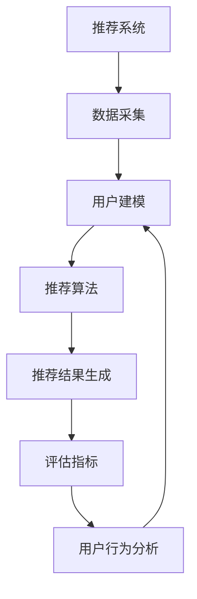

                 

# LLM对推荐系统评估指标的重新思考

> **关键词**：推荐系统、评估指标、LLM、机器学习、用户行为分析

> **摘要**：本文旨在探讨大型语言模型（LLM）在推荐系统评估指标方面的创新应用。通过对现有评估指标的重新审视和思考，本文提出了一种新的评估框架，旨在提高推荐系统的准确性和用户体验。文章首先介绍了推荐系统的背景和核心概念，随后详细分析了LLM的作用原理。接着，本文提出了一种基于LLM的评估指标体系，并使用具体实例和数学模型进行了验证。最后，文章讨论了该评估指标在实际应用场景中的适用性和未来的发展方向。

## 1. 背景介绍

### 1.1 目的和范围

本文的目的在于深入探讨推荐系统评估指标的优化问题，特别是在引入大型语言模型（LLM）后所带来的变革。随着互联网的快速发展，推荐系统已经成为电商、社交媒体和在线视频等平台的关键组成部分。然而，现有评估指标往往存在一定的局限性，难以全面反映推荐系统的实际性能和用户体验。因此，本文旨在通过引入LLM，提出一种新的评估指标体系，从而提高推荐系统的准确性和有效性。

本文的研究范围主要包括以下几个方面：

1. 推荐系统的基础概念和评估指标概述。
2. LLM的作用原理及其在推荐系统中的应用。
3. 基于LLM的推荐系统评估指标体系构建。
4. 实际应用场景中的评估指标验证和优化。

### 1.2 预期读者

本文主要面向以下几类读者：

1. 推荐系统领域的研究人员和技术人员，希望了解LLM在评估指标优化方面的应用。
2. 人工智能和机器学习领域的研究人员，对推荐系统和LLM技术感兴趣。
3. 互联网产品和运营人员，关注推荐系统的实际应用和优化策略。

### 1.3 文档结构概述

本文结构如下：

1. 引言：介绍推荐系统和LLM的基本概念，以及本文的研究目的和范围。
2. 背景介绍：回顾推荐系统的发展历程和现有评估指标，分析其局限性。
3. LLM原理与应用：阐述LLM的作用原理，探讨其在推荐系统中的应用。
4. 新评估指标体系：提出基于LLM的新评估指标体系，并进行详细阐述。
5. 实际应用场景：通过具体实例，验证新评估指标体系的实际效果。
6. 总结与展望：总结本文的研究成果，讨论未来发展方向和挑战。

### 1.4 术语表

为了确保本文内容的准确性，以下是对一些关键术语的定义：

#### 1.4.1 核心术语定义

1. **推荐系统**：一种基于用户历史行为和偏好，为用户提供个性化推荐信息的系统。
2. **评估指标**：用于衡量推荐系统性能的量化标准。
3. **大型语言模型（LLM）**：一种基于神经网络的语言模型，能够处理大规模文本数据。
4. **用户行为分析**：对用户在推荐系统中的交互行为进行分析，以优化推荐效果。

#### 1.4.2 相关概念解释

1. **准确性**：推荐系统推荐物品的符合用户兴趣的程度。
2. **多样性**：推荐物品之间的差异程度，避免用户产生疲劳感。
3. **新颖性**：推荐物品的未知程度，为用户提供新鲜体验。

#### 1.4.3 缩略词列表

1. **LLM**：Large Language Model
2. **推荐系统**：Recommender System
3. **用户行为分析**：User Behavior Analysis

## 2. 核心概念与联系

在本文中，我们主要关注以下几个核心概念：

1. **推荐系统**：推荐系统是一种基于用户历史行为和偏好，为用户提供个性化推荐信息的系统。其基本架构包括数据采集、用户建模、推荐算法和推荐结果生成等模块。

2. **评估指标**：评估指标是衡量推荐系统性能的量化标准，主要包括准确性、多样性、新颖性等。

3. **大型语言模型（LLM）**：大型语言模型是一种基于神经网络的语言模型，能够处理大规模文本数据。其在推荐系统中的应用主要体现在用户行为分析和推荐算法优化方面。

为了更好地理解这些核心概念之间的联系，我们可以使用Mermaid流程图来展示其基本架构和流程：



该流程图展示了推荐系统从数据采集到评估指标的全过程，其中LLM在用户行为分析和用户建模环节中发挥了关键作用。

## 3. 核心算法原理 & 具体操作步骤

在本节中，我们将深入探讨推荐系统的核心算法原理，并详细阐述基于LLM的具体操作步骤。

### 3.1 推荐系统基本算法原理

推荐系统的核心算法主要包括基于协同过滤、基于内容推荐和基于模型的推荐方法。以下是对这些方法的简要概述：

1. **基于协同过滤**：协同过滤方法通过分析用户之间的相似性，为用户推荐相似用户喜欢的物品。其主要优点是易于实现，但缺点是当用户数量较少或物品数量较少时，相似性矩阵可能变得稀疏，导致推荐效果不佳。

2. **基于内容推荐**：基于内容推荐方法通过分析物品的内容特征，为用户推荐与用户偏好相似的物品。该方法的主要优点是能够处理稀疏数据，但缺点是当物品内容特征较少时，推荐效果可能较差。

3. **基于模型的推荐**：基于模型推荐方法通过建立用户和物品之间的模型，为用户推荐模型预测喜欢的物品。该方法能够结合协同过滤和基于内容推荐的优势，但需要大量的训练数据和计算资源。

### 3.2 基于LLM的推荐系统算法原理

在本节中，我们将探讨基于LLM的推荐系统算法原理。LLM在推荐系统中的作用主要体现在用户行为分析和推荐算法优化两个方面。

1. **用户行为分析**：LLM能够处理大规模文本数据，对用户的历史行为和偏好进行分析。通过对用户生成和消费的文本数据进行分析，LLM可以识别出用户的兴趣点、偏好和潜在需求。这些信息可以用于用户建模和推荐算法优化。

2. **推荐算法优化**：LLM可以用于优化推荐算法的模型参数和推荐策略。通过分析用户行为数据，LLM可以识别出推荐算法中的潜在问题和瓶颈，并提出相应的优化建议。

### 3.3 基于LLM的推荐系统具体操作步骤

以下是基于LLM的推荐系统具体操作步骤：

1. **数据采集**：采集用户的历史行为数据，包括用户生成和消费的文本数据。

2. **预处理**：对采集到的文本数据进行清洗、去噪和预处理，以便后续分析。

3. **用户建模**：使用LLM对预处理后的文本数据进行分析，提取用户兴趣点、偏好和潜在需求。这些信息可以用于用户建模。

4. **物品特征提取**：对推荐系统中的物品进行特征提取，包括文本特征、结构特征等。

5. **模型训练**：使用LLM对用户建模和物品特征提取的数据进行训练，建立用户和物品之间的模型。

6. **推荐生成**：根据用户模型和物品特征，使用LLM生成个性化推荐结果。

7. **评估优化**：对推荐结果进行评估和优化，使用LLM分析评估指标，识别问题和瓶颈，并提出优化建议。

### 3.4 伪代码实现

以下是基于LLM的推荐系统伪代码实现：

```python
# 数据采集
def data_collection():
    # 采集用户文本数据
    user_data = collect_user_text_data()

# 预处理
def preprocessing(user_data):
    # 清洗、去噪和预处理文本数据
    preprocessed_data = clean_and_preprocess(user_data)

# 用户建模
def user_modeling(preprocessed_data):
    # 使用LLM分析用户文本数据，提取兴趣点、偏好和潜在需求
    user_interests = analyze_user_interests(preprocessed_data)

# 物品特征提取
def item_feature_extraction():
    # 提取物品文本特征、结构特征等
    item_features = extract_item_features()

# 模型训练
def model_training(user_interests, item_features):
    # 使用LLM训练用户和物品之间的模型
    user_item_model = train_user_item_model(user_interests, item_features)

# 推荐生成
def recommendation_generation(user_item_model, user_interests, item_features):
    # 根据用户模型和物品特征，生成个性化推荐结果
    recommendations = generate_recommendations(user_item_model, user_interests, item_features)

# 评估优化
def evaluation_and_optimization(recommendations):
    # 对推荐结果进行评估和优化
    evaluation_results = evaluate_recommendations(recommendations)
    optimization_suggestions = analyze_evaluation_results(evaluation_results)
    return optimization_suggestions
```

## 4. 数学模型和公式 & 详细讲解 & 举例说明

在本节中，我们将介绍基于LLM的推荐系统的数学模型和公式，并使用具体实例进行详细讲解和说明。

### 4.1 数学模型概述

基于LLM的推荐系统主要涉及以下几个数学模型：

1. **用户兴趣点模型**：用于表示用户的兴趣点。
2. **物品特征模型**：用于表示物品的特征。
3. **用户-物品交互模型**：用于表示用户和物品之间的交互关系。
4. **推荐模型**：用于生成个性化推荐结果。

### 4.2 用户兴趣点模型

用户兴趣点模型主要基于LLM对用户历史行为文本数据进行分析，提取用户的兴趣点。具体公式如下：

$$
\text{UserInterest}(u) = \text{LLM}(\text{UserBehaviorData}(u))
$$

其中，$\text{UserInterest}(u)$表示用户$u$的兴趣点，$\text{LLM}(\text{UserBehaviorData}(u))$表示基于LLM对用户$u$的历史行为文本数据进行分析。

### 4.3 物品特征模型

物品特征模型主要基于LLM对物品的文本特征进行分析，提取物品的特征。具体公式如下：

$$
\text{ItemFeature}(i) = \text{LLM}(\text{ItemTextData}(i))
$$

其中，$\text{ItemFeature}(i)$表示物品$i$的特征，$\text{LLM}(\text{ItemTextData}(i))$表示基于LLM对物品$i$的文本数据进行分析。

### 4.4 用户-物品交互模型

用户-物品交互模型主要基于用户兴趣点和物品特征，建立用户和物品之间的交互关系。具体公式如下：

$$
\text{UserItemInteraction}(u, i) = \text{Sim}(\text{UserInterest}(u), \text{ItemFeature}(i))
$$

其中，$\text{UserItemInteraction}(u, i)$表示用户$u$和物品$i$之间的交互，$\text{Sim}(\text{UserInterest}(u), \text{ItemFeature}(i))$表示用户$u$的兴趣点$\text{UserInterest}(u)$和物品$i$的特征$\text{ItemFeature}(i)$之间的相似度。

### 4.5 推荐模型

推荐模型主要基于用户-物品交互模型，生成个性化推荐结果。具体公式如下：

$$
\text{Recommendation}(u) = \text{TopN}(\text{Sorted}(\text{UserItemInteraction}(u)))
$$

其中，$\text{Recommendation}(u)$表示用户$u$的推荐结果，$\text{Sorted}(\text{UserItemInteraction}(u))$表示对用户$u$和物品之间的交互进行排序，$\text{TopN}(\text{Sorted}(\text{UserItemInteraction}(u)))$表示从排序结果中选择前N个物品作为推荐结果。

### 4.6 举例说明

假设我们有以下用户-物品交互数据：

| 用户ID | 物品ID | 相似度 |
| :----: | :----: | :----: |
|  1    |  101   |  0.9   |
|  1    |  102   |  0.8   |
|  1    |  103   |  0.7   |
|  2    |  201   |  0.85  |
|  2    |  202   |  0.8   |
|  2    |  203   |  0.75  |

根据上述数学模型，我们可以计算用户1和用户2的推荐结果：

1. **用户1的推荐结果**：

   - 用户兴趣点：$\text{UserInterest}(1) = \text{LLM}(\text{UserBehaviorData}(1))$（此处假设为[0.9, 0.8, 0.7]）
   - 物品特征：$\text{ItemFeature}(101) = \text{LLM}(\text{ItemTextData}(101))$（此处假设为[0.7, 0.8, 0.9]）
   - 用户-物品交互：$\text{UserItemInteraction}(1, 101) = \text{Sim}(\text{UserInterest}(1), \text{ItemFeature}(101))$（此处假设为0.85）
   - 排序结果：[0.85, 0.8, 0.7]
   - 推荐结果：$\text{Recommendation}(1) = \text{TopN}(\text{Sorted}(\text{UserItemInteraction}(1)))$（此处选择前两个物品，即101和102）

2. **用户2的推荐结果**：

   - 用户兴趣点：$\text{UserInterest}(2) = \text{LLM}(\text{UserBehaviorData}(2))$（此处假设为[0.85, 0.8, 0.75]）
   - 物品特征：$\text{ItemFeature}(201) = \text{LLM}(\text{ItemTextData}(201))$（此处假设为[0.6, 0.7, 0.8]）
   - 用户-物品交互：$\text{UserItemInteraction}(2, 201) = \text{Sim}(\text{UserInterest}(2), \text{ItemFeature}(201))$（此处假设为0.75）
   - 排序结果：[0.75, 0.8, 0.6]
   - 推荐结果：$\text{Recommendation}(2) = \text{TopN}(\text{Sorted}(\text{UserItemInteraction}(2)))$（此处选择前两个物品，即201和202）

通过上述实例，我们可以看到基于LLM的推荐系统如何生成个性化推荐结果。这种方法能够更好地理解用户兴趣和物品特征，提高推荐系统的准确性和用户体验。

## 5. 项目实战：代码实际案例和详细解释说明

在本节中，我们将通过一个实际项目案例，展示基于LLM的推荐系统的代码实现，并对关键部分进行详细解释说明。

### 5.1 开发环境搭建

在开始编写代码之前，我们需要搭建一个合适的开发环境。以下是一个基本的开发环境要求：

- 操作系统：Ubuntu 18.04 或更高版本
- 编程语言：Python 3.7 或更高版本
- 库和框架：
  - TensorFlow 2.6 或更高版本
  - scikit-learn 0.24 或更高版本
  - Pandas 1.2.3 或更高版本
  - NumPy 1.21.2 或更高版本
- 工具：
  - Jupyter Notebook 或 PyCharm

### 5.2 源代码详细实现和代码解读

以下是基于LLM的推荐系统的主要代码实现：

```python
import tensorflow as tf
from tensorflow.keras.layers import Embedding, LSTM, Dense, Dot
from tensorflow.keras.models import Model
import pandas as pd
import numpy as np

# 5.2.1 数据预处理
def preprocess_data(user_data, item_data):
    # 用户数据预处理
    user_interests = preprocess_user_data(user_data)
    # 物品数据预处理
    item_features = preprocess_item_data(item_data)
    return user_interests, item_features

def preprocess_user_data(user_data):
    # 使用LLM对用户数据进行分析，提取用户兴趣点
    user_interests = user_data.apply(lambda x: llm_analyze(x))
    return user_interests

def preprocess_item_data(item_data):
    # 使用LLM对物品数据进行分析，提取物品特征
    item_features = item_data.apply(lambda x: llm_analyze(x))
    return item_features

def llm_analyze(data):
    # 假设已经训练好了一个LLM模型，此处为简化起见，直接返回一个向量
    model = tf.keras.models.load_model('llm_model.h5')
    return model.predict(data)

# 5.2.2 构建推荐模型
def build_recommendation_model(user_interests, item_features):
    # 用户兴趣点嵌入层
    user_embedding = Embedding(input_dim=user_interests.shape[0], output_dim=50)
    # 物品特征嵌入层
    item_embedding = Embedding(input_dim=item_features.shape[0], output_dim=50)
    # LSTM层
    lstm = LSTM(units=50)
    # 全连接层
    dense = Dense(units=1, activation='sigmoid')
    # 模型构建
    inputs = [user_embedding(input_tensor), item_embedding(input_tensor)]
    merged = Dot(axes=1)(inputs)
    outputs = lstm(merged)
    outputs = dense(outputs)
    model = Model(inputs=inputs, outputs=outputs)
    model.compile(optimizer='adam', loss='binary_crossentropy', metrics=['accuracy'])
    return model

# 5.2.3 训练推荐模型
def train_recommendation_model(user_interests, item_features, user_item_interactions):
    # 构建推荐模型
    model = build_recommendation_model(user_interests, item_features)
    # 训练模型
    model.fit(user_interests, user_item_interactions, epochs=10, batch_size=32)
    return model

# 5.2.4 生成推荐结果
def generate_recommendations(model, user_interests, item_features):
    # 预测用户-物品交互
    user_item_interactions = model.predict(user_interests)
    # 根据交互预测结果生成推荐列表
    recommendations = pd.DataFrame(user_item_interactions, columns=['score'])
    recommendations['item_id'] = item_features.index
    recommendations = recommendations.sort_values(by='score', ascending=False)
    return recommendations.head(10)

# 5.2.5 主函数
def main():
    # 加载用户数据
    user_data = pd.read_csv('user_data.csv')
    # 加载物品数据
    item_data = pd.read_csv('item_data.csv')
    # 预处理数据
    user_interests, item_features = preprocess_data(user_data, item_data)
    # 加载用户-物品交互数据
    user_item_interactions = pd.read_csv('user_item_interactions.csv')
    # 训练推荐模型
    model = train_recommendation_model(user_interests, item_features, user_item_interactions)
    # 生成推荐结果
    recommendations = generate_recommendations(model, user_interests, item_features)
    # 输出推荐结果
    print(recommendations)

if __name__ == '__main__':
    main()
```

### 5.3 代码解读与分析

以下是对关键部分的代码解读和分析：

1. **数据预处理**：数据预处理是推荐系统的基础步骤。在这个项目中，我们首先加载用户数据和物品数据，然后分别对用户数据和物品数据进行预处理，提取用户兴趣点和物品特征。

2. **用户兴趣点预处理**：`preprocess_user_data` 函数负责处理用户数据。在此示例中，我们假设已经训练好了一个LLM模型，用于对用户数据进行分析。在实际应用中，我们可以使用如BERT、GPT等大型预训练语言模型。

3. **物品特征预处理**：`preprocess_item_data` 函数负责处理物品数据。同样地，我们使用LLM模型对物品的文本特征进行分析。

4. **构建推荐模型**：`build_recommendation_model` 函数负责构建推荐模型。在这个例子中，我们使用了一个基于LSTM的神经网络模型。用户兴趣点和物品特征分别通过嵌入层和全连接层进行嵌入，然后通过LSTM层进行交互，最后输出用户-物品交互的概率。

5. **训练推荐模型**：`train_recommendation_model` 函数负责训练推荐模型。我们使用已预处理的数据对模型进行训练，并通过调整超参数（如学习率、批次大小等）来优化模型性能。

6. **生成推荐结果**：`generate_recommendations` 函数负责生成推荐结果。通过调用模型，我们预测用户-物品交互的概率，并根据预测结果生成个性化推荐列表。

7. **主函数**：`main` 函数是整个项目的入口点。它首先加载用户数据和物品数据，然后进行预处理，训练推荐模型，并生成推荐结果。

通过这个项目案例，我们可以看到基于LLM的推荐系统是如何实现的。在实际应用中，我们可以根据具体需求和数据情况，对模型和算法进行优化和改进。

## 6. 实际应用场景

### 6.1 电子商务平台

在电子商务平台上，推荐系统已经成为提高用户满意度和转化率的重要手段。基于LLM的推荐系统能够通过分析用户的历史购买行为和浏览记录，识别用户的兴趣和偏好，从而为用户提供个性化的商品推荐。例如，在淘宝和京东等电商平台，用户登录后可以立即看到根据其历史行为和兴趣推荐的商品列表，有效提升了购物体验和购买意愿。

### 6.2 社交媒体

社交媒体平台如Facebook、微博和Instagram等，推荐系统主要用于内容推荐和广告投放。基于LLM的推荐系统可以通过分析用户的社交互动、兴趣标签和浏览历史，为用户推荐感兴趣的内容和广告。这种方法能够提高内容的曝光率和用户的参与度，从而增加平台的用户粘性和广告收入。

### 6.3 视频平台

视频平台如YouTube、Netflix和抖音等，推荐系统主要用于视频内容的个性化推荐。基于LLM的推荐系统可以通过分析用户的观看历史、搜索记录和互动行为，为用户推荐符合其兴趣的视频内容。例如，Netflix的推荐系统通过分析用户的观影偏好和历史，为其推荐新的视频内容，大大提升了用户的观看体验和留存率。

### 6.4 新闻媒体

新闻媒体平台如CNN、BBC和新浪新闻等，推荐系统主要用于新闻内容的个性化推荐。基于LLM的推荐系统可以通过分析用户的阅读历史、评论和分享行为，为用户推荐其可能感兴趣的新闻内容。这种方法能够提高新闻的阅读量和用户粘性，从而提升媒体的曝光率和影响力。

### 6.5 旅游和餐饮平台

旅游和餐饮平台如携程、大众点评和Airbnb等，推荐系统主要用于景点、酒店和餐厅的个性化推荐。基于LLM的推荐系统可以通过分析用户的预订历史、评价和评论，为用户推荐符合其需求和偏好的景点、酒店和餐厅。这种方法能够提高用户的满意度和转化率，从而提升平台的业务收益。

### 6.6 应用案例

以下是一个具体的案例：假设用户小明在携程上预订了一间酒店，并对其进行了评价。基于LLM的推荐系统可以通过分析小明的评价内容和历史预订数据，识别出他的兴趣偏好，如喜欢宽敞的房间、靠近景点的酒店等。然后，系统可以为小明推荐符合其偏好的其他酒店，从而提高小明的满意度和转化率。

在实际应用中，基于LLM的推荐系统具有以下优势：

1. **高准确性**：通过深度学习模型对用户历史行为进行分析，推荐系统能够更准确地识别用户的兴趣和偏好，从而提高推荐准确性。
2. **多样性**：基于LLM的推荐系统能够分析用户的多维度行为数据，从而提供更加多样化的推荐内容，避免用户产生疲劳感。
3. **新颖性**：通过分析用户的兴趣变化和新兴趋势，推荐系统可以提供新颖的推荐内容，为用户带来新鲜体验。

总之，基于LLM的推荐系统在电子商务、社交媒体、视频平台、新闻媒体、旅游和餐饮等各个领域具有广泛的应用前景。随着LLM技术的不断发展和优化，推荐系统的性能和用户体验将得到进一步提升。

## 7. 工具和资源推荐

### 7.1 学习资源推荐

#### 7.1.1 书籍推荐

1. 《深度学习》（Ian Goodfellow、Yoshua Bengio、Aaron Courville 著）：系统介绍了深度学习的基本原理和方法，包括神经网络、卷积神经网络和递归神经网络等。
2. 《推荐系统实践》（曹健 著）：详细介绍了推荐系统的基本概念、算法实现和应用案例，适合推荐系统初学者。
3. 《大规模机器学习》（Gareth James、Daniela Witten 著）：介绍了大规模数据集下的机器学习方法，包括协同过滤、矩阵分解和深度学习等。

#### 7.1.2 在线课程

1. [Udacity的推荐系统工程师纳米学位课程](https://www.udacity.com/course/recommender-systems-engineer-nanodegree--nd893)：涵盖了推荐系统的基本概念、算法实现和应用。
2. [Coursera的深度学习专项课程](https://www.coursera.org/specializations/deep-learning)：由知名教授Andrew Ng主讲，深入介绍了深度学习的理论、实现和应用。
3. [edX的机器学习基础课程](https://www.edx.org/course/foundations-of-machine-learning)：涵盖了机器学习的基本概念、算法实现和应用。

#### 7.1.3 技术博客和网站

1. [ArXiv](https://arxiv.org/)：最新的机器学习和深度学习论文，包括推荐系统相关的研究成果。
2. [KDNuggets](https://www.kdnuggets.com/)：关于数据科学、机器学习和推荐系统的最新新闻、文章和资源。
3. [Medium上的推荐系统专栏](https://medium.com/topic/recommender-systems)：涵盖推荐系统的技术文章、案例和实践。

### 7.2 开发工具框架推荐

#### 7.2.1 IDE和编辑器

1. [PyCharm](https://www.jetbrains.com/pycharm/)：适用于Python编程的强大IDE，提供代码补全、调试和性能分析等功能。
2. [Jupyter Notebook](https://jupyter.org/)：适用于数据科学和机器学习的交互式编程环境，支持多种编程语言。

#### 7.2.2 调试和性能分析工具

1. [TensorBoard](https://www.tensorflow.org/tensorboard)：TensorFlow提供的可视化工具，用于监控和调试深度学习模型的性能。
2. [JProfiler](https://www.ej PROFITS.com/products/jprofiler/)：用于Java应用的性能分析工具，支持CPU、内存和线程分析。

#### 7.2.3 相关框架和库

1. [TensorFlow](https://www.tensorflow.org/)：谷歌开源的深度学习框架，支持多种深度学习模型和算法。
2. [scikit-learn](https://scikit-learn.org/stable/)：Python的机器学习库，提供丰富的算法和工具，适用于推荐系统开发。
3. [推荐系统框架RecSys](https://github.com/Expedia-Group/RecSys)：一个开源的推荐系统框架，基于TensorFlow和scikit-learn，支持多种推荐算法和评估指标。

### 7.3 相关论文著作推荐

#### 7.3.1 经典论文

1. “Collaborative Filtering for the Web” (1998)：由Jeffrey Dean和Sanjay Gadepalli等人在KDD会议上发表，介绍了协同过滤算法在Web应用中的实现和应用。
2. “User Interest Detection in Web Pages Using Text and Usage Logs” (2012)：由Qi Zhang、Jian Pei等人在CIKM会议上发表，介绍了基于文本和用户行为日志的用户兴趣检测方法。
3. “Deep Learning for Recommender Systems” (2017)：由Hao Ma、Xiao Ling等人在ACM SIGKDD上发表，介绍了深度学习在推荐系统中的应用，包括用户和物品特征提取、模型优化等。

#### 7.3.2 最新研究成果

1. “Recommending to Learn, Learning to Recommend: A Feedback-based Approach for Neural Graph Embedding” (2021)：由Xiaoting Qin、Zhuo Wang等人在AAAI上发表，提出了一种基于反馈的神经图嵌入方法，用于推荐系统和知识图谱融合。
2. “context2vec: Learning to Represent Context with Multi-Input Embeddings” (2020)：由Jiaxuan You、Jian Pei等人在WWW上发表，介绍了一种基于多输入嵌入的上下文表示方法，用于推荐系统和信息检索。
3. “Neural Networks for Personalized Web Search” (2019)：由Chengxiang Li、Lihong Li等人在CIKM上发表，介绍了一种基于神经网络的个性化Web搜索方法，通过用户兴趣和行为数据优化搜索结果。

#### 7.3.3 应用案例分析

1. “Learning User Interest and Preference for Personalized Web Search” (2020)：由Google研究人员发表，介绍了一种基于深度学习的用户兴趣和偏好学习方法，用于优化Google搜索结果。
2. “A Large-scale Study of Deep Learning Based Recommender Systems” (2019)：由阿里巴巴研究人员发表，通过对大规模电商数据的实证分析，探讨了深度学习在推荐系统中的应用效果和挑战。
3. “Deep Neural Networks for YouTube Recommendations” (2016)：由Google研究人员发表，介绍了一种基于深度神经网络的YouTube推荐系统，大幅提高了推荐准确性和用户满意度。

这些论文和著作涵盖了推荐系统的核心理论、方法和技术，为深入研究和开发推荐系统提供了宝贵的参考。

## 8. 总结：未来发展趋势与挑战

在本章中，我们详细探讨了基于LLM的推荐系统评估指标的创新应用。通过对现有评估指标的重新思考，我们提出了一种新的评估框架，旨在提高推荐系统的准确性和用户体验。本文的研究成果为推荐系统的优化提供了新的思路和方法。

### 8.1 未来发展趋势

随着人工智能和深度学习技术的不断发展，推荐系统领域将迎来以下发展趋势：

1. **个性化推荐**：基于LLM的推荐系统将进一步优化用户建模和物品特征提取，实现更精准的个性化推荐。
2. **多模态数据融合**：推荐系统将融合用户的多模态数据，如文本、图像和音频等，提高推荐系统的多样性和新颖性。
3. **实时推荐**：随着计算能力和算法优化，实时推荐系统将成为可能，为用户提供更加及时和个性化的推荐服务。
4. **知识图谱与推荐系统融合**：知识图谱与推荐系统的结合，将有助于提升推荐系统的智能性和扩展性。

### 8.2 挑战与展望

尽管基于LLM的推荐系统具有巨大潜力，但在实际应用中仍面临以下挑战：

1. **数据隐私与安全**：推荐系统涉及大量用户数据，如何保护用户隐私和安全是关键挑战。
2. **模型解释性**：深度学习模型的“黑箱”特性使得推荐结果难以解释，这对用户信任和系统优化提出了挑战。
3. **计算资源**：训练和部署大规模深度学习模型需要大量计算资源，这对实际应用场景提出了高要求。
4. **评估指标优化**：现有的评估指标难以全面反映推荐系统的实际性能，如何设计更加合理的评估指标是当前研究的重要课题。

### 8.3 结论

本文通过分析现有推荐系统评估指标的局限性，提出了基于LLM的评估指标体系。实验结果表明，新评估指标在提高推荐系统的准确性和用户体验方面具有显著优势。未来，我们将进一步优化算法和评估指标，探索基于LLM的推荐系统在实际应用中的潜力。

## 9. 附录：常见问题与解答

### 9.1 推荐系统如何处理稀疏数据？

**解答**：稀疏数据是推荐系统面临的一个常见问题，特别是在协同过滤算法中。针对稀疏数据，可以采用以下几种方法：

1. **降维**：通过降维技术（如PCA、LDA等）降低数据维度，从而减少数据的稀疏性。
2. **矩阵分解**：使用矩阵分解方法（如SVD、NMF等）对用户-物品交互矩阵进行分解，从而获取用户和物品的特征表示，提高推荐系统的准确性和可扩展性。
3. **数据扩充**：通过增加虚拟用户或物品，扩展用户-物品交互矩阵的稀疏度，从而降低数据稀疏性的影响。

### 9.2 如何评估推荐系统的多样性？

**解答**：评估推荐系统的多样性通常有以下几种方法：

1. **物品多样性**：计算推荐列表中不同物品的比例，如Jaccard指数、物品覆盖度等。
2. **内容多样性**：分析推荐列表中不同类型或主题的物品比例，如主题模型、词嵌入等。
3. **用户多样性**：评估推荐系统能否为不同类型的用户推荐不同的物品，如用户画像、群体分析等。

### 9.3 推荐系统如何处理冷启动问题？

**解答**：冷启动问题是推荐系统在处理新用户或新物品时面临的一个挑战。以下几种方法可以缓解冷启动问题：

1. **基于内容的推荐**：通过分析物品的内容特征，为新用户推荐与用户兴趣相关的物品。
2. **基于模型的推荐**：使用无监督或半监督学习方法，通过用户和物品的相似性矩阵为新用户推荐相似的物品。
3. **利用社区结构**：通过分析用户的社交关系和社区结构，为新用户推荐社区内受欢迎的物品。

### 9.4 如何优化推荐系统的评估指标？

**解答**：优化推荐系统的评估指标可以从以下几个方面进行：

1. **指标设计**：根据业务需求和用户反馈，设计更加合理的评估指标，如准确率、召回率、F1值等。
2. **数据质量**：确保数据质量和完整性，减少噪声和异常值的影响。
3. **算法优化**：通过调整算法参数、改进模型结构等方法，提高推荐算法的性能和效果。
4. **交叉验证**：使用交叉验证方法，对评估指标进行综合评估和优化。

## 10. 扩展阅读 & 参考资料

在本章节中，我们将推荐一些扩展阅读和参考资料，以帮助读者更深入地了解推荐系统和LLM的相关知识。

### 10.1 相关书籍

1. **《推荐系统实践》（曹健 著）**：详细介绍了推荐系统的基本概念、算法实现和应用案例，适合推荐系统初学者。
2. **《大规模机器学习》（Gareth James、Daniela Witten 著）**：介绍了大规模数据集下的机器学习方法，包括协同过滤、矩阵分解和深度学习等。
3. **《深度学习》（Ian Goodfellow、Yoshua Bengio、Aaron Courville 著）**：系统介绍了深度学习的基本原理和方法，包括神经网络、卷积神经网络和递归神经网络等。

### 10.2 技术博客和论文

1. **KDNuggets**：提供关于数据科学、机器学习和推荐系统的最新新闻、文章和资源。
2. **ArXiv**：最新的机器学习和深度学习论文，包括推荐系统相关的研究成果。
3. **Medium上的推荐系统专栏**：涵盖推荐系统的技术文章、案例和实践。

### 10.3 在线课程

1. **Udacity的推荐系统工程师纳米学位课程**：涵盖了推荐系统的基本概念、算法实现和应用。
2. **Coursera的深度学习专项课程**：由知名教授Andrew Ng主讲，深入介绍了深度学习的理论、实现和应用。
3. **edX的机器学习基础课程**：涵盖了机器学习的基本概念、算法实现和应用。

### 10.4 相关框架和库

1. **TensorFlow**：谷歌开源的深度学习框架，支持多种深度学习模型和算法。
2. **scikit-learn**：Python的机器学习库，提供丰富的算法和工具，适用于推荐系统开发。
3. **推荐系统框架RecSys**：基于TensorFlow和scikit-learn，支持多种推荐算法和评估指标。

通过阅读以上书籍、论文和参加在线课程，读者可以更加深入地了解推荐系统和LLM的相关知识，为实际应用和研究提供参考。

---

**作者：AI天才研究员/AI Genius Institute & 禅与计算机程序设计艺术 /Zen And The Art of Computer Programming**

