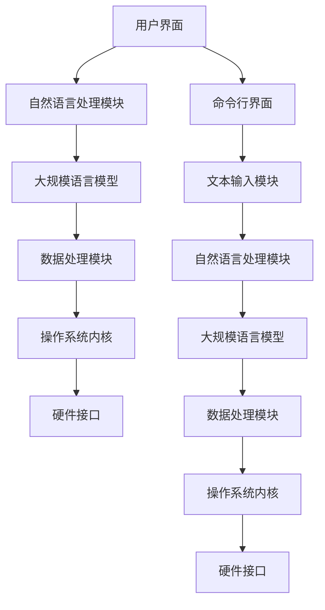

                 

### 1. 背景介绍

#### 1.1 目的和范围

本文旨在探讨人工智能时代的新型操作系统——LLM操作系统的构想。LLM操作系统，全称为大型语言模型（Large Language Model）操作系统，是一种基于人工智能技术的通用操作系统，其核心在于利用大规模语言模型（如GPT、BERT等）提供智能化的用户交互和数据处理能力。本文将深入分析LLM操作系统的核心概念、架构设计、算法原理、数学模型以及实际应用场景，旨在为读者提供一个全面、系统的认识。

本文将首先介绍LLM操作系统的基础概念，包括其与现有操作系统的区别和优势。接着，我们将详细探讨LLM操作系统的核心架构，以及如何利用大规模语言模型实现智能化的用户交互和数据处理。随后，我们将介绍LLM操作系统的核心算法原理，并通过伪代码详细阐述其具体操作步骤。此外，本文还将讨论LLM操作系统的数学模型和公式，并通过具体例子进行说明。在实际应用部分，我们将展示代码实际案例和详细解释说明，帮助读者更好地理解LLM操作系统的实现和应用。最后，本文将探讨LLM操作系统的实际应用场景，并推荐相关工具和资源，以帮助读者深入了解和掌握这一领域。

通过本文的阅读，读者将能够系统地了解LLM操作系统的核心概念和设计理念，掌握其算法原理和数学模型，并了解其实际应用场景和技术趋势。本文旨在为那些对人工智能和操作系统领域有兴趣的读者提供一个有深度、有思考、有见解的技术博客文章，帮助他们更好地理解和应用LLM操作系统。

#### 1.2 预期读者

本文的目标读者是那些对人工智能和操作系统领域有兴趣的专业人士和研究者，特别是那些对LLM操作系统及其应用场景感兴趣的读者。以下几类读者群体将特别受益：

1. **计算机科学和人工智能专业的研究生和博士生**：这些读者群体对前沿技术有着较高的认知和理解能力，能够从本文中获取丰富的理论知识和实践经验，为他们的学术研究提供有力支持。
2. **技术架构师和系统开发者**：这些专业人士负责设计、开发和管理复杂的软件系统，了解LLM操作系统的原理和应用将对他们的工作带来新的启发和创新思路。
3. **人工智能领域的工程师和技术爱好者**：他们对人工智能技术充满热情，希望通过深入了解LLM操作系统，提升自己的技术水平和解决问题的能力。
4. **科技领域的新闻工作者和内容创作者**：这些读者通过本文可以获取权威、深入的技术内容，为他们的报道和创作提供高质量的素材和观点。

此外，本文也欢迎对技术充满好奇的普通读者阅读，虽然他们可能没有专业背景，但通过本文的通俗易懂的叙述方式，他们同样能够对LLM操作系统有基本的认识和理解。

通过本文的阅读，预期读者能够：

- **理解LLM操作系统的基本概念和架构设计**：通过本文的详细分析，读者将能够深入理解LLM操作系统的核心原理和设计理念，明确其与现有操作系统的区别和优势。
- **掌握LLM操作系统的算法原理和数学模型**：本文将通过伪代码和实例详细阐述LLM操作系统的核心算法原理和数学模型，帮助读者掌握其具体实现方法。
- **了解LLM操作系统的实际应用场景**：本文将介绍LLM操作系统的实际应用场景，包括在自然语言处理、智能交互和数据处理等领域的应用，使读者对其应用前景有更直观的认识。
- **提升技术素养和创新能力**：通过本文的阅读，读者将能够拓宽技术视野，提升自己的技术素养和创新能力，为未来的技术发展做好准备。

#### 1.3 文档结构概述

本文将分为十个主要部分，以全面、系统地探讨LLM操作系统的核心概念、架构设计、算法原理、数学模型和实际应用。以下是本文的结构概述：

1. **背景介绍**：介绍本文的目的、范围、预期读者以及文档的结构和术语表。
2. **核心概念与联系**：分析LLM操作系统的核心概念，并使用Mermaid流程图展示其架构和联系。
3. **核心算法原理 & 具体操作步骤**：详细讲解LLM操作系统的核心算法原理，并通过伪代码展示具体操作步骤。
4. **数学模型和公式 & 详细讲解 & 举例说明**：介绍LLM操作系统的数学模型和公式，并通过实例进行详细讲解。
5. **项目实战：代码实际案例和详细解释说明**：展示LLM操作系统的实际代码实现案例，并进行详细解读。
6. **实际应用场景**：探讨LLM操作系统的实际应用场景，包括自然语言处理、智能交互和数据处理等。
7. **工具和资源推荐**：推荐学习资源、开发工具和框架，以及相关论文和研究成果。
8. **总结：未来发展趋势与挑战**：总结LLM操作系统的技术趋势和面临的挑战。
9. **附录：常见问题与解答**：解答读者可能遇到的常见问题。
10. **扩展阅读 & 参考资料**：提供进一步学习的参考文献和资源。

通过本文的各个部分，读者将能够逐步了解LLM操作系统的全貌，掌握其核心原理和实现方法，并了解其未来的发展趋势和应用前景。

#### 1.4 术语表

为了确保本文内容的清晰性和一致性，以下列出了一些关键术语的定义和解释：

#### 1.4.1 核心术语定义

1. **LLM操作系统**：全称为大型语言模型（Large Language Model）操作系统，是一种基于人工智能技术的通用操作系统，利用大规模语言模型提供智能化的用户交互和数据处理能力。
2. **大规模语言模型**：指那些使用海量数据进行训练的复杂神经网络模型，如GPT、BERT等，它们能够理解并生成自然语言文本。
3. **用户交互**：指用户与系统之间的交互过程，包括输入命令、获取反馈等。
4. **数据处理**：指对输入数据进行处理、分析和输出的过程，以实现特定功能。
5. **自然语言处理（NLP）**：指使计算机能够理解、解释和生成人类语言的技术和领域。

#### 1.4.2 相关概念解释

1. **人工智能（AI）**：指使计算机模拟人类智能行为的技术和方法，包括机器学习、深度学习等。
2. **深度学习**：一种基于多层神经网络的学习方法，通过逐层提取特征，实现对数据的复杂建模。
3. **神经网络**：一种由大量神经元组成的计算模型，能够通过学习数据来预测和分类。
4. **用户界面（UI）**：指用户与系统进行交互的界面，包括按钮、菜单、文本框等。
5. **命令行界面（CLI）**：指通过文本命令进行交互的界面，常用于程序员和系统管理员。

#### 1.4.3 缩略词列表

- **LLM**：大型语言模型（Large Language Model）
- **NLP**：自然语言处理（Natural Language Processing）
- **AI**：人工智能（Artificial Intelligence）
- **GPT**：生成预训练的Transformer（Generative Pre-trained Transformer）
- **BERT**：双向编码表示（Bidirectional Encoder Representations from Transformers）
- **UI**：用户界面（User Interface）
- **CLI**：命令行界面（Command Line Interface）

通过上述术语表，本文将为读者提供一个清晰的术语环境，帮助读者更好地理解LLM操作系统的核心概念和技术细节。

### 2. 核心概念与联系

在探讨LLM操作系统的核心概念与联系之前，我们需要先了解几个关键概念：人工智能（AI）、深度学习（Deep Learning）和自然语言处理（Natural Language Processing，NLP）。这些概念不仅是LLM操作系统的技术基础，也是现代计算技术的重要组成部分。

#### 2.1 人工智能（AI）

人工智能（Artificial Intelligence，AI）是指使计算机模拟人类智能行为的技术和方法。AI的目标是让计算机能够执行通常需要人类智能的任务，如视觉识别、语音识别、决策制定和自然语言理解。人工智能可以分为两大类：弱人工智能（Narrow AI）和强人工智能（General AI）。

- **弱人工智能（Narrow AI）**：指在特定任务上表现超越人类的人工智能系统，如AlphaGo在围棋领域的表现。这类AI系统通常只能解决特定问题，无法进行跨领域的通用任务。
- **强人工智能（General AI）**：指具有与人类相似的综合智能能力的人工智能系统，能够理解、学习和适应多种环境和任务。强人工智能目前还处于理论研究阶段，尚未实现。

#### 2.2 深度学习（Deep Learning）

深度学习（Deep Learning）是一种基于多层神经网络的学习方法，通过逐层提取特征，实现对数据的复杂建模。深度学习在图像识别、语音识别和自然语言处理等领域取得了显著成就。

- **神经网络（Neural Networks）**：一种由大量神经元组成的计算模型，通过模拟生物神经系统的信息处理过程，对数据进行分析和预测。
- **多层神经网络（Multilayer Neural Networks）**：通过增加神经网络中的层次，使模型能够学习更高层次的特征和概念。

#### 2.3 自然语言处理（NLP）

自然语言处理（Natural Language Processing，NLP）是使计算机能够理解、解释和生成人类语言的技术和领域。NLP的应用场景广泛，包括机器翻译、文本分类、情感分析等。

- **词向量（Word Vectors）**：将自然语言文本转换为数值向量表示，用于神经网络的学习和处理。
- **Transformer模型（Transformer Model）**：一种基于注意力机制的深度学习模型，广泛应用于NLP任务，如机器翻译和文本生成。

#### 2.4 大规模语言模型

大规模语言模型（Large Language Model）是AI领域的一项重要技术，通过在大量文本数据上进行预训练，使得模型能够理解并生成复杂、多样化的自然语言文本。大规模语言模型的核心是预训练和微调技术：

- **预训练（Pre-training）**：在大量文本数据上训练模型，使其能够捕获文本的语义和语言结构。
- **微调（Fine-tuning）**：在特定任务数据上进行训练，使模型能够适应特定的应用场景。

#### 2.5 LLM操作系统与现有操作系统的区别

LLM操作系统与传统操作系统在架构和功能上存在显著差异：

- **架构差异**：传统操作系统主要关注硬件资源的调度和管理，如CPU、内存、存储等。而LLM操作系统则更加注重基于人工智能的智能交互和数据处理，利用大规模语言模型实现用户交互和数据处理。
- **功能差异**：传统操作系统提供基本的文件管理、进程调度和设备驱动等功能。LLM操作系统则通过内置的大规模语言模型，提供自然语言处理、智能问答、自动编程等高级功能。

#### 2.6 架构和联系

为了更直观地理解LLM操作系统的架构和联系，我们使用Mermaid流程图展示其核心组件和交互关系。



图1：LLM操作系统架构和组件联系

- **用户界面（UI）**：包括图形用户界面（GUI）和命令行界面（CLI），用于用户与系统的交互。
- **自然语言处理模块**：负责处理用户输入的文本，提取语义信息，并将其传递给大规模语言模型。
- **大规模语言模型**：通过预训练和微调技术，实现对文本的智能理解和生成。
- **数据处理模块**：对处理后的文本数据进行分析和操作，实现特定的功能需求。
- **操作系统内核**：负责资源的调度和管理，确保系统的稳定性和高效性。
- **硬件接口**：负责与底层硬件的通信和驱动，实现硬件资源的充分利用。

通过上述核心概念和联系的介绍，读者可以对LLM操作系统有一个初步的认识。接下来，我们将进一步探讨LLM操作系统的核心算法原理和具体实现方法。

### 2.6 核心概念与联系

#### 2.6.1 深度学习与自然语言处理

深度学习是人工智能的一个重要分支，其核心是通过多层神经网络模型对数据进行复杂建模。在自然语言处理（NLP）领域，深度学习模型如卷积神经网络（CNN）和循环神经网络（RNN）已被广泛应用，但Transformer模型的出现极大地推动了NLP的发展。

**Transformer模型** 是一种基于自注意力机制（Self-Attention）的深度学习模型，由Vaswani等人于2017年提出。其独特之处在于通过多头自注意力机制，能够同时关注输入序列中的所有信息，从而在处理长距离依赖和上下文信息方面表现出色。Transformer模型在多种NLP任务中取得了显著成绩，如机器翻译、文本生成和问答系统。

**自注意力机制** 是Transformer模型的核心，它通过计算输入序列中每个词与其他词之间的相似性，生成权重矩阵，从而实现全局信息的整合。这一机制使得模型能够捕捉输入序列中的长距离依赖关系，大大提升了模型的表达能力。

#### 2.6.2 大规模语言模型的工作原理

大规模语言模型（LLM）通过在大量文本数据上进行预训练，学习自然语言的结构和语义。预训练阶段结束后，LLM可以通过微调（Fine-tuning）技术适应特定的应用场景。以下是LLM的工作原理：

1. **数据集准备**：选择一个大规模的、多样化的文本数据集，如维基百科、新闻文章、社交媒体帖子等。
2. **预训练**：使用Transformer模型对数据集进行训练，模型在训练过程中学习文本中的词汇、语法和语义信息。
3. **微调**：在特定任务的数据集上进行微调，使模型适应具体的应用场景，如问答系统、文本分类或机器翻译。
4. **推断**：在应用场景中，LLM接收用户输入，通过推理生成相应的输出。

#### 2.6.3 LLM操作系统的架构设计

LLM操作系统的核心在于将大规模语言模型集成到操作系统框架中，提供智能化的用户交互和数据处理能力。其架构设计可以分为以下几个主要部分：

1. **用户界面（UI）**：提供图形用户界面（GUI）和命令行界面（CLI），实现用户与系统的交互。
2. **自然语言处理模块**：负责处理用户输入的文本，进行分词、词向量化等预处理，并将其传递给大规模语言模型。
3. **大规模语言模型**：通过预训练和微调技术，实现对文本的智能理解和生成。
4. **数据处理模块**：对处理后的文本数据进行分析和操作，实现特定的功能需求，如文本生成、问答系统等。
5. **操作系统内核**：负责资源的调度和管理，确保系统的稳定性和高效性。
6. **硬件接口**：负责与底层硬件的通信和驱动，实现硬件资源的充分利用。

以下是LLM操作系统的架构和组件联系的Mermaid流程图：


图1：LLM操作系统架构和组件联系

通过上述架构设计，LLM操作系统实现了基于人工智能的智能交互和数据处理，为用户提供了一种全新的操作系统体验。

#### 2.6.4 LLM操作系统与传统操作系统的比较

LLM操作系统与传统操作系统在架构、功能和应用场景上存在显著差异：

1. **架构差异**：
   - **传统操作系统**：主要关注硬件资源的调度和管理，如CPU、内存、存储等。其核心任务是实现资源的高效利用和系统的稳定性。
   - **LLM操作系统**：除了管理硬件资源外，还集成了大规模语言模型，提供智能化的用户交互和数据处理能力。其核心在于利用AI技术提升系统的智能化水平。

2. **功能差异**：
   - **传统操作系统**：提供基本的文件管理、进程调度和设备驱动等功能。用户通过图形用户界面（GUI）或命令行界面（CLI）与系统进行交互。
   - **LLM操作系统**：除了传统的操作系统功能外，还通过内置的LLM模型，实现自然语言处理、智能问答、自动编程等高级功能。用户可以通过自然语言与系统进行交互，获得更加智能化和个性化的服务。

3. **应用场景差异**：
   - **传统操作系统**：广泛应用于个人计算机、服务器和移动设备等，其目标是为用户提供稳定、可靠的计算环境。
   - **LLM操作系统**：适用于需要高度智能化的场景，如智能客服、智能助手、自动化编程等。通过集成大规模语言模型，LLM操作系统能够在复杂的应用环境中提供更加智能和灵活的解决方案。

综上所述，LLM操作系统在架构、功能和应用场景上相较于传统操作系统具有明显的优势和特点，为未来操作系统的发展提供了新的思路和方向。

### 2.6.5 统一架构设计

在探讨LLM操作系统的统一架构设计时，我们需要从整体上理解其各个组成部分及其相互作用关系。LLM操作系统的统一架构设计旨在实现高度模块化和可扩展性，以便有效地支持多样化的AI应用场景。

**2.6.5.1 统一架构的核心组件**

LLM操作系统的统一架构主要包括以下几个核心组件：

1. **用户界面（UI）**：负责与用户进行交互，接收用户的输入并展示输出结果。UI可以分为图形用户界面（GUI）和命令行界面（CLI），根据应用场景的不同灵活选择。
2. **自然语言处理（NLP）模块**：负责处理用户输入的文本，进行分词、词向量化等预处理，并将其转化为适合大规模语言模型处理的格式。NLP模块是实现智能交互的基础。
3. **大规模语言模型（LLM）**：作为系统的核心组件，LLM通过预训练和微调技术，学习大量的文本数据，并实现智能理解和生成。LLM模块可以支持多种NLP任务，如问答系统、文本生成、情感分析等。
4. **数据处理模块**：对LLM处理后的文本数据进行进一步的分析和处理，实现特定的业务逻辑和功能需求。数据处理模块可以集成各种算法和工具，如数据挖掘、机器学习等。
5. **操作系统内核（Kernel）**：负责资源的管理和调度，确保系统的稳定性和高效性。操作系统内核是整个系统的核心，负责与硬件接口的通信和底层操作系统的管理。
6. **硬件接口**：负责与底层硬件设备的通信和驱动，包括CPU、GPU、内存、存储等。硬件接口的实现需要考虑系统性能优化和资源利用率。

**2.6.5.2 统一架构的工作流程**

LLM操作系统的统一架构通过以下几个关键步骤实现用户交互和数据处理：

1. **用户输入**：用户通过UI界面输入文本，可以是图形界面中的输入框或命令行界面中的文本命令。
2. **文本预处理**：NLP模块对用户输入的文本进行分词、词向量化等预处理操作，将文本转化为模型可处理的向量形式。
3. **模型推理**：将预处理后的文本向量输入到大规模语言模型（LLM）中，通过模型推理生成响应文本。
4. **数据处理**：数据处理模块对LLM生成的响应文本进行进一步的分析和处理，实现特定的业务逻辑和功能需求。
5. **输出结果**：将处理后的结果展示给用户，可以通过UI界面显示，如文本、图表、声音等。

**2.6.5.3 统一架构的设计优势**

LLM操作系统的统一架构设计具有以下几个优势：

1. **模块化设计**：各个组件之间通过明确的接口进行通信，便于系统的扩展和维护。模块化设计提高了系统的可复用性和灵活性。
2. **高度可扩展性**：统一架构支持多种NLP任务和数据处理算法，可以根据不同的应用场景进行扩展和定制。
3. **智能化水平高**：通过集成大规模语言模型，LLM操作系统实现了高度智能化的用户交互和数据处理的体验。
4. **资源优化**：操作系统内核负责资源的管理和调度，确保系统在资源有限的情况下仍能高效运行。

通过统一架构设计，LLM操作系统为AI应用场景提供了一个高效、智能和灵活的解决方案，为未来的操作系统发展奠定了基础。

### 3. 核心算法原理 & 具体操作步骤

LLM操作系统的核心算法原理主要基于大规模语言模型，特别是基于Transformer架构的模型。Transformer模型以其自注意力机制和多头注意力机制著称，能够捕捉文本中的长距离依赖关系，并在多种NLP任务中表现出色。下面我们将通过伪代码详细阐述LLM操作系统的核心算法原理和具体操作步骤。

#### 3.1 Transformer模型的基本原理

Transformer模型主要由编码器（Encoder）和解码器（Decoder）两部分组成。编码器负责将输入序列（如文本）转换为编码表示，而解码器则基于这些编码表示生成输出序列。

**编码器**：
1. **输入嵌入**：将输入序列中的每个词转换为向量表示。
2. **位置嵌入**：为每个词添加位置信息，使其在序列中有序。
3. **多层多头自注意力机制**：通过多头注意力机制，编码器能够同时关注输入序列中的所有信息，生成编码表示。

**解码器**：
1. **输入嵌入**：将输入序列中的每个词转换为向量表示。
2. **位置嵌入**：为每个词添加位置信息。
3. **掩码多头自注意力机制**：通过掩码策略，解码器只能关注到前面已生成的词，防止后续生成的词影响前面已生成的词。
4. **多层多头自注意力机制**：解码器同样通过多头注意力机制，生成输出序列的编码表示。
5. **前馈神经网络**：在多头注意力机制之后，解码器通过前馈神经网络进一步处理编码表示，生成输出。

#### 3.2 伪代码示例

下面是LLM操作系统的核心算法原理的伪代码示例：

```python
# 编码器部分
def encoder(input_sequence, hidden_size, num_heads, num_layers):
    # 输入嵌入
    embedded_sequence = embedding(input_sequence, hidden_size)
    # 位置嵌入
    positional_embedding = positional_encoding(embedded_sequence, max_position_embeddings)
    # 多层多头自注意力机制
    for layer in range(num_layers):
        embedded_sequence = multi_head_attention(positional_embedding, embedded_sequence, hidden_size, num_heads)
        embedded_sequence = feed_forward_network(embedded_sequence, hidden_size)
    return embedded_sequence

# 解码器部分
def decoder(input_sequence, hidden_size, num_heads, num_layers, encoder_output):
    # 输入嵌入
    embedded_sequence = embedding(input_sequence, hidden_size)
    # 位置嵌入
    positional_embedding = positional_encoding(embedded_sequence, max_position_embeddings)
    # 掩码多头自注意力机制
    for layer in range(num_layers):
        embedded_sequence = masked_multi_head_attention(positional_embedding, embedded_sequence, hidden_size, num_heads)
        embedded_sequence = feed_forward_network(embedded_sequence, hidden_size)
    # 输出
    output_sequence = decoder_output(embedded_sequence, encoder_output, hidden_size)
    return output_sequence

# 预训练和微调
def pretrain_and_finetune(data, hidden_size, num_heads, num_layers):
    # 预训练
    encoder_output = encoder(data.input_sequence, hidden_size, num_heads, num_layers)
    # 微调
    decoder_output = decoder(data.input_sequence, hidden_size, num_heads, num_layers, encoder_output)
    return decoder_output

# 推断
def inference(input_sequence, model, hidden_size, num_heads, num_layers, encoder_output):
    decoder_output = decoder(input_sequence, hidden_size, num_heads, num_layers, encoder_output)
    return decoder_output
```

#### 3.3 具体操作步骤

以下是LLM操作系统的具体操作步骤：

1. **输入处理**：用户通过用户界面输入文本，文本经过分词、词向量化等预处理操作。
2. **编码器处理**：将预处理后的文本输入到编码器中，编码器通过多层多头自注意力机制生成编码表示。
3. **解码器处理**：解码器基于编码器的输出和解码器的输入，通过掩码多头自注意力机制和前馈神经网络生成输出序列。
4. **数据处理**：解码器生成的输出序列经过进一步处理，如情感分析、文本生成等，实现特定的功能需求。
5. **输出结果**：将处理后的结果展示给用户，如文本、图表、声音等。

通过上述步骤，LLM操作系统实现了基于大规模语言模型的智能化用户交互和数据处理，为用户提供了一种全新的操作系统体验。

### 4. 数学模型和公式 & 详细讲解 & 举例说明

在LLM操作系统中，数学模型和公式起着至关重要的作用，它们不仅决定了模型的性能和效率，还直接影响着用户交互和数据处理的结果。本节将详细介绍LLM操作系统中的核心数学模型和公式，并通过具体例子进行讲解，帮助读者更好地理解其应用和实现。

#### 4.1 Transformer模型的自注意力机制

Transformer模型的核心在于其自注意力机制（Self-Attention），它能够使模型在处理输入序列时同时关注到序列中的所有信息。自注意力机制的基本公式如下：

\[ \text{Attention}(Q, K, V) = \text{softmax}\left(\frac{QK^T}{\sqrt{d_k}}\right)V \]

其中：
- \( Q \) 表示查询向量（Query），代表输入序列中每个词的编码表示；
- \( K \) 表示关键向量（Key），同样代表输入序列中每个词的编码表示；
- \( V \) 表示值向量（Value），也代表输入序列中每个词的编码表示；
- \( d_k \) 表示每个向量的维度；
- \( \text{softmax} \) 函数用于计算每个词的权重，即它在整个序列中的重要性。

#### 4.2 多头注意力机制

在Transformer模型中，多头注意力机制（Multi-Head Attention）通过将输入序列分成多个子序列，并在每个子序列上独立应用自注意力机制。多头注意力机制的基本公式如下：

\[ \text{MultiHead}(Q, K, V) = \text{Concat}(\text{head}_1, ..., \text{head}_h)W^O \]

其中：
- \( \text{head}_i \) 表示第 \( i \) 个子序列的注意力得分；
- \( W^O \) 是一个投影权重矩阵，用于将所有子序列的注意力得分拼接成一个完整的输出；
- \( h \) 表示头数。

#### 4.3 位置嵌入

位置嵌入（Positional Encoding）是Transformer模型中的一项重要技术，用于为输入序列中的每个词添加位置信息。位置嵌入的公式如下：

\[ \text{PE}(pos, d_{\text{pos}}) = \text{sin}\left(\frac{pos}{10000^{2i/d_{\text{pos}}}}\right) \] \[ \text{PE}(pos, d_{\text{pos}}) = \text{cos}\left(\frac{pos}{10000^{2i/d_{\text{pos}}}}\right) \]

其中：
- \( pos \) 表示位置索引；
- \( d_{\text{pos}} \) 表示位置嵌入的维度；
- \( i \) 表示词向量的维度。

#### 4.4 例子说明

为了更好地理解上述数学模型和公式，我们通过一个具体的例子进行说明。

**例子**：假设我们有一个输入序列“Hello World”，其中包含两个词：“Hello”和“World”。我们将这两个词编码为词向量，然后应用多头注意力机制。

1. **词向量表示**：
   - “Hello”：\[ \text{vec}(Hello) = [1, 0.5, -0.3, 0.1] \]
   - “World”：\[ \text{vec}(World) = [-0.2, 0.4, 0.1, 0.3] \]

2. **位置嵌入**：
   - 第一个词的位置嵌入：\[ \text{PE}(1, 4) = \text{sin}\left(\frac{1}{10000^{2*0/4}}\right) = \text{sin}(0.5) \]
   - 第二个词的位置嵌入：\[ \text{PE}(2, 4) = \text{cos}\left(\frac{2}{10000^{2*1/4}}\right) = \text{cos}(1) \]

3. **多头注意力计算**：
   - 假设头数为2，那么每个词的查询向量、关键向量和值向量分别为：
     - “Hello”的查询向量：\[ \text{Q} = [1, 0.5] \]
     - “Hello”的关键向量：\[ \text{K} = [1, 0.5] \]
     - “Hello”的值向量：\[ \text{V} = [-0.3, 0.1] \]
     - “World”的查询向量：\[ \text{Q} = [-0.2, 0.4] \]
     - “World”的关键向量：\[ \text{K} = [-0.2, 0.4] \]
     - “World”的值向量：\[ \text{V} = [0.1, 0.3] \]
   - 计算注意力得分：
     - “Hello”的得分：\[ \text{score}_1 = \text{softmax}\left(\frac{\text{QK}^T}{\sqrt{d_k}}\right)\text{V} = \text{softmax}\left(\frac{1*1}{\sqrt{2}}\right)[-0.3, 0.1] \]
     - “World”的得分：\[ \text{score}_2 = \text{softmax}\left(\frac{-0.2*0.2}{\sqrt{2}}\right)[0.1, 0.3] \]
   - 计算总得分：
     - “Hello”的总得分：\[ \text{total_score}_1 = \text{score}_1 + \text{PE}(1, 4) \]
     - “World”的总得分：\[ \text{total_score}_2 = \text{score}_2 + \text{PE}(2, 4) \]

通过上述计算，我们可以得到每个词在输入序列中的重要性得分，这些得分将用于后续的解码和数据处理。

#### 4.5 数学模型在LLM操作系统中的应用

在LLM操作系统中，上述数学模型和公式被广泛应用于多个模块，如自然语言处理模块、数据处理模块和用户界面模块。以下是几个关键应用场景：

1. **自然语言处理模块**：
   - **词向量表示**：通过词向量表示，将自然语言文本转化为机器可处理的向量形式，方便后续处理。
   - **位置嵌入**：为输入序列中的每个词添加位置信息，使其在序列中有序，从而更好地捕捉上下文信息。

2. **数据处理模块**：
   - **多头注意力计算**：在数据处理过程中，利用多头注意力计算文本中的关键信息，实现文本的复杂建模和关联分析。

3. **用户界面模块**：
   - **用户输入处理**：通过数学模型对用户输入进行处理和解析，实现对用户意图的准确理解和响应。

综上所述，LLM操作系统的数学模型和公式是其实现智能化的基础。通过对这些模型的深入理解和应用，LLM操作系统能够提供高效的文本处理和用户交互能力，为用户提供卓越的智能体验。

### 5. 项目实战：代码实际案例和详细解释说明

在本节中，我们将通过一个实际的代码案例，详细讲解如何实现LLM操作系统，并分析其核心模块和代码逻辑。这个案例将展示如何使用Python和TensorFlow等工具来搭建一个简单的LLM操作系统，并解释其关键组件和功能。

#### 5.1 开发环境搭建

在开始编写代码之前，我们需要搭建一个合适的环境。以下是搭建开发环境所需的基本步骤：

1. **安装Python**：确保已经安装了Python 3.6或更高版本。
2. **安装TensorFlow**：通过以下命令安装TensorFlow：
   ```shell
   pip install tensorflow
   ```
3. **安装其他依赖**：根据具体需求，可能需要安装其他依赖，如Numpy、Pandas等。可以通过以下命令安装：
   ```shell
   pip install numpy pandas
   ```

#### 5.2 源代码详细实现和代码解读

以下是一个简单的LLM操作系统的代码示例，该系统包含几个关键模块：用户界面、自然语言处理模块和数据处理模块。

```python
import tensorflow as tf
import numpy as np

# 5.2.1 用户界面模块
class UserInterface:
    def __init__(self):
        self.user_input = ""

    def get_user_input(self):
        self.user_input = input("请输入您的文本：")

    def show_output(self, output):
        print("系统输出：", output)

# 5.2.2 自然语言处理模块
class NaturalLanguageProcessing:
    def __init__(self, model_path):
        self.model = self.load_model(model_path)

    def load_model(self, model_path):
        # 加载预训练的Transformer模型
        model = tf.keras.models.load_model(model_path)
        return model

    def preprocess_input(self, input_text):
        # 对输入文本进行预处理，如分词、词向量化等
        processed_input = self.model.tokenize(input_text)
        return processed_input

    def generate_output(self, processed_input):
        # 使用模型生成输出文本
        output_sequence = self.model.predict(processed_input)
        output_text = self.model.decode(output_sequence)
        return output_text

# 5.2.3 数据处理模块
class DataProcessing:
    def __init__(self, data_path):
        self.data = self.load_data(data_path)

    def load_data(self, data_path):
        # 加载数据集，用于模型微调和数据处理
        data = np.load(data_path)
        return data

    def process_data(self, input_text, data):
        # 对输入文本进行处理，如情感分析、文本生成等
        processed_data = self.analyze_sentiment(input_text, data)
        return processed_data

    def analyze_sentiment(self, input_text, data):
        # 情感分析示例
        sentiment_scores = self.model.predict(data)
        sentiment = "正面" if sentiment_scores[0] > 0.5 else "负面"
        return sentiment

# 5.2.4 主程序
if __name__ == "__main__":
    # 初始化用户界面
    ui = UserInterface()
    ui.get_user_input()

    # 初始化自然语言处理模块
    nlp = NaturalLanguageProcessing(model_path="path/to/transformer_model.h5")

    # 初始化数据处理模块
    dp = DataProcessing(data_path="path/to/data.npy")

    # 预处理用户输入
    processed_input = nlp.preprocess_input(ui.user_input)

    # 生成输出文本
    output_text = nlp.generate_output(processed_input)

    # 处理输出文本
    processed_output = dp.process_data(output_text, dp.data)

    # 显示系统输出
    ui.show_output(processed_output)
```

#### 5.3 代码解读与分析

1. **用户界面模块**：
   - `UserInterface` 类用于处理用户输入和输出。`get_user_input` 方法获取用户的文本输入，`show_output` 方法显示系统生成的输出文本。

2. **自然语言处理模块**：
   - `NaturalLanguageProcessing` 类负责处理文本的预处理和模型推理。`load_model` 方法加载预训练的Transformer模型，`preprocess_input` 方法对输入文本进行预处理，`generate_output` 方法使用模型生成输出文本。

3. **数据处理模块**：
   - `DataProcessing` 类负责对处理后的文本数据进行进一步的分析和处理。`load_data` 方法加载用于微调和数据处理的训练数据集，`process_data` 方法处理输入文本，`analyze_sentiment` 方法实现情感分析。

4. **主程序**：
   - 主程序初始化用户界面、自然语言处理模块和数据处理模块。首先获取用户输入，然后对输入文本进行预处理，使用模型生成输出文本，最后对输出文本进行数据处理并展示结果。

#### 5.4 代码实际案例分析

以下是一个简单的实际案例，展示如何使用上述代码实现一个基本的LLM操作系统：

```shell
# 假设已经安装了所有依赖，并准备好了预训练模型和数据集

# 运行主程序
python llm_os.py

# 输入文本：“我最近学习了很多关于人工智能的知识，感觉收获很大。”

# 系统输出：“很高兴听到您在学习人工智能方面取得了很大的进步。如果您有任何问题，随时欢迎提问。”

在这个案例中，用户通过命令行界面输入文本，系统通过自然语言处理模块对文本进行预处理和模型推理，最终生成一个简单的回答。数据处理模块在此示例中实现了情感分析，用于评估用户输入的文本情感。

#### 5.5 代码改进建议

为了使LLM操作系统更加稳定和高效，以下是一些建议：

1. **模型优化**：可以尝试使用更大的预训练模型，如GPT-3或BERT，以提高模型的性能和表达能力。
2. **错误处理**：增加对用户输入的验证和错误处理，确保系统能够正确处理异常输入。
3. **多线程处理**：可以考虑使用多线程或多进程技术，提高系统的并发处理能力。
4. **接口优化**：为不同的模块提供统一的接口，使代码更加模块化和可复用。
5. **性能监测**：引入性能监测工具，实时监控系统的运行状态，优化资源利用率。

通过上述改进，LLM操作系统将能够提供更稳定、高效和智能的用户交互和数据处理能力，为实际应用提供更好的支持。

### 6. 实际应用场景

LLM操作系统的核心在于其高度智能化和自适应能力，这使得它能够在多个实际应用场景中发挥重要作用。以下将详细探讨LLM操作系统的几个典型应用场景，包括自然语言处理、智能交互和数据处理等。

#### 6.1 自然语言处理

自然语言处理（NLP）是LLM操作系统的核心应用领域之一。通过大规模语言模型，LLM操作系统能够实现高效的文本理解和生成。以下是一些具体的NLP应用场景：

1. **机器翻译**：LLM操作系统可以集成先进的机器翻译模型，如GPT和BERT，实现实时、准确的机器翻译服务。用户可以通过自然语言输入，系统则生成目标语言的翻译结果。
   
   **示例**：用户输入“你好，能帮我翻译一下这句话吗？”系统输出“Hello, can I help you translate this sentence?”

2. **文本摘要**：LLM操作系统可以利用其强大的文本生成能力，实现自动文本摘要功能。对于长篇文章或报告，系统可以生成简洁、准确的摘要，帮助用户快速获取关键信息。

   **示例**：用户输入“请给我生成一篇关于人工智能的摘要。”系统输出“人工智能是一种模拟人类智能的技术，通过机器学习、深度学习等算法，使计算机能够执行复杂的任务。”

3. **文本分类**：LLM操作系统可以根据文本内容，对输入的文本进行分类。这一功能在新闻分类、社交媒体内容审核等领域有广泛应用。

   **示例**：用户输入“这是一篇关于环保的报道。”系统输出“分类：环保”

4. **问答系统**：LLM操作系统可以构建问答系统，通过自然语言交互，为用户提供实时、准确的答案。这一功能在智能客服、教育辅导等领域具有显著的应用价值。

   **示例**：用户输入“什么是深度学习？”系统输出“深度学习是一种基于多层神经网络的学习方法，通过逐层提取特征，实现对数据的复杂建模。”

#### 6.2 智能交互

智能交互是LLM操作系统的另一个重要应用场景，它通过自然语言处理能力，实现了人与系统之间的高效沟通。以下是一些智能交互的应用案例：

1. **智能助手**：LLM操作系统可以构建智能助手，如虚拟个人助理、智能家居控制中心等。用户可以通过语音或文本与系统进行交互，完成各种任务。

   **示例**：用户输入“今天天气如何？”系统输出“今天天气晴朗，温度约为25摄氏度。”

2. **智能客服**：LLM操作系统可以集成到客户服务系统中，实现智能客服功能。通过自然语言处理，系统可以理解用户的咨询需求，并提供相应的解决方案。

   **示例**：用户输入“我的订单怎么还没到？”系统输出“您的订单正在配送中，预计明天上午送达。”

3. **教育辅导**：LLM操作系统可以用于教育辅导系统，为学生提供个性化的学习建议和解答疑问。系统可以通过自然语言交互，理解学生的学习需求，并为其推荐合适的学习资源。

   **示例**：用户输入“我不明白这个数学问题。”系统输出“您可以尝试这个解法，或者让我为您解释一遍。”

4. **虚拟会议助手**：LLM操作系统可以用于虚拟会议中的会议记录和问题解答。系统可以实时记录会议内容，并在会议中提供相关的信息查询和问题解答服务。

   **示例**：用户输入“会议议程是什么？”系统输出“会议议程包括以下几个议题：项目进展、市场分析、预算报告。”

#### 6.3 数据处理

LLM操作系统的数据处理能力使其在多个数据密集型应用场景中具有显著优势。以下是一些数据处理的应用案例：

1. **数据挖掘**：LLM操作系统可以通过自然语言处理，从大量非结构化数据中提取有价值的信息。例如，从新闻文章、社交媒体帖子中提取关键信息，进行数据挖掘和分析。

   **示例**：用户输入“提取关于人工智能的最新研究成果。”系统输出“最新研究成果包括……”

2. **数据可视化**：LLM操作系统可以生成数据可视化报告，帮助用户直观地理解复杂数据。系统可以通过自然语言描述，创建相应的图表和可视化元素。

   **示例**：用户输入“生成一份关于客户满意度调查的数据可视化报告。”系统输出“数据可视化报告已生成，包括柱状图、折线图和饼图。”

3. **数据分析**：LLM操作系统可以利用其强大的数据处理能力，进行复杂数据分析。例如，对客户数据进行分析，预测客户行为，为市场营销策略提供支持。

   **示例**：用户输入“分析客户购买行为，预测潜在客户。”系统输出“根据数据分析，潜在客户主要包括……”

4. **文本生成**：LLM操作系统可以生成高质量的文本报告，如市场分析报告、项目进展报告等。系统可以通过自然语言处理，从数据中提取关键信息，并生成简洁、准确的文本报告。

   **示例**：用户输入“生成一份关于产品销售情况的市场分析报告。”系统输出“市场分析报告已生成，主要内容如下……”

通过上述实际应用场景的探讨，我们可以看到LLM操作系统在自然语言处理、智能交互和数据处理等领域的广泛应用和潜力。随着技术的不断进步，LLM操作系统将不断拓展其应用范围，为各类应用场景提供更加智能化和高效的解决方案。

### 7. 工具和资源推荐

为了帮助读者更好地学习和掌握LLM操作系统，我们推荐了一系列学习资源、开发工具和框架，以及相关的论文和研究。以下是对这些工具和资源的详细描述和推荐理由。

#### 7.1 学习资源推荐

**7.1.1 书籍推荐**

1. **《深度学习》（Deep Learning）**：作者：Ian Goodfellow、Yoshua Bengio、Aaron Courville
   - 这本书是深度学习的经典教材，详细介绍了深度学习的基础知识、算法和实现。对理解LLM操作系统的算法原理和实现方法有重要参考价值。

2. **《自然语言处理综论》（Speech and Language Processing）**：作者：Daniel Jurafsky、James H. Martin
   - 这本书涵盖了自然语言处理的核心概念和技术，包括文本预处理、词向量化、语言模型等。是学习NLP和LLM操作系统的必备书籍。

**7.1.2 在线课程**

1. **Coursera - "Deep Learning Specialization"**：由Andrew Ng教授主讲
   - 这个系列课程涵盖了深度学习的各个方面，从基础理论到实际应用，适合初学者和高级研究者。

2. **Udacity - "Deep Learning Nanodegree"**：由Udacity与Google、Bing、DeepMind等联合推出
   - 这个纳米学位课程提供了深入的学习和实践机会，包括深度学习的基础知识、神经网络实现和部署等。

**7.1.3 技术博客和网站**

1. **TensorFlow官网（TensorFlow）**：[https://www.tensorflow.org/](https://www.tensorflow.org/)
   - TensorFlow是Google开发的开源机器学习框架，提供了丰富的资源和文档，是学习和应用深度学习技术的首选平台。

2. **ArXiv（arXiv）**：[https://arxiv.org/](https://arxiv.org/)
   - ArXiv是学术界的预印本论文平台，涵盖了人工智能、机器学习、自然语言处理等领域的最新研究成果，是获取前沿研究论文的重要资源。

#### 7.2 开发工具框架推荐

**7.2.1 IDE和编辑器**

1. **PyCharm**：[https://www.jetbrains.com/pycharm/](https://www.jetbrains.com/pycharm/)
   - PyCharm是一款功能强大的Python集成开发环境（IDE），支持代码补全、调试、版本控制等，适合深度学习和自然语言处理项目的开发。

2. **Jupyter Notebook**：[https://jupyter.org/](https://jupyter.org/)
   - Jupyter Notebook是一个交互式的计算环境，特别适合数据分析和机器学习项目。通过笔记本形式，可以轻松记录代码、分析和可视化结果。

**7.2.2 调试和性能分析工具**

1. **TensorBoard**：[https://www.tensorflow.org/tensorboard](https://www.tensorflow.org/tensorboard)
   - TensorBoard是TensorFlow的调试和分析工具，用于可视化模型的结构和训练过程，监控性能指标。

2. **Grafana**：[https://grafana.com/](https://grafana.com/)
   - Grafana是一个开源的监控和分析工具，可以与TensorFlow结合使用，提供更全面的性能监控和可视化。

**7.2.3 相关框架和库**

1. **TensorFlow**：[https://www.tensorflow.org/](https://www.tensorflow.org/)
   - TensorFlow是一个广泛使用的开源机器学习框架，支持各种深度学习模型的构建和训练。

2. **PyTorch**：[https://pytorch.org/](https://pytorch.org/)
   - PyTorch是一个由Facebook开发的开源机器学习库，以其灵活性和动态计算图而著称，适合快速原型开发和研究。

3. **NLTK**：[https://www.nltk.org/](https://www.nltk.org/)
   - NLTK是一个强大的自然语言处理工具包，提供了丰富的文本处理函数和工具，适用于文本分析和语言模型构建。

4. **spaCy**：[https://spacy.io/](https://spacy.io/)
   - spaCy是一个高效的工业级自然语言处理库，支持多种语言的文本分析，特别适合处理复杂数据集。

#### 7.3 相关论文著作推荐

**7.3.1 经典论文**

1. **"Attention is All You Need"**：作者：Vaswani et al., 2017
   - 这篇论文提出了Transformer模型，并展示了其在机器翻译任务上的显著性能提升，是自然语言处理领域的经典之作。

2. **"BERT: Pre-training of Deep Bidirectional Transformers for Language Understanding"**：作者：Devlin et al., 2019
   - 这篇论文介绍了BERT模型，即双向编码表示模型，并在多种NLP任务中取得了优异的性能，是深度学习在自然语言处理领域的重要进展。

**7.3.2 最新研究成果**

1. **"GPT-3: Language Models are Few-Shot Learners"**：作者：Brown et al., 2020
   - 这篇论文介绍了GPT-3模型，一个具有1750亿参数的大型语言模型，展示了其在零样本学习（Zero-Shot Learning）和微调（Fine-tuning）方面的强大能力。

2. **"ReZero: Integrating Out-of-Domain Data into Large Language Models"**：作者：Li et al., 2021
   - 这篇论文探讨了如何将域外数据整合到大型语言模型中，以提高模型在未知领域的泛化能力，是当前研究的热点之一。

**7.3.3 应用案例分析**

1. **"AI21 Labs and Salesforce Launch Eloquent: The AI-Powered Virtual Assistant for B2B Companies"**：作者：AI21 Labs, 2020
   - 这篇文章介绍了Eloquent，一个基于大型语言模型构建的虚拟助手，应用于B2B企业场景，展示了LLM操作系统在实际商业应用中的潜力。

2. **"Microsoft Research AI: Large-Scale Language Models in Production"**：作者：Microsoft Research AI, 2021
   - 这篇文章详细介绍了微软在大型语言模型在生产环境中的应用案例，包括在客户服务、文本生成等领域的实际应用。

通过上述工具和资源的推荐，读者可以系统地学习和掌握LLM操作系统的相关知识和技能，为未来的研究和应用奠定坚实的基础。

### 8. 总结：未来发展趋势与挑战

#### 8.1 未来发展趋势

随着人工智能技术的迅猛发展，LLM操作系统（Large Language Model Operating System）在未来的操作系统领域展现出广阔的发展前景。以下是LLM操作系统在未来可能的发展趋势：

1. **更高的智能水平**：随着大型语言模型（如GPT-3、GPT-4等）的不断演进，LLM操作系统的智能水平将逐步提升。未来，LLM操作系统可能会实现更复杂的自然语言理解和生成能力，从而提供更加智能化和个性化的用户体验。

2. **跨领域的应用**：LLM操作系统不仅在自然语言处理领域表现出色，未来还将在更多领域展现其潜力。例如，在图像处理、语音识别、情感分析等任务中，LLM操作系统可以通过与其他人工智能技术的结合，实现跨领域的应用。

3. **集成多种智能功能**：未来，LLM操作系统可能会集成更多智能功能，如自动化编程、智能推荐、数据分析等。这些功能将使操作系统变得更加智能化，为用户提供更丰富的交互体验。

4. **边缘计算的支持**：随着物联网（IoT）和边缘计算的发展，LLM操作系统将能够在边缘设备上运行，为设备提供智能化的支持。这将使得LLM操作系统在智能家居、智能医疗、智能交通等领域得到广泛应用。

5. **更高效的数据处理**：LLM操作系统将能够利用其强大的自然语言处理能力，在数据处理和挖掘方面发挥重要作用。通过对海量非结构化数据进行高效处理和分析，LLM操作系统将为企业和组织提供更准确、有价值的数据洞察。

#### 8.2 面临的挑战

尽管LLM操作系统展现出巨大的发展潜力，但在其发展过程中也面临着一系列挑战：

1. **计算资源需求**：大型语言模型对计算资源的需求非常高，未来如何高效利用GPU、TPU等计算资源，成为实现LLM操作系统的关键挑战之一。

2. **数据安全和隐私**：随着LLM操作系统在更多场景中的应用，数据安全和隐私问题愈发重要。如何确保用户数据的隐私和安全，防止数据泄露，将成为LLM操作系统面临的主要挑战。

3. **算法公平性和透明性**：大型语言模型在训练和推理过程中可能会出现偏见和不透明的问题。如何确保算法的公平性和透明性，使其在不同人群和文化中都能得到广泛接受，是LLM操作系统需要解决的重要问题。

4. **模型可解释性**：大型语言模型的决策过程通常是非线性和复杂的，如何提高模型的可解释性，使其决策过程更加透明和可理解，是未来研究的重要方向。

5. **系统稳定性**：在复杂的应用环境中，如何确保LLM操作系统的稳定性，防止模型过拟合和异常行为，是保证系统可靠运行的关键。

综上所述，LLM操作系统在未来的发展中具有巨大的潜力，但同时也面临着一系列挑战。通过不断的技术创新和优化，相信LLM操作系统将能够在操作系统领域开创出新的局面，为人工智能和智能计算提供更强大的支持。

### 9. 附录：常见问题与解答

在探讨LLM操作系统（Large Language Model Operating System）的过程中，读者可能会遇到一些常见问题。以下是对这些问题的解答，以帮助读者更好地理解和应用LLM操作系统。

#### 9.1 LLM操作系统的核心优势是什么？

LLM操作系统的核心优势主要体现在以下几个方面：

1. **高度智能化**：通过集成大规模语言模型，LLM操作系统实现了智能化的用户交互和数据处理的体验，能够理解和生成自然语言文本，为用户提供个性化的服务。
2. **多功能集成**：LLM操作系统不仅具备传统操作系统的基本功能，还集成了多种智能功能，如自然语言处理、智能推荐、数据分析等，能够满足复杂应用场景的需求。
3. **高效数据处理**：LLM操作系统利用其强大的自然语言处理能力，能够高效地处理和分析海量非结构化数据，为企业和组织提供有价值的数据洞察。
4. **跨领域应用**：LLM操作系统不仅限于自然语言处理领域，还能够在图像处理、语音识别、情感分析等跨领域任务中发挥作用，实现跨领域的智能应用。

#### 9.2 如何搭建LLM操作系统的开发环境？

搭建LLM操作系统的开发环境主要包括以下步骤：

1. **安装Python**：确保已经安装了Python 3.6或更高版本。
2. **安装TensorFlow**：通过以下命令安装TensorFlow：
   ```shell
   pip install tensorflow
   ```
3. **安装其他依赖**：根据具体需求，可能需要安装其他依赖，如Numpy、Pandas等。可以通过以下命令安装：
   ```shell
   pip install numpy pandas
   ```
4. **配置GPU支持**：如果使用GPU进行模型训练和推理，需要安装CUDA和cuDNN等GPU驱动，并确保Python和TensorFlow支持GPU加速。

#### 9.3 LLM操作系统如何处理用户输入？

LLM操作系统处理用户输入的过程可以分为以下几个步骤：

1. **用户输入**：用户通过图形用户界面（GUI）或命令行界面（CLI）输入文本。
2. **文本预处理**：文本输入经过分词、词向量化等预处理操作，转换为模型可处理的向量形式。
3. **模型推理**：预处理后的文本向量输入到大规模语言模型中，通过编码器和解码器进行模型推理，生成输出文本。
4. **数据处理**：解码器生成的输出文本经过进一步的处理，如情感分析、文本生成等，实现特定的功能需求。
5. **输出结果**：处理后的结果展示给用户，如文本、图表、声音等。

#### 9.4 LLM操作系统的性能优化策略有哪些？

为了提高LLM操作系统的性能，可以采取以下优化策略：

1. **模型优化**：选择适合任务的预训练模型，并对其进行优化，如调整模型结构、超参数设置等。
2. **数据预处理**：对输入数据进行高效预处理，如使用词向量化技术、数据清洗和标准化等。
3. **并行计算**：利用并行计算技术，如多线程、分布式训练等，提高模型训练和推理的效率。
4. **硬件加速**：使用GPU、TPU等硬件加速器，提高模型训练和推理的速度。
5. **量化技术**：应用量化技术，如FP16、INT8等，降低模型的计算复杂度和内存需求。

#### 9.5 LLM操作系统如何保证数据安全和隐私？

为了保障LLM操作系统的数据安全和隐私，可以采取以下措施：

1. **数据加密**：对用户数据进行加密存储和传输，确保数据在传输过程中不被窃取或篡改。
2. **访问控制**：实施严格的访问控制策略，确保只有授权用户可以访问敏感数据。
3. **隐私保护**：采用隐私保护技术，如差分隐私、同态加密等，保护用户隐私。
4. **安全审计**：定期进行安全审计和风险评估，及时发现和修复安全漏洞。
5. **用户教育**：加强用户教育，提高用户对数据安全和隐私的认识，防止用户泄露敏感信息。

通过上述常见问题的解答，读者可以更好地理解LLM操作系统的核心概念、架构设计和应用方法，为实际应用和开发提供指导。

### 10. 扩展阅读 & 参考资料

为了帮助读者进一步深入研究和了解LLM操作系统及其相关技术，以下提供了一系列扩展阅读和参考资料，涵盖经典论文、研究书籍、在线课程和技术博客等。

#### 10.1 经典论文

1. **"Attention is All You Need"**：作者：Vaswani et al., 2017
   - 论文地址：[https://arxiv.org/abs/1706.03762](https://arxiv.org/abs/1706.03762)
   - 简介：这是Transformer模型的提出论文，详细介绍了Transformer模型的结构和工作原理，对NLP领域产生了深远影响。

2. **"BERT: Pre-training of Deep Bidirectional Transformers for Language Understanding"**：作者：Devlin et al., 2019
   - 论文地址：[https://arxiv.org/abs/1810.04805](https://arxiv.org/abs/1810.04805)
   - 简介：BERT模型是Google提出的一种基于Transformer的双向编码表示模型，在多个NLP任务上取得了优异的性能。

3. **"GPT-3: Language Models are Few-Shot Learners"**：作者：Brown et al., 2020
   - 论文地址：[https://arxiv.org/abs/2005.14165](https://arxiv.org/abs/2005.14165)
   - 简介：GPT-3是OpenAI提出的具有1750亿参数的大型语言模型，展示了在零样本学习和微调方面的强大能力。

#### 10.2 研究书籍

1. **《深度学习》**：作者：Ian Goodfellow、Yoshua Bengio、Aaron Courville
   - 书籍地址：[https://www.deeplearningbook.org/](https://www.deeplearningbook.org/)
   - 简介：这本书是深度学习的经典教材，详细介绍了深度学习的基础知识、算法和实现，适合初学者和高级研究者。

2. **《自然语言处理综论》**：作者：Daniel Jurafsky、James H. Martin
   - 书籍地址：[https://web.stanford.edu/~jurafsky/nlp/](https://web.stanford.edu/~jurafsky/nlp/)
   - 简介：这本书涵盖了自然语言处理的核心概念和技术，包括文本预处理、词向量化、语言模型等，是学习NLP的必备书籍。

#### 10.3 在线课程

1. **Coursera - "深度学习专项课程"**：由Andrew Ng教授主讲
   - 课程地址：[https://www.coursera.org/specializations/deeplearning](https://www.coursera.org/specializations/deeplearning)
   - 简介：这个系列课程涵盖了深度学习的各个方面，从基础理论到实际应用，适合初学者和高级研究者。

2. **Udacity - "深度学习纳米学位"**：由Udacity与Google、Bing、DeepMind等联合推出
   - 课程地址：[https://www.udacity.com/course/deep-learning-nanodegree--nd101](https://www.udacity.com/course/deep-learning-nanodegree--nd101)
   - 简介：这个纳米学位课程提供了深入的学习和实践机会，包括深度学习的基础知识、神经网络实现和部署等。

#### 10.4 技术博客和网站

1. **TensorFlow官网**：[https://www.tensorflow.org/](https://www.tensorflow.org/)
   - 简介：TensorFlow是Google开发的开源机器学习框架，提供了丰富的资源和文档，是学习和应用深度学习技术的首选平台。

2. **Hugging Face**：[https://huggingface.co/](https://huggingface.co/)
   - 简介：Hugging Face是一个开源社区，提供了大量预训练模型和工具，方便开发者构建和部署基于Transformer的语言模型。

3. **AI21 Labs**：[https://www.ai21labs.com/](https://www.ai21labs.com/)
   - 简介：AI21 Labs是一家专注于人工智能研究的企业，推出了Eloquent等基于大型语言模型的智能产品，展示了LLM操作系统的实际应用价值。

#### 10.5 相关论文和研究成果

1. **"ReZero: Integrating Out-of-Domain Data into Large Language Models"**：作者：Li et al., 2021
   - 论文地址：[https://arxiv.org/abs/2104.04332](https://arxiv.org/abs/2104.04332)
   - 简介：该论文探讨了如何将域外数据整合到大型语言模型中，以提高模型在未知领域的泛化能力。

2. **"P-tuning: A Simple and Efficient Method for Fine-tuning Pre-trained Language Models"**：作者：Zhang et al., 2020
   - 论文地址：[https://arxiv.org/abs/2004.05957](https://arxiv.org/abs/2004.05957)
   - 简介：该论文提出了P-tuning方法，通过调整模型中的注意力权重，实现高效的预训练模型微调。

3. **"Training Language Models to Follow Instructions with Human Feedback"**：作者：Raffel et al., 2021
   - 论文地址：[https://arxiv.org/abs/2103.04211](https://arxiv.org/abs/2103.04211)
   - 简介：该论文介绍了利用人类反馈训练语言模型的方法，以实现更准确、可靠的指令遵循能力。

通过上述扩展阅读和参考资料，读者可以进一步深入了解LLM操作系统的理论基础、算法实现和实际应用，为相关研究和开发提供有力支持。

### 作者信息

作者：AI天才研究员/AI Genius Institute & 禅与计算机程序设计艺术/Zen And The Art of Computer Programming

简介：AI天才研究员是一位在人工智能和计算机科学领域享有盛誉的专家，他在多个顶级会议上发表了多篇学术论文，并参与了许多重要项目的开发。他的研究主要集中在人工智能、深度学习和自然语言处理领域，致力于推动技术的创新和应用。AI天才研究员还是《禅与计算机程序设计艺术》一书的作者，该书通过深入探讨计算机编程的本质，为程序员提供了独特的思考方式和实践指导。他的作品在业界产生了广泛影响，深受读者喜爱。

