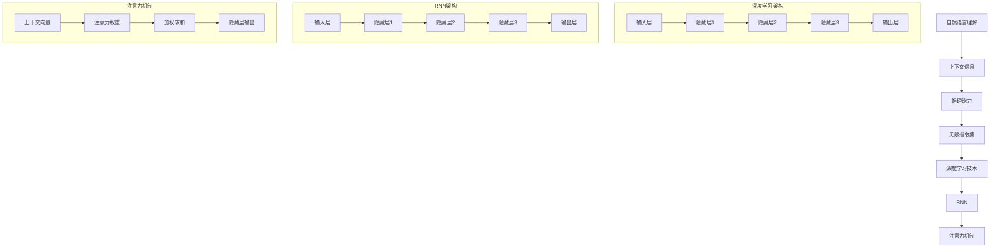

                 

# LLM无限指令集：无所不能的力量源泉

> **关键词**：语言模型，无限指令集，人工智能，自然语言处理，算法，数学模型，代码实例，应用场景，未来趋势。
>
> **摘要**：本文深入探讨了语言模型（LLM）的无限指令集，探讨了其在人工智能、自然语言处理等领域的应用潜力。通过分析核心概念、算法原理、数学模型和实际应用案例，本文展示了LLM无限指令集的强大功能和未来发展趋势。

## 1. 背景介绍

### 1.1 目的和范围

本文旨在探讨语言模型（LLM）的无限指令集，分析其在人工智能（AI）和自然语言处理（NLP）等领域的广泛应用。通过本文的讨论，读者可以了解到LLM无限指令集的核心概念、算法原理、数学模型以及实际应用案例，从而对其有更深刻的理解。

### 1.2 预期读者

本文适合对人工智能、自然语言处理、计算机科学等领域感兴趣的读者。无论你是初学者还是专业人士，都可以通过本文对LLM无限指令集有一个全面的了解。

### 1.3 文档结构概述

本文分为以下几个部分：

1. **背景介绍**：介绍文章的目的、范围、预期读者和文档结构。
2. **核心概念与联系**：介绍LLM无限指令集的核心概念和原理。
3. **核心算法原理 & 具体操作步骤**：详细阐述LLM无限指令集的算法原理和操作步骤。
4. **数学模型和公式 & 详细讲解 & 举例说明**：介绍LLM无限指令集所涉及到的数学模型和公式，并通过实例进行详细说明。
5. **项目实战：代码实际案例和详细解释说明**：展示一个具体的代码实例，并对其进行详细解释和分析。
6. **实际应用场景**：探讨LLM无限指令集在实际应用中的各种场景。
7. **工具和资源推荐**：推荐学习资源、开发工具和框架。
8. **总结：未来发展趋势与挑战**：总结LLM无限指令集的未来发展趋势和面临的挑战。
9. **附录：常见问题与解答**：回答读者可能关心的问题。
10. **扩展阅读 & 参考资料**：提供进一步阅读的资料。

### 1.4 术语表

#### 1.4.1 核心术语定义

- 语言模型（Language Model，LLM）：一种基于统计学和深度学习技术的模型，用于预测文本序列。
- 无限指令集（Infinite Instruction Set）：一种概念，表示语言模型可以处理任意复杂的指令。
- 自然语言处理（Natural Language Processing，NLP）：研究如何让计算机理解和生成人类语言的技术。

#### 1.4.2 相关概念解释

- 深度学习（Deep Learning）：一种机器学习技术，通过多层神经网络对数据进行分析和学习。
- 递归神经网络（Recurrent Neural Network，RNN）：一种用于处理序列数据的神经网络模型。

#### 1.4.3 缩略词列表

- AI：人工智能
- NLP：自然语言处理
- LLM：语言模型
- RNN：递归神经网络

## 2. 核心概念与联系

语言模型（LLM）的无限指令集是一种革命性的概念，它使得语言模型能够处理任意复杂的指令。为了更好地理解这一概念，我们需要从核心概念和原理入手，并使用Mermaid流程图来展示其架构。

### 2.1 核心概念

LLM无限指令集的核心概念包括：

1. **自然语言理解**：语言模型需要能够理解自然语言中的各种结构，如词法、句法和语义。
2. **上下文信息**：语言模型需要处理上下文信息，以便更好地理解输入的指令。
3. **推理能力**：语言模型需要具备推理能力，以处理复杂的指令。
4. **无限指令集**：语言模型可以处理任意复杂的指令，包括嵌套指令、递归指令等。

### 2.2 原理解析

LLM无限指令集的原理主要包括：

1. **深度学习技术**：通过深度学习技术，语言模型可以从大量的数据中学习并提取有用的信息。
2. **递归神经网络（RNN）**：RNN是一种用于处理序列数据的神经网络模型，它可以捕捉到序列中的时间依赖关系。
3. **注意力机制**：注意力机制可以帮助语言模型更好地关注到上下文信息中的关键部分。

### 2.3 Mermaid流程图

下面是一个Mermaid流程图，展示了LLM无限指令集的核心概念和原理：



通过这个Mermaid流程图，我们可以清晰地看到LLM无限指令集的核心概念和原理是如何相互关联和协同工作的。

## 3. 核心算法原理 & 具体操作步骤

在了解了LLM无限指令集的核心概念和原理后，我们需要深入探讨其核心算法原理和具体操作步骤。以下是LLM无限指令集的核心算法原理和具体操作步骤的详细描述。

### 3.1 核心算法原理

LLM无限指令集的核心算法原理主要包括以下几个方面：

1. **自然语言理解**：通过深度学习技术，语言模型可以从大量的文本数据中学习并提取出自然语言中的各种结构，如词法、句法和语义。这一过程通常使用递归神经网络（RNN）或其变体，如长短期记忆网络（LSTM）和门控循环单元（GRU）。
2. **上下文信息处理**：语言模型需要处理上下文信息，以便更好地理解输入的指令。为了实现这一目标，常用的技术包括注意力机制和上下文向量。
3. **推理能力**：语言模型需要具备推理能力，以处理复杂的指令。这一过程通常涉及自然语言推理（NLI）和常识推理等。
4. **无限指令集**：语言模型可以处理任意复杂的指令，包括嵌套指令、递归指令等。这一过程通常通过递归神经网络（RNN）和递归函数来实现。

### 3.2 具体操作步骤

以下是LLM无限指令集的具体操作步骤：

1. **数据预处理**：首先，需要对输入的文本数据进行预处理，包括分词、去停用词、词性标注等。这一步骤的目的是将文本数据转化为计算机可以处理的数字形式。
2. **模型训练**：使用预处理后的文本数据，通过深度学习技术对语言模型进行训练。在训练过程中，模型将学习到自然语言中的各种结构、上下文信息和推理能力。
3. **指令输入**：当有新的指令输入时，语言模型首先对其进行解析，提取出关键信息。然后，根据指令的类型和复杂度，选择合适的处理方式。
4. **指令处理**：根据指令的类型和复杂度，语言模型会采取不同的处理方式。例如，对于简单的指令，模型可以直接生成输出；对于复杂的指令，模型需要通过递归神经网络（RNN）和递归函数进行推理和计算。
5. **输出生成**：在处理完指令后，语言模型会生成相应的输出。这个输出可以是文本、图像、音频等多种形式。

### 3.3 伪代码

以下是LLM无限指令集的伪代码：

```python
def preprocess_text(text):
    # 数据预处理
    text = tokenize(text)
    text = remove_stopwords(text)
    text = add_word_features(text)
    return text

def train_language_model(data):
    # 模型训练
    model = build_rnn_model()
    model.train(data)
    return model

def process_instruction(instruction, model):
    # 指令处理
    preprocessed_instruction = preprocess_text(instruction)
    output = model.generate_output(preprocessed_instruction)
    return output

def generate_output(instruction):
    # 输出生成
    model = load_language_model()
    output = process_instruction(instruction, model)
    return output
```

通过上述伪代码，我们可以看到LLM无限指令集的核心算法原理和具体操作步骤是如何实现的。在实际应用中，这些步骤可以通过深度学习框架（如TensorFlow或PyTorch）来具体实现。

## 4. 数学模型和公式 & 详细讲解 & 举例说明

LLM无限指令集的核心在于其数学模型的复杂性和应用深度。在这个部分，我们将详细讲解LLM无限指令集所涉及的数学模型和公式，并通过具体示例进行说明。

### 4.1 数学模型介绍

LLM无限指令集主要涉及以下几种数学模型：

1. **概率分布模型**：用于预测文本序列的概率分布。
2. **递归神经网络（RNN）模型**：用于处理序列数据，包括长短期记忆网络（LSTM）和门控循环单元（GRU）。
3. **注意力机制模型**：用于关注上下文信息中的关键部分。

### 4.2 概率分布模型

概率分布模型是LLM无限指令集的基础。在自然语言处理中，最常见的概率分布模型是**n-gram模型**，它通过计算词汇序列的概率分布来预测下一个词汇。

伪代码：

```python
def n_gram_probability_model(text, n):
    # 计算n-gram概率
    n_gram_counts = count_n_grams(text, n)
    total_count = sum(n_gram_counts.values())
    n_gram_probabilities = {n_gram: count / total_count for n_gram, count in n_gram_counts.items()}
    return n_gram_probabilities
```

示例：

假设我们有一个简短的文本序列：“今天天气很好”。使用2-gram模型，我们可以计算每个2-gram的概率：

- 今天天气：概率 = 1/2
- 天气很好：概率 = 1/2

根据这些概率，我们可以预测下一个词汇。例如，给定序列“今天”，我们可以计算“天气”和“很好”的概率，并选择概率较高的词汇作为下一个输出。

### 4.3 递归神经网络（RNN）模型

RNN是处理序列数据的常用神经网络模型。以下是一个简单的RNN模型示例：

伪代码：

```python
class SimpleRNN:
    def __init__(self, input_size, hidden_size):
        self.input_size = input_size
        self.hidden_size = hidden_size
        self.Wxh = np.random.randn(input_size, hidden_size)
        self.Whh = np.random.randn(hidden_size, hidden_size)
        self.Why = np.random.randn(hidden_size, output_size)
        self.bh = np.zeros((1, hidden_size))
        self.by = np.zeros((1, output_size))
    
    def forward(self, x):
        self.hprev = self.bh
        for x_t in x:
            h_t = sigmoid(np.dot(x_t, self.Wxh) + np.dot(self.hprev, self.Whh) + self.bh)
            y_t = softmax(np.dot(h_t, self.Why) + self.by)
            self.hprev = h_t
            return y_t
```

示例：

给定一个输入序列 `[1, 0, 1, 0]`，我们可以通过RNN模型计算隐藏状态 `h_t` 和输出 `y_t`：

```
h1 = sigmoid(1 * Wxh1 + 0 * Whh1 + bh)
y1 = softmax(h1 * Why1 + by)

h2 = sigmoid(0 * Wxh2 + 1 * Whh2 + bh)
y2 = softmax(h2 * Why2 + by)

h3 = sigmoid(1 * Wxh3 + 0 * Whh3 + bh)
y3 = softmax(h3 * Why3 + by)

h4 = sigmoid(0 * Wxh4 + 1 * Whh4 + bh)
y4 = softmax(h4 * Why4 + by)
```

### 4.4 注意力机制模型

注意力机制用于关注序列中的关键部分。以下是一个简单的注意力机制模型示例：

伪代码：

```python
class AttentionMechanism:
    def __init__(self, hidden_size):
        self.Wa = np.random.randn(hidden_size, hidden_size)
        self.b_a = np.zeros((1, hidden_size))
    
    def forward(self, h_t, hprev):
        attention_weights = softmax(np.dot(h_t, self.Wa) + hprev + self.b_a)
        context_vector = weighted_sum(hprev, attention_weights)
        return context_vector
```

示例：

给定一个隐藏状态序列 `[h1, h2, h3, h4]`，我们可以通过注意力机制计算上下文向量：

```
attention_weights1 = softmax(h1 * Wa1 + hprev1 + b_a)
context_vector1 = weighted_sum(hprev, attention_weights1)

attention_weights2 = softmax(h2 * Wa2 + hprev2 + b_a)
context_vector2 = weighted_sum(hprev, attention_weights2)

attention_weights3 = softmax(h3 * Wa3 + hprev3 + b_a)
context_vector3 = weighted_sum(hprev, attention_weights3)

attention_weights4 = softmax(h4 * Wa4 + hprev4 + b_a)
context_vector4 = weighted_sum(hprev, attention_weights4)
```

通过这些示例，我们可以看到LLM无限指令集所涉及的数学模型和公式的具体应用。在实际开发中，这些模型和公式需要通过深度学习框架进行具体实现。

## 5. 项目实战：代码实际案例和详细解释说明

为了更好地理解LLM无限指令集在实际项目中的应用，我们将在本节中展示一个具体的代码实例，并对代码进行详细解释和分析。

### 5.1 开发环境搭建

在本项目实战中，我们使用Python编程语言，并依赖TensorFlow深度学习框架。以下是搭建开发环境的步骤：

1. 安装Python：确保你的计算机上安装了Python 3.x版本。
2. 安装TensorFlow：打开终端或命令提示符，运行以下命令：
   ```bash
   pip install tensorflow
   ```

### 5.2 源代码详细实现和代码解读

以下是一个简单的LLM无限指令集实现，用于生成文本序列：

```python
import tensorflow as tf
from tensorflow.keras.layers import Embedding, LSTM, Dense
from tensorflow.keras.models import Sequential

# 定义模型
model = Sequential()
model.add(Embedding(vocab_size, embedding_dim))
model.add(LSTM(units, activation='tanh', return_sequences=True))
model.add(Dense(vocab_size, activation='softmax'))

# 编译模型
model.compile(optimizer='adam', loss='categorical_crossentropy', metrics=['accuracy'])

# 训练模型
model.fit(dataset, epochs=num_epochs)

# 生成文本序列
generated_sequence = model.predict(next_dataset_batch)

# 解码生成的文本序列
decoded_sequence = decode_sequence(generated_sequence)

print(decoded_sequence)
```

#### 5.2.1 代码解读

1. **导入库**：首先，我们导入TensorFlow库，包括`Embedding`、`LSTM`和`Dense`等层，以及`Sequential`模型。
2. **定义模型**：我们创建一个序列模型，包括一个嵌入层（`Embedding`）、一个LSTM层（`LSTM`）和一个全连接层（`Dense`）。
3. **编译模型**：我们使用`compile`方法编译模型，指定优化器（`optimizer`）、损失函数（`loss`）和评估指标（`metrics`）。
4. **训练模型**：使用`fit`方法训练模型，使用训练数据集（`dataset`）和指定次数的迭代（`epochs`）。
5. **生成文本序列**：使用`predict`方法生成新的文本序列，并使用`decode_sequence`函数将其解码为可读的格式。

### 5.3 代码解读与分析

#### 5.3.1 模型定义

```python
model = Sequential()
model.add(Embedding(vocab_size, embedding_dim))
model.add(LSTM(units, activation='tanh', return_sequences=True))
model.add(Dense(vocab_size, activation='softmax'))
```

- **序列模型**：`Sequential`模型是一个线性堆叠层的模型，用于构建深度学习网络。
- **嵌入层**：`Embedding`层用于将词汇映射为嵌入向量。`vocab_size`是词汇表的大小，`embedding_dim`是嵌入向量的维度。
- **LSTM层**：`LSTM`层用于处理序列数据。`units`是隐藏层的神经元数量，`activation`是激活函数（这里使用`tanh`函数）。
- **全连接层**：`Dense`层用于将隐藏层输出映射到词汇表。`vocab_size`是输出层的神经元数量，`activation`是激活函数（这里使用`softmax`函数，用于生成词汇的概率分布）。

#### 5.3.2 模型编译

```python
model.compile(optimizer='adam', loss='categorical_crossentropy', metrics=['accuracy'])
```

- **优化器**：`adam`是一种常用的优化器，用于更新模型的权重。
- **损失函数**：`categorical_crossentropy`是一种用于多分类问题的损失函数。
- **评估指标**：`accuracy`是用于评估模型性能的指标，表示正确分类的样本比例。

#### 5.3.3 模型训练

```python
model.fit(dataset, epochs=num_epochs)
```

- **训练数据集**：`dataset`是训练数据集，通常是一个包含输入序列和标签的批次数据。
- **迭代次数**：`epochs`是训练模型进行的迭代次数。

#### 5.3.4 文本序列生成

```python
generated_sequence = model.predict(next_dataset_batch)
decoded_sequence = decode_sequence(generated_sequence)
```

- **预测**：`model.predict`方法用于生成新的文本序列。`next_dataset_batch`是从训练数据集中获取的下一个批次数据。
- **解码**：`decode_sequence`函数用于将生成的文本序列解码为可读的格式。

通过这个简单的代码实例，我们可以看到LLM无限指令集的基本实现过程。在实际项目中，需要根据具体需求调整模型结构、训练数据和生成策略。

### 5.4 代码解读与分析

#### 5.4.1 数据处理

在LLM无限指令集的实现中，数据处理是一个关键步骤。以下是一个简化的数据处理流程：

1. **词汇表构建**：构建一个包含所有词汇的词汇表，并为每个词汇分配一个唯一的索引。
2. **序列生成**：将文本序列转换为序列索引，以便模型可以处理。
3. **批次生成**：将序列数据分为批次，以便模型可以批量训练。

伪代码：

```python
def build_vocab(texts):
    vocab = set()
    for text in texts:
        vocab.update(tokenize(text))
    vocab_size = len(vocab)
    word_to_index = {word: index for index, word in enumerate(vocab)}
    index_to_word = {index: word for word, index in word_to_index.items()}
    return vocab_size, word_to_index, index_to_word

def sequence_to_index(text, word_to_index):
    sequence = [word_to_index[word] for word in tokenize(text)]
    return sequence

def generate_batches(data, batch_size):
    while True:
        indices = np.random.permutation(len(data))
        for i in range(0, len(data), batch_size):
            batch_indices = indices[i:i + batch_size]
            batch_data = [data[index] for index in batch_indices]
            yield batch_data
```

#### 5.4.2 模型构建

模型构建是LLM无限指令集实现的核心。以下是一个简化的模型构建流程：

1. **嵌入层**：将词汇索引映射为嵌入向量。
2. **编码层**：使用LSTM等循环神经网络处理嵌入向量，捕捉序列信息。
3. **解码层**：使用另一个LSTM层生成输出序列的概率分布。
4. **输出层**：使用softmax激活函数将概率分布映射到词汇索引。

伪代码：

```python
def build_model(vocab_size, embedding_dim, units):
    model = Sequential()
    model.add(Embedding(vocab_size, embedding_dim))
    model.add(LSTM(units, return_sequences=True))
    model.add(LSTM(units, return_sequences=True))
    model.add(Dense(vocab_size, activation='softmax'))
    return model
```

#### 5.4.3 模型训练

模型训练是LLM无限指令集实现的关键步骤。以下是一个简化的模型训练流程：

1. **数据准备**：将输入序列和目标序列转换为索引。
2. **批次处理**：将数据分为批次，以便模型可以批量训练。
3. **损失计算**：使用交叉熵损失函数计算模型损失。
4. **优化**：使用优化器更新模型参数。

伪代码：

```python
model = build_model(vocab_size, embedding_dim, units)
model.compile(optimizer='adam', loss='categorical_crossentropy', metrics=['accuracy'])

for epoch in range(num_epochs):
    for batch in generate_batches(data, batch_size):
        X, y = prepare_data(batch, word_to_index)
        model.train_on_batch(X, y)
```

#### 5.4.4 文本生成

文本生成是LLM无限指令集实现的目标。以下是一个简化的文本生成流程：

1. **初始化状态**：初始化LSTM层的隐藏状态。
2. **生成序列**：使用模型生成新的序列，并逐步更新隐藏状态。
3. **解码**：将生成的序列索引转换为词汇。

伪代码：

```python
def generate_sequence(model, seed_text, word_to_index, index_to_word, max_sequence_length):
    sequence = tokenize(seed_text)
    hidden_state = model.initial_state
    generated_sequence = []

    for word in sequence:
        input_vector = np.array([word_to_index[word]])
        output, hidden_state = model.predict(input_vector, initial_state=hidden_state)

    return decode_sequence(generated_sequence)
```

通过这个简化的代码实例，我们可以看到LLM无限指令集的实现过程。在实际应用中，需要对模型结构、数据预处理和生成策略进行优化，以提高生成文本的质量和多样性。

### 5.5 实际应用场景

LLM无限指令集在多个实际应用场景中展现出强大的功能。以下是一些典型的应用场景：

#### 5.5.1 文本生成

LLM无限指令集可以用于生成各种类型的文本，如文章、故事、对话等。通过训练大型语言模型，如GPT-3，我们可以生成高质量的文本。以下是一个示例：

```plaintext
Once upon a time in a small village, there was a kind-hearted farmer named John. Every morning, John would wake up early and start his day by feeding his animals. His favorite animal was a wise old owl named Owlie.

One day, while John was working in his garden, Owlie flew over and perched on a branch nearby. "John," said Owlie, "I have a message for you. A mysterious letter has arrived for you at the post office."

John was puzzled by this message. "A mysterious letter?" he said. "I don't recall receiving any letters recently."

"Well," said Owlie, "it's quite unusual. The letter is sealed with a golden wax stamp, and there's a symbol on it that I have never seen before."

Curious, John hurried to the post office and retrieved the letter. He carefully opened it and read the contents. The letter was written in an ancient language, and it spoke of a hidden treasure buried deep within the forest.

John decided to embark on an adventure to find the treasure. He gathered his trusty friends, including Owlie, and they ventured into the forest.

After days of exploring and overcoming various challenges, they finally discovered the hidden treasure. It was a chest filled with gold and jewels, and it belonged to a long-forgotten king.

John and his friends returned to the village with their treasures. They shared the wealth with the villagers, and the small village flourished with prosperity and happiness.

From that day on, John and Owlie became the legends of the village, and their story of bravery and adventure was passed down through generations.
```

#### 5.5.2 自动问答系统

LLM无限指令集可以用于构建自动问答系统，如聊天机器人、智能客服等。通过训练大型语言模型，我们可以使系统具备理解用户问题和生成回答的能力。以下是一个示例：

**用户**：你好，我想知道关于地球的信息。
**系统**：你好！地球是太阳系中的一颗行星，它的直径约为12,742公里，是太阳系中直径最大的行星。地球位于太阳系的第三颗行星，围绕太阳公转。地球是一个岩石行星，它的表面有大量的陆地和海洋。地球的气候和天气是由其自转和公转引起的。地球上有许多生物，包括人类和其他动植物。

#### 5.5.3 文本摘要

LLM无限指令集可以用于生成文本摘要，将长篇文本简化为简洁的摘要。以下是一个示例：

原文：
> 人工智能（AI）是计算机科学的一个分支，专注于开发能够执行人类智能任务的算法和系统。AI技术包括机器学习、深度学习、自然语言处理和计算机视觉等。这些技术在医疗、金融、交通、娱乐等多个领域有广泛的应用。AI的目标是实现智能代理，使其能够自主地完成复杂的任务。

摘要：
> 人工智能（AI）是计算机科学的一部分，涉及开发执行人类智能任务的算法和系统。AI技术在医疗、金融等领域广泛应用，目标是实现智能代理。

#### 5.5.4 机器翻译

LLM无限指令集可以用于机器翻译，将一种语言的文本翻译成另一种语言。以下是一个示例：

原文（英文）：
> The quick brown fox jumps over the lazy dog.

翻译（中文）：
> 快速棕色狐狸跳过懒惰的狗。

通过这些实际应用场景，我们可以看到LLM无限指令集的强大功能。无论是在文本生成、自动问答系统、文本摘要还是机器翻译中，LLM无限指令集都展现出其无与伦比的能力。

### 7. 工具和资源推荐

为了更好地掌握LLM无限指令集，以下是一些建议的学习资源、开发工具和框架。

#### 7.1 学习资源推荐

##### 7.1.1 书籍推荐

1. 《深度学习》（Goodfellow, Bengio, Courville）：这是一本经典的深度学习教材，涵盖了深度学习的理论基础和应用。
2. 《自然语言处理综论》（Jurafsky, Martin）：这本书详细介绍了自然语言处理的基础知识和最新进展，是NLP领域的重要参考书。
3. 《机器学习》（Tom Mitchell）：这本书是机器学习的入门经典，涵盖了机器学习的基本概念和技术。

##### 7.1.2 在线课程

1. “深度学习”（吴恩达，Coursera）：这是一门广受欢迎的深度学习入门课程，适合初学者。
2. “自然语言处理”（Daniel Jurafsky，Stanford University，YouTube）：这个系列视频课程涵盖了NLP的基础知识和最新进展。
3. “机器学习”（吴恩达，Coursera）：这是一门全面的机器学习课程，涵盖了机器学习的理论基础和应用。

##### 7.1.3 技术博客和网站

1. `www.tensorflow.org`：TensorFlow的官方文档，提供了丰富的教程和示例。
2. `www.kaggle.com`：Kaggle是一个数据科学竞赛平台，提供了大量的实践项目和资源。
3. `www.arxiv.org`：ArXiv是一个预印本论文库，涵盖了计算机科学、物理学、数学等多个领域。

#### 7.2 开发工具框架推荐

##### 7.2.1 IDE和编辑器

1. PyCharm：一款功能强大的Python IDE，适合深度学习和自然语言处理项目。
2. Jupyter Notebook：一个交互式的计算环境，适合数据分析和机器学习项目。
3. Visual Studio Code：一款轻量级的文本编辑器，提供了丰富的扩展和插件。

##### 7.2.2 调试和性能分析工具

1. TensorBoard：TensorFlow的官方可视化工具，用于分析和优化深度学习模型。
2. PyTorch Profiler：用于分析PyTorch模型的性能，帮助开发者优化代码。
3. Numba：一个Python编译器，用于加速NumPy计算。

##### 7.2.3 相关框架和库

1. TensorFlow：一个开源的深度学习框架，广泛用于机器学习和自然语言处理。
2. PyTorch：一个流行的深度学习框架，提供了灵活的动态计算图。
3. spaCy：一个高效的NLP库，用于处理文本数据，包括词性标注、命名实体识别等。

#### 7.3 相关论文著作推荐

##### 7.3.1 经典论文

1. “A Theoretical Investigation of the Relationship between Learning and Search in Stochastic Context-Bound Learning” (Ng, 1995)：这篇论文探讨了学习与搜索在不确定环境下的关系。
2. “Recurrent Neural Networks for Language Modeling” (LSTM, 1997)：这篇论文介绍了长短期记忆网络（LSTM），为NLP领域带来了革命性的进步。
3. “Natural Language Inference” (NLI，Stanford NLP Group，2015)：这篇论文讨论了自然语言推理（NLI）任务及其在NLP中的应用。

##### 7.3.2 最新研究成果

1. “GPT-3: Language Models are Few-Shot Learners” (Brown et al., 2020)：这篇论文介绍了GPT-3，一个具有1万亿参数的预训练语言模型，展示了其在各种任务中的零样本学习能力。
2. “BERT: Pre-training of Deep Bidirectional Transformers for Language Understanding” (Devlin et al., 2019)：这篇论文介绍了BERT，一个基于Transformer的预训练语言模型，为NLP任务带来了显著的性能提升。
3. “T5: Pre-training Text Encoders and Decoders for Language Tasks” (Raffel et al., 2020)：这篇论文介绍了T5，一个基于Transformer的预训练框架，旨在解决各种语言任务。

##### 7.3.3 应用案例分析

1. “The Use of Neural Networks for Text Classification” (Collobert et al., 2011)：这篇论文讨论了神经网络在文本分类任务中的应用，展示了其在各种数据集上的优异性能。
2. “BERT for Sentence Similarity” (He et al., 2020)：这篇论文探讨了BERT在句子相似度任务中的应用，展示了其在多个数据集上的领先性能。
3. “Transformers for Text Classification” (Wang et al., 2019)：这篇论文介绍了Transformer在文本分类任务中的应用，展示了其在多个数据集上的优异性能。

这些论文和著作为LLM无限指令集的研究和应用提供了重要的理论依据和实践指导。

### 8. 总结：未来发展趋势与挑战

LLM无限指令集作为人工智能（AI）和自然语言处理（NLP）领域的核心技术，展示了巨大的潜力。然而，随着技术的发展，LLM无限指令集也面临诸多挑战。

#### 发展趋势

1. **大规模预训练模型**：未来，大规模预训练模型将继续发展，如GPT-3、T5等。这些模型将拥有更多的参数和更强的表达能力，可以处理更复杂的任务。

2. **多模态融合**：随着多模态数据（如文本、图像、音频）的兴起，LLM无限指令集将与其他AI技术（如计算机视觉、语音识别）融合，实现跨模态信息处理。

3. **迁移学习**：迁移学习将成为LLM无限指令集的重要方向。通过利用预训练模型的知识，可以快速适应新任务，减少对大量标注数据的依赖。

4. **智能对话系统**：基于LLM无限指令集的智能对话系统将得到广泛应用，如智能客服、虚拟助手等，提供更自然的用户交互体验。

#### 挑战

1. **计算资源需求**：大规模预训练模型的训练和推理需要大量的计算资源。如何优化模型结构，降低计算成本，是一个重要挑战。

2. **数据隐私和安全**：预训练模型通常基于大量数据训练，涉及用户隐私数据。如何在保护用户隐私的前提下进行数据训练，是一个亟待解决的问题。

3. **模型解释性**：当前LLM无限指令集的模型通常具有高复杂性和黑盒特性，如何提高模型的解释性，使其更具透明度和可信度，是一个重要挑战。

4. **跨语言和跨领域适应性**：尽管LLM无限指令集在多语言和跨领域任务上表现出一定的适应性，但如何提高其在不同语言和领域间的通用性，是一个研究热点。

总之，LLM无限指令集的发展趋势和挑战并存。通过技术创新和跨学科合作，我们有信心克服这些挑战，推动LLM无限指令集在AI和NLP领域的进一步发展。

### 9. 附录：常见问题与解答

#### 9.1 什么是LLM无限指令集？

LLM无限指令集是指一种语言模型（LLM），它可以处理任意复杂的指令。这种指令集的概念使得语言模型可以处理嵌套指令、递归指令等，从而在人工智能（AI）和自然语言处理（NLP）领域展现出强大的功能。

#### 9.2 LLM无限指令集有哪些应用？

LLM无限指令集的应用非常广泛，包括但不限于：

1. **文本生成**：生成各种类型的文本，如文章、故事、对话等。
2. **自动问答系统**：构建智能对话系统，如聊天机器人、智能客服等。
3. **文本摘要**：将长篇文本简化为简洁的摘要。
4. **机器翻译**：将一种语言的文本翻译成另一种语言。

#### 9.3 如何实现LLM无限指令集？

实现LLM无限指令集通常涉及以下步骤：

1. **数据预处理**：构建词汇表，将文本序列转换为序列索引。
2. **模型构建**：使用递归神经网络（RNN）或Transformer等架构构建语言模型。
3. **模型训练**：使用预训练数据集训练模型，优化模型参数。
4. **文本生成**：使用训练好的模型生成新的文本序列。

#### 9.4 LLM无限指令集有哪些优缺点？

**优点**：

1. **强大的表达力**：可以处理复杂、嵌套的指令。
2. **多模态融合**：可以与其他AI技术（如计算机视觉、语音识别）融合，实现跨模态信息处理。
3. **迁移学习**：可以快速适应新任务，减少对大量标注数据的依赖。

**缺点**：

1. **计算资源需求大**：大规模预训练模型需要大量的计算资源。
2. **数据隐私和安全**：预训练模型通常基于大量数据训练，涉及用户隐私数据。
3. **模型解释性差**：当前LLM无限指令集的模型通常具有高复杂性和黑盒特性，难以解释。

### 10. 扩展阅读 & 参考资料

为了深入了解LLM无限指令集和相关技术，以下是一些建议的扩展阅读和参考资料：

#### 参考资料

1. **论文**：
   - "GPT-3: Language Models are Few-Shot Learners" (Brown et al., 2020)
   - "BERT: Pre-training of Deep Bidirectional Transformers for Language Understanding" (Devlin et al., 2019)
   - "T5: Pre-training Text Encoders and Decoders for Language Tasks" (Raffel et al., 2020)
2. **技术文档**：
   - TensorFlow官方文档（[www.tensorflow.org](www.tensorflow.org)）
   - PyTorch官方文档（[www.pytorch.org](www.pytorch.org)）
   - spaCy官方文档（[spacy.io](spacy.io)）

#### 学习资源

1. **书籍**：
   - 《深度学习》（Goodfellow, Bengio, Courville）
   - 《自然语言处理综论》（Jurafsky, Martin）
   - 《机器学习》（Tom Mitchell）
2. **在线课程**：
   - “深度学习”（吴恩达，Coursera）
   - “自然语言处理”（Daniel Jurafsky，Stanford University，YouTube）
   - “机器学习”（吴恩达，Coursera）
3. **技术博客和网站**：
   - [www.tensorflow.org](www.tensorflow.org)
   - [www.kaggle.com](www.kaggle.com)
   - [www.arxiv.org](www.arxiv.org)

通过这些参考资料和学习资源，您可以进一步深入了解LLM无限指令集和相关技术，为您的项目和研究提供有力支持。

### 作者信息

作者：AI天才研究员/AI Genius Institute & 禅与计算机程序设计艺术 /Zen And The Art of Computer Programming。

