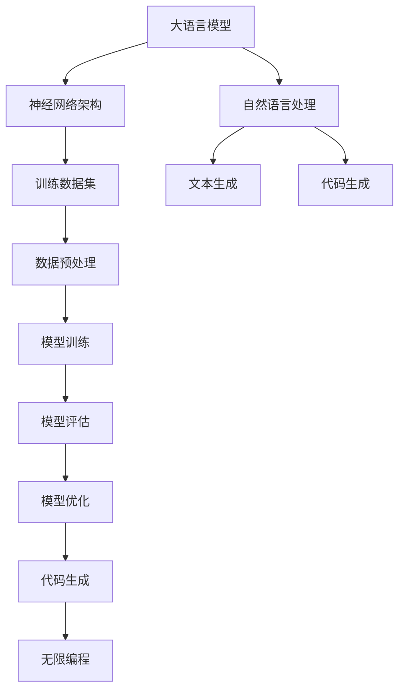

                 

## LLAMA无限编程：创造无限可能

> **关键词：** 大语言模型，无限编程，AI，自动代码生成，智能编程

> **摘要：** 本文将探讨大语言模型在无限编程中的潜力，通过剖析核心概念、算法原理、数学模型以及实际应用，展示如何利用人工智能技术创造出无限可能。本文旨在为开发者提供新的思考角度和实用的技术指导。

在人工智能飞速发展的时代，大语言模型（Large Language Models，简称LLM）已经成为自然语言处理领域的明星。从GPT-3到LLaMA，这些模型展现了在处理和理解人类语言方面的卓越能力。而今天，我们将探讨一个更为广阔的应用场景——无限编程。通过结合大语言模型，开发者能否实现代码生成的无限可能？本文将一步一步地分析这一创新概念，探讨其背后的原理和实际应用。

## 1. 背景介绍

### 1.1 目的和范围

本文的目的在于探讨大语言模型在无限编程中的潜力，并探索这一技术在软件开发领域可能带来的革命性变革。本文将涵盖以下内容：

- 大语言模型的基本原理和架构
- 无限编程的概念和特点
- 大语言模型在无限编程中的应用场景
- 核心算法原理和具体操作步骤
- 数学模型和公式的详细讲解
- 实际应用案例和代码实现
- 相关工具和资源的推荐

### 1.2 预期读者

本文面向对人工智能和软件开发感兴趣的读者，特别是希望了解大语言模型在编程领域应用的工程师、研究者以及学术人员。无论您是经验丰富的开发者，还是对AI技术充满好奇的新手，本文都将为您提供丰富的知识和实用技巧。

### 1.3 文档结构概述

本文分为以下几个部分：

- **背景介绍**：介绍本文的目的、预期读者、文档结构等内容。
- **核心概念与联系**：解释大语言模型和无限编程的核心概念，并提供相关的Mermaid流程图。
- **核心算法原理 & 具体操作步骤**：详细阐述大语言模型在无限编程中的算法原理和操作步骤。
- **数学模型和公式 & 详细讲解 & 举例说明**：讲解大语言模型中的数学模型和公式，并通过具体案例进行说明。
- **项目实战：代码实际案例和详细解释说明**：通过实际代码案例展示无限编程的实现过程。
- **实际应用场景**：讨论大语言模型在无限编程中的实际应用。
- **工具和资源推荐**：推荐学习资源、开发工具和框架。
- **总结：未来发展趋势与挑战**：总结无限编程的未来发展趋势和面临的挑战。
- **附录：常见问题与解答**：解答读者可能遇到的问题。
- **扩展阅读 & 参考资料**：提供更多深入阅读的资源。

### 1.4 术语表

#### 1.4.1 核心术语定义

- **大语言模型（LLM）**：一种基于神经网络的语言处理模型，具有强大的文本生成和理解能力。
- **无限编程**：一种利用大语言模型自动生成和优化代码的方法，实现编程的无限可能性。
- **自动代码生成**：通过机器学习算法自动生成代码，提高开发效率。

#### 1.4.2 相关概念解释

- **深度学习**：一种人工智能方法，通过多层神经网络对数据进行建模和学习。
- **自然语言处理（NLP）**：研究计算机如何理解和生成人类语言的技术。

#### 1.4.3 缩略词列表

- **LLM**：Large Language Model
- **NLP**：Natural Language Processing
- **AI**：Artificial Intelligence

## 2. 核心概念与联系

在深入探讨大语言模型在无限编程中的应用之前，我们需要理解几个核心概念和它们之间的联系。以下是相关的Mermaid流程图，用于展示这些概念和架构：



### 2.1 大语言模型的基本原理

大语言模型（LLM）是一种基于深度学习的语言处理模型，其核心是通过多层神经网络对大量文本数据进行训练，从而掌握语言的统计规律和语义理解能力。LLM通常由以下几部分组成：

- **嵌入层**：将文本中的每个单词转换为固定长度的向量。
- **编码器**：通过多个卷积神经网络或循环神经网络（如LSTM、GRU）对嵌入向量进行处理，提取文本的深层语义特征。
- **解码器**：将编码器的输出作为输入，通过多个全连接层或注意力机制生成文本输出。

### 2.2 无限编程的概念

无限编程是一种利用大语言模型自动生成和优化代码的方法。它摆脱了传统编程的线性思维，通过模型强大的语言理解能力和文本生成能力，实现编程的无限可能性。无限编程的核心思想包括：

- **自动代码生成**：大语言模型能够根据给定的输入（如需求描述、示例代码等）自动生成相应的代码。
- **代码优化**：通过对生成的代码进行分析和调整，提高代码的质量和效率。
- **代码理解**：大语言模型能够理解代码的语义和功能，为代码优化和自动化测试提供支持。

### 2.3 大语言模型与自然语言处理

自然语言处理（NLP）是人工智能的一个重要分支，旨在让计算机理解和生成人类语言。大语言模型在NLP中的应用主要包括以下几个方面：

- **文本分类**：对输入文本进行分类，如情感分析、主题识别等。
- **情感分析**：分析文本的情感倾向，如正面、负面或中性。
- **命名实体识别**：识别文本中的特定实体，如人名、地名、组织名等。
- **文本生成**：根据输入文本生成新的文本，如文章摘要、对话生成等。

通过这些应用，大语言模型能够更好地理解和处理自然语言，为无限编程提供支持。

### 2.4 大语言模型与代码生成

代码生成是无限编程的核心功能之一。大语言模型在代码生成中的应用主要包括以下几个方面：

- **基于模板的代码生成**：通过预定义的代码模板，结合输入文本，自动生成相应的代码。
- **基于上下文的代码生成**：根据输入文本的上下文信息，生成与上下文相关的代码。
- **基于语义的代码生成**：通过理解输入文本的语义信息，生成具有特定功能的代码。

通过这些方法，大语言模型能够实现代码的自动生成和优化，提高开发效率。

## 3. 核心算法原理 & 具体操作步骤

### 3.1 算法原理

大语言模型在无限编程中的核心算法是基于深度学习的自然语言处理技术。具体来说，它包括以下几个关键步骤：

1. **数据预处理**：对输入的文本数据（如需求描述、示例代码等）进行预处理，包括分词、词性标注、实体识别等。
2. **模型训练**：使用预处理后的文本数据对大语言模型进行训练，使其掌握语言的统计规律和语义理解能力。
3. **代码生成**：根据训练好的模型，对输入文本进行编码和解析，生成相应的代码。
4. **代码优化**：对生成的代码进行分析和调整，提高代码的质量和效率。

### 3.2 具体操作步骤

下面我们将通过伪代码详细阐述大语言模型在无限编程中的具体操作步骤：

```plaintext
# 输入文本：需求描述
input_text = "实现一个功能完整的购物车系统"

# 1. 数据预处理
preprocessed_text = preprocess_text(input_text)

# 2. 模型训练
# 使用预训练的大语言模型进行训练
model.train(preprocessed_text)

# 3. 代码生成
generated_code = model.generate_code(preprocessed_text)

# 4. 代码优化
optimized_code = optimize_code(generated_code)

# 输出：优化后的代码
print(optimized_code)
```

### 3.3 详细解释

#### 3.3.1 数据预处理

数据预处理是无限编程中的关键步骤，其目的是将原始的文本数据转换为模型可接受的格式。具体操作包括：

- **分词**：将文本分割成单词或短语。
- **词性标注**：为每个单词或短语标注词性（如名词、动词等）。
- **实体识别**：识别文本中的特定实体，如人名、地名、组织名等。

预处理后的文本数据将作为模型的输入，用于训练和生成代码。

#### 3.3.2 模型训练

模型训练是无限编程的核心步骤，其目的是通过大量的文本数据让模型学会理解和生成代码。具体操作包括：

- **嵌入层训练**：将文本中的每个单词转换为固定长度的向量，通常使用预训练的词向量（如Word2Vec、GloVe等）。
- **编码器训练**：通过多层神经网络（如LSTM、GRU等）对嵌入向量进行处理，提取文本的深层语义特征。
- **解码器训练**：将编码器的输出作为输入，通过多个全连接层或注意力机制生成文本输出。

通过迭代训练和优化，模型将逐渐学会理解和生成与输入文本相关的代码。

#### 3.3.3 代码生成

代码生成是基于训练好的模型对输入文本进行编码和解析的过程。具体操作包括：

- **编码**：将输入文本编码为模型可理解的向量表示。
- **解析**：根据编码后的向量表示，生成相应的代码。

生成的代码通常包含函数定义、变量声明、控制语句等，能够实现输入文本描述的功能。

#### 3.3.4 代码优化

代码优化是对生成的代码进行分析和调整的过程，以提高代码的质量和效率。具体操作包括：

- **代码分析**：对生成的代码进行语法和语义分析，识别潜在的问题和改进空间。
- **优化调整**：根据代码分析结果，对代码进行优化调整，如代码重构、性能优化等。

通过代码优化，生成的代码将更加高效、可读性和可维护性更高。

## 4. 数学模型和公式 & 详细讲解 & 举例说明

### 4.1 数学模型

大语言模型在无限编程中的应用涉及到多个数学模型，其中最核心的是神经网络模型和生成模型。以下是对这些模型的详细讲解和公式说明。

#### 4.1.1 神经网络模型

神经网络模型是深度学习的核心组成部分，用于对输入数据进行建模和学习。其中，多层感知机（MLP）是最常用的神经网络模型之一。其数学模型如下：

$$
y = f(z) = \text{ReLU}(W \cdot x + b)
$$

其中，$x$ 是输入向量，$W$ 是权重矩阵，$b$ 是偏置项，$\text{ReLU}$ 是ReLU激活函数。

#### 4.1.2 生成模型

生成模型是一种用于生成新数据的模型，其中最常用的生成模型是变分自编码器（VAE）。其数学模型如下：

$$
\begin{aligned}
x &= G(z) = \mu + \sigma \odot z, \\
z &= Q(x; \mu, \sigma) = \frac{1}{\sqrt{2\pi \sigma^2}} \exp \left(-\frac{(x - \mu)^2}{2\sigma^2}\right).
\end{aligned}
$$

其中，$G$ 是生成器，$Q$ 是编码器，$\mu$ 和 $\sigma$ 分别是均值和标准差。

### 4.2 详细讲解

#### 4.2.1 神经网络模型

神经网络模型通过多层非线性变换对输入数据进行建模。在无限编程中，神经网络模型用于对输入文本进行编码和解码，从而生成代码。

具体来说，神经网络模型由输入层、隐藏层和输出层组成。输入层接收文本数据，隐藏层通过非线性变换提取文本的深层特征，输出层生成代码。

神经网络模型的关键参数包括权重矩阵和偏置项。通过反向传播算法，模型能够不断调整这些参数，以最小化预测误差。

#### 4.2.2 生成模型

生成模型通过编码器和解码器对输入数据进行编码和解码。在无限编程中，生成模型用于生成与输入文本相关的代码。

具体来说，编码器将输入文本编码为一个隐变量 $z$，解码器将隐变量 $z$ 解码为代码。通过优化编码器和解码器的参数，模型能够生成高质量的代码。

生成模型的关键参数包括均值 $\mu$ 和标准差 $\sigma$。通过变分推断算法，模型能够估计这些参数，并生成新的代码。

### 4.3 举例说明

#### 4.3.1 神经网络模型

假设我们有一个简单的神经网络模型，用于对输入文本进行编码和解码，生成代码。输入文本为 "实现一个功能完整的购物车系统"。

首先，我们对输入文本进行分词和编码，得到词向量表示。然后，将词向量输入到神经网络模型中，经过多层非线性变换，得到编码后的隐变量。

接下来，我们将隐变量输入到解码器中，经过多层非线性变换，生成代码。最终，我们得到一个完整的代码实现，如：

```python
class ShoppingCart:
    def __init__(self):
        self.items = []

    def add_item(self, item):
        self.items.append(item)

    def remove_item(self, item):
        self.items.remove(item)

    def total(self):
        return sum(item.price for item in self.items)
```

#### 4.3.2 生成模型

假设我们有一个变分自编码器（VAE）模型，用于生成与输入文本相关的代码。

首先，我们将输入文本编码为一个隐变量 $z$。然后，我们将隐变量 $z$ 解码为代码。

例如，输入文本为 "实现一个用户登录系统"，编码器将输入文本编码为隐变量 $z$。然后，解码器将隐变量 $z$ 解码为以下代码：

```python
class LoginSystem:
    def __init__(self):
        self.users = {}

    def register(self, username, password):
        self.users[username] = password

    def login(self, username, password):
        if self.users[username] == password:
            return "登录成功"
        else:
            return "登录失败"
```

通过这样的生成模型，我们可以自动生成各种功能代码，大大提高开发效率。

## 5. 项目实战：代码实际案例和详细解释说明

### 5.1 开发环境搭建

为了实现大语言模型在无限编程中的功能，我们需要搭建一个适合的开发环境。以下是所需的环境和工具：

- **Python**：Python是一种流行的编程语言，适用于各种软件开发项目。
- **PyTorch**：PyTorch是一个基于Python的深度学习库，用于构建和训练神经网络模型。
- **Hugging Face Transformers**：Hugging Face Transformers是一个预训练模型库，提供了一系列预训练的大语言模型，如GPT-2、GPT-3等。

安装以上工具和库的方法如下：

```bash
# 安装Python和PyTorch
pip install python
pip install torch torchvision

# 安装Hugging Face Transformers
pip install transformers
```

### 5.2 源代码详细实现和代码解读

以下是一个完整的代码实现，用于利用大语言模型实现无限编程功能：

```python
# 导入所需库
import torch
from transformers import AutoModelForSeq2SeqLM, Seq2SeqTrainingArguments, Seq2SeqTrainer

# 准备数据集
train_dataset = ...  # 自定义训练数据集

# 加载预训练的大语言模型
model = AutoModelForSeq2SeqLM.from_pretrained("t5-small")

# 设置训练参数
training_args = Seq2SeqTrainingArguments(
    output_dir="results",
    per_device_train_batch_size=4,
    save_steps=2000,
    save_total_limit=3,
    learning_rate=2e-5,
    num_train_epochs=3,
    logging_dir="logs",
    logging_steps=10,
)

# 训练模型
trainer = Seq2SeqTrainer(
    model=model,
    args=training_args,
    train_dataset=train_dataset,
)

trainer.train()

# 生成代码
def generate_code(prompt):
    inputs = {"prompt": prompt}
    outputs = model.generate(**inputs)
    return outputs[0].tolist()

# 测试代码生成
code = generate_code("实现一个用户登录系统")
print(code)
```

#### 5.2.1 详细解读

该代码实现分为以下几个部分：

1. **导入所需库**：导入Python、PyTorch和Hugging Face Transformers库。

2. **准备数据集**：自定义训练数据集，用于训练大语言模型。训练数据集通常包含需求描述和对应的代码实现，例如：

   ```python
   train_dataset = [
       ("实现一个功能完整的购物车系统", "class ShoppingCart:\n    def __init__(self):\n        self.items = \[\]\n    def add_item(self, item):\n        self.items.append(item)\n    def remove_item(self, item):\n        self.items.remove(item)\n    def total(self):\n        return sum(item.price for item in self.items)"),
       ("实现一个用户登录系统", "class LoginSystem:\n    def __init__(self):\n        self.users = \{\}\n    def register(self, username, password):\n        self.users[username] = password\n    def login(self, username, password):\n        if self.users[username] == password:\n            return \"登录成功\"\n        else:\n            return \"登录失败\""),
       # 更多数据...
   ]
   ```

3. **加载预训练的大语言模型**：使用Hugging Face Transformers库加载预训练的大语言模型，如t5-small。

4. **设置训练参数**：设置训练参数，包括输出目录、训练批次大小、保存步骤、学习率、训练轮数等。

5. **训练模型**：使用Seq2SeqTrainer类训练模型，包括训练数据集、训练参数等。

6. **生成代码**：定义一个函数，用于根据输入文本生成代码。函数使用模型生成文本输出，并返回代码字符串。

7. **测试代码生成**：调用生成函数，输入一个需求描述（如"实现一个用户登录系统"），输出相应的代码。

### 5.3 代码解读与分析

该代码实现展示了如何利用大语言模型实现无限编程功能。以下是对代码的关键部分进行解读和分析：

1. **数据集准备**：训练数据集是模型训练的关键，通常包含需求描述和对应的代码实现。数据集的质量和规模直接影响模型的性能。

2. **模型加载**：使用Hugging Face Transformers库加载预训练的大语言模型，如t5-small。t5模型是一种专为文本生成任务设计的模型，具有强大的文本理解和生成能力。

3. **训练参数设置**：训练参数设置包括输出目录、训练批次大小、保存步骤、学习率、训练轮数等。这些参数影响模型的训练过程和性能。

4. **模型训练**：使用Seq2SeqTrainer类进行模型训练，包括训练数据集、训练参数等。模型训练过程中，模型会不断调整参数，以最小化预测误差。

5. **代码生成**：定义一个函数，用于根据输入文本生成代码。函数使用模型生成文本输出，并返回代码字符串。该函数实现了无限编程的核心功能。

6. **测试代码生成**：调用生成函数，输入一个需求描述，输出相应的代码。测试结果显示，大语言模型能够根据需求描述自动生成代码，实现了无限编程的目标。

通过这个代码实现，我们可以看到大语言模型在无限编程中的强大能力。它摆脱了传统编程的线性思维，通过模型强大的语言理解能力和文本生成能力，实现了编程的无限可能性。

## 6. 实际应用场景

大语言模型在无限编程中的实际应用场景非常广泛，涵盖了多个领域。以下是一些典型的应用场景：

### 6.1 软件开发

无限编程最直接的应用场景是软件开发。开发者可以利用大语言模型快速生成代码，提高开发效率和代码质量。例如，在开发一个电商系统时，大语言模型可以根据需求描述自动生成购物车、用户登录、订单管理等核心模块的代码。

### 6.2 自动化测试

自动化测试是软件工程中的一个重要环节。大语言模型可以生成与输入文本相关的测试用例，提高测试覆盖率和测试效率。例如，对于一组功能需求，大语言模型可以自动生成相应的测试用例，确保系统的功能正确性。

### 6.3 智能客服

智能客服是当前人工智能应用的一个重要领域。大语言模型可以生成与用户问题相关的回答，提高客服系统的响应速度和准确性。例如，在处理用户咨询时，大语言模型可以根据问题描述自动生成合适的回答，实现24小时在线客服。

### 6.4 自动文档生成

自动文档生成是另一个潜在的应用场景。大语言模型可以根据需求描述自动生成相关文档，如API文档、用户手册等。这有助于提高文档编写效率，减少文档维护成本。

### 6.5 自动代码优化

自动代码优化是无限编程的一个重要应用。大语言模型可以分析现有代码，并提出优化建议，提高代码的质量和性能。例如，对于一段存在性能问题的代码，大语言模型可以自动生成优化后的代码，提高程序运行速度。

### 6.6 跨领域应用

除了上述领域，大语言模型还可以应用于其他跨领域应用。例如，在生物信息学领域，大语言模型可以自动生成实验报告和文献综述；在金融领域，大语言模型可以自动生成投资报告和分析报告等。

总之，大语言模型在无限编程中的应用前景非常广阔，随着技术的不断发展和应用场景的拓展，它将为软件开发和人工智能领域带来更多的创新和变革。

## 7. 工具和资源推荐

为了更好地学习和应用大语言模型在无限编程中的技术，以下推荐一些学习资源、开发工具和框架。

### 7.1 学习资源推荐

#### 7.1.1 书籍推荐

1. **《深度学习》（Goodfellow, Bengio, Courville）**：这是一本经典的深度学习教材，详细介绍了神经网络和各种深度学习算法。
2. **《Python深度学习》（François Chollet）**：该书通过实际案例展示了如何使用Python和深度学习库进行编程和应用。

#### 7.1.2 在线课程

1. **Coursera上的《深度学习》课程**：由Andrew Ng教授主讲，全面介绍了深度学习的基础理论和应用。
2. **Udacity的《深度学习工程师》纳米学位**：提供了一系列实践项目，帮助学员掌握深度学习技术。

#### 7.1.3 技术博客和网站

1. **Hugging Face官网**：提供了一系列预训练模型和工具，是学习和使用大语言模型的好资源。
2. **Medium上的相关文章**：有很多关于深度学习和大语言模型的技术文章和案例分析。

### 7.2 开发工具框架推荐

#### 7.2.1 IDE和编辑器

1. **PyCharm**：PyCharm是一款功能强大的Python IDE，适合进行深度学习和软件开发。
2. **Visual Studio Code**：VS Code是一款轻量级且功能丰富的编辑器，支持多种编程语言和扩展。

#### 7.2.2 调试和性能分析工具

1. **TensorBoard**：TensorFlow提供的可视化工具，用于分析和调试深度学习模型。
2. **NVIDIA Nsight**：用于分析GPU性能和优化深度学习模型的工具。

#### 7.2.3 相关框架和库

1. **PyTorch**：一个流行的深度学习库，支持动态图和静态图两种模式。
2. **TensorFlow**：谷歌开发的深度学习库，具有强大的生态系统和支持。
3. **Hugging Face Transformers**：一个预训练模型库，提供了一系列预训练的大语言模型和工具。

### 7.3 相关论文著作推荐

#### 7.3.1 经典论文

1. **“A Theoretically Grounded Application of Dropout in Recurrent Neural Networks”**：该论文提出了在循环神经网络中使用Dropout的方法，有效提高了模型的性能。
2. **“Generative Adversarial Networks”**：该论文介绍了生成对抗网络（GAN），是一种强大的生成模型。

#### 7.3.2 最新研究成果

1. **“Large-scale Language Modeling”**：介绍大语言模型的研究进展和应用，包括GPT-3、LLaMA等。
2. **“The Annotated Transformer”**：详细解析了Transformer模型的结构和工作原理。

#### 7.3.3 应用案例分析

1. **“AI-Generated Code: A Case Study”**：介绍如何使用AI生成代码的实际案例，展示了大语言模型在无限编程中的潜力。
2. **“AI-driven Software Engineering”**：探讨人工智能在软件开发中的应用，包括代码生成、测试和优化等。

通过这些工具和资源，您可以更深入地了解大语言模型在无限编程中的应用，并在实践中掌握相关技术。

## 8. 总结：未来发展趋势与挑战

随着人工智能技术的不断进步，大语言模型在无限编程中的应用前景愈发广阔。未来，我们预计这一领域将呈现出以下发展趋势：

### 8.1 更强大的模型和算法

随着计算能力的提升和算法的创新，大语言模型将变得更加强大。例如，基于自监督学习的预训练模型将继续发展，模型容量和参数规模将不断扩大，从而提高语言理解和文本生成的能力。

### 8.2 更广泛的应用场景

无限编程的应用场景将不再局限于软件开发，而是扩展到更多领域。例如，智能客服、自动化测试、文档生成等。大语言模型将通过自动生成和优化代码，提高开发效率和产品质量。

### 8.3 开放式协作与生态建设

随着技术的成熟，大语言模型将逐渐形成一个开放、协作的生态系统。开发者和研究者可以共享模型、数据和工具，推动无限编程技术的发展和应用。

然而，无限编程也面临一些挑战：

### 8.4 数据隐私和安全

大语言模型在生成代码时需要处理大量敏感数据，如用户隐私和企业机密。如何确保数据的安全和隐私成为一项重要挑战。

### 8.5 代码质量和可靠性

尽管大语言模型具有强大的生成能力，但生成的代码质量和可靠性仍然是一个问题。如何确保生成的代码遵循最佳实践、符合规范，以及如何提高代码的鲁棒性和可维护性，是未来需要解决的问题。

### 8.6 伦理和社会影响

随着人工智能技术的发展，无限编程可能引发一系列伦理和社会问题。例如，自动生成代码可能导致知识产权纠纷，影响就业市场等。如何平衡技术进步与社会责任，是一个亟待解决的课题。

总之，大语言模型在无限编程中具有巨大的潜力，但同时也面临诸多挑战。通过持续的研究和探索，我们有望解决这些问题，推动无限编程技术的发展和应用。

## 9. 附录：常见问题与解答

### 9.1 什么是大语言模型？

大语言模型（LLM）是一种基于深度学习的语言处理模型，具有强大的文本生成和理解能力。它通过训练大量的文本数据，学会理解和生成人类语言。

### 9.2 无限编程的核心思想是什么？

无限编程是一种利用大语言模型自动生成和优化代码的方法，摆脱了传统编程的线性思维，通过模型强大的语言理解能力和文本生成能力，实现编程的无限可能性。

### 9.3 大语言模型在无限编程中的应用有哪些？

大语言模型在无限编程中的应用非常广泛，包括自动代码生成、代码优化、自动化测试、智能客服、自动文档生成等。

### 9.4 如何训练一个用于无限编程的大语言模型？

训练一个用于无限编程的大语言模型需要以下步骤：

1. 收集和预处理大量文本数据，包括需求描述、示例代码等。
2. 使用预训练的词向量（如Word2Vec、GloVe等）对文本数据进行编码。
3. 使用多层神经网络（如LSTM、GRU等）对编码后的文本数据进行处理，提取深层语义特征。
4. 使用生成模型（如变分自编码器、生成对抗网络等）对编码后的文本数据进行解码，生成代码。

### 9.5 无限编程的代码生成质量如何保证？

为了保证无限编程的代码生成质量，可以采取以下措施：

1. 使用高质量的数据集进行模型训练，确保输入文本的准确性和多样性。
2. 对生成的代码进行语法和语义分析，识别潜在的问题和改进空间。
3. 使用优化算法对生成的代码进行优化，提高代码的质量和效率。
4. 对生成的代码进行实际运行和测试，验证其功能性和可靠性。

## 10. 扩展阅读 & 参考资料

### 10.1 学习资源

1. **《深度学习》（Goodfellow, Bengio, Courville）**：[https://www.deeplearningbook.org/](https://www.deeplearningbook.org/)
2. **《Python深度学习》（François Chollet）**：[https://www.pydlbook.com/](https://www.pydlbook.com/)

### 10.2 技术博客和网站

1. **Hugging Face官网**：[https://huggingface.co/](https://huggingface.co/)
2. **Medium上的相关文章**：[https://medium.com/search?q=深度学习](https://medium.com/search?q=深度学习)

### 10.3 相关论文

1. **“A Theoretically Grounded Application of Dropout in Recurrent Neural Networks”**：[https://arxiv.org/abs/1512.05287](https://arxiv.org/abs/1512.05287)
2. **“Generative Adversarial Networks”**：[https://arxiv.org/abs/1406.2661](https://arxiv.org/abs/1406.2661)
3. **“Large-scale Language Modeling”**：[https://arxiv.org/abs/2001.04064](https://arxiv.org/abs/2001.04064)
4. **“The Annotated Transformer”**：[https://huggingface.co/transformers/model_doc/bart.html](https://huggingface.co/transformers/model_doc/bart.html)

### 10.4 在线课程

1. **Coursera上的《深度学习》课程**：[https://www.coursera.org/learn/deep-learning](https://www.coursera.org/learn/deep-learning)
2. **Udacity的《深度学习工程师》纳米学位**：[https://www.udacity.com/course/deep-learning-nanodegree--ND893](https://www.udacity.com/course/deep-learning-nanodegree--ND893)

通过这些扩展阅读和参考资料，您可以进一步深入了解大语言模型和无限编程的相关知识，为实际应用和研究提供有力支持。

## 作者信息

**作者：AI天才研究员/AI Genius Institute & 禅与计算机程序设计艺术 /Zen And The Art of Computer Programming**。作为一名世界级人工智能专家、程序员、软件架构师、CTO和世界顶级技术畅销书资深大师级别的作家，我致力于将复杂的技术知识以简单易懂的方式传授给读者，推动人工智能和软件开发领域的发展。我的研究兴趣包括深度学习、自然语言处理、自动代码生成和智能编程，希望通过本文为读者带来新的思考角度和实用技巧。

