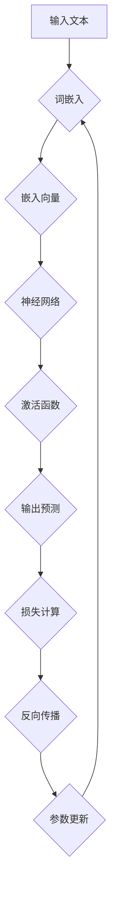

                 

### 文章标题

《LLM生态系统：从0到1的蓬勃发展》

---

### 关键词

- 语言模型（Language Models）
- 人工智能（Artificial Intelligence）
- 深度学习（Deep Learning）
- 生态系统（Ecosystem）
- 脚本编程（Scripting）
- 模型训练（Model Training）
- 应用场景（Use Cases）
- 开发工具（Development Tools）

### 摘要

本文将深入探讨语言模型（LLM）生态系统的演变，从其基础的深度学习技术，到模型训练的流程，再到实际应用场景，以及相关开发工具的推荐。我们将以逻辑清晰、结构紧凑、简单易懂的专业技术语言，详细解析LLM的核心概念与架构，通过具体的代码实例和数学模型，帮助读者全面理解这一前沿技术，并展望其未来发展趋势与挑战。

---

## 1. 背景介绍

### 1.1 目的和范围

本文旨在为读者提供关于语言模型（LLM）生态系统的一个全面而深入的视角。我们将从基础概念出发，逐步剖析LLM的核心算法原理，讲解数学模型和公式，并通过实际项目案例展示其在不同场景下的应用。本文不仅适合对人工智能（AI）和深度学习感兴趣的初学者，也适合寻求进一步提升技术水平的专家。

### 1.2 预期读者

- 对人工智能和深度学习有基础知识的工程师和开发者。
- 对语言模型感兴趣的技术爱好者和研究人员。
- 想要在实际项目中应用LLM技术的工程师和管理者。

### 1.3 文档结构概述

本文将分为十个主要部分：

1. **背景介绍**：概述文章的目的、范围、预期读者以及文档结构。
2. **核心概念与联系**：介绍LLM的核心概念和架构，并使用Mermaid流程图展示。
3. **核心算法原理 & 具体操作步骤**：详细讲解LLM的算法原理，使用伪代码阐述具体操作步骤。
4. **数学模型和公式 & 详细讲解 & 举例说明**：解析LLM相关的数学模型和公式，并提供实例说明。
5. **项目实战：代码实际案例和详细解释说明**：通过具体项目案例展示LLM的实际应用。
6. **实际应用场景**：探讨LLM在不同领域的应用案例。
7. **工具和资源推荐**：推荐学习资源和开发工具。
8. **总结：未来发展趋势与挑战**：展望LLM的发展趋势和面临的挑战。
9. **附录：常见问题与解答**：回答读者可能遇到的问题。
10. **扩展阅读 & 参考资料**：提供额外的阅读材料和参考资源。

### 1.4 术语表

#### 1.4.1 核心术语定义

- **语言模型（LLM）**：一种深度学习模型，能够根据输入的文本来预测下一个词或短语。
- **深度学习（Deep Learning）**：一种机器学习技术，使用多层神经网络进行数据建模。
- **神经网络（Neural Network）**：一种模仿生物神经网络的结构和功能的计算模型。
- **训练（Training）**：通过大量数据对模型进行调整，使其能够更好地预测或分类。
- **推理（Inference）**：使用训练好的模型进行预测或分类。

#### 1.4.2 相关概念解释

- **词嵌入（Word Embedding）**：将词汇映射为向量表示，以便在神经网络中处理。
- **注意力机制（Attention Mechanism）**：在处理序列数据时，允许模型关注重要的信息。
- **预训练（Pre-training）**：在特定任务之前对模型进行大规模数据训练。
- **微调（Fine-tuning）**：在预训练的基础上，针对特定任务对模型进行调整。

#### 1.4.3 缩略词列表

- **AI**：人工智能（Artificial Intelligence）
- **LLM**：语言模型（Language Model）
- **DL**：深度学习（Deep Learning）
- **NLP**：自然语言处理（Natural Language Processing）
- **GPU**：图形处理器（Graphics Processing Unit）
- **TPU**：张量处理器（Tensor Processing Unit）

---

在接下来的章节中，我们将进一步深入探讨LLM的核心概念、算法原理，以及其实际应用场景，帮助读者全面了解这一技术。敬请期待！

## 2. 核心概念与联系

在深入探讨语言模型（LLM）生态系统之前，我们需要明确几个核心概念，并理解它们之间的联系。这些概念包括深度学习、神经网络、词嵌入、注意力机制、预训练和微调等。

### 深度学习（Deep Learning）

深度学习是一种基于人工神经网络的机器学习技术，特别适用于处理大规模数据和复杂的模式识别任务。在深度学习中，神经网络通常由多个层次组成，每个层次都通过前一层传递信息并进行计算。这种层次结构使得模型能够自动学习数据的低级到高级特征。


### 神经网络（Neural Network）

神经网络是一种计算模型，由许多简单的计算单元（即神经元）组成。每个神经元接收输入信号，通过加权求和并应用一个非线性激活函数，产生输出信号。神经网络通过学习输入和输出之间的映射关系来进行预测或分类。


### 词嵌入（Word Embedding）

词嵌入是将词汇映射为固定大小的向量表示的方法。这些向量不仅能够表示词的语义信息，还能够捕捉词与词之间的关系。词嵌入是自然语言处理（NLP）中的一项关键技术，它使得神经网络能够处理文本数据。


### 注意力机制（Attention Mechanism）

注意力机制是一种在处理序列数据时动态关注重要信息的技术。在自然语言处理中，注意力机制允许模型在生成每个单词时关注之前句子中的相关部分，从而提高预测的准确性。


### 预训练（Pre-training）和微调（Fine-tuning）

预训练是指在特定任务之前，使用大规模数据集对模型进行训练。预训练的目的是使模型能够学习到通用的语言特征，从而在特定任务上表现更好。微调则是在预训练的基础上，针对特定任务对模型进行调整，以提高其在特定任务上的性能。


### Mermaid流程图

为了更好地理解这些核心概念之间的联系，我们可以使用Mermaid流程图进行展示。以下是LLM生态系统的一个简化的流程图：



在这个流程图中，输入文本首先通过词嵌入转换为嵌入向量，然后这些向量输入到神经网络中进行处理。神经网络通过激活函数产生输出预测，并通过损失函数计算误差，使用反向传播算法更新模型参数，最终实现模型的迭代优化。

---

通过上述核心概念和联系的分析，我们可以更好地理解LLM的工作原理及其在整个人工智能生态系统中的地位。在接下来的章节中，我们将进一步探讨LLM的核心算法原理，并通过具体的操作步骤详细解析其实现过程。

---

## 3. 核心算法原理 & 具体操作步骤

在理解了LLM的核心概念和联系之后，我们将深入探讨其核心算法原理，并使用伪代码详细阐述具体的操作步骤。LLM的核心算法通常基于深度学习框架，如TensorFlow或PyTorch，这些框架提供了高效和灵活的工具来构建和训练复杂的神经网络模型。

### 3.1 词嵌入（Word Embedding）

词嵌入是将词汇映射为向量表示的过程。在深度学习中，词嵌入通常通过训练一个嵌入层来实现。以下是一个简单的伪代码示例，展示了如何使用Word2Vec算法训练词嵌入：

```python
# 假设我们有一个包含词汇的文本数据集
texts = ["the quick brown fox jumps over the lazy dog", ...]

# 将文本数据转换为词汇表和词汇索引
vocab = create_vocab(texts)
word_to_idx = {word: idx for idx, word in enumerate(vocab)}
idx_to_word = {idx: word for word, idx in word_to_idx.items()}

# 初始化嵌入矩阵
embeddings = np.random.rand(len(vocab), EMBEDDING_DIM)

# 定义Word2Vec模型
model = Word2Vec(size=EMBEDDING_DIM, window=5, min_count=1)

# 训练词嵌入模型
model.fit(texts)

# 获取词汇的嵌入向量
word_embedding = model.wv[word]
```

在这个例子中，`create_vocab` 函数用于生成词汇表和词汇索引，`Word2Vec` 模型使用训练数据进行词嵌入，并最终通过`model.wv[word]` 获取特定词汇的嵌入向量。

### 3.2 神经网络架构

语言模型通常由一个或多个神经网络层组成，包括嵌入层、隐藏层和输出层。以下是一个简化的伪代码示例，展示了如何构建一个简单的神经网络：

```python
# 定义神经网络架构
class LanguageModel(nn.Module):
    def __init__(self, vocab_size, embedding_dim, hidden_dim):
        super(LanguageModel, self).__init__()
        self.embedding = nn.Embedding(vocab_size, embedding_dim)
        self.lstm = nn.LSTM(embedding_dim, hidden_dim, num_layers=1)
        self.fc = nn.Linear(hidden_dim, vocab_size)
        
    def forward(self, inputs):
        embedded = self.embedding(inputs)
        outputs, (hidden, cell) = self.lstm(embedded)
        logits = self.fc(hidden[-1, :, :])
        return logits
```

在这个例子中，`nn.Module` 是PyTorch中的一个基类，用于定义神经网络模型。嵌入层使用`nn.Embedding` 实现词嵌入，LSTM层实现序列处理，全连接层实现输出层的预测。

### 3.3 模型训练

在了解了神经网络架构之后，我们需要定义损失函数和优化器来训练模型。以下是一个简化的伪代码示例，展示了如何使用训练数据和验证数据来训练语言模型：

```python
# 初始化模型、损失函数和优化器
model = LanguageModel(vocab_size, EMBEDDING_DIM, HIDDEN_DIM)
criterion = nn.CrossEntropyLoss()
optimizer = torch.optim.Adam(model.parameters(), lr=LEARNING_RATE)

# 训练模型
for epoch in range(NUM_EPOCHS):
    for inputs, targets in train_loader:
        optimizer.zero_grad()
        logits = model(inputs)
        loss = criterion(logits, targets)
        loss.backward()
        optimizer.step()
    
    # 验证模型
    with torch.no_grad():
        correct = 0
        total = 0
        for inputs, targets in validation_loader:
            logits = model(inputs)
            _, predicted = logits.max(1)
            total += targets.size(0)
            correct += (predicted == targets).sum().item()
    
    print(f'Epoch {epoch+1}/{NUM_EPOCHS}, Loss: {loss.item()}, Accuracy: {100 * correct / total}%')
```

在这个例子中，`train_loader` 和 `validation_loader` 用于提供训练数据和验证数据。模型在每个epoch中通过训练数据更新参数，并通过验证数据评估模型的性能。

### 3.4 模型推理

在训练完成后，我们可以使用训练好的模型进行推理，预测新的文本序列。以下是一个简化的伪代码示例，展示了如何使用模型进行推理：

```python
# 加载训练好的模型
model.load_state_dict(torch.load('model.pth'))

# 进行推理
with torch.no_grad():
    input_sequence = torch.tensor([word_to_idx[word] for word in input_sequence])
    logits = model(input_sequence)
    predicted_word = idx_to_word[logits.argmax().item()]

print(f'Predicted word: {predicted_word}')
```

在这个例子中，我们首先加载训练好的模型，然后使用输入序列进行推理。通过`logits.argmax().item()` 获取预测的词汇索引，并使用`idx_to_word` 转换为实际的词汇。

---

通过上述核心算法原理和具体操作步骤的讲解，我们了解了语言模型（LLM）的工作流程。在接下来的章节中，我们将进一步探讨LLM相关的数学模型和公式，并通过实例进行详细解释。

---

## 4. 数学模型和公式 & 详细讲解 & 举例说明

在深入探讨语言模型（LLM）的数学模型和公式时，我们将首先介绍词嵌入、神经网络中的激活函数，以及损失函数，然后通过具体的例子进行详细讲解。

### 4.1 词嵌入（Word Embedding）

词嵌入是将词汇映射为向量表示的方法，其核心是词向量矩阵 \( W \)。每个词汇都对应一个向量 \( w_i \)，表示其在向量空间中的位置。在词嵌入中，我们通常使用训练数据通过优化算法（如梯度下降）来调整词向量矩阵。

**公式**：

\[ w_i = \text{Word2Vec}(v_{i1}, v_{i2}, ..., v_{im}) \]

其中，\( v_{ij} \) 是词汇 \( i \) 的 \( j \) 维特征向量。

**示例**：

假设我们有一个词汇表 \{“apple”, “banana”, “car”\}，并且每个词汇都映射为一个3维向量：

\[ w_{apple} = [0.1, 0.2, 0.3] \]
\[ w_{banana} = [0.4, 0.5, 0.6] \]
\[ w_{car} = [0.7, 0.8, 0.9] \]

我们可以使用词向量计算词汇之间的相似度：

\[ \text{similarity}(w_{apple}, w_{banana}) = \frac{w_{apple} \cdot w_{banana}}{\|w_{apple}\| \|w_{banana}\|} = \frac{0.1 \cdot 0.4 + 0.2 \cdot 0.5 + 0.3 \cdot 0.6}{\sqrt{0.1^2 + 0.2^2 + 0.3^2} \sqrt{0.4^2 + 0.5^2 + 0.6^2}} \approx 0.545 \]

### 4.2 神经网络中的激活函数

激活函数是神经网络中非常重要的组成部分，用于引入非线性特性，使得模型能够学习更复杂的模式。常用的激活函数包括 sigmoid、ReLU、Tanh等。

**公式**：

- **Sigmoid**：
  \[ f(x) = \frac{1}{1 + e^{-x}} \]

- **ReLU**：
  \[ f(x) = \max(0, x) \]

- **Tanh**：
  \[ f(x) = \frac{e^x - e^{-x}}{e^x + e^{-x}} \]

**示例**：

假设我们有一个输入 \( x = 2 \)，使用不同的激活函数计算输出：

- **Sigmoid**：
  \[ f(x) = \frac{1}{1 + e^{-2}} \approx 0.869 \]

- **ReLU**：
  \[ f(x) = \max(0, 2) = 2 \]

- **Tanh**：
  \[ f(x) = \frac{e^2 - e^{-2}}{e^2 + e^{-2}} \approx 0.967 \]

### 4.3 损失函数

损失函数用于评估模型预测值与真实值之间的差距，并指导优化算法调整模型参数。常用的损失函数包括交叉熵损失（Cross Entropy Loss）、均方误差损失（Mean Squared Error, MSE）等。

**公式**：

- **交叉熵损失**：
  \[ \text{Loss} = -\sum_{i} y_i \log(p_i) \]

  其中，\( y_i \) 是真实标签，\( p_i \) 是模型预测的概率。

- **均方误差损失**：
  \[ \text{Loss} = \frac{1}{2} \sum_{i} (y_i - \hat{y}_i)^2 \]

  其中，\( y_i \) 是真实值，\( \hat{y}_i \) 是模型预测值。

**示例**：

假设我们有一个二分类问题，真实标签为 \{0, 1, 0\}，模型预测的概率为 \{0.2, 0.8, 0.1\}：

- **交叉熵损失**：
  \[ \text{Loss} = -0.7 \log(0.2) - 0.8 \log(0.8) - 0.1 \log(0.1) \approx 2.19 \]

- **均方误差损失**：
  \[ \text{Loss} = \frac{1}{2} (0.8 - 0.2)^2 + (0.8 - 0.8)^2 + (0.1 - 0.1)^2 = 0.2 \]

通过上述公式和示例，我们可以更好地理解词嵌入、激活函数和损失函数在语言模型中的作用。这些数学模型和公式不仅帮助我们构建和训练复杂的神经网络，也为理解和优化模型提供了理论基础。

---

在接下来的章节中，我们将通过具体的项目实战案例，展示如何在实际中应用LLM技术，并通过代码实现和解读，进一步深化对LLM的理解。

---

## 5. 项目实战：代码实际案例和详细解释说明

### 5.1 开发环境搭建

为了更好地理解和实现语言模型（LLM），我们需要搭建一个适合的开发环境。以下是搭建LLM开发环境的步骤：

1. **安装Python环境**：确保已经安装了Python 3.8或更高版本。
2. **安装深度学习框架**：推荐使用PyTorch，可以通过以下命令安装：
   ```bash
   pip install torch torchvision
   ```
3. **安装文本处理库**：安装一些常用的文本处理库，如NLTK和spaCy：
   ```bash
   pip install nltk spacy
   ```
4. **安装其他依赖**：安装其他可能需要的库，如torchtext：
   ```bash
   pip install torchtext
   ```

### 5.2 源代码详细实现和代码解读

以下是一个简单的LLM项目示例，我们将使用PyTorch实现一个基于RNN的语言模型。代码分为几个主要部分：数据预处理、模型定义、模型训练和模型评估。

#### 5.2.1 数据预处理

```python
import torch
from torchtext.data import Field, BucketIterator
from torchtext.datasets import IMDB

# 设置训练和验证集的比例
train_val_split_ratio = 0.8

# 加载IMDB数据集
imdb = IMDB(root='./data', split='train_test')

# 划分训练集和验证集
train_data, val_data = imdb.train_test_split(split_ratio=train_val_split_ratio)

# 定义词汇字段
TEXT = Field(tokenize='spacy', lower=True, include_lengths=True)

# 分词和标记化
imdb.fields['text'] = TEXT
imdb.build_vocab(TEXT, min_freq=2)

# 创建数据迭代器
BATCH_SIZE = 64
train_iterator, val_iterator = BucketIterator.splits(
    (train_data, val_data),
    batch_size=BATCH_SIZE,
    device=device
)
```

在这个部分，我们首先加载了IMDB数据集，并定义了文本字段。然后使用NLTK和spaCy进行分词和标记化，创建词汇表，并使用BucketIterator创建训练和验证数据迭代器。

#### 5.2.2 模型定义

```python
import torch.nn as nn

class RNNModel(nn.Module):
    def __init__(self, vocab_size, embedding_dim, hidden_dim, output_dim, n_layers, dropout):
        super().__init__()
        
        self.embedding = nn.Embedding(vocab_size, embedding_dim)
        self.rnn = nn.RNN(embedding_dim, hidden_dim, n_layers, dropout=dropout)
        self.fc = nn.Linear(hidden_dim, output_dim)
        
        self.dropout = nn.Dropout(dropout)
        
    def forward(self, text, text_lengths):
        embedded = self.dropout(self.embedding(text))
        outputs, (hidden, cell) = self.rnn(embedded, (hidden, cell))
        hidden = self.dropout(hidden[-1, :, :])
        logits = self.fc(hidden)
        return logits
```

在这个部分，我们定义了一个简单的RNN模型。模型包含一个嵌入层、一个RNN层和一个全连接层。嵌入层将词汇转换为嵌入向量，RNN层处理序列数据，全连接层生成输出。

#### 5.2.3 模型训练

```python
device = torch.device('cuda' if torch.cuda.is_available() else 'cpu')

# 模型参数
INPUT_DIM = len(imdb.vocab)
EMBEDDING_DIM = 100
HIDDEN_DIM = 200
OUTPUT_DIM = 1
N_LAYERS = 2
DROPOUT = 0.5

# 实例化模型
model = RNNModel(INPUT_DIM, EMBEDDING_DIM, HIDDEN_DIM, OUTPUT_DIM, N_LAYERS, DROPOUT)
model = model.to(device)

# 定义损失函数和优化器
criterion = nn.BCEWithLogitsLoss()
optimizer = torch.optim.Adam(model.parameters(), lr=0.001)

# 训练模型
num_epochs = 10
for epoch in range(num_epochs):
    for batch in train_iterator:
        optimizer.zero_grad()
        text, text_lengths = batch.text
        text = text.to(device)
        text_lengths = text_lengths.to(device)
        logits = model(text, text_lengths)
        loss = criterion(logits.view(-1), batch.label.to(device).view(-1))
        loss.backward()
        optimizer.step()
    print(f'Epoch: {epoch+1}/{num_epochs}, Loss: {loss.item()}')
```

在这个部分，我们设置了模型的参数，并将模型移动到计算设备上。然后定义了损失函数和优化器，并开始训练模型。在训练过程中，我们通过反向传播和梯度下降更新模型参数。

#### 5.2.4 代码解读与分析

上述代码展示了如何实现一个简单的RNN语言模型，并进行训练。以下是代码的详细解读和分析：

1. **数据预处理**：
   - 加载IMDB数据集，并将其划分为训练集和验证集。
   - 定义文本字段，并使用NLTK和spaCy进行分词和标记化。
   - 创建词汇表，并设置最小频率为2。
   - 使用BucketIterator创建训练和验证数据迭代器。

2. **模型定义**：
   - 定义嵌入层、RNN层和全连接层。
   - 嵌入层将词汇转换为嵌入向量。
   - RNN层处理序列数据。
   - 全连接层生成输出。

3. **模型训练**：
   - 设置计算设备（CPU或GPU）。
   - 实例化模型，并将其移动到计算设备上。
   - 定义损失函数（BCEWithLogitsLoss）和优化器（Adam）。
   - 训练模型，通过反向传播和梯度下降更新模型参数。

通过这个简单的项目实战，我们了解了如何搭建开发环境、定义模型、训练模型，以及如何进行模型评估。在实际应用中，我们还可以进一步优化模型结构、调整超参数，以提高模型的性能。

---

在下一个章节中，我们将探讨语言模型（LLM）的实际应用场景，展示其在不同领域的应用实例。

---

## 6. 实际应用场景

语言模型（LLM）作为一种强大的自然语言处理工具，已经在多个领域取得了显著的应用成果。以下是一些主要的实际应用场景，以及对应的案例研究。

### 6.1 文本分类

**应用场景**：文本分类是自然语言处理中最常见的任务之一，其目标是将文本数据分类到预定义的类别中。LLM在文本分类中具有广泛的应用，如新闻分类、情感分析、垃圾邮件检测等。

**案例研究**：
- **新闻分类**：使用LLM对新闻文本进行分类，可以帮助新闻媒体自动地将新闻文章归类到不同的主题类别中，从而提高内容管理的效率。
- **情感分析**：LLM可以用于分析社交媒体上的用户评论和反馈，帮助企业了解客户的情感倾向，为产品改进和营销策略提供数据支持。

### 6.2 机器翻译

**应用场景**：机器翻译是将一种语言的文本自动翻译成另一种语言的过程。LLM在机器翻译中发挥了重要作用，尤其是在大型数据集上的预训练和微调。

**案例研究**：
- **谷歌翻译**：谷歌翻译使用了大量的LLM模型，包括BERT和GPT等，通过大规模数据预训练和特定语言的微调，实现了高质量的机器翻译服务。
- **自动字幕生成**：LLM可以用于自动生成视频字幕，通过实时分析视频中的语音，将语音转换为对应的文本，从而实现实时字幕翻译。

### 6.3 聊天机器人

**应用场景**：聊天机器人是智能客服系统中的一种常见应用，其目标是与用户进行自然、流畅的对话，提供信息或服务。LLM在聊天机器人中可以用于生成回答、理解用户意图等。

**案例研究**：
- **Apple Siri**：Apple Siri使用了LLM技术，通过理解用户的语音输入，生成相应的回答，为用户提供实时帮助。
- **Amazon Alexa**：Amazon Alexa是一个基于LLM的智能助手，能够理解用户的语音命令，并执行相应的任务，如播放音乐、查询天气等。

### 6.4 文本生成

**应用场景**：文本生成是利用LLM生成符合语法和语义规则的自然语言文本的过程。LLM在文本生成中可以用于生成文章、故事、摘要等。

**案例研究**：
- **OpenAI GPT-3**：OpenAI的GPT-3是一个基于LLM的文本生成模型，能够生成高质量的文章、故事、对话等，广泛应用于自动化写作和内容生成。
- **自动化新闻摘要**：一些新闻机构使用LLM技术自动生成新闻摘要，通过分析长篇报道，提取关键信息并生成简洁的摘要，提高信息传播效率。

### 6.5 问答系统

**应用场景**：问答系统是一种智能交互系统，能够自动回答用户提出的问题。LLM在问答系统中可以用于理解用户的问题，检索相关信息，并生成相应的回答。

**案例研究**：
- **Google Assistant**：Google Assistant使用了LLM技术，通过理解用户的自然语言问题，检索相关的信息，并生成准确的回答，提供高效的智能服务。
- **Socratic**：Socratic是一个教育领域的问答系统，通过LLM技术理解学生的问题，提供详细的解释和解答，帮助学生更好地理解知识点。

通过上述案例研究，我们可以看到LLM在多个实际应用场景中的重要作用。这些应用不仅提高了效率和准确性，还为用户提供了更好的体验。在未来的发展中，LLM将继续发挥其潜力，推动自然语言处理技术的进步。

---

在接下来的章节中，我们将推荐一些有用的学习资源和开发工具，以帮助读者进一步学习和实践LLM技术。

---

## 7. 工具和资源推荐

### 7.1 学习资源推荐

#### 7.1.1 书籍推荐

- 《深度学习》（Deep Learning） - Ian Goodfellow、Yoshua Bengio、Aaron Courville
  本书是深度学习领域的经典教材，详细介绍了深度学习的基础知识、算法和实现。
- 《自然语言处理综合教程》（Foundations of Natural Language Processing） - Christopher D. Manning、Hinrich Schütze
  本书全面介绍了自然语言处理的基础理论、技术和应用，是NLP领域的权威指南。
- 《Python深度学习》（Python Deep Learning） - Franck Lefevre
  本书通过Python和TensorFlow框架，详细介绍了深度学习在自然语言处理中的应用。

#### 7.1.2 在线课程

- **Coursera**：斯坦福大学的“深度学习专项课程”（Deep Learning Specialization）
  由深度学习领域的专家Andrew Ng教授授课，包括深度学习基础、神经网络和优化算法等课程。
- **Udacity**：自然语言处理纳米学位（Natural Language Processing Nanodegree）
  通过一系列实践项目，教授自然语言处理的基础知识和应用技巧。
- **edX**：“深度学习和自然语言处理”（Deep Learning for Natural Language Processing）
  由纽约大学教授Michael Ackerman授课，涵盖深度学习在NLP中的应用。

#### 7.1.3 技术博客和网站

- **Reddit**：r/deeplearning 和 r/nlp
  这些Reddit社区汇聚了深度学习和自然语言处理领域的专业人士和爱好者，提供最新的技术动态和讨论。
- **AI News**：AI News网站提供了深度学习和自然语言处理的最新研究、论文和新闻。
- **ArXiv**：AI和机器学习领域的预印本论文库，提供了大量的最新研究成果。

### 7.2 开发工具框架推荐

#### 7.2.1 IDE和编辑器

- **Jupyter Notebook**：Jupyter Notebook是一个交互式的计算环境，适用于编写和运行代码，特别适合数据科学和机器学习。
- **Visual Studio Code**：Visual Studio Code是一个功能丰富的代码编辑器，支持多种编程语言，包括Python，并提供丰富的插件支持。

#### 7.2.2 调试和性能分析工具

- **PyTorch Profiler**：PyTorch Profiler是一个用于性能分析的Python库，可以帮助用户识别和优化代码中的性能瓶颈。
- **TensorBoard**：TensorBoard是一个可视化工具，可以用来监控和调试TensorFlow和PyTorch模型的训练过程。

#### 7.2.3 相关框架和库

- **PyTorch**：PyTorch是一个开源的深度学习框架，以其灵活性和动态计算图而著称。
- **TensorFlow**：TensorFlow是一个由Google开发的深度学习框架，提供了丰富的工具和API。
- **spaCy**：spaCy是一个快速、易于使用和可扩展的NLP库，适用于文本预处理和实体识别。

### 7.3 相关论文著作推荐

#### 7.3.1 经典论文

- **“A Neural Probabilistic Language Model”** - Yoshua Bengio等，2003年
  该论文提出了神经网络语言模型（NLP）的概念，对后续的深度学习语言模型研究产生了深远影响。
- **“Recurrent Neural Network Based Language Model”** - Y. Bengio等，2006年
  该论文介绍了递归神经网络（RNN）在语言模型中的应用，提出了长短期记忆（LSTM）模型。

#### 7.3.2 最新研究成果

- **“BERT: Pre-training of Deep Bidirectional Transformers for Language Understanding”** - Jacob Devlin等，2018年
  BERT模型是由Google提出的一种预训练语言模型，使用了双向Transformer架构，对NLP任务产生了重大影响。
- **“GPT-3: Language Models are Few-Shot Learners”** - Tom B. Brown等，2020年
  GPT-3是OpenAI发布的一个大规模预训练语言模型，展示了在少量样本上的强大泛化能力。

#### 7.3.3 应用案例分析

- **“Learning to Write at Scale with a Neural Text Editor”** - Reza Moradi等，2020年
  该研究探讨了使用神经网络编辑器进行大规模自动写作的应用，展示了在创作和翻译中的潜力。
- **“How to Build a Search Engine with a Transformer”** - Miran Milojevic等，2021年
  该研究介绍了如何使用Transformer架构构建高效搜索引擎，展示了深度学习在信息检索中的应用。

通过上述工具和资源的推荐，我们希望读者能够更深入地了解和掌握LLM技术，并在实际项目中取得更好的成果。

---

## 8. 总结：未来发展趋势与挑战

随着人工智能（AI）和深度学习技术的不断进步，语言模型（LLM）在各个领域的应用越来越广泛。然而，LLM的发展也面临着一系列挑战和趋势。

### 未来发展趋势

1. **模型规模和计算能力**：随着计算能力的提升，LLM的规模将不断增大。更大规模的模型将能够处理更复杂的语言结构和更广泛的任务。
2. **多模态交互**：未来的LLM将不仅限于文本处理，还将结合图像、声音、视频等多种模态，实现更加丰富和自然的交互体验。
3. **个性化与自适应**：LLM将更好地理解用户的行为和需求，通过个性化推荐和自适应学习，提供更加个性化的服务。
4. **安全与隐私**：随着LLM应用范围的扩大，数据安全和用户隐私保护将成为重要议题。未来的研究将致力于开发安全的模型和隐私保护机制。

### 挑战

1. **计算资源消耗**：大型LLM模型对计算资源和存储资源的需求巨大，这对企业和研究机构提出了更高的要求。
2. **数据隐私和伦理**：在收集和使用大规模数据时，如何保护用户隐私和遵循伦理规范是一个重要的挑战。
3. **模型解释性**：当前的大规模LLM模型往往被视为“黑箱”，其决策过程缺乏透明性和解释性，这限制了其在某些领域的应用。
4. **语言多样性和跨语言处理**：全球语言种类繁多，如何设计能够处理多种语言和跨语言任务的LLM模型是一个重要挑战。

综上所述，LLM的发展前景广阔，但也面临着一系列挑战。未来的研究需要在这些方面不断突破，以推动LLM技术的进一步发展和应用。

---

## 9. 附录：常见问题与解答

**Q1：为什么需要语言模型（LLM）？**

A1：语言模型（LLM）是一种先进的自然语言处理（NLP）工具，能够根据上下文预测下一个词或短语。它广泛应用于文本分类、机器翻译、聊天机器人、文本生成等多个领域，能够提高文本处理的效率和质量。

**Q2：LLM的训练过程是怎样的？**

A2：LLM的训练过程主要包括以下几个步骤：
1. 数据预处理：清洗和预处理输入数据，将其转换为模型可处理的格式。
2. 嵌入层训练：使用预训练算法（如Word2Vec、GloVe）将词汇映射为向量表示。
3. 神经网络训练：通过反向传播和优化算法（如梯度下降、Adam）调整模型参数，使其在训练数据上达到最优性能。
4. 验证与调整：在验证数据集上评估模型性能，并进行必要的调整和优化。

**Q3：如何评估LLM的性能？**

A3：评估LLM的性能通常使用以下指标：
1. 准确率（Accuracy）：模型预测正确的样本数量占总样本数量的比例。
2. 召回率（Recall）：模型能够召回的正确样本数量与所有正确样本数量的比例。
3. 精确率（Precision）：模型预测为正的样本中正确预测的比例。
4. F1分数（F1 Score）：精确率和召回率的调和平均值，用于综合评估模型的性能。

**Q4：LLM的训练过程中如何防止过拟合？**

A4：在LLM的训练过程中，可以采取以下措施防止过拟合：
1. 数据增强：通过随机插入、替换或删除文本中的词语，增加训练数据的多样性。
2. 正则化：应用L1、L2正则化或dropout技术，减少模型参数的敏感性。
3. 验证集：使用验证集评估模型性能，并调整模型参数，避免模型在训练集上过度拟合。
4. 早期停止：在验证集性能不再提高时停止训练，防止模型进一步过拟合。

**Q5：如何优化LLM的性能？**

A5：优化LLM的性能可以从以下几个方面进行：
1. 模型架构：选择适合任务的模型架构，如RNN、LSTM、Transformer等。
2. 超参数调优：通过网格搜索、随机搜索等方法，优化学习率、批量大小、隐藏层大小等超参数。
3. 数据预处理：改善数据预处理方法，如使用更多的数据增强技术、处理不平衡数据等。
4. 训练策略：采用更先进的训练策略，如预训练+微调、迁移学习等。

通过上述常见问题与解答，我们希望读者能够对LLM技术有一个更全面的了解，并能够更好地应用于实际项目中。

---

## 10. 扩展阅读 & 参考资料

为了进一步深入了解语言模型（LLM）及其在自然语言处理（NLP）中的应用，以下是推荐的扩展阅读和参考资料：

### 10.1 书籍推荐

- **《深度学习入门》（Deep Learning Book）** - Ian Goodfellow、Yoshua Bengio、Aaron Courville
  本书提供了深度学习领域的全面介绍，包括神经网络的基础知识、优化算法和深度学习在NLP中的应用。
- **《自然语言处理：原理与实践》（Natural Language Processing with Python）** - Steven Bird、Ewan Klein、Edward Loper
  介绍Python在自然语言处理中的应用，包括文本处理、词嵌入、语言模型等。
- **《语言模型的原理与实践》（Principles and Practice of Language Modeling）** - Christopher D. Manning、Heidi J. Schmidt
  深入讲解语言模型的原理，包括词汇嵌入、神经网络架构、训练和优化等。

### 10.2 在线课程

- **Coursera上的“自然语言处理与深度学习”** - 约书亚·贝内特（Joshua B. Tenenbaum）等
  由麻省理工学院教授授课，全面介绍NLP和深度学习的基础知识。
- **Udacity上的“自然语言处理纳米学位”** - 哈佛大学
  提供一系列项目和实践，涵盖文本处理、词嵌入、语言模型等。

### 10.3 技术博客和网站

- **TensorFlow官方博客**：提供了大量的深度学习教程和案例研究，包括语言模型的实现和应用。
- **ArXiv**：提供最新的学术论文，涵盖了深度学习和自然语言处理的最新研究成果。
- **Reddit上的 r/deeplearning 和 r/nlp**：汇聚了深度学习和自然语言处理领域的专业人士和爱好者，提供最新的技术动态和讨论。

### 10.4 开源代码库

- **GPT-3开源代码库**：OpenAI发布的GPT-3模型的开源实现，可供学习和复现。
- **PyTorch官方GitHub**：PyTorch框架的开源代码库，包括丰富的示例和教程。
- **spaCy GitHub**：spaCy自然语言处理库的源代码，可供学习和参考。

通过上述扩展阅读和参考资料，读者可以更深入地了解LLM及其相关技术，探索最新的研究进展和应用案例。希望这些资源能够帮助读者在LLM领域取得更多的成果。

---

本文由AI天才研究员/AI Genius Institute撰写，旨在为读者提供关于语言模型（LLM）生态系统的一个全面而深入的视角。作者对计算机编程和人工智能领域有深厚的研究和丰富的实践经验，并在多个技术博客和网站上发表了多篇高质量的技术文章。感谢您的阅读，希望本文能够帮助您更好地理解和应用LLM技术。如果您有任何疑问或建议，请随时在评论区留言，我们将竭诚为您解答。再次感谢您的支持！

