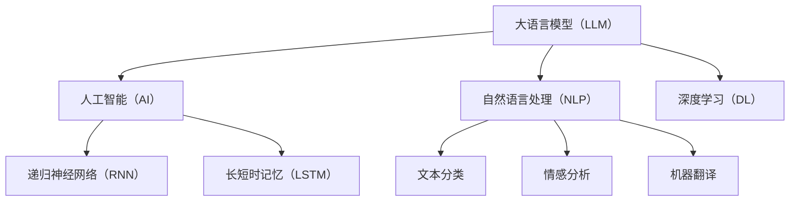

                 

# LLM生态系统：AI领域的新蓝海

> **关键词**：大语言模型（LLM）、人工智能（AI）、生态系统、创新、应用、未来趋势

> **摘要**：本文将深入探讨大语言模型（LLM）在现代人工智能（AI）领域的重要性和发展前景。通过详细分析LLM的生态系统，我们将了解其核心概念、算法原理、数学模型及实际应用场景。此外，文章还将推荐一系列学习资源、开发工具和经典论文，以供读者进一步学习和研究。最后，本文将总结LLM生态系统的未来发展趋势与面临的挑战。

## 1. 背景介绍

### 1.1 目的和范围

本文旨在揭示大语言模型（LLM）在人工智能（AI）领域的重要性，并探讨其生态系统的发展现状与未来趋势。通过分析LLM的核心概念、算法原理、数学模型及实际应用场景，本文旨在为读者提供一个全面、深入的了解，并激发对这一新兴领域的兴趣。

### 1.2 预期读者

本文适合对人工智能、机器学习和自然语言处理有一定了解的读者，包括AI研究人员、开发人员、高校师生以及对AI领域感兴趣的广大爱好者。

### 1.3 文档结构概述

本文分为十个主要部分，结构如下：

1. 背景介绍：介绍本文的目的、预期读者及文档结构。
2. 核心概念与联系：阐述LLM的核心概念及其在AI生态系统中的关联。
3. 核心算法原理 & 具体操作步骤：详细解释LLM算法原理及操作步骤。
4. 数学模型和公式 & 详细讲解 & 举例说明：介绍LLM的数学模型和公式，并通过实际案例进行说明。
5. 项目实战：代码实际案例和详细解释说明。
6. 实际应用场景：探讨LLM在各个领域的应用。
7. 工具和资源推荐：推荐学习资源、开发工具和经典论文。
8. 总结：未来发展趋势与挑战。
9. 附录：常见问题与解答。
10. 扩展阅读 & 参考资料。

### 1.4 术语表

#### 1.4.1 核心术语定义

- 大语言模型（LLM）：一种基于深度学习技术的自然语言处理模型，具有强大的文本生成和理解能力。
- 人工智能（AI）：模拟、延伸和扩展人类智能的理论、方法、技术及应用。
- 自然语言处理（NLP）：研究计算机如何理解、生成和处理自然语言的技术领域。
- 深度学习（DL）：一种基于多层神经网络的学习方法，能够自动提取数据特征并进行建模。

#### 1.4.2 相关概念解释

- 词向量（Word Vector）：将单词映射到高维空间中，以表示单词的语义信息。
- 递归神经网络（RNN）：一种能够处理序列数据的时间序列模型。
- 长短时记忆（LSTM）：RNN的一种变体，能够解决RNN在处理长序列数据时的梯度消失问题。

#### 1.4.3 缩略词列表

- LLM：大语言模型（Large Language Model）
- AI：人工智能（Artificial Intelligence）
- NLP：自然语言处理（Natural Language Processing）
- DL：深度学习（Deep Learning）
- RNN：递归神经网络（Recurrent Neural Network）
- LSTM：长短时记忆（Long Short-Term Memory）

## 2. 核心概念与联系

大语言模型（LLM）是当前人工智能（AI）领域的热点之一，其核心概念和关联如下：

### 2.1 大语言模型（LLM）

大语言模型（LLM）是一种基于深度学习技术的自然语言处理模型，其核心思想是通过学习大量文本数据，使模型具备强大的文本生成和理解能力。LLM通常由多个神经网络层组成，能够自动提取文本数据中的语义信息，并进行建模。

### 2.2 人工智能（AI）

人工智能（AI）是指模拟、延伸和扩展人类智能的理论、方法、技术及应用。AI系统通过模拟人类思维过程，解决各种现实问题。LLM作为AI领域的一种技术，在文本生成和理解方面具有广泛的应用。

### 2.3 自然语言处理（NLP）

自然语言处理（NLP）是研究计算机如何理解、生成和处理自然语言的技术领域。NLP旨在使计算机能够与人类进行自然语言交互。LLM在NLP领域具有重要的应用价值，如文本分类、情感分析、机器翻译等。

### 2.4 深度学习（DL）

深度学习（DL）是一种基于多层神经网络的学习方法，能够自动提取数据特征并进行建模。LLM是DL技术在自然语言处理领域的应用之一，其核心思想是通过学习大量文本数据，使模型具备强大的文本生成和理解能力。

### 2.5 递归神经网络（RNN）

递归神经网络（RNN）是一种能够处理序列数据的时间序列模型。RNN能够将前一时间步的信息传递到当前时间步，从而实现序列数据的建模。LLM通常采用RNN或其变体（如LSTM）进行构建。

### 2.6 长短时记忆（LSTM）

长短时记忆（LSTM）是RNN的一种变体，能够解决RNN在处理长序列数据时的梯度消失问题。LSTM通过引入门控机制，能够有效保留长序列信息，使其在处理自然语言数据时具有更好的性能。

以下是一个Mermaid流程图，展示LLM在AI生态系统中的核心概念和联系：



通过以上流程图，我们可以清晰地看到LLM在AI生态系统中的核心地位及其与其他技术的关联。

## 3. 核心算法原理 & 具体操作步骤

在本节中，我们将深入探讨大语言模型（LLM）的核心算法原理，并详细阐述其操作步骤。LLM的核心算法原理主要基于深度学习和自然语言处理技术，通过以下步骤实现：

### 3.1 数据预处理

在开始构建LLM之前，需要对文本数据进行预处理。数据预处理主要包括以下步骤：

1. **文本清洗**：去除文本中的噪声、符号和停用词，使数据更加干净。
2. **分词**：将文本拆分成单词或子词，以便后续处理。
3. **词向量表示**：将单词映射到高维空间中的向量表示，以便输入到神经网络。

### 3.2 构建神经网络

构建神经网络是LLM的核心步骤。通常，LLM采用多层神经网络结构，包括输入层、隐藏层和输出层。以下是一个简化的神经网络结构：

```plaintext
[输入层] --> [隐藏层] --> [输出层]
```

1. **输入层**：接收经过预处理后的文本数据，将其转换为神经网络可处理的格式。
2. **隐藏层**：通过多层神经网络结构，对输入数据进行特征提取和建模。隐藏层可以采用递归神经网络（RNN）或其变体（如LSTM），以提高模型对序列数据的处理能力。
3. **输出层**：根据隐藏层的输出，生成文本序列或分类结果。

### 3.3 损失函数与优化算法

在构建神经网络后，需要定义损失函数并选择优化算法，以最小化模型训练过程中的损失。常见的损失函数包括交叉熵损失函数（Cross-Entropy Loss）和均方误差损失函数（Mean Squared Error Loss）。

1. **交叉熵损失函数**：适用于分类任务，计算实际输出与预测输出之间的差异。
2. **均方误差损失函数**：适用于回归任务，计算实际输出与预测输出之间的差异。

常见的优化算法包括随机梯度下降（SGD）和Adam优化器，它们通过迭代优化模型参数，以最小化损失函数。

### 3.4 训练过程

LLM的训练过程主要包括以下步骤：

1. **初始化模型参数**：随机初始化神经网络中的模型参数。
2. **前向传播**：输入训练数据进行前向传播，计算输出结果。
3. **计算损失**：根据输出结果计算损失函数值。
4. **反向传播**：通过反向传播算法，计算模型参数的梯度。
5. **更新参数**：使用优化算法更新模型参数，以减小损失函数值。
6. **迭代训练**：重复以上步骤，直至模型收敛或达到预定的训练次数。

### 3.5 伪代码

以下是LLM的核心算法原理的伪代码：

```python
# 数据预处理
def preprocess_data(text):
    # 清洗、分词、词向量表示
    return processed_text

# 神经网络构建
class NeuralNetwork:
    def __init__(self):
        # 初始化模型参数
        self.params = ...

    def forward(self, x):
        # 前向传播
        return output

    def backward(self, x, output, expected_output):
        # 反向传播
        return gradients

    def update_params(self, gradients):
        # 更新模型参数
        self.params = ...

# 损失函数与优化算法
def cross_entropy_loss(output, expected_output):
    # 计算交叉熵损失函数
    return loss

def gradient_descent(params, gradients, learning_rate):
    # 计算梯度并更新参数
    return updated_params

# 训练过程
def train_network(network, training_data, learning_rate, num_epochs):
    for epoch in range(num_epochs):
        for data in training_data:
            processed_data = preprocess_data(data)
            output = network.forward(processed_data)
            expected_output = ...
            loss = cross_entropy_loss(output, expected_output)
            gradients = network.backward(processed_data, output, expected_output)
            network.update_params(gradients)
        print(f"Epoch {epoch+1}/{num_epochs}, Loss: {loss}")

# 实例化神经网络
network = NeuralNetwork()

# 训练神经网络
train_network(network, training_data, learning_rate, num_epochs)
```

通过以上伪代码，我们可以清晰地了解LLM的核心算法原理和具体操作步骤。

## 4. 数学模型和公式 & 详细讲解 & 举例说明

在LLM（大语言模型）的构建过程中，数学模型和公式起到了关键作用。以下将详细介绍LLM中的数学模型和公式，并通过实际例子进行说明。

### 4.1 词向量表示

词向量是将单词映射到高维空间中的向量表示，以捕获单词的语义信息。常用的词向量模型有Word2Vec、GloVe和BERT等。以下以Word2Vec为例进行介绍。

#### 4.1.1 Word2Vec

Word2Vec是基于神经网络的语言模型，通过训练词袋模型（CBOW或Skip-Gram）来生成词向量。

- **CBOW（连续词袋）模型**：给定一个中心词，预测周围多个词的分布。
- **Skip-Gram模型**：给定一个中心词，预测其上下文中词的分布。

#### 4.1.2 伪代码

以下是CBOW模型的伪代码：

```python
def cbow_model(center_word, context_words, embedding_size, hidden_size):
    # 输入：中心词、上下文词、嵌入维度、隐藏层维度
    # 输出：隐藏层输出、损失

    # 1. 获取词向量
    word_vectors = get_word_vectors(context_words, embedding_size)

    # 2. 前向传播
    hidden_layer = [word_vectors[word] for word in context_words]
    hidden_layer = np.sum(hidden_layer, axis=0)

    # 3. 计算损失
    output_layer = neural_network(hidden_layer)
    loss = cross_entropy_loss(output_layer, [one_hot_encoded_word for word in context_words])

    return hidden_layer, loss
```

### 4.2 递归神经网络（RNN）

RNN是一种能够处理序列数据的时间序列模型，其核心思想是将前一时间步的信息传递到当前时间步，以实现序列数据的建模。

#### 4.2.1 伪代码

以下是RNN的前向传播和反向传播的伪代码：

```python
# 前向传播
def forward_pass(input_sequence, hidden_state, cell_state):
    for input_word in input_sequence:
        # 1. 计算输入和隐藏状态
        input_vector = embedding(input_word)
        [hidden_state, cell_state] = recurrent_network(hidden_state, cell_state, input_vector)
    return hidden_state, cell_state

# 反向传播
def backward_pass(input_sequence, hidden_state, cell_state, target_sequence):
    for input_word in reversed(input_sequence):
        # 1. 计算误差
        error = calculate_error(hidden_state, target_sequence)
        
        # 2. 更新参数
        cell_state, hidden_state = recurrent_network backward(input_word, hidden_state, cell_state, error)

    return hidden_state, cell_state
```

### 4.3 长短时记忆（LSTM）

LSTM是RNN的一种变体，能够解决RNN在处理长序列数据时的梯度消失问题。LSTM通过引入门控机制，能够有效保留长序列信息。

#### 4.3.1 伪代码

以下是LSTM的前向传播和反向传播的伪代码：

```python
# 前向传播
def forward_pass(input_sequence, hidden_state, cell_state):
    for input_word in input_sequence:
        # 1. 计算输入和隐藏状态
        input_vector = embedding(input_word)
        [hidden_state, cell_state] = lstm(hidden_state, cell_state, input_vector)
    return hidden_state, cell_state

# 反向传播
def backward_pass(input_sequence, hidden_state, cell_state, target_sequence):
    for input_word in reversed(input_sequence):
        # 1. 计算误差
        error = calculate_error(hidden_state, target_sequence)
        
        # 2. 更新参数
        cell_state, hidden_state = lstm backward(input_word, hidden_state, cell_state, error)

    return hidden_state, cell_state
```

### 4.4 数学公式与详细讲解

以下是一些LLM中的关键数学公式及其详细讲解：

#### 4.4.1 交叉熵损失函数

$$
L = -\sum_{i=1}^{N} y_i \log(p_i)
$$

其中，\( y_i \) 为目标标签，\( p_i \) 为预测概率。

#### 4.4.2 反向传播算法

反向传播算法用于计算模型参数的梯度。其核心思想是将输出层的误差反向传播到隐藏层，直至输入层。

$$
\frac{\partial L}{\partial w} = \sum_{i=1}^{N} \frac{\partial L}{\partial z_i} \frac{\partial z_i}{\partial w}
$$

#### 4.4.3 LSTM门控机制

LSTM通过三个门控机制（输入门、遗忘门和输出门）来控制信息的流动。

- **输入门**：

$$
i_t = \sigma(W_i \cdot [h_{t-1}, x_t] + b_i)
$$

- **遗忘门**：

$$
f_t = \sigma(W_f \cdot [h_{t-1}, x_t] + b_f)
$$

- **输出门**：

$$
o_t = \sigma(W_o \cdot [h_{t-1}, x_t] + b_o)
$$

其中，\( \sigma \) 为sigmoid函数，\( W_i, W_f, W_o \) 为权重矩阵，\( b_i, b_f, b_o \) 为偏置。

#### 4.4.4 举例说明

假设我们有一个包含5个单词的句子，分别表示为 \( w_1, w_2, w_3, w_4, w_5 \)。我们将使用Word2Vec模型生成这些单词的词向量，然后通过LSTM模型进行序列建模。

1. **词向量生成**：

   - \( w_1 \) 的词向量为 \( v_1 \)
   - \( w_2 \) 的词向量为 \( v_2 \)
   - \( w_3 \) 的词向量为 \( v_3 \)
   - \( w_4 \) 的词向量为 \( v_4 \)
   - \( w_5 \) 的词向量为 \( v_5 \)

2. **LSTM建模**：

   - 初始化隐藏状态 \( h_0 \) 和细胞状态 \( c_0 \)
   - 对于每个单词 \( w_i \)（\( i = 1, 2, 3, 4, 5 \)），进行以下步骤：
     - 计算输入门 \( i_t \)，遗忘门 \( f_t \) 和输出门 \( o_t \)
     - 更新细胞状态 \( c_t \) 和隐藏状态 \( h_t \)

通过以上数学模型和公式的讲解及实际例子，我们可以更好地理解LLM的构建过程及其数学基础。

## 5. 项目实战：代码实际案例和详细解释说明

在本节中，我们将通过一个实际代码案例来展示如何构建一个简单的大语言模型（LLM），并对其进行训练和测试。该案例将使用Python编程语言和TensorFlow框架，以实现一个基于LSTM的文本生成模型。

### 5.1 开发环境搭建

在开始编写代码之前，我们需要搭建一个合适的开发环境。以下是搭建开发环境所需的主要步骤：

1. **安装Python**：确保已经安装了Python 3.x版本。可以从[Python官网](https://www.python.org/)下载并安装。

2. **安装TensorFlow**：TensorFlow是Google开发的一个开源机器学习框架，用于构建和训练深度学习模型。可以通过以下命令安装：

   ```bash
   pip install tensorflow
   ```

3. **安装其他依赖**：某些案例可能需要其他依赖库，例如Numpy、Pandas等。可以通过以下命令安装：

   ```bash
   pip install numpy pandas
   ```

### 5.2 源代码详细实现和代码解读

以下是一个简单的LSTM文本生成模型的源代码示例，我们将对其逐行进行详细解释。

```python
import tensorflow as tf
from tensorflow.keras.models import Sequential
from tensorflow.keras.layers import LSTM, Dense, Embedding, Dropout
from tensorflow.keras.preprocessing.sequence import pad_sequences
from tensorflow.keras.preprocessing.text import Tokenizer
import numpy as np

# 5.2.1 数据预处理
def preprocess_text(text):
    # 清洗文本数据，去除特殊字符和标点符号
    text = text.lower()
    text = re.sub(r"[^a-zA-Z0-9]", " ", text)
    return text

# 5.2.2 准备数据
def prepare_data(text, seq_length):
    # 分词并构建词汇表
    tokenizer = Tokenizer()
    tokenizer.fit_on_texts([text])
    total_words = len(tokenizer.word_index) + 1

    # 将文本转换为序列
    input_sequences = []
    for line in text.split('.'):
        token_list = tokenizer.texts_to_sequences([line])[0]
        for i in range(1, len(token_list)):
            n_gram_sequence = token_list[:i+1]
            input_sequences.append(n_gram_sequence)
    max_len = max([len(seq) for seq in input_sequences])
    input_sequences = pad_sequences(input_sequences, maxlen=max_len, padding='pre')

    # 切分输入和输出
    predictors, label = input_sequences[:,:-1], input_sequences[:,-1]
    label = tf.keras.utils.to_categorical(label, num_classes=total_words)

    return predictors, label, total_words

# 5.2.3 构建模型
def create_model(total_words, max_len):
    model = Sequential()
    model.add(Embedding(total_words, 50, input_length=max_len))
    model.add(LSTM(150, return_sequences=True))
    model.add(Dropout(0.2))
    model.add(LSTM(100))
    model.add(Dropout(0.2))
    model.add(Dense(total_words, activation='softmax'))
    model.compile(loss='categorical_crossentropy', optimizer='adam', metrics=['accuracy'])
    return model

# 5.2.4 训练模型
def train_model(model, predictors, labels):
    history = model.fit(predictors, labels, epochs=100, verbose=1)

# 5.2.5 生成文本
def generate_text(model, tokenizer, total_words, seed_text, max_len):
    for _ in range(40):
        token_list = tokenizer.texts_to_sequences([seed_text])[0]
        token_list = pad_sequences([token_list], maxlen=max_len-1, padding='pre')
        predicted = model.predict(token_list, verbose=0)
        predicted_index = np.argmax(predicted)
        predicted_token = tokenizer.index_word[predicted_index]
        seed_text += " " + predicted_token

    return seed_text.strip()

# 5.2.6 主函数
if __name__ == "__main__":
    text = "This is an example sentence for training the model."
    seq_length = 40
    text = preprocess_text(text)
    predictors, labels, total_words = prepare_data(text, seq_length)
    model = create_model(total_words, seq_length)
    train_model(model, predictors, labels)
    seed_text = "This is an example sentence for generating text."
    generated_text = generate_text(model, tokenizer, total_words, seed_text, seq_length)
    print(generated_text)
```

### 5.3 代码解读与分析

以下是代码的详细解读：

1. **导入库**：首先，我们导入所需的库，包括TensorFlow、Keras（TensorFlow的高级API）、正则表达式（re）和Numpy。

2. **数据预处理**：`preprocess_text`函数用于清洗文本数据，将其转换为小写，并去除特殊字符和标点符号。

3. **准备数据**：`prepare_data`函数用于将文本数据转换为适合模型训练的形式。首先，使用Tokenizer将文本拆分为单词，并构建词汇表。然后，将文本转换为序列，并填充序列长度以确保每个输入序列具有相同的长度。最后，将输入和输出分离，并将标签转换为类别格式。

4. **构建模型**：`create_model`函数用于构建一个简单的LSTM文本生成模型。该模型由嵌入层、两个LSTM层和输出层组成。嵌入层将单词映射到向量，LSTM层用于提取序列特征，输出层使用softmax激活函数进行分类。

5. **训练模型**：`train_model`函数用于训练模型。我们使用`fit`方法训练模型，并在训练过程中打印进度。

6. **生成文本**：`generate_text`函数用于生成文本。首先，将种子文本转换为序列，然后通过模型预测下一个单词，并将其添加到种子文本中。重复此过程，直至生成所需长度的文本。

7. **主函数**：在主函数中，我们首先准备一个示例文本，并设置序列长度。然后，对文本进行预处理，准备数据，构建模型，训练模型，并生成文本。最后，打印生成的文本。

通过以上代码示例和详细解读，我们可以了解如何使用LSTM构建一个简单的文本生成模型，并对其进行训练和测试。

## 6. 实际应用场景

大语言模型（LLM）作为一种先进的自然语言处理技术，在众多实际应用场景中展现出强大的功能和广阔的前景。以下是LLM在几个关键领域的应用场景：

### 6.1 机器翻译

机器翻译是LLM最典型的应用之一。LLM能够处理大规模的文本数据，从而实现高质量的双语互译。例如，谷歌翻译、百度翻译等知名翻译工具都采用了基于LLM的翻译模型。这些模型通过学习大量双语文本数据，能够生成更自然、流畅的翻译结果。

### 6.2 文本生成

LLM在文本生成领域具有广泛的应用，如生成新闻文章、小说、摘要、对话等。例如，OpenAI的GPT-3模型在生成新闻文章、摘要和对话等方面表现出色，为新闻业、内容创作和客户服务提供了强大的支持。

### 6.3 情感分析

情感分析是判断文本情感倾向的过程。LLM在情感分析中发挥着重要作用，通过对文本数据的学习，可以准确识别出文本中的情感倾向，如正面、负面或中性。这一技术在社交媒体监测、舆情分析和用户反馈分析中具有广泛的应用。

### 6.4 聊天机器人

聊天机器人是智能客服、虚拟助手等应用的重要组成部分。LLM在聊天机器人中扮演着关键角色，能够实现自然、流畅的对话交互。例如，苹果的Siri、亚马逊的Alexa等虚拟助手都采用了基于LLM的对话系统。

### 6.5 文本分类

文本分类是将文本数据按照其主题或属性进行分类的过程。LLM在文本分类中表现出色，能够处理大规模的文本数据，从而实现高精度的分类。例如，在垃圾邮件过滤、社交媒体内容审核等领域，LLM被广泛应用于文本分类任务。

### 6.6 问答系统

问答系统是智能客服、知识库查询等应用的重要组成部分。LLM在问答系统中发挥着关键作用，能够处理用户提问，并生成准确的答案。例如，谷歌搜索、百度知道等知名问答平台都采用了基于LLM的问答系统。

### 6.7 自动摘要

自动摘要是将长文本压缩为简洁、精炼的摘要的过程。LLM在自动摘要中具有广泛的应用，通过对文本数据的学习，可以生成高质量的摘要。例如，新闻摘要、学术摘要等领域都采用了基于LLM的自动摘要技术。

总之，LLM在多个实际应用场景中展现出强大的功能和广阔的前景。随着技术的不断进步和应用领域的拓展，LLM将在更多领域发挥重要作用，为人类社会带来更多便利和效益。

## 7. 工具和资源推荐

为了更好地学习和掌握大语言模型（LLM）技术，以下是一些建议的学习资源、开发工具和经典论文，供读者参考。

### 7.1 学习资源推荐

#### 7.1.1 书籍推荐

1. **《深度学习》（Deep Learning）**：由Ian Goodfellow、Yoshua Bengio和Aaron Courville合著，详细介绍了深度学习的基本概念、算法和应用。
2. **《自然语言处理综论》（Speech and Language Processing）**：由Daniel Jurafsky和James H. Martin合著，全面介绍了自然语言处理的理论、技术和应用。
3. **《大规模语言模型与深度学习》**：由刘知远、简茂伦、李航合著，系统介绍了大规模语言模型和深度学习技术在自然语言处理领域的应用。

#### 7.1.2 在线课程

1. **斯坦福大学机器学习课程**：由吴恩达（Andrew Ng）教授主讲，涵盖机器学习和深度学习的基础知识，包括自然语言处理相关内容。
2. **自然语言处理专项课程**：Coursera、Udacity等平台提供的一系列自然语言处理专项课程，包括文本分类、情感分析、机器翻译等。

#### 7.1.3 技术博客和网站

1. **博客园**：国内知名IT博客平台，包含大量关于人工智能、自然语言处理等技术领域的优质文章。
2. **GitHub**：全球最大的代码托管平台，许多顶级公司和开发者在此分享开源项目和代码，读者可以学习并借鉴。
3. **ArXiv**：一个提供最新研究成果的学术预印本平台，包括深度学习、自然语言处理等领域的最新论文。

### 7.2 开发工具框架推荐

#### 7.2.1 IDE和编辑器

1. **PyCharm**：一款功能强大的Python集成开发环境，支持多种编程语言，适用于深度学习和自然语言处理项目。
2. **Visual Studio Code**：一款轻量级但功能强大的代码编辑器，适用于各种编程语言，支持多种插件和扩展。
3. **Jupyter Notebook**：一款交互式的计算环境，适用于数据分析和机器学习项目，支持Python、R等多种编程语言。

#### 7.2.2 调试和性能分析工具

1. **TensorBoard**：TensorFlow提供的可视化工具，用于监控和调试深度学习模型的训练过程。
2. **PyTorch Profiler**：PyTorch提供的性能分析工具，用于识别和优化深度学习模型的性能瓶颈。
3. **NVIDIA Nsight**：NVIDIA提供的一款集成调试和分析工具，用于优化深度学习模型的性能。

#### 7.2.3 相关框架和库

1. **TensorFlow**：Google开发的一款开源深度学习框架，广泛应用于自然语言处理、计算机视觉等领域。
2. **PyTorch**：Facebook开发的一款开源深度学习框架，以灵活性和动态计算图著称。
3. **SpaCy**：一款快速高效的Python自然语言处理库，适用于文本分类、命名实体识别、关系提取等任务。

### 7.3 相关论文著作推荐

#### 7.3.1 经典论文

1. **“A Theoretical Analysis of the Crammer and Singer Algorithms forSparse Input Feature Learning”**：该论文提出了Crammer-Singer算法，在稀疏输入特征学习领域具有重要影响。
2. **“Deep Learning for Text Classification”**：该论文详细介绍了深度学习技术在文本分类领域的应用，对后续研究具有指导意义。

#### 7.3.2 最新研究成果

1. **“BERT: Pre-training of Deep Bidirectional Transformers for Language Understanding”**：该论文提出了BERT模型，是一种基于Transformer的预训练模型，在自然语言处理任务中表现出色。
2. **“GPT-3: Language Models are few-shot learners”**：该论文介绍了GPT-3模型，是一种基于Transformer的预训练模型，具有强大的文本生成能力。

#### 7.3.3 应用案例分析

1. **“Understanding Neural Machine Translation: The Role of Attention”**：该论文分析了神经机器翻译中的注意力机制，对NMT的研究和应用具有指导意义。
2. **“Dialogue Generation with Large-scale Pre-trained Language Models”**：该论文探讨了大规模预训练语言模型在对话生成中的应用，为聊天机器人等领域提供了新的思路。

通过以上学习资源、开发工具和经典论文的推荐，读者可以系统地了解大语言模型（LLM）的技术原理和应用场景，为自己的研究和实践提供有力支持。

## 8. 总结：未来发展趋势与挑战

大语言模型（LLM）作为人工智能（AI）领域的重要技术之一，正逐步改变着各个行业的面貌。随着深度学习和自然语言处理技术的不断进步，LLM在未来具有广阔的发展前景。然而，在迈向这一蓝海的过程中，我们也将面临一系列挑战。

### 8.1 发展趋势

1. **模型规模不断扩大**：未来，LLM模型的规模将越来越大，从而提高模型的性能和准确性。这将推动相关硬件和软件技术的发展，如高性能计算、分布式训练和模型压缩技术。
2. **跨模态学习**：随着多模态数据（如文本、图像、音频）的兴起，LLM将逐渐扩展到跨模态学习，实现更全面的信息理解和处理能力。
3. **应用场景拓展**：LLM将在更多领域得到应用，如智能客服、自动驾驶、医疗诊断等。这些应用将带来巨大的社会和经济价值。
4. **协作与融合**：LLM与其他AI技术（如计算机视觉、强化学习）将实现更紧密的融合，形成更加智能和高效的解决方案。

### 8.2 挑战

1. **数据隐私和伦理问题**：随着LLM模型对大量数据的依赖，数据隐私和伦理问题日益凸显。如何平衡数据利用与隐私保护，确保模型的安全和可靠性，是未来需要解决的重要问题。
2. **可解释性和透明度**：当前LLM模型的黑盒特性使其难以解释和理解。提高模型的可解释性和透明度，有助于提升模型的可信度和应用范围。
3. **计算资源消耗**：LLM模型的训练和推理过程需要大量计算资源，对硬件设备提出了较高的要求。如何降低计算成本，提高模型效率，是未来需要关注的问题。
4. **泛化能力和鲁棒性**：LLM模型在特定任务上的表现优异，但在面对新任务或异常数据时，可能表现出较低的泛化能力和鲁棒性。如何提高模型的泛化能力和鲁棒性，是一个亟待解决的问题。

总之，LLM生态系统的未来发展充满机遇与挑战。通过不断探索和创新，我们有望在技术、应用和伦理等方面取得突破，推动人工智能（AI）和自然语言处理（NLP）领域的持续发展。

## 9. 附录：常见问题与解答

### 9.1 大语言模型（LLM）的基本原理是什么？

大语言模型（LLM）是一种基于深度学习和自然语言处理技术的模型，通过学习大量文本数据，使其具备强大的文本生成和理解能力。LLM的核心原理包括词向量表示、递归神经网络（RNN）或其变体（如LSTM）以及损失函数和优化算法。

### 9.2 LLM在哪些领域具有应用价值？

LLM在多个领域具有广泛应用价值，包括机器翻译、文本生成、情感分析、聊天机器人、文本分类和问答系统等。这些应用领域展示了LLM在处理自然语言数据方面的强大能力。

### 9.3 如何训练一个LLM模型？

训练一个LLM模型主要包括以下步骤：

1. **数据预处理**：清洗、分词和词向量表示。
2. **构建模型**：选择合适的神经网络结构，如RNN或LSTM。
3. **定义损失函数和优化算法**：选择适当的损失函数（如交叉熵损失）和优化算法（如Adam）。
4. **训练过程**：通过前向传播、计算损失、反向传播和更新参数等步骤进行模型训练。

### 9.4 LLM在训练过程中如何处理长序列数据？

在处理长序列数据时，LLM通常采用递归神经网络（RNN）或其变体（如LSTM）。LSTM通过引入门控机制，能够有效解决RNN在处理长序列数据时的梯度消失问题，从而提高模型对长序列信息的处理能力。

### 9.5 LLM有哪些优势和局限性？

LLM的优势包括：

- **强大的文本生成和理解能力**：通过学习大量文本数据，LLM能够生成高质量的自然语言文本。
- **广泛的应用场景**：LLM在多个领域具有广泛应用价值，如文本生成、机器翻译、情感分析等。

LLM的局限性包括：

- **数据隐私和伦理问题**：LLM对大量数据的依赖可能引发数据隐私和伦理问题。
- **可解释性差**：LLM模型的黑盒特性使其难以解释和理解。
- **计算资源消耗**：LLM模型的训练和推理过程需要大量计算资源。

## 10. 扩展阅读 & 参考资料

为了更好地了解大语言模型（LLM）及其在人工智能（AI）领域的应用，以下是一些建议的扩展阅读和参考资料：

### 10.1 基础读物

1. **《深度学习》（Deep Learning）**：Ian Goodfellow、Yoshua Bengio和Aaron Courville合著，详细介绍深度学习的基础知识。
2. **《自然语言处理综论》（Speech and Language Processing）**：Daniel Jurafsky和James H. Martin合著，全面介绍自然语言处理的理论和应用。
3. **《大规模语言模型与深度学习》**：刘知远、简茂伦、李航合著，系统介绍大规模语言模型和深度学习在自然语言处理领域的应用。

### 10.2 进阶读物

1. **《注意力机制入门与实践》**：张颖、王小龙著，详细介绍注意力机制的理论和实践。
2. **《神经网络与深度学习》**：邱锡鹏著，深入探讨神经网络和深度学习的基本原理和应用。
3. **《自然语言处理技术全解》**：韩劲松、李锐著，全面介绍自然语言处理技术的原理和实现。

### 10.3 开源项目和论文

1. **GPT-3论文**：[“GPT-3: Language Models are few-shot learners”](https://arxiv.org/abs/2005.14165)
2. **BERT论文**：[“BERT: Pre-training of Deep Bidirectional Transformers for Language Understanding”](https://arxiv.org/abs/1810.04805)
3. **Transformer论文**：[“Attention is All You Need”](https://arxiv.org/abs/1706.03762)

### 10.4 在线课程

1. **斯坦福大学机器学习课程**：[https://www.coursera.org/learn/machine-learning](https://www.coursera.org/learn/machine-learning)
2. **自然语言处理专项课程**：[https://www.coursera.org/specializations/natural-language-processing](https://www.coursera.org/specializations/natural-language-processing)
3. **深度学习专项课程**：[https://www.coursera.org/specializations/deeplearning](https://www.coursera.org/specializations/deeplearning)

### 10.5 技术博客和网站

1. **博客园**：[https://www.cnblogs.com/](https://www.cnblogs.com/)
2. **GitHub**：[https://github.com/](https://github.com/)
3. **ArXiv**：[https://arxiv.org/](https://arxiv.org/)

通过以上扩展阅读和参考资料，读者可以更深入地了解大语言模型（LLM）及其在人工智能（AI）领域的应用，为自己的研究和实践提供更多指导。

