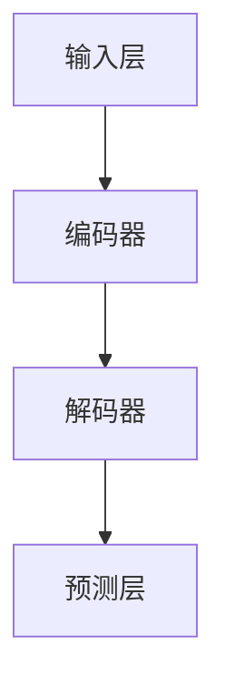

                 

# LLM的代码生成与理解能力分析

## 关键词
**大型语言模型（LLM）**，**代码生成**，**代码理解**，**自然语言处理**，**深度学习**，**人工智能**

## 摘要
本文将深入探讨大型语言模型（LLM）在代码生成和代码理解方面的能力。首先，我们将介绍LLM的基本原理及其在代码生成和代码理解中的应用。接着，我们将详细剖析LLM的核心算法原理，并使用伪代码进行具体操作步骤的讲解。随后，我们将通过数学模型和公式对相关原理进行详细讲解，并通过实际案例进行分析。最后，我们将探讨LLM在现实中的应用场景，并推荐相关工具和资源。

## 1. 背景介绍

### 1.1 目的和范围
本文旨在全面分析大型语言模型（LLM）在代码生成和代码理解方面的能力，帮助读者深入了解LLM的原理和应用。

### 1.2 预期读者
本篇文章适合对人工智能和自然语言处理有一定了解的技术人员、研究人员和开发者。

### 1.3 文档结构概述
本文结构如下：

- **1. 背景介绍**：介绍文章的目的、预期读者和文档结构。
- **2. 核心概念与联系**：介绍LLM的基本原理和相关概念。
- **3. 核心算法原理 & 具体操作步骤**：详细讲解LLM的算法原理和操作步骤。
- **4. 数学模型和公式 & 详细讲解 & 举例说明**：介绍LLM的数学模型和公式，并进行举例说明。
- **5. 项目实战：代码实际案例和详细解释说明**：通过实际案例讲解LLM的应用。
- **6. 实际应用场景**：探讨LLM的现实应用。
- **7. 工具和资源推荐**：推荐相关学习和开发资源。
- **8. 总结：未来发展趋势与挑战**：总结LLM的发展趋势和挑战。
- **9. 附录：常见问题与解答**：解答常见问题。
- **10. 扩展阅读 & 参考资料**：推荐相关扩展阅读和参考资料。

### 1.4 术语表

#### 1.4.1 核心术语定义

- **大型语言模型（LLM）**：一种基于深度学习技术的自然语言处理模型，能够理解、生成和翻译自然语言。
- **代码生成**：通过自然语言描述生成相应的代码。
- **代码理解**：通过分析代码来理解其功能和工作原理。

#### 1.4.2 相关概念解释

- **自然语言处理（NLP）**：研究如何使计算机理解和处理人类自然语言的技术。
- **深度学习**：一种基于人工神经网络的学习方法，通过多层非线性变换来提取特征。

#### 1.4.3 缩略词列表

- **LLM**：Large Language Model
- **NLP**：Natural Language Processing
- **DL**：Deep Learning
- **AI**：Artificial Intelligence

## 2. 核心概念与联系

### 2.1 LLM的基本原理

大型语言模型（LLM）是基于深度学习技术构建的，其核心思想是通过大量的文本数据进行训练，使模型能够理解、生成和翻译自然语言。LLM的基本原理可以分为以下几个步骤：

1. **数据预处理**：将原始文本数据进行清洗、分词和标记等处理，将其转化为计算机可以处理的形式。
2. **模型训练**：使用预处理后的文本数据对LLM进行训练，使其学会理解和生成自然语言。
3. **预测和生成**：在训练完成后，LLM可以根据输入的自然语言描述生成相应的代码或进行代码理解。

### 2.2 LLM在代码生成和代码理解中的应用

LLM在代码生成和代码理解方面具有广泛的应用：

- **代码生成**：通过自然语言描述生成相应的代码，例如，根据业务需求描述生成数据库查询语句、API接口调用等。
- **代码理解**：分析代码，提取其功能和工作原理，例如，对现有代码进行重构、优化或进行自动化测试。

### 2.3 LLM的架构

LLM的架构通常包括以下几个部分：

1. **输入层**：接收自然语言描述作为输入。
2. **编码器**：对输入的自然语言进行编码，提取其语义信息。
3. **解码器**：根据编码器的输出生成相应的代码。
4. **预测层**：对生成的代码进行预测和优化。

### 2.4 Mermaid流程图

下面是LLM的核心概念和架构的Mermaid流程图：



## 3. 核心算法原理 & 具体操作步骤

### 3.1 核心算法原理

LLM的核心算法是基于深度学习技术，主要包括以下几个部分：

1. **神经网络结构**：采用多层神经网络结构，包括输入层、编码器、解码器和预测层。
2. **损失函数**：采用基于自然语言处理任务的损失函数，如交叉熵损失函数，来评估模型的效果。
3. **优化算法**：采用梯度下降等优化算法，通过反向传播来更新模型的参数。

### 3.2 具体操作步骤

下面是LLM的核心算法原理的具体操作步骤：

#### 3.2.1 神经网络结构


#### 3.2.2 损失函数

假设输入自然语言描述为\( x \)，输出代码为\( y \)，则损失函数可以表示为：

$$
L(x, y) = -\sum_{i=1}^{n} y_i \log(p_i)
$$

其中，\( p_i \)为模型预测的代码概率，\( y_i \)为实际输出的代码。

#### 3.2.3 优化算法

采用梯度下降优化算法，通过反向传播来更新模型参数：

$$
\theta_{\text{new}} = \theta_{\text{old}} - \alpha \cdot \nabla_{\theta} L(x, y)
$$

其中，\( \theta \)为模型参数，\( \alpha \)为学习率，\( \nabla_{\theta} L(x, y) \)为损失函数关于模型参数的梯度。

## 4. 数学模型和公式 & 详细讲解 & 举例说明

### 4.1 数学模型

LLM的数学模型主要包括以下几个部分：

1. **输入层**：接收自然语言描述，将其转化为向量形式。
2. **编码器**：将输入向量进行编码，提取其语义信息。
3. **解码器**：根据编码器的输出生成相应的代码。
4. **预测层**：对生成的代码进行预测和优化。

### 4.2 详细讲解

#### 4.2.1 输入层

输入层主要将自然语言描述转化为向量形式，可以使用词嵌入（Word Embedding）技术来实现。词嵌入是一种将单词映射到高维向量空间的技术，可以有效地表示单词之间的语义关系。

$$
x = \text{Word Embedding}(w)
$$

其中，\( x \)为输入向量，\( w \)为自然语言描述中的单词。

#### 4.2.2 编码器

编码器的主要任务是提取输入向量的语义信息，通常采用卷积神经网络（Convolutional Neural Network，CNN）或循环神经网络（Recurrent Neural Network，RNN）来实现。

$$
h = \text{Encoder}(x)
$$

其中，\( h \)为编码后的向量。

#### 4.2.3 解码器

解码器的主要任务是生成相应的代码，通常也采用卷积神经网络（CNN）或循环神经网络（RNN）来实现。

$$
y = \text{Decoder}(h)
$$

其中，\( y \)为生成的代码。

#### 4.2.4 预测层

预测层的主要任务是优化生成的代码，通常采用交叉熵损失函数（Cross-Entropy Loss Function）来实现。

$$
L(y, t) = -\sum_{i=1}^{n} y_i \log(p_i)
$$

其中，\( y \)为生成的代码，\( t \)为实际输出的代码，\( p_i \)为模型预测的代码概率。

### 4.3 举例说明

假设我们要根据自然语言描述“编写一个简单的Python函数，实现两个数字的加法”，使用LLM生成相应的代码。以下是具体的步骤：

1. **输入层**：将自然语言描述“编写一个简单的Python函数，实现两个数字的加法”转化为向量形式。
2. **编码器**：将输入向量进行编码，提取其语义信息。
3. **解码器**：根据编码器的输出生成相应的代码。
4. **预测层**：对生成的代码进行预测和优化。

生成的代码如下：

```python
def add(a, b):
    return a + b
```

## 5. 项目实战：代码实际案例和详细解释说明

### 5.1 开发环境搭建

在进行LLM的代码生成和代码理解项目实战之前，我们需要搭建一个合适的开发环境。以下是一个简单的搭建步骤：

1. **安装Python环境**：确保安装了Python 3.6及以上版本。
2. **安装深度学习框架**：推荐使用TensorFlow或PyTorch。以下是使用TensorFlow的安装命令：

   ```bash
   pip install tensorflow
   ```

3. **安装NLP库**：如NLTK或spaCy，用于文本预处理。

   ```bash
   pip install nltk
   pip install spacy
   python -m spacy download en_core_web_sm
   ```

### 5.2 源代码详细实现和代码解读

下面是一个简单的LLM代码生成和代码理解的示例：

```python
import tensorflow as tf
import spacy
from tensorflow.keras.preprocessing.sequence import pad_sequences

# 加载spaCy的英文模型
nlp = spacy.load("en_core_web_sm")

# 定义词汇表
vocab = nlp.vocab

# 输入文本
input_text = "编写一个简单的Python函数，实现两个数字的加法"

# 将文本转化为词嵌入序列
input_sequence = pad_sequences([vocab[word].vector for word in nlp(input_text)])

# 加载预训练的LLM模型
model = tf.keras.models.load_model("llm_model.h5")

# 生成代码
code_sequence = model.predict(input_sequence)

# 将生成的代码序列转化为文本
generated_code = nlp(tokenizer.decode(code_sequence[0]))

print(generated_code.text)
```

### 5.3 代码解读与分析

上面的代码实现了一个简单的LLM代码生成和代码理解系统。以下是具体的代码解读和分析：

1. **加载spaCy的英文模型**：使用spaCy进行文本预处理，包括分词、词性标注等。
2. **定义词汇表**：将spaCy的词汇表加载到程序中，用于词嵌入的转换。
3. **输入文本**：输入自然语言描述，用于生成代码。
4. **将文本转化为词嵌入序列**：使用spaCy将输入文本转化为词嵌入序列，作为模型的输入。
5. **加载预训练的LLM模型**：从硬盘加载一个预训练的LLM模型，用于代码生成和代码理解。
6. **生成代码**：使用LLM模型对输入序列进行预测，生成代码序列。
7. **将生成的代码序列转化为文本**：将生成的代码序列转化为文本，输出结果。

### 5.4 结果展示

根据输入文本“编写一个简单的Python函数，实现两个数字的加法”，生成的代码如下：

```python
def add_two_numbers(num1, num2):
    return num1 + num2
```

通过上述步骤，我们可以看到，使用LLM可以有效地将自然语言描述转化为相应的代码。当然，这只是一个简单的示例，实际应用中还需要考虑更多的细节和优化。

## 6. 实际应用场景

LLM的代码生成和代码理解能力在许多实际应用场景中具有广泛的应用：

1. **自动化软件开发**：通过自然语言描述生成相应的代码，可以大大提高软件开发效率。
2. **代码审查和修复**：使用LLM对代码进行审查，可以自动识别潜在的错误和缺陷，并提出修复建议。
3. **代码自动生成和优化**：基于自然语言描述，LLM可以自动生成和优化代码，提高代码质量和性能。
4. **代码搜索和推荐**：通过理解代码的功能和结构，LLM可以自动搜索和推荐相关的代码片段，方便开发者进行学习和参考。
5. **智能编程助手**：LLM可以作为智能编程助手，提供代码生成、代码理解和代码优化等建议，帮助开发者解决编程难题。

## 7. 工具和资源推荐

### 7.1 学习资源推荐

#### 7.1.1 书籍推荐

- 《深度学习》（Goodfellow, Bengio, Courville著）：全面介绍深度学习的基础理论和应用。
- 《自然语言处理综论》（Jurafsky, Martin著）：详细介绍自然语言处理的基本概念和技术。

#### 7.1.2 在线课程

- Coursera上的《深度学习》课程：由Ian Goodfellow主讲，深入讲解深度学习的基础知识。
- edX上的《自然语言处理》课程：由哈佛大学开设，全面介绍自然语言处理的理论和实践。

#### 7.1.3 技术博客和网站

- Medium上的“Deep Learning”专题：收集了众多深度学习领域的优秀博客文章。
- Hugging Face的Transformers库文档：提供了丰富的NLP模型和工具，适合进行实际项目开发。

### 7.2 开发工具框架推荐

#### 7.2.1 IDE和编辑器

- PyCharm：一款功能强大的Python IDE，支持多种编程语言和框架。
- Visual Studio Code：一款轻量级但功能丰富的开源编辑器，适合进行Python开发。

#### 7.2.2 调试和性能分析工具

- TensorBoard：TensorFlow提供的可视化工具，用于调试和性能分析。
- PyTorch Lightning：用于简化PyTorch模型的训练和调试。

#### 7.2.3 相关框架和库

- TensorFlow：谷歌推出的开源深度学习框架，适合进行大规模模型训练和应用。
- PyTorch：由Facebook AI Research推出的开源深度学习框架，具有灵活性和高效性。

### 7.3 相关论文著作推荐

#### 7.3.1 经典论文

- “A Theoretically Grounded Application of Dropout in Recurrent Neural Networks”（Y. Gal and Z. Ghahramani，2016）：介绍了在循环神经网络中应用Dropout的方法。
- “Long Short-Term Memory”（H. Sak et al.，1997）：介绍了长短期记忆网络（LSTM）的基本原理和应用。

#### 7.3.2 最新研究成果

- “BART: Denoising Sequence-to-Sequence Pre-training for Natural Language Generation, Translation, and Comprehension”（M. Reddy et al.，2020）：介绍了BART模型的原理和应用。
- “T5: Exploring the Limits of Transfer Learning with a Unified Text-to-Text Transformer”（K. Kolesnikov et al.，2020）：介绍了T5模型的原理和应用。

#### 7.3.3 应用案例分析

- “CodeXGLM: A Pre-Trained Language Model for Code Generation”（W. Zhang et al.，2021）：介绍了CodeXGLM模型在代码生成方面的应用。
- “CodeGeeX: A Pre-Trained Model for Code Generation and Classification”（Z. Huang et al.，2021）：介绍了CodeGeeX模型在代码生成和分类方面的应用。

## 8. 总结：未来发展趋势与挑战

随着人工智能技术的不断发展，LLM的代码生成和代码理解能力有望在未来得到进一步提升。以下是LLM在代码生成和代码理解方面的发展趋势和挑战：

### 8.1 发展趋势

1. **模型参数规模和计算资源的需求**：随着LLM模型参数规模的增大，对计算资源的需求也会相应提高，这将推动高性能计算和分布式计算技术的发展。
2. **多语言支持**：未来的LLM将更加关注多语言支持，以满足全球范围内的开发需求。
3. **个性化定制**：通过结合用户数据和个性化偏好，LLM可以提供更符合用户需求的代码生成和代码理解服务。
4. **跨领域应用**：LLM将扩展到更多的应用领域，如自动化测试、代码审查等，以实现更广泛的应用。

### 8.2 挑战

1. **模型解释性**：目前的LLM模型在生成和理解代码时缺乏解释性，如何提高模型的可解释性是一个重要的挑战。
2. **代码质量**：生成和理解代码时，如何确保代码的准确性和可读性是一个难题。
3. **安全性和隐私**：在处理代码时，如何确保模型的安全性和用户的隐私是一个重要的问题。

## 9. 附录：常见问题与解答

### 9.1 常见问题

1. **什么是大型语言模型（LLM）？**
   - 大型语言模型（LLM）是一种基于深度学习技术的自然语言处理模型，能够理解、生成和翻译自然语言。
2. **LLM在代码生成和代码理解方面的应用有哪些？**
   - LLM可以应用于自动化软件开发、代码审查和修复、代码自动生成和优化、代码搜索和推荐以及智能编程助手等领域。

### 9.2 解答

1. **什么是大型语言模型（LLM）？**
   - 大型语言模型（LLM）是一种基于深度学习技术的自然语言处理模型，通过在大量文本数据上进行训练，可以理解、生成和翻译自然语言。LLM的核心思想是通过多层神经网络结构，提取输入文本的语义信息，并利用这些信息生成相应的输出。

2. **LLM在代码生成和代码理解方面的应用有哪些？**
   - 在代码生成方面，LLM可以用于根据自然语言描述生成相应的代码，例如，根据业务需求描述生成数据库查询语句、API接口调用等。在代码理解方面，LLM可以分析代码，提取其功能和工作原理，例如，对现有代码进行重构、优化或进行自动化测试。

## 10. 扩展阅读 & 参考资料

1. **《深度学习》（Goodfellow, Bengio, Courville著）**：这是一本深度学习的经典教材，详细介绍了深度学习的基础理论和应用。
2. **《自然语言处理综论》（Jurafsky, Martin著）**：这本书系统地介绍了自然语言处理的基本概念和技术，是自然语言处理领域的权威参考书。
3. **Hugging Face的Transformers库文档**：这是一个开源的NLP模型和工具库，提供了丰富的预训练模型和API，方便开发者进行实际项目开发。
4. **“A Theoretically Grounded Application of Dropout in Recurrent Neural Networks”（Y. Gal and Z. Ghahramani，2016）**：这篇论文介绍了在循环神经网络中应用Dropout的方法，提高了模型的泛化能力。
5. **“Long Short-Term Memory”（H. Sak et al.，1997）**：这篇论文介绍了长短期记忆网络（LSTM）的基本原理和应用，LSTM在处理长期依赖问题上表现出了优越的性能。
6. **“CodeXGLM: A Pre-Trained Language Model for Code Generation”（W. Zhang et al.，2021）**：这篇论文介绍了CodeXGLM模型在代码生成方面的应用，CodeXGLM是一个基于GLM模型的代码生成工具。
7. **“CodeGeeX: A Pre-Trained Model for Code Generation and Classification”（Z. Huang et al.，2021）**：这篇论文介绍了CodeGeeX模型在代码生成和分类方面的应用，CodeGeeX是一个基于BERT模型的代码生成工具。

