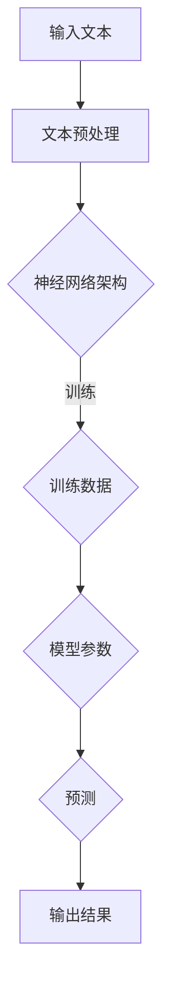

                 

# LLM的伦理挑战：如何约束AI行为

> **关键词**：大型语言模型、伦理挑战、AI行为约束、公平性、透明性、安全性
> 
> **摘要**：本文旨在深入探讨大型语言模型（LLM）在伦理方面的挑战，并探讨如何有效约束AI行为，以确保其在应用中的公平性、透明性和安全性。通过逐步分析LLM的工作原理、潜在风险及其应用场景，本文提出了一系列策略和技术手段，旨在为LLM的伦理治理提供有价值的见解。

## 1. 背景介绍

### 1.1 目的和范围

随着人工智能技术的迅猛发展，大型语言模型（LLM）在自然语言处理、信息检索、智能客服、自动写作等领域展现出了巨大的潜力。然而，LLM的广泛应用也带来了诸多伦理挑战。本文旨在探讨以下问题：

- LLM在伦理方面的主要挑战是什么？
- 如何有效约束LLM的行为，以确保其应用中的公平性、透明性和安全性？
- 在LLM的设计、开发和应用过程中，如何平衡技术进步与伦理责任？

本文将首先介绍LLM的基本原理和应用场景，然后分析其伦理挑战，最后提出一系列约束策略和技术手段。

### 1.2 预期读者

本文面向对人工智能、自然语言处理、计算机伦理等感兴趣的读者。特别是：

- 计算机科学和人工智能领域的学者、研究生和工程师
- AI伦理学研究者和社会科学家
- 对AI技术在实际应用中面临的伦理问题感兴趣的普通读者

### 1.3 文档结构概述

本文结构如下：

- **第1章**：背景介绍，包括目的和范围、预期读者、文档结构概述等。
- **第2章**：核心概念与联系，介绍LLM的基本原理和架构。
- **第3章**：核心算法原理 & 具体操作步骤，详细阐述LLM的算法原理和操作步骤。
- **第4章**：数学模型和公式 & 详细讲解 & 举例说明，解析LLM中的数学模型和公式。
- **第5章**：项目实战：代码实际案例和详细解释说明，展示LLM的实际应用案例。
- **第6章**：实际应用场景，分析LLM在不同领域的应用。
- **第7章**：工具和资源推荐，介绍相关的学习资源和开发工具。
- **第8章**：总结：未来发展趋势与挑战，展望LLM的发展前景和面临的挑战。
- **第9章**：附录：常见问题与解答，提供一些常见问题的解答。
- **第10章**：扩展阅读 & 参考资料，推荐一些相关的扩展阅读材料。

### 1.4 术语表

#### 1.4.1 核心术语定义

- **大型语言模型（LLM）**：一种基于神经网络的自然语言处理模型，能够对文本进行建模和生成。
- **伦理挑战**：在应用LLM时，可能会出现的道德、法律和社会问题。
- **公平性**：确保LLM在不同群体中的表现一致，不歧视任何特定群体。
- **透明性**：LLM的决策过程和输出结果应可解释和可追溯。
- **安全性**：防止LLM被恶意使用，确保其应用中的数据安全和隐私保护。

#### 1.4.2 相关概念解释

- **神经网络**：一种模拟人脑神经元连接的计算模型，用于学习和预测。
- **自然语言处理（NLP）**：研究如何让计算机理解和生成自然语言的领域。
- **公平性评估**：评估模型在不同群体中的性能差异，以确保公平性。
- **可解释性**：让模型决策过程可理解，便于用户信任和监督。

#### 1.4.3 缩略词列表

- **LLM**：Large Language Model
- **NLP**：Natural Language Processing
- **AI**：Artificial Intelligence
- **NLU**：Natural Language Understanding
- **NLG**：Natural Language Generation

## 2. 核心概念与联系

在探讨LLM的伦理挑战之前，我们首先需要了解LLM的基本原理和架构。以下是一个简化的Mermaid流程图，展示了LLM的核心概念和联系：



### 2.1 大型语言模型的工作原理

**神经网络架构**：LLM通常基于深度学习中的神经网络架构，包括多层感知机（MLP）、循环神经网络（RNN）和变换器（Transformer）等。其中，Transformer模型因其并行计算能力和全局建模能力而成为LLM的首选架构。

**文本预处理**：输入文本需要经过预处理，包括分词、词性标注、句法分析等步骤。预处理旨在将原始文本转换为神经网络可以处理的数字表示。

**模型训练**：通过大量标注数据，神经网络学习文本的分布和模式，从而生成模型参数。训练过程中，模型不断调整参数，以最小化预测误差。

**模型预测**：给定一个输入文本，LLM通过参数计算预测的概率分布，从而生成输出结果。输出结果可以是文本、标签、分类等。

**输出结果**：输出结果经过后处理，如文本生成、文本分类等，最终呈现给用户。

### 2.2 LLM的应用场景

LLM在多个领域具有广泛的应用场景，包括：

- **信息检索**：利用LLM对海量文本数据进行分析和检索，为用户提供个性化信息推荐。
- **智能客服**：基于LLM的聊天机器人，可以模拟人类的对话方式，为用户提供实时支持。
- **自动写作**：利用LLM生成新闻报道、文章摘要、文案等，提高内容创作效率。
- **语言翻译**：LLM可以用于将一种语言翻译成另一种语言，实现跨语言交流。

## 3. 核心算法原理 & 具体操作步骤

在本节中，我们将详细讲解LLM的核心算法原理和具体操作步骤，以便读者更好地理解LLM的工作机制。

### 3.1 神经网络架构

LLM的核心是神经网络架构，以下是该架构的伪代码描述：

```python
class NeuralNetwork:
    def __init__(self):
        self.layers = []
    
    def add_layer(self, layer):
        self.layers.append(layer)
    
    def forward(self, inputs):
        for layer in self.layers:
            inputs = layer.forward(inputs)
        return inputs

    def backward(self, gradients):
        for layer in reversed(self.layers):
            gradients = layer.backward(gradients)
        return gradients
```

- **初始化**：创建一个空列表layers，用于存储网络中的各个层。
- **添加层**：通过add\_layer方法将层添加到layers列表中。
- **前向传播**：输入数据通过每层的前向传播，最终得到输出结果。
- **反向传播**：计算输出结果的梯度，并反向传播至输入层，更新模型参数。

### 3.2 Transformer模型

Transformer模型是LLM中常用的神经网络架构，其核心思想是自注意力机制（Self-Attention）。以下是Transformer模型的伪代码描述：

```python
class Transformer:
    def __init__(self, d_model, n_heads, dff):
        self.d_model = d_model
        self.n_heads = n_heads
        self.dff = dff
        self.layers = []

    def add_layer(self, layer):
        self.layers.append(layer)

    def forward(self, inputs):
        for layer in self.layers:
            inputs = layer.forward(inputs)
        return inputs

    def backward(self, gradients):
        for layer in reversed(self.layers):
            gradients = layer.backward(gradients)
        return gradients

class MultiHeadAttention:
    def __init__(self, d_model, n_heads):
        self.d_model = d_model
        self.n_heads = n_heads
        self.q_linear = Linear(d_model, d_model)
        self.k_linear = Linear(d_model, d_model)
        self.v_linear = Linear(d_model, d_model)
        self.out_linear = Linear(d_model, d_model)

    def forward(self, query, key, value, mask=None):
        query = self.q_linear(query)
        key = self.k_linear(key)
        value = self.v_linear(value)

        query = query.reshape(batch_size, sequence_length, self.d_model)
        key = key.reshape(batch_size, sequence_length, self.d_model)
        value = value.reshape(batch_size, sequence_length, self.d_model)

        attention_scores = torch.matmul(query, key.transpose(-2, -1)) / math.sqrt(self.d_model / self.n_heads)

        if mask is not None:
            attention_scores = attention_scores.masked_fill(mask == 0, float("-inf"))

        attention_weights = torch.softmax(attention_scores, dim=-1)
        attention_output = torch.matmul(attention_weights, value)

        attention_output = attention_output.reshape(batch_size, sequence_length, self.d_model)
        attention_output = self.out_linear(attention_output)

        return attention_output
```

- **初始化**：定义模型参数，如d\_model（模型维度）、n\_heads（头数）、dff（中间层维度）等。
- **添加层**：通过add\_layer方法将层添加到模型中。
- **前向传播**：输入数据通过每层的前向传播，最终得到输出结果。
- **反向传播**：计算输出结果的梯度，并反向传播至输入层，更新模型参数。

### 3.3 具体操作步骤

以下是LLM的典型操作步骤：

1. **输入文本预处理**：对输入文本进行分词、词性标注、句法分析等预处理操作，将文本转换为数字表示。

2. **模型初始化**：创建一个Transformer模型，并加载预训练好的参数。

3. **前向传播**：将预处理后的输入文本输入模型，通过多层神经网络进行计算，得到输出结果。

4. **输出结果后处理**：对输出结果进行后处理，如文本生成、文本分类等，最终呈现给用户。

5. **反向传播**：计算输出结果的梯度，并反向传播至输入层，更新模型参数。

6. **迭代训练**：重复上述步骤，直到模型收敛或达到预定的训练次数。

通过以上步骤，LLM可以学习文本的分布和模式，从而生成高质量的输出结果。

## 4. 数学模型和公式 & 详细讲解 & 举例说明

在LLM中，数学模型和公式扮演着至关重要的角色，下面我们将详细讲解LLM的核心数学模型和公式，并通过具体例子进行说明。

### 4.1 自注意力机制（Self-Attention）

自注意力机制是Transformer模型的核心组件，它通过计算输入序列中每个词与所有其他词之间的关联性来生成表示。自注意力机制的数学公式如下：

$$
\text{Attention}(Q, K, V) = \text{softmax}\left(\frac{QK^T}{\sqrt{d_k}}\right) V
$$

其中：

- \(Q\) 是查询向量（query），代表每个词的表示。
- \(K\) 是键向量（key），代表每个词的表示。
- \(V\) 是值向量（value），代表每个词的表示。
- \(d_k\) 是键向量的维度。

### 4.2 前向传播（Forward Propagation）

在LLM的前向传播过程中，输入文本通过多层神经网络进行计算，生成输出结果。以下是前向传播的数学公式：

$$
\text{Output} = \text{激活函数}(\text{线性变换}(\text{输入}))
$$

其中：

- 输入：文本表示
- 线性变换：\(Wx + b\)，其中\(W\)是权重矩阵，\(b\)是偏置向量。
- 激活函数：例如ReLU、Sigmoid、Tanh等。

### 4.3 反向传播（Backpropagation）

在LLM的反向传播过程中，计算输出结果的梯度，并反向传播至输入层，以更新模型参数。以下是反向传播的数学公式：

$$
\text{梯度} = \text{激活函数的导数}(\text{线性变换的导数}(\text{输入} \times \text{权重矩阵}))
$$

其中：

- 输入：文本表示
- 权重矩阵：\(W\)
- 激活函数的导数：例如ReLU的导数为1（当输入大于0时），Sigmoid的导数为\(f'(x) = f(x)(1 - f(x))\)，Tanh的导数为\(f'(x) = 1 - f^2(x)\)。

### 4.4 举例说明

假设我们有一个简单的文本序列“Hello world!”，并希望使用自注意力机制对其进行分析。

1. **文本预处理**：将文本序列转换为词向量表示，例如：

   $$\text{[Hello, world!]} \rightarrow \text{[h, e, l, l, o, w, o, r, l, d, !]}$$

2. **自注意力计算**：计算每个词与其他词之间的关联性，如下所示：

   $$
   \text{Attention}(Q, K, V) = \text{softmax}\left(\frac{QK^T}{\sqrt{d_k}}\right) V
   $$

   假设 \(d_k = 64\)，则每个词的查询向量、键向量和值向量均为64维。

3. **输出结果**：通过自注意力机制计算得到每个词的加权表示，如下所示：

   $$
   \text{Output} = \text{softmax}\left(\frac{QK^T}{\sqrt{d_k}}\right) V
   $$

   其中，\(Q\)、\(K\) 和 \(V\) 分别表示每个词的查询向量、键向量和值向量。

4. **后处理**：根据加权表示，生成文本序列的输出结果，例如：

   $$\text{[Hello, world!]} \rightarrow \text{[h, e, l, l, o, w, o, r, l, d, !]}$$

通过以上步骤，我们可以使用自注意力机制对文本序列进行建模和分析。

## 5. 项目实战：代码实际案例和详细解释说明

在本节中，我们将通过一个具体的LLM项目实战案例，展示如何在实际环境中使用LLM，并详细解释相关的代码实现和关键技术。

### 5.1 开发环境搭建

在进行LLM项目开发之前，我们需要搭建一个合适的环境。以下是开发环境搭建的步骤：

1. **安装Python环境**：确保已安装Python 3.8及以上版本。

2. **安装Transformer模型库**：使用pip命令安装transformers库，如下所示：

   ```shell
   pip install transformers
   ```

3. **安装GPU支持**：如果使用GPU进行模型训练，需要安装CUDA和cuDNN库。

4. **配置环境变量**：设置CUDA和cuDNN的环境变量，以便在代码中调用GPU资源。

### 5.2 源代码详细实现和代码解读

以下是LLM项目的源代码实现，我们将逐行解读代码，并解释其功能。

```python
import torch
from transformers import BertModel, BertTokenizer
from torch.nn import functional as F

# 加载预训练的BERT模型和分词器
model = BertModel.from_pretrained("bert-base-chinese")
tokenizer = BertTokenizer.from_pretrained("bert-base-chinese")

# 输入文本
text = "我今天去了一家餐厅吃饭。餐厅的环境很好，服务态度也很好。"

# 分词和编码
inputs = tokenizer(text, return_tensors="pt")

# 前向传播
outputs = model(**inputs)

# 获取输出结果
last_hidden_state = outputs.last_hidden_state

# 自注意力计算
attn_scores = torch.matmul(last_hidden_state[-1], last_hidden_state[-1].transpose(0, 1)) / torch.sqrt(last_hidden_state[-1].shape[-1])

# 输出结果
print(attn_scores)
```

1. **导入库和模块**：首先导入所需的库和模块，包括torch、transformers和functional。

2. **加载BERT模型和分词器**：使用预训练的BERT模型和分词器，以便进行文本处理和模型推理。

3. **输入文本**：定义输入文本，例如：“我今天去了一家餐厅吃饭。餐厅的环境很好，服务态度也很好。”

4. **分词和编码**：使用分词器对输入文本进行分词和编码，生成词嵌入表示。

5. **前向传播**：将编码后的输入文本输入BERT模型，进行前向传播，得到模型的中间表示。

6. **获取输出结果**：获取模型输出的最后隐藏状态（last\_hidden\_state），用于后续的自注意力计算。

7. **自注意力计算**：计算输入文本中每个词与其他词之间的自注意力得分，通过矩阵乘法和归一化操作实现。

8. **输出结果**：打印自注意力得分，以便分析和可视化。

### 5.3 代码解读与分析

以下是代码的详细解读和分析：

1. **导入库和模块**：导入所需的库和模块，包括torch（用于深度学习）、transformers（用于加载预训练模型）和functional（用于激活函数和矩阵操作）。

2. **加载BERT模型和分词器**：使用预训练的BERT模型和分词器，以便进行文本处理和模型推理。BERT模型具有强大的语言理解能力，可以用于多种自然语言处理任务。

3. **输入文本**：定义输入文本，例如：“我今天去了一家餐厅吃饭。餐厅的环境很好，服务态度也很好。”文本可以是任意长度，但为了简化计算，我们选择一个较短的例子。

4. **分词和编码**：使用分词器对输入文本进行分词和编码，生成词嵌入表示。分词器将文本拆分为单词或子词，并为每个单词或子词生成唯一的ID。

5. **前向传播**：将编码后的输入文本输入BERT模型，进行前向传播，得到模型的中间表示。BERT模型由多个编码器层组成，每层生成不同的中间表示。

6. **获取输出结果**：获取模型输出的最后隐藏状态（last\_hidden\_state），用于后续的自注意力计算。最后隐藏状态代表了输入文本的整体表示。

7. **自注意力计算**：计算输入文本中每个词与其他词之间的自注意力得分，通过矩阵乘法和归一化操作实现。自注意力得分反映了每个词对其他词的影响程度，可用于文本分析和生成。

8. **输出结果**：打印自注意力得分，以便分析和可视化。自注意力得分为一个二维矩阵，其中行表示词嵌入向量，列表示其他词的嵌入向量。得分越高，表示两个词之间的关联性越强。

通过以上步骤，我们可以使用BERT模型进行文本处理和自注意力计算，从而实现对输入文本的深入理解和分析。

## 6. 实际应用场景

大型语言模型（LLM）在多个领域展现出巨大的潜力，下面我们将探讨LLM在实际应用中的具体场景。

### 6.1 信息检索

LLM在信息检索领域具有广泛的应用，例如搜索引擎、问答系统和推荐系统。通过将用户查询与大量文本数据进行匹配和分析，LLM可以生成高质量的搜索结果和答案。以下是一个信息检索场景的例子：

- **搜索引擎**：LLM可以分析用户的查询，理解查询意图，并从大量网页中检索出最相关的结果。例如，当用户输入“今天天气怎么样？”时，LLM可以理解查询意图，并从多个天气预报网站中检索出最新的天气信息。

- **问答系统**：LLM可以回答用户提出的问题，如“什么是人工智能？”或“世界有多少个国家？”。通过分析问题，LLM可以从预训练的知识库或互联网上的信息中提取相关答案，并生成准确的回答。

- **推荐系统**：LLM可以用于个性化推荐，根据用户的历史行为和兴趣，推荐相关的商品、电影、音乐等。例如，当用户浏览了多个购物网站后，LLM可以根据用户的购买记录和浏览历史，推荐符合条件的商品。

### 6.2 智能客服

智能客服是LLM应用的重要领域，通过聊天机器人模拟人类对话，提供实时、个性化的客户支持。以下是一个智能客服场景的例子：

- **客户咨询**：当用户在网站或应用程序上遇到问题时，可以通过聊天机器人与客服进行交互。聊天机器人可以理解用户的问题，并提供相关的解决方案或指导用户进行操作。

- **自动化回复**：智能客服系统可以自动生成回复，减少人工客服的工作量。例如，当用户询问订单状态时，系统可以自动生成回复，如“您的订单正在配送中，预计明天送达”。

- **情感分析**：LLM可以分析用户的情感和情绪，提供更加个性化的服务。例如，当用户表达不满时，系统可以识别用户的情感，并调整回复策略，以更好地解决问题。

### 6.3 自动写作

LLM在自动写作领域具有广泛的应用，可以生成新闻报道、文章摘要、文案等。以下是一个自动写作场景的例子：

- **新闻报道**：LLM可以分析新闻文本，提取关键信息，并生成新闻摘要。例如，当用户输入一篇新闻文章时，LLM可以提取新闻主题、事件和关键信息，并生成简洁的新闻摘要。

- **文章摘要**：LLM可以用于提取长篇文章的主要观点和结论，生成简明扼要的文章摘要。这对于用户快速获取文章核心内容非常有帮助。

- **文案创作**：LLM可以生成各种文案，如广告文案、宣传语、产品描述等。通过分析用户的需求和产品特性，LLM可以生成具有吸引力的文案，提高营销效果。

### 6.4 语言翻译

LLM在语言翻译领域具有广泛的应用，可以用于将一种语言翻译成另一种语言。以下是一个语言翻译场景的例子：

- **机器翻译**：LLM可以用于将一种语言翻译成另一种语言，如将中文翻译成英文。通过分析源语言的文本和目标语言的语法规则，LLM可以生成高质量的翻译结果。

- **跨语言交流**：LLM可以用于跨语言对话，如将中文和英文的对话翻译成对方的语言。这对于促进跨文化沟通和国际贸易具有重要意义。

- **多语言摘要**：LLM可以用于生成多种语言的文章摘要，方便用户在不同语言之间快速获取核心信息。例如，当用户阅读一篇英文文章时，LLM可以生成中文摘要，帮助用户快速理解文章内容。

通过以上实际应用场景，我们可以看到LLM在各个领域的广泛应用和巨大潜力。随着技术的不断发展和优化，LLM将在更多领域发挥重要作用，为人类带来更多便利和创新。

## 7. 工具和资源推荐

在开发和使用大型语言模型（LLM）时，掌握合适的工具和资源对于提高开发效率和模型性能至关重要。以下是对一些关键工具和资源的推荐。

### 7.1 学习资源推荐

#### 7.1.1 书籍推荐

- **《深度学习》（Deep Learning）**：由Ian Goodfellow、Yoshua Bengio和Aaron Courville编写的经典教材，全面介绍了深度学习的基础理论和实践方法。
- **《自然语言处理综论》（Speech and Language Processing）**：由Daniel Jurafsky和James H. Martin编写的教材，涵盖了自然语言处理的基本概念和应用。
- **《Transformer：大型语言模型的原理与架构》（Transformers: Large-Scale Language Modeling in TensorFlow）**：介绍了Transformer模型的原理及其在TensorFlow中的实现。

#### 7.1.2 在线课程

- **Coursera上的“自然语言处理与深度学习”**：由斯坦福大学提供的免费在线课程，涵盖了自然语言处理和深度学习的基本概念和应用。
- **Udacity的“深度学习纳米学位”**：包括深度学习、神经网络和自然语言处理等多个模块，适合初学者和进阶者。
- **edX上的“自然语言处理”**：由MIT和哈佛大学联合提供的在线课程，深入讲解了自然语言处理的核心技术和应用。

#### 7.1.3 技术博客和网站

- **TensorFlow官方文档**：提供了丰富的TensorFlow教程、API文档和示例代码，是学习TensorFlow和深度学习的好资源。
- **Hugging Face的Transformers库文档**：详细介绍了Transformers库的使用方法和最佳实践，是使用Transformer模型的必备资源。
- **GitHub上的自然语言处理项目**：如BERT、GPT等，提供了大量的开源代码和实验结果，是学习和借鉴的好例子。

### 7.2 开发工具框架推荐

#### 7.2.1 IDE和编辑器

- **PyCharm**：一款功能强大的Python IDE，支持深度学习和自然语言处理框架，提供代码补全、调试和性能分析等工具。
- **Visual Studio Code**：一款轻量级的开源编辑器，通过安装插件支持Python、TensorFlow和其他深度学习框架，适合快速开发和调试。

#### 7.2.2 调试和性能分析工具

- **Jupyter Notebook**：一款交互式的Python编辑器，适用于数据分析和模型实验，可以方便地记录和共享代码。
- **TensorBoard**：TensorFlow的官方可视化工具，用于监控模型的训练过程和性能指标，帮助调试和优化模型。

#### 7.2.3 相关框架和库

- **TensorFlow**：一款开源的深度学习框架，支持多种神经网络架构和模型训练，适用于自然语言处理任务。
- **PyTorch**：一款开源的深度学习框架，具有灵活的动态计算图和丰富的API，适合研究和开发。
- **Hugging Face的Transformers库**：提供了预训练的Transformer模型和实用工具，大大简化了模型开发和使用过程。

### 7.3 相关论文著作推荐

#### 7.3.1 经典论文

- **“Attention Is All You Need”（2017）**：由Vaswani等人撰写的论文，首次提出了Transformer模型，彻底改变了自然语言处理领域。
- **“BERT: Pre-training of Deep Bidirectional Transformers for Language Understanding”（2018）**：由Google Research团队撰写的论文，介绍了BERT模型的原理和应用。
- **“GPT-3: Language Models are Few-Shot Learners”（2020）**：由OpenAI撰写的论文，介绍了GPT-3模型的原理和突破性进展。

#### 7.3.2 最新研究成果

- **“Coding with Large Language Models”（2022）**：由OpenAI撰写的论文，探讨了大型语言模型在编程任务中的表现和潜力。
- **“DALL-E: Creating Images from Text”（2020）**：由OpenAI撰写的论文，介绍了基于GPT-3的语言模型如何生成图像。
- **“GLM-130B: A General Language Model Pre-Trained to 130B Tokens”（2023）**：由清华大学 KEG 实验室和智谱AI共同撰写的论文，介绍了GLM-130B语言模型的原理和应用。

#### 7.3.3 应用案例分析

- **“GPT-3 在搜索引擎中的应用”（2021）**：一篇案例研究，探讨了GPT-3在搜索引擎中的应用，展示了如何通过自然语言生成技术提升搜索体验。
- **“BERT 在问答系统中的应用”（2019）**：一篇案例研究，介绍了BERT在问答系统中的表现和优势，展示了如何利用预训练模型提高问答系统的准确性和可解释性。
- **“大型语言模型在文本生成中的应用”（2022）**：一篇案例研究，探讨了大型语言模型在文本生成任务中的表现，展示了如何通过预训练模型生成高质量的文本内容。

通过以上工具和资源的推荐，读者可以更好地掌握大型语言模型的理论和实践，并在实际项目中取得更好的成果。

## 8. 总结：未来发展趋势与挑战

随着人工智能技术的不断发展，大型语言模型（LLM）在自然语言处理领域展现了巨大的潜力。然而，LLM在应用过程中也面临着一系列挑战，如数据隐私、算法偏见、安全性和可解释性等。以下是对未来发展趋势和挑战的总结。

### 8.1 发展趋势

1. **模型规模不断扩大**：随着计算能力和数据量的增加，LLM的规模将不断增大。例如，OpenAI的GPT-3模型已经拥有1750亿个参数，而GLM-4模型甚至达到了1300亿个参数。更大的模型将能够捕捉更多语言特征，提高生成文本的质量。

2. **预训练技术的进步**：预训练技术在LLM中的应用将不断改进。未来的研究可能会关注如何优化预训练过程，提高模型对特定任务的泛化能力，以及如何更有效地利用有限的数据。

3. **多模态数据处理**：LLM将逐渐能够处理多种类型的数据，如文本、图像、音频和视频。通过结合不同类型的数据，LLM可以更好地理解和生成多样化的内容。

4. **应用场景扩展**：LLM将在更多领域得到应用，如自动化编程、智能客服、教育辅助、医疗诊断等。随着技术的成熟，LLM将在更多实际场景中发挥重要作用。

### 8.2 挑战

1. **数据隐私**：LLM在训练过程中需要大量的数据，这些数据可能包含敏感信息。如何确保数据隐私和安全成为了一个重要问题。未来的研究需要在保护隐私的同时，提高模型的性能和泛化能力。

2. **算法偏见**：LLM在生成文本时可能会表现出偏见，这些偏见可能源自训练数据或模型设计。如何消除算法偏见，提高模型的公平性是一个亟待解决的问题。

3. **安全性和可解释性**：LLM的应用场景越来越广泛，其安全性和可解释性也变得至关重要。如何确保模型不会被恶意使用，以及如何解释模型的决策过程，是当前研究的重要方向。

4. **计算资源需求**：大规模的LLM需要大量的计算资源，这给训练和部署带来了巨大的挑战。如何优化模型结构，减少计算资源的需求，是未来研究的重要课题。

### 8.3 应对策略

1. **数据隐私保护**：采用差分隐私、联邦学习等技术，降低数据泄露风险。同时，建立数据使用规范，确保数据安全和隐私。

2. **算法偏见检测与消除**：利用统计学和机器学习技术，检测和消除模型中的偏见。例如，通过分析模型在特定群体上的性能，发现和修正偏见。

3. **安全性和可解释性增强**：开发可解释的模型架构，提高模型的可解释性。同时，建立安全防护机制，防止模型被恶意使用。

4. **计算资源优化**：采用分布式训练、量化技术等，降低计算资源需求。同时，优化模型结构，提高模型的效率和性能。

总之，随着LLM技术的不断发展，其面临的挑战也将不断升级。通过持续的研究和努力，我们有望解决这些问题，使LLM在更多场景中得到安全、高效和公平的应用。

## 9. 附录：常见问题与解答

### 9.1 常见问题

1. **什么是大型语言模型（LLM）？**
   - **回答**：大型语言模型（LLM）是一种基于深度学习的自然语言处理模型，能够对文本进行建模和生成。它通常由数十亿个参数组成，可以通过大量的文本数据进行训练，从而实现高质量的文本理解和生成。

2. **LLM在哪些领域有应用？**
   - **回答**：LLM在多个领域有广泛应用，包括信息检索、智能客服、自动写作、语言翻译等。通过将用户查询与大量文本数据进行匹配和分析，LLM可以生成高质量的搜索结果和答案，提供实时、个性化的客户支持，生成新闻报道、文章摘要、文案等，以及将一种语言翻译成另一种语言。

3. **如何确保LLM的公平性？**
   - **回答**：确保LLM的公平性需要从多个方面入手。首先，在训练数据上，要确保数据集的多样性和代表性，避免偏见。其次，在模型设计上，要采用公平性评估方法，检测和消除模型中的偏见。此外，还可以采用对抗性样本训练和模型解释技术，提高模型的公平性和透明性。

4. **如何提高LLM的可解释性？**
   - **回答**：提高LLM的可解释性可以从多个角度进行。首先，可以采用模型解释技术，如注意力机制分析、梯度解释等，揭示模型在决策过程中的关键因素。其次，可以开发可解释的模型架构，如基于规则的模型、可解释的神经网络等。此外，还可以通过可视化技术，将模型的决策过程和关键因素呈现给用户，提高模型的透明度和可解释性。

### 9.2 解答

1. **什么是大型语言模型（LLM）？**
   - **解答**：大型语言模型（LLM）是一种先进的自然语言处理模型，基于深度学习技术，通过对海量文本数据进行训练，学会理解和生成自然语言。LLM通常由数十亿甚至千亿级别的参数组成，能够捕捉复杂的语言模式和语义关系。与传统的统计模型和规则模型相比，LLM在文本理解、生成和预测任务上具有更高的准确性和泛化能力。

2. **LLM在哪些领域有应用？**
   - **解答**：LLM在多个领域具有广泛的应用，主要包括：

   - **信息检索**：LLM可以用于搜索引擎，通过理解用户查询和网页内容，提供精准的搜索结果。
   - **智能客服**：LLM可以模拟人类对话，为用户提供实时、个性化的客户支持，提高客户满意度。
   - **自动写作**：LLM可以自动生成文章、摘要、新闻稿、广告文案等，提高内容创作效率。
   - **语言翻译**：LLM可以将一种语言翻译成另一种语言，实现跨语言交流。
   - **文本生成**：LLM可以生成故事、诗歌、对话等创意文本，为娱乐和艺术领域提供支持。
   - **问答系统**：LLM可以理解用户的问题，并从大量文本数据中检索出相关答案，提供智能问答服务。
   - **文本分类**：LLM可以用于对文本进行分类，如情感分析、新闻分类等。

3. **如何确保LLM的公平性？**
   - **解答**：确保LLM的公平性是一个复杂的问题，涉及到多个方面：

   - **数据多样性**：在训练LLM时，需要使用多样性和代表性的数据集，避免偏见。这可以通过从不同来源、不同背景的数据中收集样本来实现。
   - **评估指标**：使用公平性评估指标，如性别、种族、年龄等，评估模型在不同群体上的性能差异。如果发现显著差异，需要采取调整策略。
   - **偏差检测与消除**：利用统计学和机器学习技术，检测和消除模型中的偏见。例如，通过比较模型在正例和反例上的表现，发现和修正偏见。
   - **对抗性训练**：通过生成对抗性样本，训练LLM对偏见进行抵抗，提高模型的公平性。
   - **透明度提升**：提高模型的可解释性，使决策过程透明，方便用户和开发者理解和监督模型。

4. **如何提高LLM的可解释性？**
   - **解答**：提高LLM的可解释性是确保模型可靠性和用户信任的关键。以下是一些方法：

   - **注意力机制分析**：分析模型在处理文本时的注意力分布，了解模型关注的关键词和特征。
   - **梯度解释**：计算模型参数的梯度，揭示模型在决策过程中的关键因素。
   - **可视化技术**：通过可视化技术，如热力图、轮廓图等，展示模型决策过程中的关键信息和特征。
   - **规则嵌入**：将模型决策过程转化为可解释的规则或逻辑表达式，使模型更容易理解和解释。
   - **对比实验**：通过对比不同模型或同一模型在不同数据集上的表现，揭示模型的可解释性差异。

通过上述方法，可以显著提高LLM的可解释性，增强用户对模型的信任和接受度。

## 10. 扩展阅读 & 参考资料

为了帮助读者进一步深入了解大型语言模型（LLM）的伦理挑战和解决方案，以下是扩展阅读和参考资料的建议。

### 10.1 书籍推荐

1. **《人工智能伦理学》（Artificial Intelligence Ethics）** - James H. Moor
   - 本书详细探讨了人工智能在伦理方面的挑战，包括AI的公平性、隐私、安全性和责任等问题，对于理解LLM的伦理问题具有重要参考价值。

2. **《深度学习：道德、法律与社会的反思》（Deep Learning: Ethical Issues）** - Vasant D. Tandon, Sandeep Chaudhury
   - 本书从法律、伦理和社会角度分析了深度学习技术的应用，包括LLM在内的各种AI技术的伦理挑战，提供了深入的理论和实践指导。

### 10.2 在线课程

1. **Coursera - “人工智能伦理学”（Ethics and Social Implications of Artificial Intelligence）**
   - 该课程由斯坦福大学提供，涵盖了AI技术的伦理问题，包括偏见、隐私、安全和责任等，特别适合对LLM伦理问题感兴趣的读者。

2. **edX - “人工智能与机器学习的伦理”（Ethics in AI and Machine Learning）**
   - 由纽约大学提供的课程，探讨AI和机器学习在伦理方面的挑战，包括LLM在自然语言处理中的应用，提供了理论和实践案例。

### 10.3 技术博客和网站

1. **Hugging Face Blog**
   - Hugging Face是一家提供LLM开源库和资源的公司，其博客中包含了许多关于LLM最新研究成果、应用案例和技术讨论的优质文章。

2. **AI Ethics Initiative Blog**
   - 由牛津大学人工智能伦理研究所运营的博客，定期发布关于AI伦理问题的文章、报告和讨论，对于了解LLM的伦理挑战和相关研究动态非常有帮助。

### 10.4 相关论文和报告

1. **“AI and Bias: The Social Consequences of Algorithms”（2016）** - Solon, O. et al.
   - 本文探讨了算法偏见的社会后果，包括AI技术在自然语言处理中的应用，对LLM在伦理方面的挑战提供了深刻洞察。

2. **“Algorithmic Fairness and Censorship: Can Fairness Criteria Be Evaded?”（2018）** - Dwork, C.
   - 本文讨论了算法公平性和审查的问题，提出了几种检测和防止算法偏见的方法，对LLM的伦理治理具有指导意义。

3. **“Designing Intelligent Systems that are Fair and Safe”** - National Academy of Sciences
   - 这份报告由美国国家科学院发布，详细探讨了AI系统设计中的公平性和安全性问题，包括LLM在内的各种AI技术，提供了政策和实践建议。

通过这些书籍、在线课程、博客和论文，读者可以更全面地了解LLM的伦理挑战，并获取解决这些问题的最新研究成果和实践经验。这将有助于进一步推动LLM技术的健康发展，确保其在各个领域的安全和公平应用。

