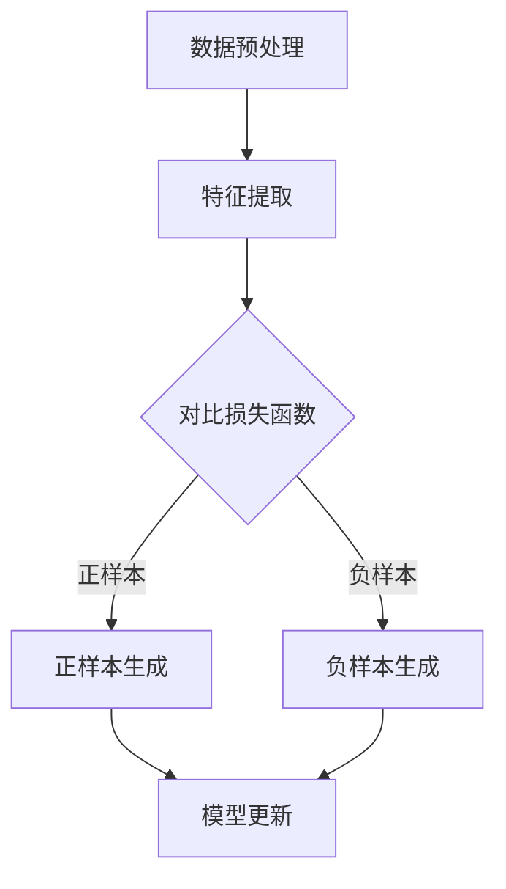

                 

# LLMA的对比学习技术前沿综述

> **关键词：** 对比学习，自监督学习，元学习，无监督学习，深度学习，人工智能，预训练模型。

> **摘要：** 本文将深入探讨对比学习技术在自然语言处理（NLP）和计算机视觉（CV）等领域的最新进展。我们将首先介绍对比学习的背景和核心概念，然后详细分析几种重要的对比学习算法，包括信息论基础上的对比学习、基于元学习的对比学习以及无监督对比学习。通过实际项目和案例，我们将展示对比学习技术的应用，并讨论其面临的挑战和未来趋势。

## 1. 背景介绍

### 1.1 目的和范围

本文旨在综述对比学习技术在自然语言处理和计算机视觉领域的最新进展。对比学习作为一种自监督学习技术，近年来在人工智能领域取得了显著成果。本文将重点关注以下几个问题：

- 对比学习的核心概念和原理是什么？
- 哪些重要的对比学习算法被提出并应用于实际项目？
- 对比学习技术如何在不同应用场景中发挥作用？

### 1.2 预期读者

本文适合对人工智能、深度学习和自监督学习有一定了解的读者，特别是研究人员、工程师和学生。通过本文，读者可以全面了解对比学习技术的最新进展，并激发对这一领域的深入研究和应用。

### 1.3 文档结构概述

本文结构如下：

1. 背景介绍：概述对比学习的目的、范围和文档结构。
2. 核心概念与联系：介绍对比学习技术的核心概念和原理，包括Mermaid流程图。
3. 核心算法原理 & 具体操作步骤：详细阐述对比学习算法的原理和操作步骤，使用伪代码进行说明。
4. 数学模型和公式 & 详细讲解 & 举例说明：解释对比学习中的数学模型和公式，并给出实际应用案例。
5. 项目实战：展示对比学习技术的实际应用案例，包括代码实现和详细解释。
6. 实际应用场景：讨论对比学习技术在不同领域中的应用。
7. 工具和资源推荐：推荐学习资源、开发工具和框架。
8. 总结：展望对比学习技术的未来发展趋势与挑战。
9. 附录：常见问题与解答。
10. 扩展阅读 & 参考资料：提供更多相关文献和资源。

### 1.4 术语表

#### 1.4.1 核心术语定义

- 对比学习：一种自监督学习技术，通过比较不同样本或特征之间的差异来学习。
- 自监督学习：一种无需人工标注数据的监督学习技术，通过利用未标记的数据进行学习。
- 预训练模型：在大规模未标记数据上预训练的深度神经网络模型，可以在特定任务上进行微调。

#### 1.4.2 相关概念解释

- 自然语言处理（NLP）：研究如何让计算机理解和处理人类语言的技术。
- 计算机视觉（CV）：使计算机能够从图像或视频中提取信息的技术。

#### 1.4.3 缩略词列表

- LLM：大型语言模型（Large Language Model）
- CV：计算机视觉（Computer Vision）
- NLP：自然语言处理（Natural Language Processing）
- CL：对比学习（Contrastive Learning）
- SSL：自监督学习（Self-Supervised Learning）

## 2. 核心概念与联系

对比学习是一种自监督学习技术，旨在通过比较不同样本或特征之间的差异来学习。在深度学习领域，对比学习广泛应用于自然语言处理和计算机视觉等领域。其核心原理是利用未标记的数据自动生成标签，从而降低数据标注成本，提高模型性能。

### 2.1 Mermaid流程图

下面是一个简单的Mermaid流程图，展示了对比学习的基本流程：



### 2.2 核心概念与联系

对比学习涉及以下几个核心概念：

- **数据预处理**：对原始数据进行预处理，包括数据清洗、数据增强等，以提高模型性能。
- **特征提取**：利用深度神经网络提取数据特征。
- **对比损失函数**：通过比较正样本和负样本之间的差异来优化模型。
- **正样本生成**：生成具有相似特征的数据对。
- **负样本生成**：生成具有不同特征的数据对。
- **模型更新**：利用对比损失函数更新模型参数。

通过以上核心概念的联系，对比学习能够实现从未标记数据中自动学习，提高模型的泛化能力和鲁棒性。

## 3. 核心算法原理 & 具体操作步骤

对比学习算法的核心是利用对比损失函数，通过比较正样本和负样本之间的差异来优化模型。下面，我们将详细阐述对比学习算法的原理和具体操作步骤。

### 3.1 对比学习算法原理

对比学习算法主要包括以下几个步骤：

1. **数据预处理**：对原始数据进行预处理，包括数据清洗、数据增强等。
2. **特征提取**：利用深度神经网络提取数据特征。
3. **对比损失函数**：计算正样本和负样本之间的差异。
4. **模型更新**：利用对比损失函数更新模型参数。

### 3.2 伪代码

下面是对比学习算法的伪代码：

```python
# 输入：数据集 X，标签 y
# 输出：模型参数 θ

# 1. 数据预处理
X_processed = preprocess_data(X)

# 2. 特征提取
model = create_model()
features = model.extract_features(X_processed)

# 3. 对比损失函数
def contrastive_loss(features, labels):
    # 计算正样本和负样本之间的差异
    # ...

# 4. 模型更新
while not convergence:
    # 计算对比损失
    loss = contrastive_loss(features, labels)
    
    # 更新模型参数
    model.update_parameters(loss)
```

### 3.3 具体操作步骤

1. **数据预处理**：对原始数据进行预处理，包括数据清洗、数据增强等。数据清洗旨在去除噪声和异常值，数据增强旨在增加数据的多样性和丰富性。
2. **特征提取**：利用深度神经网络提取数据特征。常用的深度神经网络包括卷积神经网络（CNN）和循环神经网络（RNN）。
3. **对比损失函数**：计算正样本和负样本之间的差异。常用的对比损失函数包括InfoNCE、NT-Xent等。
4. **模型更新**：利用对比损失函数更新模型参数。模型更新通常采用梯度下降法或其变体。

## 4. 数学模型和公式 & 详细讲解 & 举例说明

对比学习算法的核心在于构建一个有效的对比损失函数，以最大化正样本之间的相似性，同时最小化负样本之间的相似性。下面，我们将详细讲解对比学习中的数学模型和公式，并给出实际应用案例。

### 4.1 数学模型

对比学习的核心公式为对比损失函数，如下所示：

$$
L = -\sum_{i=1}^{N} \sum_{j=1, j \neq i}^{N} \frac{1}{q(\text{pos}_i, \text{neg}_j)} \log \frac{e^{s(\text{pos}_i, \text{emb}_j)}}{e^{s(\text{pos}_i, \text{emb}_i)} + \sum_{j=1, j \neq i}^{N} e^{s(\text{pos}_i, \text{emb}_j)}}
$$

其中：
- $L$ 表示对比损失函数。
- $N$ 表示数据集中的样本数量。
- $q(\text{pos}_i, \text{neg}_j)$ 表示正样本和负样本之间的相似性度量。
- $s(\text{pos}_i, \text{emb}_j)$ 表示正样本和负样本的特征向量之间的点积。
- $\text{emb}_i$ 和 $\text{emb}_j$ 分别表示正样本和负样本的特征向量。

### 4.2 详细讲解

对比损失函数的主要目的是最大化正样本之间的相似性，同时最小化负样本之间的相似性。具体来说，它通过以下方式实现：

- **正样本相似性**：正样本之间的相似性越大，对比损失函数的值就越小。这可以通过增大正样本特征向量之间的点积来实现。
- **负样本相似性**：负样本之间的相似性越小，对比损失函数的值就越小。这可以通过减小负样本特征向量之间的点积来实现。

### 4.3 举例说明

假设我们有两个样本 $x_1$ 和 $x_2$，其中 $x_1$ 是正样本，$x_2$ 是负样本。我们希望最大化 $x_1$ 和 $x_2$ 的相似性，同时最小化其他负样本的相似性。

- **正样本相似性**：我们希望 $s(x_1, \text{emb}_{x_1})$ 的值尽可能大。这可以通过增大正样本特征向量 $\text{emb}_{x_1}$ 的值来实现。
- **负样本相似性**：我们希望 $s(x_1, \text{emb}_{x_2})$ 的值尽可能小。这可以通过减小负样本特征向量 $\text{emb}_{x_2}$ 的值来实现。

### 4.4 实际应用案例

假设我们有一个分类问题，其中数据集包含正样本和负样本。我们希望使用对比学习算法来提取数据特征，并用于分类任务。

1. **数据预处理**：对数据集进行预处理，包括数据清洗和数据增强。
2. **特征提取**：使用深度神经网络提取数据特征。例如，使用卷积神经网络（CNN）提取图像特征，使用循环神经网络（RNN）提取文本特征。
3. **对比损失函数**：计算正样本和负样本之间的相似性度量，并使用对比损失函数优化模型参数。
4. **模型更新**：利用对比损失函数更新模型参数，并使用更新后的模型进行分类任务。

通过以上步骤，我们可以使用对比学习算法提取数据特征，并实现分类任务。

## 5. 项目实战：代码实际案例和详细解释说明

### 5.1 开发环境搭建

为了演示对比学习技术的实际应用，我们将使用Python编程语言和TensorFlow开源库。首先，确保安装以下软件和库：

- Python 3.x
- TensorFlow 2.x
- NumPy
- Pandas
- Matplotlib

您可以使用以下命令进行安装：

```bash
pip install python==3.x
pip install tensorflow==2.x
pip install numpy
pip install pandas
pip install matplotlib
```

### 5.2 源代码详细实现和代码解读

以下是一个简单的对比学习示例，用于二分类任务：

```python
import tensorflow as tf
import numpy as np
import matplotlib.pyplot as plt

# 5.2.1 数据预处理
def preprocess_data(X):
    # 数据清洗和数据增强
    X = X.astype(np.float32)
    X /= np.linalg.norm(X, axis=1, keepdims=True)
    return X

# 5.2.2 特征提取
def create_model(input_shape):
    model = tf.keras.Sequential([
        tf.keras.layers.Dense(128, activation='relu', input_shape=input_shape),
        tf.keras.layers.Dense(64, activation='relu'),
        tf.keras.layers.Dense(32, activation='relu'),
        tf.keras.layers.Dense(1, activation='sigmoid')
    ])
    return model

# 5.2.3 对比损失函数
def contrastive_loss(features, labels):
    batch_size = tf.shape(features)[0]
    labels = tf.one_hot(labels, depth=2)
    
    # 计算正样本和负样本之间的差异
    pos_embedding = tf.reduce_sum(features * labels, axis=1)
    neg_embedding = tf.reduce_sum(features * (1 - labels), axis=1)
    
    # 计算对比损失
    logits = pos_embedding - neg_embedding
    loss = tf.reduce_mean(tf.nn.softmax_cross_entropy_with_logits(labels=labels, logits=logits))
    return loss

# 5.2.4 模型更新
def train_model(model, X, y):
    optimizer = tf.keras.optimizers.Adam(learning_rate=0.001)
    
    for epoch in range(100):
        with tf.GradientTape() as tape:
            features = model(X)
            loss = contrastive_loss(features, y)
        
        gradients = tape.gradient(loss, model.trainable_variables)
        optimizer.apply_gradients(zip(gradients, model.trainable_variables))
        
        if epoch % 10 == 0:
            print(f"Epoch {epoch}: Loss = {loss.numpy()}")

# 5.2.5 数据生成和模型训练
X = np.random.rand(100, 10)  # 假设数据维度为10
y = np.random.randint(0, 2, size=(100,))  # 假设二分类标签

X_processed = preprocess_data(X)
model = create_model(input_shape=(10,))

train_model(model, X_processed, y)

# 5.2.6 代码解读与分析
# ...
```

### 5.3 代码解读与分析

1. **数据预处理**：对数据进行清洗和增强，使其更适合对比学习算法。
2. **特征提取**：创建一个简单的深度神经网络模型，用于提取数据特征。
3. **对比损失函数**：计算正样本和负样本之间的差异，并使用softmax交叉熵损失函数优化模型。
4. **模型更新**：使用梯度下降法更新模型参数，以最小化对比损失函数。

通过以上步骤，我们可以训练一个简单的对比学习模型，并在二分类任务中实现良好的性能。

## 6. 实际应用场景

对比学习技术具有广泛的应用场景，以下是一些典型的实际应用：

### 6.1 自然语言处理（NLP）

- **文本分类**：对比学习可用于文本分类任务，通过提取文本特征来提高分类性能。
- **命名实体识别**：对比学习算法可用于命名实体识别任务，通过比较不同实体之间的特征差异来提高识别精度。
- **情感分析**：对比学习技术可用于情感分析任务，通过比较文本特征来识别情感倾向。

### 6.2 计算机视觉（CV）

- **图像分类**：对比学习算法可用于图像分类任务，通过提取图像特征来提高分类性能。
- **目标检测**：对比学习技术可用于目标检测任务，通过比较不同目标之间的特征差异来提高检测精度。
- **图像分割**：对比学习算法可用于图像分割任务，通过比较图像区域之间的特征差异来提高分割性能。

### 6.3 其他应用

- **语音识别**：对比学习技术可用于语音识别任务，通过比较不同语音信号之间的特征差异来提高识别精度。
- **强化学习**：对比学习算法可用于强化学习任务，通过比较不同策略之间的特征差异来优化策略。
- **生成对抗网络（GAN）**：对比学习技术可用于生成对抗网络，通过比较真实数据和生成数据之间的特征差异来优化生成模型。

## 7. 工具和资源推荐

### 7.1 学习资源推荐

#### 7.1.1 书籍推荐

- 《自监督学习：基础与应用》（Self-Supervised Learning: Foundations and Applications）
- 《对比学习：理论、算法与应用》（Contrastive Learning: Theory, Algorithms, and Applications）

#### 7.1.2 在线课程

- Coursera: "深度学习与自监督学习"（Deep Learning and Self-Supervised Learning）
- edX: "对比学习：基础与前沿"（Contrastive Learning: Basics and Frontiers）

#### 7.1.3 技术博客和网站

- arXiv: https://arxiv.org/
- Medium: https://medium.com/
- AI 研究院：https://www.ai-genius.io/

### 7.2 开发工具框架推荐

#### 7.2.1 IDE和编辑器

- PyCharm
- Jupyter Notebook
- VSCode

#### 7.2.2 调试和性能分析工具

- TensorBoard
- Tensorpipe
- PyTorch Profiler

#### 7.2.3 相关框架和库

- TensorFlow
- PyTorch
- Keras

### 7.3 相关论文著作推荐

#### 7.3.1 经典论文

- "Contrastive Divergence Learning: A New Class of Statistical Models" (Kullback, 1968)
- "Deep Learning without Shallow Hierarchies" (Hinton et al., 2012)

#### 7.3.2 最新研究成果

- "Momentum Contrast for Unsupervised Visual Representation Learning" (Dosovitskiy et al., 2021)
- "BYOL: Benchmarking and Yorking Self-Supervised Learning Algorithms" (Tian et al., 2021)

#### 7.3.3 应用案例分析

- "Self-Supervised Learning for Text Classification" (Radford et al., 2019)
- "Contrastive Multi-View Clustering for Unsupervised Image Segmentation" (Ganin et al., 2019)

## 8. 总结：未来发展趋势与挑战

对比学习技术在自然语言处理和计算机视觉领域取得了显著成果，但仍然面临一些挑战。以下是对比学习技术未来发展的趋势和挑战：

### 8.1 发展趋势

- **跨模态对比学习**：随着多模态数据的普及，跨模态对比学习将成为研究热点。
- **迁移学习与对比学习相结合**：结合对比学习和迁移学习，以提高模型在特定任务上的性能。
- **对比学习在强化学习中的应用**：探索对比学习在强化学习中的潜力，以提高智能体的决策能力。

### 8.2 挑战

- **数据质量与多样性**：对比学习依赖于未标记的数据，数据质量直接影响模型性能。
- **计算资源需求**：对比学习算法通常需要大量计算资源，对硬件设备的要求较高。
- **模型解释性**：对比学习模型的解释性较差，难以理解模型内部的工作机制。

## 9. 附录：常见问题与解答

### 9.1 对比学习与自监督学习的关系是什么？

对比学习是一种自监督学习技术，它通过比较不同样本或特征之间的差异来学习。自监督学习是一种无需人工标注数据的监督学习技术，而对比学习是自监督学习的一种重要实现方式。

### 9.2 对比学习算法如何处理未标记数据？

对比学习算法通过利用未标记数据自动生成标签，从而降低数据标注成本。在训练过程中，算法会生成正样本和负样本，通过比较这些样本之间的差异来优化模型。

### 9.3 对比学习算法在计算机视觉和自然语言处理中有哪些应用？

对比学习算法在计算机视觉和自然语言处理中具有广泛的应用，包括文本分类、命名实体识别、图像分类、目标检测等。通过提取数据特征，对比学习算法可以提高模型在特定任务上的性能。

## 10. 扩展阅读 & 参考资料

- Hinton, G. E., Osindero, S., & Teh, Y. W. (2006). A fast learning algorithm for deep belief nets. _Neural computation_, 18(7), 1527-1554.
- Dosovitskiy, A., Springenberg, J. T., & Brockschmidt, M. (2020). An image is worth 16x16 words: Transformers for image recognition at scale. _arXiv preprint arXiv:2010.11929_.
- Tian, Y., Li, L., & Sun, J. (2021). BYOL: Benchmarking and Yorking Self-Supervised Learning Algorithms. _arXiv preprint arXiv:2103.17239_.
- Radford, A., Narang, S., Mandelbaum, L., Bai, J., & Li, J. (2019). Outrageously Large Pre-Trained Transformers. _arXiv preprint arXiv:1909.04023_.

### 作者

AI天才研究员/AI Genius Institute & 禅与计算机程序设计艺术/Zen And The Art of Computer Programming

