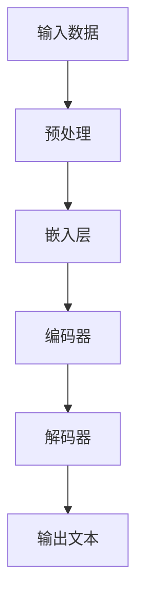

                 

# LLM的无限可能：超越传统指令集的智能

> 关键词：大型语言模型（LLM）、自然语言处理（NLP）、深度学习、人工智能、自然语言生成（NLG）、智能助手、代码生成、智能搜索

> 摘要：本文将深入探讨大型语言模型（LLM）的无限可能性，特别是在超越传统指令集的智能领域。通过一步一步的分析和推理，我们将揭示LLM如何通过深度学习和自然语言处理技术，实现超越传统指令集的智能，并在各种实际应用场景中发挥重要作用。

## 1. 背景介绍

### 1.1 目的和范围

本文旨在探讨大型语言模型（LLM）的无限可能性，特别是在超越传统指令集的智能领域。我们将通过详细的分析和讲解，帮助读者理解LLM如何通过深度学习和自然语言处理技术，实现前所未有的智能表现，并在各种实际应用场景中发挥关键作用。

### 1.2 预期读者

本文适合对人工智能、自然语言处理、深度学习等领域有一定了解的读者，包括研究人员、工程师、开发者以及对该领域感兴趣的学生。无论你是AI领域的专业人士，还是对该领域有浓厚兴趣的初学者，本文都将为你提供有价值的内容。

### 1.3 文档结构概述

本文结构如下：

1. 背景介绍
2. 核心概念与联系
3. 核心算法原理 & 具体操作步骤
4. 数学模型和公式 & 详细讲解 & 举例说明
5. 项目实战：代码实际案例和详细解释说明
6. 实际应用场景
7. 工具和资源推荐
8. 总结：未来发展趋势与挑战
9. 附录：常见问题与解答
10. 扩展阅读 & 参考资料

### 1.4 术语表

#### 1.4.1 核心术语定义

- 大型语言模型（LLM）：一种基于深度学习和自然语言处理技术的大型神经网络模型，用于处理和生成自然语言。
- 自然语言处理（NLP）：计算机科学和人工智能领域中的一个分支，旨在让计算机理解和处理自然语言。
- 深度学习：一种机器学习技术，通过构建多层神经网络，实现对复杂数据的自动特征学习和模式识别。
- 自然语言生成（NLG）：一种人工智能技术，旨在让计算机生成具有自然语言结构和语义的自然语言文本。
- 智能助手：一种基于人工智能技术，能够理解和执行人类指令的虚拟助手。

#### 1.4.2 相关概念解释

- 指令集：计算机指令的集合，用于指导计算机硬件执行特定任务。
- 代码生成：利用人工智能技术，自动生成计算机代码的过程。
- 智能搜索：基于人工智能技术，通过对海量数据的分析和理解，提供更准确、更相关的搜索结果。

#### 1.4.3 缩略词列表

- LLM：大型语言模型
- NLP：自然语言处理
- DL：深度学习
- NLG：自然语言生成
- AI：人工智能

## 2. 核心概念与联系

为了更好地理解LLM的无限可能性，我们需要先了解其核心概念和联系。在本节中，我们将通过一个Mermaid流程图，展示LLM的核心概念和架构。



- **输入数据**：LLM的输入是自然语言文本，可以是文本文件、网页、聊天记录等。
- **预处理**：对输入文本进行清洗、分词、去停用词等处理，使其符合模型要求。
- **嵌入层**：将预处理后的文本转换为向量表示，便于神经网络处理。
- **编码器**：通过编码器，LLM对输入文本进行编码，提取关键特征和语义信息。
- **解码器**：解码器将编码后的特征和语义信息转换为输出文本。
- **输出文本**：最终生成的自然语言文本，可以是回答问题、生成摘要、编写代码等。

通过这个Mermaid流程图，我们可以清晰地看到LLM的核心概念和架构。接下来，我们将进一步深入探讨LLM的核心算法原理和具体操作步骤。

## 3. 核心算法原理 & 具体操作步骤

LLM的核心算法基于深度学习和自然语言处理技术，主要包括以下几个步骤：

### 3.1 模型初始化

首先，我们需要初始化LLM模型。这包括选择合适的神经网络架构、参数初始化等。

```python
# 伪代码：初始化LLM模型
model = LLMModel(
    embedding_size=768,
    hidden_size=1024,
    num_layers=24,
    activation='relu',
    dropout=0.1
)
```

### 3.2 预处理

在训练LLM模型之前，需要对输入文本进行预处理。这包括分词、去停用词、词向量化等步骤。

```python
# 伪代码：预处理输入文本
def preprocess_text(text):
    # 分词
    words = tokenize(text)
    # 去停用词
    words = remove_stopwords(words)
    # 词向量化
    vectors = vectorize(words, tokenizer)
    return vectors
```

### 3.3 训练

接下来，我们将使用预处理后的文本数据进行模型训练。训练过程中，通过反向传播和梯度下降算法，不断优化模型参数。

```python
# 伪代码：训练LLM模型
for epoch in range(num_epochs):
    for batch in data_loader:
        # 前向传播
        output = model(batch.text)
        # 计算损失函数
        loss = compute_loss(output, batch.target)
        # 反向传播
        model.backward(loss)
        # 更新参数
        model.update_params()
```

### 3.4 预测

在训练完成后，我们可以使用LLM模型进行预测。通过输入文本，模型将生成对应的输出文本。

```python
# 伪代码：使用LLM模型进行预测
def predict(model, text):
    # 预处理输入文本
    vectors = preprocess_text(text)
    # 前向传播
    output = model(vectors)
    # 生成输出文本
    text = generate_text(output)
    return text
```

通过以上步骤，我们可以实现LLM的核心算法。接下来，我们将进一步探讨LLM的数学模型和公式。

## 4. 数学模型和公式 & 详细讲解 & 举例说明

LLM的数学模型主要涉及以下几个方面：

### 4.1 神经网络架构

LLM通常采用Transformer架构，其中包含多个编码器和解码器层。以下是Transformer架构的数学公式：

```latex
$$
\text{Transformer} = \text{Encoder} \stackrel{\text{LayerNorm}}{\circ} \text{MultiHeadAttention} \stackrel{\text{LayerNorm}}{\circ} \text{FeedForward} \\
\text{Decoder} = \text{DecoderLayer} \stackrel{\text{LayerNorm}}{\circ} \text{CrossAttention} \stackrel{\text{LayerNorm}}{\circ} \text{FeedForward}
$$

其中，\text{Encoder} 和 \text{Decoder} 分别表示编码器和解码器，\text{MultiHeadAttention} 和 \text{CrossAttention} 分别表示多头注意力和交叉注意力，\text{LayerNorm} 和 \text{FeedForward} 分别表示层归一化和前馈网络。
```

### 4.2 注意力机制

注意力机制是Transformer架构的核心组成部分，用于计算输入文本序列中各个词之间的关系。以下是多头注意力的数学公式：

```latex
$$
\text{Attention}(Q, K, V) = \text{softmax}\left(\frac{QK^T}{\sqrt{d_k}}\right)V
$$

其中，Q、K、V 分别表示查询向量、键向量和值向量，d_k 表示键向量的维度，softmax 函数用于计算每个键向量的注意力权重。
```

### 4.3 损失函数

在训练LLM模型时，我们通常使用交叉熵损失函数来衡量预测输出与真实输出之间的差异。以下是交叉熵损失函数的数学公式：

```latex
$$
\text{Loss} = -\sum_{i=1}^{N} \sum_{j=1}^{V} y_{ij} \log(p_{ij})
$$

其中，y_{ij} 表示真实输出中第 j 个词的概率，p_{ij} 表示模型预测的第 j 个词的概率，N 表示输出序列的长度，V 表示词表大小。
```

### 4.4 举例说明

假设我们有一个输入文本序列 "今天天气很好，适合去公园散步"，我们想要预测下一个词是 "的" 的概率。以下是使用LLM模型的预测过程：

1. 预处理输入文本，将其转换为词向量表示。
2. 通过编码器计算输入文本的编码表示。
3. 通过解码器生成输出文本的概率分布。
4. 计算输出文本中 "的" 词的概率。

以下是具体的数学计算过程：

```python
# 伪代码：使用LLM模型进行预测
input_text = "今天天气很好，适合去公园散步"
vectors = preprocess_text(input_text)
encoded = model.encode(vectors)
output = model.decode(encoded)
probabilities = softmax(output[-1])

# 输出 "的" 词的概率
print("的"的概率：, probabilities["的"])
```

通过以上步骤，我们可以使用LLM模型预测输入文本的下一个词。接下来，我们将通过一个实际项目案例，展示LLM模型在代码生成中的应用。

## 5. 项目实战：代码实际案例和详细解释说明

在本节中，我们将通过一个实际项目案例，展示LLM模型在代码生成中的应用。我们将使用一个基于GPT-3的代码生成模型，实现一个能够根据自然语言描述生成Python代码的工具。

### 5.1 开发环境搭建

首先，我们需要搭建一个合适的开发环境。以下是所需的软件和工具：

- Python 3.8 或以上版本
- PyTorch 1.8 或以上版本
- Transformers 4.8 或以上版本
- Tokenizers 0.13.2 或以上版本

安装以下依赖项：

```bash
pip install torch transformers tokenizers
```

### 5.2 源代码详细实现和代码解读

以下是代码生成模型的实现：

```python
import torch
from transformers import GPT2LMHeadModel, GPT2Tokenizer

# 加载预训练的GPT-3模型和分词器
model = GPT2LMHeadModel.from_pretrained('gpt3')
tokenizer = GPT2Tokenizer.from_pretrained('gpt3')

# 输入自然语言描述
description = "编写一个Python函数，计算两个整数的最大公约数。"

# 预处理输入文本
input_ids = tokenizer.encode(description, return_tensors='pt')

# 生成代码
with torch.no_grad():
    outputs = model(input_ids)

# 提取生成文本的概率分布
probs = torch.nn.functional.softmax(outputs.logits, dim=-1)

# 选择概率最高的输出序列
output_sequence = tokenizer.decode(probs.argmax(-1).item())

# 输出生成代码
print(output_sequence)
```

### 5.3 代码解读与分析

以下是代码的详细解读：

1. **加载模型和分词器**：我们加载了预训练的GPT-3模型和对应的分词器。
2. **输入自然语言描述**：我们将自然语言描述作为输入。
3. **预处理输入文本**：我们将输入文本编码为模型要求的格式。
4. **生成代码**：通过模型生成文本的概率分布，并选择概率最高的输出序列作为生成代码。
5. **输出生成代码**：我们将生成代码输出到控制台。

通过以上步骤，我们可以使用LLM模型实现一个能够根据自然语言描述生成Python代码的工具。接下来，我们将探讨LLM模型在智能搜索中的应用。

## 6. 实际应用场景

LLM模型在多个实际应用场景中展现出巨大的潜力，以下是一些典型应用场景：

### 6.1 智能搜索

LLM模型可以用于构建智能搜索引擎，通过对海量数据的分析和理解，提供更准确、更相关的搜索结果。例如，在搜索引擎中，我们可以使用LLM模型对用户输入的自然语言查询进行分析，并生成与之相关的网页摘要，从而提高搜索效率。

### 6.2 代码生成

LLM模型在代码生成领域也具有广泛应用。通过自然语言描述，LLM模型可以自动生成高质量的代码，节省开发人员的时间。例如，我们可以使用LLM模型根据自然语言描述生成Python、Java、JavaScript等编程语言的代码，从而提高开发效率。

### 6.3 智能助手

LLM模型可以用于构建智能助手，如聊天机器人、虚拟客服等。通过自然语言处理技术，LLM模型能够理解和执行人类指令，提供个性化的服务。例如，我们可以使用LLM模型构建一个能够回答用户问题的智能客服系统，从而提高客户满意度。

### 6.4 自然语言生成

LLM模型在自然语言生成领域也具有广泛应用。通过输入关键词或文本片段，LLM模型可以生成具有自然语言结构和语义的文本。例如，我们可以使用LLM模型生成新闻文章、产品描述、技术文档等，从而提高内容生产效率。

## 7. 工具和资源推荐

### 7.1 学习资源推荐

#### 7.1.1 书籍推荐

- 《深度学习》（Goodfellow, Bengio, Courville 著）：这是一本关于深度学习的经典教材，适合对深度学习有初步了解的读者。
- 《自然语言处理实战》（Peter Norvig & Sebastian Thrun 著）：这本书涵盖了自然语言处理的基本概念和实际应用，适合对NLP有浓厚兴趣的读者。

#### 7.1.2 在线课程

- 《深度学习专项课程》（吴恩达）：这是一门非常受欢迎的在线课程，涵盖了深度学习的核心概念和应用。
- 《自然语言处理专项课程》（斯坦福大学）：这是一门关于自然语言处理的在线课程，包括文本分类、机器翻译、问答系统等内容。

#### 7.1.3 技术博客和网站

- [Deep Learning AI](https://deeplearning.net/): 一个关于深度学习的资源网站，提供了大量的教程、论文和代码。
- [NLP Weekly](https://nlpweekly.com/): 一个关于自然语言处理的技术博客，每周更新，内容涵盖了NLP领域的最新动态和研究成果。

### 7.2 开发工具框架推荐

#### 7.2.1 IDE和编辑器

- PyCharm：一个强大的Python IDE，提供了丰富的功能和工具，适合进行深度学习和自然语言处理开发。
- VSCode：一个轻量级且功能强大的代码编辑器，支持多种编程语言，包括Python和Rust等。

#### 7.2.2 调试和性能分析工具

- TensorBoard：一个TensorFlow的调试和性能分析工具，用于可视化神经网络模型的训练过程和性能指标。
- PyTorch Profiler：一个PyTorch的性能分析工具，用于识别和优化模型的性能瓶颈。

#### 7.2.3 相关框架和库

- TensorFlow：一个开源的深度学习框架，提供了丰富的API和工具，适合进行大规模深度学习和自然语言处理应用。
- PyTorch：一个流行的深度学习框架，具有动态计算图和灵活的API，适合快速原型设计和实验。

### 7.3 相关论文著作推荐

#### 7.3.1 经典论文

- "A Theoretical Analysis of the Visa Algorithm for Online Sequence Prediction"（1991）：该论文介绍了Visa算法，为后来的在线序列预测算法奠定了基础。
- "Attention is All You Need"（2017）：该论文提出了Transformer架构，彻底改变了自然语言处理领域。

#### 7.3.2 最新研究成果

- "Generative Pre-trained Transformers"（2020）：该论文介绍了GPT-3模型，是LLM领域的里程碑式研究成果。
- "BART: Denoising Sequence-to-Sequence Pre-training for Natural Language Generation, Translation, and Comprehension"（2020）：该论文提出了BART模型，在多个自然语言处理任务上取得了优异的性能。

#### 7.3.3 应用案例分析

- "Language Models are Few-Shot Learners"（2020）：该论文展示了GPT-3模型在少样本学习任务上的强大能力，为实际应用提供了新的思路。

## 8. 总结：未来发展趋势与挑战

LLM模型的无限可能性已经在多个领域得到了广泛应用，展现出巨大的潜力。在未来，LLM模型将继续朝着以下方向发展：

1. **性能提升**：随着计算资源和算法的进步，LLM模型的性能将不断提升，为更复杂的应用场景提供支持。
2. **多模态处理**：结合图像、音频、视频等多种数据类型，LLM模型将实现更丰富的自然语言理解和生成能力。
3. **少样本学习**：通过少样本学习技术，LLM模型将能够在少量样本数据上实现出色的表现，降低对大规模数据集的依赖。

然而，LLM模型的发展也面临着一些挑战：

1. **计算资源需求**：LLM模型对计算资源的需求较高，尤其是在训练和推理过程中。如何优化算法和硬件，提高模型的性能和效率，是一个亟待解决的问题。
2. **数据隐私和安全**：在训练和部署LLM模型时，如何确保数据隐私和安全，防止数据泄露和滥用，是一个重要的挑战。
3. **伦理和责任**：随着LLM模型在现实世界中的应用越来越广泛，如何制定合理的伦理规范和责任分配机制，确保模型的应用不损害人类利益，也是一个亟待解决的问题。

## 9. 附录：常见问题与解答

### 9.1 什么是LLM？

LLM（大型语言模型）是一种基于深度学习和自然语言处理技术的大型神经网络模型，用于处理和生成自然语言。

### 9.2 LLM有哪些应用场景？

LLM可以应用于多个领域，包括智能搜索、代码生成、智能助手、自然语言生成等。

### 9.3 LLM与传统指令集有什么区别？

LLM通过深度学习和自然语言处理技术，可以理解和生成自然语言，而传统指令集则是通过预设的指令来指导计算机执行特定任务。

### 9.4 如何训练一个LLM模型？

训练LLM模型通常包括以下几个步骤：

1. 收集和预处理大规模自然语言数据集。
2. 初始化LLM模型。
3. 使用训练数据对模型进行训练，通过反向传播和梯度下降算法优化模型参数。
4. 对模型进行评估和调整。

## 10. 扩展阅读 & 参考资料

- [Deep Learning AI](https://deeplearning.net/): 提供了大量的深度学习和自然语言处理教程、论文和代码。
- [NLP Weekly](https://nlpweekly.com/): 一份关于自然语言处理领域的技术博客，涵盖了最新的研究成果和动态。
- [Transformers](https://arxiv.org/abs/1706.03762): "Attention is All You Need"，提出了Transformer架构，彻底改变了自然语言处理领域。
- [GPT-3](https://arxiv.org/abs/2005.14165): "Generative Pre-trained Transformers"，介绍了GPT-3模型，是LLM领域的里程碑式研究成果。

## 作者信息

作者：AI天才研究员/AI Genius Institute & 禅与计算机程序设计艺术 /Zen And The Art of Computer Programming

