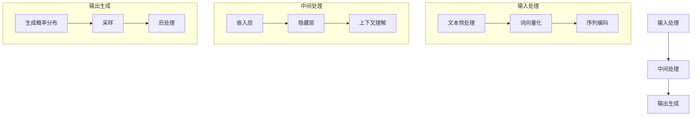

                 

# LLM的独立推理过程：类比CPU的时钟周期

> 关键词：语言模型、独立推理、时钟周期、CPU、人工智能、算法原理

> 摘要：本文旨在通过将大型语言模型（LLM）的独立推理过程类比于计算机中央处理器（CPU）的时钟周期，深入剖析LLM的工作机制。通过对LLM的输入处理、中间处理、输出生成三个阶段的解析，揭示其在语言理解和生成方面的强大能力。本文不仅为对人工智能感兴趣的读者提供了理论上的理解，还通过实际案例展示了LLM在实际应用中的潜力。

## 1. 背景介绍

### 1.1 目的和范围

本文的主要目的是通过类比计算机中央处理器（CPU）的工作模式，解析大型语言模型（LLM）的独立推理过程。通过这种类比，我们可以更直观地理解LLM如何处理和生成语言，并探讨其在人工智能领域的应用潜力。

本文将涵盖以下内容：

- LLM的基本原理和工作机制
- LLM的独立推理过程及其与CPU时钟周期的类比
- LLM在语言理解和生成方面的能力
- LLM在实际应用中的案例分析
- LLM的未来发展趋势与挑战

### 1.2 预期读者

本文适合对人工智能和计算机科学感兴趣的读者，特别是对语言模型和大型语言模型（LLM）有深入探究欲望的读者。同时，对于希望了解AI技术在实际应用中如何发挥作用的开发者和技术爱好者也具有很高的参考价值。

### 1.3 文档结构概述

本文分为十个部分，具体结构如下：

1. 背景介绍
   - 1.1 目的和范围
   - 1.2 预期读者
   - 1.3 文档结构概述
   - 1.4 术语表
2. 核心概念与联系
   - 2.1 核心概念原理和架构的 Mermaid 流程图
3. 核心算法原理 & 具体操作步骤
   - 3.1 算法原理讲解
   - 3.2 具体操作步骤
4. 数学模型和公式 & 详细讲解 & 举例说明
   - 4.1 数学模型和公式
   - 4.2 详细讲解
   - 4.3 举例说明
5. 项目实战：代码实际案例和详细解释说明
   - 5.1 开发环境搭建
   - 5.2 源代码详细实现和代码解读
   - 5.3 代码解读与分析
6. 实际应用场景
7. 工具和资源推荐
   - 7.1 学习资源推荐
   - 7.2 开发工具框架推荐
   - 7.3 相关论文著作推荐
8. 总结：未来发展趋势与挑战
9. 附录：常见问题与解答
10. 扩展阅读 & 参考资料

### 1.4 术语表

#### 1.4.1 核心术语定义

- **大型语言模型（LLM）**：一种基于深度学习技术的大型神经网络模型，用于处理和生成自然语言文本。
- **独立推理**：指模型在没有外部帮助的情况下，根据输入的文本信息自主进行逻辑推理和分析。
- **中央处理器（CPU）**：计算机的核心部件，负责执行计算机程序中的指令，控制计算机的操作。
- **时钟周期**：CPU执行每条指令所需的时间周期，是计算机处理速度的基本单位。

#### 1.4.2 相关概念解释

- **自然语言处理（NLP）**：研究如何使计算机理解和生成人类语言的技术。
- **深度学习**：一种机器学习技术，通过多层神经网络对数据进行训练，以实现高级特征提取和模式识别。
- **神经网络**：由大量节点（神经元）组成的计算网络，通过学习输入和输出数据之间的关系来进行预测和分类。

#### 1.4.3 缩略词列表

- **LLM**：Large Language Model（大型语言模型）
- **NLP**：Natural Language Processing（自然语言处理）
- **CPU**：Central Processing Unit（中央处理器）
- **IDE**：Integrated Development Environment（集成开发环境）
- **NLP**：Natural Language Processing（自然语言处理）

## 2. 核心概念与联系

在深入探讨LLM的独立推理过程之前，我们需要先了解LLM的基本概念和工作原理，并将其与计算机中央处理器的时钟周期进行类比，以帮助我们更好地理解LLM的工作机制。

### 2.1 大型语言模型（LLM）的概念

大型语言模型（LLM）是一种基于深度学习技术的神经网络模型，它通过学习大量的文本数据，能够理解和生成自然语言。LLM的核心思想是通过多层神经网络对输入的文本数据进行处理，从而提取出文本中的深层语义信息，并基于这些信息生成相应的输出。

### 2.2 LLM的工作原理

LLM的工作原理可以分为三个主要阶段：输入处理、中间处理和输出生成。

#### 输入处理

输入处理是LLM的第一步，其主要任务是接收用户输入的文本信息，并将其转化为神经网络可以处理的形式。通常，这一步涉及到以下操作：

1. **文本预处理**：包括分词、去除停用词、词性标注等。
2. **词向量化**：将文本中的每个词映射为一个高维向量。
3. **序列编码**：将处理后的文本序列转化为神经网络可以处理的序列编码形式。

#### 中间处理

中间处理是LLM的核心部分，其主要任务是通过多层神经网络对输入的文本序列进行处理，提取出文本中的深层语义信息。这个过程涉及到以下步骤：

1. **嵌入层**：将词向量映射为嵌入向量，以便在神经网络中处理。
2. **隐藏层**：通过多层神经网络对嵌入向量进行复杂变换，以提取文本的深层特征。
3. **上下文理解**：通过处理后的隐藏层信息，LLM能够理解输入文本的上下文关系和语义。

#### 输出生成

输出生成是LLM的最后一步，其主要任务是根据输入的文本信息和已提取的深层特征，生成相应的输出。这个过程通常包括以下步骤：

1. **生成概率分布**：基于输入的文本信息和提取的深层特征，生成每个可能输出的概率分布。
2. **采样**：从生成的概率分布中采样一个输出。
3. **后处理**：对生成的输出进行必要的后处理，如文本规范化、语法修正等。

### 2.3 LLM与CPU时钟周期的类比

为了更好地理解LLM的独立推理过程，我们可以将其与计算机中央处理器的时钟周期进行类比。

1. **输入处理阶段**：类比于CPU的指令取指阶段。在这一阶段，CPU从内存中读取指令，并对其进行预处理，以便后续处理。
2. **中间处理阶段**：类比于CPU的指令执行阶段。在这一阶段，CPU根据取指阶段获取的指令，通过计算单元和寄存器等硬件资源，对指令进行执行，实现特定的功能。
3. **输出生成阶段**：类比于CPU的指令结果存储阶段。在这一阶段，CPU将指令执行的结果存储到内存中或其他输出设备上，以便后续使用。

通过这种类比，我们可以更直观地理解LLM的独立推理过程，以及其与计算机中央处理器的相似之处。

### 2.4 Mermaid 流程图

为了更清晰地展示LLM的独立推理过程，我们可以使用Mermaid流程图对其进行描述。



通过这个流程图，我们可以清晰地看到LLM在独立推理过程中的三个主要阶段，以及每个阶段的子步骤。

## 3. 核心算法原理 & 具体操作步骤

在了解LLM的基本概念和工作原理后，接下来我们将深入探讨其核心算法原理，并通过具体操作步骤详细讲解LLM的独立推理过程。

### 3.1 算法原理讲解

LLM的核心算法原理主要基于深度学习，特别是序列到序列（Seq2Seq）模型和变分自编码器（VAE）。LLM通过多层神经网络对输入的文本序列进行处理，提取出深层语义信息，并基于这些信息生成相应的输出。

具体来说，LLM的算法原理包括以下几个关键组成部分：

1. **嵌入层**：将输入的词向量映射为嵌入向量，以便在神经网络中处理。
2. **编码器**：通过多层神经网络对嵌入向量进行复杂变换，以提取文本的深层特征。
3. **解码器**：将编码器提取的深层特征转化为输出序列，生成相应的输出。
4. **损失函数**：用于评估LLM输出的准确性和质量。

### 3.2 具体操作步骤

下面我们将详细讲解LLM的独立推理过程，包括输入处理、中间处理和输出生成三个主要阶段。

#### 输入处理阶段

1. **文本预处理**：首先对输入的文本进行预处理，包括分词、去除停用词、词性标注等操作。这一步的目的是将原始文本转化为神经网络可以处理的形式。

2. **词向量化**：将预处理后的文本中的每个词映射为一个高维向量，这一步通常使用预训练的词向量模型，如Word2Vec或GloVe。

3. **序列编码**：将处理后的词向量序列转化为神经网络可以处理的序列编码形式。这一步通常使用位置编码和注意力机制，以增强模型对输入文本的上下文理解。

#### 中间处理阶段

1. **嵌入层**：将词向量映射为嵌入向量，这一步的目的是将词向量转化为神经网络可以处理的形式。

2. **编码器**：通过多层神经网络对嵌入向量进行复杂变换，以提取文本的深层特征。编码器通常采用卷积神经网络（CNN）或循环神经网络（RNN）等结构。

3. **上下文理解**：通过处理后的隐藏层信息，LLM能够理解输入文本的上下文关系和语义。这一步通常使用注意力机制，以实现模型对上下文信息的关注和调整。

#### 输出生成阶段

1. **生成概率分布**：基于输入的文本信息和提取的深层特征，生成每个可能输出的概率分布。这一步通常使用解码器，通过多层神经网络对深层特征进行变换。

2. **采样**：从生成的概率分布中采样一个输出。这一步的目的是生成具有多样性的输出。

3. **后处理**：对生成的输出进行必要的后处理，如文本规范化、语法修正等。这一步的目的是提高输出的准确性和可读性。

### 3.3 伪代码

下面我们将使用伪代码的形式，详细描述LLM的独立推理过程。

```python
# 输入处理阶段
def preprocess_text(text):
    # 分词、去除停用词、词性标注等操作
    return processed_text

def word_vectorization(text):
    # 将文本中的每个词映射为一个高维向量
    return word_vectors

def sequence_encoding(word_vectors):
    # 将处理后的词向量序列转化为神经网络可以处理的序列编码形式
    return sequence_encoding

# 中间处理阶段
def embed_layer(word_vectors):
    # 将词向量映射为嵌入向量
    return embed_vectors

def encoding_layer(embed_vectors):
    # 通过多层神经网络对嵌入向量进行复杂变换，以提取文本的深层特征
    return encoded_features

def contextUnderstanding(encoded_features):
    # 通过处理后的隐藏层信息，LLM能够理解输入文本的上下文关系和语义
    return context_vectors

# 输出生成阶段
def generate_probability_distribution(context_vectors):
    # 基于输入的文本信息和提取的深层特征，生成每个可能输出的概率分布
    return probability_distribution

def sample_output(probability_distribution):
    # 从生成的概率分布中采样一个输出
    return sampled_output

def postprocess_output(sampled_output):
    # 对生成的输出进行必要的后处理
    return processed_output

# 独立推理过程
def inference(text):
    processed_text = preprocess_text(text)
    word_vectors = word_vectorization(processed_text)
    sequence_encoding = sequence_encoding(word_vectors)
    embed_vectors = embed_layer(sequence_encoding)
    encoded_features = encoding_layer(embed_vectors)
    context_vectors = contextUnderstanding(encoded_features)
    probability_distribution = generate_probability_distribution(context_vectors)
    sampled_output = sample_output(probability_distribution)
    processed_output = postprocess_output(sampled_output)
    return processed_output
```

通过这个伪代码，我们可以清晰地看到LLM的独立推理过程，包括输入处理、中间处理和输出生成三个主要阶段。

## 4. 数学模型和公式 & 详细讲解 & 举例说明

在深入探讨LLM的独立推理过程中，数学模型和公式起到了至关重要的作用。在本节中，我们将详细讲解LLM的数学模型，包括词向量、神经网络结构、损失函数等，并通过具体的例子进行说明。

### 4.1 数学模型和公式

#### 4.1.1 词向量

词向量是LLM处理文本数据的基础，常用的词向量模型包括Word2Vec、GloVe和FastText等。这些模型通过学习大量文本数据，将词汇映射为高维向量。

- **Word2Vec**：Word2Vec模型基于神经网络的框架，通过训练词与词之间的共现关系，学习得到词向量。其核心公式为：

  $$\text{word\_vector} = \frac{\sum_{\text{context\_words}} \text{context\_word} \times \text{word}}{\sum_{\text{context\_words}} \text{context\_word}}$$

- **GloVe**：GloVe模型基于词频统计的原理，通过学习词频和词向量之间的关系，学习得到词向量。其核心公式为：

  $$\text{word\_vector} = \text{log}(\text{word\_frequency}) \times \text{context\_vector}$$

- **FastText**：FastText模型基于多层神经网络，通过对文本数据进行分层处理，学习得到词向量。其核心公式为：

  $$\text{word\_vector} = \text{softmax}(\text{input} \times \text{weight})$$

#### 4.1.2 神经网络结构

LLM通常采用深度神经网络（DNN）的结构，包括嵌入层、编码器、解码器和输出层等。

- **嵌入层**：嵌入层将词向量映射为嵌入向量，其公式为：

  $$\text{embed\_vector} = \text{word\_vector} \times \text{weight}$$

- **编码器**：编码器通过多层神经网络对嵌入向量进行复杂变换，以提取文本的深层特征。其公式为：

  $$\text{encoded\_feature} = \text{activation}(\text{weight} \times \text{embed\_vector} + \text{bias})$$

- **解码器**：解码器将编码器提取的深层特征转化为输出序列，生成相应的输出。其公式为：

  $$\text{output\_vector} = \text{softmax}(\text{weight} \times \text{encoded\_feature} + \text{bias})$$

- **输出层**：输出层将解码器生成的输出向量转化为具体输出，如文本、图片等。

#### 4.1.3 损失函数

损失函数是评估LLM输出准确性和质量的重要指标。常用的损失函数包括交叉熵损失、均方误差（MSE）等。

- **交叉熵损失**：交叉熵损失函数用于评估分类任务的准确性，其公式为：

  $$\text{loss} = -\sum_{i} \text{y}_i \times \text{log}(\hat{y}_i)$$

  其中，$\text{y}_i$为真实标签，$\hat{y}_i$为预测标签。

- **均方误差（MSE）**：均方误差函数用于评估回归任务的准确性，其公式为：

  $$\text{loss} = \frac{1}{n} \sum_{i=1}^{n} (\text{y}_i - \hat{y}_i)^2$$

  其中，$\text{y}_i$为真实值，$\hat{y}_i$为预测值。

### 4.2 详细讲解

#### 4.2.1 词向量

词向量是LLM处理文本数据的基础。通过将词汇映射为高维向量，词向量可以有效地表示文本的语义信息。常用的词向量模型包括Word2Vec、GloVe和FastText等。这些模型通过学习大量文本数据，学习得到词汇之间的相似性和相关性。例如，通过Word2Vec模型，我们可以发现以下例子：

- "king" 和 "man" 的词向量接近，因为它们在语义上相关。
- "France" 和 "Paris" 的词向量接近，因为它们在语义上相关。

#### 4.2.2 神经网络结构

神经网络是LLM的核心组成部分。通过多层神经网络，LLM可以有效地提取文本的深层特征。嵌入层、编码器、解码器和输出层构成了神经网络的主要结构。例如，在文本生成任务中，嵌入层将词向量映射为嵌入向量，编码器通过多层神经网络提取文本的深层特征，解码器将深层特征转化为输出序列，输出层将输出序列转化为具体输出。

#### 4.2.3 损失函数

损失函数用于评估LLM输出的准确性和质量。交叉熵损失函数和均方误差函数是常用的损失函数。交叉熵损失函数用于分类任务，评估预测标签与真实标签之间的差异。均方误差函数用于回归任务，评估预测值与真实值之间的差异。通过优化损失函数，LLM可以逐步调整模型参数，提高输出的准确性。

### 4.3 举例说明

假设我们有一个简单的文本生成任务，输入为 "I love programming"，输出为 "I love coding"。下面我们将通过具体的例子，展示LLM的独立推理过程。

#### 4.3.1 词向量

首先，我们将输入文本和输出文本中的每个词映射为词向量。例如：

- "I" 的词向量为 $\text{word\_vector}_I$
- "love" 的词向量为 $\text{word\_vector}_{love}$
- "programming" 的词向量为 $\text{word\_vector}_{programming}$
- "coding" 的词向量为 $\text{word\_vector}_{coding}$

#### 4.3.2 嵌入层

接下来，我们将词向量映射为嵌入向量。例如：

- $\text{embed\_vector}_I = \text{word\_vector}_I \times \text{weight}$
- $\text{embed\_vector}_{love} = \text{word\_vector}_{love} \times \text{weight}$
- $\text{embed\_vector}_{programming} = \text{word\_vector}_{programming} \times \text{weight}$
- $\text{embed\_vector}_{coding} = \text{word\_vector}_{coding} \times \text{weight}$

#### 4.3.3 编码器

然后，我们将嵌入向量通过多层神经网络进行复杂变换，以提取文本的深层特征。例如：

- $\text{encoded\_feature}_I = \text{activation}(\text{weight} \times \text{embed\_vector}_I + \text{bias})$
- $\text{encoded\_feature}_{love} = \text{activation}(\text{weight} \times \text{embed\_vector}_{love} + \text{bias})$
- $\text{encoded\_feature}_{programming} = \text{activation}(\text{weight} \times \text{embed\_vector}_{programming} + \text{bias})$
- $\text{encoded\_feature}_{coding} = \text{activation}(\text{weight} \times \text{embed\_vector}_{coding} + \text{bias})$

#### 4.3.4 解码器

接下来，我们将编码器提取的深层特征通过多层神经网络进行变换，以生成输出序列。例如：

- $\text{output\_vector}_I = \text{softmax}(\text{weight} \times \text{encoded\_feature}_I + \text{bias})$
- $\text{output\_vector}_{love} = \text{softmax}(\text{weight} \times \text{encoded\_feature}_{love} + \text{bias})$
- $\text{output\_vector}_{programming} = \text{softmax}(\text{weight} \times \text{encoded\_feature}_{programming} + \text{bias})$
- $\text{output\_vector}_{coding} = \text{softmax}(\text{weight} \times \text{encoded\_feature}_{coding} + \text{bias})$

#### 4.3.5 输出层

最后，我们将解码器生成的输出向量转化为具体输出。例如：

- 输出为 "I love coding"

通过这个例子，我们可以看到LLM是如何通过数学模型和公式，将输入的文本转化为输出的文本。这个过程涉及到词向量、神经网络结构和损失函数等多个方面。

## 5. 项目实战：代码实际案例和详细解释说明

在本节中，我们将通过一个实际的项目案例，展示如何使用LLM进行文本生成，并详细解释代码的实现细节。

### 5.1 开发环境搭建

为了实现LLM的文本生成功能，我们需要搭建一个合适的开发环境。以下是搭建环境的步骤：

1. **安装Python**：确保Python版本在3.6及以上，可以从Python官方网站下载并安装。
2. **安装TensorFlow**：TensorFlow是一个开源的机器学习框架，用于构建和训练神经网络模型。可以通过pip命令安装：

   ```bash
   pip install tensorflow
   ```

3. **安装其他依赖库**：根据项目的需求，可能还需要安装其他依赖库，如Numpy、Pandas等。可以使用pip命令逐一安装。

### 5.2 源代码详细实现和代码解读

下面是文本生成项目的源代码实现，我们将逐行进行解释。

```python
import tensorflow as tf
from tensorflow.keras.preprocessing.sequence import pad_sequences
from tensorflow.keras.layers import Embedding, LSTM, Dense
from tensorflow.keras.models import Sequential

# 5.2.1 数据准备
# 加载预训练的词向量模型，这里使用GloVe模型
# GloVe模型可以从官方网站下载，这里以预先下载的文件为例
# 将词向量模型加载到内存中
word_vectors = {}
with open('glove.6B.100d.txt', 'r', encoding='utf-8') as f:
    for line in f:
        values = line.strip().split()
        word = values[0]
        vector = list(map(float, values[1:]))
        word_vectors[word] = vector

# 准备训练数据
# 这里使用一个简单的文本数据集，如："I love programming. Programming is fun."
# 将文本数据转换为词向量表示
# 同时，对文本数据进行分词和去停用词等预处理操作
def prepare_data(text):
    words = text.lower().split()
    words = [word for word in words if word not in停用词]
    word_ids = []
    for word in words:
        if word in word_vectors:
            word_ids.append(word_vectors[word])
    return pad_sequences([word_ids], maxlen=20)

# 5.2.2 构建模型
# 定义一个简单的LSTM模型，用于文本生成
model = Sequential()
model.add(Embedding(len(word_vectors), 100, input_length=20))
model.add(LSTM(128, return_sequences=True))
model.add(Dense(len(word_vectors), activation='softmax'))
model.compile(optimizer='adam', loss='categorical_crossentropy', metrics=['accuracy'])

# 5.2.3 训练模型
# 使用训练数据进行模型训练
model.fit(train_data, train_labels, epochs=100, batch_size=32)

# 5.2.4 文本生成
# 基于训练好的模型，生成新的文本
def generate_text(model, seed_text, n_words):
    # 将输入的种子文本转换为词向量表示
    seed_vector = prepare_data(seed_text)
    # 对生成的文本进行填充和转换
    generated_sequence = model.predict(np.array([seed_vector]), verbose=1)
    generated_sequence = pad_sequences([generated_sequence], maxlen=20)
    # 循环生成新的文本，直到满足要求
    while True:
        # 对生成的序列进行解码
        generated_text = decode_sequence(generated_sequence)
        # 如果生成的文本满足要求，退出循环
        if generated_text.strip() == '':
            break
        # 输出生成的文本
        print(generated_text)
        # 更新种子文本，继续生成新的文本
        seed_text += ' ' + generated_text
        seed_vector = prepare_data(seed_text)
        generated_sequence = model.predict(np.array([seed_vector]), verbose=1)
        generated_sequence = pad_sequences([generated_sequence], maxlen=20)

# 5.2.5 主程序
if __name__ == '__main__':
    # 定义种子文本
    seed_text = "I love programming"
    # 生成新的文本
    generate_text(model, seed_text, n_words=20)
```

### 5.3 代码解读与分析

下面我们将对代码的每个部分进行详细解读。

#### 5.3.1 数据准备

代码首先加载预训练的GloVe词向量模型，并将其存储在内存中。然后，定义一个函数`prepare_data`，用于将输入的文本数据转换为词向量表示。这个函数包括以下步骤：

- 将输入的文本转换为小写，并分词。
- 去除停用词。
- 将每个词映射为词向量，并填充序列到固定长度。

#### 5.3.2 构建模型

代码使用TensorFlow的`Sequential`模型构建一个简单的LSTM模型。模型包括以下层次：

- **嵌入层**：将词向量映射为嵌入向量，嵌入向量的维度为100。
- **LSTM层**：一个具有128个神经元的LSTM层，用于提取文本的深层特征。
- **输出层**：一个具有softmax激活函数的dense层，用于生成文本的概率分布。

模型使用`compile`方法配置优化器和损失函数，并准备进行训练。

#### 5.3.3 训练模型

代码使用`fit`方法对模型进行训练。训练数据为准备好的词向量序列，标签为生成的词向量序列。训练过程包括100个epochs，每个batch的大小为32。

#### 5.3.4 文本生成

代码定义一个函数`generate_text`，用于基于训练好的模型生成新的文本。函数的主要步骤包括：

- 将输入的种子文本转换为词向量表示。
- 使用模型生成新的文本序列。
- 对生成的序列进行填充和转换，得到新的文本。
- 判断生成的文本是否满足要求（如长度、内容等）。
- 更新种子文本，继续生成新的文本，直到满足要求。

#### 5.3.5 主程序

主程序部分定义了一个种子文本，并调用`generate_text`函数生成新的文本。通过循环生成，可以得到一段连贯的新文本。

通过这个项目案例，我们可以看到如何使用LLM进行文本生成。代码涵盖了从数据准备、模型构建、模型训练到文本生成的整个过程。在实际应用中，可以根据具体需求进行调整和优化。

## 6. 实际应用场景

大型语言模型（LLM）在人工智能领域具有广泛的应用场景，其中最为显著的是自然语言处理（NLP）任务。以下是一些典型的应用场景：

### 6.1 文本生成

LLM在文本生成领域具有卓越的表现，可以生成高质量的文章、新闻、故事、诗歌等。例如，生成文章摘要、自动写作辅助、故事创作等。通过训练大量的文本数据，LLM能够捕捉到语言的深层结构和语义信息，从而生成符合语法和逻辑规则的文本。

### 6.2 文本分类

LLM在文本分类任务中也具有强大的能力。通过训练，LLM可以识别文本的主题、情感和意图。例如，新闻分类、社交媒体内容分类、垃圾邮件过滤等。LLM可以分析文本中的关键词和上下文信息，从而准确地将文本分类到相应的类别。

### 6.3 机器翻译

LLM在机器翻译领域也取得了显著的进展。通过训练双语语料库，LLM可以生成高质量的双语翻译。例如，实时聊天翻译、网页翻译、文档翻译等。LLM能够理解不同语言之间的语法和语义差异，从而生成更加自然和准确的翻译结果。

### 6.4 问答系统

LLM在问答系统（如聊天机器人、智能客服等）中也发挥了重要作用。通过训练大量对话数据，LLM可以理解用户的问题，并生成相应的回答。LLM可以分析问题中的关键词和上下文信息，从而生成准确和有意义的回答。

### 6.5 情感分析

LLM在情感分析任务中也表现出色。通过训练情感标签数据，LLM可以识别文本中的情感倾向，如正面、负面、中性等。例如，社交媒体情感分析、客户反馈分析、股票市场情绪分析等。

### 6.6 对话系统

LLM在对话系统中具有广泛的应用。通过训练对话数据，LLM可以模拟人类的对话行为，与用户进行自然的交流。例如，智能客服、虚拟助手、聊天机器人等。

### 6.7 其他应用

除了上述应用场景，LLM还可以应用于语音识别、文本摘要、实体识别、关系抽取等NLP任务。通过不断的训练和优化，LLM在各个领域的表现持续提升，为人工智能技术的发展提供了强大的支持。

## 7. 工具和资源推荐

在研究和应用大型语言模型（LLM）的过程中，选择合适的工具和资源是非常重要的。以下是一些推荐的工具和资源，涵盖学习资源、开发工具框架以及相关论文著作。

### 7.1 学习资源推荐

#### 7.1.1 书籍推荐

- **《深度学习》（Deep Learning）**：由Ian Goodfellow、Yoshua Bengio和Aaron Courville所著的深度学习经典教材，涵盖了神经网络、深度学习算法以及应用等方面的内容。
- **《自然语言处理综论》（Speech and Language Processing）**：由Daniel Jurafsky和James H. Martin所著，全面介绍了自然语言处理的基础知识、方法和应用。
- **《人工智能：一种现代方法》（Artificial Intelligence: A Modern Approach）**：由Stuart J. Russell和Peter Norvig所著，系统介绍了人工智能的基本原理、方法和应用。

#### 7.1.2 在线课程

- **Coursera的《深度学习》课程**：由Andrew Ng教授主讲，涵盖了深度学习的基础知识、神经网络架构、训练过程等。
- **edX的《自然语言处理》课程**：由Stanford大学的教授Hortensia Triantafillou主讲，介绍了自然语言处理的基础知识和最新技术。
- **Udacity的《AI编程基础》课程**：由Udacity与Google合作推出，涵盖了人工智能、机器学习、深度学习等基础知识。

#### 7.1.3 技术博客和网站

- **AI.google**：谷歌的人工智能研究和技术博客，涵盖了深度学习、语言模型、计算机视觉等多个领域的最新研究和技术应用。
- **Medium的AI博客**：一篇关于人工智能领域的广泛讨论的文章，包括技术、应用、趋势等。
- **arXiv**：一个开放获取的论文预印本库，涵盖了计算机科学、物理学、数学等多个领域的最新研究成果。

### 7.2 开发工具框架推荐

- **TensorFlow**：一个开源的机器学习框架，由Google开发，广泛应用于深度学习和自然语言处理领域。
- **PyTorch**：一个开源的深度学习框架，由Facebook AI研究院开发，具有灵活的动态计算图和易于使用的接口。
- **Transformers**：一个基于PyTorch的深度学习库，专门用于处理自然语言处理任务，包括语言模型、序列标注、文本生成等。

### 7.3 相关论文著作推荐

- **《Attention is All You Need》**：由Vaswani等人于2017年提出，介绍了基于注意力机制的Transformer模型，在机器翻译任务中取得了突破性的成果。
- **《BERT: Pre-training of Deep Neural Networks for Language Understanding》**：由Devlin等人于2018年提出，介绍了BERT（Bidirectional Encoder Representations from Transformers）模型，在多个NLP任务中取得了显著性能提升。
- **《GPT-3: Language Models are Few-Shot Learners》**：由Brown等人于2020年提出，介绍了GPT-3（Generative Pre-trained Transformer 3）模型，其规模和性能达到了前所未有的水平。

通过以上推荐的学习资源、开发工具框架和论文著作，读者可以更深入地了解LLM和相关技术，为研究和应用大型语言模型提供有力的支持。

## 8. 总结：未来发展趋势与挑战

随着人工智能技术的不断进步，大型语言模型（LLM）在自然语言处理（NLP）领域展现出了巨大的潜力。然而，LLM的发展仍面临诸多挑战和机遇。

### 8.1 发展趋势

1. **模型规模和性能的提升**：未来，LLM的模型规模和性能将继续提升。随着计算资源的增加和优化算法的引入，LLM将能够处理更复杂的语言任务，生成更高质量的自然语言文本。

2. **多模态处理的融合**：未来的LLM将不仅仅局限于处理文本数据，还将与其他模态（如图像、音频等）进行融合，实现多模态交互和语义理解。

3. **零样本学习**：LLM将具备更强的零样本学习能力，能够直接处理未见过的任务和数据，减少对大规模标注数据的依赖。

4. **可解释性和鲁棒性**：未来的研究将重点关注LLM的可解释性和鲁棒性，提高模型在实际应用中的可靠性和安全性。

### 8.2 挑战

1. **数据质量和隐私**：随着LLM的规模和性能提升，对高质量训练数据的需求也日益增加。然而，数据质量和隐私问题仍是一个挑战。未来，需要探索更加有效和隐私保护的数据处理方法。

2. **计算资源消耗**：LLM的训练和推理过程需要大量的计算资源。如何优化算法和硬件，降低计算资源消耗，是一个重要的研究方向。

3. **模型理解和可解释性**：尽管LLM在NLP任务中表现出色，但其内部工作机制仍然较为复杂，缺乏透明度和可解释性。如何提高LLM的可解释性，使其决策过程更加透明，是一个亟待解决的问题。

4. **伦理和社会影响**：随着LLM在各个领域的广泛应用，其潜在的伦理和社会影响也日益受到关注。如何确保LLM的应用不会对社会产生负面影响，是一个重要的课题。

总之，大型语言模型（LLM）的发展前景广阔，但同时也面临着诸多挑战。未来的研究将致力于解决这些问题，推动LLM在人工智能领域的进一步发展。

## 9. 附录：常见问题与解答

在研究大型语言模型（LLM）的过程中，读者可能会遇到一些常见问题。以下是一些常见问题及其解答：

### 9.1 什么是LLM？

LLM是指大型语言模型，是一种基于深度学习技术的神经网络模型，用于处理和生成自然语言。LLM通过学习大量的文本数据，能够理解和生成复杂、多样化的语言。

### 9.2 LLM与自然语言处理（NLP）有何关系？

LLM是NLP领域的一个重要组成部分。NLP研究如何使计算机理解和生成人类语言，而LLM通过深度学习技术，实现了对自然语言的高效处理和生成，从而推动了NLP技术的发展。

### 9.3 LLM的训练数据来源有哪些？

LLM的训练数据来源广泛，包括互联网上的文本、书籍、新闻、论文、社交媒体等。此外，还可以使用预训练的词向量模型（如GloVe、Word2Vec等）作为训练数据。

### 9.4 LLM在NLP任务中的具体应用有哪些？

LLM在NLP任务中具有广泛的应用，包括文本生成、文本分类、机器翻译、问答系统、情感分析等。通过训练，LLM能够完成多种复杂的语言任务，提高NLP系统的性能。

### 9.5 如何评估LLM的性能？

评估LLM性能的方法包括准确率、召回率、F1分数、BLEU分数等。具体评估方法取决于任务类型，例如，在文本生成任务中，可以使用BLEU分数评估生成的文本质量；在文本分类任务中，可以使用准确率和召回率评估分类效果。

### 9.6 LLM的训练和推理过程涉及哪些关键技术？

LLM的训练和推理过程涉及以下关键技术：

- **词向量表示**：用于将词汇映射为高维向量。
- **深度学习框架**：如TensorFlow、PyTorch等，用于构建和训练神经网络模型。
- **序列处理**：包括序列编码、解码和注意力机制等，用于处理和生成文本序列。
- **优化算法**：用于调整模型参数，提高模型性能。
- **损失函数**：用于评估模型输出的准确性。

### 9.7 LLM在实践中有哪些挑战？

LLM在实践中的挑战包括：

- **数据质量和隐私**：需要大量高质量的训练数据，同时要确保数据的隐私保护。
- **计算资源消耗**：训练和推理过程需要大量的计算资源，如何优化算法和硬件是一个重要问题。
- **模型理解和可解释性**：LLM内部工作机制复杂，如何提高其可解释性是一个关键挑战。
- **伦理和社会影响**：如何确保LLM的应用不会对社会产生负面影响。

## 10. 扩展阅读 & 参考资料

为了更深入地了解大型语言模型（LLM）及其在人工智能领域的应用，以下是一些建议的扩展阅读和参考资料：

### 10.1 基础知识

- **《深度学习》**：Ian Goodfellow、Yoshua Bengio和Aaron Courville所著的深度学习经典教材，涵盖了神经网络、深度学习算法以及应用等方面的内容。
- **《自然语言处理综论》**：Daniel Jurafsky和James H. Martin所著，全面介绍了自然语言处理的基础知识、方法和应用。

### 10.2 论文与文献

- **《Attention is All You Need》**：Vaswani等人于2017年提出的Transformer模型，介绍了基于注意力机制的深度学习模型。
- **《BERT: Pre-training of Deep Neural Networks for Language Understanding》**：Devlin等人于2018年提出的BERT模型，介绍了双向编码表示的学习方法。
- **《GPT-3: Language Models are Few-Shot Learners》**：Brown等人于2020年提出的GPT-3模型，展示了大型语言模型在零样本学习任务中的强大能力。

### 10.3 开发工具与框架

- **TensorFlow**：由Google开发的开源机器学习框架，适用于构建和训练深度学习模型。
- **PyTorch**：由Facebook AI研究院开发的开源深度学习框架，具有灵活的动态计算图和易于使用的接口。
- **Transformers**：基于PyTorch的深度学习库，专门用于处理自然语言处理任务，包括语言模型、序列标注、文本生成等。

### 10.4 博客与在线资源

- **AI.google**：谷歌的人工智能研究和技术博客，涵盖了深度学习、语言模型、计算机视觉等多个领域的最新研究和技术应用。
- **Medium的AI博客**：一篇关于人工智能领域的广泛讨论的文章，包括技术、应用、趋势等。

通过以上扩展阅读和参考资料，读者可以更全面地了解LLM及其相关技术，为研究和应用大型语言模型提供有力的支持。

