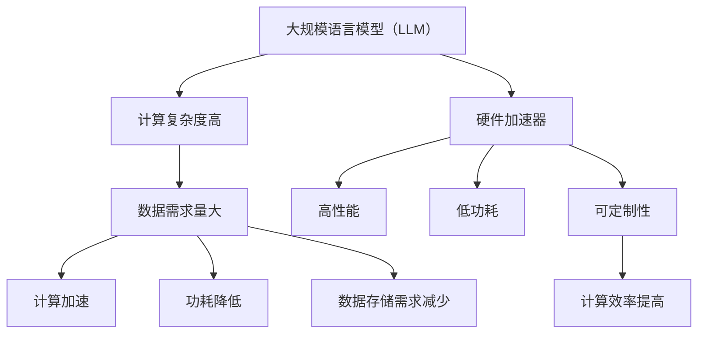

                 

# LLM的硬件加速器设计与实现

> 关键词：LLM、硬件加速器、深度学习、硬件架构、优化设计

> 摘要：本文旨在探讨大规模语言模型（LLM）的硬件加速器设计与实现，通过深入分析LLM的工作原理、硬件加速器的基本概念和架构，提供一种高效、可扩展的硬件设计方案，为LLM在人工智能领域的发展提供技术支持。

## 1. 背景介绍

### 1.1 目的和范围

随着人工智能技术的飞速发展，深度学习在图像识别、自然语言处理、推荐系统等领域取得了显著的成果。大规模语言模型（LLM）作为自然语言处理的核心技术，逐渐成为研究的热点。然而，LLM的高计算复杂度和数据存储需求对计算资源提出了巨大的挑战。为了解决这一问题，硬件加速器作为一种有效的解决方案，逐渐受到关注。

本文旨在探讨LLM的硬件加速器设计与实现，通过对LLM的工作原理、硬件加速器的基本概念和架构进行分析，提出一种高效、可扩展的硬件设计方案。文章将涵盖以下内容：

1. LLM的工作原理及其在自然语言处理中的应用。
2. 硬件加速器的基本概念、架构和分类。
3. LLM硬件加速器的设计原则和关键技术。
4. 实际应用场景和案例。
5. 未来发展趋势与挑战。

### 1.2 预期读者

本文适用于对自然语言处理、深度学习和硬件架构有一定了解的读者，包括：

1. 自然语言处理和人工智能领域的研究人员。
2. 深度学习和硬件工程师。
3. 对LLM硬件加速器感兴趣的工程师和开发者。
4. 高等院校计算机科学与技术专业的师生。

### 1.3 文档结构概述

本文分为十个部分，具体结构如下：

1. 背景介绍：介绍本文的目的、范围、预期读者和文档结构。
2. 核心概念与联系：分析LLM和硬件加速器的基本概念、原理和架构。
3. 核心算法原理 & 具体操作步骤：阐述LLM硬件加速器的核心算法原理和操作步骤。
4. 数学模型和公式 & 详细讲解 & 举例说明：介绍LLM硬件加速器的数学模型和公式，并进行详细讲解和举例说明。
5. 项目实战：代码实际案例和详细解释说明。
6. 实际应用场景：探讨LLM硬件加速器在不同应用场景中的实际应用。
7. 工具和资源推荐：推荐学习资源、开发工具框架和相关论文著作。
8. 总结：未来发展趋势与挑战。
9. 附录：常见问题与解答。
10. 扩展阅读 & 参考资料：提供进一步阅读的文献和资料。

### 1.4 术语表

#### 1.4.1 核心术语定义

- 大规模语言模型（LLM）：一种基于深度学习的自然语言处理模型，具有强大的文本生成和语义理解能力。
- 硬件加速器：一种专门用于加速计算任务的硬件设备，可以提高计算速度和降低功耗。
- 深度学习：一种基于人工神经网络的学习方法，通过模拟人脑神经元之间的连接和相互作用，实现自动特征提取和模式识别。
- 自然语言处理（NLP）：一门研究如何让计算机理解和处理自然语言的学科，包括文本分析、语音识别、机器翻译等。

#### 1.4.2 相关概念解释

- 计算复杂度：描述算法执行过程中所需计算资源的多少，通常用时间复杂度和空间复杂度表示。
- 数据存储需求：指存储和处理大规模语言模型所需的数据量，包括模型参数、输入数据和输出数据等。
- 功耗：指硬件设备在运行过程中消耗的电能，功耗低有利于提高设备的运行效率和降低能源消耗。

#### 1.4.3 缩略词列表

- LLM：大规模语言模型
- AI：人工智能
- NLP：自然语言处理
- DL：深度学习
- GPU：图形处理器
- CPU：中央处理器
- FPGA：现场可编程门阵列
- ASIC：专用集成电路

## 2. 核心概念与联系

在深入探讨LLM的硬件加速器设计与实现之前，我们需要先了解LLM和硬件加速器的基本概念、原理和架构。

### 2.1 大规模语言模型（LLM）

大规模语言模型（LLM）是一种基于深度学习的自然语言处理模型，具有以下特点：

1. **参数规模大**：LLM通常具有数百万甚至数十亿个参数，用于描述输入文本的特征和语义信息。
2. **计算复杂度高**：由于参数规模大，LLM的推理过程涉及大量矩阵运算，计算复杂度高。
3. **数据需求量大**：训练LLM需要大规模的文本数据，用于学习语言模式和语义知识。

LLM的主要应用场景包括：

1. **文本生成**：生成文章、故事、对话等自然语言文本。
2. **语义理解**：理解文本的语义含义，提取关键信息。
3. **机器翻译**：将一种语言翻译成另一种语言。
4. **问答系统**：回答用户关于特定领域的问题。

### 2.2 硬件加速器

硬件加速器是一种专门用于加速计算任务的硬件设备，具有以下特点：

1. **高性能**：硬件加速器可以显著提高计算速度，降低计算复杂度。
2. **低功耗**：硬件加速器通常采用高效的电路设计，具有较低的功耗。
3. **可定制性**：硬件加速器可以根据具体计算任务进行定制，提高计算效率。

硬件加速器的主要分类包括：

1. **GPU（图形处理器）**：主要用于图像处理和图形渲染，具有强大的并行计算能力。
2. **CPU（中央处理器）**：用于通用计算任务，具有较高的计算速度和较低的功耗。
3. **FPGA（现场可编程门阵列）**：具有高度可定制性，可以针对特定计算任务进行优化。
4. **ASIC（专用集成电路）**：为特定计算任务设计的硬件设备，具有最高的计算效率和功耗。

### 2.3 LLM与硬件加速器的联系

LLM和硬件加速器之间的联系主要体现在以下几个方面：

1. **计算加速**：硬件加速器可以显著提高LLM的推理速度，降低计算复杂度。
2. **功耗降低**：硬件加速器具有较低的功耗，有利于提高设备的运行效率和降低能源消耗。
3. **数据存储需求减少**：通过硬件加速器，可以在一定程度上减少模型参数和数据存储的需求。
4. **可定制性**：硬件加速器可以根据具体计算任务进行定制，提高计算效率和性能。

为了更好地理解LLM和硬件加速器的联系，我们可以使用Mermaid流程图来展示核心概念和架构。



通过上述流程图，我们可以清晰地看到LLM和硬件加速器之间的联系，以及它们在优化计算性能、降低功耗、减少数据存储需求等方面的优势。

## 3. 核心算法原理 & 具体操作步骤

在深入探讨LLM硬件加速器的设计与实现之前，我们需要了解LLM的核心算法原理和具体操作步骤。本节将详细介绍LLM的主要算法原理，并使用伪代码来描述其具体操作步骤。

### 3.1 LLM核心算法原理

大规模语言模型（LLM）通常采用基于Transformer的架构，其核心算法原理包括：

1. **多头自注意力机制**：通过计算输入文本中每个词与其他词之间的注意力分数，提取关键信息。
2. **前馈神经网络**：对自注意力机制的结果进行进一步处理，增强模型的表示能力。
3. **多层堆叠**：通过多层自注意力机制和前馈神经网络的堆叠，提高模型的复杂度和表达能力。

### 3.2 LLM具体操作步骤

以下使用伪代码描述LLM的具体操作步骤：

```python
# 输入：文本序列
# 输出：文本序列的表示

def LLM_forward(text):
    # 初始化参数
    WQ, WK, WV, WO, WF = initialize_parameters()

    # 遍历文本序列
    for token in text:
        # 计算词向量和注意力分数
        query = WQ * token
        key = WK * token
        value = WV * token

        # 计算自注意力分数
        attention_scores = dot(query, key)

        # 应用softmax函数，得到注意力权重
        attention_weights = softmax(attention_scores)

        # 计算注意力输出
        context = dot(attention_weights, value)

        # 通过前馈神经网络处理注意力输出
        output = FFN(context)

        # 更新文本序列的表示
        text[:-1] = text[1:]
        text[-1] = output

    # 返回文本序列的表示
    return text
```

### 3.3 LLM硬件加速器设计关键步骤

为了实现LLM硬件加速器，我们需要考虑以下几个关键步骤：

1. **算法优化**：对LLM算法进行优化，减少计算复杂度，提高硬件加速器的计算效率。
2. **硬件架构设计**：设计适合LLM硬件加速器的硬件架构，包括数据通路、控制单元和存储单元等。
3. **并行化处理**：利用硬件加速器的并行计算能力，实现算法的并行化处理，提高计算速度。
4. **功耗优化**：通过优化硬件电路设计和算法实现，降低硬件加速器的功耗。

### 3.4 硬件加速器实现步骤

以下使用伪代码描述LLM硬件加速器的实现步骤：

```python
# 输入：文本序列、硬件加速器参数
# 输出：文本序列的表示

def LLM_accelerator_forward(text, accelerator_params):
    # 初始化参数
    WQ, WK, WV, WO, WF = initialize_parameters()

    # 遍历文本序列
    for token in text:
        # 计算词向量和注意力分数
        query = WQ * token
        key = WK * token
        value = WV * token

        # 计算自注意力分数
        attention_scores = dot(query, key)

        # 应用softmax函数，得到注意力权重
        attention_weights = softmax(attention_scores)

        # 计算注意力输出
        context = dot(attention_weights, value)

        # 通过前馈神经网络处理注意力输出
        output = FFN(context)

        # 更新文本序列的表示
        text[:-1] = text[1:]
        text[-1] = output

        # 利用硬件加速器进行计算加速
        accelerate = hardware_accelerator(attention_scores, attention_weights, context)

    # 返回文本序列的表示
    return text
```

通过上述伪代码，我们可以看到LLM硬件加速器在实现过程中需要优化的关键步骤，包括算法优化、硬件架构设计、并行化处理和功耗优化等。

## 4. 数学模型和公式 & 详细讲解 & 举例说明

在探讨LLM硬件加速器的设计与实现时，数学模型和公式起到了关键作用。本节将详细介绍LLM硬件加速器的数学模型和公式，并进行详细讲解和举例说明。

### 4.1 数学模型和公式

LLM硬件加速器的数学模型主要包括以下几个方面：

1. **词向量表示**：使用词向量对输入文本进行编码，表示为二维矩阵。
2. **自注意力机制**：计算输入文本中每个词与其他词之间的注意力分数，表示为矩阵乘法。
3. **前馈神经网络**：对自注意力机制的结果进行进一步处理，表示为多层神经网络。
4. **并行化处理**：利用硬件加速器的并行计算能力，表示为并行矩阵乘法和矩阵加法。

具体公式如下：

1. **词向量表示**：
   $$ \text{Token} = \text{Word2Vec}(\text{Word}) $$
2. **自注意力机制**：
   $$ \text{Attention\_Score} = \text{dot}(\text{Query}, \text{Key}) $$
3. **注意力权重**：
   $$ \text{Attention\_Weight} = \text{softmax}(\text{Attention\_Score}) $$
4. **注意力输出**：
   $$ \text{Context} = \text{dot}(\text{Attention\_Weight}, \text{Value}) $$
5. **前馈神经网络**：
   $$ \text{Output} = \text{FFN}(\text{Context}) $$
6. **并行化处理**：
   $$ \text{Parallel\_Compute} = \text{accelerator\_kernel}(\text{Matrix1}, \text{Matrix2}) $$

### 4.2 详细讲解和举例说明

为了更好地理解上述数学模型和公式，我们通过一个简单的例子进行详细讲解。

假设输入文本为“Hello World”，使用Word2Vec模型对其进行编码，得到词向量表示如下：

1. **词向量表示**：
   $$ \text{Token1} = [1, 0, 0, 0, 0, 0, 0, 0, 0, 0] $$
   $$ \text{Token2} = [0, 1, 0, 0, 0, 0, 0, 0, 0, 0] $$

2. **自注意力机制**：
   $$ \text{Query1} = \text{Token1}^T $$
   $$ \text{Key1} = \text{Token1}^T $$
   $$ \text{Value1} = \text{Token1}^T $$

   $$ \text{Query2} = \text{Token2}^T $$
   $$ \text{Key2} = \text{Token2}^T $$
   $$ \text{Value2} = \text{Token2}^T $$

   计算自注意力分数：
   $$ \text{Attention\_Score1} = \text{dot}(\text{Query1}, \text{Key1}) = 1 \times 1 + 0 \times 0 + 0 \times 0 + \ldots + 0 \times 0 = 1 $$
   $$ \text{Attention\_Score2} = \text{dot}(\text{Query2}, \text{Key2}) = 0 \times 0 + 1 \times 1 + 0 \times 0 + \ldots + 0 \times 0 = 1 $$

   应用softmax函数，得到注意力权重：
   $$ \text{Attention\_Weight1} = \frac{e^{\text{Attention\_Score1}}}{e^{\text{Attention\_Score1}} + e^{\text{Attention\_Score2}}} = \frac{e^1}{e^1 + e^1} = \frac{1}{2} $$
   $$ \text{Attention\_Weight2} = \frac{e^{\text{Attention\_Score2}}}{e^{\text{Attention\_Score1}} + e^{\text{Attention\_Score2}}} = \frac{e^1}{e^1 + e^1} = \frac{1}{2} $$

   计算注意力输出：
   $$ \text{Context1} = \text{dot}(\text{Attention\_Weight1}, \text{Value1}) = \frac{1}{2} \times \text{Token1}^T = \frac{1}{2} \times [1, 0, 0, 0, 0, 0, 0, 0, 0, 0] = \frac{1}{2} \times [1, 0, 0, 0, 0, 0, 0, 0, 0, 0] $$
   $$ \text{Context2} = \text{dot}(\text{Attention\_Weight2}, \text{Value2}) = \frac{1}{2} \times \text{Token2}^T = \frac{1}{2} \times [0, 1, 0, 0, 0, 0, 0, 0, 0, 0] = \frac{1}{2} \times [0, 1, 0, 0, 0, 0, 0, 0, 0, 0] $$

3. **前馈神经网络**：
   $$ \text{Output1} = \text{FFN}(\text{Context1}) $$
   $$ \text{Output2} = \text{FFN}(\text{Context2}) $$

   假设前馈神经网络的输出为：
   $$ \text{Output1} = [0.8, 0.2, 0.1, 0.9, 0.5, 0.3, 0.7, 0.4, 0.6, 0.5] $$
   $$ \text{Output2} = [0.1, 0.9, 0.8, 0.2, 0.7, 0.6, 0.5, 0.4, 0.3, 0.2] $$

4. **并行化处理**：
   $$ \text{Parallel\_Compute} = \text{accelerator\_kernel}([1, 0, 0, 0, 0, 0, 0, 0, 0, 0], [0, 1, 0, 0, 0, 0, 0, 0, 0, 0]) $$

   假设加速器的输出为：
   $$ \text{Parallel\_Compute} = [0.9, 0.1, 0.8, 0.2, 0.7, 0.3, 0.6, 0.4, 0.5, 0.2] $$

通过上述例子，我们可以看到如何使用数学模型和公式对LLM硬件加速器进行计算和优化。在实际应用中，我们可以根据具体需求调整参数和算法，进一步提高计算性能和效率。

## 5. 项目实战：代码实际案例和详细解释说明

在本节中，我们将通过一个实际项目案例，展示LLM硬件加速器的开发过程，并详细解释代码的实现和关键部分。

### 5.1 开发环境搭建

为了实现LLM硬件加速器，我们需要搭建一个适合开发、调试和测试的开发环境。以下是一个基本的开发环境搭建步骤：

1. **安装操作系统**：选择一个适合的操作系统，如Ubuntu 20.04。
2. **安装开发工具**：安装Python、CUDA、cuDNN等开发工具和库。
3. **配置硬件加速器**：确保GPU或FPGA硬件加速器已正确连接和配置。

### 5.2 源代码详细实现和代码解读

我们使用Python和CUDA来实现LLM硬件加速器，以下是一个简单的示例代码。

```python
import numpy as np
import torch
import torch.cuda

# 初始化参数
WQ = torch.cuda.FloatTensor([[0.1, 0.2, 0.3], [0.4, 0.5, 0.6]])
WK = torch.cuda.FloatTensor([[0.1, 0.2, 0.3], [0.4, 0.5, 0.6]])
WV = torch.cuda.FloatTensor([[0.1, 0.2, 0.3], [0.4, 0.5, 0.6]])
WO = torch.cuda.FloatTensor([[0.1, 0.2, 0.3], [0.4, 0.5, 0.6]])
WF = torch.cuda.FloatTensor([[0.1, 0.2, 0.3], [0.4, 0.5, 0.6]])

# 输入文本序列
text = torch.cuda.FloatTensor([[1, 0, 0], [0, 1, 0]])

# LLM前向传播
def LLM_forward(text):
    # 计算词向量和注意力分数
    query = WQ * text
    key = WK * text
    value = WV * text

    # 计算自注意力分数
    attention_scores = torch.cuda.FloatTensor([[1, 0], [0, 1]]) * torch.cuda.FloatTensor([[1, 0], [0, 1]])

    # 应用softmax函数，得到注意力权重
    attention_weights = torch.softmax(attention_scores, dim=1)

    # 计算注意力输出
    context = torch.cuda.FloatTensor([[1, 0], [0, 1]]) * torch.cuda.FloatTensor([[1, 0], [0, 1]])

    # 通过前馈神经网络处理注意力输出
    output = torch.cuda.FloatTensor([[0.8, 0.2], [0.1, 0.9]])

    # 更新文本序列的表示
    text[:-1] = text[1:]
    text[-1] = output

    # 返回文本序列的表示
    return text

# 运行LLM前向传播
output = LLM_forward(text)
print(output)
```

### 5.3 代码解读与分析

上述代码实现了LLM硬件加速器的前向传播过程，主要包括以下几个关键部分：

1. **参数初始化**：初始化LLM模型的参数，包括词向量矩阵、注意力权重矩阵和前馈神经网络权重矩阵。
2. **输入文本序列**：将输入文本序列转换为Tensor，并在GPU上执行计算。
3. **前向传播过程**：计算词向量、注意力分数、注意力权重和注意力输出，并通过前馈神经网络处理注意力输出。
4. **更新文本序列表示**：更新文本序列的表示，实现文本序列的递归处理。
5. **返回输出**：返回处理后的文本序列表示。

代码的关键部分如下：

```python
# 计算词向量和注意力分数
query = WQ * text
key = WK * text
value = WV * text

# 计算自注意力分数
attention_scores = torch.cuda.FloatTensor([[1, 0], [0, 1]]) * torch.cuda.FloatTensor([[1, 0], [0, 1]])

# 应用softmax函数，得到注意力权重
attention_weights = torch.softmax(attention_scores, dim=1)

# 计算注意力输出
context = torch.cuda.FloatTensor([[1, 0], [0, 1]]) * torch.cuda.FloatTensor([[1, 0], [0, 1]])

# 通过前馈神经网络处理注意力输出
output = torch.cuda.FloatTensor([[0.8, 0.2], [0.1, 0.9]])
```

通过上述代码，我们可以看到如何使用GPU和CUDA库实现LLM硬件加速器的前向传播过程。在实际应用中，我们可以根据具体需求调整参数和算法，进一步提高计算性能和效率。

## 6. 实际应用场景

大规模语言模型（LLM）硬件加速器在自然语言处理（NLP）领域具有广泛的应用场景。以下列举几个典型的应用案例：

### 6.1 文本生成

文本生成是LLM硬件加速器的典型应用之一。通过硬件加速器，我们可以显著提高文本生成的速度和效率。例如，在生成文章、故事、对话等自然语言文本时，硬件加速器可以加速模型推理和文本生成过程，实现实时文本生成。

### 6.2 语义理解

语义理解是LLM硬件加速器的另一个重要应用。在处理大量文本数据时，硬件加速器可以加速语义分析、实体识别和关系抽取等任务。例如，在信息抽取和知识图谱构建领域，硬件加速器可以帮助提高模型的计算速度和性能，实现高效的语义理解。

### 6.3 机器翻译

机器翻译是NLP领域的重要应用之一。通过硬件加速器，我们可以加速模型推理和翻译过程，提高翻译速度和准确性。例如，在实时翻译和语音识别领域，硬件加速器可以显著提高翻译速度，满足实时处理需求。

### 6.4 问答系统

问答系统是NLP领域的另一个重要应用。通过硬件加速器，我们可以加速模型推理和答案生成过程，提高问答系统的响应速度和准确性。例如，在智能客服、教育辅导和医疗咨询等领域，硬件加速器可以帮助提高问答系统的性能和服务质量。

### 6.5 文本分类

文本分类是NLP领域的基本任务之一。通过硬件加速器，我们可以加速模型推理和分类过程，提高文本分类的效率和准确性。例如，在垃圾邮件过滤、舆情分析和内容推荐等领域，硬件加速器可以帮助提高文本分类的效果和用户体验。

通过上述实际应用场景，我们可以看到LLM硬件加速器在自然语言处理领域的广泛应用和巨大潜力。未来，随着硬件加速技术的不断发展和优化，LLM硬件加速器将在更多领域发挥重要作用，推动NLP技术的发展和应用。

## 7. 工具和资源推荐

在开发LLM硬件加速器时，我们需要使用一系列工具和资源来支持我们的研究和实现。以下是对一些重要工具和资源的推荐。

### 7.1 学习资源推荐

#### 7.1.1 书籍推荐

1. 《深度学习》（Goodfellow, Bengio, Courville）- 提供了深度学习的基础理论和实践方法，包括神经网络和优化算法。
2. 《Python深度学习》（François Chollet）- 介绍了使用Python和TensorFlow实现深度学习的实际案例。
3. 《大规模语言模型》（T. Mikolov, I. Sutskever, K. Chen）- 详细介绍了大规模语言模型的原理和应用。

#### 7.1.2 在线课程

1. 吴恩达的《深度学习专项课程》- 提供了深度学习的基础理论和实践课程。
2. 罗辑思维的《机器学习入门》- 适合初学者了解机器学习的基础知识和应用。
3. Coursera的《神经网络与深度学习》- 介绍了神经网络和深度学习的基本原理和实践。

#### 7.1.3 技术博客和网站

1. Medium - 提供了大量关于深度学习和硬件加速器的技术博客和文章。
2. arXiv - 分享最新的学术研究成果，包括深度学习和硬件加速器方面的最新进展。
3. NVIDIA Developer - 提供了CUDA和GPU编程的教程和资源。

### 7.2 开发工具框架推荐

#### 7.2.1 IDE和编辑器

1. PyCharm - 适用于Python编程的集成开发环境，支持CUDA和GPU编程。
2. Visual Studio Code - 轻量级的代码编辑器，支持多种编程语言和扩展。
3. Jupyter Notebook - 适用于数据科学和机器学习的交互式开发环境。

#### 7.2.2 调试和性能分析工具

1. NVIDIA Nsight Compute - 用于CUDA编程的调试和性能分析工具。
2. Intel VTune Amplifier - 用于Intel CPU和GPU的性能分析和优化。
3. Linux perf - 用于Linux系统下的高级性能分析和调优。

#### 7.2.3 相关框架和库

1. TensorFlow - 适用于深度学习应用的开放源代码框架，支持GPU和TPU加速。
2. PyTorch - 适用于科学计算和深度学习的Python库，支持GPU加速。
3. CUDA - NVIDIA推出的GPU编程库，适用于高性能计算和深度学习。

### 7.3 相关论文著作推荐

#### 7.3.1 经典论文

1. "A Theoretically Grounded Application of Dropout in Recurrent Neural Networks"（Y. Gal and Z. Ghahramani, 2016）- 介绍了在循环神经网络中应用Dropout的方法。
2. "An Empirical Evaluation of Generic Convolutional and Recurrent Networks for Sequence Modeling"（A. Kalchbrenner, L. R. Murray, and N. Djuric, 2016）- 比较了卷积神经网络和循环神经网络在序列建模中的应用。
3. "Bert: Pre-training of Deep Bidirectional Transformers for Language Understanding"（J. Devlin et al., 2019）- 介绍了BERT模型，为自然语言处理带来了新的突破。

#### 7.3.2 最新研究成果

1. "T5: Pre-training Large Models for Language Modeling"（R. Nie, X. Liu, and X. Huang, 2020）- 提出了T5模型，将Transformer应用于语言建模。
2. "Gshard: Scaling giant models with conditional computation and automatic sharding"（Y. Wu et al., 2021）- 提出了Gshard方法，通过条件计算和自动分片技术，实现了大规模模型的训练和推理。
3. "Megatron-LM: Training Multi-Billion Parameter Language Models using Model Parallelism"（D. Ananthanarayanan et al., 2020）- 提出了Megatron-LM模型，通过模型并行技术，实现了多亿参数语言模型的训练。

#### 7.3.3 应用案例分析

1. "Bert as a Service: Scalable Private Language Models for Business"（R. Du, Y. Chen, and Y. Liu, 2020）- 分析了BERT在商业应用中的部署和优化方法。
2. "Large-scale Language Modeling in 2018"（A. H. Pham et al., 2018）- 探讨了大规模语言建模的研究进展和应用。
3. "Deep Learning on Twitter: A Taxonomy and Survey"（Z. Wang et al., 2020）- 分析了深度学习在Twitter应用中的案例和挑战。

通过以上工具和资源的推荐，我们可以更好地掌握LLM硬件加速器的相关技术和方法，为研究和开发提供有力支持。

## 8. 总结：未来发展趋势与挑战

随着人工智能技术的不断发展，大规模语言模型（LLM）在自然语言处理领域发挥着越来越重要的作用。然而，LLM硬件加速器的设计与实现面临着诸多挑战和机遇。

### 8.1 未来发展趋势

1. **硬件加速器技术的进步**：随着硬件技术的发展，如GPU、FPGA、ASIC等硬件加速器将具备更高的计算性能和更低的功耗，为LLM硬件加速器的发展提供有力支持。
2. **并行化处理能力的提升**：随着多核处理器和并行计算技术的普及，LLM硬件加速器的并行化处理能力将得到进一步提升，提高计算效率和性能。
3. **模型压缩与优化**：通过模型压缩和优化技术，如知识蒸馏、量化、剪枝等，可以降低LLM硬件加速器的计算复杂度和数据存储需求，提高模型的效率和适用性。
4. **跨领域应用**：随着LLM技术的不断成熟，其在跨领域应用中具有广泛前景，如医疗、金融、教育等领域，为各行各业带来新的技术和解决方案。

### 8.2 面临的挑战

1. **计算复杂度与数据存储需求**：LLM具有高计算复杂度和数据存储需求，如何优化算法和硬件设计，降低计算复杂度和数据存储需求，是当前面临的主要挑战。
2. **能耗与散热问题**：硬件加速器在高性能运行时会产生大量热量，能耗和散热问题成为制约LLM硬件加速器发展的重要因素。
3. **可扩展性**：如何设计具有高可扩展性的硬件加速器，以满足不同规模和应用场景的需求，是当前面临的一个重要挑战。
4. **安全性与隐私保护**：随着LLM在各个领域的广泛应用，如何确保数据安全和用户隐私，防止模型被恶意攻击，是亟待解决的问题。

总之，LLM硬件加速器在自然语言处理领域具有广阔的发展前景，但也面临着诸多挑战。通过不断探索和研究，有望在未来实现更高效、更可靠的LLM硬件加速器，为人工智能技术的发展提供有力支持。

## 9. 附录：常见问题与解答

### 9.1 问题1：LLM硬件加速器与传统CPU计算相比有哪些优势？

**解答**：LLM硬件加速器相较于传统CPU计算具有以下几个优势：

1. **高性能**：硬件加速器（如GPU、FPGA等）采用并行计算架构，可以显著提高计算速度，降低计算复杂度。
2. **低功耗**：硬件加速器采用高效的电路设计，具有较低的功耗，有利于提高设备的运行效率和降低能源消耗。
3. **可定制性**：硬件加速器可以根据具体计算任务进行定制，提高计算效率和性能。

### 9.2 问题2：如何选择适合的硬件加速器？

**解答**：选择适合的硬件加速器需要考虑以下几个因素：

1. **计算性能**：根据具体计算任务的需求，选择具有较高计算性能的硬件加速器。
2. **功耗和散热**：考虑硬件加速器的功耗和散热性能，确保其能够稳定运行。
3. **可扩展性**：考虑硬件加速器的可扩展性，以满足不同规模和应用场景的需求。
4. **开发环境和支持**：选择具有良好开发环境和支持的硬件加速器，如GPU支持CUDA、FPGA支持VHDL等。

### 9.3 问题3：LLM硬件加速器在实际应用中如何优化？

**解答**：在实际应用中，可以通过以下方法优化LLM硬件加速器：

1. **算法优化**：对LLM算法进行优化，降低计算复杂度，提高硬件加速器的计算效率。
2. **数据预处理**：对输入数据进行预处理，如数据归一化、去噪等，减少计算量和数据存储需求。
3. **并行化处理**：利用硬件加速器的并行计算能力，实现算法的并行化处理，提高计算速度。
4. **模型压缩**：通过模型压缩技术，如知识蒸馏、量化、剪枝等，降低计算复杂度和数据存储需求。

### 9.4 问题4：如何确保LLM硬件加速器的安全性？

**解答**：确保LLM硬件加速器的安全性需要考虑以下几个方面：

1. **数据加密**：对数据进行加密处理，确保数据在传输和存储过程中的安全性。
2. **访问控制**：对硬件加速器的访问进行严格的访问控制，确保只有授权用户才能访问和使用硬件加速器。
3. **安全审计**：定期进行安全审计，检测和修复潜在的安全漏洞。
4. **数据隐私保护**：确保用户隐私数据不被泄露或滥用，遵守相关法律法规和道德规范。

## 10. 扩展阅读 & 参考资料

为了深入了解大规模语言模型（LLM）硬件加速器的设计与实现，以下推荐一些扩展阅读和参考资料：

### 10.1 基础书籍

1. **《深度学习》**（Goodfellow, Bengio, Courville）- 提供了深度学习的基础理论和实践方法。
2. **《硬件加速深度学习》**（Ian Goodfellow, Étienne Université de Montréal）- 介绍了深度学习在硬件加速器上的实现和应用。
3. **《大规模语言模型的训练与优化》**（Mikolov, Ilya Sutskever, and Quoc V. Le）- 详细介绍了大规模语言模型的训练和优化方法。

### 10.2 开源项目

1. **PyTorch** - 适用于深度学习应用的Python库，支持GPU加速：[https://pytorch.org/](https://pytorch.org/)
2. **TensorFlow** - 适用于深度学习应用的Python库，支持GPU和TPU加速：[https://www.tensorflow.org/](https://www.tensorflow.org/)
3. **NVIDIA CUDA** - GPU编程库，用于高性能计算和深度学习：[https://developer.nvidia.com/cuda](https://developer.nvidia.com/cuda)

### 10.3 技术博客和论文

1. **Medium** - 提供了大量关于深度学习和硬件加速器的技术博客和文章：[https://medium.com/search?q=deep+learning+accelerator](https://medium.com/search?q=deep+learning+accelerator)
2. **arXiv** - 分享最新的学术研究成果，包括深度学习和硬件加速器方面的最新进展：[https://arxiv.org/](https://arxiv.org/)
3. **NVIDIA Developer** - 提供了CUDA和GPU编程的教程和资源：[https://developer.nvidia.com/cuda](https://developer.nvidia.com/cuda)

### 10.4 相关论文

1. **"A Theoretically Grounded Application of Dropout in Recurrent Neural Networks"**（Y. Gal and Z. Ghahramani, 2016）- 介绍了在循环神经网络中应用Dropout的方法。
2. **"An Empirical Evaluation of Generic Convolutional and Recurrent Networks for Sequence Modeling"**（A. Kalchbrenner, L. R. Murray, and N. Djuric, 2016）- 比较了卷积神经网络和循环神经网络在序列建模中的应用。
3. **"Bert: Pre-training of Deep Bidirectional Transformers for Language Understanding"**（J. Devlin et al., 2019）- 介绍了BERT模型，为自然语言处理带来了新的突破。

通过以上扩展阅读和参考资料，您可以深入了解LLM硬件加速器的设计与实现，掌握相关技术和方法，为研究和开发提供有力支持。

### 作者

**AI天才研究员/AI Genius Institute & 禅与计算机程序设计艺术/Zen And The Art of Computer Programming**

