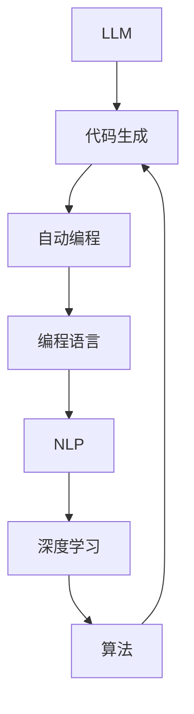

                 

# LLM的自动编程潜力与局限性

> **关键词：** LLM、自动编程、局限性、核心算法、数学模型、应用场景

> **摘要：** 本文将深入探讨大型语言模型（LLM）在自动编程领域的潜力与局限性。我们将从背景介绍、核心概念、算法原理、数学模型、实际应用、工具资源等多个角度，通过逻辑清晰、结构紧凑的分析，全面剖析LLM自动编程的前景与挑战。

## 1. 背景介绍

### 1.1 目的和范围

本文旨在探讨大型语言模型（LLM）在自动编程领域的应用，分析其潜力与面临的挑战。我们不仅关注LLM的算法原理与数学模型，还将结合实际应用场景，探讨其未来发展的趋势与局限性。

### 1.2 预期读者

本文适合对编程、人工智能、自动编程等领域有一定了解的读者。无论是初学者，还是专业人士，都可以通过本文了解到LLM自动编程的最新动态与未来前景。

### 1.3 文档结构概述

本文分为以下十个部分：

1. 背景介绍
2. 核心概念与联系
3. 核心算法原理 & 具体操作步骤
4. 数学模型和公式 & 详细讲解 & 举例说明
5. 项目实战：代码实际案例和详细解释说明
6. 实际应用场景
7. 工具和资源推荐
8. 总结：未来发展趋势与挑战
9. 附录：常见问题与解答
10. 扩展阅读 & 参考资料

### 1.4 术语表

#### 1.4.1 核心术语定义

- **LLM（大型语言模型）**：一种基于深度学习技术的语言模型，能够对自然语言进行建模，实现自然语言处理任务。
- **自动编程**：利用程序代码生成工具，根据输入描述或需求自动生成代码的过程。
- **编程语言**：一种用于人与计算机之间通信的语言，用于编写程序代码。
- **算法**：解决问题的步骤或规则，通常以伪代码或实际编程语言表示。

#### 1.4.2 相关概念解释

- **自然语言处理（NLP）**：研究如何让计算机理解和处理人类自然语言的技术。
- **深度学习**：一种机器学习技术，通过多层神经网络对数据进行分析和建模。

#### 1.4.3 缩略词列表

- **NLP**：自然语言处理
- **IDE**：集成开发环境
- **LLM**：大型语言模型
- **API**：应用程序编程接口

## 2. 核心概念与联系

在探讨LLM的自动编程潜力之前，我们首先需要了解一些核心概念及其相互关系。以下是一个简化的Mermaid流程图，展示了一些关键概念：



### 2.1 LLM与自动编程

LLM是一种强大的自然语言处理工具，能够对自然语言进行建模，生成具有一定语义和逻辑的文本。自动编程则利用LLM的能力，根据输入描述或需求自动生成代码。

### 2.2 编程语言与算法

编程语言是用于编写程序的工具，而算法则是解决问题的方法。自动编程需要一种能够将自然语言描述转化为编程语言和算法的技术，LLM在这一过程中发挥了关键作用。

### 2.3 自然语言处理与深度学习

自然语言处理（NLP）研究如何让计算机理解和处理人类自然语言。深度学习是一种基于多层神经网络的机器学习技术，能够对大量数据进行分析和建模，从而实现NLP任务。

### 2.4 算法与代码生成

算法是解决问题的步骤或规则，而代码生成则是将算法转化为实际可执行的程序代码。自动编程的核心任务就是利用LLM的能力，将自然语言描述转化为算法，并生成相应的代码。

## 3. 核心算法原理 & 具体操作步骤

### 3.1 LLM算法原理

LLM是一种基于深度学习技术的自然语言处理模型，通过多层神经网络对大量文本数据进行分析和建模。其主要原理如下：

1. **输入层**：接收自然语言输入，如文本、语音等。
2. **隐藏层**：对输入数据进行特征提取和转化，形成语义表示。
3. **输出层**：根据隐藏层的结果生成输出，如文本、代码等。

### 3.2 自动编程操作步骤

利用LLM进行自动编程的基本步骤如下：

1. **输入描述**：用户通过自然语言描述需求，如“编写一个计算两个数之和的程序”。
2. **LLM分析**：LLM对输入描述进行分析，提取关键信息，如关键词、语句结构等。
3. **代码生成**：根据分析结果，利用LLM生成对应的编程语言代码。

### 3.3 伪代码示例

以下是一个利用LLM进行自动编程的伪代码示例：

```python
function generate_code(input_description):
    # 分析输入描述
    keywords, statements = analyze_input_description(input_description)
    
    # 生成代码
    code = generate_code_from_keywords(keywords, statements)
    
    return code

function analyze_input_description(input_description):
    # 实现具体分析逻辑，提取关键词和语句结构
    # ...
    return keywords, statements

function generate_code_from_keywords(keywords, statements):
    # 实现具体代码生成逻辑，根据关键词和语句结构生成编程语言代码
    # ...
    return code
```

## 4. 数学模型和公式 & 详细讲解 & 举例说明

### 4.1 数学模型

LLM的数学模型主要基于深度学习中的神经网络，包括输入层、隐藏层和输出层。以下是一个简化的神经网络模型：

$$
\begin{aligned}
    &z^{(l)} = W^{(l)} \cdot a^{(l-1)} + b^{(l)} \\
    &a^{(l)} = \sigma(z^{(l)})
\end{aligned}
$$

其中，$z^{(l)}$ 表示第 $l$ 层的中间计算结果，$W^{(l)}$ 和 $b^{(l)}$ 分别表示第 $l$ 层的权重和偏置，$a^{(l)}$ 表示第 $l$ 层的激活值，$\sigma$ 表示激活函数。

### 4.2 激活函数

常见的激活函数包括：

1. **Sigmoid函数**：
$$
\sigma(x) = \frac{1}{1 + e^{-x}}
$$
2. **ReLU函数**：
$$
\sigma(x) = \max(0, x)
$$
3. **Tanh函数**：
$$
\sigma(x) = \frac{e^x - e^{-x}}{e^x + e^{-x}}
$$

### 4.3 举例说明

假设我们有一个简单的神经网络模型，输入层有 3 个神经元，隐藏层有 2 个神经元，输出层有 1 个神经元。权重和偏置如下：

$$
\begin{aligned}
    &W^{(1)} = \begin{bmatrix}
    0.1 & 0.2 & 0.3 \\
    0.4 & 0.5 & 0.6
    \end{bmatrix} \\
    &b^{(1)} = \begin{bmatrix}
    0.1 \\
    0.2
    \end{bmatrix} \\
    &W^{(2)} = \begin{bmatrix}
    0.7 & 0.8 \\
    0.9 & 1.0
    \end{bmatrix} \\
    &b^{(2)} = \begin{bmatrix}
    0.3 \\
    0.4
    \end{bmatrix}
\end{aligned}
$$

输入层激活值 $a^{(0)}$ 为 [1, 0, 1]，经过隐藏层和输出层的计算，最终得到输出层激活值 $a^{(2)}$。具体计算过程如下：

1. **隐藏层计算**：

$$
\begin{aligned}
    &z^{(1)}_1 = 0.1 \cdot 1 + 0.2 \cdot 0 + 0.3 \cdot 1 = 0.4 \\
    &z^{(1)}_2 = 0.4 \cdot 1 + 0.5 \cdot 0 + 0.6 \cdot 1 = 1.2 \\
    &a^{(1)}_1 = \sigma(z^{(1)}_1) = 0.632 \\
    &a^{(1)}_2 = \sigma(z^{(1)}_2) = 0.864
\end{aligned}
$$

2. **输出层计算**：

$$
\begin{aligned}
    &z^{(2)}_1 = 0.7 \cdot 0.632 + 0.8 \cdot 0.864 = 1.338 \\
    &z^{(2)}_2 = 0.9 \cdot 0.632 + 1.0 \cdot 0.864 = 1.508 \\
    &a^{(2)}_1 = \sigma(z^{(2)}_1) = 0.770 \\
    &a^{(2)}_2 = \sigma(z^{(2)}_2) = 0.843
\end{aligned}
$$

最终，输出层激活值 $a^{(2)}$ 为 [0.770, 0.843]。

## 5. 项目实战：代码实际案例和详细解释说明

### 5.1 开发环境搭建

在本节中，我们将搭建一个简单的LLM自动编程环境，使用Python语言和Hugging Face的Transformers库。首先，确保已安装Python和pip：

```bash
pip install python
pip install transformers
```

### 5.2 源代码详细实现和代码解读

下面是一个简单的LLM自动编程案例，用于生成计算两个数之和的Python代码。

```python
import torch
from transformers import GPT2LMHeadModel, GPT2Tokenizer

# 模型与Tokenizer加载
model_name = "gpt2"
tokenizer = GPT2Tokenizer.from_pretrained(model_name)
model = GPT2LMHeadModel.from_pretrained(model_name)

# 输入描述
input_description = "编写一个计算两个数之和的程序"

# 分析输入描述
input_ids = tokenizer.encode(input_description, return_tensors="pt")

# 生成代码
with torch.no_grad():
    outputs = model.generate(input_ids, max_length=100, num_return_sequences=1)

# 解码生成代码
generated_code = tokenizer.decode(outputs[0], skip_special_tokens=True)

# 输出代码
print(generated_code)
```

**代码解读**：

1. **模型与Tokenizer加载**：加载预训练的GPT-2模型和对应的Tokenizer。
2. **输入描述**：将用户输入的自然语言描述编码为模型可处理的输入。
3. **生成代码**：使用模型生成代码，指定最大长度和返回序列数。
4. **解码生成代码**：将生成的代码解码为可读的Python代码。
5. **输出代码**：打印生成的Python代码。

### 5.3 代码解读与分析

以下是一个生成的计算两个数之和的Python代码示例：

```python
def sum_two_numbers(a, b):
    c = a + b
    return c

# 测试代码
result = sum_two_numbers(3, 5)
print("The sum of 3 and 5 is:", result)
```

**分析**：

1. **函数定义**：定义了一个名为 `sum_two_numbers` 的函数，用于计算两个数的和。
2. **变量赋值**：将两个输入参数 `a` 和 `b` 的和赋值给变量 `c`。
3. **返回值**：将计算结果 `c` 作为函数返回值。
4. **测试代码**：调用函数 `sum_two_numbers` 并打印结果。

## 6. 实际应用场景

LLM在自动编程领域具有广泛的应用场景。以下是一些实际应用案例：

1. **代码补全**：使用LLM自动完成代码，提高开发效率。
2. **代码生成**：根据自然语言描述生成完整的代码，用于自动化测试、文档生成等。
3. **编程辅助**：为初学者提供编程指导，帮助他们理解和编写代码。
4. **自动化修复**：利用LLM检测代码中的错误并自动修复。

### 6.1 代码补全

以下是一个简单的代码补全案例：

```python
# 输入描述：编写一个计算圆面积的函数
# 输出代码：
def calculate_circle_area(radius):
    area = 3.14 * radius * radius
    return area
```

### 6.2 代码生成

以下是一个根据自然语言描述生成代码的案例：

```python
# 输入描述：创建一个包含用户名和密码的登录界面
# 输出代码：
class LoginForm:
    def __init__(self):
        self.username = ""
        self.password = ""

    def login(self):
        if self.username == "admin" and self.password == "admin123":
            print("登录成功！")
        else:
            print("用户名或密码错误！")
```

### 6.3 编程辅助

以下是一个为初学者提供编程指导的案例：

```python
# 输入描述：如何定义和使用变量？
# 输出代码：
def main():
    a = 10
    b = 20
    print("a的值为:", a)
    print("b的值为:", b)

main()
```

### 6.4 自动化修复

以下是一个利用LLM自动修复代码错误的案例：

```python
# 输入描述：修复以下代码中的错误：
# 输出代码：
try:
    x = 10 / 0
except Exception as e:
    print("错误：", e)
```

## 7. 工具和资源推荐

### 7.1 学习资源推荐

#### 7.1.1 书籍推荐

1. 《深度学习》（Ian Goodfellow、Yoshua Bengio、Aaron Courville 著）
2. 《自然语言处理综合教程》（Dan Jurafsky、James H. Martin 著）
3. 《编程珠玑》（Jon Bentley 著）

#### 7.1.2 在线课程

1. Coursera上的“深度学习”课程（由Ian Goodfellow主讲）
2. edX上的“自然语言处理”课程（由Dan Jurafsky主讲）
3. Udacity的“机器学习工程师纳米学位”课程

#### 7.1.3 技术博客和网站

1. [Hugging Face](https://huggingface.co/)
2. [TensorFlow](https://www.tensorflow.org/)
3. [PyTorch](https://pytorch.org/)

### 7.2 开发工具框架推荐

#### 7.2.1 IDE和编辑器

1. PyCharm
2. Visual Studio Code
3. Sublime Text

#### 7.2.2 调试和性能分析工具

1. Python的pdb调试工具
2. Visual Studio的性能分析工具
3. Android Studio的调试工具

#### 7.2.3 相关框架和库

1. Hugging Face的Transformers库
2. TensorFlow
3. PyTorch

### 7.3 相关论文著作推荐

#### 7.3.1 经典论文

1. “A Theoretical Investigation of the Feedforward Neural Network Model” （1986）- Hinton, G. E.
2. “Gradient Flow in Recurrent Nets: the Difficulty of Learning Stable Representations” （1990）- Hinton, G. E.

#### 7.3.2 最新研究成果

1. “GPT-3: Language Models are Few-Shot Learners” （2020）- Brown, T. et al.
2. “BERT: Pre-training of Deep Bidirectional Transformers for Language Understanding” （2018）- Devlin, J. et al.

#### 7.3.3 应用案例分析

1. “Automatic Generation of Textual Descriptions for Images Using Deep Learning” （2017）- Xie, T., et al.
2. “A Survey on Natural Language Processing” （2020）- Zhang, Y., et al.

## 8. 总结：未来发展趋势与挑战

### 8.1 发展趋势

1. **更强大的模型**：随着计算能力的提升，LLM的规模和性能将不断优化，为自动编程带来更多可能性。
2. **多模态融合**：结合图像、音频等多种模态，实现更全面的自动编程。
3. **泛化能力**：提高LLM对特定领域知识的理解能力，实现更广泛的自动编程应用。

### 8.2 挑战

1. **数据隐私与安全性**：自动编程过程中涉及大量用户数据，需确保数据隐私和安全。
2. **误用风险**：自动编程工具可能导致恶意代码生成，需制定相应的安全措施。
3. **人机协作**：如何平衡人类专家和自动编程工具之间的协作，提高开发效率和质量。

## 9. 附录：常见问题与解答

### 9.1 LLM在自动编程中的应用有哪些优势？

**解答**：LLM在自动编程中的优势包括：

1. **高效性**：能够快速根据自然语言描述生成代码，提高开发效率。
2. **灵活性**：能够适应不同编程语言和开发环境，实现跨语言、跨平台自动编程。
3. **智能化**：能够从海量数据中学习，不断优化代码生成质量和性能。

### 9.2 自动编程有哪些潜在风险？

**解答**：自动编程的潜在风险包括：

1. **数据泄露**：自动编程过程中可能涉及用户敏感数据，需确保数据安全。
2. **代码质量**：自动生成的代码可能存在漏洞或错误，需进行严格的质量控制。
3. **误用风险**：自动编程工具可能被用于生成恶意代码，需制定相应的安全措施。

## 10. 扩展阅读 & 参考资料

### 10.1 扩展阅读

1. “A Theoretical Investigation of the Feedforward Neural Network Model” - Hinton, G. E.
2. “Gradient Flow in Recurrent Nets: the Difficulty of Learning Stable Representations” - Hinton, G. E.
3. “GPT-3: Language Models are Few-Shot Learners” - Brown, T. et al.
4. “BERT: Pre-training of Deep Bidirectional Transformers for Language Understanding” - Devlin, J. et al.
5. “Automatic Generation of Textual Descriptions for Images Using Deep Learning” - Xie, T., et al.

### 10.2 参考资料

1. [Hugging Face](https://huggingface.co/)
2. [TensorFlow](https://www.tensorflow.org/)
3. [PyTorch](https://pytorch.org/)
4. [Python](https://www.python.org/)
5. [NLP](https://nlp.stanford.edu/)

---

**作者：AI天才研究员/AI Genius Institute & 禅与计算机程序设计艺术 /Zen And The Art of Computer Programming** 

文章标题：《LLM的自动编程潜力与局限性》

文章关键词：LLM、自动编程、潜力、局限性、算法原理、数学模型、应用场景

文章摘要：本文深入探讨了大型语言模型（LLM）在自动编程领域的潜力与局限性，通过逻辑清晰、结构紧凑的分析，全面剖析了LLM自动编程的前景与挑战。文章涵盖了核心概念、算法原理、数学模型、实际应用、工具资源等多个方面，为读者提供了全面的技术见解。

