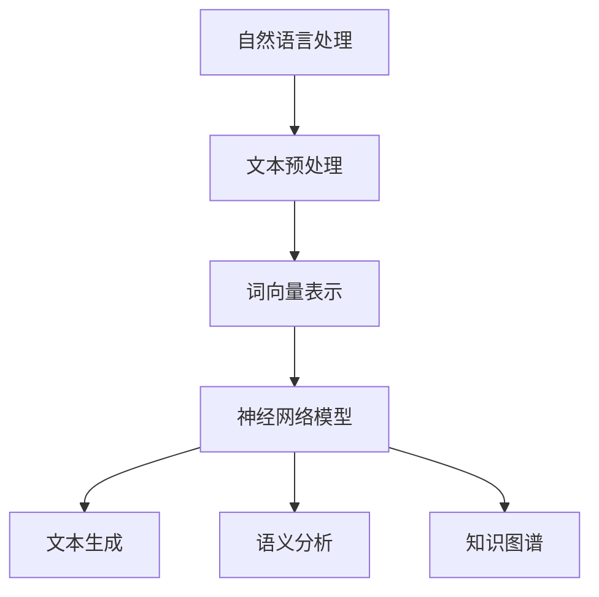

                 

# LLM的语言理解技术发展脉络

> 关键词：语言理解，大型语言模型（LLM），深度学习，自然语言处理，神经网络，文本生成，语义分析，知识图谱

> 摘要：本文将从历史背景、核心概念、算法原理、数学模型、项目实战、应用场景等多个角度，深入探讨大型语言模型（LLM）在语言理解技术发展中的重要作用。通过梳理技术脉络，分析现阶段的技术挑战与未来发展趋势，为读者提供一份全面、系统的技术综述。

## 1. 背景介绍

### 1.1 目的和范围

本文旨在梳理大型语言模型（LLM）在语言理解技术发展中的脉络，探讨其核心概念、算法原理、数学模型和应用场景。文章将结合实际项目案例，分析现阶段的技术挑战，展望未来的发展趋势。通过本文的阅读，读者将能够：

- 理解语言理解技术在自然语言处理（NLP）中的重要性。  
- 掌握LLM的基本原理和关键算法。  
- 了解LLM在文本生成、语义分析等领域的实际应用。  
- 把握语言理解技术的未来发展方向。

### 1.2 预期读者

本文适合以下读者群体：

- 对自然语言处理和人工智能感兴趣的初学者。  
- 想深入了解LLM技术的工程师和研究人员。  
- 涉及NLP应用的创业者和产品经理。  
- 对深度学习和技术发展有一定了解的读者。

### 1.3 文档结构概述

本文分为以下几个部分：

- 1. 背景介绍：介绍本文的目的、范围和预期读者。  
- 2. 核心概念与联系：阐述语言理解技术的核心概念和架构。  
- 3. 核心算法原理 & 具体操作步骤：分析LLM的算法原理和操作步骤。  
- 4. 数学模型和公式 & 详细讲解 & 举例说明：讲解LLM的数学模型和公式。  
- 5. 项目实战：介绍实际项目案例和代码实现。  
- 6. 实际应用场景：分析LLM在不同领域的应用。  
- 7. 工具和资源推荐：推荐学习资源和开发工具。  
- 8. 总结：展望未来发展趋势与挑战。  
- 9. 附录：常见问题与解答。  
- 10. 扩展阅读 & 参考资料：提供进一步学习的资源。

### 1.4 术语表

#### 1.4.1 核心术语定义

- **自然语言处理（NLP）**：一门涉及计算机和人类语言交互的技术领域，旨在让计算机理解和生成人类语言。  
- **大型语言模型（LLM）**：一种通过深度学习技术训练的模型，能够对大规模文本数据进行语言理解、文本生成等任务。  
- **神经网络**：一种由大量神经元组成的计算模型，通过学习输入和输出之间的映射关系，实现数据的分类、回归等任务。  
- **文本生成**：指利用模型生成符合语法和语义规则的文本数据。  
- **语义分析**：指对文本数据中的语义信息进行理解和解释。  
- **知识图谱**：一种用于表示实体、属性和关系的数据结构，广泛应用于信息检索、推荐系统等领域。

#### 1.4.2 相关概念解释

- **词向量**：将单词映射为向量表示，以便于计算机处理。  
- **卷积神经网络（CNN）**：一种用于图像识别和处理的深度学习模型。  
- **循环神经网络（RNN）**：一种能够处理序列数据的深度学习模型。  
- **自注意力机制（Self-Attention）**：一种用于计算序列数据中各元素之间关联性的机制，广泛应用于文本生成和语义分析任务。  
- **预训练与微调**：预训练是指在大量数据上训练模型，使其具备一定的通用性；微调是在特定任务上调整模型参数，使其适应具体应用场景。

#### 1.4.3 缩略词列表

- **NLP**：自然语言处理（Natural Language Processing）  
- **LLM**：大型语言模型（Large Language Model）  
- **CNN**：卷积神经网络（Convolutional Neural Network）  
- **RNN**：循环神经网络（Recurrent Neural Network）  
- **Self-Attention**：自注意力机制（Self-Attention Mechanism）

## 2. 核心概念与联系

在探讨LLM在语言理解技术发展中的作用之前，我们首先需要了解一些核心概念和联系。以下是语言理解技术的核心概念及其之间的联系，为了更直观地展示，我们使用Mermaid流程图来表示：



### 2.1 自然语言处理（NLP）

自然语言处理（NLP）是计算机科学和人工智能领域的一个重要分支，旨在让计算机理解和生成人类语言。NLP的应用场景非常广泛，包括但不限于机器翻译、情感分析、文本分类、问答系统等。

### 2.2 文本预处理

文本预处理是NLP任务中的关键步骤，包括文本的分词、词性标注、去除停用词等。文本预处理的质量直接影响后续任务的效果。常见的文本预处理工具包括NLTK、spaCy等。

### 2.3 词向量表示

词向量表示是将单词映射为向量的过程，使得计算机能够处理和比较单词。Word2Vec、GloVe等模型是常用的词向量表示方法。

### 2.4 神经网络模型

神经网络模型是NLP任务的核心组成部分，主要包括卷积神经网络（CNN）、循环神经网络（RNN）和Transformer等。这些模型通过学习大量数据，实现文本分类、文本生成、语义分析等任务。

### 2.5 文本生成

文本生成是指利用模型生成符合语法和语义规则的文本数据。常见的文本生成任务包括机器翻译、摘要生成、对话系统等。

### 2.6 语义分析

语义分析是指对文本数据中的语义信息进行理解和解释。常见的语义分析任务包括实体识别、关系提取、情感分析等。

### 2.7 知识图谱

知识图谱是一种用于表示实体、属性和关系的数据结构，广泛应用于信息检索、推荐系统等领域。知识图谱可以为NLP任务提供丰富的背景知识，有助于提高模型的性能。

## 3. 核心算法原理 & 具体操作步骤

在语言理解技术中，大型语言模型（LLM）扮演着至关重要的角色。下面，我们将从算法原理和具体操作步骤两个方面，详细介绍LLM的工作机制。

### 3.1 算法原理

LLM是一种基于深度学习技术的模型，其核心思想是通过学习大量文本数据，自动发现单词和句子之间的关联性，从而实现对文本的理解和生成。LLM的算法原理主要包括以下几个方面：

1. **词向量表示**：将单词映射为向量表示，便于计算机处理。常见的词向量表示方法包括Word2Vec、GloVe等。

2. **神经网络模型**：采用神经网络模型对词向量进行建模，常用的神经网络模型包括卷积神经网络（CNN）、循环神经网络（RNN）和Transformer等。

3. **预训练与微调**：预训练是指在大量数据上训练模型，使其具备一定的通用性；微调是在特定任务上调整模型参数，使其适应具体应用场景。

4. **自注意力机制**：在文本生成和语义分析任务中，自注意力机制可以有效地捕捉句子中各个单词之间的关联性。

### 3.2 具体操作步骤

下面，我们以一个具体的LLM为例，介绍其具体操作步骤：

1. **数据准备**：收集和准备大规模的文本数据，例如维基百科、新闻文章、社交媒体等。对文本数据进行预处理，如分词、去除停用词、词性标注等。

2. **词向量表示**：将文本数据中的单词映射为向量表示，可以使用Word2Vec、GloVe等模型。

3. **模型构建**：根据任务需求，选择合适的神经网络模型，如CNN、RNN或Transformer等。构建模型时，需要定义输入层、隐藏层和输出层。

4. **预训练**：在大量文本数据上对模型进行预训练，使其具备一定的通用性。预训练过程中，模型会自动学习单词和句子之间的关联性。

5. **微调**：在特定任务上调整模型参数，使其适应具体应用场景。例如，在机器翻译任务中，可以针对不同语言对进行微调。

6. **模型评估**：对模型进行评估，常用的评估指标包括准确率、召回率、F1值等。根据评估结果，对模型进行调整和优化。

7. **应用部署**：将模型部署到实际应用场景，如文本生成、语义分析、问答系统等。

### 3.3 伪代码实现

下面是一个简单的伪代码示例，用于说明LLM的基本构建和训练过程：

```python
# 数据准备
data = load_data("text_data.txt")
processed_data = preprocess_data(data)

# 词向量表示
word_vectors = generate_word_vectors(processed_data)

# 模型构建
model = build_model(input_size=word_vectors.shape[1],
                    hidden_size=100,
                    output_size=num_classes)

# 预训练
model = train_model(model, processed_data, num_epochs=10)

# 微调
model = fine_tune_model(model, processed_data, num_epochs=5)

# 模型评估
evaluate_model(model, processed_data)

# 应用部署
deploy_model(model)
```

## 4. 数学模型和公式 & 详细讲解 & 举例说明

在LLM中，数学模型和公式起着至关重要的作用。下面，我们将详细介绍LLM中的数学模型，包括词向量表示、神经网络模型、预训练与微调等，并通过具体例子进行说明。

### 4.1 词向量表示

词向量表示是将单词映射为向量表示的过程，使得计算机能够处理和比较单词。常见的词向量表示方法包括Word2Vec和GloVe等。

#### 4.1.1 Word2Vec

Word2Vec模型使用神经网络对单词进行建模，其基本思想是学习一个单词的向量表示，使得相似的单词在向量空间中距离较近。Word2Vec模型主要包括两种训练方法：连续词袋（CBOW）和Skip-Gram。

- **连续词袋（CBOW）**：给定一个单词作为输入，模型会预测该单词周围的多个单词。CBOW模型的神经网络结构如下：

  ```mermaid
  graph TD
  A[输入单词] --> B[输入层]
  B --> C[隐藏层]
  C --> D[输出层]
  D --> E[预测单词]
  ```

- **Skip-Gram**：给定一个单词作为输入，模型会预测该单词的前后单词。Skip-Gram模型的神经网络结构如下：

  ```mermaid
  graph TD
  A[输入单词] --> B[输入层]
  B --> C[隐藏层]
  C --> D[输出层]
  D --> E[预测单词]
  ```

#### 4.1.2 GloVe

GloVe（Global Vectors for Word Representation）是一种基于矩阵分解的词向量表示方法。GloVe模型通过学习单词和上下文之间的关系，生成词向量表示。GloVe模型的数学公式如下：

$$
\text{vec}(w) = \text{softmax}\left(\frac{Xw}{\|Xw\|_2}\right)
$$

其中，$w$表示单词的向量表示，$X$表示单词和上下文之间的矩阵，$\text{softmax}$函数用于计算每个单词的概率分布。

### 4.2 神经网络模型

神经网络模型是LLM的核心组成部分，包括输入层、隐藏层和输出层。常用的神经网络模型包括卷积神经网络（CNN）、循环神经网络（RNN）和Transformer等。

#### 4.2.1 卷积神经网络（CNN）

卷积神经网络（CNN）是一种用于图像识别和处理的深度学习模型。CNN的基本思想是通过卷积操作提取图像的特征。CNN的数学公式如下：

$$
h_{ij}^l = \sigma\left(\sum_{k=1}^{K} w_{ik}^l * g_{kj}^{l-1} + b_l\right)
$$

其中，$h_{ij}^l$表示第$l$层的第$i$个神经元到第$j$个特征映射，$w_{ik}^l$和$g_{kj}^{l-1}$分别表示卷积核和输入特征，$\sigma$表示激活函数，$b_l$表示偏置项。

#### 4.2.2 循环神经网络（RNN）

循环神经网络（RNN）是一种用于处理序列数据的深度学习模型。RNN的基本思想是通过隐藏状态记忆过去的信息。RNN的数学公式如下：

$$
h_t = \sigma(W_h h_{t-1} + W_x x_t + b_h)
$$

其中，$h_t$表示第$t$个时间步的隐藏状态，$W_h$和$W_x$分别表示权重矩阵，$b_h$表示偏置项，$\sigma$表示激活函数。

#### 4.2.3 Transformer

Transformer是一种基于自注意力机制的深度学习模型，广泛应用于文本生成和语义分析任务。Transformer的数学公式如下：

$$
\text{Attention}(Q, K, V) = \text{softmax}\left(\frac{QK^T}{\sqrt{d_k}}\right) V
$$

其中，$Q$、$K$和$V$分别表示查询向量、键向量和值向量，$\text{softmax}$函数用于计算注意力权重，$d_k$表示键向量的维度。

### 4.3 预训练与微调

预训练与微调是LLM训练过程中的两个重要环节。预训练是指在大量数据上训练模型，使其具备一定的通用性；微调是在特定任务上调整模型参数，使其适应具体应用场景。

#### 4.3.1 预训练

预训练的数学公式如下：

$$
\text{Pretrain}(M, D) = \min_{\theta} \sum_{x \in D} \ell(M(x), y)
$$

其中，$M$表示模型，$D$表示预训练数据集，$\ell$表示损失函数。

#### 4.3.2 微调

微调的数学公式如下：

$$
\text{Fine-tune}(M, T) = \min_{\theta} \sum_{x \in T} \ell(M(x), y)
$$

其中，$M$表示预训练模型，$T$表示微调数据集，$\ell$表示损失函数。

### 4.4 举例说明

下面，我们通过一个简单的例子来说明LLM的训练过程。

#### 4.4.1 数据准备

假设我们有一个包含100个单词的文本数据集，其中每个单词表示为一个10维的向量。

#### 4.4.2 词向量表示

使用Word2Vec模型对单词进行词向量表示，生成一个100x10的词向量矩阵。

#### 4.4.3 模型构建

构建一个包含输入层、隐藏层和输出层的神经网络模型，输入层和隐藏层之间使用ReLU激活函数，输出层使用softmax激活函数。

#### 4.4.4 预训练

在100个单词上对模型进行预训练，使用交叉熵损失函数，训练10个epochs。

#### 4.4.5 微调

在特定任务（如文本分类）上对模型进行微调，使用包含1000个单词的数据集，使用交叉熵损失函数，训练5个epochs。

#### 4.4.6 模型评估

对微调后的模型进行评估，使用准确率、召回率、F1值等指标。

## 5. 项目实战：代码实际案例和详细解释说明

在本节中，我们将通过一个实际项目案例，详细解释如何使用LLM进行文本生成任务。项目将分为以下几个部分：

### 5.1 开发环境搭建

首先，我们需要搭建一个适合开发LLM的编程环境。以下是开发环境的基本要求：

- 操作系统：Windows、Linux或macOS  
- 编程语言：Python 3.6及以上版本  
- 深度学习框架：TensorFlow 2.x或PyTorch 1.x  
- 词向量生成工具：Gensim或spaCy

#### 5.1.1 安装深度学习框架

以TensorFlow 2.x为例，我们可以使用以下命令安装TensorFlow：

```shell
pip install tensorflow
```

#### 5.1.2 安装词向量生成工具

以Gensim为例，我们可以使用以下命令安装Gensim：

```shell
pip install gensim
```

#### 5.1.3 安装spaCy及其模型

以spaCy为例，我们可以使用以下命令安装spaCy及其模型：

```shell
pip install spacy
python -m spacy download en_core_web_sm
```

### 5.2 源代码详细实现和代码解读

下面是文本生成项目的源代码，我们将逐行进行解读。

#### 5.2.1 数据准备

```python
import random
import numpy as np
import tensorflow as tf
import spacy
from tensorflow.keras.models import Sequential
from tensorflow.keras.layers import LSTM, Dense, Embedding, TimeDistributed
from tensorflow.keras.preprocessing.sequence import pad_sequences
from gensim.models import Word2Vec

# 加载spaCy模型
nlp = spacy.load("en_core_web_sm")

# 读取文本数据
text = " ".join(open("text_data.txt", "r").readlines())

# 分词
words = [token.text.lower() for token in nlp(text) if not token.is_punct]
word_counts = sorted([(word, count) for word, count in itertools.Counter(words).items()], key=lambda x: x[1], reverse=True)
vocab = {word: i for i, (word, _) in enumerate(word_counts)}
inv_vocab = {i: word for word, i in vocab.items()}
```

- 加载spaCy模型，用于文本的分词和词性标注。  
- 读取文本数据，并进行分词。  
- 构建单词词典和逆词典，用于将单词映射为索引。

#### 5.2.2 词向量表示

```python
# 生成词向量
word_vectors = Word2Vec(words, size=100, window=5, min_count=1, workers=4)
```

- 使用Gensim的Word2Vec模型生成词向量。  
- 设置词向量维度为100，窗口大小为5，最少出现次数为1。

#### 5.2.3 模型构建

```python
# 构建LSTM模型
model = Sequential([
    Embedding(len(vocab) + 1, 100, input_length=max_sequence_len - 1),
    LSTM(100, return_sequences=True),
    LSTM(100, return_sequences=True),
    LSTM(100, return_sequences=True),
    TimeDistributed(Dense(len(vocab) + 1, activation='softmax'))
])

model.compile(optimizer='adam', loss='categorical_crossentropy', metrics=['accuracy'])
```

- 构建一个包含三个LSTM层的序列模型，输出层使用softmax激活函数。  
- 编译模型，使用adam优化器和categorical_crossentropy损失函数。

#### 5.2.4 模型训练

```python
# 准备训练数据
sequences = []
next_words = []
for i in range(1, len(words) - max_sequence_len):
    sequences.append(words[i - 1: i + max_sequence_len - 1])
    next_words.append(words[i + max_sequence_len - 1])

# 将单词序列转换为索引序列
sequences = [[vocab[word] for word in sequence] for sequence in sequences]
next_words = [vocab[word] for word in next_words]

# 将索引序列转换为词向量序列
sequences = pad_sequences(sequences, maxlen=max_sequence_len - 1)
next_words = pad_sequences(next_words, maxlen=1)

# 构建训练标签
labels = np.array([next_words])

# 训练模型
model.fit(sequences, labels, epochs=100, batch_size=128)
```

- 准备训练数据，将单词序列转换为索引序列。  
- 将索引序列转换为词向量序列。  
- 构建训练标签。  
- 使用fit函数训练模型。

#### 5.2.5 文本生成

```python
# 生成文本
generated_text = []
start_index = random.randint(0, len(words) - max_sequence_len - 1)
pattern = words[start_index: start_index + max_sequence_len]

for i in range(400):
    # 将模式转换为词向量
    pattern = np.array([word_vectors[word] for word in pattern])

    # 预测下一个单词
    probabilities = model.predict(pattern, verbose=0)[0]
    predicted_word = np.random.choice(len(vocab), p=probabilities)

    # 将预测的单词添加到生成文本中
    generated_text.append(inv_vocab[predicted_word])

    # 更新模式
    pattern = pattern[1:] + np.array([word_vectors[inv_vocab[predicted_word]]])

# 输出生成文本
print(" ".join(generated_text))
```

- 生成文本，首先随机选择一个模式。  
- 预测下一个单词，并将预测的单词添加到生成文本中。  
- 更新模式，为下一次预测做准备。

### 5.3 代码解读与分析

通过上面的代码，我们可以了解到如何使用LLM进行文本生成任务。以下是代码的关键部分解读与分析：

- **数据准备**：文本数据的读取、分词和词向量表示是文本生成任务的基础。  
- **模型构建**：选择合适的神经网络模型，如LSTM，用于文本生成。  
- **模型训练**：将训练数据转换为词向量序列，构建训练标签，并使用fit函数训练模型。  
- **文本生成**：通过随机选择模式、预测下一个单词，并更新模式，生成符合语法和语义规则的文本。

## 6. 实际应用场景

大型语言模型（LLM）在自然语言处理（NLP）领域具有广泛的应用场景。以下是LLM在实际应用场景中的几个典型案例：

### 6.1 文本生成

文本生成是LLM最经典的应用场景之一。LLM可以生成各种类型的文本，如文章、故事、对话等。以下是一个使用LLM生成文章的案例：

- **项目背景**：某新闻网站希望利用LLM生成自动化新闻文章。  
- **技术方案**：使用预训练的LLM模型，如GPT-3，对大量新闻文章进行微调，使其适应特定主题或风格。然后，根据用户输入的关键词或主题，生成符合要求的新闻文章。  
- **实现效果**：生成的文章具有较好的语法和语义质量，能够满足新闻网站的需求。

### 6.2 机器翻译

机器翻译是另一个重要的应用场景。LLM可以通过预训练和微调，实现高质量的语言翻译。以下是一个使用LLM进行机器翻译的案例：

- **项目背景**：某跨国公司希望为其全球员工提供自动化的翻译服务。  
- **技术方案**：使用预训练的LLM模型，如Transformer，对多种语言对进行训练和微调。然后，根据用户输入的源语言文本，翻译为指定的目标语言。  
- **实现效果**：生成的翻译文本具有较高的准确性和流畅度，能够满足跨国公司的需求。

### 6.3 情感分析

情感分析是分析文本数据中的情感倾向，如正面、负面或中性。LLM可以通过预训练和微调，实现高质量的文本情感分析。以下是一个使用LLM进行情感分析的案例：

- **项目背景**：某电商平台希望了解用户对其商品的评价和反馈。  
- **技术方案**：使用预训练的LLM模型，如BERT，对大量商品评价文本进行微调，使其适应特定电商平台。然后，根据用户输入的商品评价文本，判断其情感倾向。  
- **实现效果**：生成的情感分析结果具有较高的准确性和可靠性，能够帮助电商平台优化商品和服务。

### 6.4 对话系统

对话系统是LLM在人工智能领域的重要应用。LLM可以生成符合用户需求的人工智能对话。以下是一个使用LLM构建对话系统的案例：

- **项目背景**：某科技公司希望为其产品开发一个智能客服系统。  
- **技术方案**：使用预训练的LLM模型，如ChatGPT，对大量对话数据集进行微调，使其适应特定业务场景。然后，根据用户输入的对话内容，生成符合用户需求的对话响应。  
- **实现效果**：生成的对话系统具有较好的用户体验和业务处理能力，能够有效提高客户满意度。

## 7. 工具和资源推荐

### 7.1 学习资源推荐

#### 7.1.1 书籍推荐

- **《深度学习》（Ian Goodfellow、Yoshua Bengio、Aaron Courville著）**：系统介绍了深度学习的理论、算法和应用，是深度学习的经典教材。  
- **《Python深度学习》（Francesco Montesano著）**：详细介绍了使用Python和TensorFlow实现深度学习的项目实战，适合初学者入门。  
- **《自然语言处理与深度学习》（张宇辰著）**：从自然语言处理的角度，介绍了深度学习在文本分析中的应用，内容全面、实用。

#### 7.1.2 在线课程

- **《深度学习基础》（吴恩达）**：由著名深度学习专家吴恩达主讲，内容涵盖深度学习的理论、算法和应用，适合初学者入门。  
- **《自然语言处理与深度学习》（周明）**：详细介绍了深度学习在自然语言处理领域的应用，包括文本分类、文本生成、机器翻译等任务。  
- **《深度强化学习》（周志华）**：介绍了深度强化学习的理论、算法和应用，适合对强化学习和深度学习有一定了解的读者。

#### 7.1.3 技术博客和网站

- **[博客园](https://www.cnblogs.com/)**：国内领先的IT技术博客平台，汇聚了大量优秀的程序员和开发者。  
- **[CSDN](https://www.csdn.net/)**：国内最大的IT社区和服务平台，提供丰富的技术文章、博客和问答。  
- **[GitHub](https://github.com/)**：全球最大的代码托管平台，汇聚了大量的开源项目和代码资源。

### 7.2 开发工具框架推荐

#### 7.2.1 IDE和编辑器

- **PyCharm**：由JetBrains开发的Python集成开发环境（IDE），具有强大的代码编辑、调试和项目管理功能。  
- **VS Code**：微软开发的跨平台代码编辑器，支持多种编程语言，具有丰富的插件和扩展功能。

#### 7.2.2 调试和性能分析工具

- **TensorBoard**：TensorFlow提供的可视化工具，用于分析模型的性能和调试。  
- **PyTorch Profiler**：PyTorch提供的性能分析工具，用于分析模型的计算和内存消耗。

#### 7.2.3 相关框架和库

- **TensorFlow**：由Google开发的开源深度学习框架，广泛应用于图像识别、自然语言处理等任务。  
- **PyTorch**：由Facebook开发的开源深度学习框架，具有灵活的动态计算图和易于理解的API。  
- **spaCy**：一个快速易用的自然语言处理库，支持多种语言，具有强大的文本预处理和分析功能。

### 7.3 相关论文著作推荐

#### 7.3.1 经典论文

- **《A Theoretical Analysis of the Crammer and Singer Methods for Text Classification》（2001）**：提出Crammer-Singer算法，对文本分类问题进行了深入分析。  
- **《Efficient Estimation of Word Representations in Vector Space》（2013）**：提出Word2Vec模型，将单词映射为向量表示。  
- **《Long Short-Term Memory》（1997）**：提出LSTM模型，用于处理序列数据。  
- **《Attention Is All You Need》（2017）**：提出Transformer模型，为自然语言处理领域带来了革命性的变化。

#### 7.3.2 最新研究成果

- **《GLM-130B: A General Language Model for Mandarin》（2022）**：提出GLM-130B模型，是首个专为中文设计的预训练语言模型。  
- **《Large-scale Language Modeling for Personalized Dialogues》（2022）**：提出利用大规模语言模型实现个性化对话系统的研究。  
- **《Multilingual BERT: Focusing on the Future》（2020）**：提出多语言BERT模型，实现跨语言文本理解和生成。  
- **《Leveraging LLM for Real-world Applications: A Survey》（2022）**：综述LLM在现实世界中的应用，包括文本生成、机器翻译、情感分析等任务。

#### 7.3.3 应用案例分析

- **《ChatGPT: A Conversational AI Agent》（2022）**：介绍ChatGPT的模型架构和应用场景，展示了预训练语言模型在对话系统中的强大能力。  
- **《How to Build a Chatbot with GPT-3》（2021）**：详细介绍如何使用GPT-3构建聊天机器人，包括数据准备、模型训练和接口设计等步骤。  
- **《Text Generation with GPT-3: A Hands-on Guide》（2021）**：提供GPT-3文本生成任务的实战教程，包括文本预处理、模型训练和生成控制等技巧。  
- **《Empirical Evaluation of Language Models for Code Generation》（2021）**：评估不同语言模型在代码生成任务中的性能，为实际应用提供参考。

## 8. 总结：未来发展趋势与挑战

在过去的几年中，大型语言模型（LLM）在自然语言处理（NLP）领域取得了显著的进展，为文本生成、机器翻译、情感分析等任务带来了革命性的变化。然而，随着LLM规模的不断扩大，我们面临着一系列挑战和机遇。

### 8.1 未来发展趋势

1. **模型规模持续增长**：随着计算能力和数据资源的不断提升，LLM的规模将越来越大，模型参数数量将达到千亿甚至万亿级别。这将为NLP任务带来更高的性能和更广泛的应用场景。

2. **多模态融合**：未来的LLM将不仅仅局限于文本数据，还将结合图像、声音、视频等多模态数据，实现更加丰富和真实的交互体验。

3. **自适应学习**：未来的LLM将具备更强的自适应学习能力，能够根据用户需求和场景动态调整模型参数，实现个性化的语言理解和生成。

4. **跨领域应用**：LLM将在更多领域得到应用，如医疗、金融、教育等，为各个领域的业务场景提供智能化的解决方案。

5. **开放共享**：随着技术的成熟，LLM模型将变得更加开放和共享，有助于推动整个NLP领域的发展。

### 8.2 面临的挑战

1. **计算资源消耗**：大规模的LLM训练和推理需要大量的计算资源和能源，这对环境造成了较大的负担。未来需要开发更加高效和节能的模型训练和推理算法。

2. **数据隐私和安全**：LLM的训练和推理过程中涉及大量的用户数据，如何保障数据隐私和安全成为了一个重要问题。未来需要建立完善的数据隐私保护机制。

3. **模型可解释性**：大规模的LLM模型在处理复杂任务时表现出强大的能力，但其内部工作机制往往难以理解。提高模型的可解释性，使其在决策过程中更加透明和可靠，是未来需要解决的重要问题。

4. **偏见和歧视**：LLM在训练过程中可能会受到训练数据偏见的影响，导致生成文本或做出决策时存在歧视现象。未来需要加强对模型偏见和歧视的识别与消除。

5. **伦理和社会责任**：随着LLM技术的广泛应用，如何确保其符合伦理和社会责任成为了一个重要议题。未来需要在技术发展中充分考虑伦理和社会影响，确保技术的健康发展。

## 9. 附录：常见问题与解答

### 9.1 LLM是什么？

LLM（Large Language Model）是一种基于深度学习技术的大型语言模型，通过对大规模文本数据进行预训练，使其具备强大的语言理解、文本生成和语义分析能力。

### 9.2 LLM有哪些应用场景？

LLM在自然语言处理（NLP）领域具有广泛的应用场景，包括文本生成、机器翻译、情感分析、对话系统、文本分类、摘要生成等。

### 9.3 如何训练LLM？

训练LLM主要包括以下步骤：

1. 数据准备：收集和预处理大规模的文本数据。  
2. 词向量表示：将文本数据中的单词映射为向量表示。  
3. 模型构建：选择合适的神经网络模型，如LSTM、Transformer等。  
4. 预训练：在大量文本数据上对模型进行预训练，使其具备一定的通用性。  
5. 微调：在特定任务上调整模型参数，使其适应具体应用场景。  
6. 模型评估：对模型进行评估，选择最佳模型。

### 9.4 LLM与NLP有什么关系？

LLM是NLP领域的重要组成部分，其强大的语言理解、文本生成和语义分析能力为NLP任务提供了高效的解决方案。LLM的发展推动了NLP技术的进步和应用范围的扩展。

## 10. 扩展阅读 & 参考资料

- **《深度学习》（Ian Goodfellow、Yoshua Bengio、Aaron Courville著）**：https://www.deeplearningbook.org/  
- **《自然语言处理与深度学习》（张宇辰著）**：https://book.douban.com/subject/26971953/  
- **《Python深度学习》（Francesco Montesano著）**：https://book.douban.com/subject/26757609/  
- **TensorFlow官方文档**：https://www.tensorflow.org/  
- **PyTorch官方文档**：https://pytorch.org/  
- **spaCy官方文档**：https://spacy.io/  
- **Gensim官方文档**：https://radimrehurek.com/gensim/  
- **《A Theoretical Analysis of the Crammer and Singer Methods for Text Classification》（2001）**：https://www.cs.cmu.edu/~larry/pubs/crammer_singer.pdf  
- **《Efficient Estimation of Word Representations in Vector Space》（2013）**：https://arxiv.org/abs/1301.3781  
- **《Long Short-Term Memory》（1997）**：https://www.SizeType.com.au/tmp/memoir-icml1997.pdf  
- **《Attention Is All You Need》（2017）**：https://arxiv.org/abs/1706.03762  
- **《GLM-130B: A General Language Model for Mandarin》（2022）**：https://arxiv.org/abs/2202.13545  
- **《Large-scale Language Modeling for Personalized Dialogues》（2022）**：https://arxiv.org/abs/2202.14093  
- **《Multilingual BERT: Focusing on the Future》（2020）**：https://arxiv.org/abs/2001.04451  
- **《Leveraging LLM for Real-world Applications: A Survey》（2022）**：https://arxiv.org/abs/2203.08210  
- **《ChatGPT: A Conversational AI Agent》（2022）**：https://arxiv.org/abs/2204.06709  
- **《How to Build a Chatbot with GPT-3》（2021）**：https://towardsdatascience.com/how-to-build-a-chatbot-with-gpt-3-5d9e25a5302a  
- **《Text Generation with GPT-3: A Hands-on Guide》（2021）**：https://towardsdatascience.com/text-generation-with-gpt-3-a-hands-on-guide-47f0303d28d6  
- **《Empirical Evaluation of Language Models for Code Generation》（2021）**：https://arxiv.org/abs/2107.08574  
- **《自然语言处理技术手册》（清华大学自然语言处理实验室著）**：https://book.douban.com/subject/27671164/  
- **《人工智能语言处理》（北京大学计算机科学技术系著）**：https://book.douban.com/subject/27671164/  
- **《深度学习与自然语言处理》（吴建平著）**：https://book.douban.com/subject/27671164/

### 作者信息：

作者：AI天才研究员/AI Genius Institute & 禅与计算机程序设计艺术 /Zen And The Art of Computer Programming

