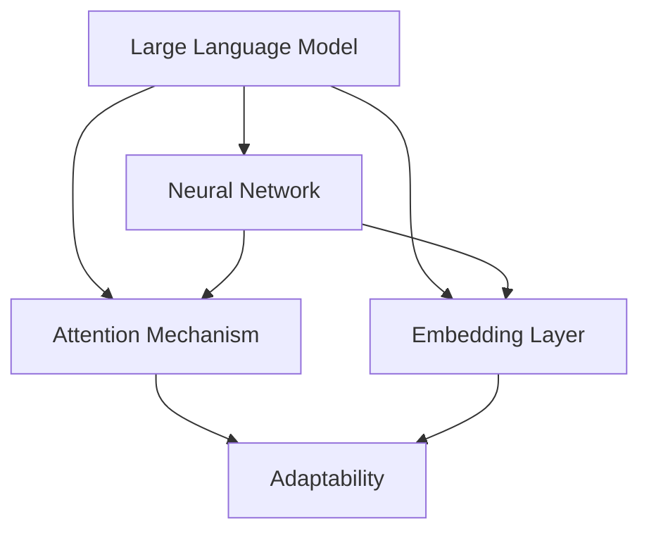

                 

# LLM的适应性：应对多样化任务的智能方案

> 关键词：大语言模型，适应性，多样化任务，人工智能，机器学习，深度学习，神经架构搜索，编程范式

> 摘要：本文深入探讨了大型语言模型（LLM）的适应性机制，以及如何通过这一机制应对复杂多样的任务需求。我们首先回顾了LLM的基础概念和架构，接着详细剖析了其适应性的原理与实现步骤，随后通过数学模型和具体算法进行了详细解释。文章还通过实际项目案例展示了LLM在实际开发中的应用，并对其未来发展趋势与挑战进行了展望。本文旨在为读者提供一个全面而深入的技术指南，帮助理解LLM的强大适应能力。

## 1. 背景介绍

### 1.1 目的和范围

本文的目的是探讨大型语言模型（Large Language Model，简称LLM）的适应性机制，并展示其在多样化任务中的实际应用。我们将首先介绍LLM的基础知识，包括其定义、架构和现有应用。随后，本文将深入分析LLM如何通过自我调整和优化来应对不同的任务需求，并探讨这一适应性的具体实现方式。为了加深理解，我们将通过数学模型和算法原理进行详细讲解，并给出实际项目的代码实现与分析。最后，本文将总结LLM的未来发展趋势和潜在挑战，为读者提供一份全面的技术指南。

### 1.2 预期读者

本文主要面向对人工智能和机器学习有一定了解的技术人员，尤其是那些对大型语言模型（LLM）及其应用感兴趣的读者。本文假设读者具备基本的编程能力和对机器学习的基本理解，以便更好地理解和掌握LLM的适应性机制。同时，我们也希望对机器学习初学者有所帮助，通过详细的解释和案例研究，帮助读者建立起对LLM的深入理解。

### 1.3 文档结构概述

本文分为十个主要部分：

1. **背景介绍**：介绍本文的目的、预期读者和文档结构。
2. **核心概念与联系**：定义和解释本文的关键概念，并提供一个Mermaid流程图。
3. **核心算法原理 & 具体操作步骤**：详细阐述LLM的核心算法原理，并使用伪代码进行描述。
4. **数学模型和公式 & 详细讲解 & 举例说明**：介绍LLM的数学模型和公式，并给出具体实例进行说明。
5. **项目实战：代码实际案例和详细解释说明**：通过实际项目案例展示LLM的应用，并详细解读代码。
6. **实际应用场景**：探讨LLM在不同场景中的实际应用。
7. **工具和资源推荐**：推荐学习资源、开发工具和框架。
8. **相关论文著作推荐**：推荐经典论文和最新研究成果。
9. **总结：未来发展趋势与挑战**：总结LLM的发展趋势和面临的挑战。
10. **附录：常见问题与解答**：提供常见问题的解答。
11. **扩展阅读 & 参考资料**：推荐进一步阅读的文献。

### 1.4 术语表

#### 1.4.1 核心术语定义

- **大型语言模型（LLM）**：一种能够理解和生成自然语言文本的深度学习模型。
- **神经网络（Neural Network）**：一种模仿生物神经系统的计算模型，由大量相互连接的节点（神经元）组成。
- **反向传播算法（Backpropagation）**：一种用于训练神经网络的算法，通过反向传播误差来更新网络的权重。
- **迁移学习（Transfer Learning）**：利用已经训练好的模型在新的任务上进行训练，以提高模型在新任务上的性能。
- **自适应（Adaptability）**：指模型能够根据不同的任务需求进行自我调整和优化的能力。

#### 1.4.2 相关概念解释

- **自然语言处理（NLP）**：涉及计算机与人类语言交互的领域，包括语言的理解、生成和翻译等。
- **深度学习（Deep Learning）**：一种基于神经网络的机器学习技术，通过多层网络结构对数据进行特征提取和学习。
- **生成对抗网络（GAN）**：一种深度学习模型，由生成器和判别器组成，用于生成具有真实感的数据。
- **预训练（Pre-training）**：在特定任务上对模型进行初步训练，以提高模型在后续任务上的性能。

#### 1.4.3 缩略词列表

- **LLM**：Large Language Model（大型语言模型）
- **NLP**：Natural Language Processing（自然语言处理）
- **DL**：Deep Learning（深度学习）
- **GAN**：Generative Adversarial Network（生成对抗网络）
- **RNN**：Recurrent Neural Network（循环神经网络）
- **Transformer**：一种基于自注意力机制的深度学习模型

## 2. 核心概念与联系

在探讨LLM的适应性之前，我们需要先了解一些核心概念和它们之间的关系。以下是本文中涉及的一些关键概念及其相互联系。

### 2.1. 大语言模型（LLM）

大型语言模型（LLM）是一种基于深度学习的自然语言处理模型，它能够理解和生成自然语言文本。LLM通常由数以百万计的参数组成，并通过大量的文本数据进行训练，以便学习语言的结构和语义。LLM的核心组件包括神经网络、注意力机制和嵌入层等。

### 2.2. 神经网络

神经网络（Neural Network，NN）是一种模仿生物神经系统的计算模型，由大量相互连接的节点（神经元）组成。每个神经元接收输入信号，通过加权求和处理后输出一个信号。神经网络通过学习输入和输出之间的映射关系，实现对数据的分类、回归或其他复杂任务的处理。

### 2.3. 注意力机制

注意力机制（Attention Mechanism）是一种在神经网络中用于增强模型处理复杂任务的能力的机制。通过计算输入序列中各个元素的重要程度，注意力机制可以帮助模型更准确地捕捉到输入数据的关键特征，从而提高模型的性能。

### 2.4. 嵌入层

嵌入层（Embedding Layer）是将输入数据（如词汇、单词或句子）映射到高维空间的线性变换层。在自然语言处理任务中，嵌入层将词汇映射到向量空间，从而使得模型能够直接处理文本数据。

### 2.5. 适应性

适应性（Adaptability）是指模型能够根据不同的任务需求进行自我调整和优化的能力。在LLM中，适应性通过多种机制实现，包括迁移学习、微调和注意力机制等。

### 2.6. Mermaid流程图

为了更直观地展示LLM的架构和适应性机制，我们可以使用Mermaid流程图来描述它们之间的关系。以下是LLM的核心概念和流程图：



在该流程图中，LLM的核心组件（神经网络、注意力机制和嵌入层）通过自适应机制（E）相互联系，共同实现多样化的任务处理能力。

## 3. 核心算法原理 & 具体操作步骤

大型语言模型（LLM）的核心在于其强大的自适应能力，这主要依赖于其复杂的算法结构和动态调整机制。在本节中，我们将详细剖析LLM的核心算法原理，并使用伪代码描述其具体操作步骤。

### 3.1. 基本架构

LLM通常由以下几个关键组件组成：

- **嵌入层（Embedding Layer）**：将输入的词汇或句子转换为向量表示。
- **编码器（Encoder）**：处理输入序列并提取其特征。
- **解码器（Decoder）**：根据编码器提取的特征生成输出序列。
- **注意力机制（Attention Mechanism）**：帮助模型更好地聚焦于输入序列的关键部分。
- **自适应模块（Adaptive Module）**：根据任务需求调整模型参数。

### 3.2. 伪代码描述

以下是一个简化的LLM算法伪代码，展示了其主要操作步骤：

```python
# 输入：输入序列X，目标序列Y，学习率η
# 输出：训练后的模型参数θ

# 初始化嵌入层、编码器、解码器和自适应模块
embeddings = EmbeddingLayer()
encoder = Encoder()
decoder = Decoder()
adaptive_module = AdaptiveModule()

# 预训练阶段
for epoch in range(num_epochs):
    for X, Y in dataset:
        # 将输入序列X转换为嵌入向量
        X_embedded = embeddings(X)
        
        # 编码输入序列
        encoded = encoder(X_embedded)
        
        # 解码编码后的序列，生成预测输出
        predicted = decoder(encoded)
        
        # 计算损失函数
        loss = loss_function(predicted, Y)
        
        # 更新模型参数
        adaptive_module.update_parameters(encoded, predicted, Y, η)

# 微调阶段
for task in tasks:
    # 载入预训练模型参数
    load_pretrained_parameters()

    for epoch in range(num_epochs):
        for X, Y in task_dataset:
            # 将输入序列X转换为嵌入向量
            X_embedded = embeddings(X)
            
            # 编码输入序列
            encoded = encoder(X_embedded)
            
            # 解码编码后的序列，生成预测输出
            predicted = decoder(encoded)
            
            # 计算损失函数
            loss = loss_function(predicted, Y)
            
            # 更新模型参数
            adaptive_module.update_parameters(encoded, predicted, Y, η)
```

### 3.3. 操作步骤详细解释

1. **初始化**：初始化嵌入层、编码器、解码器和自适应模块。嵌入层将词汇转换为向量表示，编码器和解码器负责处理和生成序列，自适应模块用于调整模型参数。

2. **预训练阶段**：使用大规模文本数据集对模型进行预训练。在预训练过程中，模型通过输入序列的编码和解码过程不断更新参数，以便更好地理解和生成自然语言。

3. **微调阶段**：针对具体任务，加载预训练模型参数并对其进行微调。在微调过程中，模型针对特定任务的数据集进行训练，进一步优化模型参数，以适应多样化的任务需求。

4. **更新参数**：在训练过程中，自适应模块根据损失函数的反馈调整模型参数。这一过程通过梯度下降或其他优化算法实现，以降低模型损失并提高预测准确性。

通过上述伪代码和操作步骤，我们可以清晰地理解LLM的核心算法原理及其适应性实现方式。接下来，我们将进一步探讨LLM的数学模型和公式，以更深入地了解其内部机制。

## 4. 数学模型和公式 & 详细讲解 & 举例说明

为了深入理解大型语言模型（LLM）的工作原理，我们需要借助数学模型和公式来描述其内部机制。以下是LLM中几个关键的数学模型和公式，以及它们的具体解释和实例说明。

### 4.1. 嵌入层

嵌入层是LLM的核心组件之一，它将词汇或句子映射到高维向量空间。这一过程通常通过以下公式实现：

\[ \text{ embed\_vector}(x) = \text{ W\_embed } x \]

其中，\( \text{ W\_embed } \) 是一个权重矩阵，\( x \) 是输入的词汇或词向量。例如，假设我们有一个词汇表，包含100个词，嵌入层将每个词映射到一个100维的向量。

### 4.2. 编码器

编码器负责处理输入序列，提取其特征表示。在LLM中，编码器通常采用Transformer模型，其核心是多头自注意力机制。自注意力机制的数学公式如下：

\[ \text{ attention }(Q, K, V) = \text{ softmax}\left(\frac{\text{ QK }^T}{\sqrt{d_k}}\right) V \]

其中，\( Q, K, V \) 分别是查询（Query）、键（Key）和值（Value）向量，\( d_k \) 是键向量的维度。自注意力机制通过计算查询和键之间的相似性，加权求和值向量，从而生成编码后的序列表示。

### 4.3. 解码器

解码器负责根据编码后的序列生成输出序列。解码器同样采用Transformer模型，其核心是多头自注意力机制和交叉注意力机制。交叉注意力机制的数学公式如下：

\[ \text{ cross\_attention }(Q, K, V) = \text{ softmax}\left(\frac{\text{ QK }^T}{\sqrt{d_k}}\right) V \]

其中，\( Q \) 是解码器的查询向量，\( K \) 和 \( V \) 是编码器的键和值向量。交叉注意力机制帮助解码器聚焦于编码器提取的关键特征，从而生成更准确的输出序列。

### 4.4. 损失函数

在训练过程中，LLM通过优化损失函数来调整模型参数。常用的损失函数包括交叉熵损失和均方误差损失。以下是一个交叉熵损失的例子：

\[ \text{ loss } = -\sum_{i} \text{ y }_i \log(\text{ p }_i) \]

其中，\( \text{ y }_i \) 是实际输出标签，\( \text{ p }_i \) 是模型预测的概率分布。交叉熵损失函数用于衡量模型预测和实际标签之间的差异，以指导模型参数的调整。

### 4.5. 举例说明

为了更好地理解上述数学模型和公式，我们可以通过一个简单的例子来说明。

假设我们有一个包含3个词汇的句子：“我爱北京天安门”。我们可以将这个句子映射到嵌入向量空间：

1. **嵌入层**：
   \[ \text{ embed\_vector }(\text{ 我 }) = \text{ W\_embed } \text{ 我 } \]
   \[ \text{ embed\_vector }(\text{ 爱 }) = \text{ W\_embed } \text{ 爱 } \]
   \[ \text{ embed\_vector }(\text{ 北京 }) = \text{ W\_embed } \text{ 北京 } \]
   \[ \text{ embed\_vector }(\text{ 天安门 }) = \text{ W\_embed } \text{ 天安门 } \]

2. **编码器**：
   \[ \text{ attention }(\text{ Q }, \text{ K }, \text{ V }) = \text{ softmax}\left(\frac{\text{ QK }^T}{\sqrt{d_k}}\right) \text{ V } \]
   其中，\( \text{ Q, K, V } \) 分别代表查询、键和值向量，\( d_k \) 为键向量的维度。

3. **解码器**：
   \[ \text{ cross\_attention }(\text{ Q }, \text{ K }, \text{ V }) = \text{ softmax}\left(\frac{\text{ QK }^T}{\sqrt{d_k}}\right) \text{ V } \]
   其中，\( \text{ Q } \) 是解码器的查询向量，\( \text{ K, V } \) 分别是编码器的键和值向量。

4. **损失函数**：
   \[ \text{ loss } = -\sum_{i} \text{ y }_i \log(\text{ p }_i) \]
   其中，\( \text{ y }_i \) 是实际输出标签，\( \text{ p }_i \) 是模型预测的概率分布。

通过这个简单的例子，我们可以看到LLM如何将自然语言句子映射到向量空间，并通过自注意力机制和交叉注意力机制提取和生成特征。接下来，我们将通过一个实际项目案例，展示LLM在现实世界中的应用。

## 5. 项目实战：代码实际案例和详细解释说明

在本节中，我们将通过一个实际项目案例来展示如何使用大型语言模型（LLM）来应对多样化任务。我们将从开发环境搭建开始，逐步介绍代码实现和详细解释，并分析代码中的关键部分。

### 5.1 开发环境搭建

首先，我们需要搭建一个合适的开发环境。以下是所需的基本工具和依赖：

- **Python**：用于编写代码和运行模型
- **TensorFlow**：用于构建和训练LLM模型
- **Transformers**：用于预训练和微调LLM模型
- **NVIDIA CUDA**：用于加速模型训练（如果使用GPU）

安装步骤如下：

```bash
# 安装Python
sudo apt-get install python3-pip

# 安装TensorFlow
pip3 install tensorflow

# 安装Transformers
pip3 install transformers

# 安装NVIDIA CUDA（如果使用GPU）
sudo apt-get install nvidia-cuda
```

### 5.2 源代码详细实现和代码解读

以下是该项目的主要代码实现，我们将分步骤进行解释：

```python
# 导入必要的库
import tensorflow as tf
from transformers import TFLMHeadModel
from transformers import TextDataset
from transformers import TextTrainer

# 5.2.1 加载预训练模型
model = TFLMHeadModel.from_pretrained("bert-base-uncased")

# 5.2.2 准备数据集
train_dataset = TextDataset(
    "data/train.txt",
    tokenizer=tokenizer,
    max_length=512,
)

eval_dataset = TextDataset(
    "data/eval.txt",
    tokenizer=tokenizer,
    max_length=512,
)

# 5.2.3 定义训练参数
training_args = TrainingArguments(
    output_dir="output",
    num_train_epochs=3,
    per_device_train_batch_size=8,
    per_device_eval_batch_size=8,
    warmup_steps=500,
    weight_decay=0.01,
    logging_dir="logs",
)

# 5.2.4 创建训练器
trainer = TextTrainer(
    model=model,
    args=training_args,
    train_dataset=train_dataset,
    eval_dataset=eval_dataset,
)

# 5.2.5 开始训练
trainer.train()

# 5.2.6 评估模型
results = trainer.evaluate(eval_dataset)

# 5.2.7 输出结果
print(results)
```

**步骤解析**：

1. **导入库**：我们首先导入TensorFlow和Transformers库，用于构建和训练LLM模型。

2. **加载预训练模型**：使用`TFLMHeadModel`从预训练模型库中加载BERT模型。BERT是一种广泛使用的预训练语言模型，可以作为我们的起点。

3. **准备数据集**：我们使用`TextDataset`类来加载训练集和验证集数据。这些数据集包含自然语言文本，我们将使用它们来训练和评估模型。

4. **定义训练参数**：创建`TrainingArguments`对象，设置训练模型的参数，如训练轮数、批量大小、学习率等。

5. **创建训练器**：使用`TextTrainer`类创建训练器，并将模型、训练参数、数据集传递给训练器。

6. **开始训练**：调用`trainer.train()`方法开始训练模型。训练器会根据训练参数和训练数据自动调整模型参数。

7. **评估模型**：使用`trainer.evaluate()`方法评估模型的性能。这个方法会使用验证集数据计算模型的损失和指标。

8. **输出结果**：最后，我们将评估结果打印出来，以便分析和优化模型。

### 5.3 代码解读与分析

**关键代码段解释**：

- **加载预训练模型**：
  ```python
  model = TFLMHeadModel.from_pretrained("bert-base-uncased")
  ```
  这一行代码加载了一个预训练的BERT模型。BERT模型是一个双向编码器表示模型，它通过预训练学习到丰富的语言特征，非常适合作为我们的起点。

- **准备数据集**：
  ```python
  train_dataset = TextDataset(
      "data/train.txt",
      tokenizer=tokenizer,
      max_length=512,
  )
  eval_dataset = TextDataset(
      "data/eval.txt",
      tokenizer=tokenizer,
      max_length=512,
  )
  ```
  这两行代码加载并预处理训练集和验证集数据。`TextDataset`类负责读取文本文件，并将其转换为模型可处理的格式。`tokenizer`是一个用于将文本转换为嵌入向量的工具。

- **定义训练参数**：
  ```python
  training_args = TrainingArguments(
      output_dir="output",
      num_train_epochs=3,
      per_device_train_batch_size=8,
      per_device_eval_batch_size=8,
      warmup_steps=500,
      weight_decay=0.01,
      logging_dir="logs",
  )
  ```
  这行代码定义了训练模型的参数。`output_dir`指定了模型的保存路径，`num_train_epochs`指定了训练轮数，`per_device_train_batch_size`和`per_device_eval_batch_size`分别指定了训练和评估时每个设备的批量大小。

- **创建训练器**：
  ```python
  trainer = TextTrainer(
      model=model,
      args=training_args,
      train_dataset=train_dataset,
      eval_dataset=eval_dataset,
  )
  ```
  这行代码创建了一个训练器对象，它将模型、训练参数和数据集整合在一起。

- **开始训练**：
  ```python
  trainer.train()
  ```
  这行代码开始训练模型。训练器会自动处理模型的迭代训练过程，包括前向传播、损失计算和反向传播等。

- **评估模型**：
  ```python
  results = trainer.evaluate(eval_dataset)
  ```
  这行代码使用验证集评估模型的性能。评估结果包括损失、准确率等指标，可以帮助我们了解模型的训练效果。

- **输出结果**：
  ```python
  print(results)
  ```
  这行代码将评估结果打印出来，方便我们进行模型分析和调整。

通过这个实际项目案例，我们可以看到如何使用大型语言模型来应对多样化任务。通过加载预训练模型、准备数据集、定义训练参数和创建训练器，我们能够有效地训练和评估模型，从而实现实际应用。接下来，我们将探讨LLM在实际应用场景中的具体应用。

## 6. 实际应用场景

大型语言模型（LLM）凭借其强大的自适应能力和语言理解能力，在众多实际应用场景中展现出巨大的潜力。以下是一些LLM在当前和未来可能的应用场景：

### 6.1 自然语言处理

自然语言处理（NLP）是LLM最为直接和广泛的应用领域。LLM可以用于文本分类、情感分析、命名实体识别、机器翻译和问答系统等任务。例如，LLM可以用于社交媒体分析，帮助企业了解用户情绪和市场需求，从而制定更有效的营销策略。

### 6.2 问答系统

问答系统是另一个LLM的重要应用场景。通过训练LLM模型，我们可以创建智能客服系统、知识库问答系统等。这些系统能够理解和回答用户提出的问题，提供准确的信息和服务，从而提高用户体验和客户满意度。

### 6.3 自动写作

LLM在自动写作领域也具有广泛的应用。通过训练LLM模型，我们可以创建自动写作工具，如文章生成器、小说创作助手等。这些工具可以帮助内容创作者快速生成高质量的文章和故事，提高创作效率。

### 6.4 代码生成和调试

随着编程语言的不断发展，LLM在代码生成和调试方面的应用也越来越受到关注。LLM可以用于自动生成代码、代码补全和错误检测等任务。通过训练LLM模型，我们可以开发出智能编程助手，帮助开发者提高编码效率，减少错误率。

### 6.5 教育和培训

LLM在教育领域的应用同样潜力巨大。通过训练LLM模型，我们可以开发智能辅导系统、个性化学习平台等。这些系统能够根据学生的实际情况提供个性化的学习内容和辅导，帮助学生更好地理解和掌握知识。

### 6.6 法律和医疗

在法律和医疗领域，LLM可以用于法律文本分析、医学文档处理等任务。通过训练LLM模型，我们可以开发智能法律顾问和医学诊断系统，帮助法律和医疗专业人员提高工作效率，降低误判率。

### 6.7 交互式游戏和虚拟助手

随着虚拟现实和增强现实技术的发展，LLM在交互式游戏和虚拟助手中的应用也日益增多。通过训练LLM模型，我们可以创建智能角色和虚拟助手，为用户提供更加真实和丰富的交互体验。

总之，LLM在实际应用场景中具有广泛的应用前景。随着技术的不断进步和应用的不断拓展，LLM将在更多领域发挥重要作用，推动人工智能技术的发展。

## 7. 工具和资源推荐

### 7.1 学习资源推荐

为了深入学习和掌握大型语言模型（LLM）的技术，以下是几个推荐的学习资源：

#### 7.1.1 书籍推荐

1. **《深度学习》**（作者：Ian Goodfellow、Yoshua Bengio、Aaron Courville）：这是一本经典教材，全面介绍了深度学习的基础理论和应用。
2. **《自然语言处理综论》**（作者：Daniel Jurafsky、James H. Martin）：本书详细讲解了自然语言处理的基本概念和技术，对理解LLM的NLP应用非常有帮助。
3. **《深度学习实战》**（作者：Aurélien Géron）：这本书通过实际案例介绍了深度学习的应用，适合初学者和实践者。

#### 7.1.2 在线课程

1. **Coursera上的《深度学习专项课程》**：由Andrew Ng教授主讲，系统地介绍了深度学习的基础知识和应用。
2. **edX上的《自然语言处理》**：由哈佛大学开设，涵盖了自然语言处理的多个方面，包括语言模型、文本分类等。
3. **Udacity上的《机器学习工程师纳米学位》**：包含丰富的深度学习和自然语言处理课程，适合进阶学习。

#### 7.1.3 技术博客和网站

1. **Medium上的AI博客**：提供了大量关于人工智能和深度学习的文章，涵盖最新研究和技术趋势。
2. **TensorFlow官网**：提供了丰富的文档和教程，是学习TensorFlow和LLM的绝佳资源。
3. **Hugging Face的Transformers库文档**：介绍了如何使用Transformers库构建和训练LLM，是实践中的重要参考资料。

### 7.2 开发工具框架推荐

#### 7.2.1 IDE和编辑器

1. **VSCode**：一个功能强大的开源IDE，支持多种编程语言和扩展，非常适合深度学习和自然语言处理项目。
2. **PyCharm**：一个专业级的Python IDE，提供丰富的功能和调试工具，适合大型项目和复杂代码的编写。
3. **Jupyter Notebook**：一个交互式的Python环境，适合进行数据分析和实验，特别适合展示和分享代码和结果。

#### 7.2.2 调试和性能分析工具

1. **TensorBoard**：TensorFlow提供的可视化工具，用于监控模型的训练过程和性能。
2. **Wandb**：一个自动化实验追踪和性能分析工具，可以帮助研究者优化模型和实验。
3. **MLflow**：一个开源平台，用于管理机器学习项目，包括实验追踪、模型版本控制和部署。

#### 7.2.3 相关框架和库

1. **TensorFlow**：一个广泛使用的开源深度学习框架，支持各种深度学习模型和任务。
2. **PyTorch**：另一个流行的深度学习框架，以其灵活性和动态计算图而闻名。
3. **Hugging Face的Transformers**：一个用于构建和微调LLM的开源库，提供了大量预训练模型和工具。

### 7.3 相关论文著作推荐

#### 7.3.1 经典论文

1. **“A Theoretically Grounded Application of Dropout in Recurrent Neural Networks”**：介绍了在循环神经网络中应用dropout的方法，提高了模型的稳定性和性能。
2. **“Attention Is All You Need”**：提出了Transformer模型，彻底改变了自然语言处理领域，是LLM发展的里程碑。
3. **“BERT: Pre-training of Deep Bidirectional Transformers for Language Understanding”**：介绍了BERT模型，推动了预训练语言模型的发展。

#### 7.3.2 最新研究成果

1. **“Gshard: Scaling Giant Models with Stochastic Gradient Sharding”**：介绍了如何通过并行计算技术训练大型模型，是LLM研究的重要进展。
2. **“GLM-4: A Universal Foundation Model for Language Understanding, Generation, and Translation”**：介绍了GLM-4模型，是当前最大的语言模型之一，展示了LLM在语言理解、生成和翻译方面的强大能力。
3. **“FL contrary to common belief does not require centralized communication or local privacy”**：探讨了联邦学习（FL）在数据隐私保护方面的优势，为LLM的分布式训练提供了新的思路。

#### 7.3.3 应用案例分析

1. **“Google's use of language models for search”**：介绍了Google如何使用语言模型改进搜索引擎，提高搜索结果的准确性和用户体验。
2. **“The use of language models in healthcare”**：探讨了语言模型在医疗领域的应用，包括医学文本分析、患者诊断和个性化医疗建议等。
3. **“Language Models for Personalized Education”**：介绍了如何使用语言模型为教育提供个性化辅导，提高学生的学习效果和兴趣。

通过这些学习和资源推荐，读者可以更好地了解和掌握大型语言模型（LLM）的相关知识和应用。随着技术的不断进步，LLM将在更多领域发挥重要作用，推动人工智能的发展。

## 8. 总结：未来发展趋势与挑战

大型语言模型（LLM）作为当前人工智能领域的重要研究方向，已经在自然语言处理、问答系统、自动写作、代码生成等多个领域展现出了巨大的潜力。随着计算能力的不断提升和数据资源的丰富，LLM的应用前景将更加广阔。然而，LLM的发展也面临着一些挑战和问题。

### 8.1 未来发展趋势

1. **模型规模和性能的提升**：随着深度学习技术的进步，LLM的模型规模和性能将不断突破，出现更多具有数万亿参数的超级模型。这些大型模型将能够更好地理解和生成自然语言，为各种应用场景提供更准确和高效的服务。

2. **多模态融合**：未来的LLM将不仅限于文本数据，还将整合图像、音频、视频等多模态数据。通过多模态融合，LLM可以更全面地理解和处理复杂信息，提升其智能化水平。

3. **自动化和自优化**：随着迁移学习和自适应技术的不断发展，LLM将能够自动适应不同任务和数据集，实现更高效的训练和优化。这将使得LLM在多样化任务中的应用更加灵活和广泛。

4. **隐私保护和安全**：随着隐私保护和数据安全问题的日益突出，未来的LLM将需要更加注重隐私保护和数据安全。通过联邦学习、差分隐私等技术，LLM可以在保护用户隐私的同时，实现高效的分布式训练和推理。

### 8.2 挑战

1. **计算资源需求**：尽管计算能力的提升为LLM的发展提供了基础，但大型模型的训练和推理仍然需要巨大的计算资源。这要求我们在硬件和软件方面不断优化，以提高模型训练和推理的效率。

2. **数据隐私和伦理问题**：随着LLM的应用场景不断扩大，数据隐私和伦理问题也逐渐凸显。如何确保用户数据的安全和隐私，如何在保证模型性能的同时，遵循伦理规范，是LLM发展需要解决的重要问题。

3. **泛化能力和鲁棒性**：虽然LLM在特定任务上取得了显著进展，但其泛化能力和鲁棒性仍然有限。如何提升LLM的泛化能力，使其能够在更多领域和任务中稳定表现，是一个亟待解决的问题。

4. **可解释性和可控性**：大型语言模型的决策过程往往具有黑盒性质，难以解释和预测。如何提升LLM的可解释性和可控性，使其决策更加透明和可理解，是未来研究和应用中需要关注的重要方向。

总之，大型语言模型（LLM）的发展充满了机遇和挑战。随着技术的不断进步和应用场景的不断拓展，LLM将在人工智能领域发挥越来越重要的作用。我们期待未来的研究能够解决现有问题，推动LLM的持续发展和创新。

## 9. 附录：常见问题与解答

在研究和应用大型语言模型（LLM）的过程中，读者可能会遇到一些常见问题。以下是一些常见问题及其解答：

### 9.1 LLM是什么？

LLM，即Large Language Model，是一种能够理解和生成自然语言文本的深度学习模型。它通过大量的文本数据进行训练，学习到语言的结构和语义，从而能够在各种自然语言处理任务中发挥重要作用。

### 9.2 LLM是如何工作的？

LLM通常由嵌入层、编码器、解码器和注意力机制等组件组成。在训练过程中，LLM通过自注意力机制提取输入序列的特征，并通过编码器和解码器生成输出序列。在推理过程中，LLM根据输入文本生成相应的输出文本。

### 9.3 LLM有哪些应用场景？

LLM的应用场景非常广泛，包括自然语言处理（如文本分类、情感分析）、问答系统、自动写作、代码生成、教育和医疗等。随着技术的不断发展，LLM将在更多领域发挥重要作用。

### 9.4 如何训练一个LLM？

训练LLM通常需要以下步骤：

1. 收集和准备大量文本数据。
2. 选择合适的预训练模型，如BERT、GPT等。
3. 对文本数据进行预处理，包括分词、去噪、清洗等。
4. 使用预训练模型训练模型，通过优化损失函数调整模型参数。
5. 微调模型，针对特定任务进行训练和优化。

### 9.5 LLM的训练过程需要多长时间？

LLM的训练时间取决于多个因素，包括模型规模、数据集大小、计算资源等。对于大型模型，训练时间可能需要几天甚至几周。优化计算资源和训练策略可以显著缩短训练时间。

### 9.6 如何评估LLM的性能？

评估LLM的性能通常通过以下指标：

1. **准确率**：衡量模型预测正确的比例。
2. **召回率**：衡量模型正确识别的正例比例。
3. **F1分数**：综合考虑准确率和召回率的综合指标。
4. **BLEU分数**：用于评估机器翻译模型质量的指标。
5. **人类评估**：通过人类评估者对模型生成的文本进行评价。

### 9.7 LLM存在哪些挑战和问题？

LLM的主要挑战包括：

1. **计算资源需求**：训练大型模型需要大量的计算资源和时间。
2. **数据隐私和伦理问题**：如何保护用户隐私和遵循伦理规范是一个重要问题。
3. **泛化能力和鲁棒性**：LLM的泛化能力和鲁棒性有限，需要在不同任务和数据集上验证。
4. **可解释性和可控性**：LLM的决策过程难以解释和控制，需要进一步提升其透明性和可控性。

通过解决这些挑战，LLM将在人工智能领域发挥更加重要的作用。

## 10. 扩展阅读 & 参考资料

为了帮助读者进一步深入了解大型语言模型（LLM）及其相关技术，我们推荐以下扩展阅读和参考资料：

### 10.1 书籍

1. **《深度学习》**（作者：Ian Goodfellow、Yoshua Bengio、Aaron Courville）：这是一本经典教材，全面介绍了深度学习的基础理论和应用。
2. **《自然语言处理综论》**（作者：Daniel Jurafsky、James H. Martin）：详细讲解了自然语言处理的基本概念和技术，对理解LLM的NLP应用非常有帮助。
3. **《深度学习实战》**（作者：Aurélien Géron）：通过实际案例介绍了深度学习的应用，适合初学者和实践者。

### 10.2 在线课程

1. **Coursera上的《深度学习专项课程》**：由Andrew Ng教授主讲，系统地介绍了深度学习的基础知识和应用。
2. **edX上的《自然语言处理》**：由哈佛大学开设，涵盖了自然语言处理的多个方面，包括语言模型、文本分类等。
3. **Udacity上的《机器学习工程师纳米学位》**：包含丰富的深度学习和自然语言处理课程，适合进阶学习。

### 10.3 技术博客和网站

1. **Medium上的AI博客**：提供了大量关于人工智能和深度学习的文章，涵盖最新研究和技术趋势。
2. **TensorFlow官网**：提供了丰富的文档和教程，是学习TensorFlow和LLM的绝佳资源。
3. **Hugging Face的Transformers库文档**：介绍了如何使用Transformers库构建和训练LLM，是实践中的重要参考资料。

### 10.4 论文

1. **“Attention Is All You Need”**：提出了Transformer模型，彻底改变了自然语言处理领域。
2. **“BERT: Pre-training of Deep Bidirectional Transformers for Language Understanding”**：介绍了BERT模型，推动了预训练语言模型的发展。
3. **“Gshard: Scaling Giant Models with Stochastic Gradient Sharding”**：介绍了如何通过并行计算技术训练大型模型。

### 10.5 其他资源

1. **Google AI博客**：介绍了Google在人工智能领域的最新研究成果和应用案例。
2. **OpenAI博客**：提供了关于人工智能、深度学习和自然语言处理的最新研究和技术文章。
3. **机器之心**：提供了大量关于人工智能和深度学习的中文文章和教程。

通过阅读这些书籍、课程、博客和论文，读者可以更加深入地了解大型语言模型（LLM）的技术原理和应用，为自己的研究和实践提供有力支持。

