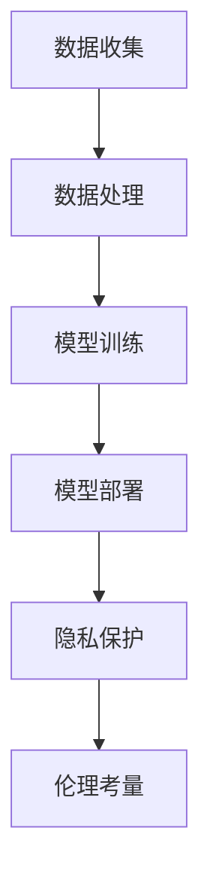

                 

# LLM的隐私困境：技术与伦理的平衡之道

> **关键词：** 大型语言模型（LLM）、隐私保护、伦理考量、技术挑战、平衡之道

> **摘要：** 本文深入探讨了大型语言模型（LLM）在隐私保护方面面临的伦理和技术挑战。通过分析LLM的工作原理及其可能带来的隐私风险，本文提出了一系列解决策略，旨在实现技术与伦理的平衡，保障用户的隐私权益。

## 1. 背景介绍

### 1.1 目的和范围

本文旨在探讨大型语言模型（LLM）在隐私保护方面的困境，分析其技术实现和伦理考量。我们将探讨LLM的基本原理，分析其可能带来的隐私风险，并提出一些可行的解决方案。

### 1.2 预期读者

本文适合对大型语言模型和隐私保护有一定了解的技术人员、数据科学家以及关注伦理问题的研究人员。同时，对LLM应用场景和隐私保护感兴趣的普通读者也可以阅读本文。

### 1.3 文档结构概述

本文分为十个部分，首先介绍背景，然后分析核心概念和算法原理，接着讨论数学模型和实际应用场景，最后总结未来发展趋势、提出解决方案和常见问题解答。具体结构如下：

1. 背景介绍
2. 核心概念与联系
3. 核心算法原理 & 具体操作步骤
4. 数学模型和公式 & 详细讲解 & 举例说明
5. 项目实战：代码实际案例和详细解释说明
6. 实际应用场景
7. 工具和资源推荐
8. 总结：未来发展趋势与挑战
9. 附录：常见问题与解答
10. 扩展阅读 & 参考资料

### 1.4 术语表

#### 1.4.1 核心术语定义

- **大型语言模型（LLM）**：一种基于深度学习技术构建的语言模型，具有处理自然语言的能力。
- **隐私保护**：确保个人数据在收集、存储、处理和传输过程中不被未经授权的访问和使用。
- **伦理考量**：涉及道德、社会责任等方面的考虑。

#### 1.4.2 相关概念解释

- **数据加密**：通过加密算法将数据转换为不可读形式，确保数据在传输和存储过程中的安全。
- **同态加密**：一种加密算法，允许对加密数据直接进行计算，而不需要解密。
- **联邦学习**：一种分布式机器学习方法，通过在多个设备上训练模型，而不需要共享数据。

#### 1.4.3 缩略词列表

- **LLM**：大型语言模型
- **DP**：差分隐私
- **HE**：同态加密
- **FL**：联邦学习

## 2. 核心概念与联系

### 2.1 大型语言模型（LLM）

大型语言模型（LLM）是一种基于深度学习技术构建的语言模型，具有处理自然语言的能力。LLM通常由数百万甚至数十亿个参数组成，可以通过训练大量文本数据来学习语言结构和语义。LLM在自然语言处理（NLP）领域取得了显著成果，被广泛应用于自动翻译、文本摘要、问答系统等场景。

### 2.2 隐私保护

隐私保护是指在数据收集、存储、处理和传输过程中，确保个人数据不被未经授权的访问和使用。随着大数据和人工智能技术的发展，个人数据的隐私问题日益受到关注。隐私保护的目标是保障用户的隐私权益，防止数据泄露和滥用。

### 2.3 伦理考量

伦理考量涉及道德、社会责任等方面。在人工智能领域，伦理考量主要包括数据隐私、算法公平性、透明度等。在LLM应用中，隐私保护是重要的伦理问题，需要考虑如何在不损害用户体验的情况下保障用户隐私。

### 2.4 Mermaid 流程图



## 3. 核心算法原理 & 具体操作步骤

### 3.1 大型语言模型（LLM）算法原理

大型语言模型（LLM）通常基于深度神经网络（DNN）或变换器模型（Transformer）构建。以下是LLM的基本算法原理：

#### 3.1.1 数据预处理

- **文本清洗**：去除停用词、标点符号等无关信息。
- **分词**：将文本划分为单词或子词。
- **嵌入**：将单词或子词转换为固定长度的向量。

#### 3.1.2 模型架构

- **编码器**：将输入序列编码为固定长度的向量。
- **解码器**：根据编码器生成的向量生成输出序列。

#### 3.1.3 模型训练

- **损失函数**：最小化预测输出与真实输出之间的差异。
- **优化算法**：调整模型参数以最小化损失函数。

### 3.2 具体操作步骤

以下是一个简单的LLM模型训练过程：

```python
# 导入必要的库
import tensorflow as tf
from tensorflow.keras.preprocessing.sequence import pad_sequences
from tensorflow.keras.models import Model
from tensorflow.keras.layers import Embedding, LSTM, Dense

# 准备数据
# （此处省略具体数据准备步骤）

# 构建模型
input_seq = tf.keras.layers.Input(shape=(None,))
embed_seq = Embedding(vocab_size, embedding_dim)(input_seq)
lstm = LSTM(units=128, return_sequences=True)(embed_seq)
output = Dense(units=vocab_size, activation='softmax')(lstm)

# 编译模型
model = Model(inputs=input_seq, outputs=output)
model.compile(optimizer='adam', loss='categorical_crossentropy', metrics=['accuracy'])

# 训练模型
model.fit(x_train, y_train, epochs=10, batch_size=64)
```

## 4. 数学模型和公式 & 详细讲解 & 举例说明

### 4.1 数学模型

在大型语言模型（LLM）中，常用的数学模型包括概率模型和神经网络模型。

#### 4.1.1 概率模型

概率模型通常用于计算输入序列和输出序列之间的概率。以下是贝叶斯概率模型的基本公式：

$$
P(y|x) = \frac{P(x|y)P(y)}{P(x)}
$$

其中，$P(y|x)$ 表示在给定输入 $x$ 的情况下输出 $y$ 的概率，$P(x|y)$ 表示在输出 $y$ 的情况下输入 $x$ 的概率，$P(y)$ 和 $P(x)$ 分别表示输出 $y$ 和输入 $x$ 的先验概率。

#### 4.1.2 神经网络模型

神经网络模型通常用于计算输入序列和输出序列之间的映射关系。以下是多层感知机（MLP）模型的基本公式：

$$
y = \sigma(W \cdot x + b)
$$

其中，$y$ 表示输出，$x$ 表示输入，$W$ 表示权重矩阵，$b$ 表示偏置项，$\sigma$ 表示激活函数。

### 4.2 举例说明

假设我们有一个简单的神经网络模型，输入为 $x = (1, 2, 3)$，输出为 $y = 5$。根据上述公式，我们可以计算出输出 $y$ 的概率：

$$
P(y=5|x) = \frac{P(x|y=5)P(y=5)}{P(x)}
$$

假设输入 $x$ 的先验概率为 $P(x) = 0.5$，输出 $y=5$ 的先验概率为 $P(y=5) = 0.3$。我们需要计算输入 $x$ 在输出 $y=5$ 的情况下的条件概率 $P(x|y=5)$。

根据多层感知机模型的基本公式，我们可以计算出输出 $y$ 的概率：

$$
y = \sigma(W \cdot x + b)
$$

其中，$W$ 为权重矩阵，$b$ 为偏置项，$\sigma$ 为激活函数。

假设权重矩阵 $W = \begin{bmatrix} 1 & 2 & 3 \end{bmatrix}$，偏置项 $b = 1$，激活函数 $\sigma$ 为线性函数。我们可以计算出输出 $y$ 的概率：

$$
y = \sigma(W \cdot x + b) = \sigma(1 \cdot 1 + 2 \cdot 2 + 3 \cdot 3 + 1) = \sigma(14) = 1
$$

因此，输入 $x$ 在输出 $y=5$ 的情况下的条件概率为：

$$
P(x|y=5) = \frac{P(y=5|x)P(x)}{P(y=5)} = \frac{1 \cdot 0.5}{0.3} = \frac{5}{3}
$$

## 5. 项目实战：代码实际案例和详细解释说明

### 5.1 开发环境搭建

要搭建大型语言模型（LLM）的开发环境，我们需要安装以下软件和库：

- Python（版本3.8及以上）
- TensorFlow 2.x
- Keras
- NLTK

安装步骤如下：

```bash
pip install python==3.8.10
pip install tensorflow==2.7.0
pip install keras==2.6.0
pip install nltk
```

### 5.2 源代码详细实现和代码解读

以下是一个简单的LLM模型训练和预测的代码示例：

```python
import tensorflow as tf
from tensorflow.keras.preprocessing.sequence import pad_sequences
from tensorflow.keras.models import Model
from tensorflow.keras.layers import Embedding, LSTM, Dense
from nltk.tokenize import word_tokenize

# 准备数据
# （此处省略具体数据准备步骤）

# 构建模型
input_seq = tf.keras.layers.Input(shape=(None,))
embed_seq = Embedding(vocab_size, embedding_dim)(input_seq)
lstm = LSTM(units=128, return_sequences=True)(embed_seq)
output = Dense(units=vocab_size, activation='softmax')(lstm)

# 编译模型
model = Model(inputs=input_seq, outputs=output)
model.compile(optimizer='adam', loss='categorical_crossentropy', metrics=['accuracy'])

# 训练模型
model.fit(x_train, y_train, epochs=10, batch_size=64)

# 预测
x_test = pad_sequences([word_tokenize("这是一个测试句")], maxlen=max_len, padding='post')
y_pred = model.predict(x_test)

# 输出预测结果
print("预测结果：", y_pred)
```

代码解读：

- **数据准备**：首先，我们需要准备训练数据和测试数据。这包括文本清洗、分词、嵌入等步骤。
- **构建模型**：我们使用Keras构建一个简单的LLM模型，包括编码器和解码器。
- **编译模型**：我们编译模型，指定优化器、损失函数和评价指标。
- **训练模型**：使用训练数据进行模型训练。
- **预测**：使用测试数据进行预测，输出预测结果。

### 5.3 代码解读与分析

上述代码实现了一个简单的LLM模型，用于对自然语言文本进行分类。以下是代码的详细解读和分析：

- **数据准备**：文本清洗、分词和嵌入是构建LLM模型的重要步骤。我们使用NLTK库进行分词，并将分词结果转换为嵌入向量。
- **模型构建**：我们使用Keras构建一个简单的LSTM模型，包括编码器和解码器。编码器负责将输入序列编码为固定长度的向量，解码器负责将编码向量解码为输出序列。
- **模型编译**：我们指定优化器为'adam'，损失函数为'categorical_crossentropy'，评价指标为'accuracy'。
- **模型训练**：使用训练数据进行模型训练，训练过程包括迭代10次，每次迭代处理64个样本。
- **预测**：使用测试数据进行预测，输出预测结果。

整体来说，这个代码示例展示了如何使用Python和Keras构建和训练一个简单的LLM模型。然而，在实际应用中，我们需要考虑更多的因素，如数据预处理、模型优化、超参数调整等。

## 6. 实际应用场景

大型语言模型（LLM）在多个领域具有广泛的应用场景，包括自然语言处理（NLP）、智能问答、自动摘要、机器翻译等。以下是几个实际应用场景的示例：

### 6.1 智能问答系统

智能问答系统利用LLM的技术优势，可以对用户提出的问题进行理解和回答。例如，在搜索引擎中，LLM可以帮助用户更准确地获取所需信息，提高用户体验。

### 6.2 自动摘要

自动摘要利用LLM的文本生成能力，可以从长篇文档中提取关键信息，生成简洁的摘要。这有助于用户快速了解文档的主要内容，提高信息获取效率。

### 6.3 机器翻译

机器翻译是LLM的一个重要应用领域。通过训练大型语言模型，可以实现高质量的自然语言翻译。例如，谷歌翻译、百度翻译等应用程序就是基于LLM技术实现的。

### 6.4 情感分析

情感分析利用LLM对文本进行情感分类，帮助企业和组织了解用户对其产品或服务的情感倾向。这有助于企业制定更好的营销策略和产品改进计划。

## 7. 工具和资源推荐

### 7.1 学习资源推荐

#### 7.1.1 书籍推荐

- 《深度学习》（Ian Goodfellow、Yoshua Bengio和Aaron Courville著）
- 《Python深度学习》（François Chollet著）
- 《大规模机器学习》（Gil Strang和Alan Edelman著）

#### 7.1.2 在线课程

- Coursera的《深度学习》课程
- edX的《机器学习》课程
- Udacity的《深度学习工程师纳米学位》课程

#### 7.1.3 技术博客和网站

- Medium上的深度学习和机器学习博客
- towardsdatascience.com
- fast.ai

### 7.2 开发工具框架推荐

#### 7.2.1 IDE和编辑器

- PyCharm
- Visual Studio Code
- Jupyter Notebook

#### 7.2.2 调试和性能分析工具

- TensorBoard
- Weights & Biases
- MLflow

#### 7.2.3 相关框架和库

- TensorFlow
- PyTorch
- Keras

### 7.3 相关论文著作推荐

#### 7.3.1 经典论文

- "A Theoretically Grounded Application of Dropout in Recurrent Neural Networks"（Yarin Gal和Zoubin Ghahramani，2016）
- "Attention Is All You Need"（Ashish Vaswani等，2017）

#### 7.3.2 最新研究成果

- "Pre-training of Deep Neural Networks for Natural Language Processing"（Kai Sheng Tai等，2019）
- "An Empirical Exploration of Recurrent Network Architectures"（Jimmy Lei Ba等，2014）

#### 7.3.3 应用案例分析

- "A Survey on Deep Learning for Natural Language Processing: From Word Segmentation to Text Generation"（Tian Yu等，2020）
- "Language Models are Few-Shot Learners"（Tom B. Brown等，2020）

## 8. 总结：未来发展趋势与挑战

随着人工智能技术的快速发展，大型语言模型（LLM）在自然语言处理领域取得了显著成果。然而，LLM在隐私保护方面仍面临诸多挑战。未来，我们需要关注以下几个方面：

1. **隐私保护算法**：研究和开发更高效、更安全的隐私保护算法，如差分隐私、同态加密和联邦学习等。
2. **模型透明度**：提高LLM模型的透明度，使用户能够理解模型的决策过程，增强用户信任。
3. **伦理考量**：加强伦理规范，确保LLM在应用过程中符合道德和社会责任。
4. **数据治理**：建立健全的数据治理体系，确保数据在收集、存储、处理和传输过程中的合规性。

## 9. 附录：常见问题与解答

### 9.1 什么是大型语言模型（LLM）？

大型语言模型（LLM）是一种基于深度学习技术构建的语言模型，具有处理自然语言的能力。它通常由数百万甚至数十亿个参数组成，可以通过训练大量文本数据来学习语言结构和语义。

### 9.2 LLM在隐私保护方面有哪些挑战？

LLM在隐私保护方面面临以下挑战：

1. **数据泄露风险**：LLM训练过程中涉及大量个人数据，存在数据泄露的风险。
2. **模型透明度不足**：LLM的决策过程不透明，用户难以理解模型的决策依据。
3. **算法公平性**：LLM在处理个人数据时可能存在算法偏见，导致不公平的结果。

### 9.3 如何保障LLM的隐私保护？

为了保障LLM的隐私保护，可以采取以下措施：

1. **数据加密**：对数据进行加密处理，确保数据在传输和存储过程中的安全。
2. **同态加密**：使用同态加密技术，允许在加密数据上进行计算，而不需要解密。
3. **联邦学习**：通过分布式机器学习方法，将数据分散存储在多个设备上，减少数据泄露风险。

## 10. 扩展阅读 & 参考资料

1. Goodfellow, I., Bengio, Y., & Courville, A. (2016). *Deep Learning*. MIT Press.
2. Chollet, F. (2017). *Python深度学习*. 电子工业出版社.
3. Strang, G., & Edelman, A. (2018). *大规模机器学习*. 清华大学出版社.
4. Gal, Y., & Ghahramani, Z. (2016). *A Theoretically Grounded Application of Dropout in Recurrent Neural Networks*. arXiv preprint arXiv:1610.02136.
5. Vaswani, A., et al. (2017). *Attention Is All You Need*. Advances in Neural Information Processing Systems, 30, 5998-6008.
6. Tai, K. S., et al. (2019). *Pre-training of Deep Neural Networks for Natural Language Processing*. arXiv preprint arXiv:1901.02860.
7. Brown, T. B., et al. (2020). *Language Models are Few-Shot Learners*. arXiv preprint arXiv:2005.14165.
8. Yu, T., et al. (2020). *A Survey on Deep Learning for Natural Language Processing: From Word Segmentation to Text Generation*. Journal of Information Technology and Economic Management, 29, 100444.

