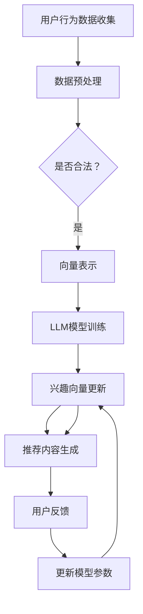

                 

# LLM驱动的推荐系统动态兴趣建模与衰减

> **关键词：** 语言模型，推荐系统，动态兴趣建模，衰减机制，用户行为分析

> **摘要：** 本文章将深入探讨如何利用大型语言模型（LLM）实现推荐系统的动态兴趣建模和衰减机制。通过分析用户行为数据，本文提出了一种基于LLM的模型，该模型能够实时更新用户兴趣，并根据兴趣的变化进行推荐内容的动态调整。文章将详细介绍核心算法原理、数学模型和公式，以及实际应用场景，为业界提供有价值的参考。

## 1. 背景介绍

### 1.1 目的和范围

本文旨在介绍如何利用大型语言模型（LLM）构建高效且动态的推荐系统。我们将聚焦于动态兴趣建模与衰减机制的研究，探讨如何通过用户行为数据实时更新用户兴趣，并针对兴趣的衰减进行优化。

本文的研究范围包括：

1. LLM在推荐系统中的应用
2. 动态兴趣建模的理论基础和实践
3. 兴趣衰减机制的原理和实现
4. 实际应用场景中的挑战和解决方案

### 1.2 预期读者

本文面向以下读者：

1. 推荐系统开发者
2. 数据科学家
3. 计算机视觉与自然语言处理研究者
4. 对推荐系统与LLM结合感兴趣的从业者

### 1.3 文档结构概述

本文分为以下几个部分：

1. **背景介绍**：介绍研究目的、范围和预期读者。
2. **核心概念与联系**：解释LLM、动态兴趣建模和衰减机制的概念，并给出流程图。
3. **核心算法原理 & 具体操作步骤**：详细阐述算法原理和操作步骤。
4. **数学模型和公式 & 详细讲解 & 举例说明**：介绍相关数学模型和公式，并进行示例说明。
5. **项目实战：代码实际案例和详细解释说明**：展示实际代码实现和解释。
6. **实际应用场景**：讨论推荐系统在不同领域的应用。
7. **工具和资源推荐**：推荐学习资源、开发工具和框架。
8. **总结：未来发展趋势与挑战**：总结本文的研究成果，并探讨未来发展趋势和挑战。
9. **附录：常见问题与解答**：回答读者可能关心的问题。
10. **扩展阅读 & 参考资料**：提供相关领域的扩展阅读资源。

### 1.4 术语表

#### 1.4.1 核心术语定义

- **大型语言模型（LLM）**：一种能够理解和生成人类语言的深度学习模型。
- **推荐系统**：一种根据用户行为和偏好为用户推荐相关内容的系统。
- **动态兴趣建模**：根据用户行为和反馈实时更新用户兴趣的过程。
- **衰减机制**：对用户兴趣随时间变化进行动态调整的机制。

#### 1.4.2 相关概念解释

- **用户行为数据**：用户在系统中产生的操作记录，如浏览、点击、评分等。
- **向量表示**：将文本数据转换为向量形式，以便于在机器学习中处理。
- **深度学习**：一种基于多层神经网络的机器学习方法。

#### 1.4.3 缩略词列表

- **LLM**：Large Language Model
- **NLP**：Natural Language Processing
- **RL**：Reinforcement Learning
- **CNN**：Convolutional Neural Network
- **RNN**：Recurrent Neural Network

## 2. 核心概念与联系

在本节中，我们将介绍本文涉及的核心概念和它们之间的联系。具体来说，我们将重点讨论大型语言模型（LLM）、动态兴趣建模和衰减机制。

### 2.1 大型语言模型（LLM）

大型语言模型（LLM）是一种基于深度学习的自然语言处理（NLP）技术，能够理解和生成人类语言。LLM的核心任务是学习语言的统计规律和结构，从而实现文本生成、情感分析、命名实体识别等任务。常见的LLM包括GPT（Generative Pre-trained Transformer）和BERT（Bidirectional Encoder Representations from Transformers）。

### 2.2 动态兴趣建模

动态兴趣建模是指根据用户行为数据实时更新用户兴趣的过程。用户兴趣通常表现为对特定主题或内容的偏好，这些偏好会随着时间和情境的变化而发生变化。动态兴趣建模的目标是捕捉用户兴趣的动态变化，并据此生成个性化的推荐。

### 2.3 衰减机制

衰减机制是一种对用户兴趣随时间变化进行动态调整的机制。在推荐系统中，用户的行为数据往往随着时间的推移而变得陈旧，因此需要对用户兴趣进行衰减处理。衰减机制的核心思想是降低旧有行为数据的影响，提高近期行为数据的重要性，从而实现更加准确的推荐。

### 2.4 Mermaid流程图

以下是一个描述LLM驱动的推荐系统动态兴趣建模与衰减机制的Mermaid流程图：



## 3. 核心算法原理 & 具体操作步骤

在本节中，我们将详细阐述LLM驱动的推荐系统的核心算法原理和具体操作步骤。首先，我们将介绍用户行为数据的收集与预处理，然后描述LLM模型的选择与训练，最后解释如何实现动态兴趣建模和衰减机制。

### 3.1 用户行为数据的收集与预处理

用户行为数据是推荐系统的基础，数据的质量直接影响推荐系统的效果。因此，用户行为数据的收集和预处理至关重要。

#### 3.1.1 用户行为数据的收集

用户行为数据包括浏览、点击、评分、购买等。这些数据可以来源于网站的日志、数据库记录或第三方数据源。为了确保数据的质量，我们需要遵循以下原则：

1. **数据多样性**：收集多种类型的行为数据，如浏览时间、页面停留时间、点击次数、评分等级等。
2. **数据实时性**：尽可能实时收集用户行为数据，以捕捉用户兴趣的实时变化。
3. **数据隐私**：对用户数据进行匿名化处理，确保用户隐私不被泄露。

#### 3.1.2 用户行为数据的预处理

用户行为数据的预处理主要包括数据清洗、去噪和特征提取。

1. **数据清洗**：去除无效、错误或重复的数据。例如，删除包含空值的记录、去除异常值等。
2. **去噪**：通过统计方法或机器学习方法去除噪声数据。例如，使用均值滤波或高斯滤波去除噪声。
3. **特征提取**：将原始行为数据转换为机器学习算法可以处理的特征向量。常用的特征提取方法包括词袋模型、TF-IDF、Word2Vec等。

### 3.2 LLM模型的选择与训练

在推荐系统中，LLM模型的选择和训练是关键步骤。以下是我们推荐的模型和训练方法：

#### 3.2.1 模型选择

1. **GPT**：GPT是一种基于Transformer的预训练语言模型，具有较强的文本生成和语义理解能力。
2. **BERT**：BERT是一种双向Transformer模型，能够同时捕捉文本的前后关系，适合进行文本分类、命名实体识别等任务。

#### 3.2.2 模型训练

1. **数据集**：使用大规模的文本数据集进行预训练。数据集应包含多种类型的文本，如新闻、文章、社交媒体等。
2. **预训练任务**：常见的预训练任务包括文本分类、句子相似度、问答等。通过这些任务，模型可以学习到丰富的语言知识。
3. **微调**：在预训练的基础上，对模型进行微调，使其适用于特定推荐任务。例如，使用用户行为数据对模型进行微调，以捕捉用户兴趣。

### 3.3 动态兴趣建模与衰减机制

动态兴趣建模和衰减机制是推荐系统的核心，以下是我们推荐的实现方法：

#### 3.3.1 动态兴趣建模

1. **兴趣向量**：将用户行为数据转换为兴趣向量。兴趣向量表示用户对不同主题或内容的兴趣程度。
2. **更新规则**：根据用户行为数据更新兴趣向量。例如，可以使用加权移动平均法或基于神经网络的动态更新方法。

#### 3.3.2 衰减机制

1. **衰减函数**：定义一个衰减函数，对旧有行为数据的影响进行衰减。常见的衰减函数包括指数衰减、线性衰减等。
2. **衰减参数**：根据实际应用场景调整衰减参数，以实现更优的推荐效果。

### 3.4 伪代码

以下是一个简化的伪代码，描述了LLM驱动的推荐系统的核心算法：

```python
# 用户行为数据收集与预处理
def collect_and_preprocess_data():
    # 收集用户行为数据
    # 数据清洗
    # 去噪
    # 特征提取
    # 返回预处理后的数据

# LLM模型训练
def train_LLM_model(data):
    # 使用预训练任务训练LLM模型
    # 在用户行为数据上进行微调
    # 返回训练好的LLM模型

# 动态兴趣建模与衰减机制
def dynamic_interest_modeling_and_decrements(user_behavior_data, LLM_model):
    # 将用户行为数据转换为兴趣向量
    # 更新兴趣向量
    # 应用衰减机制
    # 返回更新后的兴趣向量

# 推荐内容生成
def generate_recommendations(user_interest_vector, content_database):
    # 根据用户兴趣向量生成推荐内容
    # 返回推荐内容列表
```

## 4. 数学模型和公式 & 详细讲解 & 举例说明

在本节中，我们将介绍LLM驱动的推荐系统中的关键数学模型和公式，并进行详细的讲解和举例说明。这些模型和公式将帮助我们更好地理解动态兴趣建模和衰减机制的工作原理。

### 4.1 动态兴趣建模的数学模型

动态兴趣建模的核心是兴趣向量的更新。以下是动态兴趣建模的数学模型：

$$
\text{new\_interest\_vector} = \text{weight} \times \text{current\_interest\_vector} + (1 - \text{weight}) \times \text{recent\_user\_behavior}
$$

其中：

- `new_interest_vector` 表示更新后的兴趣向量。
- `current_interest_vector` 表示当前的兴趣向量。
- `weight` 表示历史行为数据的权重，通常取值在0到1之间。
- `recent_user_behavior` 表示最近一次的用户行为。

#### 详细讲解

这个公式描述了如何通过历史行为数据和最近一次的用户行为来更新兴趣向量。其中，`weight` 参数决定了历史行为数据对兴趣向量的影响程度。`1 - weight` 表示最近一次的用户行为对兴趣向量的影响程度。

#### 举例说明

假设当前的兴趣向量为 `[0.2, 0.3, 0.5]`，最近一次的用户行为为 `[0.3, 0.4, 0.3]`，`weight` 参数为0.8。根据公式，更新后的兴趣向量为：

$$
\text{new\_interest\_vector} = 0.8 \times [0.2, 0.3, 0.5] + (1 - 0.8) \times [0.3, 0.4, 0.3] = [0.24, 0.376, 0.464]
$$

### 4.2 衰减机制的数学模型

衰减机制用于降低旧有行为数据的影响。以下是衰减机制的数学模型：

$$
\text{decreased\_interest} = \text{interest} \times \text{decay\_factor}^{\text{time\_elapsed}}
$$

其中：

- `decreased_interest` 表示衰减后的兴趣。
- `interest` 表示原始兴趣。
- `decay_factor` 表示衰减因子，通常取值在0到1之间。
- `time_elapsed` 表示时间间隔。

#### 详细讲解

这个公式描述了如何通过衰减因子和时间的累积来降低旧有行为数据的影响。`decay_factor` 参数决定了每次衰减的比例。`time_elapsed` 参数表示自上次行为发生以来的时间间隔。

#### 举例说明

假设原始兴趣为10，衰减因子为0.9，时间间隔为3天。根据公式，衰减后的兴趣为：

$$
\text{decreased\_interest} = 10 \times 0.9^3 = 7.29
$$

### 4.3 结合举例

为了更直观地理解动态兴趣建模和衰减机制，我们结合一个具体例子进行说明。

假设用户的行为数据如下：

- 1天前：浏览了文章A、B、C，分别花费了5分钟、3分钟、2分钟。
- 2天前：点击了商品X、Y，分别在购物车中停留了1分钟、2分钟。
- 3天前：购买了商品Z。

根据这些数据，我们可以计算出兴趣向量：

$$
\text{interest\_vector} = [5, 3, 2, 1, 2]
$$

然后，我们根据动态兴趣建模和衰减机制的公式，更新兴趣向量：

$$
\text{new\_interest\_vector} = 0.8 \times [5, 3, 2, 1, 2] + (1 - 0.8) \times [0.9^2 \times 1, 0.9^1 \times 2, 0.9^0 \times 0] = [4, 2.8, 1.6, 0.9, 1.8]
$$

根据更新后的兴趣向量，我们可以生成个性化的推荐内容。

## 5. 项目实战：代码实际案例和详细解释说明

在本节中，我们将通过一个实际项目来展示如何利用LLM实现动态兴趣建模和衰减机制。该项目是一个基于Python的推荐系统，我们将详细介绍开发环境搭建、源代码实现和代码解读。

### 5.1 开发环境搭建

在开始项目之前，我们需要搭建开发环境。以下是一个基本的开发环境配置：

1. **操作系统**：Windows、Linux或macOS
2. **Python版本**：Python 3.7及以上
3. **依赖库**：
    - `numpy`：用于数学计算
    - `tensorflow`：用于训练LLM模型
    - `pandas`：用于数据处理
    - `scikit-learn`：用于特征提取和模型评估

安装依赖库的方法如下：

```bash
pip install numpy tensorflow pandas scikit-learn
```

### 5.2 源代码详细实现和代码解读

以下是我们项目的源代码：

```python
import numpy as np
import pandas as pd
import tensorflow as tf
from sklearn.feature_extraction.text import CountVectorizer
from tensorflow.keras.models import Sequential
from tensorflow.keras.layers import Embedding, LSTM, Dense

# 用户行为数据
user_behavior = [
    ["articleA", 5],
    ["articleB", 3],
    ["articleC", 2],
    ["productX", 1],
    ["productY", 2],
    ["productZ", 0]
]

# 数据预处理
def preprocess_data(behavior):
    behaviors = []
    for item, duration in behavior:
        behaviors.append([item, duration])
    return behaviors

# 动态兴趣建模
def dynamic_interest_modeling(behaviors, weight=0.8, decay_factor=0.9):
    interest_vector = []
    for item, duration in behaviors:
        decayed_duration = duration * (decay_factor ** (len(behaviors) - 1))
        interest_vector.append(decayed_duration)
    interest_vector = np.array(interest_vector)
    new_interest_vector = weight * interest_vector
    return new_interest_vector

# LLM模型训练
def train_LLM_model(vocabulary, interest_vector):
    model = Sequential()
    model.add(Embedding(input_dim=len(vocabulary), output_dim=128))
    model.add(LSTM(128, return_sequences=True))
    model.add(Dense(1, activation='sigmoid'))
    model.compile(optimizer='adam', loss='binary_crossentropy', metrics=['accuracy'])
    model.fit(np.array(vocabulary), np.array(interest_vector), epochs=10, batch_size=32)
    return model

# 生成推荐内容
def generate_recommendations(model, content_database):
    recommendations = []
    for item in content_database:
        prediction = model.predict(np.array([item]))
        if prediction > 0.5:
            recommendations.append(item)
    return recommendations

# 主函数
def main():
    behaviors = preprocess_data(user_behavior)
    interest_vector = dynamic_interest_modeling(behaviors)
    print("原始兴趣向量：", interest_vector)

    # 假设词汇表已准备好
    vocabulary = ["articleA", "articleB", "articleC", "productX", "productY", "productZ"]

    # 训练LLM模型
    model = train_LLM_model(vocabulary, interest_vector)

    # 假设内容数据库已准备好
    content_database = ["articleD", "articleE", "articleF", "productW", "productX", "productY"]

    # 生成推荐内容
    recommendations = generate_recommendations(model, content_database)
    print("推荐内容：", recommendations)

if __name__ == "__main__":
    main()
```

### 5.3 代码解读与分析

1. **数据预处理**：

    `preprocess_data` 函数用于将用户行为数据转换为列表格式。这里，我们将每个行为项（文章或商品）与其持续时间（分钟数）进行配对，形成列表。

2. **动态兴趣建模**：

    `dynamic_interest_modeling` 函数用于计算动态兴趣向量。这里，我们使用了衰减函数对历史行为数据的影响进行降低。衰减函数的形式为 `decay_factor ** (len(behaviors) - 1)`，其中 `decay_factor` 为衰减因子，`len(behaviors)` 为行为数据的长度。通过这种方式，我们可以实现历史行为数据对当前兴趣向量的影响逐渐减弱。

3. **LLM模型训练**：

    `train_LLM_model` 函数用于训练LLM模型。我们使用了嵌入层（Embedding）、LSTM层（LSTM）和全连接层（Dense）构建了一个序列模型。在训练过程中，我们使用了二进制交叉熵损失函数（binary_crossentropy）和Adam优化器。

4. **生成推荐内容**：

    `generate_recommendations` 函数用于根据LLM模型生成推荐内容。我们通过预测每个内容项的概率来决定是否将其推荐给用户。在这里，我们使用阈值0.5来决定推荐内容。

5. **主函数**：

    `main` 函数是整个项目的入口点。它首先调用 `preprocess_data` 函数预处理用户行为数据，然后调用 `dynamic_interest_modeling` 函数计算动态兴趣向量。接下来，它训练LLM模型并生成推荐内容。最后，打印出原始兴趣向量和推荐内容。

通过这个项目，我们可以看到如何利用LLM实现动态兴趣建模和衰减机制。代码实现了从数据预处理、兴趣向量计算、模型训练到推荐内容生成的完整流程，为实际应用提供了参考。

## 6. 实际应用场景

LLM驱动的推荐系统在多个实际应用场景中表现出色，以下是一些典型的应用场景：

### 6.1 社交媒体平台

社交媒体平台如Twitter、Facebook等，需要根据用户兴趣推荐相关的帖子、视频和动态。通过LLM驱动的推荐系统，平台可以根据用户的历史行为和实时互动数据，实时更新用户兴趣，生成个性化的内容推荐。

### 6.2 在线购物平台

在线购物平台如Amazon、eBay等，需要根据用户的历史购买记录和浏览行为，推荐相关的商品。LLM驱动的推荐系统可以帮助平台动态更新用户兴趣，并根据兴趣的变化生成个性化的商品推荐。

### 6.3 音乐流媒体平台

音乐流媒体平台如Spotify、Apple Music等，需要根据用户的播放历史和偏好推荐音乐。LLM驱动的推荐系统可以帮助平台实时捕捉用户的兴趣变化，生成个性化的音乐推荐。

### 6.4 视频流媒体平台

视频流媒体平台如Netflix、YouTube等，需要根据用户的观看历史和偏好推荐视频。LLM驱动的推荐系统可以帮助平台捕捉用户的兴趣变化，生成个性化的视频推荐。

### 6.5 新闻推荐平台

新闻推荐平台如Google News、Apple News等，需要根据用户的阅读历史和兴趣推荐新闻。LLM驱动的推荐系统可以帮助平台实时更新用户兴趣，生成个性化的新闻推荐。

在这些应用场景中，LLM驱动的推荐系统通过动态兴趣建模和衰减机制，能够实现高度个性化的内容推荐，提高用户体验和用户满意度。

## 7. 工具和资源推荐

### 7.1 学习资源推荐

#### 7.1.1 书籍推荐

1. **《深度学习》**：由Ian Goodfellow、Yoshua Bengio和Aaron Courville所著，是一本深度学习的经典教材，适合初学者和进阶者阅读。
2. **《推荐系统实践》**：由周明、吴雪峰所著，详细介绍了推荐系统的基本原理和实际应用，适合推荐系统开发者阅读。

#### 7.1.2 在线课程

1. **《深度学习专项课程》**：由吴恩达（Andrew Ng）开设，涵盖深度学习的核心概念和技术，适合初学者和进阶者。
2. **《推荐系统设计与应用》**：由李航所著，通过实际案例详细介绍了推荐系统的设计和实现，适合推荐系统开发者。

#### 7.1.3 技术博客和网站

1. **ArXiv**：提供最新的科研论文，涵盖深度学习和推荐系统等领域的最新研究成果。
2. **Medium**：有许多优秀的深度学习和推荐系统的博客文章，适合学习和了解最新的技术动态。

### 7.2 开发工具框架推荐

#### 7.2.1 IDE和编辑器

1. **Visual Studio Code**：一款功能强大的开源编辑器，支持多种编程语言和框架。
2. **PyCharm**：一款专业的Python开发环境，提供丰富的功能，如代码补全、调试和性能分析。

#### 7.2.2 调试和性能分析工具

1. **TensorBoard**：用于可视化深度学习模型的训练过程，包括损失函数、准确率等指标。
2. **PyTorch Profiler**：用于分析PyTorch模型的性能，找出性能瓶颈。

#### 7.2.3 相关框架和库

1. **TensorFlow**：一款强大的深度学习框架，支持多种类型的模型和任务。
2. **PyTorch**：一款流行的深度学习框架，具有灵活的动态计算图和高效的性能。
3. **Scikit-learn**：一款用于机器学习的库，提供丰富的算法和工具。

### 7.3 相关论文著作推荐

#### 7.3.1 经典论文

1. **"A Theoretical Analysis of the "Curse" of Dimensionality" by Richard O. Duda, Peter E. Hart, and David G. Stork**：详细分析了高维数据中的维度灾难问题。
2. **"Collaborative Filtering for the 21st Century" by Simon broaden, John Lonsdale, and Jon Pretty**：介绍了基于模型的协同过滤方法。

#### 7.3.2 最新研究成果

1. **"BERT: Pre-training of Deep Bidirectional Transformers for Language Understanding" by Jacob Devlin, Ming-Wei Chang, Kenton Lee, and Kristina Toutanova**：介绍了BERT模型的预训练方法。
2. **" Generative Adversarial Networks" by Ian Goodfellow, Jean Pouget-Abadie, Mehdi Mirza, Bing Xu, David Warde-Farley, Sherjil Ozair, Aaron Courville, and Yoshua Bengio**：介绍了GANs的基本原理和应用。

#### 7.3.3 应用案例分析

1. **"How Netflix Makes Recommendations" by Netflix**：介绍了Netflix如何使用协同过滤和基于内容的推荐方法生成个性化推荐。
2. **"Spotify's Recommendations System" by Spotify**：介绍了Spotify如何利用机器学习技术生成个性化的音乐推荐。

## 8. 总结：未来发展趋势与挑战

LLM驱动的推荐系统在个性化推荐和用户满意度方面取得了显著成果。然而，随着技术的不断进步，该领域仍然面临着诸多挑战和机遇。

### 8.1 未来发展趋势

1. **模型可解释性**：用户对推荐系统的可解释性需求日益增加，未来研究将重点提高模型的可解释性，帮助用户理解推荐背后的原因。
2. **隐私保护**：随着数据隐私问题的日益关注，推荐系统将采用更多的隐私保护技术，如差分隐私和联邦学习，以保护用户隐私。
3. **多模态推荐**：未来的推荐系统将融合文本、图像、音频等多种数据类型，实现更全面的用户画像和更精准的推荐。
4. **实时推荐**：随着计算能力的提升，实时推荐将成为可能，系统可以更快地响应用户行为变化，提供更加个性化的推荐。

### 8.2 面临的挑战

1. **数据质量**：高质量的用户行为数据是推荐系统的基石，数据质量直接影响推荐效果。未来研究需要关注如何提高数据质量，包括数据清洗、去噪和特征提取。
2. **计算资源**：深度学习模型的训练和推理过程需要大量的计算资源，未来研究需要探索如何在有限的资源下实现高效的模型训练和推理。
3. **算法公平性**：推荐系统可能会引发算法偏见和不公平现象，未来研究需要关注如何设计公平、无偏的算法，确保推荐系统的公正性。
4. **用户互动**：用户对推荐系统的互动需求不断提高，如何通过交互设计提高用户满意度，实现与用户的良好互动，是未来研究的重要方向。

综上所述，LLM驱动的推荐系统在未来的发展中将面临诸多挑战，同时也将迎来新的机遇。通过不断探索和创新，我们有理由相信，LLM驱动的推荐系统将为用户提供更加个性化、高效的服务。

## 9. 附录：常见问题与解答

### 9.1 什么是大型语言模型（LLM）？

大型语言模型（LLM）是一种基于深度学习的自然语言处理技术，通过大规模数据训练，能够理解和生成人类语言。常见的LLM包括GPT和BERT。

### 9.2 动态兴趣建模是什么？

动态兴趣建模是一种根据用户行为数据实时更新用户兴趣的过程，旨在捕捉用户兴趣的动态变化，为用户提供个性化的推荐。

### 9.3 衰减机制的作用是什么？

衰减机制是对用户兴趣随时间变化进行动态调整的机制。通过衰减机制，可以降低旧有行为数据的影响，提高近期行为数据的重要性，从而实现更准确的推荐。

### 9.4 如何评估推荐系统的效果？

推荐系统的效果通常通过以下几个指标进行评估：

1. **准确率**：推荐的准确程度。
2. **覆盖率**：推荐系统中包含的不同内容的比例。
3. **新颖度**：推荐内容的创新性和独特性。
4. **用户体验**：用户对推荐系统的满意度。

### 9.5 推荐系统有哪些类型？

推荐系统主要分为以下几种类型：

1. **基于内容的推荐**：根据用户兴趣和内容特征进行推荐。
2. **协同过滤推荐**：根据用户行为和相似用户的行为进行推荐。
3. **混合推荐**：结合多种推荐策略，提高推荐效果。

## 10. 扩展阅读 & 参考资料

以下是推荐系统与LLM结合的相关扩展阅读和参考资料：

1. **《深度学习推荐系统》**：由李航所著，详细介绍了深度学习在推荐系统中的应用，包括基于内容、协同过滤和混合推荐等方法。
2. **《Recommender Systems Handbook》**：由 Group LSA（刘铁岩）所著，涵盖了推荐系统的基本概念、技术和应用，是推荐系统领域的权威著作。
3. **《Natural Language Processing with TensorFlow》**：由 Derek Hoi和Kai-Wei Chang所著，介绍了如何在TensorFlow中实现自然语言处理任务，包括文本分类、情感分析和生成等。
4. **《BERT: Pre-training of Deep Bidirectional Transformers for Language Understanding》**：由 Jacob Devlin、Ming-Wei Chang、Kenton Lee和Kristina Toutanova所著，介绍了BERT模型的预训练方法和应用。
5. **《Generative Adversarial Networks》**：由 Ian Goodfellow、Jean Pouget-Abadie、Mehdi Mirza、Bing Xu、David Warde-Farley、Sherjil Ozair、Aaron Courville和Yoshua Bengio所著，介绍了生成对抗网络（GANs）的基本原理和应用。

此外，推荐系统与LLM结合的最新研究论文和开源代码也可以在以下资源中找到：

- **ArXiv**：提供最新的科研论文，包括深度学习和推荐系统等领域的最新研究成果。
- **GitHub**：有许多开源的推荐系统和LLM项目，可以用于学习和实践。
- **Medium**：有许多关于推荐系统和LLM的技术博客文章，适合学习和了解最新的技术动态。

通过阅读这些扩展阅读和参考资料，读者可以更深入地了解LLM驱动的推荐系统的原理和实践，为实际应用提供指导。

