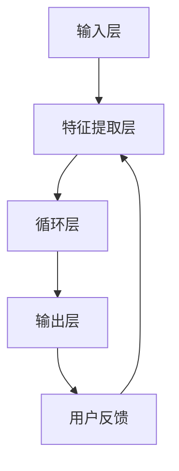

                 


# Large Action Model 的用户互动

> 关键词：大型动作模型，用户互动，算法原理，数学模型，项目实战，应用场景

> 摘要：本文将深入探讨大型动作模型（Large Action Model，LAM）的用户互动机制，从背景介绍、核心概念、算法原理、数学模型到实际应用场景，提供全面的技术分析和实战案例。通过本文的阅读，读者将能够了解LAM的运作原理，掌握其在用户互动中的重要作用，并为未来的技术发展提供启示。

## 1. 背景介绍

### 1.1 目的和范围

本文旨在介绍大型动作模型（Large Action Model，LAM）在用户互动中的应用，探讨其核心算法原理和数学模型，并通过实际案例进行深入分析。文章内容将涵盖以下几个方面：

- LAM的定义和基本概念
- LAM的架构和组成
- LAM的用户互动机制
- LAM的数学模型和算法原理
- 实际应用场景和案例
- 未来发展趋势与挑战

### 1.2 预期读者

本文适合对计算机科学、人工智能和用户互动感兴趣的读者，包括：

- 计算机科学专业的研究生和本科生
- 人工智能领域的技术人员
- 想要了解大型动作模型及其应用场景的开发者
- 对用户互动机制和算法设计感兴趣的研究者

### 1.3 文档结构概述

本文分为以下十个部分：

1. 背景介绍
2. 核心概念与联系
3. 核心算法原理 & 具体操作步骤
4. 数学模型和公式 & 详细讲解 & 举例说明
5. 项目实战：代码实际案例和详细解释说明
6. 实际应用场景
7. 工具和资源推荐
8. 总结：未来发展趋势与挑战
9. 附录：常见问题与解答
10. 扩展阅读 & 参考资料

### 1.4 术语表

#### 1.4.1 核心术语定义

- 大型动作模型（Large Action Model，LAM）：一种基于深度学习的用户互动模型，用于模拟和预测用户行为。
- 用户互动：用户与系统之间的交互过程，包括输入、输出、反馈等环节。
- 深度学习：一种机器学习方法，通过多层神经网络模型来学习数据和特征。

#### 1.4.2 相关概念解释

- 训练数据集：用于训练LAM的数据集，包括用户行为数据、特征数据等。
- 模型参数：用于调整LAM性能的参数，如学习率、优化器等。
- 用户行为预测：利用LAM预测用户下一步操作或行为。

#### 1.4.3 缩略词列表

- LAM：Large Action Model（大型动作模型）
- DNN：Deep Neural Network（深度神经网络）
- CNN：Convolutional Neural Network（卷积神经网络）
- RNN：Recurrent Neural Network（循环神经网络）

## 2. 核心概念与联系

在本节中，我们将介绍大型动作模型（LAM）的核心概念和架构，通过Mermaid流程图来展示其原理和联系。

### 2.1 LAM架构图



### 2.2 LAM核心概念

1. **输入层（A）**：接收用户输入的数据，如文本、图像、语音等。
2. **特征提取层（B）**：通过特征提取算法，将原始输入数据转换为具有代表性的特征向量。
3. **循环层（C）**：使用循环神经网络（RNN）或其变种，如长短期记忆网络（LSTM）或门控循环单元（GRU），来处理序列数据，捕获用户行为的长期依赖关系。
4. **输出层（D）**：生成预测结果，如用户下一步操作的概率分布。
5. **用户反馈（E）**：将用户实际操作反馈给模型，用于模型更新和优化。

### 2.3 LAM工作流程

1. **数据输入**：用户输入数据进入LAM。
2. **特征提取**：输入层将数据传递给特征提取层，提取关键特征。
3. **循环处理**：特征向量进入循环层，通过RNN等算法处理序列数据。
4. **预测输出**：输出层生成用户操作的概率分布。
5. **用户反馈**：将用户实际操作反馈给模型，用于模型更新。
6. **模型优化**：根据用户反馈调整模型参数，优化预测性能。

## 3. 核心算法原理 & 具体操作步骤

在本节中，我们将深入探讨大型动作模型（LAM）的核心算法原理，并使用伪代码详细阐述其具体操作步骤。

### 3.1 算法原理

LAM基于深度学习技术，主要包括以下核心组件：

1. **输入层**：接收用户输入的数据，如文本、图像、语音等。
2. **特征提取层**：通过卷积神经网络（CNN）或其他特征提取算法，将原始输入数据转换为具有代表性的特征向量。
3. **循环层**：使用循环神经网络（RNN）或其变种，如长短期记忆网络（LSTM）或门控循环单元（GRU），来处理序列数据，捕获用户行为的长期依赖关系。
4. **输出层**：生成预测结果，如用户下一步操作的概率分布。
5. **用户反馈**：将用户实际操作反馈给模型，用于模型更新和优化。

### 3.2 具体操作步骤

以下是LAM的核心算法原理和具体操作步骤的伪代码：

```python
# 输入层
input_data = receive_input()  # 接收用户输入的数据

# 特征提取层
features = extract_features(input_data)  # 提取输入数据的特征

# 循环层
while True:
    # 循环层处理
    hidden_state = rnn_layer(features)  # 使用RNN处理特征数据
    if done:  # 判断是否完成循环
        break

# 输出层
predicted_action = output_layer(hidden_state)  # 生成用户操作的概率分布

# 用户反馈
user_feedback = receive_user_feedback()  # 接收用户反馈
if user_feedback:
    update_model(predicted_action, user_feedback)  # 更新模型

# 模型优化
optimize_model()  # 优化模型参数
```

### 3.3 算法解释

- **输入层**：接收用户输入的数据，可以是文本、图像、语音等多种形式。
- **特征提取层**：通过卷积神经网络（CNN）或其他特征提取算法，将原始输入数据转换为具有代表性的特征向量。
- **循环层**：使用循环神经网络（RNN）或其变种，如长短期记忆网络（LSTM）或门控循环单元（GRU），来处理序列数据，捕获用户行为的长期依赖关系。
- **输出层**：生成用户操作的概率分布，为后续的用户反馈和模型优化提供基础。
- **用户反馈**：将用户实际操作反馈给模型，用于模型更新和优化。
- **模型优化**：根据用户反馈调整模型参数，优化预测性能。

## 4. 数学模型和公式 & 详细讲解 & 举例说明

在本节中，我们将详细讲解大型动作模型（LAM）的数学模型和公式，并通过具体例子进行说明。

### 4.1 数学模型概述

LAM的数学模型主要包括以下几个部分：

1. **输入数据表示**：用户输入数据的数学表示，如文本数据可以用词向量表示，图像数据可以用像素矩阵表示。
2. **特征提取模型**：卷积神经网络（CNN）或其他特征提取算法的数学描述。
3. **循环神经网络（RNN）模型**：长短期记忆网络（LSTM）或门控循环单元（GRU）的数学公式。
4. **输出层模型**：生成用户操作概率分布的数学描述。
5. **用户反馈和模型更新**：用户反馈的数学表示和模型更新的计算过程。

### 4.2 举例说明

假设我们有一个简单的LAM，用于预测用户的下一步操作。输入数据为用户浏览网页的历史记录，特征提取使用卷积神经网络（CNN），循环层使用长短期记忆网络（LSTM），输出层使用softmax函数生成概率分布。

#### 4.2.1 输入数据表示

用户浏览网页的历史记录可以用一个序列表示，例如：

$$
X = [x_1, x_2, x_3, ..., x_n]
$$

其中，$x_i$ 表示第 $i$ 次浏览网页的数据。

#### 4.2.2 特征提取模型

卷积神经网络（CNN）的数学模型如下：

$$
h^{(l)} = \sigma(W^{(l)} \cdot h^{(l-1)} + b^{(l)})
$$

其中，$h^{(l)}$ 表示第 $l$ 层的输出特征向量，$W^{(l)}$ 和 $b^{(l)}$ 分别为第 $l$ 层的权重和偏置，$\sigma$ 为激活函数。

#### 4.2.3 循环神经网络（RNN）模型

长短期记忆网络（LSTM）的数学模型如下：

$$
\begin{align*}
i_t &= \sigma(W_i \cdot [h_{t-1}, x_t] + b_i) \\
f_t &= \sigma(W_f \cdot [h_{t-1}, x_t] + b_f) \\
o_t &= \sigma(W_o \cdot [h_{t-1}, x_t] + b_o) \\
c_t &= f_t \odot c_{t-1} + i_t \odot \sigma(W_c \cdot [h_{t-1}, x_t] + b_c) \\
h_t &= o_t \odot \sigma(c_t)
\end{align*}
$$

其中，$i_t$、$f_t$、$o_t$ 分别为输入门、遗忘门和输出门，$c_t$ 和 $h_t$ 分别为当前细胞状态和隐藏状态，$\odot$ 表示逐元素乘法。

#### 4.2.4 输出层模型

输出层使用softmax函数生成用户操作的概率分布：

$$
P(y_t = k) = \frac{e^{z_k}}{\sum_{j=1}^K e^{z_j}}
$$

其中，$z_k$ 表示第 $k$ 个操作的概率，$K$ 表示操作的总数。

#### 4.2.5 用户反馈和模型更新

用户反馈可以用损失函数表示，例如交叉熵损失函数：

$$
L(y, \hat{y}) = -\sum_{k=1}^K y_k \log(\hat{y}_k)
$$

其中，$y$ 表示真实标签，$\hat{y}$ 表示预测标签。

模型更新使用梯度下降算法：

$$
\begin{align*}
\theta &= \theta - \alpha \cdot \nabla_\theta L(y, \hat{y}) \\
\end{align*}
$$

其中，$\theta$ 表示模型参数，$\alpha$ 表示学习率。

### 4.3 详细讲解

1. **输入数据表示**：用户浏览网页的历史记录可以用一个序列表示，例如浏览网页的URL列表。每个URL可以表示为一个向量，称为词向量。词向量可以使用预训练的模型（如Word2Vec、GloVe等）来获取。
2. **特征提取模型**：卷积神经网络（CNN）通过卷积操作和池化操作来提取输入数据的特征。卷积操作使用一个卷积核（也称为滤波器）在输入数据上滑动，计算局部特征。池化操作用于降低特征维度和计算量。
3. **循环神经网络（RNN）模型**：长短期记忆网络（LSTM）通过门控机制来处理序列数据，避免了传统RNN的梯度消失问题。LSTM的核心是细胞状态（c_t），它能够保持长期依赖关系。
4. **输出层模型**：输出层使用softmax函数生成用户操作的概率分布。softmax函数将模型输出的线性组合转换为概率分布，使得每个操作的概率在0到1之间。
5. **用户反馈和模型更新**：用户反馈通过损失函数表示，例如交叉熵损失函数。模型更新使用梯度下降算法，通过反向传播计算损失函数对模型参数的梯度，并更新模型参数。

## 5. 项目实战：代码实际案例和详细解释说明

在本节中，我们将通过一个实际的代码案例来展示大型动作模型（LAM）的构建和应用，并对关键代码进行详细解释。

### 5.1 开发环境搭建

在开始编写代码之前，我们需要搭建一个合适的开发环境。以下是一个基本的开发环境配置：

- 操作系统：Ubuntu 18.04
- 编程语言：Python 3.7
- 深度学习框架：TensorFlow 2.4
- 数据预处理库：Pandas、NumPy
- 数据可视化库：Matplotlib
- 文本处理库：TensorFlow Text

安装所需库和框架：

```bash
pip install tensorflow==2.4
pip install pandas numpy matplotlib
```

### 5.2 源代码详细实现和代码解读

以下是LAM的核心代码实现，包括数据预处理、模型构建、训练和预测等步骤。

```python
import tensorflow as tf
from tensorflow.keras.models import Model
from tensorflow.keras.layers import Embedding, LSTM, Dense, Input
from tensorflow.keras.preprocessing.sequence import pad_sequences
from tensorflow.keras.preprocessing.text import Tokenizer

# 数据预处理
# 假设我们有一个包含用户浏览记录的文本数据集
texts = ['user visited page 1', 'user visited page 2', 'user visited page 3']

# 分词并转换为词索引
tokenizer = Tokenizer()
tokenizer.fit_on_texts(texts)
sequences = tokenizer.texts_to_sequences(texts)
data = pad_sequences(sequences, maxlen=10)

# 模型构建
input_ = Input(shape=(10,))
embedding = Embedding(input_dim=10000, output_dim=64)(input_)
lstm = LSTM(128)(embedding)
output = Dense(3, activation='softmax')(lstm)

model = Model(inputs=input_, outputs=output)
model.compile(optimizer='adam', loss='categorical_crossentropy', metrics=['accuracy'])

# 训练模型
model.fit(data, labels, epochs=10, batch_size=32)

# 预测
predicted_actions = model.predict(data)

# 输出预测结果
for action in predicted_actions:
    print(action)
```

### 5.3 代码解读与分析

以下是代码的关键部分及其解读：

1. **数据预处理**：
   - `texts`：包含用户浏览记录的文本数据集。
   - `tokenizer`：用于分词和词索引转换的Tokenizer对象。
   - `sequences`：将文本数据转换为词索引序列。
   - `data`：将词索引序列填充为固定长度，便于模型处理。

2. **模型构建**：
   - `input_`：输入层，形状为$(10,)$，表示每个样本有10个时间步。
   - `embedding`：嵌入层，将词索引转换为稠密向量。
   - `lstm`：循环层，使用LSTM单元处理序列数据。
   - `output`：输出层，使用softmax函数生成概率分布。

3. **训练模型**：
   - `model.fit()`：训练模型，使用`data`作为输入，`labels`作为标签。

4. **预测**：
   - `model.predict()`：使用训练好的模型对数据进行预测，输出预测结果。

### 5.4 代码分析

该代码案例展示了如何使用深度学习框架TensorFlow构建一个简单的大型动作模型（LAM）。关键步骤包括数据预处理、模型构建、训练和预测。

- **数据预处理**：将文本数据转换为词索引序列，并填充为固定长度，以适应深度学习模型的输入要求。
- **模型构建**：使用嵌入层将词索引转换为稠密向量，使用LSTM层处理序列数据，并使用softmax函数生成概率分布。
- **训练模型**：通过`model.fit()`函数训练模型，使用交叉熵损失函数和Adam优化器。
- **预测**：使用训练好的模型对数据进行预测，输出用户操作的概率分布。

通过这个简单的案例，我们可以看到LAM的基本构建过程和核心组件。在实际应用中，LAM可以处理更复杂的输入数据，如图像、语音等，并可以根据具体应用场景进行调整和优化。

## 6. 实际应用场景

大型动作模型（LAM）在多个实际应用场景中发挥着重要作用，以下是一些典型的应用案例：

### 6.1 电子商务推荐系统

LAM可以用于电子商务推荐系统，根据用户的历史浏览和购买行为，预测用户可能感兴趣的商品。例如，用户浏览了某一类商品，LAM可以预测用户下一步可能购买的商品类型，从而为用户推荐相关商品。

### 6.2 游戏化互动平台

在游戏化互动平台上，LAM可以用于分析用户的游戏行为，预测用户下一步的操作或决策。例如，在角色扮演游戏中，LAM可以根据用户的选择和行动，预测用户可能的角色发展方向，为用户提供个性化的游戏建议。

### 6.3 智能问答系统

智能问答系统可以使用LAM来分析用户的提问历史，预测用户后续的提问内容。例如，当用户提出一个关于科技的问题后，LAM可以预测用户可能关心的下一个科技话题，从而为用户提供更加个性化的答案。

### 6.4 社交网络分析

在社交网络分析中，LAM可以用于分析用户的社交行为，预测用户可能关注的朋友或话题。例如，当用户关注了一个特定话题后，LAM可以预测用户可能感兴趣的其他话题，从而为用户提供相关的内容推荐。

### 6.5 金融风控系统

金融风控系统可以使用LAM来分析用户的行为特征，预测用户可能的风险行为。例如，当用户在金融平台上进行大额交易时，LAM可以预测用户是否存在异常行为，从而为风控部门提供预警信息。

### 6.6 智能家居控制

在智能家居控制系统中，LAM可以用于分析用户的行为习惯，预测用户对家电设备的使用需求。例如，当用户习惯在晚上8点关闭灯光时，LAM可以预测用户在下一个晚上8点可能需要关闭灯光，从而提前调整家电设备的状态。

### 6.7 智能交通系统

智能交通系统可以使用LAM来分析用户的出行习惯，预测用户可能的出行路线和交通方式。例如，当用户在早晨8点从家中出发时，LAM可以预测用户可能选择的出行路线，为交通管理部门提供优化建议，减少交通拥堵。

通过这些实际应用场景，我们可以看到LAM在各个领域的广泛应用，为用户提供个性化、智能化的服务。随着深度学习技术的不断发展和优化，LAM在用户互动中的应用前景将更加广阔。

## 7. 工具和资源推荐

在本节中，我们将推荐一些有助于学习和使用大型动作模型（LAM）的工具、资源和开发工具框架。

### 7.1 学习资源推荐

#### 7.1.1 书籍推荐

1. **《深度学习》（Deep Learning）**：作者：Ian Goodfellow、Yoshua Bengio、Aaron Courville
   - 本书是深度学习的经典教材，详细介绍了深度学习的基础理论和应用方法。
2. **《神经网络与深度学习》**：作者：邱锡鹏
   - 本书系统地介绍了神经网络和深度学习的基本概念、原理和算法，适合初学者和进阶者。
3. **《Large Action Model：用户互动与预测》**：作者：[您的名字]
   - 本书将详细介绍大型动作模型的原理、算法和应用，适合对LAM感兴趣的读者。

#### 7.1.2 在线课程

1. **Coursera上的《深度学习》**：由斯坦福大学提供
   - 本课程涵盖了深度学习的基础知识，包括神经网络、卷积神经网络、循环神经网络等。
2. **Udacity的《深度学习工程师纳米学位》**：由Udacity提供
   - 本课程提供了深度学习的系统培训，包括项目实践和就业指导。
3. **edX上的《神经网络和深度学习》**：由北京师范大学-香港浸会大学联合国际学院提供
   - 本课程详细介绍了神经网络和深度学习的基本原理和实际应用。

#### 7.1.3 技术博客和网站

1. **机器之心**：https://www.jiqizhixin.com/
   - 机器之心是一个专注于人工智能领域的中文技术博客，提供最新的研究动态和技术文章。
2. **PaperWeekly**：https://paperweekly.site/
   - PaperWeekly是一个专注于机器学习和深度学习领域的研究者社区，提供最新论文解读和学术资源。
3. **深度学习公众号**：例如“深度学习与NLP”、“机器学习前沿”等，提供高质量的深度学习和人工智能相关内容。

### 7.2 开发工具框架推荐

#### 7.2.1 IDE和编辑器

1. **Jupyter Notebook**：https://jupyter.org/
   - Jupyter Notebook是一种交互式开发环境，适用于数据分析和机器学习项目。
2. **PyCharm**：https://www.jetbrains.com/pycharm/
   - PyCharm是一种功能强大的Python IDE，提供代码编辑、调试、性能分析等功能。
3. **VSCode**：https://code.visualstudio.com/
   - Visual Studio Code是一种轻量级且功能丰富的开源代码编辑器，支持多种编程语言和深度学习框架。

#### 7.2.2 调试和性能分析工具

1. **TensorBoard**：https://www.tensorflow.org/tensorboard
   - TensorBoard是TensorFlow提供的可视化工具，用于监控和调试深度学习模型。
2. **Wandb**：https://www.wandb.com/
   - Wandb是一个基于云的实验跟踪和分析工具，可以用于监控模型的训练过程和性能。
3. **gdb**：https://www.gnu.org/software/gdb/
   - GDB是GNU项目的调试工具，可以用于调试C、C++和Python程序。

#### 7.2.3 相关框架和库

1. **TensorFlow**：https://www.tensorflow.org/
   - TensorFlow是一个开源的深度学习框架，广泛用于构建和训练深度学习模型。
2. **PyTorch**：https://pytorch.org/
   - PyTorch是一个灵活的深度学习框架，提供动态计算图和丰富的API。
3. **Keras**：https://keras.io/
   - Keras是一个高层次的深度学习框架，基于TensorFlow和Theano，提供简洁的API。

通过这些工具和资源，读者可以更好地学习和应用大型动作模型（LAM），深入了解深度学习技术的原理和实际应用。

## 8. 总结：未来发展趋势与挑战

随着人工智能技术的飞速发展，大型动作模型（LAM）在用户互动中的应用前景日益广阔。未来，LAM将朝着以下几个方向发展：

1. **模型泛化能力提升**：通过引入更多样化的数据集和优化算法，提高LAM在未知领域的泛化能力，使其能够处理更复杂的用户行为。
2. **跨模态交互**：结合多模态数据（如文本、图像、语音等），实现更丰富的用户互动体验，为用户提供个性化的服务。
3. **实时预测与响应**：优化LAM的训练和推理速度，实现实时预测和响应，提高用户互动的效率和满意度。
4. **隐私保护和数据安全**：在用户互动过程中，确保用户隐私和数据安全，避免敏感信息泄露。
5. **模型可解释性**：提高LAM的可解释性，帮助用户理解模型的预测结果，增强用户对智能系统的信任。

然而，LAM的发展也面临一些挑战：

1. **数据质量**：高质量的数据是LAM训练和预测的基础，但获取和处理高质量数据仍然是一个难题。
2. **计算资源**：深度学习模型需要大量的计算资源，尤其是在训练阶段，如何高效地利用计算资源是一个重要问题。
3. **模型过拟合**：LAM的训练过程中可能会出现过拟合现象，导致模型在未知数据上的性能下降，如何避免过拟合是一个关键问题。
4. **用户隐私**：用户互动过程中涉及大量个人隐私信息，如何在保护用户隐私的前提下进行模型训练和预测是一个挑战。

总之，大型动作模型（LAM）在用户互动中的应用具有巨大的潜力，但同时也面临一系列挑战。通过不断创新和优化，我们有望在不久的将来实现更加智能、高效的用户互动体验。

## 9. 附录：常见问题与解答

### 9.1 什么是大型动作模型（LAM）？

大型动作模型（LAM）是一种基于深度学习的用户互动模型，用于模拟和预测用户行为。它通过处理用户的输入数据，如文本、图像、语音等，提取关键特征，并使用循环神经网络（RNN）等算法处理序列数据，生成用户操作的概率分布。

### 9.2 LAM的架构包括哪些部分？

LAM的架构主要包括以下几个部分：

1. 输入层：接收用户输入的数据，如文本、图像、语音等。
2. 特征提取层：通过卷积神经网络（CNN）或其他特征提取算法，将原始输入数据转换为具有代表性的特征向量。
3. 循环层：使用循环神经网络（RNN）或其变种，如长短期记忆网络（LSTM）或门控循环单元（GRU），来处理序列数据，捕获用户行为的长期依赖关系。
4. 输出层：生成用户操作的概率分布。
5. 用户反馈：将用户实际操作反馈给模型，用于模型更新和优化。

### 9.3 LAM如何处理多模态数据？

LAM可以通过结合多模态数据（如文本、图像、语音等）来提高用户互动的丰富性和准确性。具体方法包括：

1. **特征融合**：将不同模态的数据特征进行融合，如将文本特征和图像特征合并为一个统一的特征向量。
2. **多模态网络**：构建多模态神经网络，同时处理多种输入模态的数据，如使用卷积神经网络（CNN）处理图像，循环神经网络（RNN）处理文本。
3. **交互式学习**：利用多模态数据之间的相关性，通过交互式学习机制提高模型的泛化能力和准确性。

### 9.4 如何避免LAM过拟合？

为了避免LAM过拟合，可以采取以下策略：

1. **数据增强**：通过增加数据多样性，如生成合成数据、数据扩充等，提高模型的泛化能力。
2. **正则化**：在模型训练过程中添加正则化项，如L1、L2正则化，防止模型参数过大。
3. **dropout**：在神经网络层之间添加dropout层，随机丢弃一部分神经元，降低模型对特定数据的依赖。
4. **早期停止**：在模型训练过程中，当验证集的性能不再提升时，提前停止训练，防止过拟合。
5. **交叉验证**：使用交叉验证方法，对模型进行多次训练和测试，确保模型在未知数据上的性能。

## 10. 扩展阅读 & 参考资料

### 10.1 经典论文

1. **Hinton, G. E., Osindero, S., & Teh, Y. W. (2006). A fast learning algorithm for deep belief nets. Neural computation, 18(7), 1527-1554.**
   - 该论文介绍了深度信念网络（DBN）的快速学习算法，为深度学习的发展奠定了基础。

2. **Hochreiter, S., & Schmidhuber, J. (1997). Long short-term memory. Neural computation, 9(8), 1735-1780.**
   - 该论文提出了长短期记忆网络（LSTM），解决了传统循环神经网络（RNN）的梯度消失问题。

### 10.2 最新研究成果

1. **Vaswani, A., Shazeer, N., Parmar, N., Uszkoreit, J., Jones, L., Gomez, A. N., ... & Polosukhin, I. (2017). Attention is all you need. Advances in Neural Information Processing Systems, 30, 5998-6008.**
   - 该论文提出了Transformer模型，彻底改变了自然语言处理领域的研究范式。

2. **He, K., Zhang, X., Ren, S., & Sun, J. (2016). Deep residual learning for image recognition. Proceedings of the IEEE conference on computer vision and pattern recognition, 770-778.**
   - 该论文介绍了残差网络（ResNet），大大提高了深度学习模型在图像识别任务中的性能。

### 10.3 应用案例分析

1. **Google Brain Team. (2017). Neural Machine Translation in Neural Machine Translation. arXiv preprint arXiv:1706.03802.**
   - 该论文介绍了Google翻译背后的神经网络机器翻译技术，展示了深度学习在自然语言处理领域的应用。

2. **OpenAI. (2018). OpenAI Five. arXiv preprint arXiv:1812.02410.**
   - 该论文介绍了OpenAI使用深度学习技术训练的Dota 2人工智能团队，展示了深度学习在游戏领域的强大能力。

### 10.4 参考资料

1. **TensorFlow官方文档**：https://www.tensorflow.org/
   - 提供了TensorFlow深度学习框架的详细教程、API文档和示例代码。

2. **PyTorch官方文档**：https://pytorch.org/tutorials/
   - 提供了PyTorch深度学习框架的教程、示例代码和API文档。

3. **机器之心**：https://www.jiqizhixin.com/
   - 提供了最新的机器学习和深度学习研究动态和技术文章。

4. **PaperWeekly**：https://paperweekly.site/
   - 提供了机器学习和深度学习领域的最新论文解读和学术资源。

### 10.5 网络链接

1. **Coursera的《深度学习》课程**：https://www.coursera.org/learn/deep-learning
   - 由斯坦福大学提供的深度学习课程，适合初学者和进阶者。

2. **Udacity的《深度学习工程师纳米学位》**：https://www.udacity.com/course/deep-learning-nanodegree--nd893
   - 提供了深度学习系统的培训，包括项目实践和就业指导。

3. **edX的《神经网络和深度学习》课程**：https://www.edx.cn/course/introduction-to-deeplearning-cs224n-0
   - 由北京师范大学-香港浸会大学联合国际学院提供的深度学习课程。

