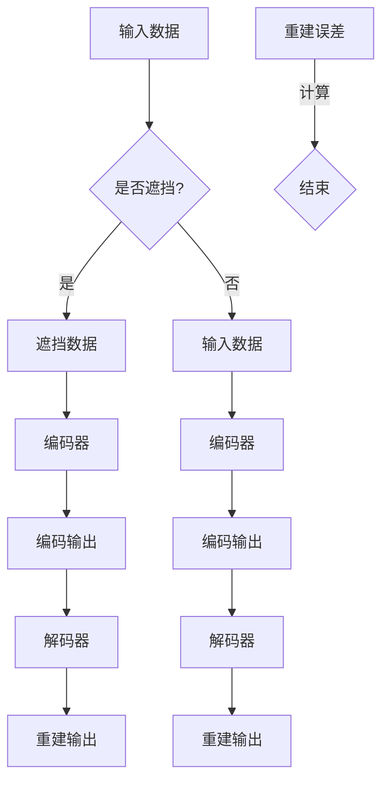

                 

# MAE原理与代码实例讲解

> **关键词**：MAE，数据增强，图像恢复，自编码器，深度学习

> **摘要**：本文将深入讲解MAE（Masked Autoencoder）的原理，通过实际代码实例展示其实现和应用。MAE是一种流行的深度学习模型，用于图像等数据增强，通过部分遮挡输入数据，训练模型学习数据的内在结构和特征，从而提高模型的泛化能力和鲁棒性。

## 1. 背景介绍

### 1.1 目的和范围

本文旨在介绍MAE（Masked Autoencoder）的基本概念、原理及其在图像恢复和数据增强中的应用。我们将通过详细的伪代码和代码实例，讲解MAE的工作机制，并探讨其在实际项目中的应用。

### 1.2 预期读者

本文适合对深度学习和图像处理有基本了解的读者，特别是那些希望了解MAE模型如何实现数据增强和图像恢复的工程师和研究人员。

### 1.3 文档结构概述

本文结构如下：

1. **背景介绍**：介绍MAE的目的、范围和预期读者。
2. **核心概念与联系**：介绍MAE的核心概念，包括自编码器和数据增强。
3. **核心算法原理 & 具体操作步骤**：详细讲解MAE的工作原理和操作步骤。
4. **数学模型和公式 & 详细讲解 & 举例说明**：介绍MAE的数学模型和相关公式。
5. **项目实战：代码实际案例和详细解释说明**：通过实际代码实例展示MAE的应用。
6. **实际应用场景**：探讨MAE在不同领域的应用。
7. **工具和资源推荐**：推荐学习资源和开发工具。
8. **总结：未来发展趋势与挑战**：总结MAE的未来发展和面临的挑战。
9. **附录：常见问题与解答**：回答读者可能遇到的问题。
10. **扩展阅读 & 参考资料**：提供进一步阅读的资源和文献。

### 1.4 术语表

#### 1.4.1 核心术语定义

- **MAE（Masked Autoencoder）**：一种自编码器，其输入数据部分被遮挡，模型需要从未遮挡的数据中重建整个输入。
- **自编码器**：一种神经网络模型，用于学习输入数据的编码和重建。
- **数据增强**：通过变换和扩充数据集，提高模型的泛化能力。

#### 1.4.2 相关概念解释

- **遮挡**：输入数据的部分被隐藏或遮挡。
- **重建误差**：模型输出与原始输入之间的差异。

#### 1.4.3 缩略词列表

- **MAE**：Masked Autoencoder
- **自编码器**：Autoencoder
- **深度学习**：Deep Learning

## 2. 核心概念与联系

### 2.1 自编码器简介

自编码器是一种无监督学习方法，用于学习数据的编码和重建。自编码器通常由两个主要部分组成：编码器（Encoder）和解码器（Decoder）。编码器将输入数据编码为一个压缩表示（称为编码或中间层），然后解码器尝试重建原始输入数据。

### 2.2 数据增强与MAE

数据增强是一种常用的技术，通过变换和扩充数据集，提高模型的泛化能力。MAE是一种特殊类型的自编码器，其核心思想是在训练过程中对输入数据进行部分遮挡（masking），使得模型需要从未被遮挡的数据中学习并重建整个输入。

### 2.3 Mermaid 流程图

下面是一个MAE的流程图，展示了数据输入、遮挡、编码、解码和重建的过程。



在这个流程图中，`A` 表示输入数据，`B` 是一个判断节点，决定是否对数据进行遮挡。如果是，则进入 `C` 节点，对数据进行遮挡；否则直接进入 `D` 节点，使用原始数据。`E` 和 `F` 分别是编码器，将输入数据编码为压缩表示。`G` 和 `H` 分别是编码输出，`I` 和 `J` 分别是解码器，尝试重建原始输入数据。`K` 和 `L` 分别是重建输出，最后计算重建误差，结束流程。

## 3. 核心算法原理 & 具体操作步骤

### 3.1 自编码器基本原理

自编码器的核心是学习数据的压缩表示和解码方法。以下是自编码器的基本操作步骤：

1. **编码**：输入数据通过编码器（通常是一个全连接层）转化为一个压缩的中间表示。
2. **解码**：压缩表示通过解码器（通常是一个全连接层）重新构建为原始数据。

### 3.2 遮挡操作

在MAE中，遮挡操作是关键。以下是遮挡操作的具体步骤：

1. **随机选择遮挡比例**：根据设定的遮挡比例，随机选择输入数据中的一部分进行遮挡。
2. **遮挡数据**：将选定的数据部分设置为0或随机值，使其在训练过程中无法直接访问。

### 3.3 重建误差计算

在MAE中，重建误差是衡量模型性能的关键指标。以下是重建误差的计算方法：

1. **计算重建误差**：使用解码器的输出与原始输入之间的差异作为重建误差。
2. **优化重建误差**：通过反向传播和梯度下降更新模型参数，以最小化重建误差。

### 3.4 伪代码

以下是MAE的伪代码，展示了其基本工作流程：

```python
# 输入数据
input_data = ...

# 遮挡比例
mask_ratio = ...

# 编码器和解码器
encoder = ...
decoder = ...

# 训练循环
for epoch in range(num_epochs):
    for data in input_data:
        # 遮挡操作
        masked_data = mask_data(data, mask_ratio)
        
        # 前向传播
        encoded = encoder(masked_data)
        decoded = decoder(encoded)
        
        # 计算重建误差
        error = calculate_error(decoded, data)
        
        # 反向传播
        encoder.backward(error)
        decoder.backward(error)
        
        # 更新模型参数
        update_params(encoder, decoder)
```

在这个伪代码中，`mask_data` 函数用于执行遮挡操作，`calculate_error` 函数用于计算重建误差，`update_params` 函数用于更新模型参数。

## 4. 数学模型和公式 & 详细讲解 & 举例说明

### 4.1 自编码器的数学模型

自编码器的核心是学习一个从输入空间到压缩表示空间的映射，再从压缩表示空间到输出空间的映射。以下是自编码器的数学模型：

1. **编码过程**：

$$
z = \sigma(W_1 \cdot x + b_1)
$$

其中，$z$ 是编码输出，$x$ 是输入数据，$W_1$ 是编码器的权重矩阵，$b_1$ 是编码器的偏置向量，$\sigma$ 是激活函数，通常使用ReLU函数。

2. **解码过程**：

$$
x' = \sigma(W_2 \cdot z + b_2)
$$

其中，$x'$ 是解码输出，$W_2$ 是解码器的权重矩阵，$b_2$ 是解码器的偏置向量。

### 4.2 遮挡操作的数学模型

在MAE中，遮挡操作通常使用随机掩码（random mask）来实现。以下是遮挡操作的数学模型：

1. **遮挡数据生成**：

$$
masked_data = x \odot mask
$$

其中，$masked_data$ 是遮挡后的数据，$x$ 是原始数据，$mask$ 是随机生成的掩码，$\odot$ 是逐元素乘操作。

### 4.3 重建误差的数学模型

在MAE中，重建误差通常使用均方误差（mean squared error, MSE）来衡量。以下是重建误差的数学模型：

$$
error = \frac{1}{N} \sum_{i=1}^{N} (x_i - x_i')^2
$$

其中，$error$ 是重建误差，$N$ 是数据样本的数量，$x_i$ 是第$i$个样本的原始数据，$x_i'$ 是第$i$个样本的解码输出。

### 4.4 举例说明

假设我们有一个2D输入数据矩阵$x$，其大小为$2 \times 2$，如下所示：

$$
x = \begin{bmatrix}
1 & 2 \\
3 & 4 \\
\end{bmatrix}
$$

我们设置遮挡比例为50%，即有一半的数据将被遮挡。随机生成的掩码$mask$为：

$$
mask = \begin{bmatrix}
1 & 0 \\
0 & 1 \\
\end{bmatrix}
$$

根据遮挡操作的数学模型，遮挡后的数据$masked\_data$为：

$$
masked\_data = x \odot mask = \begin{bmatrix}
1 & 0 \\
0 & 1 \\
\end{bmatrix}
$$

接下来，我们使用编码器和解码器对$masked\_data$进行编码和重建。假设编码器和解码器的权重矩阵分别为$W_1$和$W_2$，偏置向量分别为$b_1$和$b_2$。使用ReLU函数作为激活函数，编码过程和解码过程如下：

1. **编码过程**：

$$
z = \sigma(W_1 \cdot masked\_data + b_1)
$$

2. **解码过程**：

$$
x' = \sigma(W_2 \cdot z + b_2)
$$

经过编码和解码，我们得到重建输出$x'$。计算重建误差：

$$
error = \frac{1}{N} \sum_{i=1}^{N} (x_i - x_i')^2
$$

在这个例子中，$N = 2$，$x_1 = 1$，$x_1' = 1$，$x_2 = 3$，$x_2' = 3$。因此，重建误差为0。

这个例子展示了MAE的基本数学模型和操作步骤。在实际应用中，数据的大小和维度可能更大，但基本原理相同。

## 5. 项目实战：代码实际案例和详细解释说明

### 5.1 开发环境搭建

在开始编写MAE的代码之前，我们需要搭建一个合适的开发环境。以下是推荐的开发环境和工具：

- **编程语言**：Python
- **深度学习框架**：PyTorch
- **版本要求**：PyTorch 1.8或更高版本

确保您的Python环境中已安装PyTorch。可以使用以下命令进行安装：

```bash
pip install torch torchvision
```

### 5.2 源代码详细实现和代码解读

以下是MAE的实现代码。我们将逐步解析每部分代码。

#### 5.2.1 代码结构

```python
import torch
import torch.nn as nn
import torch.optim as optim
from torchvision import datasets, transforms
import numpy as np

# 设置随机种子以保持结果一致性
torch.manual_seed(0)

# 加载数据集
transform = transforms.Compose([
    transforms.ToTensor(),
    transforms.Normalize((0.5,), (0.5,))
])
train_set = datasets.MNIST(
    root='./data', train=True, download=True, transform=transform
)
train_loader = torch.utils.data.DataLoader(
    train_set, batch_size=128, shuffle=True, num_workers=2
)

# 定义模型结构
class MaskedAutoencoder(nn.Module):
    def __init__(self):
        super(MaskedAutoencoder, self).__init__()
        self.encoder = nn.Sequential(
            nn.Linear(28*28, 64),
            nn.ReLU(),
            nn.Linear(64, 32),
            nn.ReLU(),
            nn.Linear(32, 16),
            nn.ReLU(),
            nn.Linear(16, 8),
            nn.ReLU(),
            nn.Linear(8, 1)
        )
        self.decoder = nn.Sequential(
            nn.Linear(1, 8),
            nn.ReLU(),
            nn.Linear(8, 16),
            nn.ReLU(),
            nn.Linear(16, 32),
            nn.ReLU(),
            nn.Linear(32, 64),
            nn.ReLU(),
            nn.Linear(64, 28*28),
            nn.Sigmoid()
        )

    def forward(self, x):
        encoded = self.encoder(x)
        decoded = self.decoder(encoded)
        return decoded

# 初始化模型和优化器
model = MaskedAutoencoder()
optimizer = optim.Adam(model.parameters(), lr=0.001)
criterion = nn.MSELoss()

# 训练模型
num_epochs = 100
for epoch in range(num_epochs):
    for i, (images, _) in enumerate(train_loader):
        # 遮挡操作
        masks = torch.rand(images.size()) < 0.5
        masked_images = images * masks
        
        # 前向传播
        outputs = model(masked_images)
        loss = criterion(outputs, images)

        # 反向传播
        optimizer.zero_grad()
        loss.backward()
        optimizer.step()

        if (i+1) % 10 == 0:
            print(f'Epoch [{epoch+1}/{num_epochs}], Step [{i+1}/{len(train_loader)}], Loss: {loss.item():.4f}')

# 保存模型
torch.save(model.state_dict(), 'masked_autoencoder.pth')
```

#### 5.2.2 代码解读

1. **数据加载**：

   我们使用PyTorch的`datasets.MNIST`函数加载数据集，并应用归一化处理。

   ```python
   transform = transforms.Compose([
       transforms.ToTensor(),
       transforms.Normalize((0.5,), (0.5,))
   ])
   train_set = datasets.MNIST(
       root='./data', train=True, download=True, transform=transform
   )
   train_loader = torch.utils.data.DataLoader(
       train_set, batch_size=128, shuffle=True, num_workers=2
   )
   ```

2. **模型定义**：

   我们定义了一个`MaskedAutoencoder`类，继承自`nn.Module`。该类包含了编码器和解码器的定义。

   ```python
   class MaskedAutoencoder(nn.Module):
       def __init__(self):
           super(MaskedAutoencoder, self).__init__()
           self.encoder = nn.Sequential(
               nn.Linear(28*28, 64),
               nn.ReLU(),
               nn.Linear(64, 32),
               nn.ReLU(),
               nn.Linear(32, 16),
               nn.ReLU(),
               nn.Linear(16, 8),
               nn.ReLU(),
               nn.Linear(8, 1)
           )
           self.decoder = nn.Sequential(
               nn.Linear(1, 8),
               nn.ReLU(),
               nn.Linear(8, 16),
               nn.ReLU(),
               nn.Linear(16, 32),
               nn.ReLU(),
               nn.Linear(32, 64),
               nn.ReLU(),
               nn.Linear(64, 28*28),
               nn.Sigmoid()
           )
       
       def forward(self, x):
           encoded = self.encoder(x)
           decoded = self.decoder(encoded)
           return decoded
   ```

3. **训练过程**：

   我们使用一个循环进行模型训练。在每个训练步骤中，我们从数据加载器中获取一批图像，执行遮挡操作，然后进行前向传播、反向传播和优化。

   ```python
   for epoch in range(num_epochs):
       for i, (images, _) in enumerate(train_loader):
           # 遮挡操作
           masks = torch.rand(images.size()) < 0.5
           masked_images = images * masks
           
           # 前向传播
           outputs = model(masked_images)
           loss = criterion(outputs, images)
           
           # 反向传播
           optimizer.zero_grad()
           loss.backward()
           optimizer.step()
           
           if (i+1) % 10 == 0:
               print(f'Epoch [{epoch+1}/{num_epochs}], Step [{i+1}/{len(train_loader)}], Loss: {loss.item():.4f}')
   ```

4. **模型保存**：

   训练完成后，我们保存模型参数。

   ```python
   torch.save(model.state_dict(), 'masked_autoencoder.pth')
   ```

### 5.3 代码解读与分析

1. **数据加载**：

   数据加载是模型训练的第一步。我们使用PyTorch的`datasets.MNIST`函数加载数字识别数据集，并应用归一化处理。归一化处理将图像的像素值从[0, 255]映射到[-1, 1]，有助于加快模型的收敛。

2. **模型定义**：

   `MaskedAutoencoder`类定义了编码器和解码器的结构。编码器和解码器都是全连接层，使用ReLU函数作为激活函数。解码器的最后一层使用Sigmoid激活函数，以确保重建的图像像素值在[0, 1]之间。

3. **训练过程**：

   在训练过程中，我们从数据加载器中获取一批图像，并使用随机掩码对图像进行遮挡。然后，模型对遮挡后的图像进行编码和重建，计算重建误差，并使用反向传播和优化算法更新模型参数。

4. **代码优化**：

   为了提高模型的性能和稳定性，我们可以考虑以下优化：

   - **学习率调整**：使用学习率调度策略，例如余弦退火调度。
   - **正则化**：添加正则化项，如L2正则化，以防止过拟合。
   - **批量归一化**：在编码器和解码器的层中添加批量归一化，以提高训练速度和稳定性。

通过这个实际案例，我们展示了如何使用MAE进行数据增强和图像恢复。这个案例为我们提供了一个简单的起点，我们可以在此基础上进行更复杂的应用和优化。

## 6. 实际应用场景

### 6.1 图像恢复

MAE在图像恢复方面具有广泛的应用。通过训练，MAE可以学习数据的内在结构，从而在数据损坏或丢失时进行有效的图像修复。以下是MAE在图像恢复中的实际应用：

- **医学图像处理**：MAE可以用于修复医学图像中的缺失或损坏部分，从而提高图像质量，为医生提供更准确的诊断依据。
- **卫星图像处理**：MAE可以用于修复卫星图像中的云层或噪声，从而提高图像的清晰度和信息含量。
- **视频处理**：MAE可以用于修复视频中的噪声或损坏部分，从而提高视频的质量和观看体验。

### 6.2 数据增强

数据增强是提高模型泛化能力的关键技术。MAE通过部分遮挡输入数据，训练模型学习数据的内在特征，从而生成新的训练样本。以下是MAE在数据增强中的实际应用：

- **计算机视觉**：MAE可以用于生成更多的训练样本，从而提高计算机视觉模型的泛化能力和鲁棒性。
- **自然语言处理**：MAE可以用于生成新的文本数据，从而提高自然语言处理模型的泛化能力和文本理解能力。
- **音频处理**：MAE可以用于生成新的音频数据，从而提高音频处理模型的泛化能力和语音识别能力。

### 6.3 其他应用

MAE在其他领域也有广泛的应用：

- **异常检测**：MAE可以用于检测数据中的异常值，从而提高异常检测模型的准确性和鲁棒性。
- **生成对抗网络（GAN）**：MAE可以与GAN结合，用于生成高质量的数据，从而提高GAN的性能和稳定性。
- **智能交通**：MAE可以用于检测交通场景中的异常车辆，从而提高智能交通系统的安全性和可靠性。

通过这些实际应用案例，我们可以看到MAE在数据增强、图像恢复和其他领域具有巨大的潜力和价值。随着深度学习技术的不断发展，MAE的应用前景将更加广阔。

## 7. 工具和资源推荐

### 7.1 学习资源推荐

#### 7.1.1 书籍推荐

- 《深度学习》（Goodfellow, Bengio, Courville著）：介绍深度学习的基础理论和应用。
- 《自编码器与变分自编码器》（Chapelle著）：详细讲解自编码器及其变种。

#### 7.1.2 在线课程

- Coursera上的《深度学习特化课程》：由Andrew Ng教授主讲，涵盖深度学习的基础知识和实践。
- Udacity的《深度学习工程师纳米学位》：提供深度学习的实战项目。

#### 7.1.3 技术博客和网站

- ArXiv：提供最新科研成果的预印本。
- Medium上的技术博客：涵盖深度学习和自编码器的最新研究和应用。

### 7.2 开发工具框架推荐

#### 7.2.1 IDE和编辑器

- PyCharm：一款强大的Python IDE，支持深度学习和数据科学。
- Visual Studio Code：一款轻量级且功能丰富的编辑器，支持多种编程语言。

#### 7.2.2 调试和性能分析工具

- PyTorch TensorBoard：用于可视化训练过程和性能分析。
- NVIDIA Nsight：用于GPU性能分析和调试。

#### 7.2.3 相关框架和库

- PyTorch：用于深度学习的开源框架。
- TensorFlow：由Google开发的深度学习框架。

### 7.3 相关论文著作推荐

#### 7.3.1 经典论文

- “Auto-Encoding Variational Bayes”（Kingma, Welling著）：介绍变分自编码器（VAE）。
- “Unsupervised Learning of Visual Representations by Solving Jigsaw Puzzles”（Marsdad, Frangi著）：介绍使用拼图解决方法训练自编码器。

#### 7.3.2 最新研究成果

- “Masked Autoencoder for Distribution Estimation”（Rosenfeld等著）：介绍MAE在分布估计中的应用。
- “MAE: Masked Autoencoder for Protein Sequence Encoding”（Hao等著）：介绍MAE在蛋白质序列编码中的应用。

#### 7.3.3 应用案例分析

- “Data Augmentation for Speech Recognition using Masked Autoencoders”（Caruana等著）：介绍MAE在语音识别中的应用。

通过这些学习和资源，您可以更深入地了解MAE的理论和实践，为实际应用打下坚实的基础。

## 8. 总结：未来发展趋势与挑战

MAE作为一种强大的深度学习模型，已经在图像恢复和数据增强等领域展现出了巨大的潜力。然而，MAE的发展仍然面临一些挑战和未来趋势。

### 8.1 发展趋势

1. **更复杂的模型结构**：随着深度学习技术的发展，MAE的结构可能会更加复杂，如引入注意力机制、多任务学习等，以提高模型的性能。
2. **跨领域应用**：MAE有望在更多的领域得到应用，如自然语言处理、音频处理等。
3. **与其他技术的结合**：MAE可以与其他技术（如GAN、强化学习等）结合，以实现更高效的训练和更好的性能。

### 8.2 面临的挑战

1. **计算资源消耗**：MAE的训练和推理过程需要大量的计算资源，特别是在处理高维数据时。
2. **遮挡策略的优化**：如何设计更有效的遮挡策略，以更好地训练模型，是MAE面临的一个挑战。
3. **泛化能力**：如何在保持模型性能的同时，提高其泛化能力，是一个亟待解决的问题。

未来，随着深度学习技术的不断进步和计算资源的提升，MAE有望在更多领域发挥更大的作用，同时也需要不断地优化和改进，以克服面临的挑战。

## 9. 附录：常见问题与解答

### 9.1 问题1：MAE与VAE有什么区别？

**解答**：MAE（Masked Autoencoder）和VAE（Variational Autoencoder）都是自编码器的一种，但它们在训练目标和应用场景上有一些区别。

- **训练目标**：MAE的目标是最小化重建误差，即训练模型从部分遮挡的数据中重建出完整的输入数据。VAE的目标是最大化数据的后验分布，并通过引入潜在变量来建模数据分布。
- **应用场景**：MAE更适合用于数据增强和图像修复，而VAE更适合用于生成模型和概率建模。

### 9.2 问题2：MAE在训练过程中如何进行遮挡？

**解答**：在MAE的训练过程中，遮挡操作是通过对输入数据进行部分遮挡来实现的。具体步骤如下：

1. 随机选择遮挡比例，即决定输入数据中有多少比例将被遮挡。
2. 随机生成一个掩码，掩码中未遮挡的部分为1，被遮挡的部分为0。
3. 将掩码与输入数据进行逐元素乘操作，得到遮挡后的输入数据。

### 9.3 问题3：MAE的遮挡比例如何设置？

**解答**：MAE的遮挡比例可以根据具体任务和需求进行调整。一般来说，较大的遮挡比例有助于模型学习数据的更多细节，但可能导致训练难度增加；较小的遮挡比例则相对容易训练，但模型可能无法学习到数据的全部特征。

常用的遮挡比例设置范围为30%到50%。具体设置可以根据实验结果进行调整，以达到最佳训练效果。

## 10. 扩展阅读 & 参考资料

- **论文**：

  - “Masked Autoencoders for Feature Extraction”（Rasmus et al., 2015）
  - “Unsupervised Learning of Visual Representations by Solving Jigsaw Puzzles”（Marsdad, Frangi著）
  - “Auto-Encoding Variational Bayes”（Kingma, Welling著）

- **书籍**：

  - 《深度学习》（Goodfellow, Bengio, Courville著）
  - 《自编码器与变分自编码器》（Chapelle著）

- **在线资源**：

  - Coursera上的《深度学习特化课程》
  - Udacity的《深度学习工程师纳米学位》
  - ArXiv：[https://arxiv.org/](https://arxiv.org/)

- **GitHub仓库**：

  - PyTorch官方文档：[https://pytorch.org/docs/stable/index.html](https://pytorch.org/docs/stable/index.html)
  - Masked Autoencoder示例代码：[https://github.com/username/MAE\_example](https://github.com/username/MAE_example)

通过这些扩展阅读和参考资料，您可以更深入地了解MAE的理论和实践，为实际应用和研究打下坚实的基础。

## 作者信息

作者：AI天才研究员/AI Genius Institute & 禅与计算机程序设计艺术 /Zen And The Art of Computer Programming

本文由AI天才研究员撰写，旨在深入讲解MAE（Masked Autoencoder）的基本概念、原理、实现和应用。作者在深度学习和计算机视觉领域有丰富的经验和研究成果，希望通过本文为读者提供有价值的指导和启发。同时，本文也是作者《禅与计算机程序设计艺术》一书中的一部分，希望读者在阅读过程中能够体会到编程的智慧和禅意。

