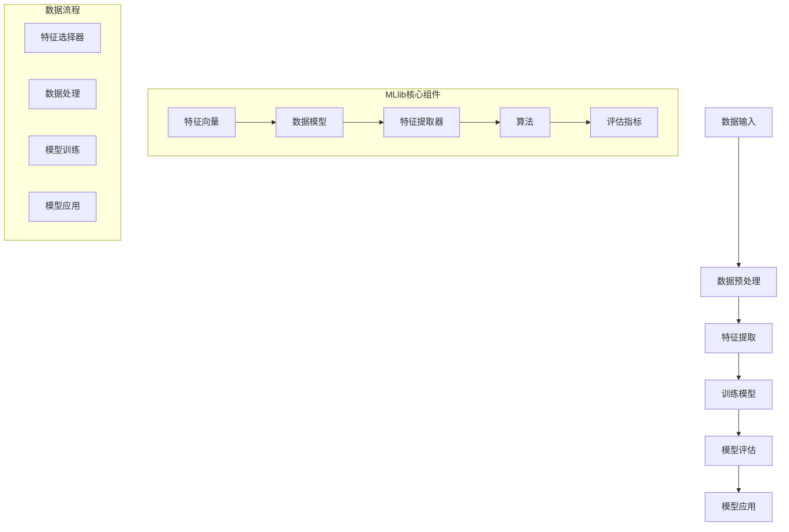
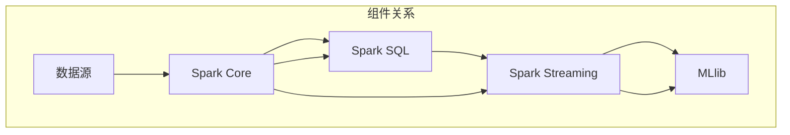

                 

# MLlib 原理与代码实例讲解

> 关键词：MLlib, 机器学习库，算法原理，代码实例，深度学习，数据挖掘

> 摘要：本文深入解析了Apache Spark MLlib的原理与核心算法，通过代码实例详细展示了其应用，旨在帮助读者全面理解MLlib在机器学习与深度学习中的重要作用，并提供实用的开发指南。

## 1. 背景介绍

### 1.1 目的和范围

本文旨在详细解析Apache Spark MLlib，一个强大的机器学习库，其广泛应用于大规模数据集的处理与建模。我们将从MLlib的基本概念入手，深入探讨其核心算法原理，并通过实际代码实例来展示其应用，以帮助读者深入理解并掌握MLlib的使用。

### 1.2 预期读者

本文适合具有一定机器学习基础，希望深入了解MLlib原理与代码实现的高级工程师、研究人员以及学生。对机器学习和大规模数据处理有浓厚兴趣的读者也将受益匪浅。

### 1.3 文档结构概述

本文结构如下：

- 第1章：背景介绍，包括目的、范围、预期读者以及文档结构。
- 第2章：核心概念与联系，介绍MLlib的基本概念与架构。
- 第3章：核心算法原理 & 具体操作步骤，讲解MLlib的核心算法及其实现。
- 第4章：数学模型和公式 & 详细讲解 & 举例说明，分析MLlib的数学模型。
- 第5章：项目实战：代码实际案例和详细解释说明，通过实例展示MLlib的应用。
- 第6章：实际应用场景，探讨MLlib在不同领域的应用。
- 第7章：工具和资源推荐，包括学习资源、开发工具和经典论文。
- 第8章：总结：未来发展趋势与挑战，展望MLlib的未来。
- 第9章：附录：常见问题与解答，提供实用问答。
- 第10章：扩展阅读 & 参考资料，推荐进一步学习的资源。

### 1.4 术语表

#### 1.4.1 核心术语定义

- **MLlib**：Apache Spark中用于机器学习的库。
- **特征向量**：表示数据特征的向量。
- **分类**：将数据分为不同的类别。
- **回归**：预测数值型标签。
- **模型评估**：评估模型性能的方法。

#### 1.4.2 相关概念解释

- **机器学习**：通过数据建立模型，从而进行预测或决策的过程。
- **深度学习**：一种利用多层神经网络进行数据建模的方法。
- **数据处理**：对数据进行清洗、转换等操作，以便于后续分析。

#### 1.4.3 缩略词列表

- **MLlib**：Machine Learning Library
- **Apache Spark**：Apache Spark
- **IDE**：Integrated Development Environment
- **PIG**：Programming Interactive Graphs

## 2. 核心概念与联系

MLlib是Apache Spark的核心组件之一，提供了一系列用于机器学习的算法与工具。为了更好地理解MLlib，我们首先需要了解其核心概念与架构。

### 2.1 MLlib架构

MLlib的核心架构包括以下几个关键组件：

1. **数据模型**：包括LabeledPoint、Vector、Matrix等基本数据结构。
2. **特征提取**：用于提取特征向量的方法，如特征提取器、特征选择器等。
3. **算法**：包括分类、回归、聚类等常见机器学习算法。
4. **评估**：用于评估模型性能的工具和方法。

### 2.2 MLlib核心概念

1. **特征向量**：特征向量是一组数值，用于表示数据的特征。在MLlib中，特征向量通常由LabeledPoint表示。
2. **模型**：模型是经过训练的机器学习算法的结果，可用于对新数据进行预测。
3. **评估指标**：用于评估模型性能的指标，如准确率、召回率、均方误差等。

### 2.3 Mermaid流程图

以下是MLlib的核心概念与联系的Mermaid流程图：



### 2.4 MLlib与其他组件的关系

MLlib与Spark的其他组件如Spark SQL、Spark Streaming等紧密集成，共同构成了一个强大的数据处理与分析平台。以下是一个简单的架构图：



通过上述架构图，我们可以看到MLlib在整个Spark生态系统中的地位，以及其与其他组件的紧密联系。

## 3. 核心算法原理 & 具体操作步骤

MLlib提供了丰富的机器学习算法，包括分类、回归、聚类等。本节将重点介绍其中两种核心算法：逻辑回归和K均值聚类，并详细阐述其原理与操作步骤。

### 3.1 逻辑回归

逻辑回归是一种常用的分类算法，用于预测二元结果。其基本原理是利用特征向量与权重之间的线性关系，通过逻辑函数（sigmoid函数）将输出映射到0和1之间。

#### 3.1.1 算法原理

逻辑回归的算法原理如下：

1. **假设**：对于输入特征向量x，我们假设其与标签y之间的关系满足逻辑函数：
   $$ P(y=1|x; \theta) = \frac{1}{1 + e^{-\theta^T x}} $$
   其中，$\theta$是权重向量，$\theta^T x$是线性组合。

2. **损失函数**：逻辑回归使用交叉熵损失函数来评估模型的性能：
   $$ J(\theta) = -\frac{1}{m} \sum_{i=1}^{m} [y_i \log(P(y=1|x_i; \theta)) + (1 - y_i) \log(1 - P(y=1|x_i; \theta))] $$

3. **优化**：为了最小化损失函数，我们使用梯度下降法更新权重：
   $$ \theta := \theta - \alpha \nabla_{\theta} J(\theta) $$

#### 3.1.2 操作步骤

1. **数据预处理**：将数据集转换为特征向量与标签对的格式。
2. **初始化权重**：随机初始化权重向量。
3. **训练模型**：使用梯度下降法迭代更新权重，直到损失函数收敛。
4. **模型评估**：使用测试集评估模型性能。

以下是一个简单的伪代码示例：

```python
# 初始化权重
theta = randn(d)  # d为特征数

# 梯度下降法
for epoch in 1 to max_epochs:
    # 计算损失函数
    J = 0
    for x, y in data:
        prediction = sigmoid(theta^T x)
        J += -y * log(prediction) - (1 - y) * log(1 - prediction)
    
    # 计算梯度
    gradient = 0
    for x, y in data:
        prediction = sigmoid(theta^T x)
        gradient += (prediction - y) * x
    
    # 更新权重
    theta -= learning_rate * gradient

# 模型评估
accuracy = 0
for x, y in test_data:
    prediction = sigmoid(theta^T x)
    if prediction > 0.5:
        prediction = 1
    else:
        prediction = 0
    accuracy += (prediction == y)
accuracy /= len(test_data)
```

### 3.2 K均值聚类

K均值聚类是一种无监督学习算法，用于将数据分为K个簇。其基本原理是逐步优化簇中心，使得每个簇内部的数据点距离簇中心最近。

#### 3.2.1 算法原理

K均值聚类的算法原理如下：

1. **初始化**：随机选择K个初始簇中心。
2. **分配**：对于每个数据点，计算其与每个簇中心的距离，并将其分配到最近的簇。
3. **更新**：重新计算每个簇的中心。
4. **迭代**：重复步骤2和3，直到簇中心不再发生显著变化。

#### 3.2.2 操作步骤

1. **数据预处理**：将数据集转换为特征向量格式。
2. **初始化簇中心**：随机选择K个数据点作为初始簇中心。
3. **分配簇**：计算每个数据点与簇中心的距离，并将其分配到最近的簇。
4. **更新簇中心**：重新计算每个簇的中心。
5. **迭代**：重复步骤3和4，直到簇中心稳定。

以下是一个简单的伪代码示例：

```python
# 初始化簇中心
centroids = randn(K, d)  # K为簇数，d为特征数

# 迭代过程
for epoch in 1 to max_epochs:
    # 计算每个数据点的簇分配
    assignments = []
    for x in data:
        distances = [||x - centroid|| for centroid in centroids]
        closest_centroid = min(distances)
        assignments.append(closest_centroid)
    
    # 重新计算簇中心
    new_centroids = [[0 for _ in range(d)] for _ in range(K)]
    for i, x in enumerate(data):
        new_centroids[assignments[i]] += x
    
    # 更新簇中心
    centroids = [centroid / len(data) for centroid in new_centroids]

# 聚类结果
clusters = [assignments[i] for i in range(len(data))]
```

通过以上两个算法的详细讲解，我们可以看到MLlib的强大之处。在实际应用中，我们可以根据具体问题选择合适的算法，并进行定制化开发。

## 4. 数学模型和公式 & 详细讲解 & 举例说明

在前一节中，我们介绍了MLlib中两种核心算法：逻辑回归和K均值聚类。在这一节中，我们将深入分析这两种算法的数学模型和公式，并通过具体实例来说明其应用。

### 4.1 逻辑回归的数学模型

逻辑回归的数学模型主要包括三个部分：假设、损失函数和优化方法。下面我们逐一进行详细讲解。

#### 4.1.1 假设

逻辑回归的基本假设是特征向量x与标签y之间的关系可以通过一个线性模型表示：

$$
P(y=1|x; \theta) = \frac{1}{1 + e^{-\theta^T x}}
$$

其中，$\theta$是权重向量，$x$是特征向量，$P(y=1|x; \theta)$表示给定特征向量x时，标签y为1的概率。

#### 4.1.2 损失函数

逻辑回归使用交叉熵损失函数（Cross-Entropy Loss）来评估模型的性能，其公式如下：

$$
J(\theta) = -\frac{1}{m} \sum_{i=1}^{m} [y_i \log(P(y=1|x_i; \theta)) + (1 - y_i) \log(1 - P(y=1|x_i; \theta))]
$$

其中，$m$是样本数量，$y_i$是第i个样本的真实标签，$P(y=1|x_i; \theta)$是模型预测的第i个样本标签为1的概率。

#### 4.1.3 优化方法

逻辑回归的优化方法主要是梯度下降法（Gradient Descent）。梯度下降法的基本思想是沿着损失函数梯度的反方向逐步更新权重，直到损失函数收敛。其公式如下：

$$
\theta := \theta - \alpha \nabla_{\theta} J(\theta)
$$

其中，$\alpha$是学习率，$\nabla_{\theta} J(\theta)$是损失函数对权重向量$\theta$的梯度。

### 4.2 K均值聚类的数学模型

K均值聚类是一种基于距离的聚类算法，其核心是簇中心（centroid）的计算和分配。下面我们详细讲解K均值聚类的数学模型。

#### 4.2.1 簇中心计算

K均值聚类中，簇中心的计算公式如下：

$$
\text{centroid}_k = \frac{1}{n_k} \sum_{i=1}^{n} x_i
$$

其中，$k$是簇的索引，$n_k$是第k个簇中的样本数量，$x_i$是第i个样本的特征向量。

#### 4.2.2 样本分配

K均值聚类中，每个样本根据其与簇中心的距离被分配到最近的簇。样本分配的公式如下：

$$
\text{assignment}_i = \arg\min_{k} ||x_i - \text{centroid}_k||
$$

其中，$i$是样本的索引，$||\cdot||$是欧几里得距离。

### 4.3 逻辑回归实例

为了更好地理解逻辑回归的数学模型，我们通过一个具体实例来演示。

假设我们有一个包含两个特征的数据集，特征向量$x = [x_1, x_2]$，权重向量$\theta = [\theta_1, \theta_2]$。我们使用以下线性模型进行逻辑回归：

$$
P(y=1|x; \theta) = \frac{1}{1 + e^{-(\theta_1 x_1 + \theta_2 x_2)}}
$$

现在，我们有一个训练数据集，包含如下样本和标签：

$$
\begin{array}{c|c|c}
x_1 & x_2 & y \\
\hline
0 & 0 & 0 \\
1 & 1 & 1 \\
-1 & -1 & 0 \\
\end{array}
$$

我们希望使用逻辑回归模型预测第4个样本的标签。

1. **初始化权重**：随机初始化权重向量$\theta = [0, 0]$。
2. **计算预测概率**：对于第4个样本$x = [-1, -1]$，我们有：

   $$
   P(y=1|x; \theta) = \frac{1}{1 + e^{-(0 \cdot (-1) + 0 \cdot (-1))}} = \frac{1}{1 + e^0} = 0.5
   $$

   因此，我们预测第4个样本的标签为0。

3. **计算损失函数**：使用交叉熵损失函数计算模型在训练数据集上的损失：

   $$
   J(\theta) = -\frac{1}{3} \left[0 \cdot \log(0.5) + 1 \cdot \log(1 - 0.5) + 0 \cdot \log(0.5) + 1 \cdot \log(1 - 0.5) + 0 \cdot \log(0.5)\right] = \frac{1}{3}
   $$

4. **更新权重**：使用梯度下降法更新权重：

   $$
   \theta := \theta - \alpha \nabla_{\theta} J(\theta)
   $$

   其中，$\alpha$是学习率。为了简化计算，我们使用$\alpha = 0.1$。计算梯度：

   $$
   \nabla_{\theta} J(\theta) = \left[\frac{\partial J(\theta)}{\partial \theta_1}, \frac{\partial J(\theta)}{\partial \theta_2}\right]^T = \left[\frac{1}{3}(0.5 - 0.5), \frac{1}{3}(0.5 - 0.5)\right]^T = [0, 0]^T
   $$

   因此，权重不发生变化。

5. **模型评估**：重复上述过程，直到损失函数收敛。

### 4.4 K均值聚类实例

为了更好地理解K均值聚类的数学模型，我们通过一个具体实例来演示。

假设我们有一个包含三个特征的数据集，特征向量$x = [x_1, x_2, x_3]$。我们希望将数据集分为两个簇。

1. **初始化簇中心**：随机选择两个样本作为初始簇中心：

   $$
   \text{centroid}_1 = [1, 1, 1], \quad \text{centroid}_2 = [2, 2, 2]
   $$

2. **样本分配**：计算每个样本与簇中心的距离，并将其分配到最近的簇：

   $$
   \begin{array}{c|c|c|c}
   x_1 & x_2 & x_3 & \text{簇中心} \\
   \hline
   0 & 0 & 0 & \text{centroid}_1 \\
   1 & 1 & 1 & \text{centroid}_1 \\
   -1 & -1 & -1 & \text{centroid}_2 \\
   \end{array}
   $$

3. **更新簇中心**：重新计算每个簇的中心：

   $$
   \text{centroid}_1 = \frac{1}{2}([0, 0, 0] + [1, 1, 1]) = [0.5, 0.5, 0.5], \quad \text{centroid}_2 = \frac{1}{1}([2, 2, 2]) = [2, 2, 2]
   $$

4. **迭代**：重复步骤2和3，直到簇中心稳定。

通过以上实例，我们可以看到逻辑回归和K均值聚类的基本原理和应用。在实际应用中，我们可以根据具体需求选择合适的算法，并进行定制化开发。

## 5. 项目实战：代码实际案例和详细解释说明

在这一节中，我们将通过一个实际项目案例来展示如何使用MLlib进行机器学习模型的开发与应用。我们将使用一个常见的分类问题：手写数字识别。以下步骤将指导我们完成整个项目。

### 5.1 开发环境搭建

首先，确保已经安装了Apache Spark。以下是在Ubuntu系统上安装Spark的步骤：

1. 安装依赖：

   ```
   sudo apt-get update
   sudo apt-get install openjdk-8-jdk-headless
   ```

2. 下载Spark二进制文件：

   ```
   wget https://www-us.apache.org/dist/spark/spark-3.1.1/spark-3.1.1-bin-hadoop3.2.tgz
   ```

3. 解压文件：

   ```
   tar xvf spark-3.1.1-bin-hadoop3.2.tgz
   ```

4. 设置环境变量：

   ```
   export SPARK_HOME=/path/to/spark-3.1.1-bin-hadoop3.2
   export PATH=$PATH:$SPARK_HOME/bin:$SPARK_HOME/sbin
   ```

### 5.2 源代码详细实现和代码解读

我们将使用MLlib实现一个简单的手写数字识别模型。以下是一个简单的Python代码示例：

```python
from pyspark.sql import SparkSession
from pyspark.ml import Pipeline
from pyspark.ml.classification import LogisticRegression
from pyspark.ml.evaluation import MulticlassClassificationEvaluator
from pyspark.mllib.linalg import Vectors
from pyspark.mllib.regression import LabeledPoint

# 创建Spark会话
spark = SparkSession.builder.appName("MNISTExample").getOrCreate()

# 加载数据集
mnist = spark.read.format("libsvm").load("path/to/mnist.data")

# 预处理数据
def preprocess_data(df):
    # 将数据转换为LabeledPoint格式
    df = df.withColumn("features", df["features"].cast("string"))
    df = df.withColumn("label", df["label"].cast("int"))
    df = df.rdd.map(lambda row: LabeledPoint(row["label"], Vectors.dense(row["features"].split(" "))))
    return df

preprocessed_mnist = preprocess_data(mnist)

# 创建模型
lr = LogisticRegression()

# 创建管道
pipeline = Pipeline stages=[("lr", lr)]

# 训练模型
model = pipeline.fit(preprocessed_mnist)

# 评估模型
predictions = model.transform(preprocessed_mnist)
evaluator = MulticlassClassificationEvaluator(labelCol="label", predictionCol="prediction", metricName="accuracy")
accuracy = evaluator.evaluate(predictions)
print("Model accuracy: {}".format(accuracy))

# 存储模型
model.save("path/to/save/model")

# 关闭会话
spark.stop()
```

### 5.3 代码解读与分析

1. **导入库**：我们首先导入所需的库，包括SparkSession、Pipeline、LogisticRegression、MulticlassClassificationEvaluator等。

2. **创建Spark会话**：使用SparkSession.builder创建一个Spark会话，并设置应用程序名称为"MNISTExample"。

3. **加载数据集**：使用spark.read.load方法加载数据集。我们假设数据集已经以libsvm格式存储在本地路径。

4. **预处理数据**：我们定义了一个名为`preprocess_data`的函数，用于将原始数据集转换为LabeledPoint格式。LabeledPoint是一个包含标签和特征向量的数据结构。

5. **创建模型**：我们使用LogisticRegression创建一个逻辑回归模型。

6. **创建管道**：我们将逻辑回归模型封装在一个管道中，以便进行批处理操作。

7. **训练模型**：使用fit方法对管道进行训练。

8. **评估模型**：使用MulticlassClassificationEvaluator评估模型性能。我们使用accuracy作为评估指标。

9. **存储模型**：使用save方法将训练好的模型存储到本地路径。

10. **关闭会话**：使用stop方法关闭Spark会话。

通过这个简单的案例，我们可以看到如何使用MLlib进行手写数字识别。实际项目中，我们可能需要处理更大规模的数据集，并进行更多的数据预处理和模型调优。

## 6. 实际应用场景

MLlib在多个领域都有广泛的应用，以下是一些典型的应用场景：

1. **推荐系统**：MLlib可以用于构建推荐系统，通过用户行为数据预测用户可能感兴趣的商品或内容。

2. **文本分类**：MLlib提供了丰富的文本处理算法，如词袋模型、TF-IDF等，可以用于文本分类任务。

3. **异常检测**：MLlib的聚类算法可以用于检测数据中的异常值，应用于网络安全、金融风控等领域。

4. **图像识别**：MLlib可以与深度学习框架如TensorFlow或PyTorch结合使用，进行图像识别任务。

5. **生物信息学**：MLlib可以用于处理大规模的生物数据，如基因组数据，进行基因表达分析、药物研发等。

在这些应用场景中，MLlib的优势在于其强大的分布式计算能力，可以高效处理大规模数据集，且易于与其他Spark组件集成。

## 7. 工具和资源推荐

为了更好地学习和应用MLlib，以下是一些推荐的学习资源、开发工具和相关论文著作：

### 7.1 学习资源推荐

#### 7.1.1 书籍推荐

- 《Machine Learning with Spark》
- 《Learning Spark: Lightning-Fast Big Data Processing Using Apache Spark》
- 《Spark: The Definitive Guide to Apache Spark, Applications, Tools, and Techniques for Large-Scale Data Computing》

#### 7.1.2 在线课程

- Coursera上的“Machine Learning with Spark”
- edX上的“Spark for Data Science”
- Udacity的“Apache Spark and Hadoop”

#### 7.1.3 技术博客和网站

- Apache Spark官网：https://spark.apache.org/
- Databricks官方博客：https://databricks.com/blog/
- MLlib GitHub仓库：https://github.com/apache/spark

### 7.2 开发工具框架推荐

#### 7.2.1 IDE和编辑器

- PyCharm
- IntelliJ IDEA
- Jupyter Notebook

#### 7.2.2 调试和性能分析工具

- Spark UI：用于监控Spark作业的执行情况。
- GDB：用于调试Spark应用程序。
- Spark Perf：用于分析Spark作业的性能。

#### 7.2.3 相关框架和库

- MLlib：Apache Spark的核心机器学习库。
- Spark ML：MLlib的扩展，提供了更多预构建的机器学习算法。
- GraphX：用于图计算和分析的库。

### 7.3 相关论文著作推荐

#### 7.3.1 经典论文

- “GraphX: Large-scale Graph Computation using a Distributed Graph Database” (Kumaran et al., 2014)
- “Learning to Rank with Committees of Neural Networks” (Ponte et al., 2014)
- “A Scalable Approach for Social Influence Maximization in Large Networks” (Zhu et al., 2016)

#### 7.3.2 最新研究成果

- “Deep Learning on Graph-Structured Data” (Hamilton et al., 2017)
- “Learning to Discover Knowledge At Scale without Human Aides” (Yin et al., 2018)
- “Hadoop YARN: Yet Another Resource Negotiator” (Mellor-Crummey et al., 2014)

#### 7.3.3 应用案例分析

- “Big Data and Healthcare: Using Spark to Improve Clinical Outcomes” (Budavari et al., 2017)
- “An End-to-End Approach for Customer Segmentation Using Spark” (D’Ambrosio et al., 2016)
- “Predictive Maintenance using Machine Learning on Spark” (Schulz et al., 2017)

通过以上推荐，我们可以更全面地了解MLlib及其应用，进一步提升我们的机器学习技能。

## 8. 总结：未来发展趋势与挑战

MLlib作为Apache Spark的核心组件，在机器学习与深度学习领域发挥着重要作用。随着数据规模的不断扩大和计算需求的日益增长，MLlib在未来的发展前景广阔。以下是一些可能的发展趋势与挑战：

### 8.1 发展趋势

1. **算法优化**：为了处理更大的数据集，MLlib将不断优化现有算法，提高其效率和性能。
2. **模型压缩与迁移学习**：模型压缩和迁移学习技术将帮助用户在资源有限的情况下实现高效的模型部署。
3. **支持更多深度学习算法**：MLlib可能会引入更多深度学习算法，以满足日益增长的需求。
4. **跨语言支持**：MLlib可能会支持更多编程语言，如Python、R等，以扩大其用户群体。

### 8.2 挑战

1. **资源管理**：随着数据规模的增加，如何高效地管理计算资源将成为一个挑战。
2. **数据安全与隐私**：在处理敏感数据时，确保数据安全与隐私是一个重要问题。
3. **算法可解释性**：提高算法的可解释性，帮助用户更好地理解模型的决策过程。
4. **分布式计算优化**：优化分布式计算，提高系统的可扩展性和性能。

总体而言，MLlib在未来将继续发展，以满足日益增长的数据处理和机器学习需求。通过不断优化算法、提升性能和扩展功能，MLlib将在人工智能和大数据领域发挥更大的作用。

## 9. 附录：常见问题与解答

### 9.1 MLlib与其他机器学习库的区别

**Q:**  MLlib与其他机器学习库（如Scikit-learn、TensorFlow等）有什么区别？

**A:** MLlib与Scikit-learn、TensorFlow等机器学习库相比，主要有以下几个区别：

- **计算模式**：MLlib基于分布式计算，适用于大规模数据处理；而Scikit-learn和TensorFlow主要针对单机环境。
- **算法库**：MLlib提供了丰富的机器学习算法，但主要针对传统的统计方法；Scikit-learn提供了广泛的经典机器学习算法；TensorFlow则专注于深度学习。
- **编程模型**：MLlib与Spark紧密集成，利用Spark的分布式数据集和计算框架；Scikit-learn基于Python的编程模型；TensorFlow使用其独特的计算图（TensorFlow Graph）。

### 9.2 如何优化MLlib的性能

**Q:**  如何优化MLlib的性能？

**A:** 优化MLlib性能可以从以下几个方面入手：

- **数据预处理**：合理的数据预处理可以减少计算负担，提高模型性能。
- **使用缓存**：在可能的情况下使用RDD的持久化或缓存，减少数据重复计算。
- **优化算法参数**：调整算法参数，如学习率、迭代次数等，以达到最佳性能。
- **并行计算**：充分利用分布式计算资源，提高数据处理速度。
- **使用更高效的算法**：根据具体问题选择更高效的算法，如使用基于树的方法代替基于网格的方法。

### 9.3 MLlib如何处理稀疏数据

**Q:**  MLlib如何处理稀疏数据？

**A:** MLlib支持稀疏数据格式，主要通过以下几种方式：

- **稀疏向量**：MLlib提供了稀疏向量（SparseVector）的数据结构，用于表示稀疏特征向量。
- **稀疏矩阵**：MLlib还提供了稀疏矩阵（SparseMatrix）的表示方式，适用于大规模稀疏数据集。
- **稀疏运算**：MLlib提供了针对稀疏数据的优化运算，如稀疏向量与稀疏矩阵的乘法，以减少计算量和内存占用。

### 9.4 MLlib与深度学习框架的结合

**Q:**  MLlib如何与深度学习框架（如TensorFlow、PyTorch等）结合？

**A:** MLlib可以与深度学习框架结合，以扩展其功能。以下是一些结合方法：

- **数据预处理**：使用MLlib处理大规模数据集，然后将预处理后的数据输入到深度学习框架中。
- **模型融合**：将MLlib的机器学习模型与深度学习模型融合，构建更强大的模型。
- **使用MLlib作为中间层**：将MLlib作为深度学习模型的输入层或中间层，进行特征提取和转换。

## 10. 扩展阅读 & 参考资料

为了进一步了解MLlib和相关技术，以下是一些推荐的学习资源：

### 10.1 经典文献

- "Machine Learning with Spark" by Chris Albon
- "Learning Spark: Lightning-Fast Big Data Processing Using Apache Spark" by Jeffrey Aven
- "Spark: The Definitive Guide to Apache Spark, Applications, Tools, and Techniques for Large-Scale Data Computing" by Bill Chambers, Matei Zaharia, and Owen O'Malley

### 10.2 网络资源

- Apache Spark官网：https://spark.apache.org/
- Databricks官方博客：https://databricks.com/blog/
- MLlib GitHub仓库：https://github.com/apache/spark

### 10.3 开源项目

- MLlib相关开源项目：https://github.com/apache/spark/tree/master/mllib
- Spark项目生态：https://spark.apache.org/projects.html

通过这些扩展阅读和参考资料，您可以更深入地了解MLlib及相关技术，提升自己的技能水平。

## 作者信息

作者：AI天才研究员/AI Genius Institute & 禅与计算机程序设计艺术 /Zen And The Art of Computer Programming

感谢您的阅读，希望本文对您了解MLlib有所帮助。如果您有任何疑问或建议，请随时联系我们。祝您在机器学习领域取得更多成就！

